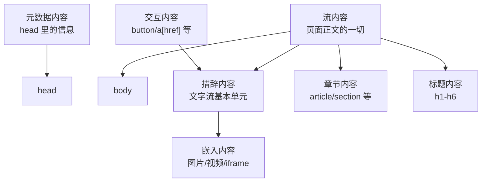

## 0. 学习目标（可验证）

- [ ] 能说出内容模型的七大类，并各举一个代表标签
- [ ] 能解释"为什么 `<span>` 不能包 `<div>`"的正确原因（措辞内容不能包含流内容）
- [ ] 能说出 `<p>`、`<button>`、`<ul>` 各自的"只能装什么"
- [ ] 遇到"标签套错"的报错时，能根据矩阵定位问题

## 1. 一句话理解

> 块级/行内是"粗略二分法"，内容模型是"正式成分表"：每个标签能装什么、能被谁装，规范里写得清清楚楚。嵌套报错十有八九是"装错了东西"。

002 课讲的块级/行内解决"占不占一行"，但回答不了两个问题：

1. 为什么 `<p>` 里放 `<div>` 会出问题？（它们都是块级！）
2. 为什么 `<button>` 里不能放 `<div>`？

答案都在内容模型（Content Categories）里。它不是新知识，而是给 002 课的"盒子观"补上正式规则。

## 2. 七大类内容

| 类别 | 通俗理解 | 代表标签 |
| --- | --- | --- |
| 元数据内容（Metadata） | "关于页面本身的信息" | `head`、`title`、`meta`、`link`、`style`、`base` |
| 流内容（Flow） | "页面正文里能出现的一切" | `div`、`p`、`h1`-`h6`、`ul`、`table`、`form`、`img` |
| 章节内容（Sectioning） | "能自成一块区域的结构" | `article`、`aside`、`nav`、`section` |
| 标题内容（Heading） | "区域的名字" | `h1`-`h6`、`hgroup` |
| 措辞内容（Phrasing） | "文字流内部的基本单元" | `span`、`a`、`strong`、`em`、`img`、`code`、`button` |
| 嵌入内容（Embedded） | "把外部资源嵌进来" | `img`、`iframe`、`video`、`canvas`、`svg`、`audio` |
| 交互内容（Interactive） | "用户能操作的东西" | `a[href]`、`button`、`input`、`select`、`textarea` |



关键关系（记这三条就够用）：

1. **措辞内容是流内容的子集**：措辞内容能出现的地方，流内容都能出现；
2. **嵌入内容是措辞内容的子集**：所以 `` 能放进 `<p>`、`<span>` 里；
3. **交互内容不能互相嵌套**：`<button>` 里不能再放 `<a>`。

## 3. 为什么 span 不能包 div

002 课说"行内不能包块级"，这只描述了现象。正式原因是：

```text
div 属于流内容，span 只能包含措辞内容
措辞内容不能包含流内容 → span 不能包 div
```

同理可以推出整条"嵌套铁律"：

| 写法 | 是否合法 | 原因 |
| --- | --- | --- |
| `<span><div>...</div></span>` | 不合法 | span（措辞）不能包含 div（流） |
| `<p><div>...</div></p>` | 不合法 | p 只能包含措辞内容 |
| `<button><div>...</div></button>` | 不合法 | button 只能包含措辞内容 |
| `<a><a>...</a></a>` | 不合法 | 交互内容不能嵌套交互内容 |
| `<ul><div>...</div></ul>` | 不合法 | ul 只允许 li |
| `<h1><span>文字</span></h1>` | 合法 | h1 属于流内容，可包含措辞内容 |
| `<p></p>` | 合法 | img 是嵌入内容，属于措辞内容 |

## 4. "谁是谁的父级"速查矩阵

| 父级 | 允许的直接子级 | 记法 |
| --- | --- | --- |
| `<html>` | `head` + `body` | 文档只有这两个大区 |
| `<head>` | 元数据内容（`meta`/`title`/`link`/`style`/`base`/`script`） | 只放"关于页面的信息" |
| `<body>` | 流内容 | 正文里能出现的一切 |
| `<p>` | 措辞内容 | 段落是"文字容器" |
| `<span>` | 措辞内容 | 行内小挂件只能装文字级内容 |
| `<button>` | 措辞内容（不含交互内容） | 按钮里只能放文字/图标 |
| `<ul>`/`<ol>` | `<li>` | 列表只能装列表项 |
| `<li>` | 流内容 | 列表项里可以装任意正文 |
| `<a>`（有 href） | 流内容（不含交互内容） | 链接可以包整块卡片，但不能套按钮 |
| 章节内容（`section`/`article` 等） | 流内容（建议含标题内容） | 区域要有一个"名字"（h1-h6） |

## 5. 常见报错场景与修法

| 报错/现象 | 原因 | 正确写法 |
| --- | --- | --- |
| 页面里 `<div>` 自动从 `<p>` 里"跑出来" | p 不能包含流内容，浏览器自动修正 | 把 div 移到 p 外面，或改用 span |
| 点击按钮没反应，结构错乱 | button 里放了 div/ul | button 内只放文字或 span |
| 列表渲染出奇怪的额外项 | ul 里直接放了 div | ul 里只写 li，div 放在 li 内部 |
| 一个按钮里套了链接 | 交互内容不能嵌套 | 二选一：按钮或链接 |
| 表单区域结构乱了 | form 里直接放了 table 等（这是合法的） | 先确认是"内容模型问题"还是"CSS 问题" |

> 补充：浏览器对很多嵌套错误会"宽容修正"（把非法子级挪到外面），页面看起来能跑，但 DOM 结构和你写的不一样，样式和脚本都会踩坑。所以写完后按 F12 检查 Elements 面板，是发现嵌套问题的最快方式。

## 6. 动手试试

### 入门版

1. 故意写 `<p><div>内容</div></p>`，按 F12 观察浏览器如何自动把 div 挪到 p 外面；
2. 故意写 `<button><div>按钮</div></button>`，观察按钮的渲染异常；
3. 把 4 节矩阵里"合法"的例子各写一个，确认都能正常显示。

### 进阶版

1. 写一个 `<a href="#">` 包住整张卡片（含标题、图片、段落）的代码，验证"链接可以包流内容"；
2. 用 W3C 校验器（validator.w3.org）校验一个有嵌套错误的页面，读懂报错里出现的 "element p not allowed as child of element span" 这类信息。

## 7. 常见问题与改进建议

| 常见问题 | 原因 | 改进建议 |
| --- | --- | --- |
| 只记块级/行内，嵌套还是报错 | 二分法覆盖不了 p/button/ul 的特殊规则 | 用本文矩阵，p/button/span 只装措辞内容 |
| 以为浏览器报错才算错 | 浏览器会自动修正，不报错 | 养成 F12 看 Elements 的习惯 |
| 交互内容层层嵌套 | 没意识到交互内容不能互相包含 | 一个可点击区域只保留一个交互元素 |
| 记不住全部类别 | 分类名称抽象 | 只背三条：措辞装不了流、段落装不了流、交互不套交互 |

## 8. 下一步

内容模型是"标签关系"的正式规则，配合 010-SemanticTag（语义化章节结构）使用：先知道谁能装谁，再知道装什么最有语义。
