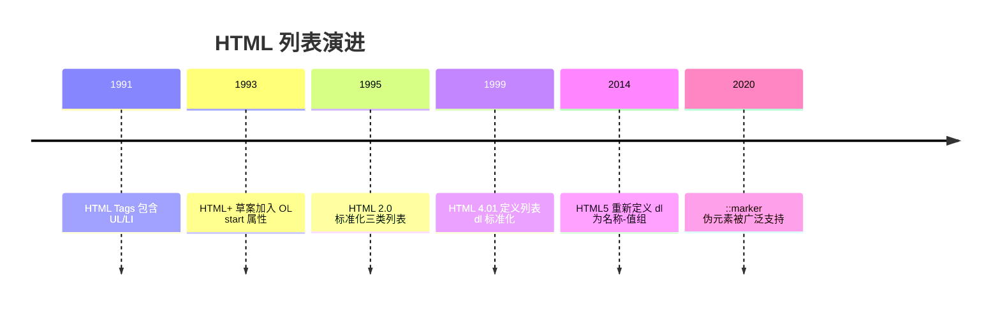
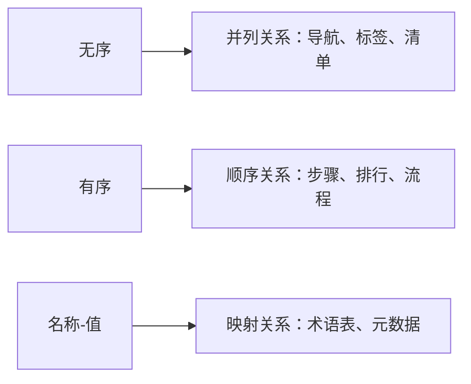

## 前置知识

建议先阅读以下内容再进入本文：

- [HTML5 概述与核心特性](/html5/020-HTML5OverviewCoreFeature)

> 0基础速通：直接读第 2 章三类列表速览、第 4 章代码示例与第 9 章核心知识点；第 1 章历史与第 3 章原理可跳过。

## 1. 历史动机与发展脉络

列表是 HTML 最早的语义元素之一。Tim Berners-Lee 在 1991 年发布的 HTML 初版（HTML Tags）中就有 `<UL>` 与 `<LI>`，因为 Web 的初衷是共享学术文档，而学术文档中目录、参考条目天然是列表结构。1993 年 HTML+ 草案加入 `<OL>` 的 `start` 属性；1995 年 HTML 2.0 将三类列表标准化；HTML 4.01（1999 年）把 `<dl>` 定义为定义列表；HTML5（2014 年）重新定义 `<dl>` 为名称-值组列表，并新增 `<menu>` 与 `<hr>` 语义调整。

CSS 的发展让列表表现力大幅提升：CSS 2.1 提供 `list-style-type` 与 `list-style-image`；CSS Pseudo-Elements Level 4 引入 `::marker` 伪元素，使标记本身可定制样式（颜色、字体、内容）。与此同时，现代 Web 开发中列表常被 `div + flex/grid` 模拟，但这种做法牺牲了语义，因此 HTML 规范与无障碍指南（WCAG）一直强调优先使用原生列表。



## 2. 形式化定义

无序列表 `<ul>`：内容模型为零个或多个 `<li>` 元素（可包含脚本支持元素）。`<ul>` 表达“项目集合，顺序不构成信息”的结构。

有序列表 `<ol>`：内容模型与 `<ul>` 相同，但表达“顺序构成信息”的结构。HTML5 的属性：`reversed`（布尔属性，倒序编号）、`start`（起始编号整数）、`type`（编号类型：`1`、`a`、`A`、`i`、`I`）。注意 `type` 在 HTML5 中不再是推荐属性，官方建议用 CSS `list-style-type` 控制外观，编号语义由 `start`/`reversed`/`value` 保持。

定义列表 `<dl>`：内容模型为若干组 `<dt>`（名称）与 `<dd>`（值），一组可以包含多个 `<dt>` 或多个 `<dd>`。`<dl>` 表达名称-值对的集合，典型场景：术语表、元数据、问答对、配置项说明。

列表项 `<li>`：`value` 属性（仅 `<ol>` 中生效）可以显式指定该项的编号，后续项在 `value + 1` 基础上继续。

约束：`<li>` 的父元素必须是 `<ul>`、`<ol>` 或 `<menu>`；`<dt>`/`<dd>` 的父元素必须是 `<dl>`。违反内容模型时，HTML 解析器会执行错误恢复，但渲染结果可能与预期不同。



## 3. 理论推导与原理解析

### 3.1 列表编号的算法推导

有序列表的编号由 CSS 计数器实现。浏览器为每个 `<ol>` 建立计数器 `list-item`，初始值为 `start`（默认 1），`reversed` 时初始值为列表项总数；每个 `<li>` 渲染时先递增计数器，再显示编号；`value` 属性直接覆盖当前项的计数值。

因此嵌套列表的编号互不干扰：每个 `<ol>` 都有自己的计数器作用域。利用这一机制，`<li value="10">` 可以跳号，`<ol reversed>` 自动倒序，无需手工维护数字。

### 3.2 ::marker 的渲染模型

CSS 的 `::marker` 伪元素代表列表项的标记盒。默认标记由 `list-style-type` 决定（`disc`、`decimal`、`lower-alpha` 等）。设置 `::marker { content: "→ "; color: red; }` 后，标记盒的内容与样式完全自定义。列表项的主内容与标记盒之间可以用 `list-style-position: inside/outside` 控制位置，outside 时标记位于主盒外（默认，缩进排版）；inside 时标记成为主内容的一部分（如段落内编号）。

### 3.3 列表与可访问性

屏幕阅读器（如 NVDA、VoiceOver）遇到 `<ul>` 会播报“列表，共 N 项”，用户可以通过列表导航快捷键在条目间跳转。若用 `div` 模拟列表，这些能力全部丢失。WCAG 2.1 的成功标准 1.3.1（Info and Relationships）要求“通过内容结构传达的信息、结构与关系必须以编程方式确定”，原生列表正是满足该标准的基础设施。

## 4. 代码示例（带详尽注释）

### 4.1 无序列表基础

```html
<ul>
  <li>HTML 结构语义</li>
  <li>CSS 表现样式</li>
  <li>JavaScript 交互行为</li>
</ul>
```

讲解：三个并列知识点构成一个集合，顺序无关紧要，因此使用 `<ul>`。默认渲染为圆点标记；这是 Web 开发三大支柱的经典列表表达。

### 4.2 有序列表与属性

```html
<!-- 步骤流程：顺序重要，必须使用 ol -->
<ol>
  <li>安装 Node.js 20 LTS</li>
  <li>克隆项目仓库</li>
  <li>执行 pnpm install</li>
  <li>启动开发服务器</li>
</ol>

<!-- 从第 5 步开始编号：start 属性 -->
<ol start="5">
  <li>创建数据库</li>
  <li>运行迁移脚本</li>
</ol>

<!-- 倒序编号：reversed 属性 -->
<ol reversed>
  <li>检查日志输出</li>
  <li>重启服务</li>
  <li>部署新版本</li>
</ol>
```

讲解：`start` 与 `reversed` 是纯结构属性，无论 CSS 是否加载，编号语义都正确。`reversed` 的典型场景是“发布前检查清单从高到低展示”。

### 4.3 显式编号 value

```html
<ol>
  <li>准备工作</li>
  <li value="10">跳过中间步骤，直接到第十项</li>
  <li>后续自动从 11 继续</li>
</ol>
```

讲解：`value` 用于跨列表片段延续编号或跳号。注意 `value` 只对 `<ol>` 中的 `<li>` 生效，在 `<ul>` 中会被忽略。

### 4.4 定义列表

```html
<dl>
  <dt>HTTP</dt>
  <dd>超文本传输协议，Web 应用的基础请求-响应协议。</dd>

  <dt>HTTPS</dt>
  <dd>HTTP 的安全版本，通过 TLS 加密传输内容。</dd>
</dl>
```

讲解：每个 `<dt>` 是名称，对应一个或多个 `<dd>` 是说明。HTML5 规范去掉了“必须成对”的限制，一组可以有多名称（如多个同义词）或多值（如多个定义来源）。

```html
<dl>
  <dt>别名一</dt>
  <dt>别名二</dt>
  <dd>共同指向的说明内容</dd>
</dl>
```

### 4.5 嵌套列表

```html
<ul>
  <li>前端
    <ul>
      <li>HTML</li>
      <li>CSS</li>
      <li>JavaScript</li>
    </ul>
  </li>
  <li>后端
    <ul>
      <li>Java</li>
      <li>Go</li>
      <li>Python</li>
    </ul>
  </li>
</ul>
```

讲解：嵌套列表表达层级关系，子列表必须放在 `<li>` 内部（而不是 `<li>` 之后），这是 HTML 内容模型的硬性要求。浏览器对错误嵌套有容错，但正确嵌套才能保证语义与样式稳定。

### 4.6 CSS 自定义标记

```css
/* 移除默认标记 */
.plain {
  list-style: none;
}

/* 自定义标记内容与颜色 */
.arrow li::marker {
  content: "→ ";
  color: #c00;
  font-weight: bold;
}

/* 自定义编号格式：中文序号 */
.cn ol {
  list-style-type: cjk-ideographic;
}
```

讲解：`list-style: none` 是导航菜单的标配；`::marker` 允许完全控制标记的视觉表现；`cjk-ideographic` 等 CSS 计数器样式让中文文档获得原生中文编号。注意 `::marker` 只能设置字体、颜色、内容等有限属性，布局类属性需作用于 `<li>` 本身。

### 4.7 计数器实现复杂编号

```css
/* 章节标题编号：外层章节 + 内层小节 */
.doc {
  counter-reset: chapter;
}
.doc h2 {
  counter-increment: chapter;
}
.doc h2::before {
  content: "第 " counter(chapter, cjk-ideographic) " 章 ";
}
```

讲解：CSS 计数器是列表编号机制的通用化。`counter-reset` 创建计数器，`counter-increment` 递增，`counter()` 输出。该机制可对任意元素编号，是文档自动化排版的重要工具。

### 4.8 面包屑导航

```html
<!-- 面包屑：层级关系 + 当前位置 -->
<nav aria-label="面包屑">
  <ol>
    <li><a href="/">首页</a></li>
    <li><a href="/docs/">文档</a></li>
    <li aria-current="page">列表教程</li>
  </ol>
</nav>
```

讲解：面包屑使用 `<ol>` 表达访问路径的顺序语义，`aria-current="page"` 标记当前页。CSS 中用 `li + li::before { content: "/" }` 添加分隔符，无需在 HTML 中插入符号。

## 5. 对比分析

### 5.1 三类列表对比

| 维度 | ul | ol | dl |
| --- | --- | --- | --- |
| 语义 | 集合 | 序列 | 名称-值映射 |
| 编号 | 无 | 自动编号 | 无 |
| 子元素 | li | li | dt/dd |
| 典型场景 | 菜单、标签 | 步骤、排行 | 术语、元数据 |

### 5.2 列表与表格对比

二维数据（多列多行）用表格；一维集合/序列用列表；名称-值对用 `dl` 或表格取决于数据形态。判断标准是数据结构维度：列表是一维结构，表格是二维结构。

### 5.3 原生列表与 div 模拟对比

原生列表免费获得：屏幕阅读器条目播报、SEO 结构识别、CSS 计数器编号、默认缩进与标记。div 模拟则需要手工添加 aria 属性、计数器与样式，且容易遗漏。结论：优先原生列表，样式用 CSS 覆盖。

## 6. 常见陷阱与最佳实践

陷阱一：把 `<li>` 直接放在 `<ul>` 之外，或把列表项直接写成文本。解析器会生成匿名列表项或把文本移出列表，样式错乱。

陷阱二：嵌套列表放在 `<li>` 之后而不是内部，导致层级错误。

陷阱三：用 `type="disc"` 等 HTML 属性控制标记。HTML5 已不推荐，应使用 CSS `list-style-type`。

陷阱四：在 `<ul>` 上设置 `value` 期待编号，`value` 仅对 `<ol>` 生效。

陷阱五：菜单使用 `div` 而非 `<ul>`。导航应使用 `<nav>` 包裹 `<ul>`，获得完整的语义与可访问性。

陷阱六：`::marker` 与 `li::before` 混淆。两者都可以显示前缀，但 `::marker` 受列表机制约束更少、更推荐用于标记定制；`li::before` 用于内容前缀。

最佳实践：列表语义选型三问——顺序是否重要（ol/ul）、是否有名称-值映射（dl）、是否一维（列表）还是二维（表格）。

## 7. 工程实践

### 7.1 组件化列表渲染

以 Vue 3 为例，把列表渲染封装为通用组件：

```vue
<script setup>
// 接收条目数据与渲染插槽，复用列表样式
defineProps<{
  items: Array<{ key: string; label: string }>
  ordered?: boolean
}>()
</script>

<template>
  <!-- 根据 ordered 决定 ul/ol，语义由数据驱动 -->
  <component :is="ordered ? 'ol' : 'ul'" class="item-list">
    <li v-for="item in items" :key="item.key">
      <slot name="item" :item="item">{{ item.label }}</slot>
    </li>
  </component>
</template>
```

讲解：`<component :is>` 动态切换 `ul/ol`，插槽允许调用方自定义条目内容。这样列表语义、样式与数据解耦。

### 7.2 文章目录生成

```js
// 从 h2/h3 标题生成目录数据
function buildToc(root) {
  return Array.from(root.querySelectorAll('h2, h3')).map((h) => ({
    level: h.tagName === 'H2' ? 1 : 2,
    text: h.textContent,
    id: h.id
  }))
}
```

讲解：目录本质是文档标题的层级列表，渲染为嵌套 `<ul>` 并配合锚点链接。生成时机应在标题 id 分配之后。

## 8. 案例研究：完整实现一个语义化步骤条

需求：订单流程展示（提交订单 → 支付 → 发货 → 完成），要求语义正确、样式现代化、支持当前步骤高亮。

```html
<!-- 语义结构：ol 表达流程顺序 -->
<ol class="steps">
  <li class="done"><span>1</span>提交订单</li>
  <li class="active" aria-current="step"><span>2</span>支付</li>
  <li><span>3</span>发货</li>
  <li><span>4</span>完成</li>
</ol>
```

```css
.steps {
  display: flex;
  list-style: none;
  gap: 8px;
}
.steps li {
  flex: 1;
  text-align: center;
  padding: 12px;
  border-radius: 6px;
  background: #f0f0f0;
}
.steps li span {
  display: inline-block;
  width: 24px;
  height: 24px;
  line-height: 24px;
  border-radius: 50%;
  background: #999;
  color: #fff;
}
.steps li.done span,
.steps li.active span {
  background: #1677ff;
}
.steps li.active {
  outline: 2px solid #1677ff;
}
```

讲解：HTML 保留 `<ol>` 的序号语义，CSS 通过 `list-style: none` 隐藏默认编号，用 `<span>` 展示圆形编号。`aria-current="step"` 让辅助技术识别当前步骤。这种“语义在结构、表现在样式”的分层是前端的最佳实践。

## 9. 知识要点总结与深入讲解

列表选择的核心问题是“信息结构是什么”：集合用 `<ul>`，序列用 `<ol>`，映射用 `<dl>`。屏幕阅读器、搜索引擎、无样式环境都依赖这个结构，因此结构选择优先于视觉设计。

有序列表的编号是浏览器自动计算的，`start`、`reversed`、`value` 提供了结构化的干预手段。需要定制外观时用 CSS `list-style-type` 或 `::marker`，而不是写死数字——写死数字在增删条目后会出错，结构化编号自动保持正确。

嵌套列表的规则只有一条：子列表必须在 `<li>` 内部。理解 HTML 内容模型后，错误嵌套导致的渲染异常都可以解释。

### 1. 无序列表 ul

```html
<ul>
  <li>苹果</li>
  <li>香蕉</li>
  <li>橙子</li>
</ul>
```

```css
ul {
  list-style-type: disc;
} /* 实心圆（默认） */
ul {
  list-style-type: circle;
} /* 空心圆 */
ul {
  list-style-type: square;
} /* 实心方块 */
ul {
  list-style-type: none;
} /* 无标记 */
```

### 1. 有序列表 ol

```html
<ol>
  <li>第一步</li>
  <li>第二步</li>
</ol>

<ol start="5">
  <li>第五项</li>
</ol>

<ol reversed>
  <li>第三项</li>
  <li>第二项</li>
</ol>
```

```css
ol {
  list-style-type: decimal;
} /* 1, 2, 3 */
ol {
  list-style-type: lower-roman;
} /* i, ii, iii */
ol {
  list-style-type: cjk-ideographic;
} /* 一, 二, 三 */
```

#### CSS 计数器

```css
ol.custom {
  counter-reset: section;
  list-style: none;
}
ol.custom li {
  counter-increment: section;
}
ol.custom li::before {
  content: '第' counter(section) '章：';
  font-weight: bold;
}
```

### 2. 定义列表 dl

```html
<dl>
  <dt>HTML</dt>
  <dd>超文本标记语言</dd>
  <dt>CSS</dt>
  <dd>层叠样式表</dd>
</dl>
```

#### 多对多关系

```html
<!-- 一个术语多个定义 -->
<dl>
  <dt>Java</dt>
  <dd>一种编程语言</dd>
  <dd>一种咖啡</dd>
</dl>
```

### 3. 列表布局技巧

```css
ul,
ol {
  list-style: none;
  margin: 0;
  padding: 0;
}
ul.nav {
  display: flex;
  gap: 1rem;
}
ul.custom-mark li {
  position: relative;
  padding-left: 1.5em;
}
ul.custom-mark li::before {
  content: '';
  position: absolute;
  left: 0;
  color: green;
}
```
### 无序列表

**ul 无序列表**
`<ul [type="disc|circle|square|none"]>...<li>[项]</li>...</ul>`
```html
<!-- 默认实心圆 -->
<ul>
  <li>苹果</li>
  <li>香蕉</li>
  <li>橙子</li>
</ul>
```

**CSS 列表样式**
```css
ul { list-style-type: disc; }    /* 实心圆(默认) */
ul { list-style-type: circle; }  /* 空心圆 */
ul { list-style-type: square; }  /* 实心方块 */
ul { list-style-type: none; }    /* 无标记 */
```

---

### 有序列表

**ol 有序列表**
`<ol [start="<起始>"] [reversed] [type="1|A|a|I|i"]>...<li>[项]</li>...</ol>`
```html
<!-- 默认数字编号 -->
<ol>
  <li>第一步</li>
  <li>第二步</li>
</ol>

<!-- 从 5 开始 -->
<ol start="5">
  <li>第五项</li>
  <li>第六项</li>
</ol>

<!-- 倒序 -->
<ol reversed>
  <li>第三项</li>
  <li>第二项</li>
</ol>

<!-- 字母编号 -->
<ol type="A">
  <li>选项 A</li>
  <li>选项 B</li>
</ol>
```

| type 值 | 编号样式     | 示例       |
| ------- | ------------ | ---------- |
| `1`     | 数字(默认)   | 1, 2, 3    |
| `A`     | 大写字母     | A, B, C    |
| `a`     | 小写字母     | a, b, c    |
| `I`     | 大写罗马数字 | I, II, III |
| `i`     | 小写罗马数字 | i, ii, iii |

**CSS 列表样式**
```css
ol { list-style-type: decimal; }            /* 1, 2, 3 */
ol { list-style-type: lower-roman; }        /* i, ii, iii */
ol { list-style-type: upper-roman; }        /* I, II, III */
ol { list-style-type: cjk-ideographic; }    /* 一, 二, 三 */
```

**li 元素**
`<li [value="<数值>"]>[内容]</li>`
```html
<!-- value 改变当前项编号 -->
<ol>
  <li>第一项</li>
  <li value="5">第五项</li>
  <li>第六项</li>
</ol>
```

---

### CSS 自定义计数器

**计数器实现复杂编号**
```css
ol.custom {
  counter-reset: section;
  list-style: none;
}
ol.custom li {
  counter-increment: section;
}
ol.custom li::before {
  content: '第' counter(section) '章:';
  font-weight: bold;
  margin-right: 0.5em;
}
```

```html
<ol class="custom">
  <li>入门</li>
  <li>进阶</li>
  <li>高级</li>
</ol>
```

---

### 定义列表

**dl 定义列表**
`<dl>...<dt>[术语]</dt><dd>[描述]</dd>...</dl>`
```html
<!-- 术语-描述成对 -->
<dl>
  <dt>HTML</dt>
  <dd>超文本标记语言</dd>
  <dt>CSS</dt>
  <dd>层叠样式表</dd>
</dl>
```

**多对多关系**
```html
<!-- 一个术语多个定义 -->
<dl>
  <dt>Java</dt>
  <dd>一种编程语言</dd>
  <dd>一种咖啡</dd>
</dl>

<!-- 多个术语一个定义 -->
<dl>
  <dt>JS</dt>
  <dt>JavaScript</dt>
  <dd>一种脚本语言</dd>
</dl>
```

---

### 嵌套列表

**列表嵌套**
```html
<!-- 多层嵌套无序列表 -->
<ul>
  <li>HTML 基础
    <ul>
      <li>标签语法</li>
      <li>语义化标签</li>
    </ul>
  </li>
  <li>CSS 基础
    <ol>
      <li>选择器</li>
      <li>盒模型</li>
    </ol>
  </li>
</ul>
```

---

### 列表布局技巧

**导航栏布局**
```css
/* 重置列表样式 */
ul, ol {
  list-style: none;
  margin: 0;
  padding: 0;
}

/* 横向导航 */
ul.nav {
  display: flex;
  gap: 1rem;
}
```

**自定义标记**
```css
ul.custom-mark li {
  position: relative;
  padding-left: 1.5em;
}
ul.custom-mark li::before {
  content: '►';
  position: absolute;
  left: 0;
  color: green;
}
```

---

### menu 元素

**menu 菜单列表(HTML 2023)**
`<menu>...<li>[项]</li>...</menu>`
```html
<!-- 工具栏/命令列表 -->
<menu>
  <li><button onclick="save()">保存</button></li>
  <li><button onclick="open()">打开</button></li>
  <li><button onclick="exit()">退出</button></li>
</menu>
```

## 动手试试

### 入门版（必做）

1. 用 `<ul>` 写一个“我的爱好”清单；
2. 用 `<ol>` 写一个“今天的三件事”，并用 `start` 从 3 开始编号；
3. 用 `<dl>` 写 3 个术语及其解释；
4. 把 `<ol>` 和 `<ul>` 嵌套，做一个“课程大纲”（外层章节、内层小节）。

### 进阶版（选做）

1. 用 `<ol reversed>` 做一个“发布前检查清单”；
2. 用 `value` 让两个相邻 `<ol>` 的编号连续；
3. 用 `::marker` 把列表标记改成箭头并上色。

## 注意事项与改进建议

| 问题点 | 说明 | 改进方案 |
| --- | --- | --- |
| 用 `div` + `br` 模拟列表 | 语义丢失，读屏无法识别 | 使用原生 `ul`/`ol`/`dl` |
| 手写编号数字 | 增删条目后编号错乱 | 交给浏览器自动编号，用 `value` 控制特殊跳号 |
| 嵌套层级过深 | 可读性与可访问性下降 | 超过三层考虑拆分页面结构 |
| 用 `ul` 表达步骤 | 顺序信息丢失 | 步骤、流程改用 `ol` |
| 滥用 `dl` 做排版 | 语义错误 | 键值展示才用 `dl`，纯布局交给 CSS |

## 扩展学习

- 列表样式：`css/140-PseudoClassPseudoElement` 中 `::marker` 的完整用法；
- 语义选择：`html5/170-SemanticTag` 中 `nav` 与列表的组合；
- 组件化：`vue3` 模块中列表渲染 `v-for` 与 key 规范；
- 无障碍：`html5/180-Accessibility` 中列表导航快捷键的体验。
