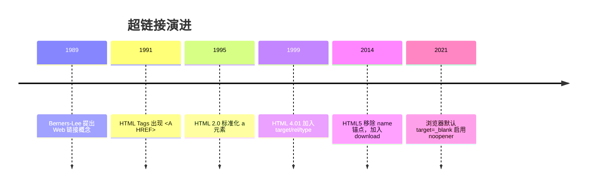
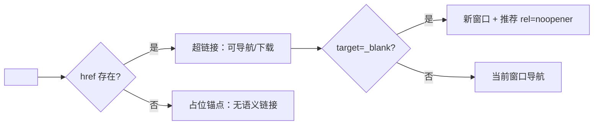

## 前置知识

建议先阅读以下内容再进入本文：

- [HTML5 概述与核心特性](/html5/020-HTML5OverviewCoreFeature)

## 1. 历史动机与发展脉络

超链接是万维网诞生的核心概念。1989 年 Tim Berners-Lee 提出“信息管理提议”，把“链接”作为 Web 的根本机制；1991 年 HTML Tags 中 `<A>` 元素即已存在，`HREF` 属性从一开始就承担“超文本引用”职责。HTML 2.0（1995）正式标准化 `<a>`；HTML 4.01（1999）引入 `target`、`rel`、`type` 等属性并支持 `name` 锚点；HTML5（2014）移除了 `name` 锚点（统一用全局 `id`），为 `<a>` 增加 `download` 属性，并明确了 `target="_blank"` 的 `rel="noopener"` 安全要求。

浏览器安全模型也在演进：2019 年起 Chrome 88 等浏览器默认对 `target="_blank"` 的链接隐式启用 `noopener` 行为（HTML spec 更新），但为了兼容旧浏览器与明确语义，现代代码仍显式书写 `rel="noopener"`。



## 2. 形式化定义

`<a>` 是 HTML 的锚点元素。当存在 `href` 属性时，它创建指向目标资源的超链接；没有 `href` 时是占位锚点（不产生链接行为，但可以作为交互元素的语义容器）。

`href` 属性值是一系列 URL 形态之一：

绝对 URL：`https://example.com/docs`，包含协议与主机；

相对 URL：`../images/logo.png`、`/docs/guide`，基于当前文档的基地址解析；

片段 URL：`#section-2`，指向当前文档中 `id="section-2"` 的元素；

协议相对 URL：`//cdn.example.com/lib.js`，继承当前页面的协议（https 或 http）；

专用协议：`mailto:user@example.com`、`tel:+8613800138000`、`javascript:`（不推荐）；

`data:` 与 `blob:` 用于内联数据与临时资源。

`target` 属性取值：`_self`（默认，当前浏览上下文）、`_blank`（新浏览上下文）、`_parent`（父上下文）、`_top`（顶层上下文）、任意名称（命名浏览上下文，若不存在则新建）。

`rel` 属性声明链接与目标的关系，空格分隔多个关键字：`noopener`（新窗口不继承 opener 引用）、`noreferrer`（不发送 Referer 且隐式 noopener）、`external`、`nofollow`（SEO 指示）、`nofollow` 等。

`download` 属性：提示浏览器下载目标而不是导航，值可作为建议文件名。受同源策略限制，跨域下载名可能被忽略。



## 3. 理论推导与原理解析

### 3.1 URL 解析算法

浏览器按照 WHATWG URL 标准解析 `href`。解析基准为文档 URL（或 `<base>` 元素指定的基地址）。相对路径解析规则：

`/path` 从主机根开始；

`path` 从当前目录开始；

`../path` 上溯一级目录；

`./path` 当前目录。

片段 `#id` 不参与网络请求，只触发文档内滚动。理解这一规则可以解释：为什么 `/docs/guide` 与 `guide` 指向不同资源；为什么 `#top` 跳转不需要网络往返。

### 3.2 target=_blank 的安全模型

传统上，`window.open` 或 `target="_blank"` 打开的新窗口通过 `window.opener` 引用原窗口。恶意页面可以利用 `opener` 调用 `window.opener.location = '钓鱼地址'` 或读取部分信息（反向 tabnabbing 攻击）。`rel="noopener"` 使新窗口的 `opener` 为 `null`，切断该引用链。`noreferrer` 更进一步，同时不发送 Referer 头，适合从隐私敏感的页面链接到外部。

### 3.3 锚点跳转机制

点击 `#section` 链接时，浏览器执行“滚动到片段”算法：在文档中查找 `id="section"` 的元素；找到后将其滚动到视口（默认对齐方式受 CSS `scroll-margin-top` 影响）；若不存在，则尝试 `name="section"`（旧行为兼容）；仍不存在则跳转到文档顶部。URL 的 hash 变化会写入历史记录，因此锚点跳转支持前进后退。

SPA 路由中，hash 同时被路由系统使用（如 Vue Router 的 hash 模式），此时锚点语义需要路由库的特殊处理，通常改用 `scrollBehavior` 实现。

## 4. 代码示例（带详尽注释）

### 4.1 基础链接

```html
<!-- 绝对 URL：指向站外资源 -->
<a href="https://developer.mozilla.org/zh-CN/docs/Web/HTML/Element/a">MDN a 元素文档</a>

<!-- 站内绝对路径：从站点根开始 -->
<a href="/docs/guide">使用指南</a>

<!-- 相对路径：从当前目录解析 -->
<a href="guide.html">同目录文档</a>

<!-- 上溯一级目录 -->
<a href="../index.html">返回上级</a>
```

讲解：四种写法覆盖绝大多数场景。站内链接建议使用根相对路径（`/docs/guide`），避免文档移动后相对路径失效。

### 4.2 新窗口打开与安全属性

```html
<!-- 新窗口打开外部文档，noopener 防止反向 tabnabbing -->
<a href="https://example.com/report" target="_blank" rel="noopener noreferrer">
  查看外部报告
</a>
```

讲解：`rel="noopener noreferrer"` 是外部链接的标准组合：`noopener` 切断 opener，`noreferrer` 隐藏来源页面地址。即使现代浏览器默认 noopener，显式书写仍是安全基线。

### 4.3 页面内锚点

```html
<!-- 目录：锚点指向目标 id -->
<nav>
  <a href="#install">安装</a>
  <a href="#usage">用法</a>
  <a href="#faq">常见问题</a>
</nav>

<h2 id="install">安装</h2>
<p>安装说明……</p>

<h2 id="usage">用法</h2>
<p>使用说明……</p>

<h2 id="faq">常见问题</h2>
<p>问题解答……</p>
```

讲解：HTML5 中锚点统一使用全局 `id`。为标题添加 `id` 时注意：`id` 必须唯一、不能包含空格、建议使用小写连字符命名。固定导航栏遮挡标题时，用 CSS `scroll-margin-top` 修正滚动位置：

```css
h2 {
  scroll-margin-top: 80px; /* 为固定导航留出空间 */
}
```

### 4.4 邮箱与电话链接

```html
<!-- mailto：点击唤起邮件客户端，可预设收件人/主题/正文 -->
<a href="mailto:support@example.com?subject=问题反馈&body=请描述您遇到的问题">
  联系支持
</a>

<!-- tel：移动端唤起拨号 -->
<a href="tel:+8613800138000">138 0013 8000</a>
```

讲解：`mailto` 与 `tel` 使用专用协议。注意 `&` 在 HTML 属性中应写为 `&amp;`，或直接使用 URL 编码 `%26`，避免严格解析器的警告。

### 4.5 下载链接

```html
<!-- download 提示浏览器保存文件，filename.pdf 为建议文件名 -->
<a href="/files/report.pdf" download="年度报告.pdf">下载年度报告</a>
```

讲解：`download` 仅在同源 URL 或 `blob:`/`data:` URL 下可靠生效；跨域资源（如 CDN）的下载名由服务器 Content-Disposition 决定。

### 4.6 链接状态样式

```css
/* 链接四种状态：未访问、已访问、悬停、聚焦 */
a {
  color: #1677ff;
}
a:visited {
  color: #722ed1; /* 已访问颜色，隐私考虑下浏览器限制可设置属性 */
}
a:hover {
  text-decoration: underline;
}
a:focus-visible {
  outline: 2px solid #1677ff; /* 键盘导航可见焦点 */
  outline-offset: 2px;
}
```

讲解：`:focus-visible` 只对键盘导航显示焦点环，鼠标点击不显示，兼顾可访问性与美观。不要移除默认 outline 而不提供替代焦点样式。

### 4.7 按钮与链接的语义选择

```html
<!-- 导航到其他页面：用 a -->
<a href="/docs">查看文档</a>

<!-- 页面内动作（打开弹窗、提交表单）：用 button -->
<button type="button" onclick="openDialog()">打开设置</button>
```

讲解：经验法则：URL 会变化用 `<a>`，URL 不变用 `<button>`。误用会导致键盘行为（空格/回车）、中键新开标签、复制链接地址等能力错乱。

### 4.8 无障碍链接文案

```html
<!-- 链接文案应自解释；避免“点击这里” -->
<a href="/docs/install">阅读安装文档</a>

<!-- 多个同目标链接用 aria-label 区分 -->
<a href="/docs" aria-label="阅读安装文档">了解更多</a>
```

讲解：屏幕阅读器用户会用 Tab 键遍历链接，“点击这里”“更多”等孤立文案无法传达目标。链接文本应描述目的地或动作结果。

## 5. 对比分析

### 5.1 target 取值对比

| 值 | 行为 | 典型场景 |
| --- | --- | --- |
| `_self` | 当前上下文导航 | 站内导航（默认） |
| `_blank` | 新浏览上下文 | 外部文档、PDF |
| `_parent` | 父上下文 | iframe 内链接 |
| `_top` | 顶层上下文 | iframe 内跳出框架 |

### 5.2 链接与按钮对比

| 维度 | a 链接 | button 按钮 |
| --- | --- | --- |
| 语义 | 导航 | 动作 |
| 键盘 | Enter 触发 | Enter/Space 触发 |
| 中键 | 新标签打开 | 无特殊行为 |
| 可复制地址 | 支持 | 不支持 |
| 默认样式 | 文本链接 | 按钮外观 |

### 5.3 锚点与路由对比

多页应用（MPA）用原生锚点；单页应用（SPA）用路由的 `scrollBehavior` 或 `useAnchorScroll` 组合函数。原生锚点简单可靠，但无法在 SPA 的虚拟路由中表达“页面内状态”；SPA 路由则需要在历史记录与滚动恢复上自行处理。

## 6. 常见陷阱与最佳实践

陷阱一：`target="_blank"` 忘记 `rel="noopener"`，存在反向 tabnabbing 风险。

陷阱二：重复 `id` 导致锚点跳转到错误位置。构建时可用工具（如 html-validate）检查 id 唯一性。

陷阱三：`href="#"` 点击后页面跳到顶部并污染历史。如需占位链接，用 `<button>` 或移除 `href` 并配合 `cursor: pointer`。

陷阱四：移除默认焦点样式。键盘用户将无法定位焦点。最佳实践：用 `:focus-visible` 提供可见焦点环。

陷阱五：链接文案“点击这里”。最佳实践：让文案描述目的地。

陷阱六：`mailto` 中的中文与特殊字符未编码。最佳实践：使用 `encodeURIComponent` 生成或手写百分号编码。

陷阱七：SPA 中混用 `href` 与前端路由导致整页刷新。最佳实践：Vue Router 的 `<RouterLink>`、React Router 的 `<Link>` 拦截点击并走客户端导航。

## 7. 工程实践

### 7.1 链接统一封装组件

以 Vue 3 为例，封装“站内路由链接或站外普通链接”的通用组件：

```vue
<script setup lang="ts">
import { computed } from 'vue'
import { RouterLink } from 'vue-router'

const props = defineProps<{
  to?: string
  href?: string
  external?: boolean
}>()

// 有 to 时使用路由链接，否则使用普通 a 标签
const isInternal = computed(() => Boolean(props.to))
</script>

<template>
  <RouterLink v-if="isInternal" :to="props.to">
    <slot />
  </RouterLink>
  <a v-else :href="props.href" :rel="external ? 'noopener noreferrer' : undefined"
     :target="external ? '_blank' : undefined">
    <slot />
  </a>
</template>
```

讲解：统一封装保证所有站外链接自动携带安全 rel，站内链接走 SPA 路由，避免团队各自实现导致的遗漏。

### 7.2 目录滚动监听

```js
// 滚动监听：高亮当前阅读章节对应的目录项
const headings = document.querySelectorAll('h2[id]')
const observer = new IntersectionObserver((entries) => {
  entries.forEach((entry) => {
    if (entry.isIntersecting) {
      document.querySelectorAll('.toc a').forEach((a) => a.classList.remove('active'))
      const link = document.querySelector(`.toc a[href="#${entry.target.id}"]`)
      link?.classList.add('active')
    }
  })
}, { rootMargin: '-20% 0px -70% 0px' })

headings.forEach((h) => observer.observe(h))
```

讲解：IntersectionObserver 以视口中部为判定区，进入判定区的标题触发目录高亮。`rootMargin` 微调触发区域，避免多个标题同时命中。

### 7.3 链接预加载

```html
<!-- 预取：空闲时下载资源，提高导航速度 -->
<link rel="prefetch" href="/docs/next-page">

<!-- 预连接：提前建立 DNS/TCP 连接 -->
<link rel="preconnect" href="https://cdn.example.com">
```

讲解：`prefetch` 适合“用户很可能点击”的页面；`preconnect` 适合第三方资源域名。二者是性能优化手段，不应过度使用。

## 8. 案例研究：文档站目录系统

需求：为长文档实现目录侧栏：锚点链接、当前章节高亮、固定导航栏偏移修正、键盘可访问。

```html
<aside class="toc" aria-label="目录">
  <ol>
    <li><a href="#overview">概述</a></li>
    <li><a href="#install">安装</a></li>
    <li><a href="#config">配置</a></li>
  </ol>
</aside>

<main>
  <h1 id="overview">概述</h1>
  <p>……</p>
  <h1 id="install">安装</h1>
  <p>……</p>
  <h1 id="config">配置</h1>
  <p>……</p>
</main>
```

```css
/* 固定导航栏高度修正：锚点滚动到标题时留出空间 */
h1, h2 {
  scroll-margin-top: 90px;
}
/* 目录激活态 */
.toc a.active {
  color: #1677ff;
  font-weight: 600;
  border-left: 3px solid #1677ff;
}
```

讲解：整个系统由三部分组成：语义 HTML（`ol + a + id`）、滚动修正（`scroll-margin-top`）、交互高亮（IntersectionObserver 或滚动事件）。每部分职责单一，替换任意部分不影响其他部分。

## 9. 知识要点总结与深入讲解

链接的核心属性是 `href`，其值决定“去哪里”；`target` 决定“在哪里打开”；`rel` 决定“与新上下文的关系与安全边界”。三者独立配置，但组合使用时有安全约束：`_blank` 应搭配 `noopener`。

锚点跳转依赖唯一 `id`。HTML5 已经移除 `name` 锚点，因此新代码只需关心 `id` 唯一性与滚动位置修正。

链接与按钮的选择是交互设计的基础问题：导航用链接，动作用按钮。这个判断影响键盘支持、中键行为、SEO 与辅助技术体验，值得在组件设计层面统一约束。

### 1. 超链接基础

```html
<a href="https://example.com">访问示例网站</a>
<a href="mailto:contact@example.com">发送邮件</a>
<a href="tel:+861012345678">拨打电话</a>
<a href="document.pdf" download>下载文件</a>
```

#### 1.1 target 属性

| 值        | 行为                 |
| --------- | -------------------- |
| `_self`   | 当前窗口打开（默认） |
| `_blank`  | 新窗口/标签页打开    |
| `_parent` | 父框架中打开         |
| `_top`    | 顶层窗口中打开       |

```html
<a href="https://example.com" target="_blank" rel="noopener noreferrer">外部链接</a>
```

> **安全提示**：使用 `target="_blank"` 时务必添加 `rel="noopener noreferrer"`。

#### 1.2 rel 属性

```html
<a rel="noopener">无 opener</a>
<a rel="noreferrer">不发送 Referer</a>
<a rel="nofollow">不传递权重</a>
<a rel="ugc">用户生成内容</a>
```

### 1. 锚点与页面内导航

```html
<h2 id="section1">第一节</h2>
<a href="#section1">跳转到第一节</a>
```

```css
html {
  scroll-behavior: smooth;
}
[id] {
  scroll-margin-top: 80px;
}
```

### 2. 路径系统

```html
<!-- 绝对路径 -->
<a href="https://example.com/page.html">完整 URL</a>
<a href="/about/index.html">根目录开始</a>

<!-- 相对路径 -->
<a href="page.html">同目录</a>
<a href="sub/page.html">子目录</a>
<a href="../page.html">父目录</a>
```

### 3. <base> 标签：URL 解析基准

正常情况下，相对路径的解析基准是"当前页面所在的 URL"。但 `<base>` 标签可以整体改写这个基准——它放在 `<head>` 里，一个页面最多一个：

```html
<head>
  <base href="https://cdn.example.com/assets/" />
</head>
```

加上之后，页面里所有相对路径（图片、链接、样式表）都会先拼到 `https://cdn.example.com/assets/` 后面，而不是当前页面目录。`<base>` 还可以写 `target`，给所有链接设置默认打开方式：

```html
<base target="_blank" />
```

**什么时候会遇到它：** 老项目、CMS 系统、静态站点生成器里，`<base>` 常被用来统一资源前缀。如果你发现"明明相对路径写对了，资源却全部 404"，第一反应就应该是：检查 `<head>` 里有没有 `<base>`。

**建议：** 新项目默认不用 `<base>`。它一次性影响全站相对路径，排查成本高；资源统一前缀用构建工具或 CDN 配置解决更清晰。

### 4. 链接可访问性

```html
<!--  描述性链接文本 -->
<a href="report.pdf">查看2026年度报告</a>

<!-- 跳过导航链接 -->
<a href="#main-content" class="skip-link">跳到主要内容</a>
```
### 超链接基础

**a 锚点元素**
`<a href="<URL>" [target="<目标>"] [rel="<关系>"] [download[="<文件名>"]] [type="<MIME>"]>[文本]</a>`
```html
<!-- 外部网站 -->
<a href="https://example.com">访问示例网站</a>

<!-- 邮件链接(带主题) -->
<a href="mailto:contact@example.com?subject=Hello">发送邮件</a>

<!-- 电话链接 -->
<a href="tel:+861012345678">拨打电话</a>

<!-- 短信链接 -->
<a href="sms:+861012345678?body=你好">发送短信</a>

<!-- 下载文件 -->
<a href="document.pdf" download="自定义文件名.pdf">下载文件</a>
```

| href 协议 | 用途         | 示例                              |
| --------- | ------------ | --------------------------------- |
| `http(s)` | 网页         | `https://example.com`             |
| `mailto`  | 邮件         | `mailto:user@example.com`         |
| `tel`     | 电话         | `tel:+861012345678`               |
| `sms`     | 短信         | `sms:+861012345678`               |
| `#`       | 锚点         | `#section1`                       |
| `javascript` | 脚本(不推荐) | `javascript:void(0)`           |

---

### target 属性

**链接打开方式**

| 值        | 行为                 |
| --------- | -------------------- |
| `_self`   | 当前窗口打开(默认)   |
| `_blank`  | 新窗口/标签页打开    |
| `_parent` | 父框架中打开         |
| `_top`    | 顶层窗口中打开       |
| `<名称>`  | 指定名称的窗口/框架  |

```html
<!-- 新窗口打开(安全写法) -->
<a href="https://example.com" target="_blank" rel="noopener noreferrer">外部链接</a>
```

> 安全提示:使用 `target="_blank"` 时务必添加 `rel="noopener noreferrer"`,防止新窗口通过 `window.opener` 操纵原窗口。

---

### rel 属性

**链接关系**

| rel 值        | 作用                              |
| ------------- | --------------------------------- |
| `noopener`    | 新窗口无法访问 window.opener      |
| `noreferrer`  | 不发送 Referer 头                 |
| `nofollow`    | 搜索引擎不传递权重                |
| `ugc`         | 用户生成内容                      |
| `sponsored`   | 付费链接                          |
| `bookmark`    | 永久书签                          |
| `next`        | 下一页                            |
| `prev`        | 上一页                            |
| `canonical`   | 规范化 URL                        |
| `alternate`   | 替代版本(如 RSS、其他语言)        |
| `license`     | 版权信息                          |
| `help`        | 帮助文档                          |

```html
<!-- 综合示例 -->
<a rel="noopener noreferrer">无 opener 不发送 Referer</a>
<a rel="nofollow">不传递权重</a>
<a rel="ugc">用户生成内容</a>
<a rel="sponsored">广告链接</a>
```

---

### 锚点与页面内导航

**页面内跳转**
`<a href="#<ID>">[文本]</a>` + `<[元素] id="<ID>">`
```html
<!-- 跳转到指定 ID -->
<h2 id="section1">第一节</h2>
<a href="#section1">跳转到第一节</a>

<!-- 跳回顶部 -->
<a href="#">回到顶部</a>

<!-- 跨页面锚点 -->
<a href="page.html#section1">跳到其他页面的第一节</a>
```

**平滑滚动**
```css
html {
  scroll-behavior: smooth;
}

/* 锚点偏移(避免被固定头部遮挡) */
[id] {
  scroll-margin-top: 80px;
}
```

**JavaScript 滚动**
```javascript
// 平滑滚动到元素
document.getElementById('section1').scrollIntoView({
  behavior: 'smooth',
  block: 'start'
});

// 滚动到顶部
window.scrollTo({ top: 0, behavior: 'smooth' });
```

---

### 路径系统

**绝对路径**
```html
<!-- 完整 URL -->
<a href="https://example.com/page.html">完整 URL</a>

<!-- 根目录开始 -->
<a href="/about/index.html">根目录开始</a>
```

**相对路径**
```html
<!-- 同目录 -->
<a href="page.html">同目录</a>

<!-- 子目录 -->
<a href="sub/page.html">子目录</a>

<!-- 父目录 -->
<a href="../page.html">父目录</a>

<!-- 上两级 -->
<a href="../../page.html">上两级</a>
```

| 路径         | 含义               |
| ------------ | ------------------ |
| `/path`      | 根目录绝对路径     |
| `./page`     | 当前目录(可省略)   |
| `../page`    | 上级目录           |
| `page.html`  | 相对当前页面       |
| `//host/path`| 协议相对路径       |

---

### 链接可访问性

**描述性链接文本**
```html
<!-- 正确:描述性文本 -->
<a href="report.pdf">查看2026年度报告</a>

<!-- 错误:无意义文本 -->
<a href="report.pdf">点击这里</a>
```

**跳过导航链接**
```html
<!-- 键盘用户跳过重复导航 -->
<body>
  <a href="#main-content" class="skip-link">跳到主要内容</a>
  <header>...</header>
  <main id="main-content">...</main>
</body>

<style>
  .skip-link {
    position: absolute;
    left: -9999px;
  }
  .skip-link:focus {
    left: 0;
    top: 0;
    background: #fff;
    padding: 1rem;
  }
</style>
```

---

### 链接状态 CSS

**链接伪类**
```css
a:link    { color: blue; }       /* 未访问 */
a:visited { color: purple; }     /* 已访问 */
a:hover   { color: red; }        /* 悬停 */
a:focus   { outline: 2px solid; } /* 聚焦 */
a:active  { color: orange; }     /* 点击时 */
```

---

### Ping 追踪

**ping 属性**
`<a href="<URL>" ping="<追踪URL>">[文本]</a>`
```html
<!-- 浏览器会向 ping 指定的 URL 发送 POST 请求 -->
<a href="https://example.com" ping="https://track.example.com/click">链接</a>
```

## 动手试试

### 入门版（必做）

1. 写一个包含 5 个链接的页面：一个站外链接（`_blank` + `noopener`）、一个站内链接、一个锚点链接、一个 `mailto`、一个 `tel`；
2. 给页面加一个“回到顶部”的锚点链接；
3. 用键盘 Tab 遍历链接，确认每个链接都有可见焦点。

### 进阶版（选做）

1. 给长文档的每个 `h2` 加 `id` 和 `scroll-margin-top`，实现固定导航下的平滑锚点；
2. 做一个“下载”链接并验证 `download` 文件名是否生效；
3. 用 `aria-label` 区分三个指向不同页面的“了解更多”链接。

## 注意事项与改进建议

| 问题点 | 说明 | 改进方案 |
| --- | --- | --- |
| `target="_blank"` 无 `rel` | 新窗口可通过 `opener` 控制原页面 | 显式写 `rel="noopener noreferrer"` |
| 链接文案“点击这里” | 读屏遍历时无法理解目标 | 文案描述目的地或动作结果 |
| 用 `<a href="#">` 做按钮 | 点击跳页顶、语义错误 | 页面内动作用 `<button>` |
| 锚点 `id` 重复或含空格 | 跳转失效 | `id` 唯一、小写连字符命名 |
| 固定导航遮挡标题 | 锚点跳转后标题被遮住 | 用 `scroll-margin-top` 修正 |
| 站内用相对路径 | 目录结构变化后链接失效 | 使用根相对路径 `/docs/...` |

## 扩展学习

- 路径与 URL：`javascript/380-JavaScriptModular` 中模块路径解析的类比；
- 路由：SPA 框架（Vue Router/React Router）与 History API 的关系；
- 无障碍：`html5/180-Accessibility` 中焦点管理与键盘导航；
- 安全：`javascript/480-ErrorBoundaryGlobalErrorCatch` 与外部链接安全基线；
- SEO：`css/660-HTMLSemanticSEO` 中链接结构与站内权重传递。
