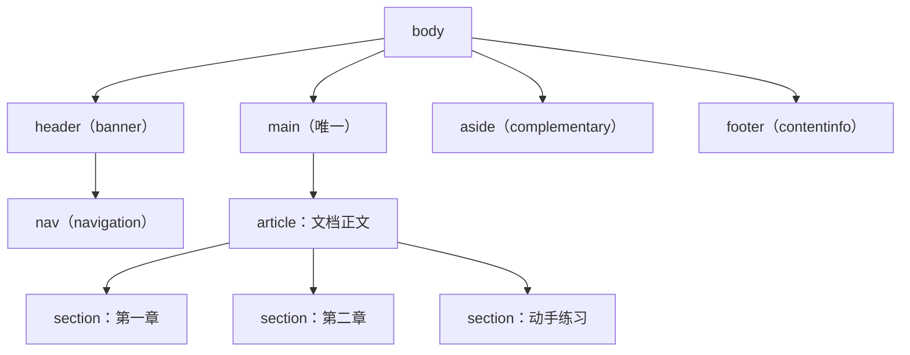

## 前置知识

- 已读 [div 与 span](/html5/080-HTML5DivSpanContainers)：知道 div 是"万能收纳盒"，也听说过"别把页面写成全 div 的汤"；
- 已读 [HTML5 基础内容标签](/html5/100-HTML5BasicContentTags)：会写标题、段落、列表、链接；
- 不需要 CSS 或 JavaScript 基础，本篇所有代码双击就能打开。

## 学习目标

读完本文你将能够：

1. 用 F12 的无障碍树（Accessibility Tree）看出一个页面的"路牌系统"，并解释它为什么比肉眼看的 class 名更可信；
2. 亲手把一份"全 div 汤"页面改造成 `header` / `nav` / `main` / `aside` / `footer` / `article` / `section` 的语义化结构；
3. 说出 `article` 与 `section` 的辨析口诀，不再"哪个顺眼用哪个"；
4. 排查三类典型翻车：满屏 `header`、一页多个 `main`、`section` 当 div 用。

## 1. 问题引入：接手同事留下的页面

想象入职第一周，组长丢给你一个任务：「这是上一任写的活动页，加一个新板块」。你打开源码，看到的是这样：

```html
<div class="top">
  <div class="logo">FANDEX 文档站</div>
  <div class="menu">
    <a href="/">首页</a>
    <a href="/lab/">前端实验室</a>
  </div>
</div>
<div class="content">
  <div class="post">
    <div class="post-title">CSS 锚点定位上手</div>
    <div class="post-body">……</div>
  </div>
</div>
<div class="side">
  <div class="hot">热门文章</div>
</div>
<div class="bottom">© 2026 FANDEX</div>
```

功能上没毛病，浏览器照画不误。但有三个真实问题：

1. **机器不认识它**。读屏软件朗读这份页面时只能说「链接 链接 链接」；搜索引擎抓取时也不知道哪块是正文、哪块是导航——class 名是给人看的，机器没有义务理解你的英文拼写；
2. **你也不认识它**。`.top` 是整站页头还是头部小组件？`.side` 是侧栏还是旁边的小盒子？只能点开 CSS 一个个猜；
3. **改一处怕崩全局**。所有样式都挂在无意义的 class 上，没有结构可言。

语义化标签解决的就是这个问题：HTML5 提供了一批**自带含义的容器**，浏览器、读屏软件、搜索引擎、三个月后的你都认识它们。

## 2. 动手实验一：把 div 汤改造成地标结构

新建 `semantic.html`，先原样复制下面这份"病人"，双击打开看一眼——它长得完全正常：

```html
<!DOCTYPE html>
<html lang="zh-CN">
<head>
  <meta charset="UTF-8" />
  <title>语义化改造前</title>
</head>
<body>
  <div class="top">
    <div class="menu"><a href="/">首页</a> <a href="/lab/">实验室</a></div>
  </div>
  <div class="content">
    <div class="post">
      <div class="post-title">CSS 锚点定位上手</div>
      <div class="post-body"><p>锚点定位让弹层自动贴在锚点元素旁边……</p></div>
    </div>
  </div>
  <div class="side"><p>热门文章：View Transitions 实战</p></div>
  <div class="bottom"><p>© 2026 FANDEX</p></div>
</body>
</html>
```

现在做改造。只替换标签名、不动任何文字，把 `body` 内部整体换成：

```html
<body>
  <header>
    <nav aria-label="站点导航">
      <a href="/">首页</a>
      <a href="/lab/">实验室</a>
    </nav>
  </header>

  <main>
    <article>
      <h1>CSS 锚点定位上手</h1>
      <p>锚点定位让弹层自动贴在锚点元素旁边……</p>
    </article>
  </main>

  <aside>
    <h2>热门文章</h2>
    <p>View Transitions 实战</p>
  </aside>

  <footer>
    <p>© 2026 FANDEX</p>
  </footer>
</body>
```

页面外观几乎没变（因为还没写 CSS），但按 F12 打开开发者工具，在 Elements 面板选中 `header` 元素，右侧切到「Accessibility」（无障碍）标签，你会看到：

```text
header 元素
  Role: banner
```

逐个选中 `nav`、`main`、`aside`、`footer`，各自对应一个**地标角色（landmark role）**：`navigation`、`main`、`complementary`、`contentinfo`。这就是改造的意义：**浏览器现在能向所有机器准确转述「这一块是什么」**。读屏用户按地标快捷键（如 NVDA 里按 D）就能在路牌之间直接跳转，不必从头听完整个页面。

## 3. 核心概念：八个路牌，各管一段

先记分工表，再记骨架图：

| 标签 | 地标角色（机器读到的） | 什么时候用 |
| --- | --- | --- |
| `header` | banner（整站页头限一个） | 页面顶部或一篇文章的头部：logo、标题、作者栏 |
| `nav` | navigation | 主要导航链接的集合，页面可有多个（顶部导航、面包屑） |
| `main` | main（每页只能有一个） | 页面主体内容：去掉导航页脚后剩下的那块 |
| `aside` | complementary | 与主内容相关但可拆走的内容：侧栏、相关推荐、术语表 |
| `footer` | contentinfo | 页面或一篇文章的结尾：版权、备案号、联系方式 |
| `article` | article | **独立成立**的内容：一篇文档、一条评论、一张卡片 |
| `section` | （普通分组） | 主题性分组，通常配一个标题（`h2`-`h6`） |
| `search` | search | 搜索表单区域（2023 年起新增，见本模块 440 篇） |

一张典型文档站页面的骨架：



三个使用要点：

- `header` / `footer` / `aside` 都可以出现在 `article` 内部，这时它们描述的是**这篇文章**的头部、尾部、相关阅读，而不是整站的；
- `nav` 不是"所有链接的容器"。页脚里那排「关于我们 / 联系方式」通常不用 `nav` 包——它们只是链接，不构成导航；
- `main` 每页有且只能有一个，装"没有这一块页面就不成立"的内容。

## 4. article 与 section：最常纠结的一对

辨析口诀只有一句：**能独立拿走（转载、订阅、单独成页）的用 `article`，只是按主题分段的用 `section`。**

```html
<!-- 文档站正文：一篇完整文档，独立成立 -->
<article>
  <h1>CSS 锚点定位上手</h1>
  <section>
    <h2>问题：弹层总是跑偏</h2>
    <p>……</p>
  </section>
  <section>
    <h2>动手实验</h2>
    <p>……</p>
  </section>
</article>
```

判断方法很朴素：问自己「这段内容被 RSS 抓走、被别人转载、或被截图发到群里，它还完整吗？」文档站的一篇文章、博客的一条评论、商品列表里的一张卡片，答案都是"完整"，所以是 `article`。而「第一章/第二章」只是文章内部的段落划分，抓走单章不成文，所以是 `section`。

两个都拿不准时的兜底：配了标题的主题分组用 `section`，纯排版分组用 `div`——**没有任何含义时用 div 不是偷懒，是诚实**。

## 5. 动手实验二：给页面做"大纲体检"

语义化不只是地标，还包括标题层级。在实验一的页面里补全一篇完整文档：

```html
<article>
  <h1>CSS 锚点定位上手</h1>
  <p>弹层定位是前端常见难题……</p>

  <section>
    <h2>为什么不用 JS 测量</h2>
    <p>传统做法要监听滚动、计算坐标……</p>
    <h3>滚动监听的三个坑</h3>
    <p>性能、时序、闪烁……</p>
  </section>

  <section>
    <h2>position-anchor 最小示例</h2>
    <p>两行 CSS 就能让 tooltip 贴住按钮……</p>
  </section>
</article>
```

体检标准有三条：

1. 每个 `section` 要么有标题（`h2`-`h6`），要么有 `aria-label` 说明用途；
2. 标题不跳级：`h1` 下面直接出现 `h4`，读屏用户会以为漏听了内容；
3. 一个页面一个 `h1`，它是"这篇文档的名字"，不是"页面上最大的那个字"——控制字号是 CSS 的活。

## 6. 常见错误与调试实录

**翻车一：满屏 `header`。** 症状：页面顶部、每张卡片、弹窗里全是 `header`，无障碍树里冒出七八个 `banner`，读屏用户按地标跳转直接迷路。修法：整站页头用一个 `header`，卡片头部用普通 `div` 或直接放标题元素。

**翻车二：一页多个 `main`。** 症状：为了"每张卡片都是主体"给每张卡片套 `main`。`main` 的约定是每页一个，多个 `main` 会让"跳到主内容"类快捷键失去意义。修法：页面最外层一个 `main`，卡片用 `article`。

**翻车三：`section` 当 div 用。** 症状：没有任何标题的 `section` 嵌了五六层。不报错，但对机器是噪音——读屏软件会播报一个个空的"区域"。修法：能配上标题就配标题，配不上就换 `div`。

调试通用姿势：F12 选中可疑元素 → 看 Accessibility 面板的 Role。Role 是 `generic` 或空白，说明这个标签没给机器任何信息；Role 是 landmark 却成片出现，说明用滥了。

## 7. 实际场景

- **文档站与博客**：FANDEX 本站的每篇文档就是一个 `article`，左侧目录是 `aside`，顶部导航是 `nav`——对着你现在读的这页按 F12，能看到同样的结构；
- **SEO**：搜索引擎靠地标和标题理解页面主题，`main` 里的 `h1` 加规范的 `h2` 层级，比堆关键词更能告诉爬虫"这页讲什么"（详见 [HTML 语义化与 SEO](/css/660-HTMLSemanticSEO)）；
- **读屏用户**：landmark 快捷键让他们像翻书签一样跳读页面，而不是忍受从头到尾的线性朗读；
- **接手他人代码**：先看有没有地标。一个全是 div 的"卡片组件"，多半也不会认真处理键盘焦点——语义化程度是代码质量的第一眼信号。

## 8. 小练习

预测题（3 分钟）：下面两段写法，读屏软件播报有什么不同？

```html
<!-- 写法 A --> <div class="nav"><a href="/">首页</a></div>
<!-- 写法 B --> <nav aria-label="主导航"><a href="/">首页</a></nav>
```

答案：A 播报「链接 首页」；B 会先播报「主导航 导航区域」再播报链接，且用户能用地标快捷键直接跳到它。

改造题（15 分钟）：找一份你以前写的全 div 页面（没有就现写一个"新闻列表页"），把 `header/nav/main/aside/footer/article/section` 用满。验收：F12 无障碍树里能看到 banner、navigation、main、complementary、contentinfo 五个地标，且 `main` 只有一个。

排错题（10 分钟）：下面这段哪里语义用错了？至少说出两处。

```html
<main>
  <header><h1>本周热门</h1></header>
  <main>
    <article><h2>文章一</h2></article>
  </main>
  <footer><p>列表页脚</p></footer>
</main>
```

答案：嵌套了第二个 `main`——每页只能有一个，内层应去掉或改 `article`；这个页面其实只是一个"列表区块"，`header` 里只放一个标题时可以直接省略 `header`。

挑战题（30 分钟）：给 FANDEX 首页画一张语义骨架图（mermaid 或手画），标出每个区块用的标签和对应地标角色，然后对照真站 F12 验证你猜对了几个。允许猜错——重点是建立"看到区块就想到标签"的反射。

## 9. 与之前和之后的知识的关系

- 之前：[div 与 span](/html5/080-HTML5DivSpanContainers) 教了"没有语义时用 div"，本篇补上"有语义时该用什么"；
- 之后：[无障碍访问](/html5/180-Accessibility) 把"机器能读"推进到"人人能用"；[内容模型与嵌套规则](/html5/390-HTML5ContentModelAndNestingRules) 讲清哪些标签能套哪些；CSS 模块的 [HTML 语义化与 SEO](/css/660-HTMLSemanticSEO) 展示语义如何换成搜索排名。

## 10. 官方文档

- MDN「HTML 语义化」：https://developer.mozilla.org/zh-CN/docs/Glossary/Semantics
- MDN HTML 元素参考（按用途分类）：https://developer.mozilla.org/zh-CN/docs/Web/HTML/Element
- web.dev「Learn Accessibility - Structure」：https://web.dev/learn/accessibility/structure

## 11. 自我检查

- 能说出八大地标标签各自的地标角色名（banner / navigation / main / complementary / contentinfo / search）；
- 会用 F12 的 Accessibility 面板验证一个元素的角色；
- 能背出 `article` 与 `section` 的辨析口诀并举一正一反两个例子；
- 知道 `main` 每页只能有一个、`nav` 不包页脚杂链、一个 `h1`、标题不跳级；
- 拿到一份全 div 页面，能独立完成语义化改造并用无障碍树验收。

## 本章总结

语义化标签是给网页装"路牌系统"：`header`/`nav`/`main`/`aside`/`footer` 对应固定地标角色，读屏软件与搜索引擎靠它们跳读和理解页面。改造方法朴素——只换标签名不动内容，再用 DevTools 的 Accessibility 面板验收。`article` 与 `section` 的分界是"能否独立拿走成文"；没有含义的分组诚实地用 `div`。一个 `h1`、一个 `main`、标题不跳级，是三条铁律。

## 下一步

进入 [无障碍访问](/html5/180-Accessibility)：路牌装好了，接下来让键盘用户与读屏用户真正"走"一遍你的页面——焦点、ARIA、对比度，把"机器能读"升级成"人人能用"。
