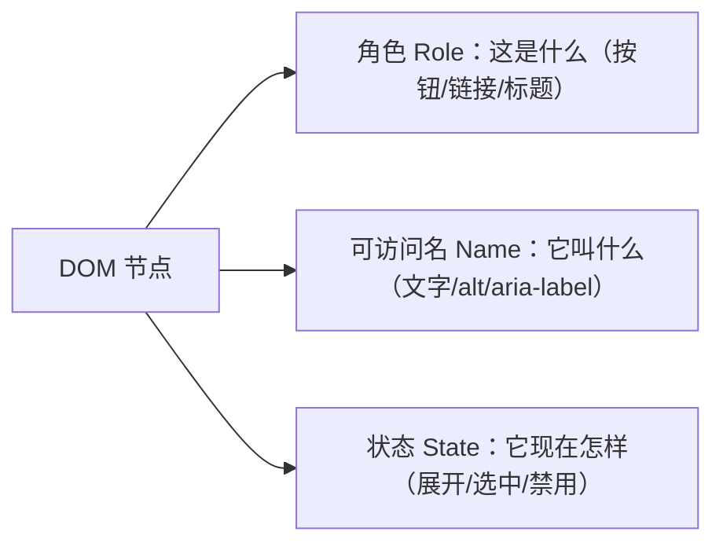

## 前置知识

- 已读 [语义化标签](/html5/170-SemanticTag)：会用 header/nav/main 地标搭骨架，知道怎么在 DevTools 里看无障碍树；
- 会基本的 HTML 表单标签（`input`、`button`），不需要 JavaScript 基础——本篇仅两个小示例用到几行 JS，照抄即可。

## 学习目标

读完本文你将能够：

1. 拔掉鼠标、只用 Tab 和 Enter 走完一个页面，并判断"焦点去哪了"是否合理；
2. 说出"可访问名"是什么，并给图片、按钮、表单控件补齐它；
3. 使用最小 ARIA 集（`aria-label`、`aria-expanded`、`aria-live`），并遵守"能用原生标签就别用 ARIA"的第一规则；
4. 修掉三类高频翻车：div 当按钮、模态关闭后焦点失踪、placeholder 冒充 label。

## 1. 问题引入：不用鼠标的用户长什么样

先纠正一个直觉：无障碍不是"给少数盲人用户的慈善项目"。下面这些人都在用你写的页面：

- **键盘党**：程序员、电竞玩家、重度效率用户，手不离键盘，鼠标嫌慢；
- **暂时性障碍**：手腕腱鞘炎打不了字、坐地铁单手拿手机、阳光太强看不清低对比度文字；
- **读屏用户**：全盲或低视力用户，靠软件把页面"读"出来，操作全靠键盘；
- **爬虫**：搜索引擎就是一个"最大号的读屏用户"。

一个朴素的测试标准：**把鼠标拔掉，只用 Tab、Shift+Tab、Enter、Esc，你的页面还能完成核心任务吗？** 做不到，读屏用户基本也做不到——因为读屏软件就是靠键盘焦点来"读"的。

## 2. 动手实验一：纯键盘走一遍"假按钮"页面

新建 `a11y.html`，复制下面这份页面。它有一组真按钮和一组"用 div 假装"的按钮：

```html
<!DOCTYPE html>
<html lang="zh-CN">
<head>
  <meta charset="UTF-8" />
  <title>键盘可达性实验</title>
  <style>
    .tag {
      display: inline-block;
      padding: 6px 14px;
      margin: 4px;
      border: 1px solid #888;
      border-radius: 999px;
      cursor: pointer;
      user-select: none;
    }
  </style>
</head>
<body>
  <h1>选择你的兴趣标签</h1>

  <p>真按钮版：</p>
  <button type="button">CSS</button>
  <button type="button">Canvas</button>
  <button type="button">WebGL</button>

  <p>div 假按钮版（看起来一模一样）：</p>
  <div class="tag" onclick="alert('选中 div 版')">CSS</div>
  <div class="tag" onclick="alert('选中 div 版')">Canvas</div>
  <div class="tag" onclick="alert('选中 div 版')">WebGL</div>
</body>
</html>
```

双击打开，然后**把手从鼠标上拿开**，只按 Tab 键从头走一遍。你会观察到：

1. 三个真按钮依次出现焦点框，按 Enter 或空格都能"点"；
2. 三个 div 版按钮**直接被跳过了**——Tab 根本不停留，因为 `div` 不是可聚焦元素；
3. 鼠标点击 div 版能弹窗，键盘用户却永远选不中它。

这就是"看起来能用"和"真的能用"的差距。修法简单到离谱：把 `div` 换回 `button`，样式用 CSS 调（`button` 默认样式可以完全覆盖），键盘行为浏览器免费送你。

```html
<button type="button" class="tag">CSS</button>
```

## 3. 核心概念：读屏软件到底"读"什么

读屏软件不读你的 CSS，也不读你的视觉布局。它读的是**无障碍树**——浏览器从 DOM 提炼出来的一棵"语义摘要树"，每个节点有三样关键信息：



- **角色（Role）**：`button`、`link`、`heading`……来自标签本身。这是 [语义化标签](/html5/170-SemanticTag) 那篇的价值；
- **可访问名（Name）**：这个元素"叫什么"。按钮靠文字内容，图片靠 `alt`，输入框靠 `label`。**没有可访问名的按钮，读屏只会播报「按钮」两个字**——用户不知道按下去会发生什么；
- **状态（State）**：展开了没有、选中了没有。原生控件自动维护；自造的组件要靠 ARIA 属性手动播报。

记住这条推理链：`div` 没有角色 → 读屏不知道它是什么 → 键盘也聚焦不到它 → 对辅助技术来说它**不存在**。

## 4. 最小 ARIA 集：三个属性救急

ARIA（Accessible Rich Internet Applications）是一组 `aria-*` 属性，用来给"浏览器猜不出来"的信息打补丁。零基础阶段掌握三个就够：

**1. `aria-label`：给"没有文字"的东西起名。** 图标按钮最典型——屏幕上只有一个小齿轮，读屏用户听到的是空。

```html
<!-- 坏：读屏播报「按钮」，不知道是干嘛的 -->
<button type="button">&#8801;</button>

<!-- 好：视觉不变，播报「打开设置 按钮」 -->
<button type="button" aria-label="打开设置">&#8801;</button>
```

**2. `aria-expanded`：播报"展开/收起"状态。** 下拉菜单、折叠面板都需要。

```html
<button type="button" aria-expanded="false" aria-controls="menu">菜单</button>
<ul id="menu" hidden>
  <li><a href="/css/">CSS 模块</a></li>
  <li><a href="/html5/">HTML 模块</a></li>
</ul>
<script>
  const btn = document.querySelector("button");
  const menu = document.getElementById("menu");
  btn.addEventListener("click", () => {
    const open = btn.getAttribute("aria-expanded") === "true";
    btn.setAttribute("aria-expanded", String(!open));
    menu.hidden = open;
  });
</script>
```

状态一变就同步改属性，读屏用户立刻知道「菜单展开了」，视觉用户看到菜单出现——两边拿到的是同一个事实。

**3. `aria-live`：播报"这里的内容变了"。** Toast 通知、表单提交结果都靠它，因为读屏用户看不见"凭空冒出来"的提示。

```html
<div aria-live="polite" id="toast"></div>
<script>
  // 内容一变，读屏自动播报新文字
  document.getElementById("toast").textContent = "草稿已保存";
</script>
```

然后是最重要的**第一规则**：ARIA 是补丁，不是替代品。能用 `button` 就别写 `<div role="button" tabindex="0">` 再手动补一堆键盘事件——原生标签自带角色、焦点、键盘行为，ARIA 版你要自己把这三样全部手搓一遍，还容易漏。社区把这条总结成一句话：**No ARIA is better than bad ARIA（乱用 ARIA 不如不用）**。

## 5. 动手实验二：把一张"读不全"的卡片修好

下面这张卡片在读屏软件里问题百出，先照抄，再修复：

```html
<article class="card">
  
  <h3></h3>
  <a href="/doc/anchor/"></a>
  <form>
    <input type="email" placeholder="输入邮箱订阅更新" />
    <button type="submit">提交</button>
  </form>
</article>
```

问题清单（修复版如下）：

1. 封面图没有 `alt`，读屏会念出整串文件名或直接跳过；
2. `<h3></h3>` 是空的，标题信息丢失；
3. 箭头链接只有图片没有名，播报是「链接」；
4. 邮箱输入框只有 `placeholder`——placeholder 一输入就消失，而且很多读屏不把它当名字，应该用 `label`。

```html
<article class="card">
  
  <h3>CSS 锚点定位上手</h3>
  <a href="/doc/anchor/" aria-label="阅读全文：CSS 锚点定位上手">
    
  </a>
  <form>
    <label for="sub-email">订阅更新</label>
    <input id="sub-email" type="email" placeholder="例如 you@example.com" />
    <button type="submit">订阅</button>
  </form>
</article>
```

注意第 3 处的细节：装饰性图片的 `alt` 写**空字符串**而不是删掉属性——空 alt 表示"我是装饰，跳过我"；不写 `alt` 属性则读屏可能念文件名。另外按钮文案从「提交」改成「订阅」：可访问名要有信息量，一页有五个「提交」时用户分不清谁是谁。

## 6. 常见错误与调试实录

**翻车一：div 当按钮。** 症状与修法见实验一。检查方法：DevTools 选中元素，Accessibility 面板里 Role 若是 `generic`，而它明明承担点击行为，就是翻车了。

**翻车二：模态关闭后焦点失踪。** 症状：弹窗（用自定义 div 实现的那种）关闭后，按 Tab 焦点从页面第一个元素重新开始，用户丢失位置。修法分两步：打开时把焦点移进弹窗，关闭时把焦点还给触发按钮。

```javascript
closeButton.addEventListener("click", () => {
  dialog.hidden = true;
  openTrigger.focus(); // 把焦点还回去
});
```

更省心的路线是直接用原生 `dialog` 元素加 `showModal()`，焦点圈定和 Esc 关闭都是浏览器自带（完整用法见 [dialog 与 popover 深度指南](/html5/430-HTML5DialogPopoverGuide)）。

**翻车三：placeholder 冒充 label。** 症状：用户开始输入后提示消失，回头检查时不知道这格填的是什么；读屏也常读不到。修法：永远配 `label`（可用 `for`/`id` 关联或直接包裹），placeholder 只做格式示例。

**翻车四：焦点框被抹掉。** 症状：CSS 里一行 `outline: none` "美化"了页面，键盘用户从此不知道自己在哪。修法：删掉它，或换成更精致的 `:focus-visible` 样式（CSS 侧的完整做法在 [可访问性样式](/css/500-AccessibleStyling)）。

## 7. 实际场景

- **前端实验室类产品**：FANDEX 网页端的"前端实验室"允许在浏览器里直接写代码并运行，重度用户全程键盘操作——编辑器快捷键、按钮焦点顺序、结果播报，每一处都是本篇知识的真实用武之地；
- **WCAG 四原则**一句话版：可感知（有替代文本）、可操作（键盘可达）、可理解（提示清晰）、健壮（语义规范）。国际标准 WCAG 2.2 就是这四条的展开，面试和验收常引用；
- **原生组件优先**：`dialog`、`details`、popover 这些新原生元素之所以值得学，就是因为它们的可访问性是浏览器白送的；
- **`inert` 属性**（2023 年起全浏览器支持）：给"暂时不该交互"的区域整体上锁，比如侧边抽屉打开时锁住主内容，比手动管理 tabindex 可靠得多。

## 8. 小练习

预测题（3 分钟）：下面两种写法，读屏用户分别听到什么？

```html


```

答案：第一种播报空（跳过装饰图）；第二种可能念出文件名「divider.png」，或行为不确定——取决于读屏实现。装饰图请写空 alt。

修复题（15 分钟）：把实验二的卡片再升级——给订阅表单加一行 `aria-live` 提示，提交后（哪怕先造假）把「订阅成功」写进去。验收：不做任何视觉改动，用 Tab 走完整个卡片，每个可交互元素都有焦点、有名字。

排错题（10 分钟）：同事写的折叠面板，鼠标点击正常，读屏用户却不知道面板是否展开。代码如下，指出缺了什么并补上：

```html
<button type="button" id="toggle">详细信息</button>
<div id="panel" hidden>……</div>
```

答案：缺少状态播报。给按钮加 `aria-expanded`，点击时在 `"true"`/`"false"` 间切换；可再加 `aria-controls="panel"` 声明控制关系。

挑战题（30 分钟，可选）：如果你用 Windows，按 Ctrl+Win+Enter 启动系统自带的讲述人（Narrator），用它浏览 FANDEX 站点任意一篇文档，记录三条"听着别扭"的地方。这是零成本体验读屏用户世界的最快方式。

## 9. 与之前和之后的知识的关系

- 之前：[语义化标签](/html5/170-SemanticTag) 提供了角色基础——本篇的 ARIA 只补语义标签盖不住的那部分；
- 之后：[表单与验证](/html5/190-HTML5FormValidation) 里 label、错误提示与 `aria-describedby` 会反复出现；CSS 模块的 [可访问性样式](/css/500-AccessibleStyling) 负责对比度、焦点样式与动效偏好；[dialog 与 popover](/html5/430-HTML5DialogPopoverGuide) 展示"原生组件自带无障碍"的现代路线。

## 10. 官方文档

- MDN「无障碍」学习区：https://developer.mozilla.org/zh-CN/docs/Learn_web_development/Core/Accessibility
- MDN ARIA 基础：https://developer.mozilla.org/zh-CN/docs/Learn_web_development/Core/Accessibility/WAI-ARIA_basics
- web.dev「Learn Accessibility」：https://web.dev/learn/accessibility
- W3C WCAG 2.2 速查（中文）：https://www.w3.org/Translations/WCAG22-zh/

## 11. 自我检查

- 能不看笔记说出无障碍树三要素：角色、可访问名、状态；
- 能解释为什么 `div onclick` 对键盘用户等于不存在，并说出修法；
- 会用 `aria-label`、`aria-expanded`、`aria-live` 三件补丁，并知道它们各自的使用时机；
- 记得装饰图的 `alt` 要写空字符串；
- 能独立完成"拔掉鼠标走完一个页面"的键盘测试并记录问题。

## 本章总结

无障碍的本质是"让机器转述你的页面"：读屏软件读的是无障碍树上的角色、可访问名与状态。原生标签自带这三样，所以第一规则是"能用原生就别用 ARIA"；补丁只用三个高频属性——`aria-label` 起名、`aria-expanded` 播报展开、`aria-live` 播报变化。高频翻车有四类：div 当按钮、模态焦点失踪、placeholder 冒充 label、焦点框被抹掉。验收手段只有一个：拔掉鼠标，用键盘走一遍。

## 下一步

进入 [HTML5 表单与验证](/html5/190-HTML5FormValidation)：表单是键盘交互最密集的场景，也是无障碍重灾区——label、错误提示、焦点管理全部要实战一遍，顺便学浏览器白送的数据校验。
