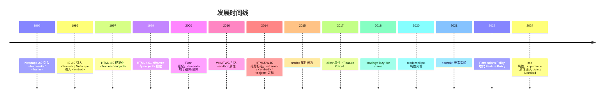

## 前置知识

建议先阅读以下内容再进入本文：

- [HTML5 概述与核心特性](/html5/020-HTML5OverviewCoreFeature)

> 0基础速通：只读第 0 节直觉、第 2 章 iframe 核心速览与 4.1 示例；其余（安全、微前端等）为进阶参考。

> 前置要求：iframe/embed/object 标签本身零基础可学；4.2/4.3 的 postMessage 与 MessageChannel 通信依赖 JavaScript（事件监听、异步），建议先完成 `javascript/001`-`005` 与 `javascript/039` 再读；4.4 起的安全与微前端章节为进阶内容，第一遍可跳过。

## 0. 直觉：同源策略（SOP）

读 iframe 安全之前，必须先懂一个概念：**同源**。浏览器把"协议 + 域名 + 端口"三件套称为一个"源"（Origin），三者完全一致才算同源：

| 页面 A 的地址 | 页面 B 的地址 | 是否同源 | 原因 |
| --- | --- | --- | --- |
| `https://example.com/page.html` | `https://example.com/other.html` | 同源 | 协议、域名、端口都相同 |
| `https://example.com` | `http://example.com` | 不同源 | 协议不同（https vs http） |
| `https://example.com` | `https://www.example.com` | 不同源 | 域名不同（www 也是域名的一部分） |
| `https://example.com` | `https://example.com:8080` | 不同源 | 端口不同 |
| `http://localhost:3000` | `http://127.0.0.1:3000` | 不同源 | 域名不同（localhost 与 127.0.0.1 是两个 host） |

**同源策略（Same-Origin Policy）** 是浏览器的默认安全规则：只有同源的页面之间才能互相读取 DOM、共享 localStorage、共用 Cookie。跨源时，浏览器默认"只读外观、不许动内部"。

这个规则解释了三个常见现象：

1. iframe 里嵌入的第三方页面，默认无法被父页面读取内容——沙箱与 SOP 是两道叠加的防线；
2. localStorage 按"源"隔离：`localhost` 和 `127.0.0.1` 存的数据互不相通，本地调试时"明明存了却读不到"先检查这个；
3. 跨源请求能不能放开，由服务器通过 CORS 响应头主动授权——那是 JavaScript 模块的内容，HTML 阶段只需要知道"默认是关着的"。

记住一句话：**同源 = 协议相同 + 域名相同 + 端口相同，三缺一就跨源。**

## 1. 历史动机与发展脉络

### 1.1 框架集时代（1995—1999）

HTML 2.0（RFC 1866, 1995）并未包含嵌入文档的能力。Netscape Navigator 2.0（1995）引入了 `<frame>` 与 `<frameset>` 元素，允许将浏览器视口划分为多个独立框架，每个框架加载独立 HTML 文档。

```html
<!-- 1995 年 Netscape 的 frameset 语法 -->
<frameset cols="25%,75%">
  <frame src="nav.html" name="nav">
  <frame src="content.html" name="content">
  <noframes>
    <body>您的浏览器不支持框架</body>
  </noframes>
</frameset>
```

`<frameset>` 的缺陷：

1. **可访问性差**：屏幕阅读器难以导航。
2. **SEO 不友好**：搜索引擎无法索引组合后的内容。
3. **布局僵化**：框架边界固定，响应式困难。
4. **打印困难**：每个框架独立打印，难以整合。
5. **链接复杂**：`target` 属性需显式指定框架名。

### 1.2 内联框架 `<iframe>` 的诞生（1997）

Microsoft Internet Explorer 3.0（1996）首创 `<iframe>` 元素，作为"行内框架"嵌入文档。HTML 4.0（W3C, 1997）正式将其纳入规范：

```html
<!-- HTML 4.0 原始 iframe 语法 -->
<iframe src="ad.html" width="468" height="60" scrolling="auto" frameborder="1">
  您的浏览器不支持 iframe。
</iframe>
```

`<iframe>` 的优势：

- 行内布局，无需 `<frameset>` 包裹。
- 可嵌入任意位置，灵活组合。
- 支持回退内容（元素内文本）。
- 独立文档上下文，天然隔离 CSS/JS。

### 1.3 `<object>` 与 `<embed>` 的多格式嵌入（1996—1999）

HTML 4.0 同时引入 `<object>` 元素，目标是统一替代 ``、`<iframe>`、`<applet>`：

```html
<!-- HTML 4.0 object 通用嵌入 -->
<object data="movie.mpeg" type="video/mpeg" width="320" height="240">
  <param name="autoplay" value="false">
  <object data="movie.avi" type="video/x-msvideo">
    <p>您的浏览器不支持视频嵌入</p>
  </object>
</object>
```

`<embed>` 由 Netscape 引入但未进入 HTML 4.0 规范，直至 HTML5 才被正式收纳。两者差异：

| 特性 | `<embed>` | `<object>` |
| ---- | --------- | ---------- |
| 闭合方式 | 自闭合（void） | 显式 `</object>` |
| 回退内容 | 不支持 | 支持（嵌套回退） |
| 参数传递 | 通过属性 | 通过 `<param>` 子元素 |
| HTML 4.0 | 未规范 | 规范化 |
| HTML5 | 规范化（用于插件） | 规范化（用于回退） |
| 历史用途 | Flash、Java Applet | 通用嵌入 |

### 1.4 HTML5 沙箱安全革命（2010—2014）

2010 年 Ian Hickson 在 WHATWG HTML Living Standard 中引入 `sandbox` 属性，将 `<iframe>` 从"被动嵌入"升级为"主动沙箱"。设计目标：

1. **最小权限**：默认拒绝所有能力，按需显式授权。
2. **强制隔离**：沙箱内文档无法访问父文档 DOM、Cookie、localStorage。
3. **可组合**：多个 `allow-*` 令牌可自由组合，精细控制。
4. **浏览器原生**：不依赖 JS、CSP，由浏览器内核强制实施。

```html
<!-- HTML5 sandbox 最小授权 -->
<iframe src="untrusted.html" sandbox="allow-scripts"></iframe>
```

### 1.5 现代化演进（2015—2024）

| 年份 | 特性 | 浏览器 | 意义 |
| ---- | ---- | ------ | ---- |
| 2015 | `<iframe srcdoc>` | Chrome 53 | 内联内容，零 HTTP 请求 |
| 2016 | `sandbox="allow-downloads"` | Chrome 56 | 显式下载授权 |
| 2017 | `allow` 属性（Permissions Policy 前身） | Chrome 60 | 精细能力控制 |
| 2018 | `loading="lazy"` | Chrome 76 | 视口外延迟加载 |
| 2020 | `credentialless` 属性（实验） | Chrome 96 | COEP 友好的凭据隔离 |
| 2021 | `<portal>` 元素（实验） | Chrome 85 | 跨文档预渲染与无缝过渡 |
| 2022 | `sandbox="allow-storage-access-by-user-activation"` | Safari 15.4 | 用户激活下的存储访问 |
| 2023 | `importance` 属性 | Chrome 110 | 优先级提示 |
| 2024 | `csp` 属性（实验） | Chrome 122 | 嵌入文档 CSP 注入 |

### 1.6 演进时间线



### 1.7 规范族谱

- **HTML 2.0**（RFC 1866, 1995）：无嵌入元素。
- **HTML 3.2**（W3C, 1997）：`<applet>` 首次出现。
- **HTML 4.0**（W3C, 1997）：`<iframe>`、`<object>`、`<param>` 正式规范化。
- **HTML 4.01**（W3C, 1999）：`<frameset>`/`<frame>` 标记为过时。
- **XHTML 1.0/1.1**（W3C, 2000—2001）：保留 `<iframe>`/`<object>`，废弃 `<embed>`。
- **HTML5**（W3C, 2014）：`<embed>` 正式规范化；`<iframe>` 增加 `sandbox`、`srcdoc`；废弃 `<frame>`/`<frameset>`/`<applet>`。
- **HTML 5.1 / 5.2 / 5.3**（W3C, 2016—2018）：增加 `allow`、`loading`、`referrerpolicy`。
- **WHATWG HTML Living Standard**（持续更新）：§4.8.5 "The iframe element"、§4.8.6 "The embed element"、§4.8.7 "The object element" 为权威参考。

---

## 2. 形式化定义

### 2.1 WHATWG 规范定义

依据 WHATWG HTML Living Standard §4.8.5，`<iframe>` 元素的 Web IDL 定义：

```webidl
[Exposed=Window]
interface HTMLIFrameElement : HTMLElement {
  [CEReactions] attribute USVString src;
  [CEReactions] attribute DOMString srcdoc;
  [CEReactions] attribute DOMString name;
  [CEReactions, Reflect] attribute DOMString sandbox;
  [CEReactions, Reflect] attribute DOMString allow;
  [CEReactions, Reflect] attribute boolean allowFullscreen;
  [CEReactions, Reflect] attribute boolean allowPaymentRequest;
  [CEReactions, Reflect] attribute boolean credentialless;
  [CEReactions] attribute DOMString width;
  [CEReactions] attribute DOMString height;
  [CEReactions] attribute DOMString referrerPolicy;
  [CEReactions, Reflect] attribute DOMString loading;
  [CEReactions, Reflect] attribute DOMString importance;
  [CEReactions, Reflect] attribute DOMString csp;
  readonly attribute Document? contentDocument;
  readonly attribute WindowProxy? contentWindow;
};

[Exposed=Window]
interface HTMLEmbedElement : HTMLElement {
  [CEReactions] attribute USVString src;
  [CEReactions] attribute DOMString type;
  [CEReactions] attribute DOMString width;
  [CEReactions] attribute DOMString height;
  Document? getSVGDocument();
};

[Exposed=Window]
interface HTMLObjectElement : HTMLElement {
  [CEReactions] attribute USVString data;
  [CEReactions] attribute DOMString type;
  [CEReactions] attribute boolean typeMustMatch;
  [CEReactions] attribute DOMString name;
  [CEReactions] attribute DOMString useMap;
  [CEReactions] attribute DOMString width;
  [CEReactions] attribute DOMString height;
  readonly attribute Document? contentDocument;
  readonly attribute WindowProxy? contentWindow;
  readonly attribute boolean willValidate;
  readonly attribute ValidityState validity;
  readonly attribute DOMString validationMessage;
  boolean checkValidity();
  boolean reportValidity();
  void setCustomValidity(DOMString error);
};
```

### 2.2 sandbox 文法

```
sandbox = token *( " " token )
token = "allow-downloads"
      | "allow-downloads-without-user-activation"
      | "allow-forms"
      | "allow-modals"
      | "allow-orientation-lock"
      | "allow-pointer-lock"
      | "allow-popups"
      | "allow-popups-to-escape-sandbox"
      | "allow-presentation"
      | "allow-same-origin"
      | "allow-scripts"
      | "allow-storage-access-by-user-activation"
      | "allow-top-navigation"
      | "allow-top-navigation-by-user-activation"
      | "allow-top-navigation-to-custom-protocols"
```

**约束**：

- 空字符串 `sandbox=""` 表示拒绝全部能力。
- 多个令牌以空格分隔，顺序无关。
- 未识别的令牌被静默忽略。
- `sandbox` 属性反射到 IDL 时为 `DOMString`，浏览器解析时按空格分词。

### 2.3 嵌套浏览上下文形式化

设顶层文档为 $D_0$，其包含的 `<iframe>` 创建嵌套浏览上下文 $D_1$。$D_1$ 可继续包含 `<iframe>` 创建 $D_2$，递归形成嵌套链：

$$
D_0 \supset D_1 \supset D_2 \supset \ldots \supset D_n
$$

**约束 3.3.1**：浏览器限制最大嵌套深度 $n_{\max}$（Chrome 为 20，Firefox 为 10）。超出时抛出 `SecurityError`。

**约束 3.3.2**：每个嵌套浏览上下文拥有独立的：

- 事件循环（Event Loop）
- DOM 树
- Window 对象
- Cookie 作用域（受 `sandbox` 影响）
- Session history

**约束 3.3.3**：`parent` 属性指向直接父级 `WindowProxy`，`top` 属性指向顶层 `WindowProxy`：

$$
\text{parent}(D_i) = D_{i-1}, \quad \text{top}(D_i) = D_0
$$

### 2.4 同源策略与 sandbox 交互

设 `<iframe>` 的源为 $O_c = (\text{scheme}_c, \text{host}_c, \text{port}_c)$，父文档源为 $O_p$。

**情形 A（无 sandbox）**：iframe 文档按其原始源加载，同源策略按 $O_c$ 与 $O_p$ 比较。

**情形 B（sandbox 无 allow-same-origin）**：iframe 文档被强制赋予"不透明源"（opaque origin）：

$$
O_c' = \text{opaque} \neq O_c
$$

此时 iframe 与任何源都不同源，包括其原始源。导致：

- 无法访问父文档 DOM（即使原本同源）。
- 无法读取自身 Cookie、localStorage、IndexedDB。
- `document.domain` 设置无效。
- `XMLHttpRequest` 与 `fetch` 受 CORS 严格限制。

**情形 C（sandbox="allow-same-origin"）**：iframe 文档保留原始源 $O_c$，同源策略正常执行。

### 2.5 srcdoc 优先级规则

设 `<iframe>` 同时设置 `src` 与 `srcdoc`，则 `srcdoc` 优先：

$$
\text{loadedURL} = \begin{cases}
\text{about:srcdoc} & \text{if } \text{srcdoc} \neq \text{null} \\
\text{resolve(src)} & \text{otherwise}
\end{cases}
$$

`srcdoc` 内容作为 HTML 解析，源为 `about:srcdoc`（与父文档同源，受 `sandbox` 调节）。

### 2.6 allow 属性形式化

`allow` 属性接受 Permissions Policy 指令：

```
allow = policy *( ";" policy )
policy = feature [ "()" | "(" origins ")" ]
feature = "geolocation" | "camera" | "microphone" | "fullscreen" | "autoplay" | ...
origins = origin *( " " origin ) | "*"
```

**示例**：

- `allow="geolocation"`：iframe 自身可用地理定位。
- `allow="geolocation 'self' https://example.com"`：仅 self 与 example.com 可用。
- `allow="fullscreen; camera *"`：fullscreen 自身可用，camera 所有源可用。

### 2.7 loading 行为形式化

`loading` 属性取值 `lazy` 或 `eager`：

$$
\text{load}(e) = \begin{cases}
\text{immediate} & \text{if } \text{loading}(e) = \text{eager} \\
\text{deferred} & \text{if } \text{loading}(e) = \text{lazy} \land d(e, \text{viewport}) > d_{\text{threshold}} \\
\text{immediate} & \text{if } \text{loading}(e) = \text{lazy} \land d(e, \text{viewport}) \leq d_{\text{threshold}}
\end{cases}
$$

其中 $d_{\text{threshold}}$ 为浏览器定义的触发距离（Chrome 默认 3000px）。

---

## 3. 理论推导与原理解析

### 3.1 沙箱绕过定理

**定理 4.1**：若 `<iframe sandbox="allow-scripts allow-same-origin">` 同时启用脚本与同源，则沙箱可被绕过。

**证明**：

1. `allow-scripts` 允许 iframe 执行 JavaScript。
2. `allow-same-origin` 允许 iframe 保留原始源。
3. 若 iframe 与父文档同源，则 iframe 内脚本可通过 `parent.document` 访问父文档 DOM。
4. 一旦访问父文档 DOM，即可读取 `parent.document.querySelector('iframe').sandbox`。
5. 通过 `setAttribute('sandbox', '')` 移除 sandbox 限制，或直接 `removeAttribute('sandbox')`。
6. 重新加载 iframe 后，沙箱完全失效。$\square$

**推论**：生产环境中 `allow-scripts` 与 `allow-same-origin` 不应同时使用，除非 iframe 内容完全可信。

### 3.2 嵌套文档并发模型

每个 `<iframe>` 创建独立的浏览上下文，但事件循环调度由浏览器决定。设主文档事件循环为 $L_0$，iframe 事件循环为 $L_1$。

**模型 A（独立线程）**：现代浏览器（Chrome、Firefox）为每个标签页分配一个渲染进程，`<iframe>` 默认在同进程内（站点隔离除外）。事件循环按文档优先级轮转。

**模型 B（站点隔离）**：Chrome 的 Site Isolation 将跨源 `<iframe>` 分配到独立渲染进程，通过进程间通信（Mojo）协调。开销约 10—30 MB/进程，但隔离性更强。

$$
T_{\text{render}}(D_0) = \max(T_{L_0}, T_{L_1}^{\text{IPC}})
$$

### 3.3 懒加载的视口检测

`<iframe loading="lazy">` 使用 IntersectionObserver 检测视口接近度。设 iframe 距视口底部距离为 $d$，触发阈值为 $d_{\text{threshold}}$。

$$
\text{load}(d) = \begin{cases}
\text{true} & d \leq d_{\text{threshold}} \\
\text{false} & d > d_{\text{threshold}}
\end{cases}
$$

Chrome 默认 $d_{\text{threshold}} = 3000\text{px}$（4G）/ $4000\text{px}$（3G）。可通过 `rootMargin` 自定义。

### 3.4 srcdoc 的零延迟优势

`<iframe src="...">` 需经历：

1. HTML 解析（主文档）
2. 资源请求（HTTP 请求 iframe URL）
3. 网络往返（RTT）
4. HTML 解析（iframe 内容）
5. DOM 构建

`<iframe srcdoc="...">` 跳过步骤 2—3：

$$
T_{\text{srcdoc}} = T_{\text{parse}} + T_{\text{build}}, \quad T_{\text{src}} = T_{\text{parse}} + T_{\text{RTT}} + T_{\text{parse}} + T_{\text{build}}
$$

节省时间 $\Delta T = T_{\text{RTT}} + T_{\text{parse}}$，典型值 50—500 ms。

### 3.5 CSP 与 sandbox 协同

`Content-Security-Policy` 响应头控制资源加载，`sandbox` 控制运行时能力。两者正交：

| 维度 | CSP | sandbox |
| ---- | --- | ------- |
| 作用层级 | 资源加载 | 运行时能力 |
| 配置方式 | HTTP 头 / meta | HTML 属性 |
| 范围 | 文档级 | 浏览上下文级 |
| 默认值 | 允许全部 | 拒绝全部 |
| 粒度 | 资源类型 | 功能令牌 |

**协同策略**：

```http
# 父文档 CSP
Content-Security-Policy: frame-src 'self' https://widget.example.com;

# iframe 文档 CSP
Content-Security-Policy: default-src 'self'; script-src 'self';
```

```html
<iframe src="https://widget.example.com" sandbox="allow-scripts" csp="default-src 'self'"></iframe>
```

### 3.6 credentialless 机制

COEP（Cross-Origin Embedder Policy）要求页面所有跨源资源携带 CORP 头或 CORS 头。`<iframe>` 加载跨源页面时，第三方 Cookie 与凭据违反 COEP。

`credentialless` 属性使 iframe 加载"无凭据"版本：

1. 浏览器发起请求时不携带第三方 Cookie。
2. iframe 文档获得新的"不透明源"。
3. 与父文档隔离，符合 COEP 要求。
4. 副作用：iframe 内登录态丢失。

$$
\text{credentials}(c) = \begin{cases}
\text{full} & \text{if } \neg \text{credentialless} \\
\text{none} & \text{if } \text{credentialless}
\end{cases}
$$

### 3.7 内存与进程开销

**同进程模式**：iframe 共享主进程堆内存，每个 iframe 约 2—5 MB 增量。

**站点隔离模式**：每个跨源 iframe 独立进程，基线开销约 30 MB，包含：

- 渲染进程主线程栈（1 MB）
- V8 堆（10—30 MB）
- Blink 渲染树（5—20 MB）
- GPU 上下文（5 MB）
- IPC 通道（2 MB）

**实测**（Chrome 120，加载 10 个 YouTube 嵌入）：

| 模式 | 总内存 | 主线程阻塞 |
| ---- | ------ | ---------- |
| 同进程 | 120 MB | 180 ms |
| 站点隔离 | 380 MB | 45 ms |
| 懒加载（lazy） | 80 MB | 12 ms |

---

## 4. 代码示例

### 4.1 完整 HTML5 文档结构

```html
<!DOCTYPE html>
<html lang="zh-CN">
  <head>
    <meta charset="UTF-8" />
    <meta name="viewport" content="width=device-width, initial-scale=1.0" />
    <title>嵌入式内容示例</title>
    <style>
      iframe { border: 0; max-width: 100%; }
      .widget { width: 100%; aspect-ratio: 16 / 9; }
      .ad { width: 728px; height: 90px; }
    </style>
  </head>
  <body>
    <!-- 1. 基础 iframe -->
    <iframe src="https://example.com" width="800" height="600" title="嵌入页面"></iframe>

    <!-- 2. sandbox 最小授权 -->
    <iframe
      src="widget.html"
      sandbox="allow-scripts allow-forms"
      allow="geolocation"
      referrerpolicy="no-referrer"
      loading="lazy"
      title="第三方小组件"
    ></iframe>

    <!-- 3. srcdoc 内联内容 -->
    <iframe
      srcdoc="<h1>内联内容</h1><p>无需 HTTP 请求</p>"
      sandbox="allow-scripts"
      title="内联示例"
    ></iframe>

    <!-- 4. 全屏视频嵌入 -->
    <iframe
      src="https://www.youtube.com/embed/dQw4w9WgXcQ"
      allow="accelerometer; autoplay; clipboard-write; encrypted-media; gyroscope; picture-in-picture"
      allowfullscreen
      class="widget"
      title="视频嵌入"
    ></iframe>

    <!-- 5. 广告 iframe（懒加载 + 凭据隔离） -->
    <iframe
      src="https://ads.example.com/banner"
      sandbox="allow-scripts allow-popups"
      credentialless
      loading="lazy"
      importance="low"
      class="ad"
      title="广告"
    ></iframe>

    <!-- 6. PDF 嵌入（object 回退） -->
    <object data="document.pdf" type="application/pdf" width="800" height="600">
      <param name="view" value="FitH" />
      <param name="toolbar" value="1" />
      <p>您的浏览器不支持 PDF 预览，<a href="document.pdf">点击下载</a></p>
    </object>

    <!-- 7. embed 嵌入（Flash 退役后少用） -->
    <embed src="animation.svg" type="image/svg+xml" width="400" height="300" />

    <!-- 8. 门户预渲染（实验性） -->
    <portal src="https://preview.example.com" id="portal"></portal>
  </body>
</html>
```

### 4.2 父子 iframe 双向通信

```html
<!-- parent.html -->
<!DOCTYPE html>
<html lang="zh-CN">
  <head><meta charset="UTF-8" /><title>父文档</title></head>
  <body>
    <iframe id="widget" src="https://widget.example.com" sandbox="allow-scripts"></iframe>
    <script>
      const widget = document.getElementById('widget');

      // 父 → iframe
      function sendToWidget(type, payload) {
        widget.contentWindow.postMessage({ type, payload }, 'https://widget.example.com');
      }

      // 接收 iframe 响应
      window.addEventListener('message', (event) => {
        if (event.origin !== 'https://widget.example.com') return;
        console.log('收到 iframe 消息:', event.data);
      });

      // 等待 iframe 就绪后发送
      widget.addEventListener('load', () => {
        sendToWidget('init', { userId: 123, theme: 'dark' });
      });
    </script>
  </body>
</html>
```

```html
<!-- widget.html -->
<!DOCTYPE html>
<html lang="zh-CN">
  <head><meta charset="UTF-8" /><title>Widget</title></head>
  <body>
    <script>
      const PARENT_ORIGIN = 'https://parent.example.com';

      window.addEventListener('message', (event) => {
        if (event.origin !== PARENT_ORIGIN) return;
        const { type, payload } = event.data;
        if (type === 'init') {
          console.log('收到父文档初始化:', payload);
          // 处理后回传
          event.source.postMessage(
            { type: 'ready', payload: { status: 'ok' } },
            PARENT_ORIGIN
          );
        }
      });
    </script>
  </body>
</html>
```

### 4.3 MessageChannel 私有通信管道

```javascript
// 父文档
const iframe = document.createElement('iframe');
iframe.src = 'https://widget.example.com';
iframe.sandbox = 'allow-scripts';
document.body.appendChild(iframe);

iframe.addEventListener('load', () => {
  const channel = new MessageChannel();
  
  // port1 留给父文档
  channel.port1.onmessage = (e) => console.log('父收到:', e.data);
  
  // port2 转移给 iframe
  iframe.contentWindow.postMessage(
    { type: 'init-channel' },
    'https://widget.example.com',
    [channel.port2]
  );
  
  // 通过 port1 发送
  channel.port1.postMessage({ cmd: 'getData' });
});
```

```javascript
// iframe 内
window.addEventListener('message', (e) => {
  if (e.data.type === 'init-channel' && e.ports.length > 0) {
    const port = e.ports[0];
    port.onmessage = (ev) => {
      console.log('iframe 收到:', ev.data);
      port.postMessage({ reply: 'done' });
    };
    port.start();
  }
});
```

### 4.4 srcdoc 富文本编辑器沙箱

```html
<!DOCTYPE html>
<html lang="zh-CN">
  <head>
    <meta charset="UTF-8" />
    <title>沙箱富文本编辑器</title>
    <style>
      .editor-container { display: flex; flex-direction: column; height: 500px; }
      .toolbar button { padding: 6px 12px; margin-right: 4px; cursor: pointer; }
      iframe { flex: 1; border: 1px solid #ccc; }
    </style>
  </head>
  <body>
    <div class="editor-container">
      <div class="toolbar">
        <button data-cmd="bold">B</button>
        <button data-cmd="italic">I</button>
        <button data-cmd="underline">U</button>
        <button data-cmd="insertUnorderedList">UL</button>
        <button data-cmd="formatBlock" data-value="h1">H1</button>
        <button data-cmd="formatBlock" data-value="p">P</button>
      </div>
      <iframe id="editor" sandbox="allow-scripts"></iframe>
    </div>

    <script>
      const editor = document.getElementById('editor');
      const initialContent = `<!DOCTYPE html>
<html>
<head><meta charset="UTF-8"><style>
body { font-family: sans-serif; padding: 12px; }
</style></head>
<body contenteditable="true">
<h1>欢迎使用沙箱编辑器</h1>
<p>开始输入...</p>
</body>
</html>`;
      
      editor.srcdoc = initialContent;
      
      editor.addEventListener('load', () => {
        editor.contentDocument.designMode = 'on';
      });
      
      document.querySelector('.toolbar').addEventListener('click', (e) => {
        const btn = e.target.closest('button');
        if (!btn) return;
        const cmd = btn.dataset.cmd;
        const value = btn.dataset.value || null;
        editor.contentDocument.execCommand(cmd, false, value);
        editor.contentWindow.focus();
      });
    </script>
  </body>
</html>
```

### 4.5 PDF 嵌入完整方案

```html
<!-- 主路径：object + iframe 回退 -->
<object data="report.pdf#view=FitH&toolbar=1" type="application/pdf" width="100%" height="800">
  <param name="view" value="FitH" />
  <param name="toolbar" value="1" />
  <param name="statusbar" value="1" />
  <param name="messages" value="1" />
  <param name="navpanes" value="1" />
  
  <!-- 浏览器不支持 PDF 时回退到 iframe -->
  <iframe src="report.pdf#view=FitH" width="100%" height="800" title="PDF 预览">
    <!-- 仍不支持时提供下载链接 -->
    <p>
      您的浏览器不支持 PDF 内嵌预览。
      <a href="report.pdf" download>点击下载 PDF</a>
    </p>
  </iframe>
</object>

<!-- 使用 PDF.js（跨浏览器一致体验） -->
<iframe
  src="pdfjs/web/viewer.html?file=report.pdf"
  width="100%"
  height="800"
  sandbox="allow-scripts allow-same-origin"
  title="PDF.js 预览"
></iframe>
```

### 4.6 微前端容器示例

```html
<!DOCTYPE html>
<html lang="zh-CN">
  <head>
    <meta charset="UTF-8" />
    <title>微前端容器</title>
    <style>
      .mfe-container { display: grid; grid-template-rows: auto 1fr; height: 100vh; }
      .mfe-header { background: #1a1a1a; color: white; padding: 12px; }
      .mfe-tabs button { background: #333; color: #ccc; border: 0; padding: 8px 16px; cursor: pointer; }
      .mfe-tabs button.active { background: #007acc; color: white; }
      iframe { border: 0; width: 100%; height: 100%; }
    </style>
  </head>
  <body>
    <div class="mfe-container">
      <header class="mfe-header">
        <div class="mfe-tabs">
          <button data-app="dashboard" class="active">仪表盘</button>
          <button data-app="orders">订单</button>
          <button data-app="users">用户</button>
        </div>
      </header>
      <iframe id="mfe-frame" sandbox="allow-scripts allow-forms allow-popups"></iframe>
    </div>

    <script>
      const frame = document.getElementById('mfe-frame');
      const apps = {
        dashboard: 'https://dashboard.mfe.example.com',
        orders: 'https://orders.mfe.example.com',
        users: 'https://users.mfe.example.com',
      };
      const channel = new MessageChannel();
      channel.port1.onmessage = (e) => {
        if (e.data.type === 'route-change') {
          console.log('子应用路由变更:', e.data.path);
        }
      };

      function switchApp(name) {
        document.querySelectorAll('.mfe-tabs button').forEach((b) => {
          b.classList.toggle('active', b.dataset.app === name);
        });
        frame.src = apps[name];
        frame.addEventListener('load', () => {
          frame.contentWindow.postMessage({ type: 'handshake' }, apps[name], [channel.port2]);
        }, { once: true });
      }

      document.querySelector('.mfe-tabs').addEventListener('click', (e) => {
        const btn = e.target.closest('button');
        if (btn) switchApp(btn.dataset.app);
      });

      switchApp('dashboard');
    </script>
  </body>
</html>
```

---

## 5. 对比分析

### 5.1 嵌入元素横向对比

| 特性 | `<iframe>` | `<embed>` | `<object>` | `<portal>` |
| ---- | ---------- | --------- | ---------- | ---------- |
| 元素类型 | 嵌入式 | 嵌入式 | 嵌入式 | 嵌入式（实验） |
| 闭合方式 | 显式 `</iframe>` | 自闭合 | 显式 `</object>` | 显式 `</portal>` |
| 回退内容 | 支持 | 不支持 | 支持 | 不支持 |
| DOM 访问 | `contentDocument` | 无 | `contentDocument` | `contentWindow`（受限） |
| 沙箱 | `sandbox` 属性 | 无 | 无 | 天然沙箱 |
| 跨源通信 | `postMessage` | 受限 | `postMessage` | 受限 |
| 语义 | 嵌入 HTML 文档 | 嵌入插件内容 | 通用嵌入 | 预渲染页面 |
| HTML5 状态 | 推荐 | 推荐（受限） | 推荐 | 实验 |
| 典型用途 | widget、广告、微前端 | SVG、视频（已少用） | PDF、回退 | 跨站预渲染 |
| 进程隔离 | 支持（站点隔离） | 不支持 | 不支持 | 强制隔离 |
| 懒加载 | `loading="lazy"` | 不支持 | 不支持 | 支持 |
| Permissions Policy | `allow` 属性 | 不支持 | 不支持 | 支持 |

### 5.2 iframe 沙箱令牌对比

| 令牌 | 默认 | 启用后 | 风险等级 |
| ---- | ---- | ------ | -------- |
| `allow-scripts` | 禁止 | 允许 JS 执行 | 中 |
| `allow-same-origin` | 禁止 | 保留原始源 | 高（与 scripts 同用危险） |
| `allow-forms` | 禁止 | 允许表单提交 | 低 |
| `allow-popups` | 禁止 | 允许 `window.open` | 中 |
| `allow-popups-to-escape-sandbox` | 禁止 | 弹出窗口脱离沙箱 | 高 |
| `allow-top-navigation` | 禁止 | 允许导航父窗口 | 高 |
| `allow-top-navigation-by-user-activation` | 禁止 | 用户激活下导航父 | 中 |
| `allow-modals` | 禁止 | 允许 `alert`/`confirm` | 低 |
| `allow-pointer-lock` | 禁止 | 允许鼠标锁定 | 低 |
| `allow-presentation` | 禁止 | 允许 Presentation API | 低 |
| `allow-orientation-lock` | 禁止 | 允许屏幕方向锁定 | 低 |
| `allow-downloads` | 禁止 | 允许下载文件 | 低 |
| `allow-storage-access-by-user-activation` | 禁止 | 用户激活下访问存储 | 中 |
| `allow-fullscreen` | 禁用 | 允许全屏 API | 低 |

### 5.3 嵌入式内容 vs Web Components

| 维度 | `<iframe>` | Web Components (Shadow DOM) |
| ---- | ---------- | --------------------------- |
| CSS 隔离 | 完全隔离 | Shadow DOM 隔离 |
| JS 隔离 | 完全独立 | 共享主文档 |
| 资源加载 | 独立请求 | 共享主文档 |
| 通信 | `postMessage` | 直接函数调用 / 事件 |
| 性能 | 进程开销 | 轻量 |
| SEO | 不索引（默认） | 索引 |
| 可访问性 | 需 `title` | 原生支持 |
| 跨源 | 支持 | 不支持 |
| 第三方库 | 完美隔离 | 样式冲突 |
| 适用场景 | 第三方 widget、广告、微前端 | UI 组件、设计系统 |

### 5.4 src vs srcdoc 选择

| 维度 | `src` | `srcdoc` |
| ---- | ----- | -------- |
| 内容来源 | HTTP 请求 | 内联字符串 |
| 加载延迟 | RTT + 解析 | 仅解析 |
| 缓存 | 可缓存（HTTP） | 不可缓存（随主文档） |
| 大小限制 | 无 | 受 HTML 属性大小限制 |
| 语义清晰度 | 高 | 低（内容混在属性中） |
| 工具链支持 | 完善 | 较弱 |
| 适用场景 | 第三方页面、大型内容 | 小型沙箱、富文本编辑器、邮件预览 |

### 5.5 PDF 嵌入方案对比

| 方案 | 浏览器支持 | 体验一致性 | 文件保护 | 实现复杂度 |
| ---- | ---------- | ---------- | -------- | ---------- |
| `<object data>` | Chrome/Firefox 原生 | 不一致 | 弱 | 低 |
| `<iframe src>` | Chrome/Firefox 原生 | 不一致 | 弱 | 低 |
| `<embed src>` | Chrome 原生 | 不一致 | 弱 | 低 |
| PDF.js (`<iframe>` 包装) | 全平台 | 一致 | 中 | 中 |
| 服务端转图片 | 全平台 | 一致 | 强 | 高 |
| 商业 SDK（Adobe PDF Embed API） | 全平台 | 一致 | 中 | 中 |

---

## 6. 常见陷阱与反模式

### 6.1 类型与语义陷阱

**陷阱 7.1.1**：`<iframe>` 缺少 `title` 属性。

```html
<!-- 反模式 -->
<iframe src="widget.html"></iframe>

<!-- 正确 -->
<iframe src="widget.html" title="用户评论组件"></iframe>
```

**后果**：屏幕阅读器无法识别 iframe 用途，可访问性扣分（Lighthouse 检测项）。

**陷阱 7.1.2**：混淆 `name` 与 `id`。

```html
<!-- 反模式：用 name 作为 CSS 选择器 -->
<iframe name="widget"></iframe>
<style>iframe[name=widget] { ... }</style>

<!-- 正确：用 id 作为选择器，name 用于 target -->
<iframe id="widget-frame" name="widget"></iframe>
```

**陷阱 7.1.3**：误用 `<embed>` 嵌入 HTML。

```html
<!-- 反模式 -->
<embed src="page.html" type="text/html">

<!-- 正确 -->
<iframe src="page.html"></iframe>
```

### 6.2 安全反模式

**反模式 7.2.1**：`sandbox="allow-scripts allow-same-origin"` 同时使用。

```html
<!-- 危险：沙箱可被绕过 -->
<iframe src="untrusted.html" sandbox="allow-scripts allow-same-origin"></iframe>
```

**修复**：若必须同源，使用 CSP 限制；若必须脚本，使用 `credentialless` 或跨源部署。

**反模式 7.2.2**：`postMessage` 使用 `*` 通配符。

```javascript
// 反模式：任意源可接收
iframe.contentWindow.postMessage(secret, '*');

// 正确：指定目标源
iframe.contentWindow.postMessage(secret, 'https://widget.example.com');
```

**反模式 7.2.3**：未校验 `event.origin`。

```javascript
// 反模式
window.addEventListener('message', (e) => {
  doSomething(e.data);  // 任意源可触发
});

// 正确
window.addEventListener('message', (e) => {
  if (e.origin !== 'https://trusted.example.com') return;
  doSomething(e.data);
});
```

**反模式 7.2.4**：`<iframe src="javascript:...">`。

```html
<!-- 反模式：现代浏览器已禁止 -->
<iframe src="javascript:alert(1)"></iframe>
```

**修复**：使用 `srcdoc` 或 `about:blank` + JS 写入。

### 6.3 性能反模式

**反模式 7.3.1**：首屏可视区 iframe 不加 `loading="lazy"`，但非首屏也不加。

```html
<!-- 反模式：所有 iframe 立即加载 -->
<iframe src="ad1.html"></iframe>
<iframe src="ad2.html"></iframe>
<!-- ... 50 个 iframe ... -->

<!-- 正确：非首屏使用 lazy -->
<iframe src="ad1.html"></iframe>  <!-- 首屏 -->
<iframe src="ad2.html" loading="lazy"></iframe>  <!-- 非首屏 -->
```

**反模式 7.3.2**：iframe 缺少 `width`/`height` 导致 CLS。

```html
<!-- 反模式：无尺寸声明 -->
<iframe src="video.html"></iframe>

<!-- 正确：声明尺寸或 aspect-ratio -->
<iframe src="video.html" width="560" height="315"></iframe>
<!-- 或 CSS -->
<iframe src="video.html" style="aspect-ratio: 16/9; width: 100%;"></iframe>
```

**反模式 7.3.3**：嵌套 iframe 过深。

```html
<!-- 反模式：5 层嵌套 -->
<iframe src="a.html"><iframe src="b.html"><iframe src="c.html">...</iframe></iframe></iframe>
```

**后果**：性能急剧下降，部分浏览器限制最大嵌套深度。

### 6.4 可访问性陷阱

**陷阱 7.4.1**：iframe 内容无键盘焦点管理。

```html
<!-- 反模式：iframe 内按钮无法通过 Tab 访问 -->
<iframe src="modal.html" tabindex="-1"></iframe>
```

**修复**：iframe 默认可聚焦，移除 `tabindex="-1"`，并在 iframe 内部管理焦点。

**陷阱 7.4.2**：iframe 内 `title` 与外层 `aria-label` 冲突。

```html
<!-- 反模式 -->
<div role="dialog" aria-label="登录对话框">
  <iframe src="login.html" title="登录表单"></iframe>
</div>
```

**修复**：外层不设 `aria-label`，依赖 iframe `title`。

### 6.5 SEO 陷阱

**陷阱 7.5.1**：核心内容放入 iframe。

```html
<!-- 反模式：正文内容在 iframe 中 -->
<iframe src="article.html"></iframe>
```

**后果**：搜索引擎可能不索引 iframe 内容（Google 索引部分 iframe，但不保证）。

**修复**：核心内容直接写在主文档；iframe 仅用于辅助内容（评论、广告）。

**陷阱 7.5.2**：`srcdoc` 内容不被索引。

```html
<!-- 反模式：关键 SEO 内容在 srcdoc -->
<iframe srcdoc="<h1>核心关键词</h1><p>...</p>"></iframe>
```

**后果**：`srcdoc` 内容作为属性，搜索引擎通常不索引。

---

## 7. 工程实践

### 7.1 TypeScript 类型定义

```typescript
// iframe-secure.ts
interface SandboxToken {
  readonly value:
    | 'allow-downloads'
    | 'allow-forms'
    | 'allow-modals'
    | 'allow-orientation-lock'
    | 'allow-pointer-lock'
    | 'allow-popups'
    | 'allow-popups-to-escape-sandbox'
    | 'allow-presentation'
    | 'allow-same-origin'
    | 'allow-scripts'
    | 'allow-storage-access-by-user-activation'
    | 'allow-top-navigation'
    | 'allow-top-navigation-by-user-activation';
}

interface SecureIframeOptions {
  src: string;
  sandbox?: SandboxToken['value'][];
  allow?: string[];  // Permissions Policy
  loading?: 'lazy' | 'eager';
  referrerPolicy?: ReferrerPolicy;
  credentialless?: boolean;
  title: string;  // 强制必填
  width?: number | string;
  height?: number | string;
  className?: string;
  onLoad?: () => void;
}

class IframeSecurityError extends Error {}

function validateSandbox(tokens: SandboxToken['value'][]): void {
  if (tokens.includes('allow-scripts') && tokens.includes('allow-same-origin')) {
    console.warn(
      '[security] sandbox 同时启用 allow-scripts 与 allow-same-origin 可能被绕过'
    );
  }
}

function createSecureIframe(options: SecureIframeOptions): HTMLIFrameElement {
  const { sandbox = [], allow = [], title, ...rest } = options;
  
  if (!title) {
    throw new IframeSecurityError('iframe 必须提供 title 属性以满足可访问性');
  }
  
  validateSandbox(sandbox);
  
  const iframe = document.createElement('iframe');
  iframe.src = rest.src;
  iframe.title = title;
  iframe.sandbox.value = sandbox.join(' ');
  if (allow.length > 0) {
    iframe.allow = allow.join('; ');
  }
  if (rest.loading) iframe.loading = rest.loading;
  if (rest.referrerPolicy) iframe.referrerPolicy = rest.referrerPolicy;
  if (rest.credentialless) iframe.setAttribute('credentialless', '');
  if (rest.width) iframe.width = String(rest.width);
  if (rest.height) iframe.height = String(rest.height);
  if (rest.className) iframe.className = rest.className;
  if (rest.onLoad) iframe.addEventListener('load', rest.onLoad);
  
  return iframe;
}

// 使用
const widget = createSecureIframe({
  src: 'https://widget.example.com',
  sandbox: ['allow-scripts', 'allow-forms'],
  allow: ['geolocation', 'camera'],
  loading: 'lazy',
  referrerPolicy: 'no-referrer',
  title: '用户头像编辑器',
  width: 400,
  height: 300,
});
document.body.appendChild(widget);
```

### 7.2 React 封装

```tsx
// SecureIframe.tsx
import React, { iframeHTMLAttributes, useCallback, useEffect, useRef } from 'react';

type SandboxToken =
  | 'allow-downloads' | 'allow-forms' | 'allow-modals'
  | 'allow-orientation-lock' | 'allow-pointer-lock' | 'allow-popups'
  | 'allow-popups-to-escape-sandbox' | 'allow-presentation'
  | 'allow-same-origin' | 'allow-scripts'
  | 'allow-storage-access-by-user-activation'
  | 'allow-top-navigation' | 'allow-top-navigation-by-user-activation';

interface SecureIframeProps
  extends Omit<iframeHTMLAttributes<HTMLIFrameElement>, 'sandbox' | 'allow'> {
  sandbox?: SandboxToken[];
  allow?: string[];
  onMessage?: (data: unknown, origin: string) => void;
  allowedOrigins?: string[];
  rpcHandlers?: Record<string, (payload: unknown) => Promise<unknown>>;
}

export const SecureIframe: React.FC<SecureIframeProps> = ({
  sandbox = ['allow-scripts'],
  allow = [],
  src,
  srcdoc,
  title,
  loading = 'lazy',
  onMessage,
  allowedOrigins = [],
  rpcHandlers = {},
  ...rest
}) => {
  const iframeRef = useRef<HTMLIFrameElement>(null);

  // 安全校验：避免 allow-scripts + allow-same-origin 同时使用
  useEffect(() => {
    if (sandbox.includes('allow-scripts') && sandbox.includes('allow-same-origin')) {
      console.warn(
        '[SecureIframe] 同时启用 allow-scripts 与 allow-same-origin 存在沙箱绕过风险'
      );
    }
  }, [sandbox]);

  // 消息处理
  useEffect(() => {
    if (!onMessage && Object.keys(rpcHandlers).length === 0) return;
    
    const handler = async (event: MessageEvent) => {
      const iframeOrigin = new URL(src || '', window.location.href).origin;
      if (!allowedOrigins.includes(event.origin)) return;
      
      if (onMessage) onMessage(event.data, event.origin);
      
      // RPC 模式
      const { id, method, payload } = event.data || {};
      if (method && rpcHandlers[method]) {
        try {
          const result = await rpcHandlers[method](payload);
          iframeRef.current?.contentWindow?.postMessage(
            { id, result },
            event.origin
          );
        } catch (err) {
          iframeRef.current?.contentWindow?.postMessage(
            { id, error: String(err) },
            event.origin
          );
        }
      }
    };
    
    window.addEventListener('message', handler);
    return () => window.removeEventListener('message', handler);
  }, [onMessage, rpcHandlers, allowedOrigins, src]);

  return (
    <iframe
      ref={iframeRef}
      src={src}
      srcDoc={srcdoc}
      title={title}
      sandbox={sandbox.join(' ')}
      allow={allow.join('; ')}
      loading={loading}
      {...rest}
    />
  );
};

// 使用示例
const App: React.FC = () => {
  return (
    <SecureIframe
      src="https://widget.example.com"
      title="用户评论"
      sandbox={['allow-scripts', 'allow-forms']}
      allow={['geolocation']}
      allowedOrigins={['https://widget.example.com']}
      rpcHandlers={{
        getUser: async () => ({ id: 1, name: '张三' }),
      }}
      style={{ width: '100%', aspectRatio: '16/9' }}
    />
  );
};
```

### 7.3 Vue 封装

```vue
<!-- SecureIframe.vue -->
<script setup lang="ts">
import { ref, watch, onMounted, onUnmounted } from 'vue';

type SandboxToken =
  | 'allow-downloads' | 'allow-forms' | 'allow-modals'
  | 'allow-scripts' | 'allow-same-origin' | 'allow-popups';

interface Props {
  src?: string;
  srcdoc?: string;
  title: string;
  sandbox?: SandboxToken[];
  allow?: string[];
  loading?: 'lazy' | 'eager';
  allowedOrigins?: string[];
}

const props = withDefaults(defineProps<Props>(), {
  sandbox: () => ['allow-scripts'],
  allow: () => [],
  loading: 'lazy',
  allowedOrigins: () => [],
});

const emit = defineEmits<{
  (e: 'message', data: unknown, origin: string): void;
  (e: 'load'): void;
}>();

const iframeRef = ref<HTMLIFrameElement>(null);

// 安全校验
watch(
  () => props.sandbox,
  (tokens) => {
    if (tokens.includes('allow-scripts') && tokens.includes('allow-same-origin')) {
      console.warn('[SecureIframe] 同时启用 allow-scripts 与 allow-same-origin 存在风险');
    }
  },
  { immediate: true }
);

// 消息监听
const handleMessage = (event: MessageEvent) => {
  if (props.allowedOrigins.length > 0 && !props.allowedOrigins.includes(event.origin)) {
    return;
  }
  emit('message', event.data, event.origin);
};

onMounted(() => window.addEventListener('message', handleMessage));
onUnmounted(() => window.removeEventListener('message', handleMessage));
</script>

<template>
  <iframe
    ref="iframeRef"
    :src="src"
    :srcdoc="srcdoc"
    :title="title"
    :sandbox="sandbox.join(' ')"
    :allow="allow.join('; ')"
    :loading="loading"
    @load="emit('load')"
  />
</template>
```

### 7.4 CSP 配置实践

```http
# 父文档 HTTP 头
Content-Security-Policy:
  default-src 'self';
  frame-src 'self' https://widget.example.com https://www.youtube.com;
  frame-ancestors 'none';  # 防止被嵌入

# iframe 文档 HTTP 头
Content-Security-Policy:
  default-src 'self';
  script-src 'self';
  frame-ancestors https://parent.example.com;
Cross-Origin-Resource-Policy: same-site;
Cross-Origin-Opener-Policy: same-origin;
```

### 7.5 性能监控

```typescript
// iframe-performance-monitor.ts
interface IframeMetrics {
  src: string;
  loadTime: number;        // 加载耗时
  ttfb: number;            // 首字节时间
  domContentLoaded: number;
  transferSize: number;    // 传输字节数
  layoutShift: number;     // 布局偏移
}

class IframePerformanceMonitor {
  private observer: PerformanceObserver;
  private metrics: Map<string, IframeMetrics> = new Map();

  constructor() {
    this.observer = new PerformanceObserver((list) => {
      for (const entry of list.getEntries()) {
        if (entry.entryType === 'resource' && entry.initiatorType === 'iframe') {
          this.recordResource(entry);
        }
      }
    });
    this.observer.observe({ entryTypes: ['resource', 'LCP'] });
  }

  private recordResource(entry: PerformanceResourceTiming) {
    const metric: IframeMetrics = {
      src: entry.name,
      loadTime: entry.responseEnd - entry.startTime,
      ttfb: entry.responseStart - entry.startTime,
      domContentLoaded: entry.domainLookupEnd - entry.domainLookupStart,
      transferSize: entry.transferSize,
      layoutShift: 0,
    };
    this.metrics.set(entry.name, metric);
    this.report(metric);
  }

  private report(metric: IframeMetrics) {
    // 上报到监控平台
    if (metric.loadTime > 3000) {
      console.warn(`[iframe] 加载缓慢: ${metric.src} (${metric.loadTime}ms)`);
    }
    navigator.sendBeacon('/api/iframe-metrics', JSON.stringify(metric));
  }

  disconnect() {
    this.observer.disconnect();
  }
}
```

### 7.6 自动化测试

```typescript
// iframe.test.ts
import { test, expect } from '@playwright/test';

test.describe('嵌入式 iframe', () => {
  test('安全配置正确', async ({ page }) => {
    await page.goto('/embed-demo');
    const iframe = page.frameLocator('iframe[title="用户评论"]');
    
    // 验证 sandbox 属性
    const sandbox = await page.locator('iframe[title="用户评论"]').getAttribute('sandbox');
    expect(sandbox).toContain('allow-scripts');
    expect(sandbox).not.toContain('allow-same-origin');
    
    // 验证 allow 属性
    const allow = await page.locator('iframe[title="用户评论"]').getAttribute('allow');
    expect(allow).toContain('geolocation');
  });

  test('postMessage 通信正常', async ({ page }) => {
    await page.goto('/embed-demo');
    const iframe = page.frameLocator('iframe[title="测试组件"]');
    
    // 监听父文档消息
    const messagePromise = page.evaluate(() => {
      return new Promise((resolve) => {
        window.addEventListener('message', (e) => {
          if (e.data.type === 'ready') resolve(e.data);
        });
      });
    });
    
    // 触发 iframe 内事件
    await iframe.locator('button#init').click();
    
    const message = await messagePromise;
    expect(message).toEqual({ type: 'ready', payload: { status: 'ok' } });
  });

  test('懒加载生效', async ({ page }) => {
    await page.goto('/embed-demo');
    
    // 验证非首屏 iframe 未加载
    const lazyIframe = page.locator('iframe[loading="lazy"]').last();
    const src = await lazyIframe.getAttribute('src');
    
    // 滚动到视口
    await lazyIframe.scrollIntoViewIfNeeded();
    await page.waitForTimeout(500);
    
    // 验证已加载
    const contentWindow = await lazyIframe.evaluate((el) => el.contentWindow);
    expect(contentWindow).not.toBeNull();
  });
});
```

---

## 8. 案例研究

### 8.1 YouTube 嵌入式播放器

YouTube 提供官方 `<iframe>` 嵌入 API：

```html
<iframe
  src="https://www.youtube.com/embed/VIDEO_ID?enablejsapi=1&origin=https://yoursite.com"
  allow="accelerometer; autoplay; clipboard-write; encrypted-media; gyroscope; picture-in-picture"
  allowfullscreen
  width="560"
  height="315"
  title="YouTube 视频"
></iframe>
```

**安全设计要点**：

1. `origin` 参数限制 postMessage 来源。
2. `allow` 列表精确授权所需能力。
3. `allowfullscreen` 单独声明。
4. YouTube 服务端设置 `X-Frame-Options: ALLOWALL` 允许任意嵌入。

**性能优化**：使用 `lite-youtube-embed` 替代原生 iframe，首屏延迟加载真实 iframe，节省 500KB+ 资源。

### 8.2 Google Maps 嵌入

```html
<iframe
  src="https://www.google.com/maps/embed?pb=..."
  width="600"
  height="450"
  style="border:0"
  allowfullscreen
  loading="lazy"
  referrerpolicy="no-referrer-when-downgrade"
  title="地图位置"
></iframe>
```

**关键属性**：

- `loading="lazy"`：地图在视口外不加载，节省资源。
- `referrerpolicy`：控制 referrer 泄露。
- `allowfullscreen`：支持全屏地图视图。

### 8.3 Stripe 支付组件

Stripe Elements 使用 `<iframe>` 隔离支付字段，符合 PCI DSS 要求：

```javascript
const stripe = Stripe('pk_test_xxx');
const elements = stripe.elements();
const card = elements.create('card');
card.mount('#card-element');
```

**内部机制**：

1. Stripe JS SDK 在 `#card-element` 内创建多个 `<iframe>`。
2. 每个 iframe 加载 `js.stripe.com` 的支付字段。
3. 用户输入的卡号仅在 iframe 内处理，主文档无法访问。
4. 通过 `postMessage` 与主文档通信（仅传递 token，不传递原始卡号）。
5. 满足 PCI DSS SAQ-A 范围（主文档不接触敏感数据）。

### 8.4 Twitter 嵌入推文

```html
<blockquote class="twitter-tweet">
  <p>推文内容...</p>
  <a href="https://twitter.com/user/status/123">— User (@user)</a>
</blockquote>
<script async src="https://platform.twitter.com/widgets.js"></script>
```

`widgets.js` 将 `<blockquote>` 替换为 `<iframe>`：

1. iframe 加载 `syndication.twitter.com`。
2. 推文内容在 iframe 内渲染，样式隔离。
3. 通过 `postMessage` 通知主文档高度变化（`tw-tweet-rendered` 事件）。
4. `sandbox="allow-popups allow-popups-to-escape-sandbox allow-scripts allow-same-origin"`（注意：此处允许同源是因为 Twitter 完全控制 iframe 内容）。

### 8.5 微前端架构：Single-SPA 与 iframe 模式

**Single-SPA 模式**：使用 JS 动态加载子应用 bundle，集成到主文档。优点是路由同步、状态共享，缺点是 CSS/JS 隔离弱。

**iframe 模式**：每个子应用在独立 `<iframe>` 中运行。优点是强隔离，缺点是通信开销大、UX 割裂（滚动、模态框）。

**混合模式**（推荐）：

1. 核心子应用使用 Single-SPA（同源、可信）。
2. 第三方子应用使用 `<iframe>`（跨源、不可信）。
3. 通过 `postMessage` + `MessageChannel` 统一通信层。
4. UI 统一：iframe 内子应用使用与主应用一致的设计系统。

### 8.6 GitHub Gist 嵌入

```html
<script src="https://gist.github.com/user/abc123.js"></script>
```

脚本动态创建 `<iframe>`：

1. iframe 加载 `gist.github.com`。
2. iframe 内渲染代码高亮（使用 Prism.js）。
3. 通过 `postMessage` 通知主文档高度，避免滚动条。
4. `sandbox="allow-scripts"`（最小权限）。
5. `style="width: 100%; height: <动态>px"`。

### 8.7 CodePen 嵌入

```html
<p class="codepen" data-height="300" data-default-tab="html,result">
  See the Pen <a href="...">...</a>
</p>
<script async src="https://cpwebassets.codepen.io/assets/embed/ei.js"></script>
```

`ei.js` 将 `.codepen` 元素替换为 `<iframe>`：

1. iframe 加载 `codepen.io/user/pen/abc/embed`。
2. 内置 HTML/CSS/JS 编辑器与实时预览。
3. `sandbox="allow-scripts allow-forms allow-popups allow-modals"`。
4. `allow="accelerometer; camera; encrypted-media; geolocation; gyroscope; microphone; speaker"`（编辑场景需要）。

### 8.8 Adobe PDF Embed API

```html
<script src="https://documentcloud.adobe.com/view-sdk/main.js"></script>
<div id="pdf-viewer"></div>
<script>
  document.addEventListener('adobe-view-sdk-viewer-ready', () => {
    const view = new AdobeDC.View({ clientId: 'YOUR_ID', divId: 'pdf-viewer' });
    view.previewFile({ content: { location: { url: 'doc.pdf' } }, metaData: { fileName: 'doc.pdf' } });
  });
</script>
```

**内部机制**：

1. SDK 创建 `<iframe>` 加载 `documentcloud.adobe.com`。
2. iframe 内运行 PDF.js 修改版 + Adobe 高质量渲染引擎。
3. 通过 `postMessage` 与主文档同步注释、书签。
4. 支持工具栏定制、注释、表单填写、签名。

---

## 11. 扩展阅读

### 11.1 官方规范

- WHATWG HTML Living Standard: https://html.spec.whatwg.org/multipage/iframe-embed-object.html
- W3C HTML 5.3: https://www.w3.org/TR/html53/iframe-embed-object.html
- Permissions Policy: https://www.w3.org/TR/permissions-policy-1/
- Cross-Origin Embedder Policy: https://www.w3.org/TR/cross-origin-embedder-policy-1/

### 11.2 浏览器实现

- Chromium Iframe Rendering: https://chromium.googlesource.com/chromium/src/+/main/docs/security/iframe-pipeline.md
- Site Isolation in Chrome: https://www.chromium.org/Home/chromium-security/site-isolation/
- Firefox Fission (Site Isolation): https://wiki.mozilla.org/Project_Fission

### 11.3 安全研究

- HTML5 Security Cheatsheet: https://html5sec.org/
- OWASP Clickjacking Defense: https://cheatsheetseries.owasp.org/cheatsheets/Clickjacking_Defense_Cheat_Sheet.html
- Subresource Integrity (SRI): https://www.w3.org/TR/SRI/

### 11.4 性能优化

- web.dev "Optimize iframe loading": https://web.dev/articles/iframe-lazy-loading
- Chrome Developers "Third-party embeds": https://developer.chrome.com/articles/third-party-embeds/
- LCP and iframes: https://web.dev/articles/lcp#how-to-optimize-embeds

### 11.5 工程实践

- Micro Frontends with iframes: https://martinfowler.com/articles/micro-frontends.html
- Single-SPA framework: https://single-spa.js.org/
- Stripe Elements architecture: https://stripe.com/docs/security
- Adobe PDF Embed API: https://developer.adobe.com/document-services/apis/pdf-embed/

### 11.6 浏览器兼容性矩阵

| 特性 | Chrome | Firefox | Safari | Edge |
| ---- | ------ | ------- | ------ | ---- |
| `<iframe>` 基础 | 全版本 | 全版本 | 全版本 | 全版本 |
| `sandbox` | 4+ | 17+ | 5+ | 12+ |
| `srcdoc` | 20+ | 25+ | 6+ | 79+ |
| `allow` (Permissions Policy) | 60+ | 74+ | 14.1+ | 79+ |
| `loading="lazy"` | 76+ | 121+ | 16.4+ | 79+ |
| `credentialless` | 96+ | 未支持 | 未支持 | 96+ |
| `importance` | 110+ | 未支持 | 未支持 | 110+ |
| `csp` 属性 | 122+ | 未支持 | 未支持 | 122+ |
| `<portal>` | 85+ (flag) | 未支持 | 未支持 | 85+ (flag) |
| `sandbox="allow-storage-access-by-user-activation"` | 119+ | 未支持 | 15.4+ | 119+ |

### 11.7 术语表

| 术语 | 全称 | 说明 |
| ---- | ---- | ---- |
| SOP | Same-Origin Policy | 同源策略 |
| CORS | Cross-Origin Resource Sharing | 跨源资源共享 |
| COEP | Cross-Origin Embedder Policy | 跨源嵌入策略 |
| CORP | Cross-Origin Resource Policy | 跨源资源策略 |
| CSP | Content Security Policy | 内容安全策略 |
| IPC | Inter-Process Communication | 进程间通信 |
| RTT | Round-Trip Time | 网络往返时间 |
| LCP | Largest Contentful Paint | 最大内容渲染时间 |
| CLS | Cumulative Layout Shift | 累积布局偏移 |
| RPC | Remote Procedure Call | 远程过程调用 |
| SAQ | Self-Assessment Questionnaire | 自评估问卷（PCI DSS） |
| SRI | Subresource Integrity | 子资源完整性 |
| TTFB | Time to First Byte | 首字节时间 |

### 11.8 学习路径

**入门（1 周）**：

1. 阅读 WHATWG HTML Living Standard §4.8.5—4.8.7。
2. 完成 MDN "Iframe element" 教程。
3. 要点：基础 iframe 嵌入与 `postMessage` 通信。

**进阶（2 周）**：

1. 学习 `sandbox` 全部令牌，实践最小权限配置。
2. 要点： `MessageChannel` 双向 RPC。
3. 阅读 Chrome Site Isolation 文档。
4. 实践 COEP 与 `credentialless`。

**高级（1 月）**：

1. 要点：微前端容器框架（基于 iframe + Web Components 混合）。
2. 构建 iframe 安全审计工具。
3. 研究 `portal` 元素的预渲染机制。
4. 阅读 Chromium iframe 渲染管线源码。

**研究（持续）**：

1. 跟踪 WHATWG HTML Living Standard 更新。
2. 关注浏览器安全公告（Chrome、Firefox、Safari）。
3. 研究 Spectre 等侧信道攻击对 iframe 隔离的影响。
4. 探索 WebAssembly-based iframe 替代方案。
## iframe 内联框架

**iframe 元素**
`<iframe src="<URL>" [width="<宽>"] [height="<高>"] [title="<标题>"] [sandbox="<策略>"] [allow="<功能>"] [loading="lazy|eager"]></iframe>`
```html
<!-- 基础 iframe -->
<iframe src="https://example.com" width="800" height="600" title="嵌入页面"></iframe>

<!-- 完整安全配置 -->
<iframe
  src="https://trusted-site.com/widget"
  width="800"
  height="600"
  title="第三方小组件"
  sandbox="allow-scripts allow-forms"
  allow="geolocation"
  referrerpolicy="no-referrer"
  loading="lazy"
></iframe>
```

**iframe 属性**

| 属性             | 作用                          |
| ---------------- | ----------------------------- |
| `src`            | 嵌入页面 URL                  |
| `srcdoc`         | 内联 HTML 内容                |
| `name`           | 框架名称(target 用)          |
| `sandbox`        | 沙箱安全策略                  |
| `allow`          | 权限策略(摄像头、麦克风等)   |
| `loading`        | 懒加载 lazy / eager           |
| `referrerpolicy` | Referer 策略                  |
| `title`          | 无障碍标题(必填)             |

---

## sandbox 沙箱策略

**安全沙箱**
`<iframe src="<URL>" sandbox="<策略列表>">`
```html
<!-- 完全沙箱(禁用所有功能) -->
<iframe src="untrusted.html" sandbox></iframe>

<!-- 部分启用 -->
<iframe src="widget.html" sandbox="allow-scripts allow-forms allow-same-origin"></iframe>
```

| sandbox 值                   | 允许的功能                |
| ---------------------------- | ------------------------- |
| (空)                         | 禁止所有                  |
| `allow-scripts`              | 执行脚本                  |
| `allow-same-origin`          | 同源请求                  |
| `allow-forms`                | 提交表单                  |
| `allow-popups`               | 弹窗(window.open)        |
| `allow-modals`               | 模态对话框(alert/confirm)|
| `allow-orientation-lock`     | 屏幕方向锁定              |
| `allow-pointer-lock`         | 鼠标锁定                  |
| `allow-presentation`         | 全屏演示                  |
| `allow-top-navigation`       | 顶层窗口导航              |
| `allow-downloads`            | 下载                      |

> 安全警告:同时使用 `allow-scripts` 和 `allow-same-origin` 可能导致沙箱被绕过。

---

## allow 权限策略

**Permissions Policy**
`<iframe src="<URL>" allow="<功能列表>">`
```html
<!-- 允许摄像头和麦克风 -->
<iframe src="video.html" allow="camera; microphone"></iframe>

<!-- 允许全屏和地理位置 -->
<iframe src="map.html" allow="fullscreen; geolocation"></iframe>

<!-- 限定来源 -->
<iframe
  src="https://example.com"
  allow="camera https://example.com; microphone https://example.com"
></iframe>
```

| 权限           | 说明          |
| -------------- | ------------- |
| `camera`       | 摄像头        |
| `microphone`   | 麦克风        |
| `geolocation`  | 地理位置      |
| `fullscreen`   | 全屏          |
| `autoplay`     | 自动播放      |
| `clipboard-read` | 剪贴板读取  |
| `clipboard-write` | 剪贴板写入 |
| `payment`      | 支付          |
| `usb`          | USB 设备      |

---

## srcdoc 内联内容

**内联 HTML**
`<iframe srcdoc="<HTML字符串>" [sandbox]></iframe>`
```html
<!-- 直接嵌入 HTML -->
<iframe srcdoc="<h1>内联内容</h1><p>Hello</p>" sandbox="allow-scripts"></iframe>

<!-- 配合 JavaScript 动态内容 -->
<iframe id="frame" sandbox="allow-scripts"></iframe>
<script>
  const html = `
    <h1>动态内容</h1>
    <p>当前时间:${new Date().toLocaleString()}</p>
  `;
  document.getElementById('frame').srcdoc = html;
</script>
```

---

## embed 与 object

**embed 元素**
`<embed src="<URL>" [type="<MIME>"] [width] [height] />`
```html
<!-- 嵌入 PDF -->
<embed src="document.pdf" type="application/pdf" width="800" height="600" />

<!-- 嵌入 Flash(已废弃) -->
<embed src="animation.swf" type="application/x-shockwave-flash" />
```

**object 元素**
`<object data="<URL>" [type="<MIME>"] [width] [height]>[回退内容]</object>`
```html
<!-- 嵌入 PDF(带回退) -->
<object data="document.pdf" type="application/pdf" width="800" height="600">
  <p>您的浏览器不支持 PDF 预览,请<a href="document.pdf">下载查看</a></p>
</object>

<!-- 嵌入图像 -->
<object data="chart.svg" type="image/svg+xml" width="400" height="300">
  
</object>
```

**embed vs object**

| 特性       | embed            | object                  |
| ---------- | ---------------- | ----------------------- |
| 自闭合     | 是               | 否                      |
| 回退内容   | 不支持           | 支持                    |
| 参数传递   | 通过属性         | 通过 `<param>` 子元素   |
| 使用场景   | 简单嵌入         | 需要回退的复杂嵌入      |

**param 参数**
`<param name="<名称>" value="<值>" />`
```html
<object data="game.swf" type="application/x-shockwave-flash">
  <param name="quality" value="high" />
  <param name="wmode" value="transparent" />
  <p>需要安装 Flash 插件</p>
</object>
```

---

## iframe 跨文档通信

**postMessage API**
```javascript
// 父页面 → iframe
const iframe = document.getElementById('myFrame');
iframe.contentWindow.postMessage(
  { type: 'DATA', payload: 'hello' },
  'https://example.com' // 必须指定目标源
);

// iframe → 父页面
window.parent.postMessage({ type: 'CHILD_READY' }, 'https://parent.com');

// 接收消息
window.addEventListener('message', (event) => {
  // 校验来源(防 XSS)
  if (event.origin !== 'https://example.com') return;
  console.log('收到消息:', event.data);
  console.log('来源:', event.origin);
  console.log('来源窗口:', event.source);
});
```

---

## video 与 audio 嵌入

**通过 iframe 嵌入视频**
```html
<!-- YouTube 嵌入 -->
<iframe
  src="https://www.youtube.com/embed/VIDEO_ID"
  width="560" height="315"
  frameborder="0"
  allow="accelerometer; autoplay; clipboard-write; encrypted-media; gyroscope; picture-in-picture"
  allowfullscreen
></iframe>

<!-- Bilibili 嵌入 -->
<iframe src="//player.bilibili.com/player.html?bvid=BVxxxx" width="100%" height="500" allowfullscreen></iframe>
```

---

## picture 与 source

**source 元素**
`<source src="<URL>" [type="<MIME>"] [media="<媒体查询>"] [srcset="<URL>"] />`
```html
<!-- 多格式图像回退 -->
<picture>
  <source srcset="photo.avif" type="image/avif" />
  <source srcset="photo.webp" type="image/webp" />
  
</picture>

<!-- 视频多格式 -->
<video controls>
  <source src="movie.webm" type="video/webm" />
  <source src="movie.mp4" type="video/mp4" />
  您的浏览器不支持视频。
</video>
```

---

## 嵌入地图

**iframe 嵌入地图**
```html
<!-- 高德地图 -->
<iframe
  src="https://uri.amap.com/marker?position=经度,纬度&name=位置名称"
  width="600" height="450"
  style="border:0;"
  loading="lazy"
  title="地图"
></iframe>

<!-- Google Maps -->
<iframe
  src="https://www.google.com/maps/embed?pb=..."
  width="600" height="450"
  style="border:0;"
  allowfullscreen=""
  loading="lazy"
  referrerpolicy="no-referrer-when-downgrade"
></iframe>
```

## 动手试试

### 入门版（必做）

1. 用 `iframe` 嵌入一段公开视频（如 B 站分享代码），设置 `title`；
2. 给 `iframe` 加上空 `sandbox`，观察嵌入内容是否还能交互；
3. 对比 `sandbox="allow-scripts"` 与空 `sandbox` 的行为差异。

### 进阶版（选做）

1. 用 `srcdoc` 嵌入一段带样式的自包含 HTML；
2. 父子页面用 `postMessage` 实现“点击按钮同步计数”，并校验来源；
3. 给第三方嵌入配置 `loading="lazy"`，用网络面板确认滚动前不加载。

## 核心知识点

> 一句话记住 iframe：`src` 嵌网页，`title` 不能少；`sandbox` 默认禁，令牌按需开；`postMessage` 通信，来源必须验。

- `iframe` 在页面中嵌入另一个文档，`width`/`height`/`title` 是基础属性；
- `sandbox` 默认禁用脚本、表单、弹窗与同源访问，令牌按需放开；
- `srcdoc` 直接嵌入 HTML 字符串，适合沙箱化的小工具；
- `postMessage` 跨窗口通信必须校验 `event.origin`；
- 每个 iframe 独立消耗资源，非首屏用 `loading="lazy"`；
- 嵌入第三方内容前确认对方允许，并用 CSP `frame-src` 限制来源。

## 注意事项与改进建议

| 问题点 | 说明 | 改进方案 |
| --- | --- | --- |
| 无 `title` | 读屏无法识别框架用途 | 每个 iframe 都写 `title` |
| 完全不加 `sandbox` | 第三方内容拥有全部权限 | 默认 `sandbox`，按需加令牌 |
| `allow-scripts` + `allow-same-origin` 同开 | 嵌入内容可自行移除沙箱 | 只对可信内容这样配置 |
| 消息不校验来源 | 任意页面可伪造消息 | 接收时校验 `event.origin` 白名单 |
| iframe 数量过多 | 内存与进程开销大 | 尽量少用，非首屏懒加载 |
| 用 `<embed>` 嵌 HTML | 语义与安全控制缺失 | HTML 嵌入用 iframe |

## 扩展学习

- 通信进阶：`html5/280-CrossDocumentCommunication` 全面掌握 `postMessage`；
- 安全：CSP 的 `frame-src` 与 `object-src` 指令（见 `css/` 或安全模块）；
- 微前端：`html5/310-WebComponentsPWADevelopment` 对比 iframe 与 Web Components；
- 性能：`html5/380-CriticalRenderingPathAndResourceLoading` 中第三方嵌入对 LCP 的影响；
- 权限策略：MDN Permissions Policy 文档了解 `allow` 的完整取值。
