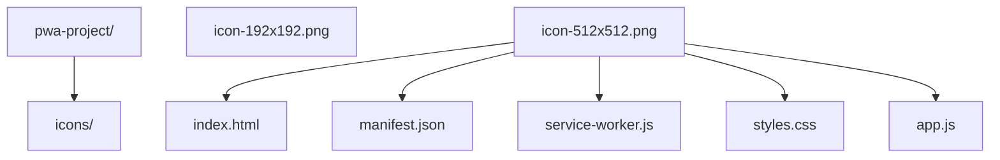

## 前置知识

建议先阅读以下内容再进入本文：

- [HTML5 概述与核心特性](/html5/020-HTML5OverviewCoreFeature)

## 知识点地图

- **知识类别**：线程与实时 / Service Worker 与 PWA（渐进式 Web 应用完整专项）。
- **解决什么问题**：网页天然「断网即死、关页即忘」。Service Worker 作为可编程网络代理带来离线缓存、推送通知、后台同步三种超能力；Manifest 与安装流程把网页升级为可安装到桌面的应用。本篇是这条线的完整专项。
- **什么时候用到**：站点要求弱网/离线可用时；需要推送触达用户时；要把 Web 应用装进桌面/主屏时。
- **与相邻篇章的分工**：[Web Components 与 PWA 开发](/html5/310-WebComponentsPWADevelopment) 保留 Web Components 主题，其 PWA 部分只给「跑通第一版」的最小骨架，深水区（完整生命周期、缓存策略、推送、安装体验、最佳实践）全部在本篇。

## 1. Service Worker 概述

Service Worker 是浏览器后台独立于网页运行的脚本，充当网络代理，支持离线缓存、推送通知和后台同步。

**生命周期**：Installing → Installed(Waiting) → Activating → Activated → Redundant

```javascript
if ('serviceWorker' in navigator) {
  navigator.serviceWorker
    .register('/sw.js', { scope: '/' })
    .then((reg) => console.log('注册成功'))
    .catch((err) => console.error('注册失败:', err));
}
```

## 2. 生命周期事件

```javascript
const CACHE_NAME = 'app-v1';
const CACHE_URLS = ['/', '/index.html', '/styles.css', '/app.js'];

self.addEventListener('install', (event) => {
  event.waitUntil(
    caches
      .open(CACHE_NAME)
      .then((cache) => cache.addAll(CACHE_URLS))
      .then(() => self.skipWaiting())
  );
});

self.addEventListener('activate', (event) => {
  event.waitUntil(
    caches
      .keys()
      .then((names) =>
        Promise.all(names.filter((n) => n !== CACHE_NAME).map((n) => caches.delete(n)))
      )
      .then(() => self.clients.claim())
  );
});
```

## 3. 缓存策略

| 策略                       | 说明                   | 适用场景   |
| -------------------------- | ---------------------- | ---------- |
| **Cache First**            | 优先缓存               | 静态资源   |
| **Network First**          | 优先网络               | API 请求   |
| **Stale While Revalidate** | 缓存即时响应，后台更新 | 非关键 API |

```javascript
// Cache First
self.addEventListener('fetch', (event) => {
  event.respondWith(caches.match(event.request).then((cached) => cached || fetch(event.request)));
});
```

## 4. PWA 基础

PWA（Progressive Web App）是结合了 Web 与原生应用优点的应用程序，核心特性五条：

- **可安装**：添加到主屏幕/桌面，独立窗口运行；
- **离线工作**：Service Worker 缓存资源（本篇 §2-§3）；
- **推送通知**：离线也能被触达（本篇 §5）；
- **后台同步**：网络恢复时自动补发数据；
- **响应式**：适配不同屏幕尺寸。

它不是单一技术而是一组标准的组合：Manifest 负责身份与安装、Service Worker 负责离线与后台能力、HTTPS 负责安全前提。

```json
{
  "name": "我的应用",
  "short_name": "我的App",
  "start_url": "/",
  "display": "standalone",
  "theme_color": "#1976d2",
  "icons": [{ "src": "/icons/192.png", "sizes": "192x192", "type": "image/png" }]
}
```

## 5. 推送通知与后台同步

```javascript
// 推送通知
self.addEventListener('push', (event) => {
  const data = event.data?.json() ?? { title: '新消息' };
  event.waitUntil(self.registration.showNotification(data.title, { body: data.body }));
});

// 后台同步
self.addEventListener('sync', (event) => {
  if (event.tag === 'sync-data') event.waitUntil(syncData());
});
```

## 6. Workbox：生产级 Service Worker 工具库（知道即可）

实际项目中很少完全手写 Service Worker，缓存策略、版本管理、路由匹配都由 **Workbox**（Google 维护的 SW 工具库）封装好了。至少要知道它的存在与形态：

```javascript
// 常见做法：在 sw.js 中使用 workbox-routing + workbox-strategies
// import { registerRoute } from 'workbox-routing';
// import { StaleWhileRevalidate } from 'workbox-strategies';
// registerRoute(
//   ({ request }) => request.destination === 'image',
//   new StaleWhileRevalidate({ cacheName: 'images' })
// );
```

**讲解：**

1. Workbox 提供 `registerRoute`（路由匹配）与 `StaleWhileRevalidate`、`CacheFirst`、`NetworkFirst` 等现成策略，对应本节的五种缓存策略。
2. 版本更新、预缓存清单、导航回退等痛点都有现成模块，不再手写生命周期细节。
3. 学习顺序建议：先手写 SW 理解原理（本篇 1-3 章），再用 Workbox 做生产项目。
4. 完整集成方式见 <https://developer.chrome.com/docs/workbox/>。

## Service Worker 注册

**注册 Service Worker**
`navigator.serviceWorker.register(<scriptURL>, [options]).then(<回调>)`
```javascript
// 基础注册（生产写法：等页面 load 完成后再注册，不与首屏资源抢带宽）
if ('serviceWorker' in navigator) {
  window.addEventListener('load', () => {
    navigator.serviceWorker
      .register('/sw.js', { scope: '/' })
      .then((reg) => console.log('注册成功,作用域:', reg.scope))
      .catch((err) => console.error('注册失败:', err));
  });
}

// 最小写法（教学/演示用）
if ('serviceWorker' in navigator) {
  navigator.serviceWorker
    .register('/sw.js', { scope: '/' })
    .then((reg) => console.log('注册成功,作用域:', reg.scope))
    .catch((err) => console.error('注册失败:', err));
}
```

| options 字段 | 说明                       | 示例                |
| ------------ | -------------------------- | ------------------- |
| `scope`      | 控制范围(子目录路径)       | `scope: '/'`        |
| `type`       | worker 类型 classic/module | `type: 'module'`    |
| `updateViaCache` | 缓存策略               | `updateViaCache: 'none'` |

**生命周期方法**
```javascript
// 获取注册对象
const reg = await navigator.serviceWorker.ready;

// 手动更新
await reg.update();

// 取消注册
await reg.unregister();

// 监听更新事件
reg.addEventListener('updatefound', () => {
  console.log('发现新版本');
});
```

---

## Service Worker 生命周期事件

**install 事件(安装阶段)**
`self.addEventListener('install', (event) => { event.waitUntil(<Promise>) })`
```javascript
const CACHE_NAME = 'app-v1';
const CACHE_URLS = ['/', '/index.html', '/styles.css', '/app.js'];

self.addEventListener('install', (event) => {
  event.waitUntil(
    caches
      .open(CACHE_NAME)
      .then((cache) => cache.addAll(CACHE_URLS))
      .then(() => self.skipWaiting()) // 跳过等待,立即激活
  );
});
```

**activate 事件(激活阶段)**
`self.addEventListener('activate', (event) => { event.waitUntil(<Promise>) })`
```javascript
self.addEventListener('activate', (event) => {
  event.waitUntil(
    caches
      .keys()
      .then((names) =>
        Promise.all(
          names
            .filter((n) => n !== CACHE_NAME)
            .map((n) => caches.delete(n))
        )
      )
      .then(() => self.clients.claim()) // 立即接管所有客户端
  );
});
```

**生命周期阶段**

| 阶段       | 事件       | 说明                  |
| ---------- | ---------- | --------------------- |
| Installing | `install`  | 安装中,预缓存资源     |
| Waiting    | -          | 等待旧 SW 释放        |
| Activating | `activate` | 激活中,清理旧缓存     |
| Activated  | -          | 已激活,可拦截请求     |
| Redundant  | -          | 安装失败或被替换      |

---

## fetch 事件与缓存策略

**fetch 事件**
`self.addEventListener('fetch', (event) => { event.respondWith(<Response>) })`
```javascript
// Cache First 优先缓存
self.addEventListener('fetch', (event) => {
  event.respondWith(
    caches.match(event.request).then((cached) => cached || fetch(event.request))
  );
});
```

**Cache First(适合静态资源)**
```javascript
self.addEventListener('fetch', (event) => {
  event.respondWith(
    caches.match(event.request).then((cached) => {
      return cached || fetch(event.request);
    })
  );
});
```

**Network First(适合 API 请求)**
```javascript
self.addEventListener('fetch', (event) => {
  event.respondWith(
    fetch(event.request).catch(() => caches.match(event.request))
  );
});
```

**Stale While Revalidate(缓存即时响应,后台更新)**
```javascript
self.addEventListener('fetch', (event) => {
  event.respondWith(
    caches.open(CACHE_NAME).then((cache) =>
      cache.match(event.request).then((cached) => {
        const fetchPromise = fetch(event.request).then((response) => {
          cache.put(event.request, response.clone());
          return response;
        });
        return cached || fetchPromise;
      })
    )
  );
});
```

**缓存策略对比**

| 策略                       | 说明                   | 适用场景     |
| -------------------------- | ---------------------- | ------------ |
| **Cache First**            | 优先缓存,无则请求网络  | 静态资源     |
| **Network First**          | 优先网络,失败用缓存    | API 请求     |
| **Stale While Revalidate** | 缓存即时响应,后台更新  | 非关键 API   |
| **Network Only**           | 仅网络                 | 实时数据     |
| **Cache Only**             | 仅缓存                 | 离线资源     |

---

## Cache Storage API

**缓存操作方法**
```javascript
// 打开缓存
const cache = await caches.open('my-cache-v1');

// 添加单个资源
await cache.add('/api/data');

// 批量添加
await cache.addAll(['/', '/styles.css', '/app.js']);

// 添加自定义响应
await cache.put('/api/custom', new Response('{"a":1}'));

// 匹配请求
const response = await cache.match('/api/data');

// 删除缓存项
await cache.delete('/api/data');

// 查询所有缓存名
const names = await caches.keys();

// 删除整个缓存
await caches.delete('my-cache-v1');
```

---

## Web App Manifest

**manifest.json 字段**
```json
{
  "name": "我的应用",
  "short_name": "我的App",
  "description": "应用描述",
  "start_url": "/",
  "scope": "/",
  "display": "standalone",
  "orientation": "portrait-primary",
  "background_color": "#ffffff",
  "theme_color": "#1976d2",
  "lang": "zh-CN",
  "dir": "ltr",
  "categories": ["productivity", "utilities"],
  "icons": [
    {
      "src": "/icons/192.png",
      "sizes": "192x192",
      "type": "image/png",
      "purpose": "any"
    },
    {
      "src": "/icons/512.png",
      "sizes": "512x512",
      "type": "image/png",
      "purpose": "maskable"
    }
  ],
  "shortcuts": [
    {
      "name": "新消息",
      "url": "/messages/new",
      "icons": [{ "src": "/icons/msg.png", "sizes": "96x96" }]
    }
  ]
}
```

| 字段              | 说明                              | 示例值                          |
| ----------------- | --------------------------------- | ------------------------------- |
| `name`            | 应用全名                          | `"我的应用"`                    |
| `short_name`      | 短名(主屏图标)                    | `"我的App"`                     |
| `start_url`       | 启动 URL                          | `"/"`                           |
| `scope`           | 作用域                            | `"/"`                           |
| `display`         | 显示模式                          | `standalone` / `fullscreen` / `minimal-ui` / `browser` |
| `theme_color`     | 主题色                            | `"#1976d2"`                     |
| `background_color`| 启动背景色                        | `"#ffffff"`                     |
| `orientation`     | 屏幕方向                          | `portrait-primary` / `landscape` |
| `icons`           | 图标数组                          | `[{src, sizes, type, purpose}]` |

进阶字段（应用商店化三件）：`display_override: ["window-controls-overlay", "standalone"]` 声明首选显示模式降级链；`screenshots`（富安装卡片展示截图，含 `form_factor: "wide"` 标注桌面/移动）；`file_handlers` 声明 PWA 可打开的文件类型（`accept: { "image/*": [".png", ".jpg"] }`）。

**HTML 中引用 manifest**
```html
<link rel="manifest" href="/manifest.json" />
<meta name="theme-color" content="#1976d2" />
<meta name="apple-mobile-web-app-capable" content="yes" />
<meta name="apple-mobile-web-app-status-bar-style" content="default" />
<link rel="apple-touch-icon" href="/icons/apple-180.png" />
```

**display 显示模式检测**
```javascript
// 检测是否以 PWA 方式启动
const isStandalone = window.matchMedia('(display-mode: standalone)').matches
  || window.navigator.standalone;

window.matchMedia('(display-mode: standalone)').addEventListener('change', (e) => {
  console.log(e.matches ? 'PWA 模式' : '浏览器模式');
});
```

---

## 推送通知

**Notification API**
```javascript
// 请求通知权限（必须在用户手势中调用，如点击事件里）
const permission = await Notification.requestPermission();
// permission 三值：'granted' 已授权 / 'denied' 已拒绝（JS 无法再次弹出授权框）
//                 / 'default' 未决定

// 显示通知（页面侧；后台推送场景用 SW 侧的 registration.showNotification）
new Notification('标题', {
  body: '通知正文',
  icon: '/icons/192.png',
  badge: '/icons/badge.png',
  tag: 'unique-id', // 相同 tag 会替换
  actions: [        // 通知上的快捷按钮（移动端支持最好）
    { action: 'open', title: '打开' },
    { action: 'close', title: '关闭' },
  ],
  data: { url: '/page' },
  vibrate: [100, 50, 100],
  requireInteraction: true, // 用户必须手动关闭
});

// 页面侧点击处理
notification.onclick = () => {
  window.focus();
  notification.close();
};
```
  body: '通知正文',
  icon: '/icons/192.png',
  badge: '/icons/badge.png',
  tag: 'unique-id', // 相同 tag 会替换
  data: { url: '/page' },
  vibrate: [100, 50, 100],
  requireInteraction: true, // 用户必须手动关闭
});
```

**Push API(服务端推送)**
```javascript
// 主线程:订阅推送
const reg = await navigator.serviceWorker.ready;
const subscription = await reg.pushManager.subscribe({
  userVisibleOnly: true,
  applicationServerKey: urlBase64ToUint8Array(VAPID_PUBLIC_KEY),
});
// 将 subscription 发送到服务端保存
await fetch('/api/subscribe', {
  method: 'POST',
  body: JSON.stringify(subscription),
  headers: { 'Content-Type': 'application/json' },
});
```

**Service Worker 处理推送**
```javascript
self.addEventListener('push', (event) => {
  const data = event.data?.json() ?? { title: '新消息', body: '' };
  event.waitUntil(
    self.registration.showNotification(data.title, {
      body: data.body,
      icon: '/icons/192.png',
      data: data.url,
    })
  );
});

// 通知点击
self.addEventListener('notificationclick', (event) => {
  event.notification.close();
  event.waitUntil(clients.openWindow(event.notification.data || '/'));
});
```

---

## 后台同步

**注册后台同步**
```javascript
const reg = await navigator.serviceWorker.ready;
await reg.sync.register('sync-data');
```

**Service Worker 处理同步**
```javascript
self.addEventListener('sync', (event) => {
  if (event.tag === 'sync-data') {
    event.waitUntil(syncData());
  }
});

async function syncData() {
  try {
    await fetch('/api/sync', {
      method: 'POST',
      body: JSON.stringify({ data: 'sync data' }),
    });
  } catch (e) {
    throw e; // 抛出错误会自动重试
  }
}
```

**Periodic Sync(周期同步)**
```javascript
// 注册周期同步
const reg = await navigator.serviceWorker.ready;
const status = await navigator.permissions.query({ name: 'periodic-background-sync' });
if (status.state === 'granted') {
  await reg.periodicSync.register('update-content', {
    minInterval: 24 * 60 * 60 * 1000, // 24 小时
  });
}
```

---

## Clients API

**与客户端通信**
```javascript
// 获取所有客户端
const clients = await self.clients.matchAll({ includeUncontrolled: true, type: 'window' });

// 向所有客户端发送消息
clients.forEach((client) => client.postMessage({ type: 'UPDATE' }));

// 打开新窗口
await self.clients.openWindow('https://example.com');

// 获取当前客户端
const client = await self.clients.get(clientId);
```

---

## PWA 安装

**beforeinstallprompt 事件**
```javascript
let deferredPrompt;

window.addEventListener('beforeinstallprompt', (e) => {
  e.preventDefault();
  deferredPrompt = e;
  showInstallButton();
});

document.getElementById('installBtn').addEventListener('click', async () => {
  if (!deferredPrompt) return;
  deferredPrompt.prompt();
  const { outcome } = await deferredPrompt.userChoice;
  console.log(outcome); // 'accepted' | 'dismissed'
  deferredPrompt = null;
});

window.addEventListener('appinstalled', () => {
  console.log('应用已安装');
});
```

**Window Controls Overlay（桌面端自定义标题栏）**
```javascript
// 检测支持
const supported = 'windowControlsOverlay' in navigator;

// 监听标题栏区域变化（display_override 含 window-controls-overlay 时生效）
navigator.windowControlsOverlay.addEventListener('geometrychange', (e) => {
  console.log('标题栏区域变化', e.titlebarAreaRect);
});
```

## 7. PWA 最佳实践与项目形态

承接自 Web Components 与 PWA 开发篇的最佳实践清单：

1. **响应式设计**：确保在所有设备上都有良好的用户体验；
2. **离线优先**：设计应用时先考虑离线场景，再叠加在线增强；
3. **快速加载**：预缓存关键资源，弱网下秒开；
4. **安全**：HTTPS 是 Service Worker 的硬前提；
5. **可安装**：提供清晰的安装提示（beforeinstallprompt 引导，见上方速查）；
6. **推送克制**：合理使用推送通知，避免过度打扰导致用户关闭权限；
7. **后台同步**：用后台同步确保离线操作最终一致；
8. **性能监控**：用 Lighthouse 的 PWA 审计持续检查。

**PWA 项目最小结构**（Manifest + SW + 图标三件就够跑通第一版）：



**工具与支持：**

- **Workbox**：本篇 §6 已述，生产级 SW 工具库；
- **Lighthouse**：Chrome DevTools 内置的 PWA 性能与质量审计；
- **PWABuilder**：微软维护的 PWA 生成与打包工具（可产出商店包）；
- 浏览器支持：Chrome/Edge 完整支持；Firefox 部分支持（推送受限）；Safari 部分支持（推送通知 iOS 16.4 起才有，且要求添加到主屏）。

<!-- 恢复自 cnt-content/full/005-html5/240-HTML5OfflineStorageWebAPI.md（实施前 HEAD 62c90663 版本）；拆分时该小节未随迁，2026-10-07 内容保全复核恢复 -->

## Service Workers 最佳实践

- **缓存策略**：根据资源类型选择合适的缓存策略
- **缓存版本**：合理管理缓存版本，避免缓存过期问题
- **网络请求**：正确处理网络请求，避免无限循环
- **调试**：使用 Chrome DevTools 进行 Service Worker 调试
- **更新**：正确处理 Service Worker 的更新流程

## 动手试试

### 入门版（必做）

1. 在本地静态服务器（如 `npx serve`）上注册 Service Worker，缓存首页与 CSS；
2. 打开浏览器开发者工具，在 Network 面板勾选 Offline，刷新页面确认仍能打开；
3. 修改缓存版本号（`app-v2`），确认旧缓存被清理。

### 进阶版（选做）

1. 实现 Network First 的 API 缓存策略，断网时返回最后一次成功的数据；
2. 用 `clients.matchAll` 在 SW 更新后通知页面弹“有新版本，点击刷新”；
3. 配合 Web App Manifest 让页面可安装到桌面，并用 `beforeinstallprompt` 自定义安装按钮（记下 outcome 是 accepted 还是 dismissed）；
4. 在合适时机（设置页里的按钮而非首屏弹窗）请求通知权限，被拒后页面仍正常工作。

## 核心知识点

> 一句话记住 Service Worker：注册在页面，脚本管缓存；install 预存，activate 清理，fetch 拦截请求；HTTPS 才能用。

- Service Worker 是独立于页面的网络代理脚本，支持离线、推送、后台同步；
- 生命周期：install（预缓存）→ activate（清旧缓存）→ fetch（拦截请求）；
- 缓存策略：Cache First（静态资源）、Network First（API）、Stale While Revalidate（非关键数据）；
- Manifest 让网页可安装：`name`/`start_url`/`display`/`icons`；
- 只在 HTTPS 或 localhost 下生效，更新后通常需要刷新两次；
- Clients API 用于 SW 与页面通信。

## 注意事项与改进建议

| 问题点 | 说明 | 改进方案 |
| --- | --- | --- |
| 缓存无版本管理 | 更新后用户永远拿旧资源 | 版本化缓存名 + activate 清理 |
| 缓存 API 响应 | 数据过期 | API 用 Network First 或加过期时间 |
| 忘记 `clone()` | 响应体只能消费一次，写入缓存报错 | 写入前 `response.clone()` |
| 页面未受控 | 注册后首次刷新仍走网络 | `clients.claim()` 或提示刷新 |
| 缓存了不该缓存的页面 | 登录态等敏感内容被离线保存 | 只缓存公共静态资源 |
| 本地 http 测试失败 | SW 只在 HTTPS/localhost 生效 | 使用 localhost 或本地 HTTPS |

## 扩展学习

- 基础铺垫：[Web Storage](/html5/245-WebStorage) 的存储方案决策指南（Cache Storage 速查在本篇）；
- 页面侧 API：[Observer 家族与页面生命周期](/html5/284-ObserverAndPageLifecycleAPIs) 的 Page Visibility 与后台资源节流；
- 推送完整流程：Web Push 协议与 VAPID 密钥管理；
- 性能：`javascript/510-CoreWebVitalsAndPerformanceMetrics` 中缓存对加载指标的影响；
- 工程化：Workbox 库封装注册、缓存与更新逻辑；
- 组件化路线：[Web Components 与 PWA 开发](/html5/310-WebComponentsPWADevelopment) 讲自定义元素体系，与本篇的 PWA 专项互补。
