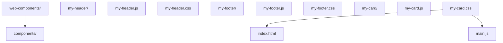

## 知识点地图

- **知识类别**：组件化 / Web Components（平台原生的自定义元素体系）。
- **解决什么问题**：不用任何框架，也能做出可复用、样式隔离、带生命周期的自定义 HTML 元素——`<my-card>` 写进任何页面（含框架页面）都能工作。本篇讲清三件套：Custom Elements（注册元素）、Shadow DOM（隔离样式）、HTML Templates + slot（复用结构）。
- **什么时候用到**：跨框架/跨项目的可复用组件（设计系统）、微前端中的隔离单元、给静态页面加组件能力而不引入框架。
- **PWA 去向**：本篇原含 PWA 各节，已全部归并进 [Service Worker 与 PWA](/html5/300-ServiceWorkerPWA) 专项（Manifest、SW 生命周期、缓存策略、推送、后台同步、安装体验与最佳实践），本篇专注组件体系。

## 前置知识

建议先阅读以下内容再进入本文：

- [HTML5 概述与核心特性](/html5/020-HTML5OverviewCoreFeature)

> 前置要求：class、构造函数、DOM 与事件（`javascript/001`-`005`、`039`、`017`）。
>
> **警告：未学完 JavaScript 基础之前，第一遍请直接跳过本篇**，先按 005 的路线图走完主线。本篇是组件级内容，硬啃会严重打击信心；学完 JS 再回来，收获完全不同。

## 1. Web Components 概述

Web Components 是一组 Web 平台 API，允许开发者创建可重用的自定义元素，这些元素可以在任何 HTML 页面中使用，无论使用什么框架。

### 核心技术

- **Custom Elements**：创建自定义 HTML 元素
- **Shadow DOM**：封装组件样式和结构
- **HTML Templates**：定义可重用的 HTML 结构
- **HTML Imports**：导入组件（已被 ES 模块取代）

## 2. Custom Elements

### 2.1 定义自定义元素

```javascript
class MyElement extends HTMLElement {
  constructor() {
    super();
    // 元素初始化
  }
  // 当元素被添加到 DOM 时调用
  connectedCallback() {
    this.innerHTML = `<p>Hello, Web Components!</p>`;
  }
  // 当元素从 DOM 中移除时调用
  disconnectedCallback() {
    // 清理资源
  }
  // 当属性变化时调用
  attributeChangedCallback(name, oldValue, newValue) {
    // 处理属性变化
  }
  // 定义需要观察的属性
  static get observedAttributes() {
    return ['title'];
  }
}
// 注册自定义元素
customElements.define('my-element', MyElement);
```

### 2.2 使用自定义元素

```html
<my-element title="Hello"></my-element>
```

## 3. Shadow DOM

### 3.1 创建 Shadow DOM

```javascript
class MyElement extends HTMLElement {
  constructor() {
    super();
    // 创建 Shadow DOM
    const shadow = this.attachShadow({ mode: 'open' });
    // 创建样式
    const style = document.createElement('style');
    style.textContent = `
  p {
  color: blue;
  font-size: 18px;
  }
  `;
    // 创建内容
    const p = document.createElement('p');
    p.textContent = 'Hello from Shadow DOM!';
    // 添加到 Shadow DOM
    shadow.appendChild(style);
    shadow.appendChild(p);
  }
}
customElements.define('my-shadow-element', MyElement);
```

## 4. HTML Templates

### 4.1 定义模板

```html
<template id="my-template">
  <style>
    .container {
      padding: 20px;
      background: #f0f0f0;
      border-radius: 8px;
    }
    h3 {
      color: #333;
    }
  </style>
  <div class="container">
    <h3></h3>
    <p></p>
  </div>
</template>
```

### 4.2 使用模板

```javascript
class MyTemplateElement extends HTMLElement {
  constructor() {
    super();
    const shadow = this.attachShadow({ mode: 'open' });
    // 获取模板
    const template = document.getElementById('my-template');
    const content = template.content.cloneNode(true);
    // 设置内容
    content.querySelector('h3').textContent = this.getAttribute('title') || 'Default Title';
    content.querySelector('p').textContent = this.getAttribute('message') || 'Default message';
    shadow.appendChild(content);
  }
}
customElements.define('my-template-element', MyTemplateElement);
```

## 5. 组件生命周期

### 5.1 生命周期回调

| 回调方法                                             | 触发时机             |
| :--------------------------------------------------- | :------------------- |
| `constructor()`                                      | 元素创建时           |
| `connectedCallback()`                                | 元素添加到 DOM 时    |
| `disconnectedCallback()`                             | 元素从 DOM 中移除时  |
| `attributeChangedCallback(name, oldValue, newValue)` | 属性变化时           |
| `adoptedCallback()`                                  | 元素被移动到新文档时 |

## 6. 项目结构



一个组件一个目录（js + css 成对），`main.js` 负责把所有组件 `import` 进来触发注册——自定义元素靠「模块被加载」完成注册，忘了 import 页面上就只是一个无样式的未知标签。

## 7. 工具库与浏览器支持

- **Lit**：Google 开发的轻量级 Web Components 库
- **Stencil**：Ionic 团队开发的 Web Components 编译器
- **Svelte**：可以编译为 Web Components 的前端框架

浏览器支持：Chrome、Firefox、Edge 完全支持；Safari 支持（旧版本需要 polyfill）。

## 8. 常见问题与解决方案

**问题**：自定义元素在某些浏览器中不工作
**解决方案**：使用 Web Components polyfill

**问题**：样式隔离问题
**解决方案**：使用 Shadow DOM 确保样式隔离

## 动手试试

### 入门版（必做）

1. 定义一个 `<my-card>` 自定义元素，包含标题和内容，注册后在页面中使用；
2. 给组件加 Shadow DOM，确认内部样式不影响页面其它元素。

### 进阶版（选做）

1. 用 `<template>` + `slot` 实现可插拔内容的卡片组件；
2. 用 `setCustomValidity` 或组件生命周期实现一个带校验的 `<my-input>`；
3. 想练 PWA（Manifest + Service Worker + 离线），去 [Service Worker 与 PWA](/html5/300-ServiceWorkerPWA) 的「动手试试」——那里的入门版正好衔接本篇。

## 核心知识点

> 一句话记住 Web Components：Custom Elements 注册元素、Shadow DOM 隔离样式、Template + slot 复用结构；名称必须带连字符，样式隔离靠 `:host` 与 `::part`。

- Custom Elements：继承 `HTMLElement` + `customElements.define`，名称必须带连字符；
- Shadow DOM：`attachShadow` 隔离样式与结构，`:host` 定制宿主；
- HTML Templates：`<template>` 定义可复用结构，配合 `slot` 插槽分发内容；
- 生命周期五个回调，`attributeChangedCallback` 只对 `observedAttributes` 里声明的属性触发；
- 组件靠「模块被 import」完成注册，页面忘引入就是未知标签。

## 注意事项与改进建议

| 问题点 | 说明 | 改进方案 |
| --- | --- | --- |
| 自定义元素名称无连字符 | 与原生标签冲突 | 名称必须包含连字符 |
| 忘记 `super()` | 构造器报错，元素无法初始化 | 第一行调用 `super()` |
| Shadow DOM 内样式写死 | 组件无法被外部定制 | 用 CSS 变量提供主题入口 |
| 组件与框架混用不熟 | 生命周期与框架渲染冲突 | 先掌握原生生命周期，再对照框架集成 |

## 扩展学习

- 组件细节：`html5/220-EmbeddedContent` 对比 iframe 与 Web Components 的隔离方式；
- PWA 深化：[Service Worker 与 PWA](/html5/300-ServiceWorkerPWA) 完整生命周期与缓存策略（本篇原 PWA 节的归宿）；
- 离线存储：[Web Storage](/html5/245-WebStorage) 本地存储；
- 框架集成：Vue/React 中使用自定义元素的官方指南。

## Custom Elements 自定义元素

**定义自定义元素**
`customElements.define(<名称>, <类>, [options])`
```javascript
class MyElement extends HTMLElement {
  constructor() {
    super();
    // 元素初始化
  }

  // 当元素被添加到 DOM 时调用
  connectedCallback() {
    this.innerHTML = `<p>Hello, Web Components!</p>`;
  }

  // 当元素从 DOM 中移除时调用
  disconnectedCallback() {
    // 清理资源
  }

  // 当属性变化时调用
  attributeChangedCallback(name, oldValue, newValue) {
    // 处理属性变化
  }

  // 定义需要观察的属性
  static get observedAttributes() {
    return ['title'];
  }

  // 元素被移动到新文档时调用
  adoptedCallback() {}
}

// 注册自定义元素(名称必须包含连字符)
customElements.define('my-element', MyElement);
```

**使用自定义元素**
```html
<my-element title="Hello"></my-element>
```

**生命周期回调**

| 回调方法                                             | 触发时机             |
| :--------------------------------------------------- | :------------------- |
| `constructor()`                                      | 元素创建时           |
| `connectedCallback()`                                | 元素添加到 DOM 时    |
| `disconnectedCallback()`                             | 元素从 DOM 中移除时  |
| `attributeChangedCallback(name, oldValue, newValue)` | 属性变化时           |
| `adoptedCallback()`                                  | 元素被移动到新文档时 |

**CustomizedElement 内置扩展**
```javascript
class FancyButton extends HTMLButtonElement {
  constructor() {
    super();
    this.addEventListener('click', () => console.log('点击'));
  }
}

// 扩展内置元素
customElements.define('fancy-button', FancyButton, { extends: 'button' });
```

```html
<!-- 使用 is 属性 -->
<button is="fancy-button">点击</button>
```

**元素查询与升级**
```javascript
// 获取自定义元素引用
const el = customElements.get('my-element');

// 强制升级未定义的元素
await customElements.whenDefined('my-element');
console.log('my-element 已定义');
```

---

## Shadow DOM 影子 DOM

**attachShadow 创建 Shadow DOM**
`element.attachShadow({ mode: 'open' | 'closed' })`
```javascript
class MyElement extends HTMLElement {
  constructor() {
    super();
    // 创建 Shadow DOM
    const shadow = this.attachShadow({ mode: 'open' });

    // 创建样式
    const style = document.createElement('style');
    style.textContent = `
      p {
        color: blue;
        font-size: 18px;
      }
    `;

    // 创建内容
    const p = document.createElement('p');
    p.textContent = 'Hello from Shadow DOM!';

    shadow.appendChild(style);
    shadow.appendChild(p);
  }
}
customElements.define('my-shadow-element', MyElement);
```

| mode 值   | 说明                                  |
| --------- | ------------------------------------- |
| `'open'`  | 外部可通过 `element.shadowRoot` 访问   |
| `'closed'`| 拒绝外部访问 `element.shadowRoot` 为 null |

**Shadow DOM 模板化**
```javascript
class MyTemplateElement extends HTMLElement {
  constructor() {
    super();
    const shadow = this.attachShadow({ mode: 'open' });
    const template = document.getElementById('my-template');
    const content = template.content.cloneNode(true);

    content.querySelector('h3').textContent = this.getAttribute('title') || '默认标题';
    content.querySelector('p').textContent = this.getAttribute('message') || '默认内容';
    shadow.appendChild(content);
  }
}
customElements.define('my-template-element', MyTemplateElement);
```

**shadowRoot 操作**
```javascript
// 获取 shadowRoot(open 模式)
const shadow = element.shadowRoot;

// 在 shadow 中查询元素
const innerEl = shadow.querySelector('.inner');

// 在 shadow 中添加元素
shadow.appendChild(document.createElement('div'));
```

**Declarative Shadow DOM(声明式 Shadow DOM)**
```html
<host-element>
  <template shadowrootmode="open">
    <style>p { color: red; }</style>
    <p>声明式 Shadow DOM 内容</p>
  </template>
</host-element>
```

---

## HTML Templates 模板

**template 元素**
```html
<template id="my-template">
  <style>
    .container {
      padding: 20px;
      background: #f0f0f0;
      border-radius: 8px;
    }
    h3 {
      color: #333;
    }
  </style>
  <div class="container">
    <h3></h3>
    <p></p>
  </div>
</template>
```

**使用模板**
```javascript
class MyTemplateElement extends HTMLElement {
  constructor() {
    super();
    const shadow = this.attachShadow({ mode: 'open' });

    // 获取模板
    const template = document.getElementById('my-template');
    // 克隆模板内容
    const content = template.content.cloneNode(true);

    // 填充内容
    content.querySelector('h3').textContent = this.getAttribute('title') || 'Default';
    content.querySelector('p').textContent = this.getAttribute('message') || 'Message';

    shadow.appendChild(content);
  }
}
customElements.define('my-template-element', MyTemplateElement);
```

**slot 插槽**
```html
<!-- 组件定义 -->
<template id="card-template">
  <div class="card">
    <slot name="header">默认头部</slot>
    <hr />
    <slot>默认内容</slot>
  </div>
</template>
```

```html
<!-- 使用插槽 -->
<my-card>
  <span slot="header">自定义头部</span>
  <p>自定义内容</p>
</my-card>
```

**slotchange 事件**
```javascript
const slot = shadow.querySelector('slot');
slot.addEventListener('slotchange', (e) => {
  const assigned = e.target.assignedNodes();
  console.log('插槽内容变化', assigned);
});
```

---

## CSS Scoping 样式隔离

**CSS 自定义属性穿透**
```css
/* 外部定义变量 */
:host {
  --primary-color: #1976d2;
}

/* shadow 内部使用 */
.button {
  background: var(--primary-color);
}
```

**host 选择器**
```css
/* 选中宿主元素 */
:host {
  display: block;
}

/* 选中具有特定类的宿主 */
:host(.active) {
  opacity: 1;
}

/* 选中特定宿主标签 */
:host(my-button) {
  border-radius: 4px;
}
```

**:host-context 上下文选择器**
```css
/* 当祖先元素具有 .dark-theme 时 */
:host-context(.dark-theme) {
  background: #333;
  color: #fff;
}
```

**::part() 伪元素**
```javascript
// 组件内
shadow.innerHTML = `
  <div part="container">
    <span part="label">标签</span>
  </div>
`;
```

```css
/* 外部样式表选中 part */
my-element::part(container) {
  background: red;
}
my-element::part(label) {
  color: white;
}
```
