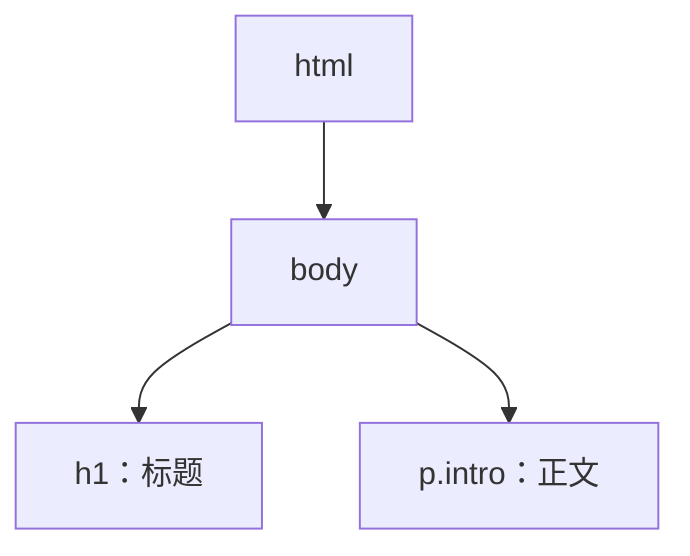
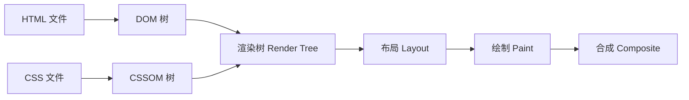

## 0. 直觉：浏览器把“HTML + CSS”变成屏幕上的画面

你写的是两个文件：`index.html` 描述“页面上有什么”，`style.css` 描述“这些东西长什么样”。浏览器拿到它们之后，不是直接画，而是先做四件事：

1. 把 HTML 读成一颗节点树（DOM）；
2. 把 CSS 读成一颗样式树（CSSOM）；
3. 把两棵树合并成“渲染树”（Render Tree），只留下真正要画的内容；
4. 计算位置（布局）并绘制到屏幕（绘制）。

本课只讲这条流程的“入门版”，让你知道样式为什么会生效、为什么不生效、以及为什么 `link` 要写在 `<head>` 里。深入版本见 `css/061-CriticalRenderPathOptimization`。

## 1. 第一步：HTML 变成 DOM

浏览器从上到下读取 HTML 文件，每遇到一个标签就生成一个节点，标签的嵌套关系形成“父子关系”，最终得到一颗文档对象模型树（DOM Tree）。

```html
<body>
  <h1>标题</h1>
  <p class="intro">正文</p>
</body>
```

对应的 DOM 结构：



**讲解：** DOM 是“页面的结构骨架”，CSS 选择器就是在这颗树上找节点。`p` 能找到那个 `<p>`，`.intro` 能找到带 `intro` 类的元素——选择器匹配的本质是“在 DOM 树上做查询”。

## 2. 第二步：CSS 变成 CSSOM

浏览器遇到 `<link rel="stylesheet">` 或 `<style>` 标签后，会下载并解析 CSS。解析结果是另一颗树：CSSOM（CSS Object Model）。它记录每条规则的选择器、声明以及它们之间的层叠关系。

```css
h1 {
  color: red;
}
.intro {
  color: blue;
}
```

**讲解：** CSSOM 不是简单地把规则排成一排，而是已经按“选择器权重 + 书写顺序”算好了“谁最终生效”。所以你在 007 学到的优先级，发生在这个阶段。

## 3. 第三步：DOM + CSSOM 合成渲染树

浏览器把 DOM 和 CSSOM 合并成渲染树（Render Tree）：遍历 DOM 节点，为每个需要显示的节点挂上最终样式。



**讲解：** 渲染树只保留“要画出来”的节点。`display: none` 的元素不会进入渲染树；`visibility: hidden` 的元素会进入但不显示。这也是为什么 `display: none` 能直接“移除”布局占位。

## 4. 第四步：布局、绘制与合成

渲染树里的每个节点都有了样式，接下来浏览器计算它在页面上的位置和大小（布局 Layout），再把它画成像素（绘制 Paint），最后把多个图层合并成你看到的画面（合成 Composite）。

**讲解：** 修改 `width`、`padding` 会触发“布局 + 绘制 + 合成”全链路，代价最高；修改 `transform`、`opacity` 只触发合成，代价最低。入门阶段记住结论即可：动位置、大小比动透明度贵得多。

## 5. 为什么 `link` 要放在 `<head>`？

因为 CSS 是“渲染阻塞资源”：浏览器在 CSSOM 构建完成之前，不会把页面画给用户。`<link>` 放在 `<head>` 里，能让浏览器尽早开始下载 CSS；放在 `<body>` 底部虽然也能生效，但浏览器可能先渲染出一版没有样式的页面，再突然“闪”成有样式的样子。

```html
<!DOCTYPE html>
<html lang="zh-CN">
  <head>
    <link rel="stylesheet" href="style.css" />
  </head>
  <body>
    <h1>标题</h1>
  </body>
</html>
```

**讲解：** 这是“为什么所有教程都让你把样式放头部”的底层原因——不是习惯，而是渲染流程决定的。

## 6. 与 035 的分工

`css/061-CriticalRenderPathOptimization` 讲的是“如何让这条流程更快”：压缩 CSS、去掉阻塞、延迟非关键样式等。本课只要建立流程直觉：

- HTML → DOM；
- CSS → CSSOM；
- DOM + CSSOM → 渲染树；
- 布局 → 绘制 → 合成。

## 7. 动手试试

1. 打开任意网页，按 F12 打开开发者工具，切到 Performance（性能）面板，刷新页面，观察 HTML/CSS 的加载瀑布；
2. 把页面里的 `<style>` 从 `<head>` 挪到 `<body>` 末尾，刷新看是否有“样式闪烁”；
3. 给元素加 `display: none` 与 `visibility: hidden`，对比 DevTools 布局面板中占位的变化；
4. 进阶挑战：在 DevTools 的 Rendering 面板勾选 Paint Flashing，观察修改 `width` 与修改 `transform` 时重绘区域的差别。

## 8. 核心知识点

> 一句话记住 CSS 工作原理：HTML 建 DOM，CSS 建 CSSOM，两棵树合成渲染树，再布局、绘制、合成。

- DOM 是 HTML 的结构树，CSS 选择器在 DOM 上匹配节点；
- CSSOM 是解析后的样式树，优先级计算发生在这里；
- 渲染树 = DOM + CSSOM 中“需要显示”的节点；
- 布局算位置，绘制画像素，合成拼图层；
- CSS 阻塞渲染，所以 `link` 放 `<head>`；
- 改尺寸触发全链路，改 `transform`/`opacity` 只触发合成。

## 9. 注意事项与改进建议

| 问题点 | 说明 | 改进方案 |
| --- | --- | --- |
| 样式闪烁 | `link` 放 body 底部或 CSS 太大 | `link` 放 `<head>`，必要时内联首屏关键样式 |
| 认为 display:none 只是“看不见” | 它会让元素完全退出渲染树 | 需要保留占位用 `visibility: hidden` |
| 过度追求“性能技巧” | 入门阶段不必背全部渲染细节 | 先记“改尺寸贵、改合成便宜” |
| 用 JS 频繁改布局属性 | 每次修改都触发重排 | 批量修改或用 `transform` 动画 |

## 10. 扩展学习

- 关键渲染路径深入：`css/061-CriticalRenderPathOptimization`；
- 引入方式与渲染阻塞：`css/012-StyleSheetImportMethod`；
- 优先级计算：`css/010-PriorityCalculation`；
- HTML 结构基础：`html5/007-HTML5OverviewCoreFeature`。
