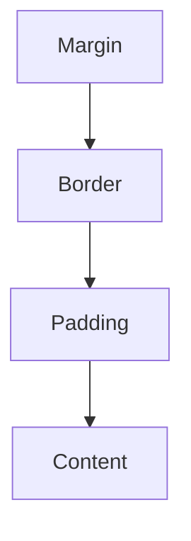

## 0. 阅读指南

本章文档难度标记为 intermediate，是因为末尾包含 BFC 与 margin 塌陷两个进阶主题。按难度分层阅读：

- **入门必读（第 1-2 节、第 3.1-3.2 节）**：盒模型的四层组成、`content-box` 与 `border-box`、margin/padding 的基本用法——这是布局的地基，第一遍精读并完成动手试试；
- **进阶选读（第 3.3 节、第 4 节）**：margin 塌陷与 BFC 触发条件，第一遍可以跳过，先读 `css/014-MarginCollapse` 与 `css/017-StackingContext` 的速通部分，再回头看本节；
- **参考章节（第 5-7 节）**：应用、最佳实践与高级技巧，随用随查。

这样安排后，本章的“入门路径”实际难度为 beginner：先会算盒子尺寸，再逐步进入格式化上下文。

## 1. 盒模型组成 (Components)

### 1.1 基本组成

每个 HTML 元素都被视为一个矩形盒子，由以下四个部分组成：
| 组成部分 | 描述 | 特性 |
|---------|------|------|
| **Content (内容)** | 实际的文本、图片等内容 | 由 `width` 和 `height` 属性控制大小 |
| **Padding (内边距)** | 内容与边框之间的透明区域 | 可以使用 `padding` 属性设置，会影响元素的实际大小 |
| **Border (边框)** | 围绕 Padding 和 Content 的线 | 由 `border` 属性控制，包括宽度、样式和颜色 |
| **Margin (外边距)** | 盒子与其他元素之间的间距 | 由 `margin` 属性控制，是透明的，不会影响元素自身大小 |

### 1.2 盒模型示意图



### 1.3 代码示例

```html
<!DOCTYPE html>
<html lang="zh-CN">
  <head>
    <style>
      .box {
        width: 200px;
        height: 100px;
        padding: 20px;
        border: 5px solid #333;
        margin: 15px;
        background-color: #f0f0f0;
      }
    </style>
  </head>
  <body>
    <div class="box">内容区域</div>
  </body>
</html>
```

## 2. 盒模型类型 (Box Sizing)

### 2.1 标准盒模型 (`content-box`)

**默认值**，遵循 W3C 标准。

- **宽度计算**: `width = 内容宽度`
- **实际占用空间**: `width + padding + border`
- **特点**: 当增加 `padding` 或 `border` 时，元素的实际宽度会增加
  **代码示例**:

```css
.standard-box {
  box-sizing: content-box;
  width: 200px;
  padding: 20px;
  border: 5px solid #333;
  /* 实际宽度: 200 + 20*2 + 5*2 = 250px */
}
```

### 2.2 怪异/IE 盒模型 (`border-box`)

**推荐使用**，更符合直觉的盒模型。

- **宽度计算**: `width = 内容宽度 + padding + border`
- **实际占用空间**: 等于设置的 `width`
- **特点**: 当增加 `padding` 或 `border` 时，元素的实际宽度不会改变，只会压缩内容区域
  **代码示例**:

```css
.border-box {
  box-sizing: border-box;
  width: 200px;
  padding: 20px;
  border: 5px solid #333;
  /* 实际宽度: 200px (内容宽度被压缩为 150px) */
}
```

### 2.3 全局盒模型设置

推荐在项目中全局使用 `border-box`，这样可以更方便地控制元素大小：

```css
 /* 方法 1: 全局设置 */
 * {
  box-sizing: border-box;
 }
 /* 方法 2: 更精确的设置，包括伪元素 */
 * {
  box-sizing: border-box;
 }
 /* 方法 3: 继承方式，更灵活 */
 html {
  box-sizing: border-box;
 }
 * {
  box-sizing: inherit;
 }
```

### 2.4 盒模型类型的应用场景

| 场景             | 推荐盒模型    | 原因                               |
| ---------------- | ------------- | ---------------------------------- |
| 响应式布局       | `border-box`  | 更容易计算元素尺寸，避免布局错位   |
| 固定宽度布局     | `border-box`  | 可以随意调整内边距而不影响整体布局 |
| 第三方组件集成   | `content-box` | 保持与原始组件一致的盒模型行为     |
| 精确控制内容区域 | `content-box` | 可以准确控制内容区域的大小         |

## 3. 外边距特性 (Margin Features)

### 3.1 外边距的基本用法

```css
/* 四个方向的外边距 */
margin: 10px; /* 四个方向都是 10px */
margin: 10px 20px; /* 上下 10px，左右 20px */
margin: 10px 20px 30px; /* 上 10px，左右 20px，下 30px */
margin: 10px 20px 30px 40px; /* 上 10px，右 20px，下 30px，左 40px */
/* 单个方向的外边距 */
margin-top: 10px;
margin-right: 20px;
margin-bottom: 30px;
margin-left: 40px;
```

### 3.2 水平居中

使用 `margin: 0 auto;` 可以实现块级元素的水平居中：

```css
.centered {
  width: 50%; /* 必须指定宽度 */
  margin: 0 auto; /* 上下外边距为 0，左右自动 */
}
```

**代码示例**:

```html
<!DOCTYPE html>
<html lang="zh-CN">
  <head>
    <style>
      .container {
        width: 100%;
        background-color: #f0f0f0;
      }
      .centered-box {
        width: 50%;
        margin: 20px auto;
        padding: 20px;
        background-color: #fff;
        border: 1px solid #ddd;
      }
    </style>
  </head>
  <body>
    <div class="container">
      <div class="centered-box">这个盒子水平居中</div>
    </div>
  </body>
</html>
```

### 3.3 外边距塌陷 (Margin Collapse)

**定义**：在垂直方向上，相邻的两个外边距会取最大值，而非累加。

#### 3.3.1 常见的外边距塌陷场景

1. **相邻元素的外边距塌陷**

```html
<div style="margin-bottom: 30px;">元素 1</div>
<div style="margin-top: 20px;">元素 2</div>
<!-- 实际间距: 30px (取最大值)，而非 50px -->
```

1. **父子元素的外边距塌陷**

```html
<div style="margin-top: 20px;">
  <div style="margin-top: 30px;">子元素</div>
</div>
<!-- 实际间距: 30px (取最大值)，而非 50px -->
```

1. **空元素的外边距塌陷**

```html
<div style="margin-top: 20px; margin-bottom: 30px;"></div>
<!-- 实际高度: 30px (取最大值)，而非 50px -->
```

#### 3.3.2 解决外边距塌陷的方法

| 方法           | 适用场景     | 代码示例                         |
| -------------- | ------------ | -------------------------------- |
| **添加边框**   | 父子元素塌陷 | `border: 1px solid transparent;` |
| **添加内边距** | 父子元素塌陷 | `padding: 1px;`                  |
| **使用 BFC**   | 各种塌陷场景 | `overflow: hidden;`              |
| **使用浮动**   | 相邻元素塌陷 | `float: left;`                   |
| **使用定位**   | 相邻元素塌陷 | `position: absolute;`            |

**代码示例**:

```html
<!DOCTYPE html>
<html lang="zh-CN">
  <head>
    <style>
      .parent {
        background-color: #f0f0f0;
        /* 方法 1: 添加边框 */
        /* border: 1px solid transparent; */
        /* 方法 2: 添加内边距 */
        /* padding: 1px; */
        /* 方法 3: 使用 BFC */
        overflow: hidden;
      }
      .child {
        margin-top: 30px;
        padding: 20px;
        background-color: #fff;
      }
    </style>
  </head>
  <body>
    <div class="parent">
      <div class="child">子元素</div>
    </div>
  </body>
</html>
```

## 4. BFC (块级格式化上下文)

### 4.1 BFC 的定义

**块级格式化上下文** (Block Formatting Context) 是一个独立的渲染区域，内部元素的布局不会影响外部元素，外部元素也不会影响内部元素。

### 4.2 触发 BFC 的条件

| 条件                      | 代码示例                                                        |
| ------------------------- | --------------------------------------------------------------- |
| **浮动元素**              | `float: left;` 或 `float: right;`                               |
| **绝对定位元素**          | `position: absolute;` 或 `position: fixed;`                     |
| **行内块元素**            | `display: inline-block;`                                        |
| **表格单元格**            | `display: table-cell;`                                          |
| **弹性容器**              | `display: flex;` 或 `display: inline-flex;`                     |
| **网格容器**              | `display: grid;` 或 `display: inline-grid;`                     |
| **overflow 不为 visible** | `overflow: hidden;` 或 `overflow: auto;` 或 `overflow: scroll;` |
| **根元素**                | `<html>` 元素                                                   |

### 4.3 BFC 的作用

#### 4.3.1 清除浮动

当父元素包含浮动子元素时，父元素会塌陷，使用 BFC 可以解决这个问题：

```html
<!DOCTYPE html>
<html lang="zh-CN">
  <head>
    <style>
      .parent {
        background-color: #f0f0f0;
        /* 触发 BFC */
        overflow: hidden;
      }
      .child {
        float: left;
        width: 100px;
        height: 100px;
        margin: 10px;
        background-color: #fff;
      }
    </style>
  </head>
  <body>
    <div class="parent">
      <div class="child">子元素 1</div>
      <div class="child">子元素 2</div>
      <div class="child">子元素 3</div>
    </div>
  </body>
</html>
```

#### 4.3.2 防止外边距重叠

使用 BFC 可以防止父子元素或相邻元素的外边距重叠：

```html
<!DOCTYPE html>
<html lang="zh-CN">
  <head>
    <style>
      .container {
        /* 触发 BFC */
        overflow: hidden;
      }
      .box {
        margin: 20px;
        padding: 20px;
        background-color: #f0f0f0;
      }
    </style>
  </head>
  <body>
    <div class="box">Box 1</div>
    <div class="container">
      <div class="box">Box 2 (在 BFC 中)</div>
    </div>
  </body>
</html>
```

#### 4.3.3 实现两栏布局

使用 BFC 可以实现经典的两栏布局：

```html
<!DOCTYPE html>
<html lang="zh-CN">
  <head>
    <style>
      .container {
        width: 100%;
      }
      .sidebar {
        float: left;
        width: 200px;
        height: 300px;
        background-color: #f0f0f0;
      }
      .content {
        /* 触发 BFC */
        overflow: hidden;
        height: 300px;
        background-color: #e0e0e0;
      }
    </style>
  </head>
  <body>
    <div class="container">
      <div class="sidebar">侧边栏</div>
      <div class="content">主内容区</div>
    </div>
  </body>
</html>
```

## 5. 盒模型的实际应用

### 5.1 响应式布局中的盒模型

在响应式布局中，使用 `border-box` 可以更方便地控制元素大小：

```css
 /* 全局盒模型设置 */
 * {
  box-sizing: border-box;
 }
 /* 响应式网格 */
 .row {
  display: flex;
  flex-wrap: wrap;
  margin: 0 -15px;
 }
 .col {
  flex: 1;
  padding: 0 15px;
 }
 /* 媒体查询 */
 @media (max-width: 768px) {
  .col {
  flex: 0 0 100%;
  }
 }
```

### 5.2 卡片式布局

```html
<!DOCTYPE html>
<html lang="zh-CN">
  <head>
    <style>
      * {
        box-sizing: border-box;
      }
      .card {
        width: 300px;
        margin: 20px;
        border: 1px solid #ddd;
        border-radius: 8px;
        overflow: hidden;
        box-shadow: 0 2px 4px rgba(0, 0, 0, 0.1);
      }
      .card-header {
        padding: 15px;
        background-color: #f5f5f5;
        border-bottom: 1px solid #ddd;
      }
      .card-body {
        padding: 15px;
      }
      .card-footer {
        padding: 15px;
        background-color: #f5f5f5;
        border-top: 1px solid #ddd;
      }
    </style>
  </head>
  <body>
    <div class="card">
      <div class="card-header">卡片标题</div>
      <div class="card-body">卡片内容</div>
      <div class="card-footer">卡片底部</div>
    </div>
  </body>
</html>
```

### 5.3 表单元素的盒模型

```css
/* 表单元素的盒模型设置 */
input,
textarea,
select {
  box-sizing: border-box;
  width: 100%;
  padding: 10px;
  border: 1px solid #ddd;
  border-radius: 4px;
}
/* 按钮的盒模型设置 */
button {
  box-sizing: border-box;
  padding: 10px 20px;
  border: 1px solid #333;
  border-radius: 4px;
  background-color: #f0f0f0;
}
```

## 6. 盒模型的最佳实践

### 6.1 代码风格建议

- **统一盒模型**: 全局使用 `border-box` 以保持一致性
- **合理使用简写**: 优先使用 `margin` 和 `padding` 的简写形式
- **明确单位**: 统一使用 `px`、`em` 或 `rem` 等单位
- **避免负外边距**: 除非有特殊需求，否则避免使用负外边距
- **使用相对单位**: 在响应式布局中，使用相对单位如 `%`、`em` 或 `rem`

### 6.2 性能优化建议

- **减少不必要的嵌套**: 减少 DOM 元素的嵌套层级，避免过多的盒模型计算
- **合理使用 BFC**: 只在需要时触发 BFC，避免不必要的渲染开销
- **避免使用 `*` 选择器**: 尽量使用更具体的选择器，减少浏览器的计算负担
- **优化盒阴影**: 复杂的盒阴影会影响性能，使用时要适度

### 6.3 常见问题与解决方案

| 问题                 | 原因                        | 解决方案                               |
| -------------------- | --------------------------- | -------------------------------------- |
| **元素大小超出预期** | 使用了 `content-box` 盒模型 | 切换到 `border-box` 盒模型             |
| **布局错位**         | 外边距塌陷或浮动元素未清除  | 使用 BFC 清除浮动或防止外边距塌陷      |
| **响应式布局失效**   | 未正确设置盒模型            | 全局使用 `border-box` 并使用相对单位   |
| **表单元素对齐问题** | 表单元素的盒模型不一致      | 统一设置表单元素的盒模型和垂直对齐方式 |

## 7. 盒模型的高级技巧

### 7.1 计算盒模型的实际大小

使用 JavaScript 可以获取元素的实际盒模型大小：

```javascript
// 获取元素
const element = document.querySelector('.box');
// 获取计算后的样式
const computedStyle = window.getComputedStyle(element);
// 获取盒模型各部分的大小
const width = parseFloat(computedStyle.width);
const paddingLeft = parseFloat(computedStyle.paddingLeft);
const paddingRight = parseFloat(computedStyle.paddingRight);
const borderLeft = parseFloat(computedStyle.borderLeftWidth);
const borderRight = parseFloat(computedStyle.borderRightWidth);
// 计算实际宽度
const actualWidth = width + paddingLeft + paddingRight + borderLeft + borderRight;
console.log('实际宽度:', actualWidth);
```

### 7.2 使用 CSS 变量控制盒模型

```css
 :root {
  --box-padding: 20px;
  --box-border: 5px;
  --box-margin: 15px;
 }
 .box {
  padding: var(--box-padding);
  border: var(--box-border) solid #333;
  margin: var(--box-margin);
 }
 /* 响应式调整 */
 @media (max-width: 768px) {
  :root {
  --box-padding: 10px;
  --box-border: 3px;
  --box-margin: 10px;
  }
 }
```

### 7.3 盒模型与 Flexbox/Grid 的结合

盒模型与现代布局技术（如 Flexbox 和 Grid）结合使用，可以创建更灵活的布局：

```css
/* Flexbox 布局 */
.flex-container {
  display: flex;
  gap: 20px; /* 替代 margin */
}
.flex-item {
  flex: 1;
  padding: 20px;
  border: 1px solid #ddd;
}
/* Grid 布局 */
.grid-container {
  display: grid;
  grid-template-columns: repeat(auto-fit, minmax(200px, 1fr));
  gap: 20px; /* 替代 margin */
}
.grid-item {
  padding: 20px;
  border: 1px solid #ddd;
}
```

---

## box-sizing

**基本写法：content-box 标准盒模型**
`box-sizing: content-box;`
```css
/* width/height 只包含内容区 */
.box {
  box-sizing: content-box;
  width: 200px;
  padding: 20px;
}
```

---

**基本写法：border-box 怪异盒模型**
`box-sizing: border-box;`
```css
/* width/height 包含 padding 和 border */
.box {
  box-sizing: border-box;
  width: 200px;
  padding: 20px;
}
```

---

**基本写法：全局 border-box**
`*, *::before, *::after { box-sizing: border-box; }`
```css
/* 全局应用 border-box */
*,
*::before,
*::after {
  box-sizing: border-box;
}
```

---

## width 与 height

**基本写法：固定宽度**
`width: <长度>;`
```css
/* 设置固定宽度 */
.container {
  width: 1200px;
}
```

---

**基本写法：百分比宽度**
`width: <百分比>;`
```css
/* 设置相对于父元素的百分比宽度 */
.half {
  width: 50%;
}
```

---

**基本写法：视口宽度**
`width: <vw值>;`
```css
/* 设置相对于视口宽度的宽度 */
.full {
  width: 100vw;
}
```

---

**基本写法：最大宽度**
`max-width: <长度>;`
```css
/* 限制元素最大宽度 */
.container {
  max-width: 1200px;
  margin: 0 auto;
}
```

---

**基本写法：最小宽度**
`min-width: <长度>;`
```css
/* 限制元素最小宽度 */
.sidebar {
  min-width: 200px;
}
```

---

**基本写法：固定高度**
`height: <长度>;`
```css
/* 设置固定高度 */
.header {
  height: 60px;
}
```

---

**基本写法：视口高度**
`height: <vh值>;`
```css
/* 设置相对于视口高度的高度 */
.hero {
  height: 100vh;
}
```

---

**基本写法：max-height 最大高度**
`max-height: <长度>;`
```css
/* 限制元素最大高度 */
.scroll-area {
  max-height: 400px;
  overflow: auto;
}
```

---

**基本写法：min-height 最小高度**
`min-height: <长度>;`
```css
/* 限制元素最小高度 */
.card {
  min-height: 200px;
}
```

---

## margin 外边距

**基本写法：margin 单值**
`margin: <值>;`
```css
/* 四个方向外边距相同 */
.box {
  margin: 20px;
}
```

---

**基本写法：margin 双值**
`margin: <上下> <左右>;`
```css
/* 上下 20px，左右 10px */
.box {
  margin: 20px 10px;
}
```

---

**基本写法：margin 三值**
`margin: <上> <左右> <下>;`
```css
/* 上 10px，左右 20px，下 30px */
.box {
  margin: 10px 20px 30px;
}
```

---

**单行写法：margin 四值**
`margin: <上> <右> <下> <左>;`
```css
/* 单行设置四个方向外边距 */
.box {
  margin: 10px 20px 30px 40px;
}
```

---

**换行写法：margin 四值**
`margin-top: <值>; margin-right: <值>; margin-bottom: <值>; margin-left: <值>;`
```css
/* 换行设置四个方向外边距 */
.box {
  margin-top: 10px;
  margin-right: 20px;
  margin-bottom: 30px;
  margin-left: 40px;
}
```

---

**基本写法：margin auto 水平居中**
`margin: 0 auto;`
```css
/* 块级元素水平居中 */
.container {
  width: 800px;
  margin: 0 auto;
}
```

---

**基本写法：margin 负值**
`margin-<方向>: <-值>;`
```css
/* 使用负值偏移元素 */
.pull-up {
  margin-top: -20px;
}
```

---

## padding 内边距

**基本写法：padding 单值**
`padding: <值>;`
```css
/* 四个方向内边距相同 */
.box {
  padding: 20px;
}
```

---

**基本写法：padding 双值**
`padding: <上下> <左右>;`
```css
/* 上下 10px，左右 20px */
.box {
  padding: 10px 20px;
}
```

---

**基本写法：padding 三值**
`padding: <上> <左右> <下>;`
```css
/* 上 10px，左右 20px，下 30px */
.box {
  padding: 10px 20px 30px;
}
```

---

**单行写法：padding 四值**
`padding: <上> <右> <下> <左>;`
```css
/* 单行设置四个方向内边距 */
.box {
  padding: 10px 20px 30px 40px;
}
```

---

**换行写法：padding 四值**
`padding-top: <值>; padding-right: <值>; padding-bottom: <值>; padding-left: <值>;`
```css
/* 换行设置四个方向内边距 */
.box {
  padding-top: 10px;
  padding-right: 20px;
  padding-bottom: 30px;
  padding-left: 40px;
}
```

---

## border 边框

**基本写法：border 完整边框**
`border: <宽度> <样式> <颜色>;`
```css
/* 设置完整边框 */
.box {
  border: 1px solid #ccc;
}
```

---

**基本写法：border-width 单值**
`border-width: <值>;`
```css
/* 设置四条边框宽度 */
.box {
  border-width: 2px;
}
```

---

**基本写法：border-style 实线**
`border-style: solid;`
```css
/* 设置边框样式为实线 */
.box {
  border-style: solid;
}
```

---

**基本写法：border-style 虚线**
`border-style: dashed;`
```css
/* 设置边框样式为虚线 */
.box {
  border-style: dashed;
}
```

---

**基本写法：border-color 边框颜色**
`border-color: <颜色>;`
```css
/* 设置边框颜色 */
.box {
  border-color: #007bff;
}
```

---

**基本写法：单边边框**
`border-<方向>: <宽度> <样式> <颜色>;`
```css
/* 仅设置底边边框 */
.box {
  border-bottom: 2px solid red;
}
```

---

**基本写法：无边框**
`border: none;`
```css
/* 移除边框 */
.no-border {
  border: none;
}
```

---

## border-radius 圆角

**基本写法：统一圆角**
`border-radius: <值>;`
```css
/* 四个角相同圆角 */
.box {
  border-radius: 8px;
}
```

---

**基本写法：圆形**
`border-radius: 50%;`
```css
/* 创建圆形元素 */
.avatar {
  width: 100px;
  height: 100px;
  border-radius: 50%;
}
```

---

**基本写法：椭圆角**
`border-radius: <水平> / <垂直>;`
```css
/* 设置椭圆角 */
.box {
  border-radius: 50% / 30%;
}
```

---

**单行写法：四角不同圆角**
`border-radius: <左上> <右上> <右下> <左下>;`
```css
/* 单行设置四个角不同圆角 */
.box {
  border-radius: 10px 20px 30px 40px;
}
```

---

**换行写法：四角不同圆角**
`border-top-left-radius: <值>; border-top-right-radius: <值>; border-bottom-right-radius: <值>; border-bottom-left-radius: <值>;`
```css
/* 换行设置四个角不同圆角 */
.box {
  border-top-left-radius: 10px;
  border-top-right-radius: 20px;
  border-bottom-right-radius: 30px;
  border-bottom-left-radius: 40px;
}
```

---

## outline 轮廓

**基本写法：outline 完整轮廓**
`outline: <宽度> <样式> <颜色>;`
```css
/* 设置元素轮廓（不占空间） */
.input:focus {
  outline: 2px solid #007bff;
}
```

---

**基本写法：outline-offset 偏移**
`outline-offset: <值>;`
```css
/* 设置轮廓与元素的距离 */
.button:focus {
  outline: 2px solid blue;
  outline-offset: 4px;
}
```

---

**基本写法：移除轮廓**
`outline: none;`
```css
/* 移除默认轮廓 */
.input:focus {
  outline: none;
}
```

---

## box-shadow 阴影

**基本写法：外阴影**
`box-shadow: <水平偏移> <垂直偏移> <模糊> <颜色>;`
```css
/* 设置外阴影 */
.box {
  box-shadow: 2px 4px 8px rgba(0, 0, 0, 0.2);
}
```

---

**基本写法：带扩展的外阴影**
`box-shadow: <水平> <垂直> <模糊> <扩展> <颜色>;`
```css
/* 设置带扩展的外阴影 */
.box {
  box-shadow: 2px 4px 8px 2px rgba(0, 0, 0, 0.2);
}
```

---

**基本写法：内阴影**
`box-shadow: inset <水平> <垂直> <模糊> <颜色>;`
```css
/* 设置内阴影 */
.box {
  box-shadow: inset 0 0 10px rgba(0, 0, 0, 0.5);
}
```

---

**单行写法：多重阴影**
`box-shadow: <阴影1>, <阴影2>;`
```css
/* 单行设置多重阴影 */
.box {
  box-shadow: 0 2px 4px rgba(0,0,0,0.2), 0 4px 8px rgba(0,0,0,0.1);
}
```

---

**换行写法：多重阴影**
`box-shadow: <阴影1>, <阴影2>, <阴影3>;`
```css
/* 换行设置多重阴影 */
.box {
  box-shadow:
    0 1px 2px rgba(0, 0, 0, 0.1),
    0 4px 8px rgba(0, 0, 0, 0.1),
    0 16px 32px rgba(0, 0, 0, 0.1);
}
```

---

## overflow 溢出

**基本写法：overflow 可见**
`overflow: visible;`
```css
/* 内容溢出时可见 */
.box {
  overflow: visible;
}
```

---

**基本写法：overflow 隐藏**
`overflow: hidden;`
```css
/* 内容溢出时隐藏 */
.box {
  overflow: hidden;
}
```

---

**基本写法：overflow 滚动**
`overflow: scroll;`
```css
/* 始终显示滚动条 */
.box {
  overflow: scroll;
}
```

---

**基本写法：overflow 自动**
`overflow: auto;`
```css
/* 需要时显示滚动条 */
.scroll-area {
  overflow: auto;
}
```

---

**基本写法：overflow-x 水平滚动**
`overflow-x: auto;`
```css
/* 水平方向自动滚动 */
.table-wrapper {
  overflow-x: auto;
}
```

---

**基本写法：overflow-y 垂直滚动**
`overflow-y: auto;`
```css
/* 垂直方向自动滚动 */
.list {
  max-height: 300px;
  overflow-y: auto;
}
```

---

**基本写法：text-overflow 省略号**
`text-overflow: ellipsis;`
```css
/* 文本溢出显示省略号 */
.text {
  white-space: nowrap;
  overflow: hidden;
  text-overflow: ellipsis;
}
```

---

## display 显示类型

**基本写法：block 块级**
`display: block;`
```css
/* 设置为块级元素 */
.span-block {
  display: block;
}
```

---

**基本写法：inline 行内**
`display: inline;`
```css
/* 设置为行内元素 */
.div-inline {
  display: inline;
}
```

---

**基本写法：inline-block 行内块**
`display: inline-block;`
```css
/* 设置为行内块元素 */
.badge {
  display: inline-block;
  padding: 2px 8px;
}
```

---

**基本写法：none 隐藏**
`display: none;`
```css
/* 完全隐藏元素 */
.hidden {
  display: none;
}
```

---

**基本写法：flex 弹性布局**
`display: flex;`
```css
/* 设置为弹性容器 */
.container {
  display: flex;
}
```

---

**基本写法：grid 网格布局**
`display: grid;`
```css
/* 设置为网格容器 */
.layout {
  display: grid;
}
```

---

## visibility 可见性

**基本写法：visible 可见**
`visibility: visible;`
```css
/* 元素可见 */
.box {
  visibility: visible;
}
```

---

**基本写法：hidden 隐藏占位**
`visibility: hidden;`
```css
/* 元素隐藏但保留布局空间 */
.invisible {
  visibility: hidden;
}
```

---

**基本写法：collapse 表格折叠**
`visibility: collapse;`
```css
/* 表格行或列折叠 */
.row {
  visibility: collapse;
}
```

---

## content 内容生成

**基本写法：content 字符串**
`content: "<文本>";`
```css
/* 生成文本内容 */
.label::before {
  content: "标签: ";
}
```

---

**基本写法：content attr 属性**
`content: attr(<属性名>);`
```css
/* 生成元素属性值 */
a::after {
  content: " (" attr(href) ")";
}
```

---

**基本写法：content 空字符串**
`content: "";`
```css
/* 生成空内容用于布局 */
.clearfix::after {
  content: "";
  display: block;
  clear: both;
}
```

---

## 尺寸计算

**基本写法：calc 计算**
`width: calc(<表达式>);`
```css
/* 动态计算宽度 */
.sidebar {
  width: calc(100% - 250px);
}
```

---

**基本写法：calc 混合单位**
`height: calc(<值1> + <值2>);`
```css
/* 混合不同单位计算 */
.hero {
  height: calc(100vh - 60px);
}
```

---

**基本写法：min 取最小值**
`width: min(<值1>, <值2>);`
```css
/* 取两个值中的较小者 */
.container {
  width: min(100%, 1200px);
}
```

---

**基本写法：max 取最大值**
`width: max(<值1>, <值2>);`
```css
/* 取两个值中的较大者 */
.text {
  font-size: max(16px, 2vw);
}
```

---

**基本写法：clamp 区间值**
`width: clamp(<最小>, <理想>, <最大>);`
```css
/* 限制值在指定区间 */
.text {
  font-size: clamp(14px, 2vw, 24px);
}
```

## 动手试试

### 入门版（必做）

1. 写一个 200px 宽的盒子，加 `padding: 20px` 和 `border: 5px`，用开发者工具确认实际占宽是 250px；
2. 加上 `box-sizing: border-box` 再观察，确认实际占宽变为 200px；
3. 写两个上下相邻的块元素，分别设 30px/20px 外边距，确认实际间距是 30px。

### 进阶版（选做）

1. 用 `margin: 0 auto` 实现居中，再对比 Flexbox 居中；
2. 用 `overflow: hidden` 让父元素包住浮动的子元素；
3. 用 `display: flow-root` 解决父子外边距塌陷。

## 核心知识点

> 一句话记住盒模型：`content` 是礼物，`padding` 是填充，`border` 是外壳，`margin` 是间距；`border-box` 让宽高按直觉计算。

- 盒模型四层：content → padding → border → margin；
- `content-box` 的 width 只算内容；`border-box` 的 width 包含 padding 和 border；
- 现代项目全局使用 `box-sizing: border-box`；
- 垂直外边距会塌陷（取最大值），水平不会；
- 解决方案：`overflow: hidden`、`display: flow-root`、padding/border 替代；
- BFC 可清除浮动、防止外边距合并、实现两栏布局。

## 注意事项与改进建议

| 问题点 | 说明 | 改进方案 |
| --- | --- | --- |
| 忘记全局 border-box | 宽度计算处处踩坑 | `* { box-sizing: border-box }` |
| 外边距相加的错觉 | 垂直间距比预期小 | 记住塌陷规则，用 padding 或 BFC 规避 |
| 用 margin 实现垂直居中 | 无效 | 用 Flexbox/Grid 或 absolute + transform |
| 误用 `outline: none` | 键盘焦点不可见 | 保留或替换为可见焦点样式 |
| 用 `display: none` 做动画 | 无法过渡 | 用 visibility/opacity 配合 |
| 内容溢出无处理 | 布局被撑破 | 检查 box-sizing 与 overflow |

## 扩展学习

- 边距塌陷详解：`css/014-MarginCollapse`；
- 定位与层叠：`css/015-PositionDetailed`、`css/017-StackingContext`；
- 现代布局：`css/022-CSS3FlexboxFlexLayout`、`css/023-CSS3GridGridLayout`；
- 尺寸单位：`css/002-CSS3OverviewBasicSyntax` 中单位章节；
- 性能：避免大面积重排时的高频尺寸读写。
