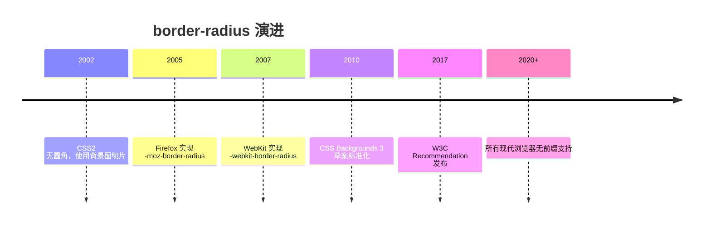
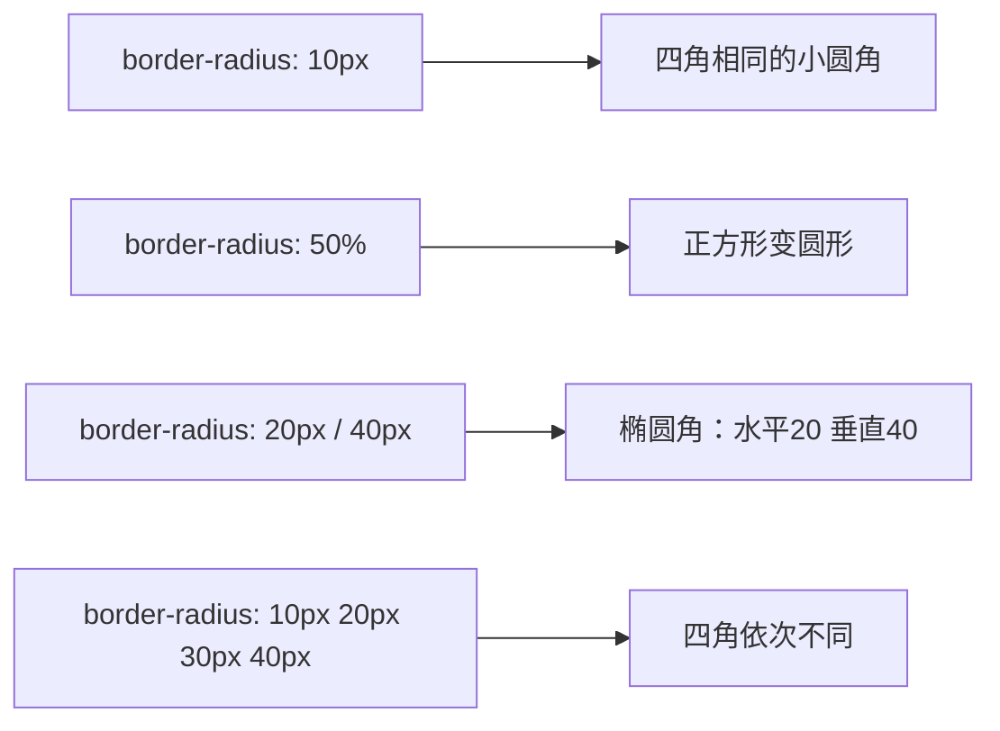

## 1. 历史动机与发展脉络

圆角在平面设计中长期用于柔化界面。CSS 2.1 没有圆角能力，开发者只能使用背景图片（九个切片）模拟圆角，成本高且难以缩放。2005 年起 Mozilla 率先在 Firefox 中实现 `-moz-border-radius`，WebKit 随后跟进 `-webkit-border-radius`；2010 年 CSS Backgrounds and Borders Level 3 工作草案将 `border-radius` 标准化，2017 年该规范成为 W3C Recommendation。如今 `border-radius` 是支持度最完整的 CSS 属性之一。

规范演变中最重要的细节是椭圆半径与百分比：早期实现只支持长度值，百分比由 CSS3 引入，并规定了“相邻圆角重叠时等比缩小”的行为（Corners must not overlap 原则），保证任何尺寸下角部曲线都合法。



## 2. 形式化定义

`border-radius` 的正式语法：

```css
border-radius: [ <length-percentage> ]{1,4} [ / [ <length-percentage> ]{1,4} ]?
```

一至四个值的分配规则与 margin/padding 相同（顺时针）：一个值表示四角相同；两个值表示左上/右下、右上/左下；三个值表示左上、右上/左下、右下；四个值按左上、右上、右下、左下。

斜杠前为四个角的水平半径，斜杠后为垂直半径。只写一个值时垂直半径默认等于水平半径（正圆角）；写斜杠时形成椭圆角。

长写属性：

`border-top-left-radius`、`border-top-right-radius`、`border-bottom-right-radius`、`border-bottom-left-radius`。每个长写属性接受一个或两个值（水平、垂直）。

百分比解析：水平百分比相对于元素内容盒加边框盒的宽度（即边框盒宽度），垂直百分比相对于高度。因此一个 50% 的水平半径加 50% 的垂直半径在矩形元素上形成椭圆，在正方形上形成圆。

重叠收缩规则：设角半径在对应边上的投影长度之和超过边长时，所有半径按同一比例缩小。例如宽度 100px、四个角水平半径均为 60px 时，各角收缩为 50px。



## 3. 理论推导与原理解析

### 3.1 椭圆参数方程

圆角曲线是四分之一椭圆弧。设水平半径 rx、垂直半径 ry，角部曲线上的点满足椭圆参数方程：

$$ x = rx \cdot \cos\theta,\quad y = ry \cdot \sin\theta,\quad \theta \in [0, \pi/2] $$

当 rx = ry 时退化为圆弧。浏览器绘制圆角时，把该曲线光栅化为路径；背景、边框、内阴影、外阴影都沿着这条路径裁剪或扩展。

### 3.2 百分比半径与盒子尺寸

半径百分比参照边框盒。对 200px 宽、100px 高的元素，`border-radius: 50%` 产生 rx=100px、ry=50px 的椭圆角，四角连接后元素内部剩余区域呈“胶囊竖切”形状。这也是为什么 50% 只在正方形上产生正圆。

### 3.3 相邻圆角的收缩推导

设上边长为 W，左上角水平半径 r1、右上角水平半径 r2。若 r1 + r2 > W，则按比例因子 f = W / (r1 + r2) 同时缩放两角（垂直半径同比例）。该规则保证角部曲线不相交，是 CSS 规范的强制行为，开发者无法覆盖。

## 4. 代码示例（带详尽注释）

### 4.1 基础圆角

```css
.card {
  /* 四个角统一 12px 圆角 */
  border-radius: 12px;
}

.badge {
  /* 水平/垂直半径一致，形成正圆角 */
  border-radius: 50%;
  width: 48px;
  height: 48px;
}
```

讲解：`12px` 是卡片圆角的中性值；`50%` 配合正方形宽高形成圆形，是头像、状态点的标准写法。

### 4.2 胶囊按钮

```css
.pill-button {
  /* 水平半径取高度一半（需要与高度联动） */
  border-radius: 999px;
  padding: 8px 24px;
  background: #1677ff;
  color: #fff;
  border: none;
}
```

讲解：`999px` 是“足够大”的半径，浏览器会自动收缩到高度一半，形成胶囊形状。该写法无需精确计算高度，是弹性高度的推荐方案。

### 4.3 椭圆角与局部圆角

```css
.dialog {
  /* 水平 16px、垂直 32px：顶部更“圆”的椭圆角 */
  border-radius: 16px / 32px;
}

.tab {
  /* 只圆顶部两角：贴合标签页设计 */
  border-radius: 10px 10px 0 0;
}

.speech-bubble {
  /* 左上角小圆角，其余角大圆角：聊天气泡 */
  border-radius: 4px 16px 16px 16px;
}
```

讲解：`border-radius` 的四值顺序是左上、右上、右下、左下。聊天气泡的典型处理是“指向源头的一角更尖”。

### 4.4 与 overflow 配合裁剪图片

```html
<div class="avatar-frame">
  
</div>
```

```css
.avatar-frame {
  width: 96px;
  height: 96px;
  border-radius: 50%;
  /* 关键：溢出裁剪，让图片跟随圆角 */
  overflow: hidden;
}
.avatar-frame img {
  width: 100%;
  height: 100%;
  object-fit: cover;
}
```

讲解：`border-radius` 只作用于元素自身的背景与边框，不会自动裁剪子内容；必须配合 `overflow: hidden` 才能让图片呈现圆形。`object-fit: cover` 保证图片不变形地填满。

### 4.5 响应式椭圆

```css
.ellipse {
  /* 宽度百分比半径：随容器宽度变化 */
  border-radius: 50% / 25%;
  aspect-ratio: 2 / 1;
  background: linear-gradient(135deg, #36cfc9, #1677ff);
}
```

讲解：`50% / 25%` 表示水平半径是宽度一半、垂直半径是高度四分之一。配合 `aspect-ratio` 固定宽高比，可以构造稳定的椭圆装饰。

### 4.6 圆角与阴影/边框的配合

```css
.elevated {
  border: 2px solid #d9d9d9;
  border-radius: 16px;
  /* 阴影形状跟随圆角路径 */
  box-shadow: 0 8px 24px rgba(0, 0, 0, 0.12);
}
```

讲解：`box-shadow` 与 `border-radius` 共享同一路径计算，阴影自动贴合圆角。但注意：`outline` 在旧浏览器中不贴合圆角；现代浏览器（Chrome 94+、Firefox 88+）的 `outline` 已跟随圆角。

### 4.7 设计令牌管理

```css
:root {
  /* 圆角梯度令牌：小、中、大、全圆 */
  --radius-sm: 4px;
  --radius-md: 8px;
  --radius-lg: 16px;
  --radius-full: 999px;
}

.button { border-radius: var(--radius-md); }
.card { border-radius: var(--radius-lg); }
.avatar { border-radius: var(--radius-full); }
```

讲解：把圆角收敛为有限梯度，保证全站视觉一致性，也方便主题切换。这是设计系统的基础实践。

## 5. 对比分析

### 5.1 border-radius 与 clip-path

| 维度 | border-radius | clip-path |
| --- | --- | --- |
| 形状 | 椭圆/圆角矩形 | 任意多边形、路径 |
| 内容裁剪 | 不裁剪子内容 | 裁剪整个元素 |
| 阴影跟随 | 是 | 否（clip 裁剪阴影） |
| 性能 | 极好 | 好（复杂路径略差） |
| 典型场景 | 卡片、头像 | 异形图形、动画遮罩 |

### 5.2 简写与长写属性对比

简写可读性好，但会同时重置四个角；长写属性可以精确控制单个角。动画中若只改变一个角，使用长写属性避免隐式重置。

### 5.3 圆角与 border-image 的冲突

`border-image` 与 `border-radius` 不兼容：使用 `border-image` 时圆角失效。需要同时满足时，用嵌套元素或 SVG 背景替代。

## 6. 常见陷阱与最佳实践

陷阱一：忘记 `overflow: hidden`，子图片溢出圆角。

陷阱二：`border-radius: 50%` 用于非正方形元素得到椭圆，误以为是圆。用 `aspect-ratio: 1/1` 固定正方形。

陷阱三：圆角值过大时浏览器自动收缩，与预期不符。理解收缩规则后按设计意图选择值。

陷阱四：在 `border-image` 元素上使用圆角，圆角被忽略。

陷阱五：为性能过度使用大半径阴影。圆角阴影成本可接受，但避免在滚动容器内大量叠加。

陷阱六：`border-radius` 对 `table` 元素（`border-collapse: collapse`）不生效。需要给 `td` 或使用 `border-spacing: 0` 方案。

最佳实践：设计令牌统一管理半径；头像与胶囊用 50%/999px；图片裁剪记得 overflow；动画优先长写属性。

## 7. 工程实践

### 7.1 主题化圆角

```ts
// theme.ts：设计令牌类型约束
export const radii = {
  sm: '4px',
  md: '8px',
  lg: '16px',
  full: '999px'
} as const

export type RadiusToken = keyof typeof radii
```

讲解：类型约束防止团队使用随意数值，配合 CSS 变量实现运行时主题切换。

### 7.2 圆角头像组件

```vue
<script setup>
defineProps<{
  src: string
  alt: string
  size?: number
  round?: boolean
}>()
</script>

<template>
  <span class="avatar" :style="{ width: size + 'px', height: size + 'px' }"
        :class="{ round: round }">
    
  </span>
</template>

<style scoped>
.avatar {
  display: inline-block;
  overflow: hidden; /* 裁剪图片到圆角内 */
  border-radius: 8px; /* 默认小圆角 */
}
.avatar.round {
  border-radius: 50%; /* 圆形模式 */
}
.avatar img {
  width: 100%;
  height: 100%;
  object-fit: cover;
}
</style>
```

讲解：组件把“圆角+裁剪+图片填充”三件套封装，调用方只传尺寸与形状模式，避免每个页面重复踩坑。

## 8. 案例研究：环形进度与圆角卡片

场景一：圆形进度环。用圆角 50% 的容器加 conic-gradient 实现：

```css
.ring {
  width: 120px;
  height: 120px;
  border-radius: 50%;
  /* 圆锥渐变从 0% 到 75% 着色，其余灰色 */
  background: conic-gradient(#1677ff 0% 75%, #f0f0f0 75% 100%);
  display: grid;
  place-items: center;
}
.ring::before {
  content: "75%";
  width: 96px;
  height: 96px;
  border-radius: 50%;
  background: #fff;
  display: grid;
  place-items: center;
}
```

讲解：外层圆环用圆锥渐变绘制进度，内层伪元素盖出中心孔。圆角在这里承担“所有元素都是正圆”的几何保证。

场景二：嵌套卡片圆角比例。外层 16px、内层 10px 的视觉层次：

```css
.outer {
  border-radius: 16px;
  padding: 12px;
  background: #fafafa;
}
.inner {
  border-radius: 10px;
  padding: 16px;
  background: #fff;
}
```

讲解：嵌套圆角遵循“内层半径 ≈ 外层半径 - padding”的经验公式，视觉上保持平行曲线。12px padding 对应 4px 差值，曲线近似同心，观感统一。

## 9. 知识要点总结与深入讲解

`border-radius` 的语法分两段：前段四角水平半径，后段（斜杠后）垂直半径。一值全同、二值对角、三值、四值顺时针，与 margin 的记忆方式完全一致。

百分比永远参照边框盒宽高，所以 50% 在正方形上是圆、在矩形上是椭圆。想要“正圆”必须保证元素本身是正方形。

圆角不会裁剪子内容，`overflow: hidden` 才负责裁剪。阴影与背景跟随圆角，outline 在现代浏览器中也跟随。理解这些边界行为，才能避免“圆角了但图片还是方的”这类问题。

### 1. border-radius 语法

```css
.box {
  border-radius: 10px;
}
.box {
  border-radius: 10px 20px 30px 40px;
} /* 左上 右上 右下 左下 */
.box {
  border-radius: 50px / 20px;
} /* 水平/垂直半径 */
```

### 1. 常见形状

```css
.circle {
  border-radius: 50%;
}
.pill {
  border-radius: 9999px;
}
.leaf {
  border-radius: 0 100% 0 100%;
}
.diagonal {
  border-radius: 50% 0 50% 0;
}
.blob {
  border-radius: 60% 40% 30% 70% / 60% 30% 70% 40%;
}
```

### 2. 实战效果

```css
.bubble {
  border-radius: 12px;
  border-bottom-left-radius: 2px;
}
.card {
  border-radius: 8px;
  overflow: hidden;
}
.button {
  border-radius: 6px;
  transition: border-radius 0.3s;
}
.button:hover {
  border-radius: 12px;
}
```

### 3. 注意事项

- 百分比参照元素尺寸
- 圆角不会裁剪溢出内容（需配合 `overflow: hidden`）
- 表格 `border-collapse: collapse` 时圆角无效
### border-radius 基础

**基本写法：统一圆角**
`border-radius: <值>;`
```css
/* 四个角相同圆角 */
.box {
  border-radius: 8px;
}
```

---

**基本写法：百分比圆角**
`border-radius: <百分比>;`
```css
/* 使用百分比圆角 */
.box {
  border-radius: 50%;
}
```

---

**基本写法：圆形**
`border-radius: 50%;`
```css
/* 创建圆形元素 */
.avatar {
  width: 100px;
  height: 100px;
  border-radius: 50%;
}
```

---

**基本写法：无圆角**
`border-radius: 0;`
```css
/* 移除圆角 */
.box {
  border-radius: 0;
}
```

---

### border-radius 多值

**基本写法：双值圆角**
`border-radius: <对角1> <对角2>;`
```css
/* 左上右下 和 右上左下 */
.box {
  border-radius: 10px 20px;
}
```

---

**基本写法：三值圆角**
`border-radius: <左上> <右上左下> <右下>;`
```css
/* 三个值设置圆角 */
.box {
  border-radius: 10px 20px 30px;
}
```

---

**单行写法：四值圆角**
`border-radius: <左上> <右上> <右下> <左下>;`
```css
/* 单行设置四个角不同圆角 */
.box {
  border-radius: 10px 20px 30px 40px;
}
```

---

**换行写法：四值圆角**
`border-top-left-radius: <值>; border-top-right-radius: <值>; border-bottom-right-radius: <值>; border-bottom-left-radius: <值>;`
```css
/* 换行设置四个角不同圆角 */
.box {
  border-top-left-radius: 10px;
  border-top-right-radius: 20px;
  border-bottom-right-radius: 30px;
  border-bottom-left-radius: 40px;
}
```

---

### 单角圆角

**基本写法：左上角圆角**
`border-top-left-radius: <值>;`
```css
/* 仅设置左上角圆角 */
.box {
  border-top-left-radius: 10px;
}
```

---

**基本写法：右上角圆角**
`border-top-right-radius: <值>;`
```css
/* 仅设置右上角圆角 */
.box {
  border-top-right-radius: 10px;
}
```

---

**基本写法：右下角圆角**
`border-bottom-right-radius: <值>;`
```css
/* 仅设置右下角圆角 */
.box {
  border-bottom-right-radius: 10px;
}
```

---

**基本写法：左下角圆角**
`border-bottom-left-radius: <值>;`
```css
/* 仅设置左下角圆角 */
.box {
  border-bottom-left-radius: 10px;
}
```

---

### 椭圆圆角

**基本写法：椭圆角**
`border-radius: <水平> / <垂直>;`
```css
/* 设置椭圆角 */
.box {
  border-radius: 50% / 30%;
}
```

---

**基本写法：单角椭圆**
`border-top-left-radius: <水平> <垂直>;`
```css
/* 左上角椭圆 */
.box {
  border-top-left-radius: 50px 25px;
}
```

---

**基本写法：多角椭圆**
`border-radius: <水平1> <水平2> / <垂直1> <垂直2>;`
```css
/* 多角椭圆 */
.box {
  border-radius: 50px 20px / 25px 10px;
}
```

---

### border 边框

**基本写法：完整边框**
`border: <宽度> <样式> <颜色>;`
```css
/* 设置完整边框 */
.box {
  border: 1px solid #ccc;
}
```

---

**基本写法：border-width 单值**
`border-width: <值>;`
```css
/* 设置四条边框宽度 */
.box {
  border-width: 2px;
}
```

---

**基本写法：border-width 多值**
`border-width: <上> <右> <下> <左>;`
```css
/* 分别设置四条边框宽度 */
.box {
  border-width: 1px 2px 3px 4px;
}
```

---

**基本写法：border-style 实线**
`border-style: solid;`
```css
/* 设置边框样式为实线 */
.box {
  border-style: solid;
}
```

---

**基本写法：border-style 虚线**
`border-style: dashed;`
```css
/* 设置边框样式为虚线 */
.box {
  border-style: dashed;
}
```

---

**基本写法：border-style 点线**
`border-style: dotted;`
```css
/* 设置边框样式为点线 */
.box {
  border-style: dotted;
}
```

---

**基本写法：border-style 双线**
`border-style: double;`
```css
/* 设置边框样式为双线 */
.box {
  border-style: double;
}
```

---

**基本写法：border-color 边框颜色**
`border-color: <颜色>;`
```css
/* 设置边框颜色 */
.box {
  border-color: #007bff;
}
```

---

### 单边边框

**基本写法：顶边边框**
`border-top: <宽度> <样式> <颜色>;`
```css
/* 仅设置顶边边框 */
.box {
  border-top: 2px solid red;
}
```

---

**基本写法：右边边框**
`border-right: <宽度> <样式> <颜色>;`
```css
/* 仅设置右边边框 */
.box {
  border-right: 2px solid red;
}
```

---

**基本写法：底边边框**
`border-bottom: <宽度> <样式> <颜色>;`
```css
/* 仅设置底边边框 */
.box {
  border-bottom: 2px solid red;
}
```

---

**基本写法：左边边框**
`border-left: <宽度> <样式> <颜色>;`
```css
/* 仅设置左边边框 */
.box {
  border-left: 2px solid red;
}
```

---

**基本写法：无边框**
`border: none;`
```css
/* 移除边框 */
.no-border {
  border: none;
}
```

---

### border-image 边框图片

**基本写法：border-image 简写**
`border-image: url("<图片>") <切片> <重复>;`
```css
/* 使用图片作为边框 */
.box {
  border: 10px solid transparent;
  border-image: url("border.png") 30 round;
}
```

---

**基本写法：border-image-source 图片源**
`border-image-source: url("<图片>");`
```css
/* 设置边框图片源 */
.box {
  border-image-source: url("border.png");
}
```

---

**基本写法：border-image-slice 切片**
`border-image-slice: <值>;`
```css
/* 设置边框图片切片 */
.box {
  border-image-slice: 30;
}
```

---

**基本写法：border-image-width 宽度**
`border-image-width: <值>;`
```css
/* 设置边框图片宽度 */
.box {
  border-image-width: 10px;
}
```

---

**基本写法：border-image-outset 外延**
`border-image-outset: <值>;`
```css
/* 设置边框图片外延 */
.box {
  border-image-outset: 5px;
}
```

---

**基本写法：border-image-repeat 重复**
`border-image-repeat: round;`
```css
/* 边框图片平铺方式 */
.box {
  border-image-repeat: round;
}
```

---

### outline 轮廓

**基本写法：outline 完整轮廓**
`outline: <宽度> <样式> <颜色>;`
```css
/* 设置元素轮廓（不占空间） */
.input:focus {
  outline: 2px solid #007bff;
}
```

---

**基本写法：outline-offset 偏移**
`outline-offset: <值>;`
```css
/* 设置轮廓与元素的距离 */
.button:focus {
  outline: 2px solid blue;
  outline-offset: 4px;
}
```

---

**基本写法：outline-style 样式**
`outline-style: <样式>;`
```css
/* 设置轮廓样式 */
.box {
  outline-style: solid;
}
```

---

**基本写法：outline-width 宽度**
`outline-width: <值>;`
```css
/* 设置轮廓宽度 */
.box {
  outline-width: 2px;
}
```

---

**基本写法：outline-color 颜色**
`outline-color: <颜色>;`
```css
/* 设置轮廓颜色 */
.box {
  outline-color: #007bff;
}
```

---

**基本写法：移除轮廓**
`outline: none;`
```css
/* 移除默认轮廓 */
.input:focus {
  outline: none;
}
```

---

### 常见圆角效果

**基本写法：胶囊形**
`border-radius: <高度>;`
```css
/* 创建胶囊形按钮 */
.pill {
  height: 40px;
  border-radius: 20px;
}
```

---

**基本写法：顶部圆角**
`border-radius: <值> <值> 0 0;`
```css
/* 仅顶部圆角 */
.card-top {
  border-radius: 10px 10px 0 0;
}
```

---

**基本写法：底部圆角**
`border-radius: 0 0 <值> <值>;`
```css
/* 仅底部圆角 */
.card-bottom {
  border-radius: 0 0 10px 10px;
}
```

---

**基本写法：左侧圆角**
`border-radius: <值> 0 0 <值>;`
```css
/* 仅左侧圆角 */
.card-left {
  border-radius: 10px 0 0 10px;
}
```

---

**基本写法：右侧圆角**
`border-radius: 0 <值> <值> 0;`
```css
/* 仅右侧圆角 */
.card-right {
  border-radius: 0 10px 10px 0;
}
```

---

**基本写法：不对称圆角**
`border-radius: <值1> <值2> <值3> <值4>;`
```css
/* 创建不对称圆角 */
.blob {
  border-radius: 60% 40% 30% 70% / 60% 30% 70% 40%;
}
```

---

### 响应式圆角

**基本写法：clamp 响应式圆角**
`border-radius: clamp(<最小>, <理想>, <最大>);`
```css
/* 响应式圆角 */
.box {
  border-radius: clamp(4px, 2vw, 16px);
}
```

---

**基本写法：媒体查询调整圆角**
`@media (max-width: <值>) { border-radius: <值>; }`
```css
/* 小屏幕调整圆角 */
.box {
  border-radius: 16px;
}
@media (max-width: 768px) {
  .box {
    border-radius: 8px;
  }
}
```

---

**基本写法：嵌套媒体查询圆角**
`.box { border-radius: <值>; @media (max-width: <值>) { border-radius: <值>; } }`
```css
/* CSS 原生嵌套媒体查询圆角 */
.box {
  border-radius: 16px;
  @media (max-width: 768px) {
    border-radius: 8px;
  }
}
```

## 动手试试

1. 给一张图片写 `border-radius: 50%` 变成圆形头像；
2. 用四个值 `10px 20px 30px 40px` 观察每个角的变化；
3. 用斜杠语法 `50% / 25%` 做椭圆角卡片；
4. 进阶挑战：结合 `overflow: hidden` 做圆角图片容器。

## 核心知识点

> 一句话记住圆角：`border-radius` 一到四个值对应四个角（顺时针），斜杠 `/` 分隔水平与垂直半径；`50%` 是圆/胶囊的关键。

- 四个值：左上、右上、右下、左下（顺时针）；
- 两个值：对角一组；三个值：左上加右下、右上加左下、右下；
- 斜杠语法：`水平 / 垂直`，可做椭圆角；
- `border-radius: 50%` 正方形变圆、胶囊形变胶囊；
- 配合 `overflow: hidden` 让图片/子元素跟随圆角裁剪。

## 注意事项与改进建议

| 问题点 | 说明 | 改进方案 |
| --- | --- | --- |
| 圆角不生效 | 元素没有背景/边框 | 圆角需要可见盒或背景衬托 |
| 图片直角 | 圆角被图片盖住 | 容器 `overflow: hidden` |
| 百分比与像素混用 | 结果难预测 | 统一用百分比或像素 |
| 大圆角卡顿 | 裁剪开销 | 避免超大圆角配合阴影动画 |

## 扩展学习

- 盒模型：`css/004-CSS3BoxModelDetailed`；
- 阴影：`css/026-Shadow`；
- 背景裁剪：`css/027-BackgroundEnhancement`。
