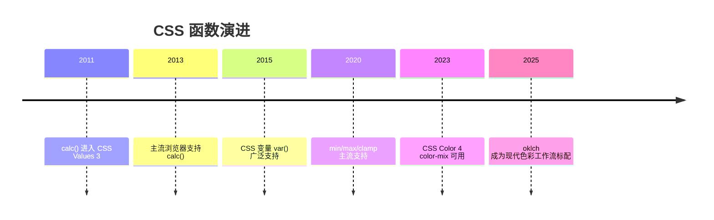
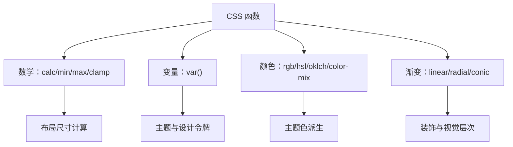

## 1. 历史动机与发展脉络

CSS 早期没有计算能力，布局中“容器宽度减去固定侧栏”只能依赖百分比近似或 JS 计算。CSS Values and Units Level 3 于 2011 年前后开始定义 `calc()`，2013 年后主流浏览器陆续支持。`min()`/`max()`/`clamp()` 属于 CSS Values and Units Level 4，2020 年前后获得主流支持，补齐了“取极值”与“钳制”能力。

颜色函数的发展同样显著：`rgba()`/`hsla()` 在 CSS3 Color 中标准化（2011）；CSS Color 4（2023 年成为候选推荐）引入 `color-mix()`、`oklch()`、`lab()` 等现代色彩空间函数，使颜色混合与感知均匀性成为可能。渐变函数从 CSS3 的 `linear-gradient` 演进到支持角度、位置、重复渐变与锥形渐变。

CSS 变量（自定义属性）在 CSS Custom Properties for Cascading Variables Level 1（2012 年草案，2015 年后广泛支持）中定义，`var()` 成为主题系统的基石，并与数学函数形成组合：`calc(var(--gap) * 2)`。



## 2. 形式化定义

### 2.1 数学函数

`calc(表达式)`：对长度、百分比、角度、时间等数值类型执行加减乘除。语法约束：`+` 与 `-` 两侧必须有空格（避免与正负号歧义），`*` 与 `/` 不需要空格但两侧操作数类型受限（乘法至少一侧为数字，除法右侧必须为数字且不能为零）。

`min(值1, 值2, ...)`：返回参数中的最小值，参数可以混合单位，但最终结果类型必须一致。

`max(值1, 值2, ...)`：返回最大值。

`clamp(最小值, 首选值, 最大值)`：等价于 `max(最小值, min(首选值, 最大值))`。首选值被钳制在区间内。

现代 CSS 还提供了完整的数值函数族（2024-2026 逐步进入基线）：

`sin(角度)`、`cos(角度)`、`tan(角度)`：三角函数，角度用 `deg`/`rad`/`turn` 表示，常用于周期性动画与圆形轨迹计算。

`asin(x)`、`acos(x)`、`atan(x)`、`atan2(y, x)`：反三角函数，`atan2` 接收两个参数，用于从坐标反推角度（如指针旋转）。

`exp(x)`、`log(x)`、`sqrt(x)`、`pow(x, y)`、`hypot(a, b)`：指数与根式函数，适合缩放曲线与物理模拟。

`abs(x)`、`sign(x)`：绝对值与符号函数。

`round(x)`、`mod(a, b)`、`rem(a, b)`：取整与余数函数，`round()` 可指定策略（`nearest`/`up`/`down`）。

```css
/* 示例：用三角函数做圆形轨道上的装饰点 */
.orbit {
  left: calc(50% + 120px * cos(45deg));
  top: calc(50% + 120px * sin(45deg));
}
```

**讲解：** 多数项目日常只用 `calc()`/`clamp()`；三角函数与指数函数适合图形、图表、动画类场景，使用前用 `@supports` 做能力检测。

### 2.2 变量函数

`var(--name, 回退值)`：读取自定义属性 `--name` 的值；若未定义或无效，使用回退值。回退值本身可以使用其他函数（如 `var(--x, calc(...))`）。

自定义属性的特性：值在声明处不校验类型，只有在被使用处的属性上下文中才校验；继承性使变量可以从 `:root` 传播到所有元素；`@property` 可以注册带类型与初始值的自定义属性，支持动画。

### 2.3 颜色函数

`rgb(r g b / a)` 与 `rgba(r g b / a)`：红绿蓝三通道加透明度；现代语法允许空格分隔与斜杠透明度，也支持逗号旧语法。

`hsl(h s l / a)`：色相（角度或数字）、饱和度、亮度；`oklch(l c h / a)` 是感知均匀的色彩空间。

`color-mix(in srgb, 颜色1 40%, 颜色2)`：按比例混合两种颜色，`in` 指定混合色彩空间。

### 2.4 渐变函数

`linear-gradient(方向, 色标...)`、`radial-gradient(形状 尺寸 at 位置, 色标...)`、`conic-gradient(from 角度 at 位置, 色标...)`；`repeating-` 前缀生成重复渐变。



## 3. 理论推导与原理解析

### 3.1 计算值求值时机

CSS 属性值经历指定值、计算值、使用值、实际值四个阶段。数学函数在“计算值”阶段完成求值，此时单位类型已经统一（长度转换为像素或视口单位），因此 `calc(100% - 40px)` 最终得到确定长度。理解求值时机可以解释：`min()`/`max()` 中混合百分比与固定值不会产生无限递归，因为百分比在布局阶段解析。

### 3.2 var() 的替换规则

`var()` 在自定义属性解析阶段替换，替换后整个声明重新参与计算。若替换结果对当前属性无效，该声明变为“无效 at 计算值时间”（invalid at computed-value time），此时使用属性的初始值或继承值，而不是回退值——这是 var() 与普通属性最大的行为差异。因此回退值只在变量本身未定义时生效。

### 3.3 clamp 的流体推导

流体排版的数学表达：字号 = clamp(最小字号, 视口相关值, 最大字号)。视口相关值常用 `vw` 单位，例如 `clamp(1rem, 1rem + 1vw, 1.5rem)`。推导：视口宽度为 0 时取 1rem，视口为 100vw 时约 2rem，但被钳制在 1.5rem。该公式让字号在区间内线性变化，避免媒体查询逐断点跳变。

### 3.4 color-mix 的混合模型

`color-mix(in srgb, red 40%, blue)` 在指定色彩空间插值。比例表示第一种颜色的权重，未指定权重时按 50/50 混合。混合空间的感知均匀性影响结果：`oklab` 混合比 `srgb` 混合更接近人眼感知的中途色。

## 4. 代码示例（带详尽注释）

### 4.1 calc() 基础

```css
/* 侧栏固定 240px，主区域占满剩余空间 */
.main {
  width: calc(100% - 240px);
  margin-left: 240px;
}

/* 运算符两侧必须有空格 */
.header {
  padding: calc(1rem + 2px) calc(2rem - 4px);
}
```

讲解：`calc(100% - 240px)` 是经典布局公式。注意 `+`/`-` 两侧空格是语法要求，缺少空格整个声明无效。

### 4.2 min() 与 max()

```css
/* 内容宽度最大 1200px，小屏时占满可用空间（减去两侧内边距） */
.container {
  width: min(1200px, 100% - 32px);
  margin-inline: auto;
}

/* 按钮最小宽度 160px，但不超过容器 100% */
.button {
  width: max(160px, 100%);
}
```

讲解：`min()` 表达“上界”，`max()` 表达“下界”。`width: min(1200px, 100% - 32px)` 取代了 `max-width + width` 的旧写法，语义更直接。

### 4.3 clamp() 流体排版

```css
/* 标题字号：最小 1.5rem，视口相关增长，最大 3rem */
.hero-title {
  font-size: clamp(1.5rem, 1rem + 2.5vw, 3rem);
}

/* 间距也流体化 */
.section {
  padding-block: clamp(2rem, 1rem + 4vw, 6rem);
}
```

讲解：`clamp()` 让字号随视口连续变化，兼顾小屏可读性与大屏视觉冲击。`vw` 系数决定增长斜率，可通过设计稿两端值反推。

### 4.4 var() 与主题系统

```css
:root {
  --color-primary: #1677ff;
  --space-md: 16px;
  --radius: 8px;
}

.card {
  /* 变量参与计算 */
  padding: var(--space-md);
  border: 1px solid color-mix(in srgb, var(--color-primary) 30%, transparent);
  border-radius: var(--radius);
}

/* 深色主题只需覆盖变量 */
@media (prefers-color-scheme: dark) {
  :root {
    --color-primary: #4096ff;
  }
}
```

讲解：`var()` 与 `color-mix()` 组合：边框颜色自动从主题色派生。主题切换只改变量定义，组件样式零改动。

### 4.5 color-mix() 派生色

```css
.button {
  background: var(--color-primary);
}

/* 悬停色：主色与黑色混合 10% */
.button:hover {
  background: color-mix(in srgb, var(--color-primary) 90%, black);
}

/* 禁用态：主色 40% 透明 */
.button:disabled {
  background: color-mix(in srgb, var(--color-primary) 40%, transparent);
}
```

讲解：`color-mix` 取代了手写调色板。主色改变时，悬停、禁用、边框等派生色自动跟随，是设计系统维护的利器。

### 4.6 渐变函数

```css
/* 线性渐变：135 度方向，三段色标 */
.hero {
  background: linear-gradient(135deg, #1677ff 0%, #69b1ff 50%, #d3e7ff 100%);
}

/* 径向渐变：从左上角扩散 */
.sun {
  background: radial-gradient(circle at 30% 30%, #fff7d6, #ffc53d);
}

/* 锥形渐变：从 0 度开始，用于环形图 */
.pie {
  background: conic-gradient(from 0deg, #1677ff 0% 40%, #52c41a 40% 70%, #faad14 70% 100%);
}
```

讲解：三种渐变覆盖主流场景：线性用于横幅与按钮，径向用于光晕，锥形用于环形图。渐变函数之间可以叠加（多层 background），创造丰富层次。

### 4.7 渐变与 mask 组合

```css
/* 淡出遮罩：内容底部渐隐 */
.fade-bottom {
  -webkit-mask-image: linear-gradient(to bottom, black 60%, transparent);
  mask-image: linear-gradient(to bottom, black 60%, transparent);
}
```

讲解：`mask-image` 用亮度控制透明度，黑色区域显示、透明区域隐藏。该技巧常用于长文本折叠预览。

### 4.8 @supports 回退

```css
/* 支持 clamp 的浏览器使用流体字号 */
.title {
  font-size: 1.5rem;
}

@supports (font-size: clamp(1rem, 2vw, 3rem)) {
  .title {
    font-size: clamp(1.5rem, 1rem + 2vw, 3rem);
  }
}
```

讲解：`@supports` 做特性检测，旧浏览器获得回退值。现代项目只需对极少数新函数（如 `color-mix` 早期版本）做此类保护。

## 5. 对比分析

### 5.1 原生函数与 Sass 函数

| 维度 | 原生 CSS 函数 | Sass 函数 |
| --- | --- | --- |
| 求值时机 | 浏览器运行时 | 构建时 |
| 动态性 | 随视口/变量变化 | 静态结果 |
| 变量 | var() 运行时替换 | 编译期替换 |
| 依赖 | 无 | 构建工具链 |

### 5.2 min/max/clamp 与媒体查询

`clamp()` 的流体方案在断点之间连续过渡，媒体查询是分段跳变。两者可结合：流体负责区间内，媒体查询负责结构性布局变化（单列到多列）。

### 5.3 calc 与容器查询

`calc()` 解决尺寸计算，容器查询解决组件级响应。例如卡片内部间距用 `calc()`，卡片网格列数用容器查询，各司其职。

## 6. 常见陷阱与最佳实践

陷阱一：`calc()` 的 `+`/`-` 忘记空格。声明静默无效。

陷阱二：`var()` 回退值只在变量未定义时生效；变量存在但值无效时回退值不会兜底。

陷阱三：在 `min()`/`max()` 中混入无单位数字与长度。`min(1, 100px)` 类型不匹配，整个声明无效。

陷阱四：`clamp()` 中最小值大于最大值。结果是不可预测的，浏览器按规范处理仍可能异常。

陷阱五：`color-mix` 早期浏览器前缀与语法差异。现代浏览器无前缀支持，使用前可用 `@supports` 检测。

陷阱六：渐变中色标位置不递增导致硬边。按顺序递增色标位置，或用 `hsl` 表达连续色相变化。

最佳实践：数学函数优先于魔法数字；主题色统一走 `var()` + `color-mix()`；流体排版用 `clamp()` 并保留回退；渐变用于装饰而非关键信息。

## 7. 工程实践

### 7.1 间距与排版令牌

```css
:root {
  --space-1: 4px;
  --space-2: 8px;
  --space-3: 16px;
  --space-4: 24px;
  --space-5: 32px;
  --text-base: clamp(1rem, 0.95rem + 0.2vw, 1.125rem);
}
```

讲解：间距按 4px 基准递增，排版用 clamp 流体化。令牌化让设计与代码共享同一套词汇。

### 7.2 布局网格中的函数

```css
/* auto-fill 自动列数 + min() 控制列宽下界 */
.grid {
  display: grid;
  grid-template-columns: repeat(auto-fill, minmax(min(240px, 100%), 1fr));
  gap: clamp(12px, 2vw, 24px);
}
```

讲解：`minmax(min(240px, 100%), 1fr)` 防止窄容器中 `240px` 溢出，`auto-fill` 自动计算列数。这是 CSS 网格与函数组合的经典响应式配方。

## 8. 案例研究：无 JS 的主题化卡片系统

需求：一套卡片组件，支持浅深色主题、派生悬停色、流体间距与圆角，全部由 CSS 函数与变量实现。

```css
:root {
  /* 主题令牌 */
  --color-primary: #1677ff;
  --color-surface: #ffffff;
  --color-text: #1f1f1f;
  --radius-card: 12px;
  --space-card: clamp(12px, 2vw, 24px);
}

/* 深色主题仅覆盖表面色与文字色 */
@media (prefers-color-scheme: dark) {
  :root {
    --color-surface: #1f1f1f;
    --color-text: #e8e8e8;
  }
}

.card {
  background: var(--color-surface);
  color: var(--color-text);
  border: 1px solid color-mix(in srgb, var(--color-text) 15%, transparent);
  border-radius: var(--radius-card);
  padding: var(--space-card);
  transition: transform 0.2s ease;
}

.card:hover {
  transform: translateY(-2px);
  border-color: color-mix(in srgb, var(--color-primary) 40%, transparent);
}

/* 标题字号流体 */
.card h3 {
  font-size: clamp(1.1rem, 1rem + 0.5vw, 1.4rem);
}
```

讲解：整个系统不依赖任何 JS：主题切换由媒体查询驱动，派生色由 `color-mix` 计算，间距与字号由 `clamp` 流体化。新增组件只需引用令牌，天然获得主题一致性。

## 9. 知识要点总结与深入讲解

CSS 函数让样式表具备计算能力：`calc()` 做差值，`min/max` 做边界，`clamp` 做区间钳制。三者都以“计算值”阶段的类型安全为前提，因此混合单位是它们的核心价值。

`var()` 是主题系统的支柱，其行为特殊性（无效值不回退）要求开发者理解“变量存在但值无效”与“变量未定义”的区别。`@property` 进一步把变量升级为带类型的注册属性，支持动画与校验。

颜色函数的演进方向是感知均匀与可计算：`oklch` 让色相旋转更自然，`color-mix` 让派生色自动化。设计系统的维护成本因此大幅下降。

### 1. calc() 函数

```css
.element {
  width: calc(100% - 60px);
}
.element {
  height: calc(50vh - 2rem);
}
.element {
  font-size: calc(16px + 0.5vw);
}
```

规则：可以混合不同单位；运算符前后必须有空格；可以嵌套。

### 1. min() 函数

```css
.element {
  width: min(50vw, 400px);
} /* 取较小值 */
```

### 2. max() 函数

```css
.element {
  width: max(50vw, 300px);
} /* 取较大值 */
```

### 3. clamp() 函数

```css
h1 {
  font-size: clamp(1.5rem, 5vw, 3rem);
}
```

等价于：

```css
h1 {
  font-size: 1.5rem;
  font-size: max(1.5rem, min(5vw, 3rem));
}
```

### 4. 其他 CSS 函数

```css
.element {
  width: var(--width, 100%); /* 自定义属性 */
  transform: translateX(50px); /* 变换 */
  filter: blur(5px); /* 滤镜 */
  color: color-mix(in srgb, red 50%, blue); /* 颜色混合 */
}
```
### calc() 计算

**基本写法：calc 基本运算**
`calc(<值1> <运算符> <值2>);`
```css
/* 加减乘除运算 */
.box {
  width: calc(100% - 200px);
  height: calc(50vh + 50px);
  padding: calc(20px * 2);
}
```

---

**基本写法：calc 混合单位**
`calc(<单位1> <运算符> <单位2>);`
```css
/* 混合不同单位计算 */
.box {
  font-size: calc(1rem + 0.5vw);
  margin: calc(20px - 1em);
}
```

---

**基本写法：calc 嵌套**
`calc(<值> * calc(<值>));`
```css
/* calc 嵌套使用 */
.box {
  width: calc(100% - calc(200px + 2rem));
}
```

---

**基本写法：calc 配合变量**
`calc(var(--<变量>) <运算符> <值>);`
```css
/* 变量参与计算 */
.box {
  --base: 20px;
  padding: calc(var(--base) * 2);
}
```

---

**基本写法：calc 运算优先级**
`calc((<值1> + <值2>) * <值3>);`
```css
/* 括号控制运算优先级 */
.box {
  width: calc((100% - 40px) / 3);
}
```

---

### min() 取最小值

**基本写法：min 取最小**
`min(<值1>, <值2>[, ...]);`
```css
/* 取多个值中最小者 */
.box {
  width: min(50%, 300px);
}
```

---

**基本写法：min 混合单位**
`min(<单位1>, <单位2>);`
```css
/* 混合单位取最小 */
.text {
  font-size: min(5vw, 1.5rem);
}
```

---

**基本写法：min 多值**
`min(<值1>, <值2>, <值3>);`
```css
/* 多个值取最小 */
.box {
  width: min(100%, 800px, 90vw);
}
```

---

### max() 取最大值

**基本写法：max 取最大**
`max(<值1>, <值2>[, ...]);`
```css
/* 取多个值中最大者 */
.box {
  width: max(50%, 300px);
}
```

---

**基本写法：max 混合单位**
`max(<单位1>, <单位2>);`
```css
/* 字体不小于 16px */
.text {
  font-size: max(1rem, 16px);
}
```

---

**基本写法：max 多值**
`max(<值1>, <值2>, <值3>);`
```css
/* 多个值取最大 */
.box {
  min-height: max(100px, 10vh, 5rem);
}
```

---

### clamp() 钳制

**基本写法：clamp 钳制范围**
`clamp(<最小>, <理想>, <最大>);`
```css
/* 值在 1rem 到 3rem 之间理想 2vw+1rem */
h1 {
  font-size: clamp(1rem, 2vw + 1rem, 3rem);
}
```

---

**基本写法：clamp 响应式字体**
`clamp(<最小rem>, <理想vw>, <最大rem>);`
```css
/* 流式响应字体 */
p {
  font-size: clamp(1rem, 2.5vw, 1.5rem);
}
```

---

**基本写法：clamp 响应式间距**
`clamp(<最小>, <理想>, <最大>);`
```css
/* 流式响应间距 */
.section {
  padding: clamp(1rem, 4vw, 3rem);
}
```

---

**基本写法：clamp 响应式宽度**
`clamp(<最小>, <理想>, <最大>);`
```css
/* 容器最大宽度限制 */
.container {
  width: clamp(320px, 90vw, 1200px);
  margin: 0 auto;
}
```

---

**基本写法：clamp 等价 max min**
`max(<最小>, min(<理想>, <最大>));`
```css
/* clamp 等价写法 */
h1 {
  font-size: max(1rem, min(2vw + 1rem, 3rem));
}
```

---

### var() 变量引用

**基本写法：var 引用变量**
`var(--<属性名>);`
```css
/* 引用自定义属性 */
.box {
  color: var(--primary-color);
}
```

---

**基本写法：var 带默认值**
`var(--<属性名>, <默认值>);`
```css
/* 变量未定义时使用默认值 */
.box {
  color: var(--text-color, #333);
}
```

---

### 颜色函数

**基本写法：rgb rgba 颜色**
`rgba(<r>, <g>, <b>, <alpha>);`
```css
/* RGBA 颜色带透明度 */
.box {
  background: rgba(52, 152, 219, 0.5);
}
```

---

**基本写法：hsl hsla 颜色**
`hsla(<色相>, <饱和度>, <亮度>, <alpha>);`
```css
/* HSLA 颜色 */
.box {
  background: hsla(210, 70%, 50%, 0.5);
}
```

---

**基本写法：现代 rgb 空格语法**
`rgb(<r> <g> <b> / <alpha>);`
```css
/* 现代空格分隔语法 */
.box {
  background: rgb(52 152 219 / 50%);
}
```

---

**基本写法：十六进制带透明度**
`#RRGGBBAA;`
```css
/* 8 位十六进制带透明度 */
.box {
  background: #3498db80;
}
```

---

**基本写法：color-mix 混合颜色**
`color-mix(in <色彩空间>, <颜色1> <比例>, <颜色2>);`
```css
/* 混合两种颜色 */
.box {
  background: color-mix(in srgb, #3498db 50%, white);
}
```

---

**基本写法：color-mix 基于 oklch**
`color-mix(in oklch, <颜色1> <比例>, <颜色2>);`
```css
/* OKLCH 色彩空间混合更准确 */
.box {
  background: color-mix(in oklch, var(--primary) 70%, black);
}
```

---

**基本写法：light-dark 明暗切换**
`light-dark(<浅色>, <深色>);`
```css
/* 自动明暗模式颜色 */
.text {
  color: light-dark(#333, #fff);
}
```

---

**基本写法：oklch 感知亮度颜色**
`oklch(<亮度> <色度> <色相>);`
```css
/* OKLCH 色彩空间 */
.box {
  background: oklch(60% 0.2 240);
}
```

---

**基本写法：相对颜色**
`oklch(from <基础色> <亮度> <色度> <色相>);`
```css
/* 基于现有颜色派生新颜色 */
.darker {
  background: oklch(from var(--primary) calc(l - 0.1) c h);
}
```

---

### 渐变函数

**基本写法：linear-gradient 线性渐变**
`linear-gradient(<角度>, <颜色1>, <颜色2>);`
```css
/* 线性渐变背景 */
.box {
  background: linear-gradient(45deg, #3498db, #2ecc71);
}
```

---

**基本写法：radial-gradient 径向渐变**
`radial-gradient(<形状>, <颜色1>, <颜色2>);`
```css
/* 径向渐变 */
.box {
  background: radial-gradient(circle, #3498db, #2c3e50);
}
```

---

**基本写法：conic-gradient 锥形渐变**
`conic-gradient(from <角度>, <颜色1>, <颜色2>);`
```css
/* 锥形渐变 */
.box {
  background: conic-gradient(from 0deg, red, yellow, green, red);
}
```

---

**基本写法：渐变停顿点**
`linear-gradient(<角度>, <颜色> <位置>, <颜色> <位置>);`
```css
/* 控制渐变停顿位置 */
.box {
  background: linear-gradient(to right, #3498db 0%, #2ecc71 50%, #f1c40f 100%);
}
```

---

### 形状与路径函数

**基本写法：path 路径**
`path("<SVG路径>");`
```css
/* 沿 SVG 路径运动 */
.element {
  offset-path: path("M 0 0 L 100 100");
  animation: move 3s;
}
```

---

**基本写法：clip-path 裁剪**
`clip-path: <形状函数>;`
```css
/* 圆形裁剪 */
.avatar {
  clip-path: circle(50%);
}
```

---

**基本写法：clip-path 多边形**
`clip-path: polygon(<点1>, <点2>, ...);`
```css
/* 三角形裁剪 */
.triangle {
  clip-path: polygon(50% 0, 0 100%, 100% 100%);
}
```

---

**基本写法：clip-path inset**
`clip-path: inset(<上> <右> <下> <左> round <圆角>);`
```css
/* 矩形裁剪带圆角 */
.box {
  clip-path: inset(10% 10% 10% 10% round 20px);
}
```

---

### 滤镜函数

**基本写法：blur 模糊**
`filter: blur(<半径>);`
```css
/* 高斯模糊 */
.glass {
  filter: blur(5px);
}
```

---

**基本写法：brightness 亮度**
`filter: brightness(<比例>);`
```css
/* 提亮 1.5 倍 */
.image {
  filter: brightness(1.5);
}
```

---

**基本写法：contrast 对比度**
`filter: contrast(<比例>);`
```css
/* 提高对比度 */
.image {
  filter: contrast(1.2);
}
```

---

**基本写法：grayscale 灰度**
`filter: grayscale(<比例>);`
```css
/* 完全灰度 */
.image {
  filter: grayscale(1);
}
```

---

**基本写法：组合滤镜**
`filter: <滤镜1> <滤镜2>;`
```css
/* 多个滤镜组合 */
.image {
  filter: brightness(1.1) contrast(1.2) saturate(1.5);
}
```

---

### 数学函数组合

**基本写法：clamp 配合 calc**
`clamp(<最小>, calc(<表达式>), <最大>);`
```css
/* clamp 内嵌 calc */
.box {
  width: clamp(200px, calc(50vw - 100px), 800px);
}
```

---

**基本写法：min 配合 max**
`min(<值>, max(<值>, <值>));`
```css
/* min max 嵌套 */
.box {
  width: min(90vw, max(300px, 50vw));
}
```

---

**基本写法：calc 配合 min/max**
`calc(min(<值1>, <值2>) + <值>);`
```css
/* 复杂函数组合 */
.box {
  padding: calc(min(5vw, 30px) + 10px);
}
```

---

### 实用模式

**基本写法：响应式排版比例**
`clamp(<最小rem>, calc(<系数>vw + <基础rem>), <最大rem>);`
```css
/* 标准流式字体公式 */
h1 { font-size: clamp(2rem, calc(2.5vw + 1rem), 3.5rem); }
h2 { font-size: clamp(1.5rem, calc(2vw + 0.5rem), 2.5rem); }
p { font-size: clamp(1rem, calc(0.5vw + 0.9rem), 1.25rem); }
```

---

**基本写法：响应式容器**
`width: min(<值1>, <值2>); margin: 0 auto;`
```css
/* 自适应容器最大宽度 */
.container {
  width: min(90vw, 1200px);
  margin-inline: auto;
}
```

---

**基本写法：动态间距**
`gap: clamp(<最小>, <理想>, <最大>);`
```css
/* 流式响应间距 */
.grid {
  display: grid;
  gap: clamp(0.5rem, 2vw, 2rem);
}
```

---

**基本写法：基于视口的高度**
`height: calc(100vh - <偏移>);`
```css
/* 全屏减去导航高度 */
.main {
  height: calc(100vh - 60px);
}
```

---

### 其他函数

**基本写法：env 环境变量**
`env(<变量名>, <默认值>);`
```css
/* 安全区适配刘海屏 */
.app {
  padding-top: env(safe-area-inset-top, 0);
  padding-bottom: env(safe-area-inset-bottom, 0);
}
```

---

**基本写法：attr 属性值（增强版）**
`attr(<属性名> <类型>, <默认值>);`
```css
/* 从 HTML 属性读取值（2024+ 类型化 attr） */
.tooltip {
  --pos: attr(data-position);
  /* 实验性：attr(data-size px, 16px); */
}
```

---

**基本写法：counter 计数器**
`counter(<名称>);`
```css
/* 自动编号 */
h2::before {
  content: counter(chapter) ". ";
}
```

---

**基本写法：counter 嵌套**
`counters(<名称>, "<分隔符>");`
```css
/* 多级编号 */
li::before {
  content: counters(section, ".") " ";
}
```

## 动手试试

1. 用 `calc()` 计算“100% 减去固定间距”的宽度；
2. 用 `clamp()` 让标题字号随视口平滑变化；
3. 用 `min()`/`max()` 实现自适应尺寸；
4. 进阶挑战：用 `var()` 组合多个设计令牌。

## 核心知识点

> 一句话记住函数：`calc()` 算数值，`clamp()` 定范围，`min()/max()` 取极值，`var()` 读变量，`attr()` 取属性。

- `calc()`：混合单位运算，如 `calc(100% - 2rem)`；
- `clamp(min, 首选, max)`：响应式字号首选；
- `min()`/`max()`：多值取最小/最大；
- `var()`：读取 CSS 变量，支持回退值 `var(--x, 默认)`；
- `attr()`：读取 HTML 属性生成内容；
- 颜色函数：`rgb()`/`hsl()`/`color-mix()`。

## 注意事项与改进建议

| 问题点 | 说明 | 改进方案 |
| --- | --- | --- |
| calc 空格错误 | 表达式失效 | `+`/`-` 两侧必须有空格 |
| 嵌套过深 | 可读性差 | 拆成变量 |
| 滥用 min/max | 行为难预测 | 明确语义场景 |
| var 拼错名 | 回退到默认 | 定义处与使用处保持一致 |

## 扩展学习

- 变量：`css/036-CSSVariableCustomAttribute`；
- 颜色：`css/035-ModernColorSpace`；
- 响应式：`css/034-ResponsiveDesign`。
