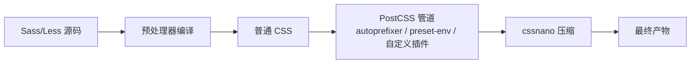

## 1. 学习目标与概念澄清

读完本篇你应该能：

- 说清 PostCSS 与 Sass/Less 的本质区别，以及两者在同一构建链里的协作顺序；
- 配置 autoprefixer + browserslist，理解前缀是从哪里来的；
- 用 postcss-preset-env 使用“未来 CSS 语法”，用 postcss-nesting 转译原生嵌套；
- 写一个最小自定义 PostCSS 插件。

最常见的误解：把 PostCSS 当成“第二个预处理器”。正确定位恰恰相反——

**预处理器**（Sass/Less）把一门超集语言**编译**成 CSS；**PostCSS** 是一个 CSS **处理管道**：把 CSS 解析成抽象语法树（AST，即代码的结构化对象表示），让插件逐条检查、改写节点，最后序列化回 CSS。它自己“什么都不做”，能力全部来自插件。

类比：Sass 像翻译（把外语稿译成中文稿），PostCSS 像编辑流水线（对中文稿做错别字检查、术语统一、排版压缩）——翻译完的稿子才进流水线。



## 2. 最小可用配置

```bash
npm install -D postcss autoprefixer
```

```javascript
// postcss.config.mjs（ESM 风格；CommonJS 项目用 module.exports）
export default {
  plugins: {
    autoprefixer: {},
  },
};
```

Vite 识别项目根目录的 `postcss.config.*` 后自动套用到所有样式；Webpack 需要显式挂 `postcss-loader`：

```bash
npm install -D postcss-loader
```

```javascript
// webpack.config.js（节选）
module.exports = {
  module: {
    rules: [
      {
        test: /\.css$/,
        use: ['style-loader', 'css-loader', 'postcss-loader'],
      },
    ],
  },
};
```

## 3. 核心插件一：autoprefixer 与 browserslist

autoprefixer 根据**目标浏览器清单**补全需要的厂商前缀。清单用 browserslist 语法声明在 `package.json`（或 `.browserslistrc`），它同时驱动 autoprefixer、postcss-preset-env、Lightning CSS 与 babel 等一整圈工具——全仓库只声明一次：

```json
{
  "browserslist": ["last 2 versions", "> 1%", "not dead"]
}
```

```css
/* 输入 */
.container {
  display: flex;
  user-select: none;
}

/* 输出（示意，实际以 browserslist 结果为准） */
.container {
  -webkit-user-select: none;
  user-select: none;
  display: -webkit-box;
  display: -ms-flexbox;
  display: flex;
}
```

两个工程要点：

- **前缀是算出来的，不是手写的**。禁止单独安装旧版 `-webkit-` 手写约定；目标浏览器越现代，产物前缀越少——browserslist 收紧后产物自动变干净；
- 校验清单覆盖了谁：`npx browserslist` 直接打印命中的浏览器版本列表，`npx browserslist --coverage` 显示覆盖百分比。

## 4. 核心插件二：postcss-preset-env（用未来语法）

preset-env 把处于提案阶段或新近标准化的 CSS 语法按目标浏览器自动转译，相当于 CSS 圈的 babel：

```css
/* 输入：自定义媒体查询（提案特性） */
@custom-media --md (min-width: 768px);

@media (--md) {
  .container {
    width: 750px;
  }
}

/* 输入：逻辑属性按需降级（stage 特性，视配置） */
.box {
  margin-inline: auto;
}
```

```css
/* 输出（示意） */
@media (min-width: 768px) {
  .container {
    width: 750px;
  }
}
```

```javascript
// 配置：stage 越低越激进（提案越早期），一般用 stage 3 + 按需开启 features
export default {
  plugins: {
    'postcss-preset-env': {
      stage: 3,
      features: {
        'nesting-rules': true, // 显式开启需要的特性
      },
      autoprefixer: { flexbox: true },
    },
  },
};
```

风险提示：stage 越低的特性语法越可能变化，**核心产品建议 stage 3 起步**，实验室项目再尝鲜。

## 5. 核心插件三：postcss-nesting 与 cssnano

### 5.1 postcss-nesting：嵌套转译

源码用标准原生嵌套写（`css/042-CSSNativeNesting`），需要兼容旧内核时由它把嵌套展开为平铺选择器：

```css
/* 输入 */
.card {
  padding: 1rem;

  &:hover {
    box-shadow: 0 4px 12px rgb(0 0 0 / 10%);
  }
}

/* 输出 */
.card {
  padding: 1rem;
}
.card:hover {
  box-shadow: 0 4px 12px rgb(0 0 0 / 10%);
}
```

是否需要它由 browserslist 决定：目标全绿（均支持原生嵌套）就可以省略。这是“写标准语法、构建管兼容”策略的典型落地，决策细节见 `css/072-CSSNesting` 第 5 节。

### 5.2 cssnano：产物压缩

```bash
npm install -D cssnano
```

```css
/* 输入 */
.container {
  margin: 0px;
  color: #ff0000;
}

/* 输出：去掉冗余单位、颜色缩写、合并规则 */
.container{margin:0;color:red}
```

注意顺序：cssnano 应该放在**管道最后**（先改写后压缩），且通常只在生产构建启用，避免开发时不可读。

## 6. 自定义插件：AST 视角看 PostCSS

插件本质是“订阅 AST 节点类型的访问器”。写一个把 `color: primary` 替换为品牌色的最小插件：

```javascript
// plugins/replace-primary.mjs
const replacePrimary = (opts = {}) => {
  const brand = opts.brand || '#3498db';
  return {
    postcssPlugin: 'replace-primary', // 插件名必填
    Declaration(decl) {
      // decl 是一条声明节点：decl.prop 属性名，decl.value 值
      if (decl.prop === 'color' && decl.value === 'primary') {
        decl.value = brand; // 改写节点
      }
    },
  };
};
replacePrimary.postcss = true; // 标记为 PostCSS 插件

export default replacePrimary;
```

```javascript
// postcss.config.mjs 中挂载
import replacePrimary from './plugins/replace-primary.mjs';

export default {
  plugins: {
    'postcss-preset-env': { stage: 3 },
    replacePrimary: { brand: '#2563eb' }, // 传参
    cssnano: { preset: 'default' },
  },
};
```

常用节点类型：`Rule`（选择器规则块）、`Declaration`（声明）、`AtRule`（@规则）、`Comment`。写插件前先查生态——绝大多数需求（px 转 rem、清理未用样式、生成工具类）已有现成插件，自定义只做兜底。

## 7. 与预处理器协作：顺序即约定

```text
 Sass/Less 源码
      |  1. 预处理器编译（变量替换、mixin 展开）
      v
  标准 CSS
      |  2. PostCSS 管道：preset-env / nesting / autoprefixer
      v
  兼容增强后的 CSS
      |  3. cssnano 压缩（生产）
      v
  最终产物
```

配置上大多数脚手架已经按这个顺序串联（Vite 内置：sass 编译后自动进 PostCSS）。自建链时的检查点：**PostCSS 必须在预处理器之后**，否则它拿到的是 Sass 语法，AST 解析直接失败。

## 8. 常见陷阱

| 陷阱 | 症状 | 原因与解法 |
| --- | --- | --- |
| 插件顺序错误 | 压缩后又被改写、产物异常 | 约定：功能插件在前，cssnano 最后 |
| 没配 browserslist | 前缀目标不可控 | package.json 统一声明 |
| 手写 -webkit- 前缀 | 与 autoprefixer 冲突重复 | 删手写，交给工具 |
| preset-env stage 过低 | 未定型语法进了生产 | stage 3 起步，按需开 features |
| PostCSS 放在预处理器之前 | 解析报错 | 保持“先编译后加工”顺序 |
| 滥用自定义插件 | 维护成本高、行为难查 | 先查生态，插件保持单一职责 |

## 动手试试

1. 在 Vite 项目接入 autoprefixer，收紧/放宽 browserslist 观察 `npx browserslist` 与产物变化；
2. 启用 postcss-preset-env，用 `@custom-media` 写一次断点复用；
3. 用 postcss-nesting 转译一段原生嵌套，对照展开结果与 `css/042` 的等价选择器；
4. 按第 6 节写一个 `font-size: md` 转具体值的自定义插件；
5. 进阶挑战：把“Sass + preset-env + autoprefixer + cssnano”完整链路搭起来并验证执行顺序。

## 核心知识点

> 一句话记住 PostCSS：它不是预处理器，而是解析 CSS 为 AST 的插件管道；autoprefixer 管前缀、preset-env 管未来语法、postcss-nesting 管嵌套转译、cssnano 管压缩，browserslist 是所有工具共用的目标清单。

- 定位：CSS 处理管道，能力来自插件，先于压缩、后于预处理器编译；
- autoprefixer + browserslist：目标驱动前缀，全仓一处声明；
- postcss-preset-env：stage 控制激进程度，生产建议 stage 3；
- postcss-nesting 服务“源码写标准语法”策略；
- 自定义插件 = 订阅 Declaration/Rule/AtRule 节点的访问器；
- 与 Sass/Less 共存且互补，顺序不可颠倒。

## 注意事项与改进建议

| 问题点 | 说明 | 改进方案 |
| --- | --- | --- |
| 多套浏览器清单并存 | 工具目标不一致 | 只在 package.json 声明一次 |
| 生产开发同一套压缩 | 开发态不可读 | 按环境挂载 cssnano |
| 插件堆积不清理 | 构建变慢、行为难追溯 | 定期审计插件必要性 |

## 扩展学习

- Sass（上游预处理器）：`css/055-Sass`；
- Less 与 Stylus：`css/056-LessStylus`；
- 原生嵌套与转译决策：`css/042-CSSNativeNesting`、`css/072-CSSNesting`；
- 特性检测（运行时补充构建期降级）：`css/041-FeatureQuery`；
- 架构方法论：`css/044-CSSArchitectureMethodology`。
