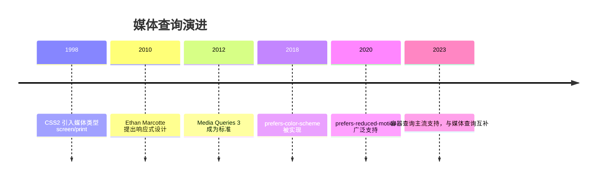
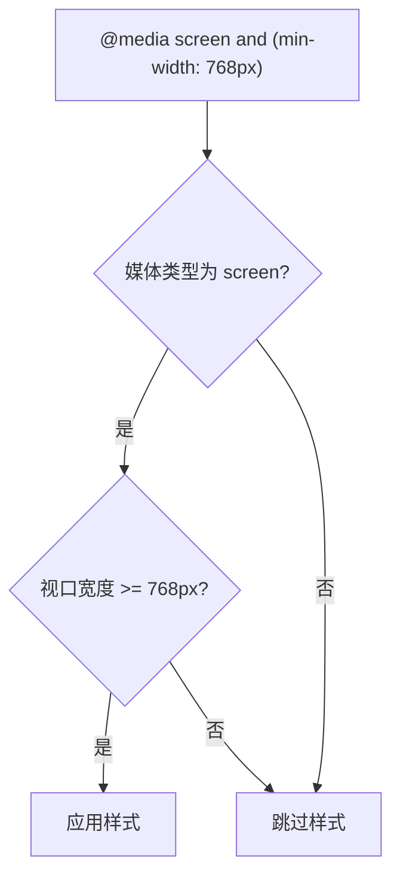

## 前置知识

建议先阅读以下内容再进入本文：

- [CSS3 概述与基本语法](/css/020-CSS3OverviewBasicSyntax)

## 1. 历史动机与发展脉络

2004 年前后，移动设备开始访问 Web，固定宽度布局在窄屏上需要横向滚动。2007 年 iPhone 发布后，响应式 Web 设计（Responsive Web Design）由 Ethan Marcotte 于 2010 年在 A List Apart 提出，其三大支柱是流式网格、弹性图片与媒体查询。

媒体查询本身起源于 CSS2 的媒体类型（`screen`、`print`、`aural`），Media Queries Level 3（2012 年成为 W3C Recommendation）引入媒体特性（width、orientation 等）与逻辑操作符；Media Queries Level 4（2017 年草案，2022 年前后稳定）新增 `prefers-color-scheme`、`prefers-reduced-motion`、`hover`、`pointer` 等用户偏好与交互能力特性。2023 年起容器查询（Container Queries，CSS Containment Level 3）获得主流浏览器支持，组件级响应式成为新方向，但媒体查询仍是页面级响应式的基石。



## 2. 形式化定义

`@media` 规则由媒体查询列表构成，语法：

```css
@media <media-query-list> {
  /* 条件成立时应用的样式 */
}
```

媒体查询列表用逗号分隔多个查询，任一查询为真则整体为真（或语义）。单个查询由可选媒体类型、媒体特性与逻辑操作符组成：

媒体类型：`all`（默认）、`screen`、`print`、`speech`。`not` 只能修饰整个查询（不能修饰单个特性）。

媒体特性以 `(特性: 值)` 或 `(特性)` 形式书写：`(min-width: 768px)`、`(orientation: portrait)`、`(hover: hover)`。无值特性如 `(color)` 表示支持该特性。

逻辑操作符：

`and`：连接媒体类型与特性，全部成立才为真；

`,`：查询列表分隔符，任一查询为真即为真；

`not`：对整个查询取反；

`only`：用于兼容不支持媒体查询的旧浏览器（现代已不必要，仍可保留）。

范围语法（Media Queries Level 4）：`(400px <= width <= 800px)`、`(width >= 768px)` 是新的区间写法，可读性优于 `min/max`，现代浏览器均支持。



## 3. 理论推导与原理解析

### 3.1 min-width 与 max-width 的不等式

`min-width: 768px` 等价于 `width >= 768px`；`max-width: 767px` 等价于 `width <= 767px`。两者在 767/768 边界互补。移动优先策略使用 `min-width` 从窄到宽逐步增强；桌面优先策略使用 `max-width` 从宽到窄逐步降级。

### 3.2 视口与布局视口

媒体查询中的 `width` 指布局视口宽度（layout viewport），由 `<meta name="viewport" content="width=device-width, initial-scale=1">` 控制。缺失该 meta 时，移动浏览器使用默认视口宽度（如 980px），媒体查询将按 980px 判断，导致移动优先样式失效。因此响应式页面的第一步是正确设置 viewport meta。

### 3.3 媒体查询的层叠行为

媒体查询不改变 CSS 层叠优先级，只控制规则是否参与层叠。因此两条规则同时命中时，后定义者胜出。移动优先写法中，基础样式在前，`min-width` 增强在后，天然符合层叠顺序。

### 3.4 与容器查询的分工

媒体查询参照视口，解决“页面级”响应；容器查询参照最近的容器尺寸，解决“组件级”响应。一个卡片组件在窄侧栏与宽主区中应自适应容器，而不是依赖视口断点。容器查询需要父元素声明 `container-type: inline-size`，且不能替代媒体查询（页面级排版仍需视口信息）。

## 4. 代码示例（带详尽注释）

### 4.1 移动优先断点体系

```css
/* 基础样式：默认面向窄屏（移动优先） */
.grid {
  display: grid;
  grid-template-columns: 1fr; /* 单列 */
  gap: 16px;
}

/* 视口 >= 640px：两列 */
@media (min-width: 640px) {
  .grid {
    grid-template-columns: repeat(2, 1fr);
  }
}

/* 视口 >= 1024px：三列 */
@media (min-width: 1024px) {
  .grid {
    grid-template-columns: repeat(3, 1fr);
  }
}
```

讲解：断点 640/1024 是内容驱动的常用选择。移动优先的要点：基础样式无需媒体查询，增强逐级叠加，因此窄屏设备只加载最简样式。

### 4.2 深色模式

```css
:root {
  --bg: #ffffff;
  --text: #1f1f1f;
}

/* 用户系统偏好深色时切换变量 */
@media (prefers-color-scheme: dark) {
  :root {
    --bg: #1f1f1f;
    --text: #f0f0f0;
  }
}

body {
  background: var(--bg);
  color: var(--text);
}
```

讲解：`prefers-color-scheme` 读取操作系统或浏览器的深色偏好。通过 CSS 变量切换主题，一套选择器适配两种模式，避免重复编写整套样式。

### 4.3 减少动画偏好

```css
/* 默认动画 */
.banner {
  animation: slide-in 0.6s ease;
}

/* 用户开启“减少动态效果”时关闭动画 */
@media (prefers-reduced-motion: reduce) {
  .banner {
    animation: none;
    transition: none;
  }
}
```

讲解：`prefers-reduced-motion` 服务于前庭障碍与晕动症用户，是 WCAG 2.1 可访问性最佳实践。关闭动画的同时应保证内容立即可见（不要用 `opacity: 0` 残留）。

### 4.4 打印样式

```css
/* 打印时隐藏导航与广告，展开正文 */
@media print {
  .navbar,
  .sidebar,
  .ad {
    display: none !important;
  }
  main {
    width: 100%;
  }
}
```

讲解：`print` 媒体类型为打印优化：隐藏非内容区域、设置黑白配色、避免分页截断。可用 `page-break-inside: avoid` 控制元素不跨页。

### 4.5 方向与指针能力

```css
/* 横屏：两栏布局 */
@media (orientation: landscape) {
  .profile {
    grid-template-columns: 200px 1fr;
  }
}

/* 主输入设备支持悬停：显示桌面悬停效果 */
@media (hover: hover) and (pointer: fine) {
  .item:hover {
    transform: translateY(-2px);
  }
}
```

讲解：`orientation` 适配平板横竖屏；`hover`/`pointer` 区分触屏与鼠标设备，避免触屏设备出现无法取消的悬停态。

### 4.6 范围语法

```css
/* 新语法：只命中 768-1024 区间 */
@media (768px <= width <= 1024px) {
  .container {
    padding: 24px;
  }
}
```

讲解：范围语法表达区间更直观，且避免 767/768 边界笔误。2023 年起所有主流浏览器支持，可放心用于现代项目。

### 4.7 JavaScript 中的媒体查询

```js
// 用 matchMedia 在 JS 中响应视口变化
const mq = window.matchMedia('(min-width: 1024px)')

function handleChange(e) {
  // e.matches 表示当前是否命中
  console.log('桌面布局:', e.matches)
}

mq.addEventListener('change', handleChange)
handleChange(mq) // 初始化执行一次
```

讲解：`matchMedia` 返回 MediaQueryList，`change` 事件在命中状态变化时触发。注意使用 `addEventListener` 而非已废弃的 `addListener`，并清理监听避免泄漏。

### 4.8 响应式图片

```html
<!-- 根据视口宽度选择图片资源 -->

```

讲解：`srcset` 按资源宽度声明候选，`sizes` 告诉浏览器图片在布局中的实际宽度，浏览器综合视口、DPR 与带宽自动选择。这是媒体查询之外的响应式图片标准方案。

## 5. 对比分析

### 5.1 媒体查询与容器查询

| 维度 | 媒体查询 | 容器查询 |
| --- | --- | --- |
| 参照对象 | 视口 | 最近容器 |
| 粒度 | 页面级 | 组件级 |
| 前置条件 | 无 | 父元素 container-type |
| 适用 | 整体布局 | 复用组件 |

### 5.2 min-width 与 max-width 策略

移动优先（min-width）代码路径短、性能好、渐进增强；桌面优先（max-width）适合改造存量桌面站点。新项目推荐移动优先。

### 5.3 @media 与 @import media

`<link media="...">` 与 `@import url(...) media` 也能条件加载样式表，但会额外产生请求；`@media` 内联规则没有请求开销。性能敏感场景优先内联媒体查询。

## 6. 常见陷阱与最佳实践

陷阱一：缺少 viewport meta，移动端媒体查询失效。

陷阱二：断点基于固定设备（iPhone 宽度），设备碎片化导致维护失控。最佳实践：基于内容换行点选择断点。

陷阱三：`max-width: 767px` 与 `min-width: 768px` 间隙或重叠。使用范围语法或统一取整策略。

陷阱四：媒体查询嵌套在组件 scoped 样式中时，Vue/React 的 scoped 机制不影响媒体查询（媒体查询作用于全局视口），可放心使用。

陷阱五：深色模式只改背景不改图片/阴影，出现刺眼白色卡片。最佳实践：用 CSS 变量覆盖全部颜色令牌。

陷阱六：`prefers-reduced-motion: reduce` 下仍保留 `scroll-behavior: smooth`。应同时关闭平滑滚动。

陷阱七：媒体查询中写 `not (min-width: 768px)` 的非法组合。`not` 修饰整个查询，等价写法为 `@media not all and (min-width: 768px)`。

## 7. 工程实践

### 7.1 断点设计令牌

```css
:root {
  --bp-sm: 640px;
  --bp-md: 768px;
  --bp-lg: 1024px;
  --bp-xl: 1280px;
}
```

讲解：断点值收敛为令牌，配合注释说明每个断点的内容动机（如“列表换两列”“导航收起为汉堡”），避免随意新增断点。

### 7.2 组合查询的组件化

```css
/* 桌面端且在浅色模式下：给卡片添加悬停投影 */
@media (min-width: 1024px) and (prefers-color-scheme: light) {
  .card:hover {
    box-shadow: 0 8px 24px rgba(0, 0, 0, 0.1);
  }
}
```

讲解：`and` 组合多个维度条件。组合越多越脆弱，建议每个查询只解决一个维度的适配。

## 8. 案例研究：文档站点完整响应式方案

需求：文档站桌面三栏（目录/正文/相关）、平板两栏、手机单栏，支持深色模式与减少动画。

```css
/* 移动优先基础：单栏 */
.layout {
  display: grid;
  grid-template-columns: 1fr;
  gap: 16px;
  padding: 16px;
}

/* 平板：正文 + 目录 */
@media (min-width: 768px) {
  .layout {
    grid-template-columns: 240px 1fr;
  }
}

/* 桌面：三栏 */
@media (min-width: 1280px) {
  .layout {
    grid-template-columns: 240px 1fr 220px;
  }
}

/* 深色模式变量覆盖 */
@media (prefers-color-scheme: dark) {
  :root {
    --bg: #16181d;
    --text: #e6e6e6;
    --border: #2d3138;
  }
}

/* 减少动画 */
@media (prefers-reduced-motion: reduce) {
  * {
    animation-duration: 0.01ms !important;
    transition-duration: 0.01ms !important;
  }
}
```

讲解：方案分层清晰：布局断点解决结构，色彩变量解决主题，动画偏好解决无障碍。每层独立演进，互不干扰。`animation-duration: 0.01ms` 的技巧让动画“瞬间完成”而非硬性禁用，避免依赖动画完成的逻辑挂起。

## 9. 知识要点总结与深入讲解

媒体查询的条件本质是“视口/环境特性谓词”，命中则参与层叠。移动优先的核心是把默认样式写成窄屏最优，再用 `min-width` 逐级增强。

用户偏好类媒体查询（深色、减少动画、对比度）是 CSS 与现代操作系统的桥梁，它们不是设备特性而是用户意图，理应获得更高优先级的设计关注。

容器查询与媒体查询的分工可以总结为：页面排版问视口，组件排版问容器。两者配合才能覆盖现代响应式设计的全部场景。

### 1. @media 语法

```css
@media screen and (min-width: 768px) {
  /* 样式 */
}
```

#### 媒体类型：`all`（默认）、`screen`、`print`、`speech`

#### 逻辑操作符：`and`、逗号（or）、`not`、`only`

### 1. 常用媒体特性

```css
@media (min-width: 768px) {
} /* 视口宽度 */
@media (orientation: portrait) {
} /* 竖屏 */
@media (prefers-color-scheme: dark) {
} /* 深色模式 */
@media (prefers-reduced-motion: reduce) {
} /* 减少动画 */
@media (hover: hover) {
} /* 支持悬停 */
@media (pointer: fine) {
} /* 精确指针 */
```

### 2. 响应式断点

```css
.container {
  padding: 1rem;
}
@media (min-width: 576px) {
  .container {
    padding: 1.5rem;
  }
}
@media (min-width: 768px) {
  .container {
    padding: 2rem;
  }
}
@media (min-width: 992px) {
  .container {
    max-width: 960px;
    margin: 0 auto;
  }
}
```

### 3. 深色模式

```css
:root {
  --bg: #fff;
  --text: #333;
}
@media (prefers-color-scheme: dark) {
  :root {
    --bg: #1a1a1a;
    --text: #e0e0e0;
  }
}
```

### 4. JavaScript 检测

```javascript
const prefersDark = window.matchMedia('(prefers-color-scheme: dark)').matches;
window.matchMedia('(prefers-color-scheme: dark)').addEventListener('change', (e) => {
  console.log('深色模式:', e.matches);
});
```
### 基础语法

**基本写法：media 基本语法**
`@media <条件> { <样式> }`
```css
/* 基本媒体查询 */
@media screen {
  body {
    font-size: 16px;
  }
}
```

---

**基本写法：media 媒体类型**
`@media <类型> { <样式> }`
```css
/* 指定媒体类型 */
@media print {
  body {
    color: black;
  }
}
```

---

**基本写法：media screen 屏幕**
`@media screen { <样式> }`
```css
/* 屏幕设备样式 */
@media screen {
  .container {
    max-width: 1200px;
  }
}
```

---

**基本写法：media print 打印**
`@media print { <样式> }`
```css
/* 打印样式 */
@media print {
  .no-print {
    display: none;
  }
}
```

---

**基本写法：media all 所有**
`@media all { <样式> }`
```css
/* 所有设备 */
@media all {
  body {
    margin: 0;
  }
}
```

---

### 宽度查询

**基本写法：max-width 最大宽度**
`@media (max-width: <值>) { <样式> }`
```css
/* 屏幕宽度小于等于指定值 */
@media (max-width: 768px) {
  .container {
    padding: 10px;
  }
}
```

---

**基本写法：min-width 最小宽度**
`@media (min-width: <值>) { <样式> }`
```css
/* 屏幕宽度大于等于指定值 */
@media (min-width: 768px) {
  .container {
    max-width: 720px;
  }
}
```

---

**基本写法：宽度范围**
`@media (min-width: <值>) and (max-width: <值>) { <样式> }`
```css
/* 屏幕宽度在指定范围内 */
@media (min-width: 768px) and (max-width: 1024px) {
  .container {
    width: 750px;
  }
}
```

---

### 高度查询

**基本写法：max-height 最大高度**
`@media (max-height: <值>) { <样式> }`
```css
/* 屏幕高度小于等于指定值 */
@media (max-height: 500px) {
  .header {
    height: 40px;
  }
}
```

---

**基本写法：min-height 最小高度**
`@media (min-height: <值>) { <样式> }`
```css
/* 屏幕高度大于等于指定值 */
@media (min-height: 800px) {
  .hero {
    height: 600px;
  }
}
```

---

**基本写法：高度范围**
`@media (min-height: <值>) and (max-height: <值>) { <样式> }`
```css
/* 屏幕高度在指定范围内 */
@media (min-height: 600px) and (max-height: 900px) {
  .hero {
    height: 400px;
  }
}
```

---

### 方向查询

**基本写法：orientation 横屏**
`@media (orientation: landscape) { <样式> }`
```css
/* 横屏时应用 */
@media (orientation: landscape) {
  .layout {
    flex-direction: row;
  }
}
```

---

**基本写法：orientation 竖屏**
`@media (orientation: portrait) { <样式> }`
```css
/* 竖屏时应用 */
@media (orientation: portrait) {
  .layout {
    flex-direction: column;
  }
}
```

---

### 分辨率查询

**基本写法：min-resolution 最小分辨率**
`@media (min-resolution: <值>dppx) { <样式> }`
```css
/* 高分辨率屏幕 */
@media (min-resolution: 2dppx) {
  .logo {
    background-image: url('logo@2x.png');
  }
}
```

---

**基本写法：min-resolution dpi**
`@media (min-resolution: <值>dpi) { <样式> }`
```css
/* 指定 dpi 分辨率 */
@media (min-resolution: 192dpi) {
  .logo {
    background-image: url('logo@2x.png');
  }
}
```

---

### 逻辑操作符

**基本写法：and 与操作**
`@media (<条件1>) and (<条件2>) { <样式> }`
```css
/* 同时满足多个条件 */
@media (min-width: 768px) and (max-width: 1024px) {
  .container {
    width: 750px;
  }
}
```

---

**基本写法：or 或操作**
`@media (<条件1>), (<条件2>) { <样式> }`
```css
/* 满足任一条件 */
@media (max-width: 480px), (min-width: 1200px) {
  .sidebar {
    display: none;
  }
}
```

---

**基本写法：not 非 操作**
`@media not <条件> { <样式> }`
```css
/* 不满足条件时应用 */
@media not print {
  body {
    background: white;
  }
}
```

---

**基本写法：only 仅**
`@media only <类型> { <样式> }`
```css
/* 仅对支持媒体查询的设备应用 */
@media only screen {
  .container {
    max-width: 1200px;
  }
}
```

---

**单行写法：多逻辑组合**
`@media (<条件1>) and (<条件2>), (<条件3>) { <样式> }`
```css
/* 单行组合多个逻辑条件 */
@media (min-width: 768px) and (orientation: landscape), (min-width: 1200px) { .layout { flex-direction: row; } }
```

---

**换行写法：多逻辑组合**
`@media (<条件1>) and (<条件2>), (<条件3>) { <样式> }`
```css
/* 换行组合多个逻辑条件 */
@media (min-width: 768px) and (orientation: landscape),
       (min-width: 1200px) {
  .layout {
    flex-direction: row;
  }
}
```

---

### 用户偏好查询

**基本写法：prefers-color-scheme 暗色**
`@media (prefers-color-scheme: dark) { <样式> }`
```css
/* 用户偏好暗色主题 */
@media (prefers-color-scheme: dark) {
  body {
    background-color: #1a1a1a;
    color: #ffffff;
  }
}
```

---

**基本写法：prefers-color-scheme 亮色**
`@media (prefers-color-scheme: light) { <样式> }`
```css
/* 用户偏好亮色主题 */
@media (prefers-color-scheme: light) {
  body {
    background-color: #ffffff;
    color: #333333;
  }
}
```

---

**基本写法：prefers-reduced-motion 减少动画**
`@media (prefers-reduced-motion: reduce) { <样式> }`
```css
/* 用户偏好减少动画 */
@media (prefers-reduced-motion: reduce) {
  * {
    animation-duration: 0.01ms !important;
    transition-duration: 0.01ms !important;
  }
}
```

---

**基本写法：prefers-reduced-motion 无偏好**
`@media (prefers-reduced-motion: no-preference) { <样式> }`
```css
/* 用户无动画偏好 */
@media (prefers-reduced-motion: no-preference) {
  .box {
    transition: transform 0.3s;
  }
}
```

---

**基本写法：prefers-contrast 高对比度**
`@media (prefers-contrast: more) { <样式> }`
```css
/* 用户偏好高对比度 */
@media (prefers-contrast: more) {
  .text {
    color: black;
    background: white;
  }
}
```

---

**基本写法：prefers-contrast 低对比度**
`@media (prefers-contrast: less) { <样式> }`
```css
/* 用户偏好低对比度 */
@media (prefers-contrast: less) {
  .text {
    color: #666;
    background: #f5f5f5;
  }
}
```

---

**基本写法：forced-colors 强制颜色**
`@media (forced-colors: active) { <样式> }`
```css
/* 系统强制颜色模式 */
@media (forced-colors: active) {
  .button {
    border: 1px solid ButtonText;
  }
}
```

---

### 设备特性查询

**基本写法：hover 悬停支持**
`@media (hover: hover) { <样式> }`
```css
/* 设备支持悬停 */
@media (hover: hover) {
  .button:hover {
    background-color: #0056b3;
  }
}
```

---

**基本写法：hover 无悬停**
`@media (hover: none) { <样式> }`
```css
/* 设备不支持悬停 */
@media (hover: none) {
  .button {
    padding: 12px 24px;
  }
}
```

---

**基本写法：pointer 精确指针**
`@media (pointer: fine) { <样式> }`
```css
/* 设备有精确指针 */
@media (pointer: fine) {
  .tooltip {
    display: block;
  }
}
```

---

**基本写法：pointer 粗略指针**
`@media (pointer: coarse) { <样式> }`
```css
/* 设备为粗略指针（触摸） */
@media (pointer: coarse) {
  .button {
    padding: 12px 24px;
  }
}
```

---

**基本写法：any-pointer 任一精确**
`@media (any-pointer: fine) { <样式> }`
```css
/* 任一输入设备为精确指针 */
@media (any-pointer: fine) {
  .tooltip {
    display: block;
  }
}
```

---

**基本写法：any-hover 任一悬停**
`@media (any-hover: hover) { <样式> }`
```css
/* 任一输入设备支持悬停 */
@media (any-hover: hover) {
  .button:hover {
    background-color: #0056b3;
  }
}
```

---

### 视口特性查询

**基本写法：aspect-ratio 宽高比**
`@media (aspect-ratio: <宽>/<高>) { <样式> }`
```css
/* 指定宽高比 */
@media (aspect-ratio: 16/9) {
  .video {
    width: 100%;
  }
}
```

---

**基本写法：min-aspect-ratio 最小宽高比**
`@media (min-aspect-ratio: <宽>/<高>) { <样式> }`
```css
/* 宽高比大于指定值 */
@media (min-aspect-ratio: 16/9) {
  .layout {
    flex-direction: row;
  }
}
```

---

**基本写法：max-aspect-ratio 最大宽高比**
`@media (max-aspect-ratio: <宽>/<高>) { <样式> }`
```css
/* 宽高比小于指定值 */
@media (max-aspect-ratio: 1/1) {
  .layout {
    flex-direction: column;
  }
}
```

---

### 媒体函数

**基本写法：range 语法**
`@media (width >= <值>) { <样式> }`
```css
/* 使用范围语法 */
@media (width >= 768px) {
  .container {
    max-width: 720px;
  }
}
```

---

**基本写法：range 区间**
`@media (<最小> <= width <= <最大>) { <样式> }`
```css
/* 使用区间语法 */
@media (768px <= width <= 1024px) {
  .container {
    width: 750px;
  }
}
```

---

**基本写法：not 否定**
`@media not (<条件>) { <样式> }`
```css
/* 否定条件 */
@media not (prefers-color-scheme: dark) {
  body {
    background: white;
  }
}
```

---

### 媒体查询嵌套

**基本写法：嵌套媒体查询**
`<选择器> { @media <条件> { <样式> } }`
```css
/* CSS 原生嵌套 */
.container {
  width: 100%;
  @media (min-width: 768px) {
    max-width: 720px;
  }
}
```

---

**单行写法：嵌套多媒体查询**
`<选择器> { @media <条件1> { <样式> } @media <条件2> { <样式> } }`
```css
/* 单行嵌套多个媒体查询 */
.col { width: 100%; @media (min-width: 768px) { width: 50%; } @media (min-width: 1200px) { width: 33%; } }
```

---

**换行写法：嵌套多媒体查询**
`<选择器> { @media <条件1> { <样式> } @media <条件2> { <样式> } }`
```css
/* 换行嵌套多个媒体查询 */
.col {
  width: 100%;
  @media (min-width: 768px) {
    width: 50%;
  }
  @media (min-width: 1200px) {
    width: 33%;
  }
}
```

---

### @import 媒体查询

**基本写法：@import 带媒体查询**
`@import url("<文件>") <条件>;`
```css
/* 导入样式并应用媒体查询 */
@import url("mobile.css") (max-width: 768px);
```

---

**基本写法：@import 多条件**
`@import url("<文件>") <条件1> and <条件2>;`
```css
/* 导入样式并应用多条件 */
@import url("tablet.css") (min-width: 768px) and (max-width: 1024px);
```

---

### @supports 特性查询

**基本写法：supports 属性支持**
`@supports (<属性>: <值>) { <样式> }`
```css
/* 检查属性支持 */
@supports (display: grid) {
  .container {
    display: grid;
  }
}
```

---

**基本写法：supports not 不支持**
`@supports not (<属性>: <值>) { <样式> }`
```css
/* 检查属性不支持 */
@supports not (display: grid) {
  .container {
    display: flex;
  }
}
```

---

**基本写法：supports and 与**
`@supports (<属性1>: <值>) and (<属性2>: <值>) { <样式> }`
```css
/* 同时检查多个属性支持 */
@supports (display: grid) and (gap: 10px) {
  .grid {
    display: grid;
    gap: 10px;
  }
}
```

---

**基本写法：supports or 或**
`@supports (<属性1>: <值>) or (<属性2>: <值>) { <样式> }`
```css
/* 检查任一属性支持 */
@supports (-webkit-backdrop-filter: blur(10px)) or (backdrop-filter: blur(10px)) {
  .modal {
    backdrop-filter: blur(10px);
  }
}
```

---

**基本写法：selector 选择器支持**
`@supports selector(<选择器>) { <样式> }`
```css
/* 检查选择器支持 */
@supports selector(:has(*)) {
  .card:has(img) {
    padding: 10px;
  }
}
```

---

### 断点规范

**基本写法：移动优先断点**
`@media (min-width: <值>) { <样式> }`
```css
/* 移动优先断点系统 */
.container { width: 100%; }
@media (min-width: 576px) { .container { max-width: 540px; } }
@media (min-width: 768px) { .container { max-width: 720px; } }
@media (min-width: 992px) { .container { max-width: 960px; } }
@media (min-width: 1200px) { .container { max-width: 1140px; } }
```

---

**基本写法：桌面优先断点**
`@media (max-width: <值>) { <样式> }`
```css
/* 桌面优先断点系统 */
.container { max-width: 1140px; }
@media (max-width: 1199px) { .container { max-width: 960px; } }
@media (max-width: 991px) { .container { max-width: 720px; } }
@media (max-width: 767px) { .container { max-width: 540px; } }
@media (max-width: 575px) { .container { max-width: 100%; } }
```

---

### 常见媒体查询模式

**基本写法：隐藏元素**
`@media (max-width: <值>) { <选择器> { display: none; } }`
```css
/* 小屏隐藏元素 */
@media (max-width: 768px) {
  .sidebar {
    display: none;
  }
}
```

---

**基本写法：切换布局**
`@media (max-width: <值>) { <选择器> { flex-direction: column; } }`
```css
/* 小屏切换为列布局 */
.layout {
  display: flex;
  flex-direction: row;
}
@media (max-width: 768px) {
  .layout {
    flex-direction: column;
  }
}
```

---

**基本写法：调整字号**
`@media (max-width: <值>) { <选择器> { font-size: <值>; } }`
```css
/* 小屏调整字号 */
.title {
  font-size: 2rem;
}
@media (max-width: 768px) {
  .title {
    font-size: 1.5rem;
  }
}
```

---

**基本写法：调整间距**
`@media (max-width: <值>) { <选择器> { padding: <值>; } }`
```css
/* 小屏调整间距 */
.section {
  padding: 40px;
}
@media (max-width: 768px) {
  .section {
    padding: 20px;
  }
}
```

---

### 用户偏好媒体查询(2024)

**基本写法：prefers-reduced-motion 减少动画**
`@media (prefers-reduced-motion: reduce) { <样式> }`
```css
/* 用户偏好减少动画,关闭非必要动效 */
@media (prefers-reduced-motion: reduce) {
  *,
  *::before,
  *::after {
    animation-duration: 0.01ms !important;
    animation-iteration-count: 1 !important;
    transition-duration: 0.01ms !important;
    scroll-behavior: auto !important;
  }
}
```

---

**基本写法：prefers-color-scheme 色彩偏好**
`@media (prefers-color-scheme: <dark|light>) { <样式> }`
```css
/* 用户系统级色彩偏好 */
@media (prefers-color-scheme: dark) {
  :root {
    --bg: #1a1a1a;
    --text: #ffffff;
  }
  body {
    background-color: var(--bg);
    color: var(--text);
  }
}
```

---

**基本写法：prefers-contrast 对比度偏好**
`@media (prefers-contrast: <more|less|custom>) { <样式> }`
```css
/* 用户对比度偏好设置 */
@media (prefers-contrast: more) {
  .text {
    color: black;
    background: white;
    border: 2px solid black;
  }
}
```

---

**基本写法：prefers-reduced-transparency 减少透明**
`@media (prefers-reduced-transparency: reduce) { <样式> }`
```css
/* 用户偏好减少透明度效果 */
@media (prefers-reduced-transparency: reduce) {
  .modal {
    background-color: rgba(0, 0, 0, 0.95);
  }
  .glass {
    backdrop-filter: none;
    background-color: #f5f5f5;
  }
}
```

---

**基本写法：inverted-colors 反色模式**
`@media (inverted-colors: inverted) { <样式> }`
```css
/* 系统级颜色反转模式 */
@media (inverted-colors: inverted) {
  /* 反色模式下调整图片避免二次反转 */
  img,
  video {
    filter: invert(1);
  }
}
```

## 动手试试

1. 写一个两栏布局，在 768px 断点以下变为单栏；
2. 用 `prefers-color-scheme: dark` 给页面加深色主题；
3. 用 `(min-width: 600px) and (max-width: 900px)` 测试区间命中；
4. 进阶挑战：用 `prefers-reduced-motion` 关闭动画。

## 核心知识点

> 一句话记住媒体查询：`@media (条件)` 按视口/系统偏好切换样式；断点用 min-width 移动优先，深色与减少动效都要考虑。

- 语法：`@media (min-width: 768px) { ... }`；
- 移动优先：基础样式给移动端，`min-width` 向上增强；
- 常用条件：`min-width`/`max-width`、`prefers-color-scheme`、`prefers-reduced-motion`、`orientation`；
- 多个条件用 `and`/`or`/`not` 组合；
- 断点跟着内容走，不跟设备走；
- 深色模式只需覆盖颜色变量。

## 注意事项与改进建议

| 问题点 | 说明 | 改进方案 |
| --- | --- | --- |
| 断点拍脑袋 | 内容断裂 | 按内容实际需要设断点 |
| 桌面优先 | 移动端体验差 | 移动优先 + min-width |
| 大量重复媒体查询 | 维护困难 | 用 CSS 变量与容器查询配合 |
| 忘记深色模式 | 夜间刺眼 | 颜色全部走变量并适配 |
| 忽略 reduced-motion | 动效扰民 | 媒体查询关闭动画 |

## 扩展学习

- 容器查询：`css/390-ContainerQuery`；
- 响应式设计：`css/370-ResponsiveDesign`；
- 移动适配：`css/380-MobileAdaptation`；
- 可访问性：`css/500-AccessibleStyling`。
