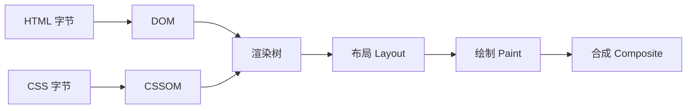

## 前置知识

- [关键渲染路径与资源加载](/html5/380-CriticalRenderingPathAndResourceLoading)：DOM 与资源加载的基本流程。

## 学习目标

- 画出「解析 HTML/CSS 到首帧」的管线，并用它解释「CSS 阻塞渲染」这句话的确切含义；
- 会用条件加载、关键 CSS 内联、异步样式三招缩短首屏路径；
- 能在 DevTools 里亲手复现并测量一次样式表阻塞。

预计 45 到 70 分钟。

## 概念引入：浏览器在等什么

打开页面的前几百毫秒，浏览器在走一条流水线：



关键问题：**渲染树的构建需要完整的 CSSOM**。浏览器不敢在 CSS 没读完时先画——如果画了一半规则才到，用户会先看到裸样式（FOUC，无样式内容闪烁），再突然整页变形。于是浏览器选择等待，这就是「CSS 阻塞渲染」的确切含义：

> 不是 CSS 执行慢，而是在 CSSOM 就绪之前，浏览器拒绝渲染任何东西。

心智模型：把首屏想成「一张要等齐拼图才能开始的画」。HTML 拼图流式到达就能先拼一部分，CSS 拼图必须等齐——所以优化方向只有一个：**让关键 CSS 尽早到齐，让非关键 CSS 别来堵门**。

## 三招：分流关键与非关键 CSS

### 第一招：条件加载，让样式表「按需阻塞」

`<link>` 的 `media` 属性决定样式表是否参与当前设备的渲染阻塞：

```html
<!-- 打印样式不阻塞屏幕渲染 -->
<link rel="stylesheet" href="print.css" media="print">
<!-- 窄屏设备不会等这份样式表 -->
<link rel="stylesheet" href="desktop.css" media="(min-width: 1024px)">
```

注意语义：`media` 不匹配的样式表**仍然会被下载**（预取），只是不阻塞渲染、不参与当前匹配的层叠。

### 第二招：关键 CSS 内联

首屏必需的规则（页头、首屏卡片、基础排版）直接内联进 HTML：

```html
<style>
  /* 只放首屏必需的几十行 */
  body { margin: 0; font: 16px/1.5 system-ui, sans-serif; }
  .hero { min-height: 60vh; }
</style>
<link rel="stylesheet" href="full.css">
```

内联规则随 HTML 字节流到达，省掉一次网络往返 + 解析等待；`full.css` 继续加载，就绪后接管全页样式。常见实现是构建期工具自动抽取（critters、beasties 一类插件）。

### 第三招：非关键样式异步加载

```html
<!-- 方式一：preload 下载、onload 切换为样式表 -->
<link rel="preload" href="full.css" as="style" onload="this.rel='stylesheet'">
<noscript><link rel="stylesheet" href="full.css"></noscript>

<!-- 方式二：media 技巧，效果相同 -->
<link rel="stylesheet" href="full.css" media="print" onload="this.media='all'">
```

`preload` 高优先级下载但不应用，`onload` 再切换为样式表。代价是样式应用前页面以无样式状态存在，所以**只对滚动后才需要的样式**这么做（弹窗、暗色主题、深层路由），首屏样式永远走关键内联或普通阻塞加载。

另外两条老规矩仍然有效：`@import` 会把样式表串行化（前一张下载完才知道还有下一张），生产代码用 `<link>` 平铺；压缩与最小化交给构建链，手写阶段不操心。

## 字体：阻塞链上的另一个卡点

`@font-face` 的字体在加载期间有「阻塞期」——用它的文字先隐藏或用后备字体渲染，具体行为由 `font-display` 决定（`swap` 立即用后备字体、字体到货后替换；`block` 先短暂隐藏文字）。首屏优化里的常见组合：关键 CSS 内联 + 字体 `font-display: swap` + 字体文件 `preload`。完整机制见 [CSS 字体加载](/css/510-CSSFontLoading)。

## 现代补充：让浏览器跳过画不出来的部分

`content-visibility: auto` 让浏览器跳过视口外元素的布局与绘制，长列表与长文章的首屏成本显著下降：

```css
section {
  content-visibility: auto;
  contain-intrinsic-size: auto 500px; /* 预估占位高度，避免滚动条跳动 */
}
```

（基线说明：Chrome 85 起支持，Firefox 125、Safari 18 先后跟进；2026 年新项目可放心用于渐进增强，关键路径不能依赖它。）

## 测量：优化前后各量一次

没有测量就没有优化。三个入口：

1. **DevTools Performance 面板**：录制加载过程，看首帧前的样式重算、布局与网络瀑布里 CSS 的时序；
2. **Lighthouse**：FCP（首次内容绘制）与 LCP（最大内容绘制）是关键路径的直接成绩单；「消除阻塞渲染的资源」这类建议会点名具体样式表；
3. **Coverage（覆盖率）面板**：量化「加载的 CSS 有多少首屏根本没用到」——这个数字通常是压倒性的，它就是分流的理论依据。

指标体系的完整口径见 [核心 Web 指标](/javascript/510-CoreWebVitalsAndPerformanceMetrics)。

## 常见坑与调试实录

**坑 1：把首屏样式也异步了。** `preload + onload` 用在首屏 CSS 上，换来一段白屏或裸样式期——比阻塞渲染更难看。异步只属于「首屏用不到」的样式。

**坑 2：关键 CSS 太「关键」。** 内联了几十 KB 全量样式，HTML 体积暴涨，反而拖慢 HTML 本身的下载与解析。判断标准：首屏可见区域渲染需要的规则才内联。

**坑 3：只优化 CSS 忘了字体。** 样式就绪了、字体没到，`font-display: block` 会让首屏文字隐形数秒。样式与字体要放进同一张优化清单。

**坑 4：误以为条件加载省带宽。** `media` 不匹配的样式表照样下载，省的是渲染等待，不是流量。

## 与之前和之后的知识的关系

- 之前：[盒模型详解](/css/050-CSS3BoxModelDetailed) 是布局阶段的计算对象；[资源加载](/html5/380-CriticalRenderingPathAndResourceLoading) 决定 CSS 字节何时到达；
- 并行：[CSS 性能优化](/css/540-CSSPerformanceOptimizationDetailed) 关注运行期的选择器与重排成本，本篇只管「首帧之前」；[字体加载](/css/510-CSSFontLoading) 是阻塞链的延伸段；
- 之后：原子化 CSS 产物小且静态可缓存，天然适合走非阻塞路径（[CSS 原子化](/css/610-CSSAtomic)）；首屏字节预算的另一半大头是图，见[响应式图片](/css/670-ResponsiveImage)。

## 自我检查

- 能完整说出「CSS 阻塞渲染」的因果链：CSSOM 必须完整 → 渲染树不能提前构建 → 浏览器等待；
- 对任意一份样式表，能判断它该走「内联 / 阻塞加载 / 条件加载 / 异步加载」中的哪条路，并说出判断依据；
- 知道 FCP/LCP 与关键路径的关系，会用 Coverage 面板量化未使用率。

## 小练习

### 练习 1：亲手让页面「卡」一秒（预测题）

任务：写一个两文件的页面：`index.html` 引用 `slow.css`；让 `slow.css` 迟到约 1 秒（本地服务加响应延迟，或用脚本延迟注入 `<link>`）。先预测：HTML 里已有可渲染的内容，浏览器会先画吗？再验证，并观察 Performance 面板里首帧的位置。

提示：回想「渲染树需要完整 CSSOM」。

参考现象（先预测再看）：不会先画。首帧被推迟到样式表就绪之后——这就是阻塞的直观形态；Performance 录制里能看到等待网络的空窗。

### 练习 2：给页面做关键 CSS 分流（实践题）

任务：拿练习 1 的页面手工完成分流：(1) 挑出首屏必需规则内联进 `<style>`；(2) 全量样式表改走 `preload + onload`；(3) 打印样式加 `media="print"`。用 Lighthouse 对比改造前后的 FCP。

提示：先在 Coverage 面板看未使用率，再决定内联范围。

参考实现（骨架）：

```html
<head>
  <style>
    body { margin: 0; font: 16px/1.5 system-ui, sans-serif; }
    .hero { display: grid; place-items: center; min-height: 60vh; }
  </style>
  <link rel="preload" href="full.css" as="style" onload="this.rel='stylesheet'">
  <link rel="stylesheet" href="print.css" media="print">
  <noscript><link rel="stylesheet" href="full.css"></noscript>
</head>
```

验收标准：网络限速 Fast 3G 下，首屏内容在样式表加载完成前已可读。

### 练习 3：长页面的跳渲染（挑战题）

任务：给一篇 30 段的长文章页面加 `content-visibility: auto`，用 Performance 面板对比开启前后的加载耗时与滚动流畅度；故意不设 `contain-intrinsic-size`，观察滚动条跳动问题，再补上修复。

提示：占位高度失准会让滚动位置漂移，这是该属性最常被吐槽的点。

参考实现：

```css
article section {
  content-visibility: auto;
  contain-intrinsic-size: auto 320px; /* 与该段实际高度接近的估值 */
}
```

## 下一步

- [CSS 性能优化](/css/540-CSSPerformanceOptimizationDetailed)：首帧之后的运行期成本（选择器、重排、合成）；
- [CSS 字体加载](/css/510-CSSFontLoading)：阻塞链上最常见的第二个卡点；
- [核心 Web 指标](/javascript/510-CoreWebVitalsAndPerformanceMetrics)：把本篇的优化换算成指标数字。
