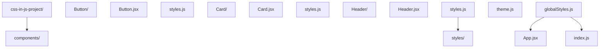

> 前置依赖：需先有 React/Vue 组件开发经验。

> 本文已收敛为 CSS-in-JS 单主题篇。原混入的高级布局内容（§3 Grid、
> §4 Flex、§5 变量、§6 动画、§7 性能、§8 响应式、§9 工具）经逐节核对
> 均为 240/250/410/330/540/370-390/670/560 各专篇已覆盖的速写重复，
> 已按单主题原则移除；布局深读请按上述编号跳转。

## 1. CSS-in-JS 概述

CSS-in-JS 是一种将 CSS 样式直接写在 JavaScript 代码中的方法，它允许开发者使用 JavaScript 的全部能力来管理样式，包括动态样式、条件样式和主题管理。

### 核心优势

- **组件级样式**：样式与组件紧密耦合
- **动态样式**：使用 JavaScript 变量和逻辑生成样式
- **消除样式冲突**：自动生成唯一的类名
- **主题管理**：通过 JavaScript 轻松实现主题切换
- **类型安全**：在 TypeScript 中获得类型提示

## 2. 主流 CSS-in-JS 库

### 2.1 styled-components

**安装**

```bash
 npm install styled-components
```

**基本使用**

```jsx
 import styled from 'styled-components';
 const Button = styled.button`
  background: ${props => props.primary ? 'blue' : 'white'};
  color: ${props => props.primary ? 'white' : 'blue'};
  padding: 8px 16px;
  border: 1px solid blue;
  border-radius: 4px;
  cursor: pointer;
  &:hover {
  background: ${props => props.primary ? 'darkblue' : 'lightblue'};
  }
 `;
 // 使用组件
 <Button primary>Primary Button</Button>
 <Button>Secondary Button</Button>
```

### 2.2 Emotion

**安装**

```bash
 npm install @emotion/react @emotion/styled
```

**基本使用**

```jsx
import styled from '@emotion/styled';
const Card = styled.div`
  background: white;
  border-radius: 8px;
  box-shadow: 0 2px 8px rgba(0, 0, 0, 0.1);
  padding: 16px;
  margin: 16px;
`;
const Title = styled.h2`
  font-size: 1.5rem;
  color: #333;
  margin-bottom: 8px;
`;
// 使用组件
<Card>
  <Title>Card Title</Title>
  <p>Card content</p>
</Card>;
```

### 2.3 JSS

**安装**

```bash
 npm install jss
```

**基本使用**

```javascript
import jss from 'jss';
import preset from 'jss-preset-default';
// 初始化 JSS
jss.setup(preset());
// 创建样式
const styles = {
  button: {
    background: 'blue',
    color: 'white',
    padding: '8px 16px',
    border: 'none',
    borderRadius: '4px',
    cursor: 'pointer',
    '&:hover': {
      background: 'darkblue',
    },
  },
};
// 应用样式
const { classes } = jss.createStyleSheet(styles).attach();
// 使用样式
document.body.innerHTML = `<button class="${classes.button}">Click me</button>`;
```

## 10. 最佳实践

通用 CSS 架构（命名规范、模块化、性能）见 [560-CSSArchitectureMethodology](/css/560-CSSArchitectureMethodology)
与 [540-CSSPerformanceOptimizationDetailed](/css/540-CSSPerformanceOptimizationDetailed)。
CSS-in-JS 语境下的三条专属纪律：

1. **样式与组件同文件同生命周期**：删除组件时样式一起消失，别把
   样式抽出去「方便复用」而破坏这个保证；
2. **动态样式只用于真动态**：随 props 每帧变化的才用插值，静态值
   留在 CSS（变量或文件）里，减少序列化开销；
3. **禁止在 render 里定义 styled 组件**：每次渲染生成新组件导致
   子树重挂载——组件定义必须提到模块顶层。

## 11. 项目实战

### 11.1 CSS-in-JS 项目结构



## 12. 常见问题与解决方案

### 12.1 2026 年的生态：零运行时与 RSC

运行时 CSS-in-JS 的两个固有成本——**组件渲染期生成样式的 CPU 开销**
与 **SSR 首屏样式闪烁**——催生了「零运行时（compile-time）」路线：
样式在构建期编译成普通 CSS 文件，组件里只留类型安全的类名引用。

```tsx
// vanilla-extract：styles.css.ts 里定义，构建期产出静态 CSS
import { style } from "@vanilla-extract/css";
export const button = style({
  background: "var(--color-primary)",
  padding: "8px 16px",
});
// 组件里：import { button } from "./styles.css.ts"; <button className={button} />
```

三派的取舍速查：

| 方案 | 运行时 | 类型安全 | 心智模型 | 适合 |
| --- | --- | --- | --- | --- |
| styled-components / Emotion | 有 | 弱（props 插值） | 样式即组件 | 强动态样式的 CSR 应用 |
| vanilla-extract | 无 | 强（TS 全程） | 样式是独立 ts 模块 | 设计系统、RSC 项目 |
| Panda CSS | 无 | 强 | 原子类 + 配方 | Tailwind 习惯团队要类型 |
| CSS Modules | 无 | 弱（类名字符串） | 传统 CSS 文件 | 渐进迁移、非 TS 团队 |

**React Server Components 下的取舍**：RSC 组件没有浏览器运行时，
`useState`/styled-components 的插值在服务端组件里根本不执行——
运行时 CSS-in-JS 在 RSC 架构中只剩客户端组件可用，且序列化边界
（server -> client props）不能传样式函数。2026 年的实践共识：
RSC 项目默认 vanilla-extract / Panda / CSS Modules + CSS 变量，
真动态样式（用户实时调色这类）用内联 `style` 属性 + CSS 变量，
运行时库只留在确有需要的客户端组件。

**SSR 样式抽取**：运行时方案的 SSR 必须把渲染期生成的样式随 HTML
下发，否则首屏无样式（FOUC）：

- styled-components：`ServerStyleSheet` + `StyleSheetManager`，
  渲染流里收集样式注入 `<head>`；
- Emotion：`@emotion/server` 的 `extractCritical` 只内联首屏用到的
  规则，其余按需加载；
- 框架托管：Next.js App Router 与 Remix 都内置了样式抽取约定，
  选库前先确认框架支持矩阵——手写抽取是 2020 年代的方案，
  2026 年框架内置是默认。

## 动手试试

1. 在 React 中用内联 style 对象设置样式，观察动态值能力；
2. 引入 styled-components，用组件方式写样式；
3. 对比 CSS-in-JS 与 CSS Modules 的动态主题实现；
4. 进阶挑战：用 CSS 变量 + CSS-in-JS 做主题切换。

## 核心知识点

> 一句话记住 CSS-in-JS：样式写在 JS 里，动态值天然支持、作用域隔离、可组件化；代价是运行时开销与 SSR 配置。

- 形式：内联对象、styled-components、Emotion；
- 优点：动态值、局部作用域、随组件卸载；
- 缺点：运行时开销、调试需标记、SSR 复杂；
- 与 CSS 变量结合可做主题；
- 现代框架常混用 CSS Modules 与 CSS-in-JS。

## 注意事项与改进建议

| 问题点 | 说明 | 改进方案 |
| --- | --- | --- |
| 渲染期生成样式 | 性能开销 | 优先静态样式 + 变量 |
| SSR 闪烁 | 首屏无样式 | 配置 babel 插件/抽取 |
| 组件库样式覆盖 | 优先级混乱 | 明确 API 与变量入口 |

## 扩展学习

- React：`react/` 模块组件样式；
- 模块化：`css/620-CSSModules`；
- 架构：`css/560-CSSArchitectureMethodology`。
