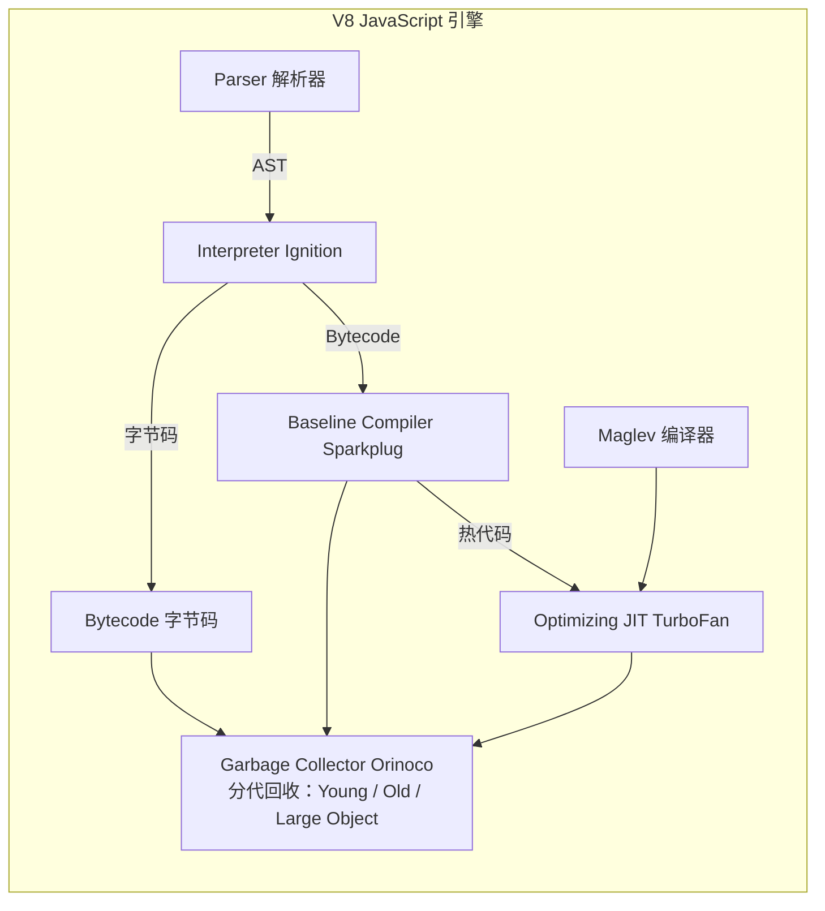
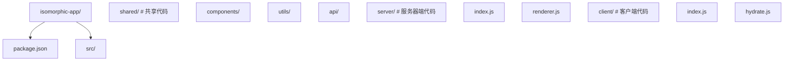

## 0.1 JavaScript 必会运行模型

### 代码从输入到执行的四个环节

| 环节 | 浏览器中发生什么 | Node.js 中发生什么 | 需要掌握的关键词 |
| --- | --- | --- | --- |
| 解析 | 读取 `<script>` 或模块文件 | 读取 `.js`、`.mjs`、包入口 | 词法环境、语法错误、模块解析 |
| 编译 | 引擎生成可执行表示 | V8 生成字节码并按热点优化 | JIT、隐藏类、内联缓存 |
| 执行 | 主线程运行同步代码 | 事件循环驱动任务执行 | 调用栈、作用域链、闭包 |
| 调度 | DOM 事件、定时器、网络回调进入队列 | 文件 IO、网络、定时器进入队列 | 宏任务、微任务、Promise |

### 第一阶段要背熟的内置对象与方法

| 对象 | 常用方法 | 解决的问题 | 易错点 |
| --- | --- | --- | --- |
| `String` | `slice`、`includes`、`replace`、`trim` | 文本截取、查找和清洗 | 字符串不可变，方法返回新字符串 |
| `Array` | `map`、`filter`、`reduce`、`find`、`some` | 列表转换、筛选、统计 | `map` 要返回值，`forEach` 不返回新数组 |
| `Object` | `keys`、`values`、`entries`、`assign` | 枚举和合并对象 | 浅拷贝不能复制嵌套对象 |
| `Promise` | `then`、`catch`、`finally`、`all`、`allSettled` | 表达异步结果 | `await` 只能等待 Promise 或 thenable |
| `JSON` | `parse`、`stringify` | 数据序列化 | 函数、`undefined`、循环引用不能直接序列化 |

### 最小调试练习

```js
const users = [
  { name: 'Ada', score: 96 },
  { name: 'Linus', score: 88 },
];

const excellent = users
  .filter((user) => user.score >= 90)
  .map((user) => user.name);

console.log(excellent);
```

在 DevTools 中给 `filter` 行打断点，观察每次回调的 `user` 值、返回值和最终数组。


# JavaScript 概述与运行环境


> 本节为增量补充，帮助零基础者安装到"企业正在用"的版本。

- ECMAScript：每年 6 月发布一个新版规范。第 17 版（ECMAScript 2026）已于 2026-06-30 批准，新增数学、迭代器、数组、Map、编码与 JSON 相关方法。
- Node.js：22.x 为当前 LTS（最新补丁 22.23.2），26.x 为 Current（26.5.1，2026-04 发布，预计 2026-10 转 LTS）。企业新项目优先用 LTS；2026-10 起 Node.js 改为一年一个大版本。
- 浏览器运行时：主流浏览器对 ES2024+ 的支持已基本一致；老项目需要兼容旧浏览器时，用 Vite 等构建工具自动降级即可。

## 1. 历史动机：一门十天诞生的语言

### 1.1 1995 年：十天的奇迹

1995 年，Netscape 公司意识到万维网需要一种"脚本语言"来让网页动起来。当时 34 岁的 **Brendan Eich** 被招募加入 Netscape，公司给他十天时间设计一门新语言。这门语言最初被命名为 Mocha，随后更名为 LiveScript，最终为了营销目的（搭乘 Sun Microsystems 的 Java 热潮）更名为 JavaScript。

值得注意的是，**JavaScript 与 Java 没有任何技术关系**。Brendan Eich 在设计时融合了多门语言的思想：

- **Scheme**：函数是一等公民、闭包、lambda 演算思想。
- **Self**：基于原型的对象模型（而非传统的类继承）。
- **Java**：语法风格（花括号、分号、关键字 `if`/`for`/`while`）。
- **Perl**：正则表达式与字符串处理。

这种"杂糅"的设计使 JavaScript 既有函数式编程的表达力，又有命令式编程的直观性，但也带来了一些长期争议的特性（如 `==` 隐式类型转换、变量提升）。

### 1.2 浏览器战争与标准化

1995 年 12 月，Netscape Navigator 2.0 首次发布 JavaScript 1.0。微软在 1996 年的 IE 3.0 中推出了反向工程的 JScript，导致了著名的"浏览器战争"。由于两家实现差异巨大，跨浏览器开发成为噩梦。

1996 年 11 月，Netscape 向 **ECMA（European Computer Manufacturers Association，欧洲计算机制造商协会）** 提交 JavaScript 标准化请求。1997 年 6 月，ECMA-262 第一版发布，**ECMAScript** 正式成为语言规范名称。注意：

- **JavaScript** 是 Netscape/Mozilla 的商标名（后转让给 Oracle）。
- **ECMAScript** 是规范名称，所有实现（JavaScript、JScript、ActionScript）都遵循该规范。

### 1.3 标准化时间线

| 年份 | 版本 | 关键特性 | 历史意义 |
| --- | --- | --- | --- |
| 1997 | ES1 | 基础语法、对象、函数 | 首次标准化 |
| 1998 | ES2 | 编辑修订，与 ISO 对齐 | 形式标准化 |
| 1999 | ES3 | 正则表达式、try/catch、异常处理 | 工业级语言雏形 |
| 2003 | ES4 | （废弃）类、模块、类型系统 | 过于激进被废弃 |
| 2009 | ES5 | 严格模式、JSON、`Object.create`、`Array.prototype.map/filter/reduce` | "复活"之作 |
| 2015 | ES6 / ES2015 | `let/const`、箭头函数、Promise、`class`、模块、解构 | 语言重生的里程碑 |
| 2016 | ES2016 | `**` 幂运算符、`Array.prototype.includes` | 年度发布制开启 |
| 2017 | ES2017 | `async/await`、`Object.entries/values` | 异步编程革命 |
| 2018 | ES2018 | 异步迭代、正则后瞻、对象展开 | 完善与修补 |
| 2019 | ES2019 | `flat/flatMap`、`Object.fromEntries` | 工程化改进 |
| 2020 | ES2020 | `?.` 可选链、`??` 空值合并、`BigInt` | 大型特性补完 |
| 2021 | ES2021 | 逻辑赋值、`replaceAll`、`Promise.any` | 实用工具补全 |
| 2022 | ES2022 | 类字段、私有方法、顶层 `await`、`at()` | 类系统完善 |
| 2023 | ES2023 | `findLast`、`findLastIndex`、`Symbol.metadata` | 数组与元数据增强 |
| 2024 | ES2024 | `Promise.withResolvers`、`Object.groupBy`、Unicode 15.1 | 集合操作增强 |

### 1.4 AJAX 革命与 Web 2.0

2005 年，Jesse James Garrett 提出 **AJAX（Asynchronous JavaScript and XML）** 概念，将 `XMLHttpRequest` 与 DOM 操作结合，使网页无需刷新即可与服务器交互。Google Maps、Gmail、Google Suggest 是 AJAX 的早期代表应用。

AJAX 之前，网页交互必须整页刷新，用户体验极差。AJAX 之后，"单页应用（SPA）"成为可能，催生了 jQuery（2006）、Prototype、MooTools 等库，最终演化为 React、Vue、Angular 等现代框架。

### 1.5 2009 年：Node.js 的诞生

2009 年 5 月，**Ryan Dahl** 在 JSConf 上发布 **Node.js**，将 Chrome V8 引擎从浏览器中剥离，使其能在服务器端运行。Node.js 的核心创新：

- **事件驱动 I/O**：基于 libuv，使用非阻塞 I/O 模型，单线程处理高并发。
- **CommonJS 模块系统**：`require/module.exports`，使 JavaScript 具备大型工程能力。
- **npm 生态**：Node Package Manager，截至 2024 年已成为全球最大的软件仓库（超过 300 万个包）。

Node.js 的诞生让 JavaScript 走出浏览器，成为全栈语言。一个开发者可以只用一种语言完成前后端开发，大幅降低了团队协作成本。

### 1.6 2015 年：ES6 重生

ES6（正式名 ES2015）是 JavaScript 历史上最重要的版本，历时近 6 年制定。它解决了 JavaScript 长期以来的诸多痛点：

- `var` 变量提升与函数作用域 → `let/const` 块级作用域。
- 回调地狱 → Promise。
- 原型链语法繁琐 → `class` 语法糖。
- 全局脚本 → ES Modules（`import/export`）。
- `arguments` 伪数组 → 剩余参数 `...args`。
- 字符串拼接 → 模板字符串 `` `Hello, ${name}` ``。

ES6 之后，TC39 改为**年度发布制**：每年 6 月发布一个版本，特性按成熟度逐个加入。这避免了 ES4 那样的"大爆炸式"失败。

### 1.7 现代：TypeScript、Deno、Bun 的崛起

**TypeScript（2012）**：微软的 Anders Hejlsberg（C#、Turbo Pascal 之父）设计的 JavaScript 超集，引入静态类型系统。TypeScript 不是替代 JavaScript，而是编译到 JavaScript。截至 2024 年，TypeScript 已成为前端工程的事实标准。

**Deno（2018）**：Ryan Dahl 对 Node.js 设计缺陷的反思之作。Deno 原生支持 TypeScript、默认安全沙箱（无文件/网络访问权限）、URL 导入、标准库内置。Deno 2.0 于 2024 年发布，重新兼容 npm 生态。

**Bun（2022）**：Jarred Sumner 创建的 Zig 语言实现的高性能运行时。Bun 集运行时、打包器、包管理器、测试运行器于一身，启动速度比 Node.js 快 4 倍，专注于极致性能。

### 1.8 为什么理解 JavaScript 运行环境至关重要

JavaScript 是一门"宿主语言"——语言本身只定义语法与核心对象（`Object`、`Array`、`Function`、`Promise`），实际能力由**运行环境（runtime）**提供：

- 浏览器提供 DOM、BOM、Fetch API、Web Storage、Canvas、WebSocket。
- Node.js 提供 fs、http、net、os、process、Buffer。
- Deno 提供标准库 `Deno.*` 命名空间。
- Bun 提供 `Bun.*` API 与 Node.js 兼容层。

同一段 JavaScript 代码在不同环境下行为可能截然不同。例如 `setTimeout` 在浏览器与 Node.js 中参数顺序不同；`globalThis` 在不同环境下指向不同对象；模块解析规则在 CommonJS 与 ESM 间存在差异。理解运行环境，是写出可移植、可维护代码的前提。

---

## 2. 形式化定义

### 2.1 JavaScript 语言的形式化组成

JavaScript 语言可形式化为三元组：

$$
\text{JavaScript} = (\text{Syntax}, \text{Semantics}, \text{Runtime})
$$

其中：

- $\text{Syntax}$：由 ECMAScript 规范定义的文法（Grammar），包括词法文法（Lexical Grammar）与句法文法（Syntactic Grammar）。
- $\text{Semantics}$：规范定义的执行语义（Execution Semantics），包括类型转换规则、`this` 绑定规则、作用域规则、原型链查找规则。
- $\text{Runtime}$：宿主环境提供的 API 集合（Web API、Node API 等），规范不定义这部分。

### 2.2 ECMAScript 规范的形式化结构

ECMAScript 规范文档（ECMA-262）由以下部分组成：

| 章节 | 内容 | 形式化工具 |
| --- | --- | --- |
| 5 | Notational Conventions | 上下文无关文法（CFG）、BNF 表示法 |
| 6-10 | Source Code, Lexical Grammar | 词法分析（Lexer）规则 |
| 11-16 | EcmaScript Data Types and Values | 类型系统、抽象操作（Abstract Operations） |
| 17-27 | Abstract Operations, Syntax-Directed Operations | 语义函数 |
| 28-33 | Executable Code, Execution Contexts | 执行栈、环境记录、Realm |
| 34-44 | Ordinary and Exotic Object Behaviors | 对象内部方法（Internal Slots） |
| 45-50 | Control Flow, Statements, Declarations | 语句语义 |
| 51-55 | ECMAScript Language: Functions and Classes | 函数与类语义 |
| 56-64 | Built-in Objects | 标准库 |
| 65-69 | Structuring Data, Memory Management | 结构化数据、GC |
| 70-74 | Host Environment Integration | 宿主集成 |

规范使用"抽象操作"（Abstract Operation）描述语义，例如 `ToString(x)`、`ToNumber(x)`、`ToObject(x)` 等转换规则，是 JavaScript 隐式类型转换的根源。

### 2.3 JavaScript 引擎架构

现代 JavaScript 引擎（以 V8 为例）的核心组件：



**讲解：**

1. 图中展示 V8 引擎把源码变为机器码的流水线：解析 → 字节码 → 优化编译。
2. 零基础只需要记住结论：现代引擎会“边跑边优化”热点代码。
3. 引擎细节属于进阶原理，初学可跳过。


形式化为五元组：

$$
\text{Engine} = (P, I, J, G, H)
$$

- $P$：Parser，将源代码解析为 AST（抽象语法树）。
- $I$：Interpreter（Ignition），将 AST 编译为字节码并执行。
- $J$：JIT Compiler（TurboFan/Maglev），将热点字节码编译为机器码。
- $G$：Garbage Collector（Orinoco），分代回收内存。
- $H$：Heap，堆内存管理。

### 2.4 运行环境（Runtime）的组成

运行环境为 JavaScript 提供宿主 API，可形式化为：

$$
\text{Runtime} = (E, A, L, C)
$$

- $E$：Engine，JavaScript 引擎本身（V8/SpiderMonkey/JSC）。
- $A$：API 集合，宿主提供的全局对象与函数。
- $L$：Event Loop，事件循环模型。
- $C$：Console，标准输入输出与诊断接口。

### 2.5 事件循环的形式化模型

JavaScript 的事件循环可形式化为：

$$
\text{EventLoop} = (M, T, R, S)
$$

- $M$：Macrotask Queue（宏任务队列），包含 `setTimeout`、`setInterval`、I/O、UI 事件。
- $T$：Microtask Queue（微任务队列），包含 `Promise.then`、`queueMicrotask`、`MutationObserver`。
- $R$：Render Steps（渲染步骤），仅浏览器环境，包括 `requestAnimationFrame`。
- $S$：调度规则，定义为：

$$
\text{Step} = \text{RunMacrotask} \to \text{DrainMicrotasks} \to \text{MaybeRender}
$$

每次循环：执行一个宏任务 → 清空所有微任务 → 可能渲染。这个规则是 JavaScript 异步编程的核心。

### 2.6 执行上下文与作用域

JavaScript 代码执行时维护一个**执行上下文栈（Execution Context Stack）**：

$$
\text{ECS} = [GlobalEC, FunctionEC_1, FunctionEC_2, \ldots]
$$

每个执行上下文包含：

- **LexicalEnvironment**（词法环境）：标识符绑定。
- **VariableEnvironment**（变量环境）：`var` 声明的变量。
- **ThisBinding**：`this` 的绑定值。

作用域链（Scope Chain）是词法环境的链表结构，用于标识符查找。

---

## 3. 理论推导

### 3.1 编译型 vs 解释型 vs JIT

**编译型语言**（C/C++/Rust/Go）：源代码 → 机器码 → 执行。启动慢，运行快。

**解释型语言**（传统 Python/Ruby）：源代码 → 字节码 → 解释执行。启动快，运行慢。

**JIT 编译型**（JavaScript/Java/C#）：源代码 → 字节码 → 解释执行，热点代码 → 机器码。启动快，热点代码运行快。

JavaScript 引擎的 JIT 编译核心思想：

1. **Profiler（分析器）**：记录函数调用次数、参数类型。
2. **Hotspot Detection（热点检测）**：调用次数超过阈值（如 1000 次）的函数标记为"热点"。
3. **Optimization（优化编译）**：将字节码编译为机器码，基于类型反馈（Type Feedback）进行特化（Specialization）。
4. **Deoptimization（反优化）**：若类型假设被破坏（如函数突然接收到新类型参数），回退到解释执行。

这种"乐观优化 + 反优化"机制使 JavaScript 性能接近原生代码。

### 3.2 Amdahl 定律在 JavaScript 中的应用

Amdahl 定律描述并行计算的加速上限：

$$
S = \frac{1}{(1 - p) + \frac{p}{n}}
$$

其中 $p$ 是可并行部分比例，$n$ 是处理器数量。

JavaScript 单线程执行意味着 $n = 1$，但通过 Web Worker、Node.js 的 `worker_threads`、Bun 的 `Bun.spawn`，可以突破单线程限制。然而 JavaScript 的"并行"受以下约束：

- 内存不能共享（SharedArrayBuffer 例外）。
- 消息传递有序列化开销。
- I/O 本身异步并发，不占主线程时间。

### 3.3 V8 的分代垃圾回收

V8 采用**分代回收算法（Generational GC）**：

**Young Generation（年轻代）**：
- 使用 Scavenge 算法（半空间复制）。
- 新对象分配在此。
- GC 频繁但耗时短（1-10ms）。
- 存活对象晋升到老年代。

**Old Generation（老年代）**：
- 使用 Mark-Sweep-Compact 算法。
- 长期存活对象。
- GC 不频繁但耗时长（10-100ms）。
- 可能触发"Stop-the-World"。

**Large Object Space（大对象空间）**：
- 大于 1MB 的对象直接分配。
- 不进行复制，只标记清除。

形式化的 GC 触发条件：

$$
\text{TriggerGC} \iff |Heap_{used}| > \text{Threshold}_{dynamic}
$$

V8 会根据历史 GC 频率动态调整阈值，平衡 GC 频率与内存使用。

### 3.4 模块系统的演进

**CommonJS（2009）**：

```javascript
// 同步加载，运行时求值
const fs = require('fs');
module.exports = { greet: () => 'hello' };
```

**讲解：**

1. `require` 是 CommonJS 的导入方式：执行到这一行时才加载模块。
2. 它是同步的：模块没加载完，后面的代码不会执行。
3. Node.js 历史遗留写法，新代码优先用 import。


**AMD（2009）**：

```javascript
// 异步加载，浏览器友好
define(['dep1', 'dep2'], function (dep1, dep2) {
  return { greet: () => 'hello' };
});
```

**讲解：**

1. `define` 是 AMD（如 RequireJS）的模块写法：依赖数组 + 回调。
2. 它解决了浏览器里“脚本加载顺序”的问题，属于前端模块化早期方案。
3. 现在已被 ES Module 取代，只在老项目里见到。


**UMD（2011）**：兼容 CommonJS 与 AMD 的通用模式。

**ES Modules（2015）**：

```javascript
// 静态分析，编译时求值
import fs from 'fs';
export const greet = () => 'hello';
```

**讲解：**

1. `import` 是 ES Module 标准写法，现代 JavaScript 的唯一推荐。
2. 它是静态的：import 必须写在顶层，构建工具在编译期就能分析依赖。
3. 浏览器与 Node.js 都支持，前端后端写法统一。


ES Modules 的核心优势：

- **静态结构**：可在编译时分析依赖，支持 Tree Shaking。
- **循环引用处理**：模块导出的是"实时绑定"（Live Binding），而非值的快照。
- **顶层 await**（ES2022）：模块顶层可使用 `await`。

### 3.5 Promise 与事件循环的关系

```javascript
console.log('1: script start');

setTimeout(() => console.log('5: setTimeout'), 0);

Promise.resolve().then(() => console.log('3: promise.then'));

console.log('2: script end');

// 输出顺序：
// 1: script start
// 2: script end
// 3: promise.then
// (渲染)
// 5: setTimeout
```

**讲解：**

1. 这段代码演示事件循环：同步代码先执行，Promise 回调进入微任务队列。
2. 打印顺序：script start → 同步后续 → 微任务 → 宏任务。
3. 先记住“同步优先、微任务先于宏任务”这条总规律。


执行顺序推导：

1. 主线程同步执行 → 1, 2。
2. 主线程结束，清空微任务队列 → 3。
3. 浏览器判断是否需要渲染。
4. 取出下一个宏任务（setTimeout 回调）→ 5。

这解释了为什么 `Promise.resolve().then` 比 `setTimeout(0)` 更快执行。

### 3.6 类型系统的形式化

JavaScript 类型系统可形式化为：

$$
T = \{\text{Undefined}, \text{Null}, \text{Boolean}, \text{Number}, \text{String}, \text{Symbol}, \text{BigInt}, \text{Object}\}
$$

前 7 种为**原始类型（Primitive）**，`Object` 为**引用类型（Reference）**。

**原始类型**：值传递，不可变，存储在栈中（部分情况下）。

**引用类型**：引用传递，可变，存储在堆中。

`typeof` 运算符的形式化：

$$
\text{typeof}(x) = \begin{cases}
\text{`undefined'} & x \text{ is Undefined} \\
\text{`boolean'} & x \text{ is Boolean} \\
\text{`number'} & x \text{ is Number} \\
\text{`string'} & x \text{ is String} \\
\text{`symbol'} & x \text{ is Symbol} \\
\text{`bigint'} & x \text{ is BigInt} \\
\text{`object'} & x \text{ is Null or non-callable Object} \\
\text{`function'} & x \text{ is Callable Object}
\end{cases}
$$

注意 `typeof null === 'object'` 是历史遗留 bug（源于早期实现的位标记）。

### 3.7 作用域链的查找算法

标识符查找的形式化算法：

```
function Lookup(name, scope):
    while scope ≠ null:
        if scope.has(name):
            return scope.get(name)
        scope = scope.parent
    throw ReferenceError
```

**讲解：**

1. 这是作用域查找的伪代码：从当前作用域逐层向外找变量。
2. `while scope ≠ null` 表示沿着作用域链向上，直到全局或找不到报错。
3. 理解这条链，闭包与变量提升就成功了一半。


时间复杂度 $O(d)$，其中 $d$ 是作用域深度。深层嵌套作用域会带来查找开销，因此现代引擎使用**变量隐藏（Variable Hiding）**优化：编译时确定变量位置，直接访问而不需要链式查找。

---

## 4. 代码示例

### 4.1 浏览器环境：内联脚本

```html
<!DOCTYPE html>
<html lang="zh-CN">
  <head>
    <meta charset="UTF-8" />
    <meta name="viewport" content="width=device-width, initial-scale=1.0" />
    <title>JavaScript 示例</title>
  </head>
  <body>
    <h1>Hello, JavaScript!</h1>
    <button id="greetBtn">点击问候</button>
    <div id="message"></div>
    <script>
      // 内联脚本：DOM 操作是浏览器专属能力
      document.getElementById('greetBtn').addEventListener('click', function () {
        const name = prompt('请输入您的名字：');
        document.getElementById('message').textContent = `Hello, ${name}!`;
      });
    </script>
  </body>
</html>
```

**讲解：**

1. 这是经典的内联 JavaScript 写法：`<script>` 放在 body 末尾。
2. 放在末尾是因为脚本执行会阻塞解析，晚放让页面先渲染。
3. 现代写法用 `<script type="module">` 或 defer，见后文。


### 4.2 浏览器环境：外部 ESM 模块

```html
<!DOCTYPE html>
<html lang="zh-CN">
  <head>
    <meta charset="UTF-8" />
    <title>ES Modules 示例</title>
  </head>
  <body>
    <script type="module">
      // ESM 模块自动启用严格模式，无需 'use strict'
      import { greet } from './utils.js';

      console.log(greet('World'));
    </script>
  </body>
</html>
```

**讲解：**

1. 与上一块对比：加了 `defer` 属性，脚本延后到文档解析完成后执行。
2. defer 保证执行顺序按书写顺序，且不阻塞渲染。
3. 外部脚本建议统一加 defer。


```javascript
// utils.js
export function greet(name) {
  return `Hello, ${name}!`;
}
```

**讲解：**

1. `export` 把函数导出，其他文件用 `import { greet }` 引入。
2. 这是 ES Module 的标准组织方式。
3. 一个模块只做一件事，通过导出对外提供能力。


### 4.3 Node.js 环境：基础脚本

```javascript
// hello.js - Node.js 环境示例
// Node.js 提供 process、require、__dirname 等全局对象

// 输出到 stdout
console.log('Hello, World!');

// 定义函数
function greet(name) {
  return `Hello, ${name}!`;
}

// 调用函数
console.log(greet('Node.js'));

// 使用 ES6+ 特性
const names = ['Alice', 'Bob', 'Charlie'];
names.forEach((name) => {
  console.log(greet(name));
});

// 访问环境变量（Node.js 专属）
console.log('Node.js 版本:', process.version);
console.log('操作系统:', process.platform);
console.log('当前目录:', process.cwd());

// 使用 Node.js 内置模块（CommonJS）
const os = require('os');
console.log('CPU 核心数:', os.cpus().length);
console.log('空闲内存:', os.freemem() / 1024 / 1024 / 1024, 'GB');
```

**讲解：**

1. Node.js 环境提供 `process`、`require`、`__dirname` 等全局对象。
2. `console.log(process.version)` 打印 Node 版本号。
3. 浏览器没有这些对象，跨环境代码要检测环境。


运行脚本：

```bash
node hello.js
```

**讲解：**

1. `node hello.js` 在终端运行脚本，输出 hello 文本。
2. 这是验证 Node 安装与运行脚本的最基本命令。
3. 报错时先检查文件名路径与拼写。


### 4.4 Node.js 环境：ESM 模块

```javascript
// package.json
// {
//   "type": "module"
// }

// 或者使用 .mjs 扩展名
// hello.mjs

import os from 'node:os';
import { greet } from './utils.js';

console.log(greet('ESM'));
console.log('CPU:', os.cpus().length);
```

**讲解：**

1. package.json 是 Node 项目的清单：记录名字、版本、脚本与依赖。
2. `npm init -y` 可快速生成。
3. 项目根目录必须有它，npm/pnpm 才能管理依赖。


### 4.5 Node.js 环境：HTTP 服务器

```javascript
// server.js - Node.js 内置 HTTP 服务器
import http from 'node:http';

const server = http.createServer((req, res) => {
  res.writeHead(200, { 'Content-Type': 'application/json' });
  res.end(
    JSON.stringify({
      method: req.method,
      url: req.url,
      timestamp: new Date().toISOString(),
      headers: req.headers,
    })
  );
});

server.listen(3000, () => {
  console.log('服务器运行在 http://localhost:3000');
});
```

**讲解：**

1. `node:http` 是 Node 内置模块：`createServer` 创建 HTTP 服务。
2. `res.end('你好')` 向浏览器返回文本响应。
3. `listen(3000)` 监听端口，浏览器访问 localhost:3000 查看。


### 4.6 Deno 环境

```typescript
// deno.ts - Deno 原生支持 TypeScript
// Deno 默认无文件/网络权限，需显式授权
// 运行: deno run --allow-net --allow-read deno.ts

// 使用标准库
import { serve } from 'https://deno.land/std/http/server.ts';

const handler = (req: Request): Response => {
  const url = new URL(req.url);
  return new Response(`Hello from Deno! Path: ${url.pathname}`, {
    headers: { 'content-type': 'text/plain' },
  });
};

console.log('Deno 服务器运行在 http://localhost:8000');
await serve(handler, { port: 8000 });
```

**讲解：**

1. Deno 直接运行 TypeScript，不需要先编译。
2. 默认无权限：读写文件、访问网络需要显式 `--allow-*` 授权。
3. 这是 Deno 与 Node 的核心差异。


### 4.7 Bun 环境

```typescript
// bun.ts - Bun 内置 TypeScript 与 JSX 支持
// 运行: bun bun.ts

// Bun 内置 HTTP 服务器，性能接近原生
const server = Bun.serve({
  port: 3000,
  fetch(req) {
    const url = new URL(req.url);
    return new Response(`Hello from Bun! Path: ${url.pathname}`);
  },
});

console.log(`Bun 服务器运行在 http://localhost:${server.port}`);

// Bun 文件读取 API
const file = Bun.file('./package.json');
const text = await file.text();
console.log('package.json 内容:', text);
```

**讲解：**

1. Bun 同样原生运行 TypeScript 与 JSX。
2. 它还内置包管理、测试与打包，一个命令全家桶。
3. 用 `bun bun.ts` 直接运行。


### 4.8 Web Worker

```javascript
// main.js - 主线程
const worker = new Worker('./worker.js');

worker.postMessage({ task: 'compute', data: [1, 2, 3, 4, 5] });

worker.onmessage = (event) => {
  console.log('Worker 返回结果:', event.data);
};

worker.onerror = (error) => {
  console.error('Worker 错误:', error);
};
```

**讲解：**

1. `new Worker('./worker.js')` 创建 Worker 子线程。
2. 主线程通过 `postMessage` 发消息，`onmessage` 收结果。
3. 适合图片处理、大数据计算等重任务，避免卡住页面。


```javascript
// worker.js - Worker 线程
// Worker 中没有 DOM，但有 fetch、IndexedDB、WebSocket
self.onmessage = (event) => {
  const { task, data } = event.data;
  if (task === 'compute') {
    const result = data.reduce((sum, n) => sum + n * n, 0);
    self.postMessage({ result });
  }
};
```

**讲解：**

1. Worker 线程没有 DOM，但能用 fetch、IndexedDB、WebSocket。
2. Worker 与主线程通过消息通信，不能直接共享变量。
3. 计算结果用 `postMessage` 回传。


### 4.9 环境检测

```javascript
// 检测当前运行环境
const runtime = {
  isBrowser: typeof window !== 'undefined',
  isNode: typeof process !== 'undefined' && process.versions?.node,
  isDeno: typeof Deno !== 'undefined',
  isBun: typeof Bun !== 'undefined',
  isWebWorker: typeof self !== 'undefined' && typeof importScripts === 'function',
};

console.log('当前运行环境:', runtime);

// 标准化环境检测（推荐）
function detectRuntime() {
  if (typeof globalThis === 'undefined') return 'unknown';

  // 优先级：Deno > Bun > Node > Browser
  if (typeof Deno !== 'undefined') return 'deno';
  if (typeof Bun !== 'undefined') return 'bun';
  if (typeof process !== 'undefined' && process.versions?.node) return 'node';
  if (typeof window !== 'undefined') return 'browser';
  if (typeof self !== 'undefined' && typeof importScripts === 'function') return 'worker';

  return 'unknown';
}

console.log('检测到环境:', detectRuntime());

// 获取全局对象的统一方式
const globalObj =
  typeof globalThis !== 'undefined'
    ? globalThis
    : typeof window !== 'undefined'
      ? window
      : typeof global !== 'undefined'
        ? global
        : typeof self !== 'undefined'
          ? self
          : null;
```

**讲解：**

1. `typeof window !== 'undefined'` 判断是否浏览器环境。
2. `typeof process !== 'undefined'` 判断是否 Node.js。
3. 同构代码（前后端共用）用这种检测分发不同实现。


### 4.10 跨环境读写文件

```javascript
// 读取 JSON 文件的跨环境实现
async function readJson(path) {
  // 浏览器：使用 fetch
  if (typeof fetch !== 'undefined' && typeof window !== 'undefined') {
    const res = await fetch(path);
    return res.json();
  }

  // Node.js / Bun
  if (typeof require === 'function' || typeof Bun !== 'undefined') {
    const fs = await import('node:fs/promises');
    const content = await fs.readFile(path, 'utf8');
    return JSON.parse(content);
  }

  // Deno
  if (typeof Deno !== 'undefined') {
    const content = await Deno.readTextFile(path);
    return JSON.parse(content);
  }

  throw new Error('Unsupported runtime');
}
```

**讲解：**

1. 浏览器里用 `fetch` 读 JSON：`await fetch(path)` 然后 `res.json()`。
2. Node 里用 `fs/promises` 的 `readFile` 读取。
3. 同一函数内按环境分支，保证两处都能跑。


### 4.11 包管理器对比

```bash
# npm - Node.js 内置
npm init -y
npm install express
npm install --save-dev typescript
npm run dev
npm update
npm audit fix

# yarn - Facebook 出品
yarn init -y
yarn add express
yarn add --dev typescript
yarn dev
yarn upgrade

# pnpm - 节省磁盘空间，使用硬链接
pnpm init
pnpm add express
pnpm add -D typescript
pnpm dev
pnpm update

# Bun - 内置包管理器，极快
bun init
bun add express
bun add -d typescript
bun run dev
bun update
```

**讲解：**

1. `npm init -y` 快速生成 package.json。
2. `npm install 包名` 安装依赖并写入 dependencies。
3. npm 随 Node 一起安装，是最基础的包管理器。


### 4.12 使用 nvm 管理多版本 Node.js

```bash
# 安装 nvm（Node Version Manager）
# macOS/Linux: curl -o- https://raw.githubusercontent.com/nvm-sh/nvm/v0.39.7/install.sh | bash
# Windows: 使用 nvm-windows 或 fnm

# 安装 LTS 版本
nvm install --lts

# 安装最新版本
nvm install node

# 切换版本
nvm use 20
nvm use 22

# 设置默认版本
nvm alias default 22

# 查看已安装版本
nvm ls

# 在项目根目录创建 .nvmrc 文件
echo "22" > .nvmrc
nvm use  # 自动读取 .nvmrc
```

**讲解：**

1. nvm 用于管理多个 Node 版本：`nvm install 22` 安装，`nvm use 22` 切换。
2. 多项目需要不同 Node 版本时必备。
3. Windows 用户可用 nvm-windows 或官方安装包。


---

## 5. 对比分析

### 5.1 浏览器 vs Node.js vs Deno vs Bun

| 维度 | 浏览器 | Node.js | Deno | Bun |
| --- | --- | --- | --- | --- |
| 首次发布 | 1995 | 2009 | 2018 | 2022 |
| 引擎 | V8 / SpiderMonkey / JSC | V8 | V8 | JavaScriptCore |
| 模块系统 | ESM | CommonJS + ESM | ESM | ESM + CommonJS |
| TypeScript 支持 | 需构建工具 | 需构建工具 | 原生支持 | 原生支持 |
| 安全模型 | 同源策略 | 默认全权限 | 默认沙箱 | 默认全权限 |
| 包管理 | CDN / npm via bundler | npm / yarn / pnpm | URL 导入 + npm | bun install |
| 文件系统 | 无（File System Access API 例外） | 完整支持 | 显式授权 | 完整支持 |
| 网络 | Fetch / WebSocket | http / net | fetch / Deno.* | fetch / Bun.* |
| 测试框架 | 需第三方 | 需第三方 | 内置 | 内置 |
| 启动速度 | 快 | 中 | 中 | 极快 |
| 生态成熟度 | 极高 | 极高 | 成长中 | 成长中 |
| 适用场景 | Web 应用 | 服务器 / CLI / 工具链 | 现代 Web 服务器 | 全栈 / 高性能 |

### 5.2 JavaScript 引擎对比

| 引擎 | 开发者 | 首次发布 | 代表环境 | 特点 |
| --- | --- | --- | --- | --- |
| V8 | Google | 2008 | Chrome / Node.js / Deno | JIT 性能最优，社区最活跃 |
| SpiderMonkey | Mozilla | 1996 | Firefox | 首个 JavaScript 引擎 |
| JavaScriptCore (Nitro) | Apple | 2008 | Safari / React Native | iOS 性能优化好 |
| Chakra | Microsoft | 2011 | 旧版 Edge | 已退役 |
| Hermes | Meta | 2019 | React Native | 移动端优化，预编译字节码 |
| QuickJS | Bellard | 2017 | 嵌入式 / 边缘计算 | 极小体积，可移植 |
| JavaScriptCore (Bun) | Apple | 2008 | Bun | 性能优于 V8（部分场景） |

### 5.3 CommonJS vs ESM

| 特性 | CommonJS | ESM |
| --- | --- | --- |
| 加载方式 | 同步、运行时 | 异步、编译时 |
| 是否支持动态导入 | 是（`require`） | 是（`import()`） |
| 静态分析 | 不支持 | 支持（Tree Shaking） |
| 顶层 await | 不支持 | 支持（ES2022） |
| 循环引用 | 值快照，可能 undefined | 实时绑定，安全 |
| `this` 顶层指向 | `module.exports` | `undefined` |
| `__dirname` / `__filename` | 内置 | 不内置（需 `import.meta.url`） |
| Node.js 支持 | 完全 | 完全（13.2+） |
| 浏览器支持 | 不支持 | 完全 |

### 5.4 包管理器对比

| 包管理器 | 速度 | 磁盘占用 | 单仓库支持 | 安全性 | 推荐场景 |
| --- | --- | --- | --- | --- | --- |
| npm | 中 | 高 | 不支持（需 lerna） | 中 | 通用 |
| yarn (classic) | 中 | 高 | 支持 | 中 | 团队协作 |
| yarn (berry) | 快 | 低 | 支持 | 高（Zero Install） | 大型 monorepo |
| pnpm | 极快 | 极低（硬链接） | 原生支持 | 高 | 大型项目 |
| Bun | 极快 | 中 | 支持 | 中 | Bun 项目 |

### 5.5 编译型 vs JIT vs 解释型性能对比

| 语言 | 启动时间 | 运行速度 | 内存占用 | 开发效率 | 典型代表 |
| --- | --- | --- | --- | --- | --- |
| AOT 编译 | 慢 | 极快 | 低 | 中 | C / C++ / Rust / Go |
| JIT 编译 | 快 | 快 | 高 | 高 | JavaScript / Java / C# |
| 解释执行 | 极快 | 慢 | 低 | 极高 | Python / Ruby（传统） |
| Wasm | 快 | 接近 AOT | 低 | 中 | Rust → Wasm |

JavaScript 的 JIT 编译在现代硬件上已能达到原生代码性能的 70-90%，对于 Web 应用足够使用。

---

## 6. 常见陷阱

### 6.1 全局变量污染

```javascript
// 反模式：隐式全局变量
function badExample() {
  leakedVar = 42; // 没有用 let/const/var 声明，自动成为全局变量
}
badExample();
console.log(window.leakedVar); // 42（浏览器）/ global.leakedVar（Node.js）

// 正确做法
function goodExample() {
  'use strict';
  const local = 42; // 显式声明
}
```

**讲解：**

1. 不给 `let/const/var` 直接赋值会创建隐式全局变量。
2. 函数内部的 `x = 1` 会污染全局，极难排查。
3. 严格模式（'use strict'）下这种写法直接报错，建议默认开启。


**根因**：非严格模式下，未声明变量自动挂到全局对象。**防御**：始终使用 `'use strict'` 或 ESM（默认严格模式）。

### 6.2 `var` 的变量提升与函数作用域

```javascript
// 陷阱：变量提升
console.log(x); // undefined（不是 ReferenceError）
var x = 5;

// 等价于
var x; // 提升到顶部
console.log(x); // undefined
x = 5;

// 陷阱：函数作用域
for (var i = 0; i < 3; i++) {
  setTimeout(() => console.log(i), 100);
}
// 输出: 3, 3, 3（i 是函数作用域，循环结束后 i = 3）

// 正确做法：使用 let（块级作用域）
for (let i = 0; i < 3; i++) {
  setTimeout(() => console.log(i), 100);
}
// 输出: 0, 1, 2
```

**讲解：**

1. `var` 声明会提升：console.log 时 x 已存在但未赋值，所以是 undefined。
2. `let/const` 也有提升但处于“暂时性死区”，提前访问会报错。
3. 结论：新代码一律用 let/const，避免这类困惑。


### 6.3 `this` 绑定丢失

```javascript
// 陷阱：回调中 this 丢失
const obj = {
  name: 'Alice',
  greet: function () {
    console.log(this.name);
  },
};

const fn = obj.greet;
fn(); // undefined（this 不再指向 obj）

// 解决方案 1：bind
const bound = obj.greet.bind(obj);
bound(); // 'Alice'

// 解决方案 2：箭头函数（继承外层 this）
const obj2 = {
  name: 'Bob',
  greet: function () {
    const inner = () => console.log(this.name);
    inner();
  },
};
obj2.greet(); // 'Bob'

// 解决方案 3：保存引用
const obj3 = {
  name: 'Charlie',
  greet: function () {
    const self = this;
    setTimeout(function () {
      console.log(self.name);
    }, 100);
  },
};
```

**讲解：**

1. 普通函数里的 this 由调用方式决定，回调里 this 会丢失为 undefined/全局。
2. 解决方案：箭头函数（继承外层 this）或 `fn.bind(obj)`。
3. 这是 JavaScript 高频面试与高频 bug 的同一道题。


### 6.4 `==` 与 `===` 的陷阱

```javascript
// == 会进行隐式类型转换
0 == false; // true
'' == false; // true
null == undefined; // true
'0' == 0; // true
[] == false; // true
[] == ![]; // true（经典陷阱）

// === 严格相等，不转换类型
0 === false; // false
'' === false; // false
null === undefined; // false
'0' === 0; // false

// 最佳实践：始终使用 ===，除非需要判断 null/undefined
if (value == null) {
  // 等价于 value === null || value === undefined
}
```

**讲解：**

1. `==` 会先做类型转换再比较，`0 == false` 为 true，违背直觉。
2. `===` 要求类型与值都相等，`0 === false` 为 false。
3. 规则：永远用 `===` 与 `!==`，除非你明确需要隐式转换。


### 6.5 异步陷阱：回调地狱

```javascript
// 反模式：回调地狱
getUser(userId, function (err, user) {
  if (err) return console.error(err);
  getOrders(user.id, function (err, orders) {
    if (err) return console.error(err);
    getOrderDetail(orders[0].id, function (err, detail) {
      if (err) return console.error(err);
      console.log(detail);
    });
  });
});

// Promise 链
getUser(userId)
  .then((user) => getOrders(user.id))
  .then((orders) => getOrderDetail(orders[0].id))
  .then((detail) => console.log(detail))
  .catch((err) => console.error(err));

// async/await（推荐）
async function main() {
  try {
    const user = await getUser(userId);
    const orders = await getOrders(user.id);
    const detail = await getOrderDetail(orders[0].id);
    console.log(detail);
  } catch (err) {
    console.error(err);
  }
}
```

**讲解：**

1. 多层嵌套回调形成“回调地狱”：缩进越来越深，错误处理混乱。
2. 解决方案是 Promise 链与 async/await。
3. 看到三层以上嵌套，就该重构了。


### 6.6 模块系统混淆

```javascript
// 陷阱：CommonJS 与 ESM 混用
// 以下代码在 package.json 配置 "type": "module" 时报错

// foo.cjs (CommonJS)
module.exports = { greet: () => 'hello' };

// bar.mjs (ESM)
import { greet } from './foo.cjs'; // 报错：需要 default import

// 正确做法
import pkg from './foo.cjs';
pkg.greet();

// 或者
import { greet } from './foo.cjs'; // Node.js 22+ 支持（实验性）
```

**讲解：**

1. package.json 的 `type: module` 决定 .js 文件按 ESM 解析。
2. ESM 文件里不能用 `require`，CommonJS 文件里不能用顶层 `import`。
3. 混用时报错先检查 type 字段与文件后缀（.cjs/.mjs）。


### 6.7 跨环境 API 差异

```javascript
// 陷阱：setTimeout 参数顺序
// 浏览器：setTimeout(callback, delay, arg1, arg2)
// Node.js：setTimeout(callback, delay, ...args)

// 浏览器与 Node.js 都支持
setTimeout((a, b) => console.log(a, b), 100, 'x', 'y'); // 输出 'x y'

// 但 IE 不支持额外参数（已废弃）

// 陷阱：globalThis 在不同环境的指向
console.log(globalThis); // 浏览器: window / Node.js: global / Deno: Window
```

**讲解：**

1. `setTimeout(callback, delay, ...args)` 第三个参数起是传给回调的参数。
2. 常见错误是把参数放在 delay 前面或忘记传。
3. 参数顺序：回调、延迟毫秒、剩余参数。


### 6.8 浮点数精度问题

```javascript
// JavaScript 使用 IEEE 754 双精度浮点数
0.1 + 0.2; // 0.30000000000000004
0.1 + 0.2 === 0.3; // false

// 大整数精度丢失
9007199254740992 + 1 === 9007199254740993; // true（超出安全整数范围）
Number.MAX_SAFE_INTEGER; // 9007199254740991

// 解决方案：BigInt（ES2020）
9007199254740992n + 1n === 9007199254740993n; // true
```

**讲解：**

1. 二进制无法精确表示 0.1，所以 `0.1 + 0.2` 有浮点误差。
2. 金额计算用整数分（或 decimal 库），不要直接比较浮点。
3. 比较时用 `Math.abs(a - b) < 1e-9` 或 `Number.EPSILON`。


### 6.9 闭包内存泄漏

```javascript
// 反模式：闭包持有大对象
function createLeak() {
  const huge = new Array(1e6).fill('*');
  return function () {
    console.log('do something');
    // huge 被闭包持有，无法 GC
  };
}

const leak = createLeak();
// 即使 huge 未被使用，仍占用内存

// 解决方案：显式释放
function createSafe() {
  let huge = new Array(1e6).fill('*');
  return function () {
    console.log('do something');
    huge = null; // 显式释放
  };
}
```

**讲解：**

1. 闭包会一直持有外部变量，若持有大对象且长期不释放，造成内存泄漏。
2. 对策：用后置 null、减少长生命周期闭包。
3. 排查用 Chrome DevTools 的 Memory 面板。


### 6.10 Promise 未捕获异常

```javascript
// 陷阱：Promise 链未 catch，异常被吞没
Promise.resolve().then(() => {
  throw new Error('未捕获');
});
// 浏览器控制台会有警告，但程序继续运行

// Node.js 中：进程退出（取决于版本）
process.on('unhandledRejection', (err) => {
  console.error('未处理的 Promise 异常:', err);
});

// 正确做法：始终 catch
Promise.resolve()
  .then(() => {
    throw new Error('正确处理');
  })
  .catch((err) => console.error(err));
```

**讲解：**

1. Promise 链末尾不加 `.catch`，异常会成为“未处理拒绝”。
2. 现代 Node 会打印警告甚至退出进程。
3. 每条 Promise 链都要有兜底 catch。


### 6.11 `this` 在事件回调中丢失

```javascript
// 反模式：DOM 事件回调中 this 不是预期对象
class Counter {
  constructor() {
    this.count = 0;
    document.getElementById('btn').addEventListener('click', this.increment);
  }

  increment() {
    // this 指向 button 元素，不是 Counter 实例
    this.count++; // 不会修改 counter.count
    console.log(this); // <button>
  }
}

// 解决方案 1：箭头函数
class Counter {
  constructor() {
    this.count = 0;
    document.getElementById('btn').addEventListener('click', () => {
      this.increment();
    });
  }

  increment() {
    this.count++;
    console.log(this.count);
  }
}

// 解决方案 2：bind
document.getElementById('btn').addEventListener('click', this.increment.bind(this));
```

**讲解：**

1. 类方法作为事件回调时，this 不再指向实例。
2. 解法：箭头函数属性或构造器里 `this.handler = this.handler.bind(this)`。
3. 与前面“回调 this 丢失”是同一问题的类场景。


### 6.12 顶层 await 在 CommonJS 中报错

```javascript
// CommonJS 模块（.cjs 或 package.json 无 type:module）
// await fetch(...);  // SyntaxError: await is only valid in async functions

// 解决方案 1：使用 ESM（.mjs 或 package.json: type:module）
// 顶层 await 在 ESM 中是合法的（ES2022）

// 解决方案 2：包装到 async 函数
(async () => {
  await fetch(...);
})();

// 解决方案 3：使用 IIFE
(async function () {
  await fetch(...);
})();
```

**讲解：**

1. CommonJS 文件顶层不能使用 `await`，这是模块系统差异。
2. 想用顶层 await，文件必须按 ESM 解析（.mjs 或 type: module）。
3. 报错时先确认模块系统再找语法问题。


---

## 7. 工程实践

### 7.1 项目初始化最佳实践

```bash
# 创建项目目录
mkdir my-js-project && cd my-js-project

# 初始化 package.json（推荐使用 ESM）
npm init -y
# 然后修改 package.json:
# {
#   "name": "my-js-project",
#   "version": "1.0.0",
#   "type": "module",
#   "main": "index.js",
#   "scripts": {
#     "start": "node index.js",
#     "dev": "node --watch index.js",
#     "test": "node --test"
#   },
#   "engines": {
#     "node": ">=20"
#   }
# }

# 创建目录结构
mkdir src test docs
touch src/index.js src/utils.js test/index.test.js .gitignore README.md

# .gitignore 内容
cat > .gitignore << 'EOF'
node_modules/
.env
.env.local
*.log
.DS_Store
dist/
build/
coverage/
.vscode/
EOF

# 创建 .nvmrc 指定 Node.js 版本
echo "22" > .nvmrc

# 创建 .editorconfig 统一编辑器配置
cat > .editorconfig << 'EOF'
root = true

[*]
charset = utf-8
end_of_line = lf
indent_style = space
indent_size = 2
insert_final_newline = true
trim_trailing_whitespace = true

[*.md]
trim_trailing_whitespace = false
EOF
```

**讲解：**

1. 创建并进入项目目录，开始初始化。
2. 之后执行 `npm init -y` 生成 package.json。
3. 目录名建议小写短横线风格。


### 7.2 ESLint 配置

```javascript
// eslint.config.js - ESLint 9+ Flat Config
import js from '@eslint/js';
import prettier from 'eslint-config-prettier';

export default [
  js.configs.recommended,
  prettier,
  {
    rules: {
      'no-unused-vars': ['error', { argsIgnorePattern: '^_' }],
      'no-console': ['warn', { allow: ['warn', 'error'] }],
      'prefer-const': 'error',
      'no-var': 'error',
      eqeqeq: ['error', 'always'],
    },
  },
  {
    ignores: ['node_modules/', 'dist/', 'build/'],
  },
];
```

**讲解：**

1. ESLint 9+ 使用 Flat Config：数组导出配置，取代旧版 .eslintrc。
2. `js.configs.recommended` 是推荐规则集。
3. 配置里可覆盖 rules 调整具体规则。


### 7.3 Prettier 配置

```javascript
// .prettierrc.js
export default {
  semi: true,
  singleQuote: true,
  trailingComma: 'all',
  printWidth: 100,
  tabWidth: 2,
  arrowParens: 'always',
  endOfLine: 'lf',
};
```

**讲解：**

1. Prettier 统一代码格式：单引号、分号、缩进等偏好。
2. 与 ESLint 分工：Prettier 管格式，ESLint 管质量。
3. 团队统一配置后，格式争议消失。


### 7.4 package.json 脚本配置

```json
{
  "name": "my-js-project",
  "version": "1.0.0",
  "type": "module",
  "engines": {
    "node": ">=20"
  },
  "scripts": {
    "start": "node src/index.js",
    "dev": "node --watch src/index.js",
    "build": "esbuild src/index.js --bundle --platform=node --outfile=dist/index.js",
    "test": "node --test",
    "test:watch": "node --test --watch",
    "test:coverage": "node --test --experimental-test-coverage",
    "lint": "eslint .",
    "lint:fix": "eslint . --fix",
    "format": "prettier --write .",
    "format:check": "prettier --check .",
    "typecheck": "tsc --noEmit",
    "precommit": "npm run format && npm run lint && npm run test",
    "prepare": "husky install"
  }
}
```

**讲解：**

1. 这是完整 package.json 示例：name、version、scripts、dependencies。
2. `"dev": "node --watch index.js"` 用 Node 内置监听模式开发。
3. 依赖锁文件（package-lock.json）提交 git 保证可复现。


### 7.5 调试技巧

```javascript
// 使用 console 的各种方法
console.log('普通日志');
console.info('信息');
console.warn('警告');
console.error('错误');
console.table([
  { name: 'Alice', age: 30 },
  { name: 'Bob', age: 25 },
]);
console.group('分组');
console.log('分组内');
console.groupEnd();
console.time('计时');
// ... 执行代码
console.timeEnd('计时'); // 输出: 计时: 123.45ms

// 使用 debugger 语句
function complexLogic(x) {
  debugger; // 浏览器 DevTools 或 VS Code 会在此暂停
  return x * 2;
}

// 使用 util.inspect（Node.js）
import util from 'node:util';
const obj = { a: 1, b: { c: 2 } };
console.log(util.inspect(obj, { depth: null, colors: true }));

// 使用 performance API 测量
performance.mark('start');
// ... 执行代码
performance.mark('end');
performance.measure('duration', 'start', 'end');
const measures = performance.getEntriesByName('duration');
console.log(`耗时: ${measures[0].duration}ms`);
```

**讲解：**

1. `console.log` 普通日志、`warn` 警告、`error` 错误、`table` 表格化。
2. `console.time/timeEnd` 测量耗时。
3. 生产环境记得控制日志量，避免性能问题。


### 7.6 性能优化技巧

```javascript
// 1. 避免频繁 DOM 操作
// 反模式
for (let i = 0; i < 1000; i++) {
  document.body.innerHTML += `<div>${i}</div>`; // 每次触发重排
}

// 优化：使用 DocumentFragment
const fragment = document.createDocumentFragment();
for (let i = 0; i < 1000; i++) {
  const div = document.createElement('div');
  div.textContent = i;
  fragment.appendChild(div);
}
document.body.appendChild(fragment); // 只触发一次重排

// 2. 使用事件委托
// 反模式：为每个 li 添加监听器
document.querySelectorAll('li').forEach((li) => {
  li.addEventListener('click', handler);
});

// 优化：使用事件委托
document.querySelector('ul').addEventListener('click', (e) => {
  if (e.target.tagName === 'LI') {
    handler(e);
  }
});

// 3. 防抖与节流
function debounce(fn, delay) {
  let timer;
  return (...args) => {
    clearTimeout(timer);
    timer = setTimeout(() => fn(...args), delay);
  };
}

function throttle(fn, interval) {
  let lastTime = 0;
  return (...args) => {
    const now = Date.now();
    if (now - lastTime >= interval) {
      fn(...args);
      lastTime = now;
    }
  };
}

// 4. 使用 requestAnimationFrame 优化动画
function animate() {
  // 更新动画状态
  element.style.transform = `translateX(${pos}px)`;
  pos += 1;
  if (pos < 500) {
    requestAnimationFrame(animate);
  }
}
requestAnimationFrame(animate);

// 5. 使用 Web Worker 处理 CPU 密集任务
const worker = new Worker('./heavy-task.js');
worker.postMessage({ data: largeArray });
worker.onmessage = (e) => {
  console.log('处理完成:', e.data);
};
```

**讲解：**

1. 反模式：循环里逐次修改 DOM，触发大量重排。
2. 正解：先在内存里拼好片段（DocumentFragment），一次性插入。
3. DOM 操作是性能瓶颈大户，批量操作是首要原则。


### 7.7 安全最佳实践

```javascript
// 1. 防止 XSS（跨站脚本攻击）
// 反模式：直接拼接 HTML
document.getElementById('output').innerHTML = userInput; // 危险！

// 正确：使用 textContent 或转义
document.getElementById('output').textContent = userInput;

function escapeHtml(str) {
  const div = document.createElement('div');
  div.textContent = str;
  return div.innerHTML;
}

// 2. 防止 CSRF（跨站请求伪造）
// 使用 SameSite Cookie
document.cookie = 'token=abc; SameSite=Strict; Secure; HttpOnly';

// 添加 CSRF Token
fetch('/api/data', {
  headers: {
    'X-CSRF-Token': csrfToken,
  },
  credentials: 'include',
});

// 3. 使用 Content Security Policy（CSP）
// 在 HTML 中：
// <meta http-equiv="Content-Security-Policy"
//       content="default-src 'self'; script-src 'self'">

// 4. 验证输入
function validateEmail(email) {
  const regex = /^[^\s@]+@[^\s@]+\.[^\s@]+$/;
  return regex.test(email);
}

function sanitizeInput(input) {
  if (typeof input !== 'string') {
    throw new TypeError('Input must be string');
  }
  return input.trim().slice(0, 1000); // 限制长度
}

// 5. 安全地使用 eval（强烈建议避免）
// 反模式
const result = eval(userInput); // 危险！

// 替代方案：JSON.parse
const obj = JSON.parse(userInput);

// 替代方案：Function 构造器（仍然需谨慎）
const fn = new Function('x', `return ${expression};`);
```

**讲解：**

1. 反模式：用字符串拼接用户输入进 innerHTML，会被注入脚本。
2. 正解：`textContent` 只当文本，或对输入做转义。
3. 所有用户输入默认不可信。


### 7.8 错误处理与日志

```javascript
// 1. 全局错误捕获（浏览器）
window.addEventListener('error', (event) => {
  console.error('全局错误:', event.error);
  // 上报到错误监控服务（如 Sentry）
  reportError(event.error);
});

window.addEventListener('unhandledrejection', (event) => {
  console.error('未处理的 Promise 异常:', event.reason);
  reportError(event.reason);
});

// 2. 全局错误捕获（Node.js）
process.on('uncaughtException', (err) => {
  console.error('未捕获异常:', err);
  // 清理资源后退出
  process.exit(1);
});

process.on('unhandledRejection', (reason) => {
  console.error('未处理的 Promise 异常:', reason);
});

// 3. 自定义错误类
class AppError extends Error {
  constructor(message, code, statusCode = 500) {
    super(message);
    this.name = this.constructor.name;
    this.code = code;
    this.statusCode = statusCode;
    Error.captureStackTrace(this, this.constructor);
  }
}

class ValidationError extends AppError {
  constructor(message, field) {
    super(message, 'VALIDATION_ERROR', 400);
    this.field = field;
  }
}

// 4. 统一错误处理中间件（Node.js Express 风格）
function errorHandler(err, req, res, next) {
  if (err instanceof AppError) {
    res.status(err.statusCode).json({
      error: err.code,
      message: err.message,
      field: err.field,
    });
  } else {
    console.error('未知错误:', err);
    res.status(500).json({
      error: 'INTERNAL_ERROR',
      message: '服务器内部错误',
    });
  }
}
```

**讲解：**

1. `window` 的 error 事件捕获未处理的运行时错误。
2. `unhandledrejection` 事件捕获未处理的 Promise 拒绝。
3. 两者配合上报前端错误，是监控体系的地基。


### 7.9 使用 TypeScript 增强类型安全

```typescript
// TypeScript 是 JavaScript 的超集，添加静态类型检查
// 编译时移除类型，输出纯 JavaScript

interface User {
  id: number;
  name: string;
  email: string;
  createdAt: Date;
}

function createUser(data: Omit<User, 'id' | 'createdAt'>): User {
  return {
    ...data,
    id: generateId(),
    createdAt: new Date(),
  };
}

// 类型守卫（Type Guard）
function isUser(obj: unknown): obj is User {
  return (
    typeof obj === 'object' &&
    obj !== null &&
    'id' in obj &&
    'name' in obj &&
    'email' in obj
  );
}

// 泛型
async function fetchJson<T>(url: string): Promise<T> {
  const res = await fetch(url);
  if (!res.ok) {
    throw new Error(`HTTP ${res.status}`);
  }
  return res.json();
}

const user = await fetchJson<User>('/api/users/1');
```

**讲解：**

1. TypeScript 在编译期检查类型，编译后输出纯 JavaScript。
2. 类型注解在运行时不存在，不影响性能。
3. 大项目建议直接上 TypeScript。


---

## 8. 案例研究

### 8.1 案例：同构应用（Isomorphic / Universal App）

同构应用指同一份代码既能运行在服务器（Node.js）也能运行在浏览器，实现首屏 SSR + 客户端水合（Hydration）。

**项目结构**：



**讲解：**

1. 这是同构应用（前后端共享代码）的目录结构。
2. `shared/` 放两端共用的组件与逻辑。
3. 服务端渲染 + 客户端水合共用同一套组件代码。


**共享组件**：

```javascript
// src/shared/components/UserCard.js
export function UserCard({ user }) {
  return `
    <div class="user-card">
      <h2>${user.name}</h2>
      <p>${user.email}</p>
    </div>
  `;
}
```

**讲解：**

1. UserCard 是共享组件：服务端与客户端都用它渲染。
2. 纯函数式组件保证两端输出一致。
3. 一致性是水合（hydration）成功的条件。


**服务器端渲染**：

```javascript
// src/server/renderer.js
import { UserCard } from '../shared/components/UserCard.js';

export function renderToString(user) {
  return UserCard({ user });
}

// src/server/index.js
import http from 'node:http';
import { renderToString } from './renderer.js';

const server = http.createServer((req, res) => {
  const user = { name: 'Alice', email: 'alice@example.com' };
  const html = `
    <!DOCTYPE html>
    <html>
      <body>
        <div id="app">${renderToString(user)}</div>
        <script type="module" src="/client/hydrate.js"></script>
        <script>window.__INITIAL_DATA__ = ${JSON.stringify(user)};</script>
      </body>
    </html>
  `;
  res.writeHead(200, { 'Content-Type': 'text/html' });
  res.end(html);
});

server.listen(3000);
```

**讲解：**

1. 服务端把 UserCard 渲染成 HTML 字符串返回。
2. `renderToString` 产出带内容的页面，利于 SEO 与首屏。
3. 服务端渲染是同构应用的关键环节。


**客户端水合**：

```javascript
// src/client/hydrate.js
const initialData = window.__INITIAL_DATA__;
// 使用 initialData 初始化客户端应用
console.log('水合数据:', initialData);
```

**讲解：**

1. 服务端把初始数据塞进 `window.__INITIAL_DATA__`。
2. 客户端水合时读取该数据，避免重复请求。
3. 这是前后端传数据的经典模式。


**关键技术点**：

- 共享代码使用 ESM（兼容浏览器与 Node.js）。
- 服务器注入 `__INITIAL_DATA__`，客户端读取后初始化。
- 使用环境检测避免在浏览器调用 Node.js API。

### 8.2 案例：跨平台 CLI 工具

```javascript
// bin/mycli.js - 跨平台 CLI 工具
#!/usr/bin/env node

import { program } from 'commander';
import chalk from 'chalk';
import fs from 'node:fs/promises';
import path from 'node:path';
import { fileURLToPath } from 'node:url';

const __filename = fileURLToPath(import.meta.url);
const __dirname = path.dirname(__filename);

program
  .name('mycli')
  .description('跨平台 CLI 工具示例')
  .version('1.0.0');

program
  .command('init <name>')
  .description('初始化新项目')
  .option('-t, --template <template>', '模板名称', 'default')
  .action(async (name, options) => {
    console.log(chalk.blue(`初始化项目: ${name}`));
    console.log(chalk.gray(`使用模板: ${options.template}`));

    const projectDir = path.resolve(process.cwd(), name);
    await fs.mkdir(projectDir, { recursive: true });

    // 复制模板文件
    const templateDir = path.resolve(__dirname, 'templates', options.template);
    await copyDir(templateDir, projectDir);

    console.log(chalk.green('项目初始化完成'));
  });

program
  .command('build')
  .description('构建项目')
  .option('-o, --output <dir>', '输出目录', 'dist')
  .action(async (options) => {
    console.log(chalk.blue('开始构建...'));
    // 构建逻辑
    console.log(chalk.green(`构建完成，输出至 ${options.output}`));
  });

async function copyDir(src, dest) {
  const entries = await fs.readdir(src, { withFileTypes: true });
  await fs.mkdir(dest, { recursive: true });
  for (const entry of entries) {
    const srcPath = path.join(src, entry.name);
    const destPath = path.join(dest, entry.name);
    if (entry.isDirectory()) {
      await copyDir(srcPath, destPath);
    } else {
      await fs.copyFile(srcPath, destPath);
    }
  }
}

program.parse();
```

**讲解：**

1. `#!/usr/bin/env node` 是 shebang：告诉系统用 node 执行该文件。
2. `process.argv.slice(2)` 读取命令行参数。
3. package.json 的 bin 字段把命令注册到全局。


**package.json**：

```json
{
  "name": "mycli",
  "version": "1.0.0",
  "type": "module",
  "bin": {
    "mycli": "./bin/mycli.js"
  },
  "engines": {
    "node": ">=18"
  },
  "files": ["bin/", "templates/"]
}
```

**讲解：**

1. CLI 工具包的 package.json 关键字段：`bin` 把命令名映射到入口文件。
2. `npm link` 可在本地全局使用该命令。
3. 发布到 npm 后用户 `npx mycli` 直接运行。


### 8.3 案例：Electron 桌面应用

```javascript
// main.js - Electron 主进程
import { app, BrowserWindow } from 'electron';
import path from 'node:path';
import { fileURLToPath } from 'node:url';

const __filename = fileURLToPath(import.meta.url);
const __dirname = path.dirname(__filename);

function createWindow() {
  const win = new BrowserWindow({
    width: 1200,
    height: 800,
    webPreferences: {
      preload: path.join(__dirname, 'preload.js'),
      contextIsolation: true,
      nodeIntegration: false,
    },
  });

  // 开发环境加载本地服务器，生产环境加载打包后的 HTML
  if (process.env.NODE_ENV === 'development') {
    win.loadURL('http://localhost:5173');
    win.webContents.openDevTools();
  } else {
    win.loadFile(path.join(__dirname, 'dist/index.html'));
  }
}

app.whenReady().then(() => {
  createWindow();

  app.on('activate', () => {
    if (BrowserWindow.getAllWindows().length === 0) {
      createWindow();
    }
  });
});

app.on('window-all-closed', () => {
  if (process.platform !== 'darwin') {
    app.quit();
  }
});
```

**讲解：**

1. Electron 主进程负责创建窗口与系统集成。
2. `new BrowserWindow` 创建桌面窗口并加载页面。
3. 渲染进程就是普通网页，两者通过 IPC 通信。


```javascript
// preload.js - 安全桥接主进程与渲染进程
const { contextBridge, ipcRenderer } = require('electron');

contextBridge.exposeInMainWorld('api', {
  readFile: (path) => ipcRenderer.invoke('read-file', path),
  writeFile: (path, content) => ipcRenderer.invoke('write-file', path, content),
});
```

**讲解：**

1. `contextBridge` 把受限的 API 暴露给渲染进程。
2. `ipcRenderer.invoke` 从渲染进程调用主进程能力。
3. 比直接开 Node 集成更安全，是 Electron 官方推荐。


### 8.4 案例：React Native 移动应用

```javascript
// App.js - React Native 应用
import React, { useState, useEffect } from 'react';
import { View, Text, Button, StyleSheet, Platform } from 'react-native';

export default function App() {
  const [count, setCount] = useState(0);
  const [deviceInfo, setDeviceInfo] = useState({});

  useEffect(() => {
    setDeviceInfo({
      os: Platform.OS,
      version: Platform.Version,
      isIOS: Platform.OS === 'ios',
      isAndroid: Platform.OS === 'android',
    });
  }, []);

  return (
    <View style={styles.container}>
      <Text style={styles.title}>React Native 示例</Text>
      <Text style={styles.text}>当前计数: {count}</Text>
      <Text style={styles.text}>运行平台: {deviceInfo.os}</Text>
      <Button title="增加" onPress={() => setCount(count + 1)} />
    </View>
  );
}

const styles = StyleSheet.create({
  container: {
    flex: 1,
    justifyContent: 'center',
    alignItems: 'center',
    backgroundColor: '#F5FCFF',
  },
  title: {
    fontSize: 20,
    textAlign: 'center',
    margin: 10,
  },
  text: {
    textAlign: 'center',
    color: '#333333',
    marginBottom: 5,
  },
});
```

**讲解：**

1. React Native 用 React 组件写移动端应用。
2. `useState` 管理状态，`useEffect` 处理副作用。
3. 一套 JS 知识覆盖 Web 与移动端。


### 8.5 案例：Cloudflare Workers 边缘计算

```javascript
// worker.js - Cloudflare Workers 边缘函数
// 部署到全球 300+ CDN 节点，延迟 <50ms
export default {
  async fetch(request, env, ctx) {
    const url = new URL(request.url);

    // 路由
    if (url.pathname === '/api/time') {
      return Response.json({
        timestamp: Date.now(),
        region: request.cf?.colo || 'unknown',
        country: request.cf?.country || 'unknown',
      });
    }

    if (url.pathname === '/api/cache') {
      // 使用 KV 存储
      const cached = await env.MY_KV.get('key');
      if (cached) {
        return new Response(cached, { headers: { 'Content-Type': 'application/json' } });
      }
      const data = JSON.stringify({ data: 'fresh', cachedAt: Date.now() });
      await env.MY_KV.put('key', data, { expirationTtl: 3600 });
      return new Response(data, { headers: { 'Content-Type': 'application/json' } });
    }

    return new Response('Not Found', { status: 404 });
  },
};
```

**讲解：**

1. Cloudflare Workers 把 JS 部署到全球边缘节点。
2. `export default { fetch }` 处理 HTTP 请求。
3. 边缘执行让首字节延迟降到几十毫秒。


**wrangler.toml**：

```toml
name = "my-worker"
main = "worker.js"
compatibility_date = "2024-01-01"

[[kv_namespaces]]
binding = "MY_KV"
id = "your-kv-namespace-id"
```

**讲解：**

1. 这是 wrangler.toml 配置：`name` 是 Worker 名称，`main` 是入口文件。
2. `wrangler deploy` 一键发布。
3. 边缘函数是 Serverless 的现代形态。


### 8.6 案例：WebSocket 实时通信

```javascript
// server.js - Node.js WebSocket 服务器
import { WebSocketServer } from 'ws';

const wss = new WebSocketServer({ port: 8080 });

wss.on('connection', (ws, req) => {
  console.log('新客户端连接:', req.socket.remoteAddress);

  ws.on('message', (data) => {
    const message = JSON.parse(data.toString());
    console.log('收到消息:', message);

    // 广播给所有客户端
    wss.clients.forEach((client) => {
      if (client.readyState === ws.OPEN) {
        client.send(JSON.stringify({
          ...message,
          timestamp: Date.now(),
        }));
      }
    });
  });

  ws.on('close', () => {
    console.log('客户端断开');
  });

  ws.on('error', (err) => {
    console.error('WebSocket 错误:', err);
  });
});

console.log('WebSocket 服务器运行在 ws://localhost:8080');
```

**讲解：**

1. `ws` 库创建 WebSocket 服务端，`connection` 事件处理新连接。
2. `ws.send` 向客户端推送消息。
3. WebSocket 适合聊天、实时推送等双向通信。


```javascript
// client.js - 浏览器端
const ws = new WebSocket('ws://localhost:8080');

ws.onopen = () => {
  console.log('已连接');
  ws.send(JSON.stringify({ type: 'greeting', content: 'Hello' }));
};

ws.onmessage = (event) => {
  const message = JSON.parse(event.data);
  console.log('收到消息:', message);
};

ws.onerror = (err) => {
  console.error('WebSocket 错误:', err);
};

ws.onclose = () => {
  console.log('连接已关闭');
};
```

**讲解：**

1. 浏览器端 `new WebSocket(url)` 建立连接。
2. `onmessage` 接收服务端推送，`send` 发送消息。
3. 连接断开会触发 onclose，需要重连策略。


---

### 9.1 基础题

**习题 1**：JavaScript 与 Java 有何关系？为什么它们名字相似但技术截然不同？

**习题 2**：列出 ECMAScript 规范与 JavaScript 实现之间的关系。`V8` 是规范还是实现？

**习题 3**：解释 ES5（2009）与 ES6（2015）在 JavaScript 历史中的地位差异，为什么 ES6 被称为"重生"？

### 应用题知识点讲解

**习题 4**：写一个函数 `detectRuntime()`，返回当前 JavaScript 运行环境的字符串标识（`'browser'` / `'node'` / `'deno'` / `'bun'` / `'worker'` / `'unknown'`）。

**习题 5**：给定以下代码，预测输出顺序并解释原因：

```javascript
console.log('1: start');

setTimeout(() => console.log('2: timeout'), 0);

Promise.resolve().then(() => console.log('3: promise'));

console.log('4: end');
```

**讲解：**

1. 这是事件循环执行顺序的推演示例：宏任务与微任务交替。
2. 每轮先取一个宏任务，然后清空所有微任务。
3. 亲手推演一遍输出顺序，比背结论有效。


**习题 6**：在 Node.js 中读取并解析一个 JSON 文件，使用 ESM 语法。考虑文件不存在与 JSON 格式错误的异常。

### 9.3 分析题

**习题 7**：分析以下代码在浏览器与 Node.js 中行为的差异：

```javascript
console.log(this);
console.log(globalThis);
setTimeout(() => console.log('done'), 0);
```

**讲解：**

1. 浏览器顶层 this 是 window，Node 顶层 this 是 module.exports。
2. `globalThis` 是跨环境统一的全局对象。
3. 需要访问全局时优先用 globalThis。


**习题 8**：对比 CommonJS 与 ESM 在循环引用处理上的差异，并说明为什么 ESM 的"实时绑定"更安全。

### 9.4 设计题

**习题 9**：设计一个跨运行时（浏览器 + Node.js + Deno + Bun）的 HTTP 客户端封装，要求：

- 统一 API：`get(url, options)`、`post(url, body, options)`
- 自动选择各运行时的原生 `fetch`（如有）或 polyfill
- 支持 timeout、重试、JSON 解析
- TypeScript 类型完整

**习题 10**：为一家创业公司设计技术选型方案，需求：

- 前端：单页应用，需要 SEO
- 后端：RESTful API + WebSocket 实时推送
- 数据库：PostgreSQL + Redis 缓存
- 部署：多云（AWS + Cloudflare）
- 团队：3 名 JavaScript 全栈工程师

请给出：前端框架、后端运行时、构建工具、部署架构的选型建议，并说明理由。

---

### 11.1 官方文档

- [MDN Web Docs - JavaScript](https://developer.mozilla.org/en-US/docs/Web/JavaScript)
- [ECMAScript 规范](https://tc39.es/ecma262/)
- [Node.js 官方文档](https://nodejs.org/en/docs/)
- [Deno 官方文档](https://deno.land/manual)
- [Bun 官方文档](https://bun.sh/docs)
- [V8 引擎博客](https://v8.dev/blog)

### 11.2 进阶书籍

- 《JavaScript 高级程序设计》（Professional JavaScript for Web Developers, Nicholas Zakas）
- 《你不知道的 JavaScript》（You Don't Know JS, Kyle Simpson）
- 《Eloquent JavaScript》（Marijn Haverbeke）
- 《深入理解 ES6》（Understanding ECMAScript 6, Nicholas Zakas）
- 《JavaScript 设计模式与开发实践》（曾探）
- 《Refactoring JavaScript》（Evan Burchard）

### 11.3 在线教程

- [JavaScript.info](https://javascript.info/) - 系统化现代 JavaScript 教程
- [freeCodeCamp](https://www.freecodecamp.org/) - 免费互动式学习
- [Codecademy](https://www.codecademy.com/learn/introduction-to-javascript)
- [Frontend Masters](https://frontendmasters.com/)
- [Egghead.io](https://egghead.io/) - 短视频教程

### 11.5 工具与生态

- [npm trends](https://npmtrends.com/) - 包流行度对比
- [State of JS](https://stateofjs.com/) - 年度开发者调查
- [Can I Use](https://caniuse.com/) - 特性兼容性查询
- [TC39 Proposals](https://github.com/tc39/proposals) - 提案追踪
- [V8 Source](https://chromium.googlesource.com/v8/v8.git) - V8 引擎源码

### 11.6 深入研究方向

- **引擎源码阅读**：V8 的 `src/codegen/` 与 `src/compiler/` 目录是 JIT 编译器核心。
- **ESM 规范实现**：阅读 Node.js 的 `lib/internal/modules/esm/` 源码。
- **垃圾回收算法**：研究 V8 的 Orinoco GC 论文与博客。
- **WebAssembly 集成**：学习 JavaScript 与 Wasm 模块的互操作。
- **边缘计算**：研究 Cloudflare Workers、Vercel Edge Functions、Deno Deploy 的运行时架构。
- **TypeScript 编译器**：阅读 `typescript` 仓库的 `src/compiler/` 理解类型系统实现。

---

## 附录 A：JavaScript 关键版本特性速查表

| 版本 | 年份 | 关键特性 |
| --- | --- | --- |
| ES1 | 1997 | 基础语法 |
| ES3 | 1999 | 正则表达式、try/catch |
| ES5 | 2009 | 严格模式、JSON、Array 方法、`Object.create` |
| ES6/ES2015 | 2015 | `let/const`、箭头函数、`class`、Promise、模块、解构、模板字符串、`Map/Set`、`Symbol`、`for...of` |
| ES2016 | 2016 | `**`、`Array.includes` |
| ES2017 | 2017 | `async/await`、`Object.entries/values`、`padStart/padEnd` |
| ES2018 | 2018 | 异步迭代、`Promise.finally`、对象展开、正则改进 |
| ES2019 | 2019 | `flat/flatMap`、`Object.fromEntries`、`trimStart/trimEnd` |
| ES2020 | 2020 | `?.`、`??`、`BigInt`、`Promise.allSettled`、`globalThis`、动态 `import()` |
| ES2021 | 2021 | 逻辑赋值、`replaceAll`、`Promise.any`、`WeakRef` |
| ES2022 | 2022 | 类字段、私有方法、顶层 `await`、`at()`、`Object.hasOwn`、错误 cause |
| ES2023 | 2023 | `findLast`、`findLastIndex`、`toSorted/toReversed`、Hashbang 语法 |
| ES2024 | 2024 | `Promise.withResolvers`、`Object.groupBy`、`Map.groupBy`、`String.isWellFormed`、Unicode 15.1 |

## 附录 B：浏览器与 Node.js 全局对象对比

| 全局对象 | 浏览器 | Node.js | Deno | Bun |
| --- | --- | --- | --- | --- |
| `window` | 是 | 否 | 是（Window） | 否 |
| `global` | 否 | 是 | 否 | 是 |
| `globalThis` | 是 | 是 | 是 | 是 |
| `process` | 否 | 是 | 否 | 是 |
| `document` | 是 | 否 | 否 | 否 |
| `localStorage` | 是 | 否 | 否 | 否 |
| `fetch` | 是 | 是（18+） | 是 | 是 |
| `Buffer` | 否 | 是 | 否 | 是 |
| `__dirname` | 否 | 是（CJS） | 否 | 是 |
| `require` | 否 | 是（CJS） | 否 | 是 |
| `import` | 是（ESM） | 是（ESM） | 是 | 是 |
| `Deno` | 否 | 否 | 是 | 否 |
| `Bun` | 否 | 否 | 否 | 是 |
| `setImmediate` | 否 | 是 | 否 | 是 |
| `requestAnimationFrame` | 是 | 否 | 否 | 否 |

## 附录 C：事件循环详细对比

### 浏览器事件循环

```
1. 执行一个宏任务（来自 macrotask queue）
2. 清空所有微任务（microtask queue）
3. 判断是否需要渲染：
   a. requestAnimationFrame 回调
   b. Resize / Scroll 观察者
   c. 渲染（Layout + Paint + Composite）
4. 如果宏任务队列非空，回到步骤 1
```

**讲解：**

1. 事件循环主流程：宏任务 → 微任务 → 渲染。
2. 微任务（Promise、queueMicrotask）在每次宏任务后清空。
3. 记住：微任务永远先于下一个宏任务。


### Node.js 事件循环（libuv）

1. timers 阶段：执行 setTimeout/setInterval 到期的回调
2. pending callbacks：执行系统级回调（如 TCP 错误）
3. idle, prepare：内部使用
4. poll：检索新的 I/O 事件
5. check：执行 setImmediate 回调
6. close callbacks：执行 close 事件回调

每个阶段之间清空微任务队列（Next Ticks + Microtasks）

**讲解：**

1. Node 的事件循环分阶段：timers → poll → check 等。
2. `process.nextTick` 与微任务在阶段切换间执行。
3. 浏览器与 Node 模型大同小异，先掌握浏览器版。


### Deno 事件循环

基于 Tokio（Rust 异步运行时），与浏览器模型更接近。

### Bun 事件循环

基于 JavaScriptCore + Zig 实现，与 Node.js 兼容。

## 附录 D：模块解析规则速查

### Node.js CommonJS 解析

```
require('fs')         → 内置模块
require('express')    → node_modules/express/index.js
require('./utils')    → ./utils.js / ./utils/index.js
require('./utils.js') → 显式扩展名
```

**讲解：**

1. CommonJS 解析顺序：内置模块 → node_modules → 路径。
2. `require('fs')` 命中内置模块，`require('express')` 找 node_modules。
3. 路径查找规则是 Node 模块系统的经典考点。


### Node.js ESM 解析

```
import 'fs'           → node:fs（内置）
import 'express'      → node_modules/express/package.json 的 exports
import './utils.js'   → 必须显式扩展名
import './utils'      → 报错（ESM 要求扩展名）
```

**讲解：**

1. ESM 解析也支持内置模块，官方推荐写 `node:fs` 前缀。
2. 包名解析看 package.json 的 exports 字段。
3. exports 比 main 更精确，是现代包的标准出口。


### 浏览器 ESM 解析

```html
<!-- 必须显式扩展名 -->
<script type="module">
  import { greet } from './utils.js';  // 正确
  import { greet } from './utils';       // 报错
</script>

<!-- CDN 导入 -->
<script type="module">
  import Vue from 'https://esm.sh/vue@3';
</script>
```

**讲解：**

1. 浏览器 ESM 要求 import 路径带完整扩展名（如 ./app.js）。
2. `type="module"` 让脚本按模块解析，自动延迟执行。
3. 与 Node 的规则略有差异，跨环境项目用构建工具统一。


### Import Maps（浏览器）

```html
<script type="importmap">
{
  "imports": {
    "vue": "https://esm.sh/vue@3.4.0",
    "lodash/": "https://esm.sh/lodash@4/"
  }
}
</script>

<script type="module">
  import Vue from 'vue';
  import debounce from 'lodash/debounce.js';
</script>
```

**讲解：**

1. importmap 在浏览器里做“包名映射”：把裸模块名映射到 URL。
2. 让浏览器原生支持 `import 'lodash'` 这类写法。
3. 适合无构建工具的小型项目，大项目仍推荐打包器。


## 附录 E：常见环境变量

### Node.js

| 变量 | 说明 | 示例 |
| --- | --- | --- |
| `NODE_ENV` | 环境标识 | `production` / `development` |
| `PORT` | 服务端口 | `3000` |
| `NODE_PATH` | 模块搜索路径 | `/usr/local/lib/node_modules` |
| `NODE_OPTIONS` | V8 选项 | `--max-old-space-size=4096` |
| `UV_THREADPOOL_SIZE` | libuv 线程池大小 | `8`（默认 4） |
| `NODE_EXTRA_CA_CERTS` | 额外 CA 证书 | `/path/to/cert.pem` |

### Deno

| 变量 | 说明 |
| --- | --- |
| `DENO_DIR` | 缓存目录 |
| `DENO_INSTALL_ROOT` | 安装目录 |

### Bun

| 变量 | 说明 |
| --- | --- |
| `BUN_INSTALL` | 安装目录 |
| `BUN_CONFIG` | 配置文件路径 |

## 附录 F：性能基准参考

基于 Node.js 22 / Deno 1.45 / Bun 1.1 的常见基准（数值为相对值，实际数据因硬件而异）：

| 任务 | Node.js | Deno | Bun |
| --- | --- | --- | --- |
| 启动时间 | 1.0x | 1.2x | 0.3x |
| HTTP 吞吐量 | 1.0x | 1.1x | 3.2x |
| JSON 解析 | 1.0x | 1.0x | 1.4x |
| 文件读取 | 1.0x | 0.95x | 1.1x |
| 包安装速度 | 1.0x（npm） | 1.5x | 5.0x |

注意：性能基准依赖具体场景，不要过度依赖单一指标。生产环境选型应综合考虑生态成熟度、稳定性、维护成本。
