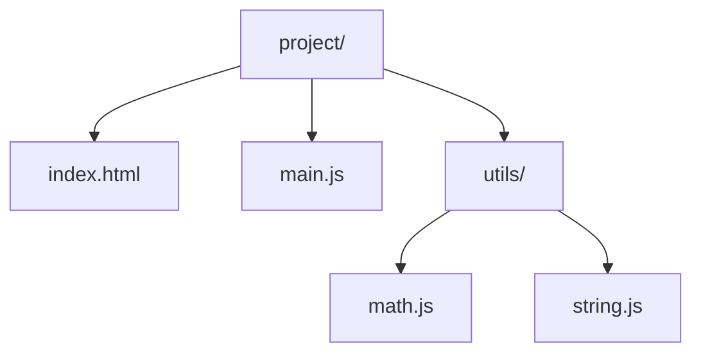

## 1. 引入方式 (Inclusion)

JavaScript 可以通过多种方式引入到网页中，每种方式都有其适用场景和特点。

### 1.1 内部脚本 (Inline Script)

**语法**: 在 HTML 文件中使用 `<script>` 标签包裹 JavaScript 代码。
**示例**:

```html
<!DOCTYPE html>
<html lang="zh-CN">
  <head>
    <meta charset="UTF-8" />
    <meta name="viewport" content="width=device-width, initial-scale=1.0" />
    <title>内部脚本示例</title>
  </head>
  <body>
    <h1>Hello, JavaScript!</h1>
    <script>
      // 内部脚本
      console.log('Hello from inline script!');
      // 定义函数
      function greet() {
        alert('Hello, world!');
      }
      // 调用函数
      greet();
    </script>
  </body>
</html>
```

**讲解：**

1. 这是内联脚本的标准位置：`<script>` 放在 `</body>` 之前。
2. 此时 DOM 已解析完成，可以直接操作页面元素。
3. 若放 `<head>` 且不加 defer，脚本会阻塞首屏渲染。


**特点**:

- 简单直接，适合小型脚本
- 代码与 HTML 混合，不利于维护
- 页面加载时执行

### 1.2 外部文件 (External Script)

**语法**: 使用 `<script src="path/to/script.js"></script>` 引入外部 JavaScript 文件。
**示例**:
**HTML 文件**:

```html
<!DOCTYPE html>
<html lang="zh-CN">
  <head>
    <meta charset="UTF-8" />
    <meta name="viewport" content="width=device-width, initial-scale=1.0" />
    <title>外部脚本示例</title>
  </head>
  <body>
    <h1>Hello, JavaScript!</h1>
    <script src="app.js"></script>
  </body>
</html>
```

**讲解：**

1. 这是模块脚本写法：`type="module"` 让文件按 ES Module 解析。
2. 模块脚本默认延迟执行，且每个文件有独立作用域。
3. 新项目优先使用模块方式组织脚本。


**app.js 文件**:

```javascript
// 外部脚本
console.log('Hello from external script!');
function greet() {
  alert('Hello, world!');
}
greet();
```

**讲解：**

1. `src` 属性引入外部 JS 文件，实现结构与行为分离。
2. `defer` 让脚本在文档解析完成后按顺序执行。
3. 外部文件可被浏览器缓存，重复访问更快。


**特点**:

- 代码与 HTML 分离，便于维护
- 可重用性高
- 可以被浏览器缓存
- 页面加载时执行

### 1.3 现代模块 (ESM - ES Modules)

**语法**: 使用 `<script type="module" src="main.js"></script>` 引入 ES 模块。
**示例**:
**HTML 文件**:

```html
<!DOCTYPE html>
<html lang="zh-CN">
  <head>
    <meta charset="UTF-8" />
    <meta name="viewport" content="width=device-width, initial-scale=1.0" />
    <title>ES 模块示例</title>
  </head>
  <body>
    <h1>Hello, JavaScript!</h1>
    <script type="module" src="main.js"></script>
  </body>
</html>
```

**讲解：**

1. 这是模块化页面的完整示例：`main.js` 导入工具函数。
2. 脚本文件之间通过 import/export 建立依赖，不再依赖全局变量。
3. 浏览器原生支持模块，但生产环境通常交给构建工具处理。


**main.js 文件**:

```javascript
// 导入模块
import { greet } from './utils.js';
console.log('Hello from ES module!');
greet();
```

**讲解：**

1. `import { greet }` 按名字导入导出函数。
2. 路径必须带 `./` 前缀与扩展名（浏览器规则）。
3. 导入后 greet 就是普通函数，可直接调用。


**utils.js 文件**:

```javascript
// 导出模块
export function greet() {
  alert('Hello from module!');
}
```

**讲解：**

1. `export` 关键字把函数公开给其他模块。
2. 未导出的内容对模块外部不可见，封装性更好。
3. 一个文件可以有多个 export，配合 import 按需取用。


**特点**:

- 支持模块化开发
- 变量默认是局部作用域
- 支持 `import` 和 `export` 语法
- 延迟执行 (defer)
- 跨域需要 CORS 支持

### 1.4 脚本加载顺序

**正常脚本** (`<script>`):

- 页面解析到脚本标签时立即执行
- 执行过程中暂停 HTML 解析
  **延迟脚本** (`<script defer>`):
- 脚本会在 HTML 解析完成后执行
- 多个 defer 脚本按顺序执行
- 适合外部脚本
  **异步脚本** (`<script async>`):
- 脚本会在下载完成后立即执行
- 不阻塞 HTML 解析
- 多个 async 脚本执行顺序不确定
- 适合独立的脚本，如统计代码
  **示例**:

```html
<!-- 正常脚本 -->
<script src="normal.js"></script>
<!-- 延迟脚本 -->
<script src="deferred.js" defer></script>
<!-- 异步脚本 -->
<script src="async.js" async></script>
<!-- ES 模块默认延迟执行 -->
<script type="module" src="module.js"></script>
```

**讲解：**

1. 对比 `defer` 与 `async`：defer 保序、async 不保序。
2. 无依赖的独立脚本可用 async，有依赖的用 defer。
3. 都不加的普通脚本会立即阻塞解析。


## 2. 语句与注释 (Statements & Comments)

### 2.1 语句 (Statements)

JavaScript 语句是执行特定操作的指令，通常以分号 (`;`) 结尾。
**基本语句**:

```javascript
// 变量声明语句
let x = 10;
// 赋值语句
x = 20;
// 函数调用语句
console.log(x);
// 条件语句
if (x > 15) {
  console.log('x 大于 15');
}
// 循环语句
for (let i = 0; i < 5; i++) {
  console.log(i);
}
```

**讲解：**

1. 声明语句由关键字 + 名字 + 初始值组成。
2. `let` 声明的变量可重新赋值。
3. 语句是 JavaScript 的最小执行单元，以分号分隔。


**分号使用**:

- 分号在 JavaScript 中是可选的，但推荐使用
- 自动分号插入 (ASI) 会在某些情况下自动添加分号
- 为了代码的一致性和避免潜在问题，建议始终使用分号
  **代码块**:
- 使用大括号 `{}` 包裹的语句集合
- 创建块级作用域

```javascript
{
  let blockVar = '只在块内可见';
  console.log(blockVar); // 输出: 只在块内可见
}
console.log(blockVar); // 报错: blockVar is not defined
```

**讲解：**

1. 花括号创建块级作用域，`let/const` 声明的变量只在该块内可见。
2. 块外访问 blockVar 会报 ReferenceError。
3. 这是 if/for 内部变量不泄漏到外层的原因。


### 2.2 注释 (Comments)

注释是代码中不会被执行的文本，用于解释代码的功能和逻辑。
**单行注释**:

- 使用 `//` 开头
- 注释从 `//` 开始到行尾

```javascript
// 这是一个单行注释
let x = 10; // 这也是一个单行注释
```

**讲解：**

1. `//` 是单行注释：从双斜杠到行尾都是注释。
2. 注释可独占一行，也可写在代码末尾。
3. 注释解释“为什么”，而不是复述代码在做什么。


**多行注释**:

- 使用 `/*` 开始，`*/` 结束
- 可以跨越多行

```javascript
/*
 这是一个
 多行注释
 */
let y = 20;
```

**讲解：**

1. `/* ... */` 是多行注释，可跨行书写。
2. 适合临时禁用大段代码或写说明。
3. 注意多行注释不能嵌套。


**文档注释**:

- 使用 `/**` 开始，`*/` 结束
- 用于生成 API 文档
- 支持 JSDoc 语法

```javascript
/**
 * 计算两个数的和
 * @param {number} a - 第一个数
 * @param {number} b - 第二个数
 * @returns {number} 两个数的和
 */
function add(a, b) {
  return a + b;
}
```

**讲解：**

1. `/** ... */` 是 JSDoc 文档注释：描述函数用途与参数。
2. 编辑器会读取它生成悬浮提示。
3. 公共 API 建议写 JSDoc，内部代码写普通注释即可。


**注释最佳实践**:

- 注释应该解释代码的"为什么"，而不是"是什么"
- 保持注释与代码同步
- 避免过多的注释，代码本身应该清晰易懂
- 使用文档注释记录函数、类和模块

## 3. 变量声明 (Variable Declarations)

JavaScript 提供了三种变量声明方式：`var`、`let` 和 `const`。

### 3.1 var

**特点**:

- 函数作用域
- 存在变量提升 (Hoisting)
- 可以重复声明
- 可以在声明前使用
  **示例**:

```javascript
// 变量提升 - 可以在声明前使用
console.log(x); // 输出: undefined
var x = 10;
// 函数作用域
function test() {
  var y = 20;
  console.log(y); // 输出: 20
}
test();
console.log(y); // 报错: y is not defined
// 重复声明
var x = 30;
console.log(x); // 输出: 30
```

**讲解：**

1. `var` 声明会提升：打印时变量已存在，但值为 undefined。
2. 提升的是声明，不是赋值。
3. 这是 var 容易踩坑的原因，新代码避免使用。


**注意**: `var` 由于其作用域和变量提升的特性，容易导致意外的行为，因此不推荐使用。

### 3.2 let

**特点**:

- 块级作用域
- 不存在变量提升
- 不能重复声明
- 声明后可以修改值
  **示例**:

```javascript
// 不存在变量提升
console.log(z); // 报错: z is not defined
let z = 10;
// 块级作用域
if (true) {
  let z = 20;
  console.log(z); // 输出: 20
}
console.log(z); // 输出: 10
// 不能重复声明
// let z = 30; // 报错: Identifier 'z' has already been declared
// 可以修改值
z = 30;
console.log(z); // 输出: 30
```

**讲解：**

1. `let` 不提升（严格说是提升但不可访问），声明前使用直接报错。
2. 这种“声明前不可用”的区域叫暂时性死区（TDZ）。
3. 规则：先声明、后使用，永远有效。


**推荐**: `let` 适用于需要在作用域内修改值的变量。

### 3.3 const

**特点**:

- 块级作用域
- 不存在变量提升
- 不能重复声明
- 必须初始化
- 不能修改值（但对象和数组的内容可以修改）
  **示例**:

```javascript
// 必须初始化
// const PI; // 报错: Missing initializer in const declaration
const PI = 3.14159;
// 块级作用域
if (true) {
  const PI = 3.14;
  console.log(PI); // 输出: 3.14
}
console.log(PI); // 输出: 3.14159
// 不能修改值
// PI = 3.14; // 报错: Assignment to constant variable
// 对象和数组的内容可以修改
const person = { name: 'Alice' };
person.name = 'Bob'; // 允许
console.log(person); // 输出: { name: "Bob" }
const numbers = [1, 2, 3];
numbers.push(4); // 允许
console.log(numbers); // 输出: [1, 2, 3, 4]
// 但不能重新赋值
// person = { name: "Charlie" }; // 报错: Assignment to constant variable
// numbers = [4, 5, 6]; // 报错: Assignment to constant variable
```

**讲解：**

1. `const` 声明必须同时初始化，不能只声明不赋值。
2. 因为 const 不允许重新赋值，没有初始值就没有意义。
3. 被注释掉的错误代码展示报错信息，方便对比。


**推荐**: `const` 适用于不需要修改值的常量，是默认的变量声明方式。

### 3.4 变量提升 (Hoisting)

变量提升是 JavaScript 的一种机制，其中变量和函数声明会被提升到作用域的顶部。
**var 提升**:

- 变量声明会被提升，但赋值不会
- 函数声明会被完全提升
  **示例**:

```javascript
// var 变量提升
console.log(a); // 输出: undefined
var a = 10;
console.log(a); // 输出: 10
// 函数声明提升
foo(); // 输出: Hello
function foo() {
  console.log('Hello');
}
// 函数表达式不会提升
bar(); // 报错: bar is not a function
var bar = function () {
  console.log('Hello');
};
```

**讲解：**

1. 复习：var 提升后值为 undefined，不报错。
2. 这种“不报错”反而危险：看起来能用，其实是空值。
3. 对比下一块的 let 报错，let 更安全。


**let 和 const 提升**:

- 声明会被提升，但处于"暂存死区" (Temporal Dead Zone, TDZ)
- 在声明前访问会报错
  **示例**:

```javascript
// 暂存死区
console.log(b); // 报错: Cannot access 'b' before initialization
let b = 20;
console.log(c); // 报错: Cannot access 'c' before initialization
const c = 30;
```

**讲解：**

1. let 声明前访问触发 TDZ 报错。
2. 报错信息明确指向问题行，便于修复。
3. 理解 TDZ 后，变量顺序问题不再是玄学。


## 4. 标识符规范 (Identifiers)

标识符是变量、函数、类、属性等的名称。

### 4.1 命名规则

- **允许的字符**: 字母 (a-z, A-Z)、数字 (0-9)、下划线 (\_)、美元符号 ($)
- **不能以数字开头**
- **区分大小写**: `myVar` 和 `myvar` 是不同的标识符
- **不能使用保留字** (如 `let`、`const`、`function` 等)

### 4.2 命名约定

**变量和函数**:

- 使用小驼峰命名法 (lowerCamelCase)
- 变量名应该清晰表达其用途
  **示例**:

```javascript
let userName = 'Alice';
let userAge = 30;
function calculateTotalPrice(items) {
  // 函数体
}
```

**讲解：**

1. 变量命名使用小驼峰：首字母小写，后续单词首字母大写。
2. userName 比 name 更能表达业务含义。
3. 命名清晰是代码可读性的第一要素。


**常量**:

- 使用大驼峰命名法 (UPPER_SNAKE_CASE)
- 常量名应该全大写，单词间用下划线分隔
  **示例**:

```javascript
const MAX_SIZE = 100;
const API_URL = 'https://api.example.com';
```

**讲解：**

1. 常量命名使用全大写 + 下划线。
2. 魔法数字（裸的 100）换成命名常量后，含义一目了然。
3. 配置类常量集中放文件顶部或独立配置模块。


**类**:

- 使用大驼峰命名法 (PascalCase)
- 类名应该是名词，首字母大写
  **示例**:

```javascript
class User {
  constructor(name, age) {
    this.name = name;
    this.age = age;
  }
}
```

**讲解：**

1. `class` 定义类，`constructor` 是构造方法，实例化时自动调用。
2. `this.name = name` 把参数存到实例属性。
3. 类方法写在 constructor 之后，实例共享同一份方法。


**对象属性**:

- 使用小驼峰命名法 (lowerCamelCase)
- 与变量命名一致
  **示例**:

```javascript
const user = {
  firstName: 'Alice',
  lastName: 'Smith',
  emailAddress: 'alice@example.com',
};
```

**讲解：**

1. 对象字面量用花括号，键值对用冒号分隔。
2. `const user` 只锁定引用：user 不能换对象，但属性可以改。
3. 访问属性用 `user.firstName` 或 `user['firstName']`。


**函数参数**:

- 使用小驼峰命名法 (lowerCamelCase)
- 参数名应该清晰表达其用途
  **示例**:

```javascript
function createUser(firstName, lastName, email) {
  // 函数体
}
```

**讲解：**

1. `function` 声明函数：名字 + 参数列表 + 函数体。
2. 参数按位置传入，函数体用 return 返回结果。
3. 函数是 JavaScript 的基本组织单元。


### 4.3 命名最佳实践

- **语义化**: 变量名应该清晰表达其用途
- **简洁**: 变量名应该简洁但不失明确
- **一致**: 在整个项目中保持命名风格一致
- **避免缩写**: 除非是广为人知的缩写 (如 `API`、`URL`)
- **避免单个字符**: 除非是循环计数器或数学变量
  **好的命名示例**:
- `userName` 而不是 `u` 或 `usrNm`
- `calculateTotalPrice` 而不是 `calc` 或 `total`
- `isActive` 而不是 `active` (布尔变量使用 `is` 或 `has` 前缀)
- `MAX_ITERATIONS` 而不是 `max`

## 5. 严格模式 (Strict Mode)

严格模式是 JavaScript 的一种执行模式，通过 `"use strict";` 指令开启。

### 5.1 开启严格模式

**全局严格模式**:

- 在脚本的顶部添加 `"use strict";`
  **示例**:

```javascript
'use strict';
// 严格模式下的代码
let x = 10;
```

**讲解：**

1. `'use strict'` 开启严格模式：把静默错误变成显式报错。
2. 写在文件顶部则整个文件生效。
3. 现代模块与类默认就是严格模式。


**函数严格模式**:

- 在函数内部添加 `"use strict";`
  **示例**:

```javascript
function strictFunction() {
  'use strict';
  // 严格模式下的代码
  let y = 20;
}
```

**讲解：**

1. 严格模式也可只作用于函数内部。
2. 函数级开启适合渐进改造存量代码。
3. 推荐新代码统一在文件顶部开启。


**ES 模块**:

- ES 模块默认启用严格模式，无需添加 `"use strict";`

### 5.2 严格模式的限制

**严格模式禁止的行为**:

1. **未声明的变量**: 不允许使用未声明的变量

```javascript
'use strict';
x = 10; // 报错: x is not defined
```

**讲解：**

1. 严格模式禁止隐式全局变量：不声明直接赋值会报错。
2. 这是严格模式最重要的保护之一。
3. 报错能尽早暴露拼写错误（本想给已声明变量赋值却写错名字）。


2. **重复的参数名**: 不允许函数有重复的参数名

```javascript
'use strict';
function foo(a, a) {
  // 报错: Duplicate parameter name not allowed in this context
  console.log(a);
}
```

**讲解：**

1. 严格模式禁止重复参数名。
2. 重复参数会让第二个覆盖第一个，容易产生隐蔽 bug。
3. 非严格模式下这是合法的，所以严格模式更安全。


3. **删除变量、函数或参数**: 不允许使用 `delete` 操作符删除变量、函数或参数

```javascript
'use strict';
let x = 10;
delete x; // 报错: Delete of an unqualified identifier in strict mode.
```

**讲解：**

1. 严格模式禁止删除不可删除的属性（delete 一个变量）。
2. 报错信息提示“无法删除”。
3. delete 只该用于对象属性，不该用于变量。


4. **八进制字面量**: 不允许使用八进制字面量

```javascript
'use strict';
let x = 010; // 报错: Octal literals are not allowed in strict mode.
```

**讲解：**

1. 以 0 开头的数字在旧语法中是八进制，歧义很大。
2. 严格模式禁止这种写法，八进制需写 `0o10`。
3. 消除歧义让代码行为可预测。


5. **with 语句**: 不允许使用 `with` 语句

```javascript
'use strict';
with (Math) {
  // 报错: Strict mode code may not include a with statement
  console.log(PI);
}
```

**讲解：**

1. `with` 语句把对象属性变成裸变量，严重损害可读性与性能。
2. 严格模式直接禁止 with。
3. 需要简化访问时改用解构赋值。


6. **this 指向**: 在全局函数中，`this` 不再指向全局对象，而是 `undefined`

```javascript
'use strict';
function foo() {
  console.log(this); // 输出: undefined
}
foo();
```

**讲解：**

1. 严格模式下函数内部的 this 是 undefined（非严格模式下是全局对象）。
2. 这能防止“忘记 new 调用构造函数”时悄悄污染全局。
3. 这也是回调里 this 问题的背景知识。


7. **eval 作用域**: `eval` 语句在严格模式下有自己的作用域，不会污染外部作用域

```javascript
'use strict';
let x = 10;
eval('var x = 20; console.log(x);'); // 输出: 20
console.log(x); // 输出: 10
```

**讲解：**

1. 严格模式对只读属性赋值会报错（如修改 const 对象的只读字段）。
2. 把“悄悄失败”变成“立即报错”。
3. 配合 Object.freeze 可以锁定不可变数据。


### 5.3 严格模式的好处

- **消除不合理的语法**: 禁止一些容易出错的语法
- **提高运行效率**: 某些操作在严格模式下执行更快
- **增强安全性**: 减少潜在的安全漏洞
- **提前发现错误**: 将静默错误变为显式错误
- **为未来的 JavaScript 版本做准备**: 严格模式的规则更接近未来的 JavaScript 标准

## 6. 代码风格 (Code Style)

一致的代码风格有助于提高代码的可读性和可维护性。

### 6.1 缩进

- 使用 2 或 4 个空格进行缩进
- 保持一致的缩进风格
  **示例**:

```javascript
// 2 空格缩进
function foo() {
  if (true) {
    console.log('Hello');
  }
}
// 4 空格缩进
function bar() {
  if (true) {
    console.log('Hello');
  }
}
```

**讲解：**

1. 缩进不是语法要求，但统一缩进是团队协作底线。
2. 推荐交给 Prettier 自动格式化，人工不争论。
3. 常见标准：2 空格（JS 社区）或 4 空格。


### 6.2 空格

- 操作符两边添加空格
- 逗号后添加空格
- 函数参数列表中，逗号后添加空格
- 花括号前后添加空格
  **示例**:

```javascript
// 好的风格
let x = 10 + 5;
const arr = [1, 2, 3];
function foo(a, b) {
  // 函数体
}
// 不好的风格
let x = 10 + 5;
const arr = [1, 2, 3];
function foo(a, b) {
  // 函数体
}
```

**讲解：**

1. 运算符两侧留空格，可读性显著提升。
2. 逗号后留空格，括号内侧不留。
3. 这些细节由格式化工具统一，不必手动纠结。


### 6.3 换行

- 每行代码长度控制在 80-120 个字符以内
- 运算符后换行
- 长函数参数或对象字面量换行
  **示例**:

```javascript
 // 长表达式换行
 const result = a + b + c + d + e +
  f + g + h;
 // 长函数参数换行
 function foo(
  parameter1,
  parameter2,
  parameter3
 )
  // 函数体
 }
 // 长对象字面量换行
 const user = {
  name: "Alice",
  age: 30,
  email: "alice@example.com",
  address: {
  street: "123 Main St",
  city: "New York"
  }
 }
```

**讲解：**

1. 长表达式按运算符换行，便于阅读。
2. 换行时运算符放在行首（或行尾，团队统一）。
3. 超过 80-100 字符的行都应考虑换行。


### 6.4 分号

- 始终使用分号结束语句
- 避免依赖自动分号插入 (ASI)
  **示例**:

```javascript
// 好的风格
let x = 10;
console.log(x);
// 不好的风格
let x = 10;
console.log(x);
```

**讲解：**

1. 一行只写一条语句，避免压缩式写法。
2. 可读性优先于行数少。
3. 格式化工具会自动展开压缩代码。


### 6.5 引号

- 选择单引号或双引号，保持一致
- 字符串中包含引号时，使用相反的引号或转义
  **示例**:

```javascript
// 使用单引号
let name = 'Alice';
let message = 'She said, "Hello!"';
// 使用双引号
let name = 'Alice';
let message = "She said, 'Hello!'";
```

**讲解：**

1. 字符串引号风格（单/双）团队统一即可。
2. 包含同类引号时用另一种或模板字符串。
3. 推荐优先使用模板字符串处理插值。


## 7. 常见错误与解决方案

### 7.1 变量作用域错误

**错误**: 变量泄露到全局作用域
**原因**: 使用 `var` 或未声明的变量
**解决方案**:

- 使用 `let` 或 `const` 声明变量
- 封装代码到函数或模块中
  **示例**:

```javascript
// 错误
function test() {
  x = 10; // 未声明的变量，会泄露到全局作用域
}
test();
console.log(x); // 输出: 10
// 正确
function test() {
  let x = 10; // 块级作用域变量
}
test();
console.log(x); // 报错: x is not defined
```

**讲解：**

1. 花括号必须成对，少一个括号会导致语法错误。
2. 现代编辑器会在输入时自动配对并高亮不匹配。
3. 报错位置不一定在真正缺括号处，从函数开头检查。


### 7.2 变量提升错误

**错误**: 在声明前使用变量
**原因**: 不了解变量提升的机制
**解决方案**:

- 始终在使用变量前声明
- 使用 `let` 或 `const` 避免变量提升问题
  **示例**:

```javascript
// 错误
console.log(x); // 输出: undefined
var x = 10;
// 正确
let x = 10;
console.log(x); // 输出: 10
```

**讲解：**

1. 该错误示例演示变量提升导致的 undefined 输出。
2. 用 var 声明后立即使用但未赋值，结果是 undefined。
3. 修复：把 console.log 移到赋值之后。


### 7.3 严格模式错误

**错误**: 在严格模式下使用被禁止的语法
**原因**: 不了解严格模式的限制
**解决方案**:

- 熟悉严格模式的规则
- 修复被禁止的语法
  **示例**:

```javascript
'use strict';
// 错误
x = 10; // 未声明的变量
// 正确
let x = 10;
```

**讲解：**

1. 严格模式下给未声明变量赋值会报错。
2. 该示例展示“应当报错却被静默接受”的反模式。
3. 开严格模式后这类问题自动消失。


### 7.4 命名错误

**错误**: 使用无效的标识符
**原因**: 不了解标识符的命名规则
**解决方案**:

- 遵循标识符命名规则
- 使用语义化的命名
  **示例**:

```javascript
 // 错误
 let 123abc = 10; // 不能以数字开头
 let let = 20; // 不能使用保留字
 // 正确
 let abc123 = 10;
 let myLet = 20;
```

**讲解：**

1. 标识符不能以数字开头，`123abc` 非法。
2. 合法规则：字母、_、$ 开头，后续可含数字。
3. 命名规范：变量小驼峰、常量全大写、类大驼峰。


## 8. 实战示例

### 8.1 模块化开发

**项目结构**:



**讲解：**

1. 这是推荐的 Node.js 项目目录结构。
2. src 放源码、test 放测试、package.json 管依赖与脚本。
3. 目录按功能或模块组织，避免一锅粥。


**index.html**:

```html
<!DOCTYPE html>
<html lang="zh-CN">
  <head>
    <meta charset="UTF-8" />
    <meta name="viewport" content="width=device-width, initial-scale=1.0" />
    <title>模块化开发示例</title>
  </head>
  <body>
    <h1>模块化开发示例</h1>
    <div id="result"></div>
    <script type="module" src="main.js"></script>
  </body>
</html>
```

**讲解：**

1. 这是浏览器端的标准项目入口：一个 HTML 引入一个入口 JS。
2. 入口 JS 再通过 import 组织其他模块。
3. 复杂项目用构建工具（Vite 等）处理依赖与打包。


**utils/math.js**:

```javascript
/**
 * 数学工具函数
 */
/**
 * 计算两个数的和
 * @param {number} a - 第一个数
 * @param {number} b - 第二个数
 * @returns {number} 两个数的和
 */
export function add(a, b) {
  return a + b;
}
/**
 * 计算两个数的差
 * @param {number} a - 被减数
 * @param {number} b - 减数
 * @returns {number} 两个数的差
 */
export function subtract(a, b) {
  return a - b;
}
```

**讲解：**

1. 工具函数文件用 JSDoc 说明用途与参数。
2. `@param {number}` 标注参数类型，`@returns` 标注返回。
3. 纯函数（同输入同输出）最适合做工具函数。


**utils/string.js**:

```javascript
/**
 * 字符串工具函数
 */
/**
 * capitalize
 * @param {string} str - 输入字符串
 * @returns {string} 首字母大写的字符串
 */
export function capitalize(str) {
  return str.charAt(0).toUpperCase() + str.slice(1);
}
/**
 * 字符串反转
 * @param {string} str - 输入字符串
 * @returns {string} 反转后的字符串
 */
export function reverse(str) {
  return str.split('').reverse().join('');
}
```

**讲解：**

1. 字符串工具同理：集中管理、便于测试。
2. 每个工具函数只做一件事。
3. 工具模块不依赖业务状态，随处可复用。


**main.js**:

```javascript
'use strict';
// 导入模块
import { add, subtract } from './utils/math.js';
import { capitalize, reverse } from './utils/string.js';
// 使用导入的函数
const sum = add(10, 5);
const difference = subtract(10, 5);
const capitalized = capitalize('hello');
const reversed = reverse('hello');
// 显示结果
const resultDiv = document.getElementById('result');
resultDiv.innerHTML = `
  <p>10 + 5 = ${sum}</p>
  <p>10 - 5 = ${difference}</p>
  <p>capitalize('hello') = ${capitalized}</p>
  <p>reverse('hello') = ${reversed}</p>
 `;
console.log('模块化开发示例执行完成');
```

**讲解：**

1. 现代入口文件习惯：顶部 'use strict' + 导入依赖。
2. 导入语句集中放文件顶部，扫一眼就知道依赖什么。
3. 模块自身默认严格模式，顶部声明更多是传统习惯。


### 8.2 严格模式应用

**示例**:

```javascript
'use strict';
// 严格模式下的代码
// 1. 必须声明变量
let userName = 'Alice';
const MAX_AGE = 120;
// 2. 不能使用未声明的变量
// age = 30; // 报错: age is not defined
// 3. 不能使用重复的参数名
// function foo(a, a) { // 报错: Duplicate parameter name not allowed in this context
// console.log(a);
// }
// 4. 不能删除变量
// delete userName; // 报错: Delete of an unqualified identifier in strict mode.
// 5. 不能使用八进制字面量
// let octal = 010; // 报错: Octal literals are not allowed in strict mode.
// 6. 不能使用 with 语句
// with (Math) { // 报错: Strict mode code may not include a with statement
// console.log(PI);
// }
// 7. this 指向 undefined
function test() {
  console.log(this); // 输出: undefined
}
test();
// 8. eval 有自己的作用域
let x = 10;
eval("var x = 20; console.log('Inside eval:', x);"); // 输出: Inside eval: 20
console.log('Outside eval:', x); // 输出: 10
console.log('严格模式示例执行完成');
```

**讲解：**

1. 复习：严格模式让常见误操作显式报错。
2. 推荐所有新文件都开启。
3. 与模块、类搭配时无需重复声明。


## 9. 总结

JavaScript 的程序结构和基本语法是学习 JavaScript 的基础。通过理解引入方式、语句与注释、变量声明、标识符规范和严格模式等概念，你可以编写更加规范、高效和安全的 JavaScript 代码。

- **引入方式**: 选择适合的脚本引入方式，考虑加载顺序和性能
- **语句与注释**: 编写清晰的语句，使用适当的注释解释代码
- **变量声明**: 优先使用 `const` 和 `let`，避免使用 `var`
- **标识符规范**: 遵循命名规则和约定，提高代码可读性
- **严格模式**: 启用严格模式，减少错误，提高代码质量
- **代码风格**: 保持一致的代码风格，提高代码可维护性
  掌握这些基础概念后，你可以更深入地学习 JavaScript 的高级特性，如函数、对象、异步编程等，为构建复杂的应用打下坚实的基础。

---

## 语句与分号

**基本写法：语句结尾分号**
`<语句>;`
```javascript
// 语句以分号结尾
let x = 10;
```

**讲解：**

1. 分号是语句结束符；ASI 机制会自动补分号。
2. 依赖 ASI 有风险（如换行开头是括号的表达式）。
3. 团队二选一：统一加分号或统一不加，交给 Prettier。


---

**基本写法：无分号语句**
`<语句>`
```javascript
// 语句可省略分号
let x = 10
```

**讲解：**

1. 省略分号时依赖自动插入（ASI）。
2. 多数现代代码风格省略分号，但必须配合格式化工具。
3. 与上一块对比，选择一种并保持全库一致。


---

## 严格模式

**基本写法：启用严格模式**
`"use strict";`
```javascript
// 在脚本顶部启用严格模式
"use strict";
let x = 10;
```

**讲解：**

1. 字符串字面量形式的指令放在文件第一行开启严格模式。
2. 双引号或单引号均可。
3. 它必须位于任何语句之前才生效。


---

**基本写法：函数级严格模式**
`function <函数名>() { "use strict"; }`
```javascript
// 在函数内部启用严格模式
function safeFunction() {
    "use strict";
}
```

**讲解：**

1. 严格模式指令放在函数体第一行，只作用于该函数。
2. 适合逐步改造遗留代码。
3. 新代码推荐文件级开启。


---

## 注释

**基本写法：单行注释**
`// <注释内容>`
```javascript
// 这是一个单行注释
let x = 10;
```

**讲解：**

1. 速查段复习单行注释两种位置。
2. 行尾注释适合简短说明。
3. 超过一行说明时改用上方注释块。


---

**基本写法：多行注释**
`/* <注释内容> */`
```javascript
/* 这是一个多行注释 */
let x = 10;
```

**讲解：**

1. 单行形式的多行注释：`/* ... */` 写在一行内。
2. 适合行内说明。
3. 多行内容时换行书写更清晰。


---

**换行写法：多行注释**
`/* <注释内容> */`
```javascript
/*
 * 这是一个多行注释
 * 可以跨越多行
 */
let x = 10;
```

**讲解：**

1. 经典的多行注释排版：每行前加 * 对齐。
2. 用于模块头部说明或大段说明。
3. 文档型注释建议用 /** 形式。


---

**基本写法：文档注释**
`/** <注释内容> */`
```javascript
/** 计算两个数的和 */
function add(a, b) {
    return a + b;
}
```

**讲解：**

1. 单行 JSDoc 直接写在函数上方。
2. 编辑器悬浮提示会显示这段说明。
3. 简单函数一句说明足够。


---

## 输出

**基本写法：控制台输出**
`console.log(<内容>);`
```javascript
// 输出到控制台
console.log("Hello, World!");
```

**讲解：**

1. `console.log` 是最常用的调试输出。
2. 浏览器按 F12 打开开发者工具查看。
3. 第一个程序的标准内容。


---

**基本写法：输出多个值**
`console.log(<值1>, <值2>);`
```javascript
// 输出多个值以空格分隔
console.log("Name:", name, "Age:", age);
```

**讲解：**

1. console.log 可接收多个参数，自动以空格分隔。
2. 适合打印对象与说明文字。
3. 复杂对象建议 console.table 或 JSON 序列化查看。


---

**基本写法：错误输出**
`console.error(<内容>);`
```javascript
// 输出错误信息到控制台
console.error("Something went wrong");
```

**讲解：**

1. `console.error` 以红色样式输出错误。
2. 错误与普通日志在控制台可过滤区分。
3. 生产代码用 console.error 记录异常。


---

**基本写法：警告输出**
`console.warn(<内容>);`
```javascript
// 输出警告信息到控制台
console.warn("This is a warning");
```

**讲解：**

1. `console.warn` 以黄色样式输出警告。
2. 用于“还能跑但已不推荐”的情况。
3. 三者分工：log 信息、warn 警告、error 错误。


---

## 标识符命名

**基本写法：变量名命名**
`<lowerCamelCase>`
```javascript
// 变量名使用小驼峰命名法
userName
```

**讲解：**

1. 小驼峰：首单词小写，后续单词首字母大写。
2. userName、userAge 都是标准示例。
3. 命名要表达含义，避免 a、b、tmp。


---

**基本写法：常量名命名**
`<UPPER_SNAKE_CASE>`
```javascript
// 常量名全大写使用下划线分隔
MAX_VALUE
```

**讲解：**

1. 常量全大写 + 下划线：MAX_VALUE、API_URL。
2. 与普通变量一眼区分。
3. 编译期常量与配置文件常用此风格。


---

**基本写法：函数名命名**
`<lowerCamelCase>`
```javascript
// 函数名使用小驼峰命名法
getUserName
```

**讲解：**

1. 函数名用小驼峰，且以动词开头（get/set/add/remove）。
2. getUserName 一眼看出“获取用户名”。
3. 动词开头让函数意图明确。


---

**基本写法：类名命名**
`<UpperCamelCase>`
```javascript
// 类名使用大驼峰命名法
HelloWorld
```

**讲解：**

1. 类名用大驼峰（PascalCase）：每个单词首字母大写。
2. UserService、HttpClient 都是典型类名。
3. 组件、构造函数同样适用。


---

## 输入

**基本写法：浏览器输入**
`prompt("<提示文本>")`
```javascript
// 弹出输入框获取用户输入
let name = prompt("请输入你的名字");
```

**讲解：**

1. `prompt` 弹出输入框，返回值是字符串或 null。
2. 用户点取消时返回 null，需要处理。
3. 浏览器 API，Node.js 环境不可用。


---

**基本写法：确认框**
`confirm("<提示文本>")`
```javascript
// 弹出确认框返回布尔值
let result = confirm("确定要删除吗");
```

**讲解：**

1. `confirm` 返回布尔值：确定 true、取消 false。
2. 适合简单二次确认。
3. 现代 UI 更多用自定义对话框，但 API 原理相同。


---

**基本写法：警告框**
`alert("<消息>")`
```javascript
// 弹出警告框显示消息
alert("操作成功");
```

**讲解：**

1. `alert` 显示提示框，点击确定后继续。
2. 阻塞式 API，频繁使用体验差。
3. 仅用于简单提示或调试。


---

## 代码块

**基本写法：块级作用域**
`{ <语句> }`
```javascript
// 使用大括号创建块级作用域
{
    let blockVar = 10;
}
```

**讲解：**

1. 独立花括号也能创建块级作用域。
2. 内部 let/const 变量外部不可见。
3. 用于隔离临时变量，避免污染外层。


---

**基本写法：语句分组**
`{ <语句1> <语句2> }`
```javascript
// 多条语句分组
{
    let x = 1;
    let y = 2;
}
```

**讲解：**

1. 花括号把多条语句合成一个块。
2. if/for/函数体都是块的应用。
3. 块内变量遵循块级作用域规则。


## 练习：修 Bug（先找错，再看答案）

1. 下面的代码输出什么？为什么？

```javascript
console.log(name);
var name = 'Alice';
```

**讲解：**

1. 演示 var 提升：打印时 name 是 undefined。
2. 换成 let 会直接报 TDZ 错误。
3. 两种行为对比是面试高频考点。


答案：输出 `undefined`（不是报错）。`var` 声明会被提升，但赋值留在原地；用 `let`/`const` 会直接报错，更安全。

2. 这段代码有什么问题？

```javascript
function add(a, b) {
  return
    a + b;
}
```

**讲解：**

1. 这是 ASI 陷阱：return 后换行，分号被自动插入。
2. 函数返回 undefined 而不是 a + b。
3. 规则：return 的表达式必须与 return 同一行。


答案：`return` 后自动插入分号，函数永远返回 `undefined`。把表达式写在 `return` 同一行。

3. 严格模式下有什么不同？

```javascript
'use strict';
undeclared = 1;
```

**讲解：**

1. 最后复习严格模式的核心禁令：未声明变量赋值报错。
2. 这条规则让全局污染无处藏身。
3. 看到这类报错，补上 let/const 声明即可。


答案：给未声明变量赋值在严格模式下会抛 `ReferenceError`；非严格模式会静默创建全局变量。
