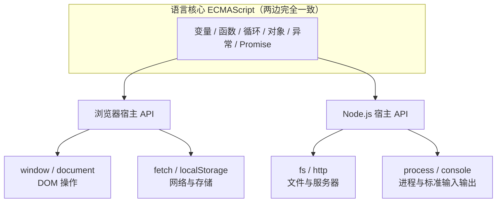

## 前置知识

- 已完成 [JavaScript 是什么](/javascript/010-WhatIsJavaScript)：会在浏览器控制台运行 `console.log`，知道 JS 与 HTML/CSS 的分工。

## 学习目标

读完本文你将能够：

1. 说出「运行环境 = 语言引擎 + 宿主提供的 API」这个模型的每个部分，并画出浏览器与 Node 的能力差异图；
2. 解释为什么 `console.log` 到处能用、`alert` 只在浏览器能用、`fs` 只在 Node 能用；
3. 知道 ECMAScript（ES）是什么、版本号怎么读、新特性要等多久才能放心用；
4. 用 `typeof window` 一行代码判断当前代码跑在哪个环境；
5. 读懂 `xxx is not defined` 报错里「环境用错」这种成因。

预计 40 到 60 分钟。

## 1. 你现在要解决什么问题

上一篇你在浏览器控制台敲过 `console.log`。现在考虑三个现象：

1. 控制台里输入 `alert('hi')` 会弹窗，但把这句写进 Node 脚本运行就报错；
2. Node 脚本里 `require('fs')` 能读文件，同样的话贴回浏览器控制台就报错；
3. 你从网上抄的一段代码，教程里能跑，到你机器上报 `xxx is not defined`。

三件事的共同根源是同一个：**JS 代码自己不会运行，它总是跑在某个「环境」里，而不同环境给它的能力不一样**。不理解这一点，后面每一篇你都会撞到「为什么这里没有这个函数」的墙。

## 2. 先不要看解释，先试试看

浏览器按 `F12` 打开控制台，逐行输入并预测结果：

```javascript
typeof window
typeof alert
typeof document
typeof globalThis
```

然后打开终端（Node 已在环境搭建时装好，没装的看 [Node.js 安装](/javascript/520-NodeJsInstall)），运行：

```bash
node -e "console.log(typeof window, typeof alert, typeof document, typeof globalThis)"
```

两边的输出对照着看，把差异记在纸上——这就是本文要解释的全部现象。

## 3. 最小可运行示例：一个函数，两个世界

把下面内容存为 `where.js`：

```javascript
// 判断当前代码跑在哪个环境：两行通用的探测写法
const inBrowser = typeof window !== 'undefined';
const inNode = typeof process !== 'undefined' && process.versions?.node;

console.log('浏览器环境：' + inBrowser);
console.log('Node 环境：' + inNode);
console.log('统一的全局对象：' + typeof globalThis);
```

用 Node 运行 `node where.js`，预期输出：

```text
浏览器环境：false
Node 环境：true
统一的全局对象：object
```

再把同样的代码贴进浏览器控制台运行，前两行变成 `true` 和 `false`——**同一份代码，环境自己会说话**。

## 4. 发生了什么：引擎 + 宿主 API

JS 运行环境由两层组成：

- **语言引擎**：负责读懂并执行语言本身——变量、函数、循环、对象。Chrome 与 Node 共用同一个引擎 V8，所以任何语法两边行为一致；
- **宿主 API**：引擎之外，宿主程序「喂」给代码的能力。浏览器喂给你操作网页的能力，Node 喂给你操作系统的能力。



现在可以精确回答第 1 节的三个现象了：

- `console.log` 两边都有？因为两边宿主都恰好提供了 `console`（连引擎自带的 REPL 都常用它）；
- `alert` 只在浏览器有？弹窗是浏览器界面能力，Node 没有界面，自然不给；
- `fs` 只在 Node 有？读写文件是系统能力，浏览器出于安全禁止网页乱读你的硬盘（网页端等价物是用户主动授权的文件选择，后续 DOM 篇再讲）。

而 `globalThis`（ES2020 标准化）是语言核心提供的「当前环境全局对象」的统一名字：浏览器里它就是 `window`，Node 里它指向另一套全局——所以它是探测环境的可靠锚点。

## 5. 核心概念：ECMAScript 与版本节奏

JS 的语言核心有正式名字：**ECMAScript**（标准文件 ECMA-262，由 ECMA 国际的 TC39 委员会维护）。你见过的一串说法从此可以归位：

- 「ES6」「ES2015」是同一个东西：2015 年那次大版本（类、let/const、Promise、模块都是那时来的），此后委员会改为**每年发一版**，版本号即年份（ES2016、ES2017……）；
- 「ES2023 新特性」＝ 2023 年进入语言标准的能力；
- 浏览器与 Node 更新很快（浏览器俗称 evergreen 常青更新），**新特性从进入标准到放心使用，通常只差几个月到一年**；老特性（如 ES5 时代的 `var`）不会消失，所以你要认识它们——为了读懂旧代码。

一个特性「能不能用」的判断顺序：先想目标用户的浏览器（公司内网老系统另说），再查 MDN 每个 API 页面底部的兼容性表，必要时查 caniuse.com。现代工程里还有「转译」手段（把新语法自动改写成老语法发布），这个概念在工程化篇章展开，现在只需要知道有这条路。

## 6. 修改实验

实验一：在 Node 里故意用浏览器 API，看真实报错：

```bash
node -e "alert('hi')"
```

预期报错（真实文本）：

```text
ReferenceError: alert is not defined
```

实验二：反过来，在浏览器控制台用 Node 的 API：

```javascript
const fs = require('fs')
```

预期报错：`ReferenceError: require is not defined`（浏览器的模块体系是 `import`，见 [JavaScript 模块化](/javascript/380-JavaScriptModular)）。

实验三：把 `where.js` 里的探测条件改一改再跑：把 `typeof process !== 'undefined'` 改成 `typeof document !== 'undefined'`，预测 Node 与浏览器各输出什么，运行验证。

## 7. 常见错误与调试实录

「`xxx is not defined`」有一个此前没讲的重要成因：**环境里根本没有这个能力**。三步排查法：

1. 先查拼写：`console.log` 写成 `consol.log` 是同类报错的最大来源；
2. 拼写没问题，就查「这个东西属于哪个环境」：MDN 搜函数名，页面会标注它是 Web API（浏览器）还是 Node API；
3. 属于别的环境？换运行方式（脚本改到浏览器跑、或加 Node），或者找该环境下的等价 API。

调试实录一则：初学者常把「操作网页」的代码贴进 Node 运行，收到 `ReferenceError: document is not defined`，第一反应是「我代码写错了」。其实代码没错，是舞台错了——`document` 只存在于浏览器。判错能力比背 API 更重要：报错类型是 `ReferenceError` 且名字首字母大写像内置对象时，先怀疑环境。

## 8. 实际项目中的使用场景

- 前端项目里同时存在两种代码：跑在浏览器里的界面逻辑，和跑在 Node 里的构建脚本、配置文件（如 `vite.config.js`）——它们能力不同，混淆会直接报错；
- 同构代码（前后端共用一份工具函数）里用环境探测分支：`typeof window !== 'undefined'` 决定走哪条路；
- 写 CLI 工具、自动化脚本选 Node；写页面交互选浏览器——语言相同，选择的是「宿主」。

## 9. 小练习

预测题：不运行，写出下面脚本在 Node 里的输出：

```javascript
console.log(typeof fetch);
console.log(typeof process);
console.log(typeof window);
```

（提示：现代 Node 从 18 起内置了 `fetch`。答案自己跑 `node -e` 验证，两条对一条错才算通过。）

修改题：把 `where.js` 的输出从「true / false」改成中文句子：「当前运行在浏览器」「当前运行在 Node」，并让它在两边运行都输出正确句子。

修 Bug 题：下面的脚本在浏览器控制台运行报 `ReferenceError: process is not defined`。指出问题所在，并把「当前环境判断」改成浏览器里也能跑的写法：

```javascript
if (process.env.NODE_ENV === 'development') {
  console.log('调试模式');
}
```

挑战题：写一个 `env.js`，在浏览器与 Node 里运行分别输出「我有 DOM」「我有文件系统」，且不许使用上一节的环境探测写法之外的新知识（提示：`typeof` 探测两个 API 的存在性即可）。

## 10. 什么时候在哪个环境运行

| 你要做的事 | 环境 | 原因 |
| --- | --- | --- |
| 页面交互、表单校验、动效 | 浏览器 | 只有浏览器有 DOM |
| 服务器、CLI 工具、构建脚本 | Node | 只有 Node 有文件系统与进程控制 |
| 两边都要跑的纯计算逻辑（格式化、校验） | 都可以 | 只用语言核心写的代码天然可移植 |

不应做的：在浏览器里追求系统能力（读 arbitrary 文件、起端口——安全模型不允许）；在 Node 里找 DOM（环境不允许）。**能力差异不是 JS 的缺陷，是每个环境的安全边界。**

## 11. 与之前和之后的知识的关系

- 往前：[JavaScript 是什么](/javascript/010-WhatIsJavaScript) 给了「JS 能做什么」的地图，本文解释了「同一门语言为什么在不同地方能力不同」，并把 `alert`、`console`、`require` 的归属讲清；
- 往后：下一篇起进入 [程序结构基本语法](/javascript/030-ProgramStructureBasicSyntax)——语言核心部分，**两边完全通用**，你可以继续用浏览器控制台跟练；[Node.js 安装](/javascript/520-NodeJsInstall) 则在你需要跑工具链时回头读。

## 12. 官方文档

- ECMAScript 语言标准（ECMA-262）：https://tc39.es/ecma262/
- MDN JavaScript 教程（每个 API 的兼容性表都在页面底部）：https://developer.mozilla.org/zh-CN/docs/Web/JavaScript
- Node.js 官方 API 文档：https://nodejs.org/docs/latest/api/
- 提案进度看板（未来特性从这里来）：https://github.com/tc39/proposals

## 13. 自我检查

- 能画出「语言核心 / 浏览器 API / Node API」三层图，并把 `alert`、`fs`、`Promise`、`process` 各归一层；
- 能解释 `globalThis` 为什么是探测环境的可靠锚点；
- 看到 `ReferenceError: xxx is not defined`，能说出三步排查顺序；
- 能说出 ES2015 里程碑与「每年一版」的节奏，并知道去哪里查某特性能不能用。

## 本章总结

JS 代码永远跑在某个运行环境里：语言引擎执行核心语法，宿主提供 API。浏览器与 Node 共享 V8 与 ECMAScript 核心，差异全在宿主层——浏览器给界面与网络，Node 给文件与进程。分清「语言核心」与「宿主能力」两层，`is not defined` 一半的谜团就此消失。从下一篇起进入语言核心主线，学到的每一段语法都两边通用。

## 下一步

进入 [程序结构基本语法](/javascript/030-ProgramStructureBasicSyntax)，正式开始语法主线。
