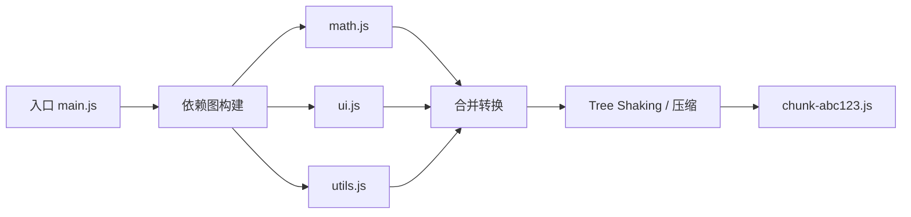

## 前置知识

- [JavaScript 模块化](/javascript/038-JavaScriptModular)：理解 import/export 的语义是本文的前提。

## 学习目标

- 说出打包器的三个核心步骤：构建模块图、转换合并、优化输出；
- 解释 Tree Shaking 为什么只能作用于 ESM 静态结构；
- 会用 `sideEffects` 声明副作用，能识别摇树失效的四种常见写法。

## 一句话理解

打包器把"浏览器无法直接运行的模块文件"合并成"浏览器能直接运行的 chunk"（chunk 即打包产物中的代码块，一个页面可能按需加载多个 chunk）；Tree Shaking 则是在合并时识别并删除**从未被使用的导出**，让产物更小。

为什么生产环境仍然要打包？浏览器原生 ESM 虽然可用，但一个模块一个请求，上百个模块意味着上百次往返；此外压缩、摇树、代码分割这些优化，都需要"先看清整个模块图"才做得出来——原生加载模式下浏览器只能拿到一个文件再决定下一个请求，无法全局统筹。

## 打包器做了什么：三步

1. **解析模块图**：从入口（entry）出发，追踪每个 `import`，形成依赖树（依赖图）；
2. **转换与合并**：把各模块转成目标语法的代码，按引用关系拼接进 chunk；
3. **优化输出**：压缩、Tree Shaking、代码分割（拆成多个 chunk）、内容哈希命名。



```javascript
// 入口 main.js
import { add } from './math.js';
console.log(add(1, 2));

// math.js 导出了两个函数
export function add(a, b) { return a + b; }
export function sub(a, b) { return a - b; } // 从未被引用
```

打包器静态分析后发现 `sub` 没有被引用，最终产物等价于：

```javascript
function add(a, b) { return a + b; }
console.log(add(1, 2));   // 3
```

关键在"静态分析"四个字：**不运行代码**，只看文本结构就能确定"谁被谁引用"。这是 ESM 独有的能力——`import`/`export` 是语法层面的固定结构，不能写在 `if` 里；而 CommonJS 的 `require('./a' + name)` 连模块路径都要到运行时才知道，分析从根上就不成立。

## Tree Shaking 的三个前提

| 前提 | 说明 |
| --- | --- |
| 使用 ESM | `import`/`export` 是静态结构，打包器能在编译期分析 |
| 模块无副作用 | 顶层代码不能有"执行即产生效果"的语句，否则删除导出可能改变行为 |
| 构建工具开启 | Vite/Rollup/Webpack 生产模式默认开启，配合压缩器完成最后清理 |

第二个前提最容易被忽视。"副作用"指的是模块被 import 时**除导出定义之外**的行为：写全局变量、注册事件、改原型等。

```javascript
// 反例：顶层副作用让模块"不可安全删除"
export const version = '1.0.0';
console.log('module loaded');   // 打包器不敢删除未使用的 version——删了这行还执行吗？只能保守保留

// 正确姿势：副作用收进函数，由调用方显式触发
export const version = '1.0.0';
export function init() { console.log('module loaded'); }
```

## sideEffects 字段：显式声明

`package.json` 里的 `sideEffects` 是库作者与打包器的"合同"，明确声明哪些文件有副作用：

```json
{
  "name": "my-lib",
  "sideEffects": [
    "**/*.css"
  ]
}
```

含义："除 CSS 文件外，我所有的模块都无副作用，未使用的导出可以放心删"。两种常用写法：

- `"sideEffects": false`：整个包都无副作用（大胆摇树）；
- 数组形式：列出的文件保留，其余可摇。

经典事故警示：把 `false` 顺手写成全局，而包里某个文件 import 了 CSS——打包器把"仅 import 不使用"的 CSS 判为死代码删除，出现**代码没报错、样式全没了**的线上问题。所以样式文件务必列入 `sideEffects` 数组。

## 识别摇树失效的常见写法

```javascript
// 1. 从对象上取方法：打包器无法静态确定 bar 是否被用
import * as foo from './foo.js';
const bar = foo.bar;

// 2. 动态拼接的导入路径：模块图都画不出来
const lib = await import('./modules/' + name);

// 3. CommonJS 混用：require 是运行时行为
const { x } = require('./legacy.js');

// 4. 副作用型 polyfill：import 本身就是目的，永远不可删
import './polyfill.js';
```

正确姿势：具名导入（`import { bar } from './foo.js'`）、固定路径、库的 ESM 版本（很多库同时发布 `main`（CJS）与 `module`/`exports`（ESM）入口，打包器会优先取 ESM 入口）。

## 与代码分割的配合

Tree Shaking 是"减掉不用的"，代码分割是"把要用的拆成按需加载"。二者互补：

- **静态 import**：进入主 chunk，首屏可用，参与摇树；
- **动态 `import()`**：单独成 chunk，用到才加载（路由级懒加载的标准做法）；
- **公共块提取**：多个页面共享的模块抽成公共 chunk，利用缓存。

更进一步的产物体积优化来自打包器的**作用域提升**（scope hoisting）：合并时把模块拼进同一作用域，减少一层层函数包裹，让压缩器有更大空间做变量改名与死代码消除。

## 常见误解

| 误解 | 真相 |
| --- | --- |
| Tree Shaking 等于压缩 | 压缩只做局部删除和改名；摇树做的是跨模块的引用级删除 |
| CommonJS 也能摇树 | CJS 的 `require` 是运行时行为，绝大多数情况摇不动 |
| 动态 import 越多越好 | 动态 import 生成独立 chunk，按需加载更好，但过度拆分会增加请求数 |
| 只要用了 ESM 就一定能摇掉 | 顶层副作用、`export *`、对象属性访问都会削弱摇树效果 |

## 小结

打包是"模块图 → chunk"的流水线，Tree Shaking 是其中一道静态分析优化。

初学者记住三点：打包器先画依赖图再合并输出；摇树只能摇"ESM + 无副作用"的未使用导出；按需引入库不等于产物一定变小，要看摇树是否真的生效。

进阶者还需注意：发布库时写全 `exports` 与 `sideEffects` 字段，并用 `rollup-plugin-visualizer` 之类工具审查产物构成；排查"体积没变小"问题时，优先检查依赖包的入口格式是否为 CJS。

## 核心知识点

> 一句话记住打包：入口 → 依赖图 → Tree Shaking → 代码分割 → 压缩输出；`import` 静态分析让无用代码被移除，动态 `import()` 做按需加载。

- 打包器：Webpack/Vite/Rollup/esbuild；
- 入口与输出：entry → bundle/chunk；
- 代码分割：多入口、动态 import、公共块提取；
- Tree Shaking：删除未使用的导出（依赖 ESM 静态结构 + 无副作用）；
- `sideEffects` 标记：告诉打包器模块是否安全裁剪，样式文件必须列出；
- 产物优化：压缩、内容哈希、按路由分包、作用域提升。

## 动手试试

1. 观察 Vite 构建输出，找到按路由拆分的 chunk 与内容哈希命名；
2. 把一个 `import _ from 'lodash'` 改为 `import debounce from 'lodash-es/debounce'`，对比产物大小；
3. 在 `math.js` 里加一行顶层 `console.log`，重新构建，观察 `sub` 是否还能被摇掉；
4. 进阶挑战：用 `rollup-plugin-visualizer` 生成产物分析图，找出最大的三个依赖。

## 注意事项与改进建议

| 问题点 | 说明 | 改进方案 |
| --- | --- | --- |
| Tree Shaking 失效 | 副作用或 CJS | 使用 ESM + sideEffects 配置 |
| 单包过大 | 首屏慢 | 代码分割 + 懒加载 |
| 循环依赖 | 运行时变量为 undefined | 重构依赖方向，把共享逻辑抽到更底层模块 |

## 扩展学习

- 模块：`javascript/038-JavaScriptModular`；
- 动态导入：`javascript/039-ModuleDynamicImportCodeSplitting`；
- 构建工具：`vite/001-ViteOverview`。
