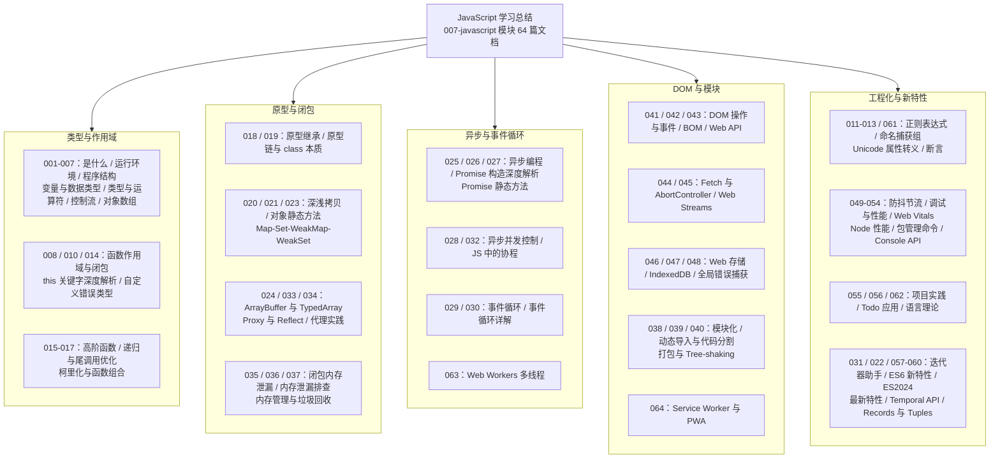

JavaScript 模块共 64 篇文档，从"JavaScript 是什么"讲到 Service Worker 与 PWA。这篇总结把全部内容收拢为一张知识地图，并用"虚拟歌手音乐平台"这一贯穿领域重写核心示例：歌姬对象与原型链、播放计数器的闭包、异步拉取歌单、事件委托的播放列表、ES Modules 的代码分割——每个示例都使用 const、箭头函数、async/await 等现代惯用写法。读完本文，你应该能对着一段 JS 代码口算出它的执行顺序。

## 前置知识

- [JavaScript 是什么：你的第一门编程语言](/javascript/001-WhatIsJavaScript)：语言定位、运行环境与第一行代码。
- [变量与数据类型](/javascript/004-VariableDataType)：let/const/var、原始类型与引用类型的分野。
- [程序结构与基本语法](/javascript/003-ProgramStructureBasicSyntax)：语句、块与注释的最小语法闭环。

## 学习目标

1. 说清原始类型与引用类型的复制、传参与相等比较差异，避免共享引用带来的副作用。
2. 用作用域链与词法环境解释闭包的成因，并能识别闭包导致的内存滞留。
3. 讲述原型链如何支撑属性查找与继承，说明 class 只是构造函数加原型的语法糖。
4. 口算"同步代码、微任务、宏任务"的执行顺序，并用 Promise.all 正确组织并发。
5. 用事件委托与模块化组织一个中等规模的前端页面，理解 Tree-shaking 的前提。

## 知识地图



## 核心概念回顾

### 1. 变量声明与类型系统

现代 JavaScript 只用 `const` 与 `let`：默认 `const`，确需重新赋值才用 `let`，`var` 因函数作用域与变量提升的历史包袱应彻底退役。类型层面要牢记"七种原始类型按值复制，对象按引用共享"：把对象赋给另一个变量时复制的是引用，两个变量指向同一份内存，一处修改处处可见。深浅拷贝、`Object.freeze`、`structuredClone` 都是为这一语义服务的补救工具。

```javascript
// 1. const 优先：声明后不再重新绑定的一律用 const
const platformName = '虚拟歌手音乐平台';

// 2. let 只用于确需重新赋值的量
let totalPlays = 0;

// 3. 原始类型按值复制，对象按引用共享
const singer = { name: '初音未来', themeColor: '#39C5BB' };
const sameSinger = singer;           // 复制的是引用，不是对象本身
sameSinger.themeColor = '#31C6C0';   // 两处看到的是同一次修改

// 4. 块级作用域：let 的 i 每轮循环都是一个新绑定
for (let i = 0; i < 3; i++) {
  totalPlays += i + 1;
}
console.log(`${platformName} 共 ${totalPlays} 次试听`);
```

### 2. 函数、作用域与 this

函数是 JS 的一等公民：可赋值、可传参、可返回。作用域由词法结构决定——函数在定义时就记住了它能访问哪些变量。`this` 则不同，它由"调用方式"决定：方法调用指向调用者，普通调用在严格模式下是 `undefined`，箭头函数没有自己的 `this`，沿用定义处的词法 `this`。模块 010 篇的结论可以浓缩为一句：箭头函数适合回调，普通函数适合对象方法。

```javascript
// 1. 普通函数作为对象方法：this 指向调用者
const concert = {
  title: 'MAGICAL MIRAI',
  open() {
    return `${this.title} 现已开演`;   // this === concert
  },
};

// 2. 箭头函数没有自己的 this，沿用外层词法作用域
const fanclub = {
  name: '39 团',
  members: ['小林', '佐藤'],
  greetAll() {
    // 3. 方法内用箭头函数：this 仍是 fanclub，而非回调调用者
    this.members.forEach((m) => console.log(`${m} 欢迎来到 ${this.name}`));
  },
};

console.log(concert.open());
fanclub.greetAll();
```

### 3. 闭包：函数记住它的出生地

闭包是函数与其定义时词法环境的组合：内层函数引用外层变量时，即使外层函数已返回，这些变量依然存活。闭包实现了私有状态（外部无法直接访问）、柯里化、防抖节流等大量模式；代价是被引用的变量无法被回收，滥用会造成内存滞留。模块 035 篇给出的排查手段是：用 DevTools 的内存面板对闭包持有的对象做堆快照比对。

```javascript
// 1. 工厂函数返回的对象方法记住了创建时的词法环境
function createPlayCounter(songTitle) {
  let plays = 0;                    // 2. 私有变量：外部无法直接读写
  return {
    play() {
      plays += 1;                   // 3. 闭包让 plays 跨调用存活
      return `${songTitle} 第 ${plays} 次播放`;
    },
    getPlays: () => plays,          // 4. 只读出口，不暴露可变状态
  };
}

const melt = createPlayCounter('Melt');
console.log(melt.play());           // Melt 第 1 次播放
console.log(melt.play());           // Melt 第 2 次播放
console.log(`累计：${melt.getPlays()} 次`);
```

### 4. 原型与 class 的本质

JavaScript 没有"类模板复制实例"的机制，只有对象到对象的原型链接：读取属性时沿 `[[Prototype]]` 链逐级查找，直到 `null`。ES6 的 `class` 只是构造函数加原型的语法糖——方法仍然挂在 `prototype` 上，实例之间共享同一份方法。理解这一点后，`instanceof`（检查构造函数的 `prototype` 是否在原型链上）、继承（链接两个原型）都不再是黑盒。

```javascript
// 1. class 本质是构造函数加原型：方法共享于 prototype
class VSinger {
  constructor(name, themeColor) {
    this.name = name;
    this.themeColor = themeColor;
  }
  introduce() {                     // 2. 定义在原型上，所有实例共享
    return `我是 ${this.name}，应援色 ${this.themeColor}`;
  }
}

// 3. extends 建立原型链，super 沿链向上查找
class FanClubStar extends VSinger {
  introduce() {
    return `${super.introduce()}，粉丝团已集结`;
  }
}

const miku = new FanClubStar('初音未来', '#39C5BB');
console.log(miku.introduce());
// 4. 验证原型本质：实例的原型就是类的 prototype
console.log(Object.getPrototypeOf(miku) === FanClubStar.prototype); // true
```

### 5. Promise 与 async/await

Promise 是"未来值"的一等表示：对象一旦落定为 fulfilled 或 rejected，状态不可再变，`then` 注册的回调进入微任务队列。`async/await` 是 Promise 的语法糖：`await` 暂停当前 async 函数但不阻塞主线程，之后的代码相当于注册在 Promise 上的回调。组织并发的关键是 `Promise.all`（全部成功才成功）与 `allSettled`（容忍部分失败），而不是在循环里逐个 `await` 造成串行等待。

```javascript
// 1. 用 Promise 包装异步任务：resolve 走成功路径，reject 走失败路径
function fetchSong(id) {
  return new Promise((resolve, reject) => {
    setTimeout(() => {
      id > 0 ? resolve({ id, title: `song-${id}` })
             : reject(new Error('歌曲编号非法'));
    }, 100);
  });
}

// 2. await 让异步代码获得同步的书写顺序，但执行仍是异步的
async function loadSetlist() {
  try {
    // 3. Promise.all 并行请求，总耗时约等于最慢的一个请求
    const songs = await Promise.all([fetchSong(1), fetchSong(2)]);
    return songs.map((s) => s.title);
  } catch (err) {
    // 4. 链上任意一步失败都会被 catch 捕获
    console.error('歌单加载失败：', err.message);
    return [];
  }
}

loadSetlist().then(console.log);   // ['song-1', 'song-2']
```

### 6. 事件循环：单线程的调度艺术

JavaScript 主线程单线程运行，异步能力来自宿主提供的事件循环：同步代码执行完毕后，先清空全部微任务（Promise 回调、`queueMicrotask`、`MutationObserver`），再取一个宏任务（`setTimeout`、I/O 回调）执行，如此循环；浏览器还会在合适时机穿插渲染。推论有三：微任务总在下一个宏任务之前执行；`setTimeout(fn, 0)` 不是零延迟；长任务会阻塞渲染，需要切片或交给 Web Worker。

```javascript
// 1. 宏任务：setTimeout 的回调进入宏任务队列
setTimeout(() => console.log('3. 宏任务：演唱会开场'), 0);

// 2. 微任务：Promise 回调进入微任务队列，同步代码结束后立即清空
Promise.resolve().then(() => console.log('2. 微任务：检票进场'));

// 3. 同步代码最先执行
console.log('1. 同步代码：观众到齐');

// 4. 输出顺序恒为 1 -> 2 -> 3，这就是事件循环的调度规则
```

### 7. DOM 操作与事件委托

DOM 是浏览器把 HTML 解析成的节点树，操作 DOM 是前端性能开销的大头。原则是"批量读、批量写"：避免在同一次流程里交替读写布局属性（强制同步回流）。事件委托把子元素的监听收敛到父节点：利用事件冒泡，在父节点上判断真实来源（`event.target`），动态增删的子节点无需重新绑定监听。

```javascript
// 1. 查询播放列表容器
const list = document.querySelector('#setlist');

// 2. 事件委托：只在父节点绑定一次监听
list.addEventListener('click', (event) => {
  // 3. closest 沿祖先链找到列表项，未命中则忽略
  const item = event.target.closest('li');
  if (!item) return;
  item.classList.toggle('playing');              // 4. 切换样式类
  console.log(`切换播放：${item.dataset.title}`);
});

// 5. 后插入的子节点同样被委托监听覆盖，无需重新绑定
const li = document.createElement('li');
li.dataset.title = 'Tell Your World';
li.textContent = 'Tell Your World';
list.append(li);
```

### 8. 模块化：从全局污染到 Tree-shaking

ES Modules 是语言原生模块：每个模块有独立作用域，顶层 `export/import` 显式声明依赖，依赖图在加载时静态解析，因此打包器可以做 Tree-shaking（删除未引用的导出）与代码分割（按路由或交互懒加载）。动态 `import()` 返回 Promise，是实现"首屏只加载必需代码"的关键手段；模块顶层还可以直接 `await`（Top-level await）。

```javascript
// player.js —— 1. 命名导出：一个模块可以有多个导出
export function play(song) {
  return `正在播放：${song.title}`;
}

// index.js —— 2. 静态导入在加载期解析依赖图，可被 Tree-shaking 分析
import { play } from './player.js';

// 3. 动态 import 返回 Promise，按需加载舞台模块并自动代码分割
async function openStage() {
  const { default: stage } = await import('./stage.js');
  return stage;
}

console.log(play({ title: 'Melt' }));   // 正在播放：Melt
void openStage;
```

### 9. 内存管理与垃圾回收

JS 引擎用可达性做垃圾回收：从根（全局对象、当前调用栈）出发能引用到的对象不可回收，引用不到的交给 GC。这解释了两类经典泄漏：被全局变量或闭包长期持有的 DOM 引用，以及忘记清除的定时器与事件监听。防御手段是"用完即断"：`removeEventListener`、`clearTimeout`、把不再需要的引用置 `null`，必要时用 `WeakMap/WeakRef` 持有弱引用。

## 易混淆概念对比

### null vs undefined

| 维度 | undefined | null |
| --- | --- | --- |
| 语义 | 系统级"还没有值" | 代码级"刻意置空" |
| 出现场景 | 未赋值变量、缺失参数、未 return 的函数 | 手动清空引用、API 约定的空值 |
| 类型 | `typeof` 得到 `"undefined"` | `typeof` 得到 `"object"`（历史包袱） |
| 参与算术 | `1 + undefined` 得到 `NaN` | `1 + null` 得到 `1`（当 0 用） |
| 相等比较 | `null == undefined` 为 true | `null === undefined` 为 false |
| 典型判断 | `if (x === undefined)` 检查未初始化 | `if (x === null)` 检查显式空 |
| 建议用法 | 不主动写 undefined 赋值 | 主动表示"无对象"时使用 |

### var vs let vs const

| 维度 | var | let | const |
| --- | --- | --- | --- |
| 作用域 | 函数作用域 | 块级作用域 | 块级作用域 |
| 变量提升 | 提升并初始化为 undefined | 提升但不初始化（暂时性死区） | 同 let |
| 重复声明 | 允许 | 报错 | 报错 |
| 重新赋值 | 允许 | 允许 | 禁止（对象属性仍可改） |
| 循环闭包行为 | 每轮共享一个绑定（经典陷阱） | 每轮新建绑定 | 每轮新建绑定 |
| 现代建议 | 不再使用 | 需要重新赋值时使用 | 默认选择 |

## 常见误区与排查

### 误区 1：var 循环里的闭包共享同一个变量

```javascript
// 错误：var 是函数作用域，三个回调共享同一个 i，输出 3 3 3
for (var i = 0; i < 3; i++) {
  setTimeout(() => console.log(`第 ${i} 首歌`), 0);
}
```

```javascript
// 修正：let 让每轮循环都创建一个新绑定，输出 0 1 2
for (let i = 0; i < 3; i++) {
  setTimeout(() => console.log(`第 ${i} 首歌`), 0);
}
```

### 误区 2：回调里丢失 this

```javascript
// 错误：普通函数回调的 this 不再指向 fanclub
const fanclub = {
  name: '39 团',
  greet() {
    this.members.forEach(function (m) {
      console.log(`${this.name} 欢迎 ${m}`);   // this 是 undefined
    });
  },
  members: [],
};
```

```javascript
// 修正：箭头函数沿用定义处的词法 this
const fanclub = {
  name: '39 团',
  members: ['小林'],
  greet() {
    this.members.forEach((m) => console.log(`${this.name} 欢迎 ${m}`));
  },
};
fanclub.greet();
```

### 误区 3：在循环里逐个 await 造成串行

```javascript
// 错误：每个请求都等上一个完成，总耗时是所有请求之和
async function loadAll(ids) {
  const songs = [];
  for (const id of ids) {
    songs.push(await fetchSong(id));   // 串行等待
  }
  return songs;
}
```

```javascript
// 修正：先用 map 生成 Promise，再用 Promise.all 一次性并发
async function loadAll(ids) {
  const tasks = ids.map((id) => fetchSong(id));   // 同时发出
  return Promise.all(tasks);                      // 总耗时约等于最慢的一个
}
```

### 误区 4：浅拷贝后修改嵌套对象

```javascript
// 错误：展开运算符只拷贝第一层，嵌套对象仍是共享引用
const singer = { name: '初音未来', profile: { debut: 2007 } };
const copy = { ...singer };
copy.profile.debut = 9999;       // 原对象也被改掉了
console.log(singer.profile.debut); // 9999
```

```javascript
// 修正：需要独立副本时使用深拷贝
const singer = { name: '初音未来', profile: { debut: 2007 } };
const copy = structuredClone(singer);   // 原生深拷贝
copy.profile.debut = 9999;
console.log(singer.profile.debut);      // 2007，原对象不受影响
```

### 误区 5：用 == 做隐式类型比较

```javascript
// 错误：== 触发隐式转换，规则晦涩且易错
console.log(0 == '');      // true
console.log('1' == 1);     // true
```

```javascript
// 修正：一律使用全等，需要转换时显式写出来
console.log(0 === '');     // false
console.log(Number('1') === 1);   // true，转换意图明确
```

### 误区 6：忘记清理定时器与监听器

```javascript
// 错误：组件销毁后定时器仍持有引用，闭包与 DOM 都无法回收
function startTicker() {
  setInterval(() => updateProgressBar(), 1000);   // 返回值被丢弃
}
```

```javascript
// 修正：保存句柄，在适当时机清理
let tickerId = null;
function startTicker() {
  tickerId = setInterval(updateProgressBar, 1000);
}
function stopTicker() {
  clearInterval(tickerId);   // 离开页面前调用，切断引用链
  tickerId = null;
}
function updateProgressBar() { /* 更新播放进度条 */ }
```

## 自检清单

- [ ] 能解释原始类型与引用类型在赋值、传参、相等比较上的行为差异
- [ ] 能用词法环境说清闭包的成因，并用堆快照定位闭包导致的内存滞留
- [ ] 能说明 class 与构造函数加原型的等价关系，并手写 `Object.create` 实现继承
- [ ] 能口算同步代码、微任务、宏任务混排的输出顺序
- [ ] 能正确使用 `Promise.all/allSettled/race` 组织并发请求
- [ ] 能用事件委托把动态列表的监听收敛到一个父节点
- [ ] 能区分 ESM 的静态导入与动态 `import()`，说出 Tree-shaking 的生效前提
- [ ] 能列出三种常见内存泄漏（全局引用、遗忘的定时器、闭包持有 DOM）及排查方法
- [ ] 能说出 `const` 对象属性仍可修改的原因，并用 `Object.freeze` 或 `structuredClone` 应对
- [ ] 能用 `defer` 与 `<script type="module">` 控制脚本的加载与执行时机

## 后续学习路径

1. 精读 [事件循环详解](/javascript/030-EventLoopDetailed) 与 [Promise 构造函数深度解析](/javascript/026-PromiseConstructorDeepDive)，把执行模型焊死在脑子里。
2. 进入 [内存管理与垃圾回收](/javascript/037-MemoryManagementAndGarbageCollection) 与 [内存泄漏排查](/javascript/036-MemoryLeakTroubleshoot)，掌握 DevTools 内存面板的完整用法。
3. 学习 [Fetch API 与 Web Streams](/javascript/045-FetchApiWebStreams) 与 [IndexedDB](/javascript/047-IndexedDBADatabaseInYourBrowser)，给音乐平台补上离线缓存能力。
4. 用 [Web Workers 多线程](/javascript/063-WebWorkersMultithreading) 把歌词解析搬出主线程，再以 [Service Worker 与 PWA](/javascript/064-ServiceWorkerPWA) 实现整站离线可用。
5. 以 [JavaScript 项目实战：Todo 应用](/javascript/056-JavaScriptProjectExampleTodoApp) 与 [调试与性能优化](/javascript/050-DebugPerformanceOptimization) 收官，完整走一遍开发、性能度量与上线流程；随后即可进入 TypeScript 模块。
