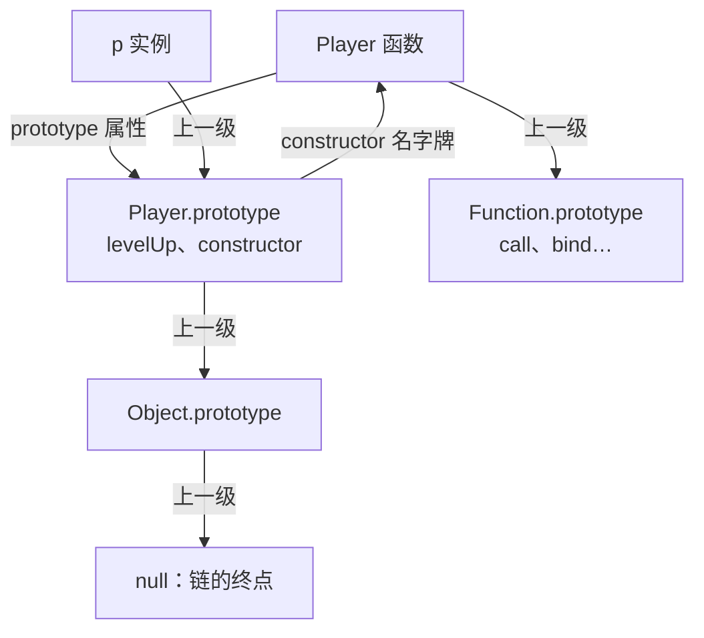

> 分工声明：[原型与继承](/javascript/180-JavaScriptPrototypeInheritance)（180）搭心智模型——方法共享、查找上溯、new 四步、class 对照；本篇拆机制——prototype、\_\_proto\_\_、constructor 三角、Object.create 与 setPrototypeOf、继承演进、遮蔽与删除边界、instanceof 真相。两篇实验不重复。

## 前置知识

- **已读完 [原型与继承](/javascript/180-JavaScriptPrototypeInheritance)**：硬性前置。本篇默认你会用「构造函数 + prototype 挂方法」共享行为、能用 Object.getPrototypeOf 验证连线、记得 new 四步与「读沿链上溯、写只写自己」；
- 已完成 [this 关键字](/javascript/100-ThisKeywordDeepDive)：call 的显式绑定是本篇「借用构造函数」的工具，super 是它的亲戚。

概念全部在 180 出现过，这里只做推演、边界与判定，没读 180 请先回去。示例在 Node 里跑，每个都先预测再看输出。

## 学习目标

读完本文你将能够：

1. 白纸画出 prototype、\_\_proto\_\_、constructor 三角关系，解释 p.constructor 为什么是「查出来的」；
2. 说出 Object.create 与 setPrototypeOf 的分界，以及后者为什么被文档劝退；
3. 解释三种继承写法里属性和方法各从哪来，Parent 构造各跑几次；
4. 预测遮蔽与 delete 的边界行为，包括「delete 删不动原型」与「只有 getter 时赋值报错」；
5. 手写 instanceof，解释失效场景并给出替代判定。

预计 75 到 90 分钟，含 3 组修改实验与 3 道练习。

## 1. 你现在要解决什么问题

180 篇立住了心智模型：实例连着构造函数的 prototype 样板间。但你调试时在控制台展开一个对象，会看到 \_\_proto\_\_ 一层层套下去，旁边还有个 constructor 指着某个函数——这三个名字到底谁是谁的属性？说不清这张图，原型 bug 就只能瞎猜。

先做一组「先预测再运行」的等式，把盲区暴露出来：

```javascript
function Player() {}
const p = new Player();

console.log(p.constructor === Player);                             // 预测一
console.log(Player.prototype.constructor === Player);              // 预测二
console.log(Object.getPrototypeOf(p) === Player.prototype);        // 预测三
console.log(Object.getPrototypeOf(Player) === Function.prototype); // 预测四
```

预期输出（写完四个预测再看）：

```text
true
true
true
true
```

前三行用 180 篇的世界观能推出来；第四行是盲区——**函数自己也有「上一级」**。Player 明明是被 new 的那一方，它挂在谁下面？带着四个 true，进入三角关系。

## 2. 三角关系完整推演

三个名字，三种身份：

| 名字 | 它是什么 | 谁身上有 | 标准用法 |
| --- | --- | --- | --- |
| prototype | 函数的「样板间」属性 | 只有普通函数和 class 有；箭头函数没有，所以当不了构造函数 | new 时充当新实例的上一级 |
| \_\_proto\_\_ | 对象的「上一级」指针，规范名叫 \[\[Prototype\]\] 内部槽 | 每个对象都有 | 读用 Object.getPrototypeOf；\_\_proto\_\_ 是历史遗留 getter，别写进新代码 |
| constructor | 样板间上的「名字牌」属性 | 函数的 prototype 对象上 | 调试与反射时看 |



逐条推演（接着第 1 节的代码跑）：

```javascript
console.log(Object.getPrototypeOf(p) === Player.prototype);                  // 实例连样板间
console.log(Player.prototype.constructor === Player);                        // 名字牌写着自己
console.log(p.constructor === Player);                                       // p 自己有这块牌吗？
console.log(Object.getPrototypeOf(Player) === Function.prototype);           // 函数的上一级
console.log(Object.getPrototypeOf(Player.prototype) === Object.prototype);   // 样板间也是对象
console.log(Object.getPrototypeOf(Object.prototype));                        // 链的终点
```

预期输出：

```text
true
true
true
true
true
null
```

两条关键推演：

1. **p.constructor 是查出来的，不是自带的**。p 自己没有 constructor，沿链上溯在 Player.prototype 命中——180 篇的「读沿链上溯」第一次显出威力；
2. **函数也有上一级**。函数是对象，所以 Player 也挂在 Function.prototype 下——第四个等式的谜底。call、bind 这些「函数才有的方法」就住在这间样板间里，任何函数都能点出来。

名字牌会出事。看一个换样板间的操作：

```javascript
function Mage() {}
Mage.prototype = { cast() { return '火球术'; } };   // 整个换掉样板间

const m = new Mage();
console.log(m.cast());          // 火球术：功能正常
console.log(m.constructor);     // [Function: Object]：名字牌不认 Mage 了
```

换上去的字面量自己没有名字牌，沿链上溯到 Object.prototype 才找到，找到的是 Object 的。修复一行：`Mage.prototype = { constructor: Mage, cast() { … } }`。顺带一提，class 根本不许换 prototype，这类坑在 class 世界不存在——语法糖还有护栏价值。

## 3. Object.create 与 setPrototypeOf：接链的两条路

**Object.create(proto)：创建时就指定上一级**。不想造构造函数、只想让某对象挂到另一对象下面时用它：

```javascript
const actions = {
  attack() { return this.name + ' 挥剑'; },
};

const hero = Object.create(actions);   // 创建时接链
hero.name = '小明';

console.log(hero.attack());                             // 小明 挥剑：方法沿链找到
console.log(Object.getPrototypeOf(hero) === actions);   // true：验证连线
```

特殊用法——纯净字典：

```javascript
const dict = Object.create(null);   // 上一级是 null：连 Object.prototype 都没有
dict.gold = 100;

console.log(dict.toString);          // undefined：连 toString 都没有
console.log('constructor' in dict);  // false：普通对象这里永远是 true
```

拿对象当纯键值表、又怕键名和原型属性纠缠时用它，日常键值表优先 Map。

**Object.setPrototypeOf(obj, proto)：给已有对象换上一级**：

```javascript
const base = { greet() { return 'hello'; } };
const obj = { name: 'test' };

Object.setPrototypeOf(obj, base);   // 事后改链
console.log(obj.greet());           // hello：照样能用
```

能干成事，但**代价大**：引擎按「形状」缓存属性访问优化，事后换原型等于宣布缓存作废，之后每次访问都退回慢速路径，MDN 的原话是「性能严重缓慢」。创建时定链（Object.create、new、class）没有任何代价。经验法则：**业务代码里出现 setPrototypeOf 基本是设计味道**。它还有条底线：原型不许成环。

```javascript
const a = {};
const b = Object.create(a);
Object.setPrototypeOf(a, b);   // a 的上一级想设成 b，而 b 在 a 下面
```

真实报错（Node 原文）：

```text
TypeError: Cyclic __proto__ value
```

180 篇调试实录里是「引用成环，打印炸」；这里是「原型成环，查找会永动」，引擎当场拒绝。

## 4. 继承模式演进：从手工到糖衣

需求：法师 Mage 要玩家的全部能力（name、bag、levelUp），再加 mana。三种做法按历史顺序上桌。本节示例共用这一个 Player（存进同一文件跑）：

```javascript
function Player(name) {
  this.name = name;
  this.bag = [];
}
Player.prototype.levelUp = function () { this.level = (this.level || 1) + 1; };
```

**做法一：借用构造函数**。100 篇的显式绑定派上用场——借 Player 的函数体给 Mage 的 this 跑一遍：

```javascript
function Mage(name) {
  Player.call(this, name);   // 属性：借函数体
  this.mana = 100;
}

const m1 = new Mage('小明');
console.log(m1.name, m1.mana);   // 小明 100：属性齐了
console.log(m1.levelUp);         // undefined：方法一个都没跟来
```

属性齐了，方法全丢——原型上的 levelUp 不在这条链上，法师升不了级。

**做法二：组合寄生**。属性靠 call，方法靠 Object.create 接链，两件事各归其位：

```javascript
function inherit(Child, Parent) {
  Child.prototype = Object.create(Parent.prototype);   // 接方法链：不调用 Parent，零副作用
  Child.prototype.constructor = Child;                 // 名字牌修回（第 2 节的坑）
}

function Mage(name) {
  Player.call(this, name);   // 属性：借用构造函数
  this.mana = 100;
}
inherit(Mage, Player);       // 方法：一条链接过去

const m2 = new Mage('小明');
m2.levelUp();
console.log(m2.level);          // 2：升级成功
console.log(m2 instanceof Mage, m2 instanceof Player);   // true true：两级身份都认
```

`m2 instanceof Player` 为 true 不是巧合：instanceof 沿链找 Player.prototype，而 Mage.prototype 的上一级正是它。代价是四行仪式代码：手工接链、手工修牌，每个类来一遍。

**做法三：class extends + super**。同样的需求，糖衣版。注意 extends 后面接的就是本节开头那个普通函数 Player——能接住，恰恰说明 class 和函数是同一种东西：

```javascript
class Mage extends Player {
  constructor(name) {
    super(name);          // 等价于 Player.call(this, name)，链由引擎接好
    this.mana = 100;
  }
  fireball() { return this.name + ' 丢火球，蓝 ' + this.mana; }
}

const m3 = new Mage('小明');
m3.levelUp();
console.log(m3.level, m3.fireball());   // 2 小明 丢火球，蓝 100
```

机制拆解——extends 接了**两条链**：

```javascript
console.log(Object.getPrototypeOf(Mage.prototype) === Player.prototype);   // true：实例方法链
console.log(Object.getPrototypeOf(Mage) === Player);                       // true：静态方法链
```

第一条让 m3 能用 levelUp（180 篇的样板间链）；第二条让 Mage 能用 Player 的静态方法——class 也是对象，也挂链。super 的机制一句话：**super.方法() 是「到我的样板间的上一级去找这个方法，但 this 仍是当前实例」**：

```javascript
class Hero {
  describe() { return '玩家 ' + this.name; }
}
class SuperHero extends Hero {
  describe() { return super.describe() + '（法师）'; }
}
console.log(new SuperHero('小明').describe());   // 玩家 小明（法师）
```

describe 定义在 SuperHero.prototype，super.describe 去它的上一级（Hero.prototype）找，找到后 this 还是那个实例——所以名字是「小明」。共享方法（180）、this 指实例（180）、super 沿上一级查（本篇），三块拼图合上了。

| 做法 | 实例属性 | 原型方法 | Parent 构造跑几次 | 主要代价 |
| --- | --- | --- | --- | --- |
| 借用构造函数 | 有 | 全丢 | 1 | 方法无法复用 |
| 组合寄生 | 有 | 沿链共享 | 1 | 手工接链、修名字牌 |
| class extends | 有 | 沿链共享 | 1 | super 之前不能碰 this（第 8 节） |

结论：**class 不是新发明，是把做法二机器化**——180 篇说它是语法糖，本篇你看到了糖纸下面的机器。

## 5. 属性遮蔽与删除的边界情况

180 篇的「写只写自己」到这里补齐边界：

```javascript
'use strict';

const base = { gold: 50, rank: '青铜' };
const p = Object.create(base);

p.gold = 999;                     // 写：落在 p 自己身上，这叫遮蔽
console.log(p.gold, base.gold);   // 999 50：原型毫发无损

delete p.gold;                    // 删掉自己的遮蔽层
console.log(p.gold);              // 50：原型重新露出来

delete p.rank;                    // p 自己根本没有 rank，这行删了个寂寞
console.log(delete p.rank);       // true：返回 true 只表示「没炸」
console.log(p.rank);              // 青铜：原型属性安然无恙

console.log('rank' in p, Object.hasOwn(p, 'rank'));   // true false：in 沿链，hasOwn 只看自有
```

三条边界，各配一句记法：

1. **delete 只删自有属性，永远删不动原型**。返回 true 只表示「表达式没炸」，别当「删掉了」的证据；
2. **in 沿链查，Object.hasOwn 只看自有**。判断「是不是它自己带的」用后者；
3. **赋值不一定遮蔽**：原型属性若是访问器，赋值走 setter 而不是新建自有属性——「写只写自己」遇到访问器要改口，写会先问原型的 setter，只有 getter 时直接报错：

```javascript
'use strict';

const monster = {
  get hp() { return this._hp ?? 100; },   // 只有 getter，没有 setter
};

const m = Object.create(monster);
m.hp = 10;    // 这行崩
```

真实报错（Node 原文）：

```text
TypeError: Cannot set property hp of #<Object> which has only a getter
```

## 6. instanceof 的真实原理

x instanceof F 回答的问题只有一个：**F.prototype 是否出现在 x 的原型链上**。它不看构造过程，只看链。手写一遍就再也不会误判（沿用第 4 节的 Player 与 Mage）：

```javascript
function myInstanceof(obj, Fn) {
  if (obj === null || (typeof obj !== 'object' && typeof obj !== 'function')) {
    return false;   // 原始值没有原型链可走
  }
  let cur = Object.getPrototypeOf(obj);
  while (cur !== null) {
    if (cur === Fn.prototype) return true;
    cur = Object.getPrototypeOf(cur);
  }
  return false;
}

console.log(myInstanceof(new Mage(), Mage));       // true：自己的样板间
console.log(myInstanceof(new Mage(), Player));     // true：链的下一站
console.log(myInstanceof('hi', String));           // false：原始值没有链可走
```

这就是第 4 节 `m2 instanceof Player` 为 true 的全部原因：Mage.prototype 的上一级是 Player.prototype，逐层比对时命中。对象是 new 出来的还是接出来的，instanceof 一概不问。

## 7. 修改实验

实验一（换样板间的连锁反应）：三个输出各是什么？先预测：

```javascript
function Mage() {}
const oldMage = new Mage();
Mage.prototype = { cast() { return '火球术'; } };
const freshMage = new Mage();

console.log(oldMage instanceof Mage);        // 老实例还认吗？
console.log(freshMage instanceof Mage);      // 新实例呢？
console.log(oldMage.constructor === Mage);   // 老实例的名字牌呢？
```

提示：oldMage 连的是换掉前的那间样板间，而 instanceof 和 constructor 都在「Mage.prototype 当前指向的那间」里找答案。

实验二（组合继承的残留）：把做法二的 inherit 里那行换成 `Child.prototype = new Parent()`，跑起来后验证：

```javascript
console.log(Object.hasOwn(Mage.prototype, 'bag'));   // 原型上有没有 bag？
console.log(Object.hasOwn(m2, 'bag'));               // 实例上呢？
```

两行都是 true：new Player() 给 Mage.prototype 养了一份 name=undefined、bag=[] 的残留，实例自己的属性把它遮住才没出事故。做法二用 Object.create 接链、不调用 Parent，原型干干净净——「寄生」二字就是这个含义，也是 class 内部采用的方案。

实验三（事后接链骗得过 instanceof 吗）：

```javascript
const obj = { name: '野怪' };
Object.setPrototypeOf(obj, Player.prototype);   // Player 沿用第 4 节
console.log(obj instanceof Player);   // 预测？
```

instanceof 只认链，不管链怎么接的——true。但性能代价照付。

## 8. 常见错误与调试实录

**错误一：instanceof 失效。** 报错不是 TypeError，而是「明明是这个类型，判定却是 false」。第 6 节已见第一类（原始值），这里补第二类现场：

```javascript
// null 原型对象：第 3 节的纯净字典
const dict = Object.create(null);
console.log(dict instanceof Object);   // false：链第一站就是 null
```

第三类在第 7 节实验一：prototype 被换掉后，老实例对改后的函数全部失认。浏览器里还有第四类：iframe 里创建的数组，在主页面上 `arr instanceof Array` 是 false——两个页面的 Array.prototype 不是同一个对象。定位三步：读现象（判定 false 但 typeof 说是 object）；问来路（原始值？null 原型？换过 prototype？跨页面？）；换工具：

```javascript
console.log(Array.isArray([1, 2]));                    // true：判数组用它，跨环境也认
console.log(Object.prototype.toString.call([1, 2]));   // [object Array]：返回类型标签
```

**错误二：super 之前摸 this。** class 继承的高频崩点：

```javascript
class Shopkeeper {
  constructor(name) { this.name = name; }
}
class Blacksmith extends Shopkeeper {
  constructor(name) {
    this.hammer = true;   // 第一行就崩
    super(name);
  }
}
new Blacksmith('老王');
```

真实报错（Node 原文）：

```text
ReferenceError: Must call super constructor in derived class before accessing 'this' or returning from derived constructor
```

报错原文把规则说完了：super 跑完前不许碰 this，也不许 return。定位即修复——`super(name)` 提到第一行，再挂自己的属性。机制：this 要等 super 跑完才正式就位，第 4 节「引擎替你接两条链」就发生在 super 里。

## 9. 实际项目中的使用场景

- 自定义错误类（[自定义错误类型](/javascript/140-CustomErrorTypes) 整篇都在讲）：catch 里 `e instanceof NetworkError` 分支处理，靠的是链上有 NetworkError.prototype；
- 读老代码：翻到 `Child.prototype = Object.create(Parent.prototype)` 不再是咒语——接方法链、修名字牌，逐行说得出用途；
- 链深警惕：每长一层，查找多一站、心智多一层。超过三层就该想想「拥有」用组合、「是一种」才用继承。

## 10. 小练习

预测题（5 分钟，先写答案再运行）：

```javascript
class A {}
class B extends A {}
const b = new B();

console.log(Object.getPrototypeOf(b) === B.prototype);
console.log(Object.getPrototypeOf(B.prototype) === A.prototype);
console.log(Object.getPrototypeOf(B) === A);
```

对照（先写再看）：

```text
true
true
true
```

第 4 节两条链的 class 版本——实例方法链和静态方法链，extends 一次接好两条。

挑战题（半小时，不给代码）：写 `myCreate(proto)`，返回一个以 proto 为上一级的新对象。约束：不许用 Object.create 和 Object.setPrototypeOf。验收断言：

```javascript
const actions = { attack() { return '挥剑'; } };
const hero = myCreate(actions);
console.assert(Object.getPrototypeOf(hero) === actions, '上一级应为 actions');
console.assert(hero.attack() === '挥剑', '应继承到 attack');
console.assert(
  Object.getPrototypeOf(Object.getPrototypeOf(hero)) === Object.prototype,
  'actions 的上一级应是 Object.prototype'
);
```

「提示」：new 四步的第二步是把新对象接到 F.prototype——临时函数的 prototype 可以指向任意对象；「展开」：`function F() {} F.prototype = proto; return new F();`，Object.create 出现前的经典写法。

## 11. 与之前和之后的知识的关系

- 往前：[原型与继承](/javascript/180-JavaScriptPrototypeInheritance) 的样板间、上溯、new 四步是本篇所有推演的底座；[this 关键字](/javascript/100-ThisKeywordDeepDive) 的 call 显式绑定在做法一里当主角；
- 往后：[深拷贝与浅拷贝](/javascript/200-DeepShallowCopy) 讲「共享」的反面——什么时候要的不是链上共享而是复制；[ES6+ 新特性](/javascript/220-ES6NewFeatures) 的其余 class 语法可回本篇找机制解释；想接管属性查找和 instanceof 本身，见 [Proxy 与 Reflect](/javascript/330-ProxyAndReflect)。

## 12. 官方文档

- MDN 继承与原型链：https://developer.mozilla.org/zh-CN/docs/Web/JavaScript/Inheritance_and_the_prototype_chain
- Object.create：https://developer.mozilla.org/zh-CN/docs/Web/JavaScript/Reference/Global_Objects/Object/create
- Object.setPrototypeOf：https://developer.mozilla.org/zh-CN/docs/Web/JavaScript/Reference/Global_Objects/Object/setPrototypeOf
- instanceof：https://developer.mozilla.org/zh-CN/docs/Web/JavaScript/Reference/Operators/instanceof
- class：https://developer.mozilla.org/zh-CN/docs/Web/JavaScript/Reference/Classes

## 13. 自我检查

- 能白纸画出三角关系图，并解释 p.constructor === Player 时引擎做了哪几步查找；
- 能说出 Object.create 与 setPrototypeOf 的分界，以及后者被劝退的原因；
- 对三种继承写法，能逐行指出属性从哪来、方法从哪来、Parent 构造跑几次；
- 能预测遮蔽、delete、原型 getter 三个边界场景的行为与报错；
- 能手写 instanceof，并对「原始值、null 原型、换过 prototype、跨 iframe」四类失效给出替代判定。

## 本章总结

prototype 是函数的样板间，\[\[Prototype\]\]（\_\_proto\_\_）是每个对象的上一级指针，constructor 是样板间上的名字牌且靠链查找命中——换掉样板间，名字牌就查到 Object 头上。接链两条路：Object.create 在创建时定链（纯净字典连 Object.prototype 都没有），setPrototypeOf 事后改链但作废引擎优化，业务代码不用它。继承演进三步：借用构造函数只得了属性，组合寄生（call 管属性 + Object.create 接方法链）是 ES5 标准答案，class extends 与 super 把它机器化并接出实例、静态两条链，super 之前不许碰 this。遮蔽与删除的边界：delete 只删自有属性，in 沿链查而 Object.hasOwn 只看自有，原型访问器会让赋值改道甚至报错。instanceof 只问「F.prototype 在不在链上」，原始值、null 原型、换链、跨环境都会让它失认，兜底用 Array.isArray 与 Object.prototype.toString.call。

## 下一步

进入 [深拷贝与浅拷贝](/javascript/200-DeepShallowCopy)：本篇讲透了「共享」——方法挂在链上大家共用，引用赋值让两个名字看同一份数据。下一篇讲它的反面：什么时候你要的不是共享而是复制，浅拷贝为什么挡不住嵌套结构。
