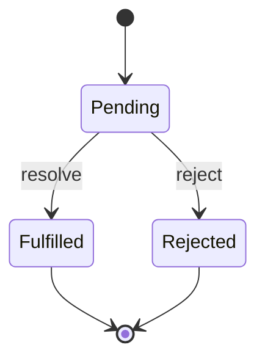

# 网络请求 API

## 前置知识

- [fetch 与 AbortController](/javascript/440-FetchApiAndAbortController)：建议先完成前一篇的学习

## 学习目标

- 掌握「0. 学习导览」的核心机制、典型用法与常见陷阱
- 掌握「1. 历史动机与技术演进」的核心机制、典型用法与常见陷阱
- 掌握「2. 形式化定义」的核心机制、典型用法与常见陷阱
- 掌握「3. Fetch API 基础」的核心机制、典型用法与常见陷阱
- 掌握「4. Request 对象详解」的核心机制、典型用法与常见陷阱


> 本文是 FANDEX JavaScript 模块的核心工程文档之一,定位为 MIT 6.S081 / Stanford CS107 / CMU 15-410 级别的工程教学材料,涵盖 WHATWG Fetch 标准、AbortController 取消语义、Web Streams API、Service Worker 缓存策略、GraphQL 客户端实现等。

## 0. 学习导览

### 0.1 学习路径

```
HTTP 基础 → XMLHttpRequest 演进 → Fetch 标准 → Request/Response/Headers
   → AbortController 取消 → Web Streams API → Service Worker → Cache API
   → 缓存策略 → CORS 与认证 → GraphQL → 重试/熔断/限流 → 生产级框架
```

### 0.2 前置知识

- 熟悉 HTTP/1.1 协议(方法、状态码、头部、报文)
- 理解 Promise 与 async/await
- 了解浏览器同源策略与 CORS
- 掌握基本的事件循环与微任务调度

### 0.3 阅读建议

- 第一遍:Fetch 基础、Request/Response/Headers 三大对象
- 第二遍:AbortController 与 Streams,理解取消与背压
- 第三遍:Service Worker 缓存策略与生产级框架
- 实战:按习题顺序实现超时、重试、并发控制

---

## 1. 历史动机与技术演进

### 1.1 网络请求 API 的三代演进

| 时代          | 代表 API                       | 优势                            | 劣势                                |
| ------------- | ------------------------------ | ------------------------------- | ----------------------------------- |
| 2000-2010     | XMLHttpRequest (XHR)           | 浏览器原生支持                  | 回调地狱、API 繁琐、无流式处理      |
| 2010-2015     | jQuery.ajax / axios / SuperAgent | Promise 支持、拦截器、转换器  | 仍是 XHR 的封装、未利用新特性       |
| 2015-至今     | Fetch API                      | Promise 原生、Streams、AbortSignal | 缺少拦截器、超时需自行实现         |

### 1.2 XMLHttpRequest 的设计缺陷

XMLHttpRequest 诞生于 1999 年 IE 5.0,最初由微软设计为 Outlook Web Access 的底层支撑,后被其他浏览器采纳并标准化。它的设计缺陷包括:

1. **回调地狱**:基于事件回调(onreadystatechange),难以组合
2. **API 不一致**:同步/异步切换、responseType 设置时机等陷阱
3. **无流式处理**:必须等整个响应体到达才能处理
4. **无取消机制**:abort() 强制中止,无法精细控制
5. **无 Promise**:无法使用 async/await
6. **状态机复杂**:readyState 0/1/2/3/4 五种状态,语义模糊

```javascript
// XHR 的典型写法
const xhr = new XMLHttpRequest();
xhr.open('GET', '/api/users', true);
xhr.onreadystatechange = function () {
  if (xhr.readyState === 4 && xhr.status === 200) {
    console.log(JSON.parse(xhr.responseText));
  }
};
xhr.onerror = function () {
  console.error('请求失败');
};
xhr.send();
```

### 1.3 Fetch API 的设计目标

WHATWG 在 2015 年发布 Fetch Standard,设计目标包括:

1. **Promise 优先**:所有操作返回 Promise,原生支持 async/await
2. **流式处理**:Response.body 是 ReadableStream,支持分块读取
3. **可取消**:通过 AbortSignal 实现统一的取消语义
4. **抽象一致**:Request/Response/Headers 三类对象,可独立构造
5. **Service Worker 友好**:作为 Service Worker 拦截的网络原语
6. **CORS 透明**:模式(mode)显式声明,行为可预测

### 1.4 关键人物与里程碑

- **Anne van Kesteren**(WHATWG):Fetch 标准主编,Opera/Chrome 工程师
- **Domenic Denicola**(Google):Streams API 主要贡献者,Promise/A+ 作者之一
- **Jake Archibald**(Google):Service Worker 布道者,PWA 离线方案推动者
- **Alex Russell**(Google):PWA 概念提出者,Service Worker 设计参与者

| 年份    | 事件                                                            |
| ------- | --------------------------------------------------------------- |
| 1999    | 微软在 IE 5.0 中引入 XMLHTTP ActiveX                            |
| 2005    | Jesse James Garrett 提出 "Ajax" 概念                            |
| 2006    | jQuery 1.0 内置 $.ajax,封装 XHR                                |
| 2010    | axios 项目启动,基于 Promise 的 XHR 封装                        |
| 2015    | WHATWG 发布 Fetch Living Standard,Chrome 42 实现首版           |
| 2015    | Web Streams API 草案发布                                        |
| 2015    | Service Worker 在 Chrome 40 进入稳定版                          |
| 2017    | Fetch 在所有主流浏览器稳定支持                                  |
| 2018    | AbortController 在所有主流浏览器稳定支持                        |
| 2019    | Web Streams API 在所有主流浏览器稳定支持                        |
| 2023    | Service Worker 在 iOS Safari 完整支持                           |
| 2024    | Fetch 标准持续演进,加入 Priority Hints、Background Sync 等     |

### 1.5 Fetch 解决的核心问题

1. **回调地狱 → Promise 链**:天然支持 async/await
2. **一次性响应 → 流式响应**:支持下载进度、大文件分块处理
3. **不可取消 → 可取消**:AbortSignal 统一取消抽象
4. **紧耦合 → 解耦**:Request/Response/Headers 可独立构造与传递
5. **手动 CORS → 模式声明**:mode: 'cors' / 'no-cors' / 'same-origin' 显式控制

---

## 2. 形式化定义

### 2.1 HTTP 请求的代数模型

定义 HTTP 请求 $R$ 为六元组:

$$
R = \langle M, U, H, B, C, S \rangle
$$

- $M$:HTTP 方法(GET/POST/PUT/DELETE/PATCH/HEAD/OPTIONS)
- $U$:URL,符合 RFC 3986
- $H$:头部集合,$H \subseteq \text{HeaderName} \times \text{HeaderValue}$
- $B$:请求体,$B \in \text{Bytes} \cup \{\bot\}$
- $C$:连接模式(keep-alive、HTTP/2 多路复用)
- $S$:取消信号,$S \in \text{AbortSignal} \cup \{\bot\}$

### 2.2 HTTP 响应的代数模型

定义 HTTP 响应 $R'$ 为五元组:

$$
R' = \langle S, H, B, T, U \rangle
$$

- $S$:状态码,$S \in [100, 599] \cap \mathbb{Z}$
- $H$:响应头部
- $B$:响应体,作为 ReadableStream
- $T$: trailers(HTTP/2 尾部头部)
- $U$:最终 URL(重定向后)

### 2.3 fetch 函数的语义

fetch 函数的形式语义:

$$
\text{fetch}(R) : \text{Promise}[\text{Response}] \cup \{\text{reject}\}
$$

求值规则:

$$
\text{fetch}(R) = \begin{cases}
\text{resolve}(\text{Response}) & \text{若 TCP/TLS 握手成功且收到完整状态行} \\
\text{reject}(\text{TypeError}) & \text{若 DNS、连接、CORS 失败} \\
\text{reject}(\text{AbortError}) & \text{若 } S \text{ 在响应完成前触发}
\end{cases}
$$

注意:HTTP 4xx/5xx 状态码不会导致 reject,这与 XMLHttpRequest 的语义不同。

### 2.4 Promise 状态机



fetch 返回的 Promise 在响应头部到达时 resolve,响应体仍可流式读取。

### 2.5 取消语义形式化

AbortSignal 是一个有限状态机:

$$
\text{AbortSignal} = \langle \{\text{unsignaled}, \text{aborted}\}, \{\text{abort}\}, \delta \rangle
$$

转换函数 $\delta$:

$$
\delta(\text{unsignaled}, \text{abort}) = \text{aborted}
$$

一旦进入 aborted 状态,所有观察者(通过 signal.addEventListener('abort', ...))被异步通知,且所有依赖该 signal 的异步操作(包括 fetch)以 AbortError reject。

> 本篇 v2 起做了两处拆分：第 2.6 节与第 8~10 节（Web Streams 概述、ReadableStream、Writable/Transform、背压形式化）连同附录 D 已拆出为 [Web Streams 数据流](/javascript/455-WebStreamsDataFlow)；第 11~12 节（Service Worker 概述、Cache API）与附录 E 已并入 [Service Worker 与 PWA](/javascript/680-ServiceWorkerPWA) 对应章节（重复部分去重，登记见批次记录）。本篇保留 fetch/Request/Response/Headers、CORS、重试熔断的网络请求主线。

## 3. Fetch API 基础

### 3.1 最简调用

```javascript
// GET 请求
const response = await fetch('/api/users');
const data = await response.json();
console.log(data);
```

### 3.2 POST 请求

```javascript
const response = await fetch('/api/users', {
  method: 'POST',
  headers: { 'Content-Type': 'application/json' },
  body: JSON.stringify({ name: 'Alice', age: 25 }),
});
const data = await response.json();
```

### 3.3 完整选项

```javascript
const response = await fetch(url, {
  method: 'POST',                  // HTTP 方法
  headers: {                       // 请求头
    'Content-Type': 'application/json',
    'Authorization': 'Bearer token',
  },
  body: JSON.stringify(data),      // 请求体(string/FormData/Blob/ArrayBuffer/Uint8Array/ReadableStream)
  mode: 'cors',                    // 'cors' | 'no-cors' | 'same-origin' | 'navigate' | 'websocket'
  credentials: 'same-origin',      // 'omit' | 'same-origin' | 'include'
  cache: 'default',                // 'default' | 'no-store' | 'reload' | 'no-cache' | 'force-cache' | 'only-if-cached'
  redirect: 'follow',              // 'follow' | 'error' | 'manual'
  referrer: 'client',              // 来源 URL
  referrerPolicy: 'no-referrer-when-downgrade', // 来源策略
  integrity: 'sha256-abc...',      // 子资源完整性校验
  keepalive: false,                // 页面卸载后是否保持请求
  signal: controller.signal,       // AbortSignal,用于取消
  priority: 'auto',                // 'high' | 'low' | 'auto'
});
```

### 3.4 检查响应状态

```javascript
// Fetch 不会对 HTTP 错误状态码抛出异常!
const response = await fetch('/api/users/999');
if (!response.ok) {
  // response.ok === (response.status >= 200 && response.status < 300)
  throw new Error(`HTTP ${response.status}: ${response.statusText}`);
}
const data = await response.json();
```

### 3.5 读取响应体的多种方式

```javascript
const response = await fetch('/api/data');

// 1. JSON
const json = await response.json();

// 2. 文本
const text = await response.text();

// 3. Blob(二进制大对象)
const blob = await response.blob();
const url = URL.createObjectURL(blob);

// 4. ArrayBuffer(原始字节)
const buffer = await response.arrayBuffer();

// 5. FormData(用于 multipart/form-data 解析)
const formData = await response.formData();

// 6. ReadableStream(流式读取)
const reader = response.body.getReader();

// 注意:响应体只能读取一次!
// 如需多次读取,先 clone()
const cloned = response.clone();
const json1 = await response.json();
const json2 = await cloned.json();
```

### 3.6 常见陷阱:响应体一次性消费

```javascript
const response = await fetch('/api/data');

// 错误:第二次读取会抛出 TypeError
const text = await response.text();
const json = await response.json(); // TypeError: Body has already been consumed

// 正确:使用 clone
const cloned = response.clone();
const text = await response.text();
const json = await cloned.json();
```

---

## 4. Request 对象详解

### 4.1 构造 Request

```javascript
const req = new Request('https://api.example.com/users', {
  method: 'POST',
  headers: {
    'Content-Type': 'application/json',
    'Authorization': 'Bearer abc123',
  },
  body: JSON.stringify({ name: 'Alice' }),
  mode: 'cors',
  credentials: 'include',
});

// 传递给 fetch
const response = await fetch(req);
```

### 4.2 Request 属性

```javascript
const req = new Request('https://api.example.com/users?page=1', {
  method: 'POST',
  headers: { 'Content-Type': 'application/json' },
  body: JSON.stringify({ name: 'Alice' }),
});

req.method;         // 'POST'
req.url;            // 'https://api.example.com/users?page=1'
req.headers;        // Headers 对象
req.body;           // ReadableStream
req.mode;           // 'cors'
req.credentials;    // 'same-origin'
req.cache;          // 'default'
req.redirect;       // 'follow'
req.referrer;       // 'about:client'
req.referrerPolicy; // ''
req.signal;         // AbortSignal
req.keepalive;      // false
req.integrity;      // ''
```

### 4.3 Request 克隆

```javascript
const req1 = new Request('/api/data', { method: 'POST', body: 'hello' });
const req2 = req1.clone(); // 深拷贝,可独立使用

// 注意:body 是 ReadableStream,克隆后两者都可用于 fetch
await fetch(req1);
await fetch(req2);
```

### 4.4 从 Request 派生新 Request

```javascript
const baseReq = new Request('/api/users', {
  headers: { 'Authorization': 'Bearer token' },
});

// 派生新 Request,继承并覆盖部分字段
const newReq = new Request(baseReq, {
  method: 'POST',
  body: JSON.stringify({ name: 'Alice' }),
});

// newReq 继承了 baseReq 的 headers,同时添加新字段
console.log(newReq.headers.get('Authorization')); // 'Bearer token'
```

### 4.5 Request body 读取

```javascript
const req = new Request('/api/data', {
  method: 'POST',
  body: JSON.stringify({ name: 'Alice' }),
});

const text = await req.text();
const json = await req.json();
const blob = await req.blob();
const buffer = await req.arrayBuffer();
```

---

## 5. Response 对象详解

### 5.1 构造 Response

```javascript
// 手动构造 Response(Service Worker 中常用)
const response = new Response(JSON.stringify({ name: 'Alice' }), {
  status: 200,
  statusText: 'OK',
  headers: { 'Content-Type': 'application/json' },
});

const data = await response.json();
```

### 5.2 Response 属性

```javascript
const response = await fetch('/api/data');

response.status;      // 200
response.statusText;  // 'OK'
response.ok;          // true (status 在 200-299 之间)
response.headers;     // Headers 对象
response.url;         // 最终 URL(重定向后)
response.redirected;  // 是否经历过重定向
response.type;        // 'basic' | 'cors' | 'opaque' | 'error'
response.body;        // ReadableStream | null
response.bodyUsed;    // boolean,响应体是否已被消费
```

### 5.3 Response 类型

```javascript
// 1. basic:同源响应
const r1 = await fetch('/api/data');
console.log(r1.type); // 'basic'

// 2. cors:跨域响应(可读大部分头部)
const r2 = await fetch('https://api.example.com/data', { mode: 'cors' });
console.log(r2.type); // 'cors'

// 3. opaque:no-cors 模式的跨域响应(几乎不可读)
const r3 = await fetch('https://third-party.com/data', { mode: 'no-cors' });
console.log(r3.type); // 'opaque'
console.log(r3.status); // 0
console.log(r3.body);   // null

// 4. error:网络错误
const r4 = new Response(null, { status: 0, statusText: '' });
console.log(r4.type); // 'error'
```

### 5.4 Response 静态工厂

```javascript
// 1. Response.error()
const errResp = Response.error();

// 2. Response.redirect(url, status)
const redirectResp = Response.redirect('https://example.com', 302);

// 3. Response.json()(ES2024+)
const jsonResp = Response.json({ name: 'Alice' }, { status: 200 });
```

### 5.5 Response 克隆

```javascript
const response = await fetch('/api/data');

// clone 后两个 Response 可独立消费 body
const r1 = response.clone();
const r2 = response.clone();

const json1 = await r1.json();
const json2 = await r2.json();
console.log(json1 === json2); // false(不同对象,但内容相同)
```

---

## 6. Headers 对象详解

### 6.1 创建 Headers

```javascript
const headers = new Headers({
  'Content-Type': 'application/json',
  'Authorization': 'Bearer token',
});

// 或通过数组
const headers2 = new Headers([
  ['Content-Type', 'application/json'],
  ['Authorization', 'Bearer token'],
]);
```

### 6.2 Headers 操作

```javascript
const headers = new Headers();

// 添加
headers.append('Set-Cookie', 'a=1');
headers.append('Set-Cookie', 'b=2'); // 多值

// 设置(覆盖)
headers.set('Content-Type', 'application/json');

// 读取
headers.get('Content-Type'); // 'application/json'
headers.get('Set-Cookie');   // 'a=1, b=2'(多值合并)

// 检查
headers.has('Content-Type'); // true

// 删除
headers.delete('Authorization');

// 遍历
for (const [key, value] of headers.entries()) {
  console.log(`${key}: ${value}`);
}
for (const key of headers.keys()) {
  console.log(key);
}
for (const value of headers.values()) {
  console.log(value);
}

// forEach
headers.forEach((value, key) => {
  console.log(`${key}: ${value}`);
});
```

### 6.3 不可变头部

出于安全考虑,部分头部无法通过脚本设置(在客户端):

```javascript
const headers = new Headers({
  'Cookie': 'session=abc',          // 被忽略
  'Host': 'evil.com',               // 被忽略
  'Referer': 'https://evil.com',    // 被忽略
  'Origin': 'https://evil.com',     // 被忽略
  'Content-Length': '999999',       // 被忽略(由浏览器计算)
});

// 这些头部由浏览器自动管理
```

### 6.4 CORS 安全头部

跨域响应中,只有以下"安全"头部可直接读取:

- Cache-Control
- Content-Language
- Content-Length
- Content-Type(仅限 application/x-www-form-urlencoded、multipart/form-data、text/plain)
- Expires
- Last-Modified
- Pragma

要读取其他头部(如 X-Total-Count、Authorization),服务端必须通过 Access-Control-Expose-Headers 显式暴露:

```http
Access-Control-Expose-Headers: X-Total-Count, X-Page-Count
```

---

## 7. AbortController 与取消语义

### 7.1 基础用法

```javascript
const controller = new AbortController();
const signal = controller.signal;

// 监听取消事件
signal.addEventListener('abort', () => {
  console.log('操作被取消');
});

// 触发取消
controller.abort();

console.log(signal.aborted); // true
```

### 7.2 取消 Fetch

```javascript
const controller = new AbortController();

fetch('/api/large-data', { signal: controller.signal })
  .then((response) => response.json())
  .then((data) => console.log(data))
  .catch((err) => {
    if (err.name === 'AbortError') {
      console.log('请求被取消');
    } else {
      console.error('其他错误:', err);
    }
  });

// 1 秒后取消
setTimeout(() => controller.abort(), 1000);
```

### 7.3 超时控制

```javascript
function fetchWithTimeout(url, options = {}, timeout = 5000) {
  const controller = new AbortController();
  const timer = setTimeout(() => controller.abort(), timeout);

  return fetch(url, { ...options, signal: controller.signal })
    .finally(() => clearTimeout(timer));
}

try {
  const response = await fetchWithTimeout('/api/data', {}, 3000);
  const data = await response.json();
} catch (err) {
  if (err.name === 'AbortError') {
    console.log('请求超时');
  }
}
```

### 7.4 AbortSignal.timeout()(ES2022+)

```javascript
// 内置超时信号,无需手动管理 timer
const signal = AbortSignal.timeout(5000);

try {
  const response = await fetch('/api/data', { signal });
} catch (err) {
  if (err.name === 'TimeoutError') {
    console.log('超时');
  } else if (err.name === 'AbortError') {
    console.log('手动取消');
  }
}
```

### 7.5 信号组合

```javascript
// AbortSignal.any([signal1, signal2])(ES2024+)
const timeoutSignal = AbortSignal.timeout(5000);
const userCancelController = new AbortController();

// 任一信号触发都会取消
const combinedSignal = AbortSignal.any([
  timeoutSignal,
  userCancelController.signal,
]);

fetch('/api/data', { signal: combinedSignal });
```

### 7.6 取消多个请求

```javascript
const controller = new AbortController();

// 多个请求共享一个 controller
Promise.all([
  fetch('/api/users', { signal: controller.signal }).then((r) => r.json()),
  fetch('/api/posts', { signal: controller.signal }).then((r) => r.json()),
  fetch('/api/comments', { signal: controller.signal }).then((r) => r.json()),
])
  .then(([users, posts, comments]) => {
    console.log({ users, posts, comments });
  })
  .catch((err) => {
    if (err.name === 'AbortError') {
      console.log('一个或多个请求被取消');
    }
  });

// 用户切换页面时取消所有
button.addEventListener('click', () => controller.abort());
```

### 7.7 在 async 函数中正确处理取消

```javascript
async function fetchData(url, signal) {
  // 在每个 await 前检查取消状态
  if (signal.aborted) {
    throw new DOMException('Aborted', 'AbortError');
  }

  const response = await fetch(url, { signal });

  // fetch 之后的操作也可能被取消
  if (signal.aborted) {
    throw new DOMException('Aborted', 'AbortError');
  }

  const data = await response.json();
  return data;
}

// 调用方
const controller = new AbortController();
fetchData('/api/data', controller.signal).catch((err) => {
  if (err.name === 'AbortError') {
    console.log('取消');
  }
});

setTimeout(() => controller.abort(), 2000);
```

### 7.8 取消信号传播给 Stream

```javascript
async function streamDownload(url, signal) {
  const response = await fetch(url, { signal });
  const reader = response.body.getReader();

  try {
    while (true) {
      // read() 也会响应 signal.aborted,抛出 AbortError
      const { done, value } = await reader.read();
      if (done) break;
      console.log(`收到 ${value.length} 字节`);
    }
  } finally {
    reader.releaseLock();
  }
}
```

---

## 8. CORS 跨域与认证

### 8.1 同源策略

浏览器的同源策略要求:协议、域名、端口三者完全相同,才为同源。跨域请求需要服务端配合 CORS。

### 8.2 简单请求 vs 预检请求

#### 简单请求

满足以下条件的请求为"简单请求",不触发预检:

- 方法:GET、HEAD、POST
- 头部:Accept、Accept-Language、Content-Language、Content-Type(仅 text/plain、multipart/form-data、application/x-www-form-urlencoded)

```javascript
// 简单请求
fetch('https://api.example.com/data', {
  method: 'GET',
});
```

#### 预检请求

不满足简单请求条件的,浏览器先发 OPTIONS 预检:

```javascript
// 触发预检的请求
fetch('https://api.example.com/data', {
  method: 'POST',
  headers: { 'Content-Type': 'application/json' },
});

// 预检请求
// OPTIONS /data HTTP/1.1
// Origin: https://your-site.com
// Access-Control-Request-Method: POST
// Access-Control-Request-Headers: Content-Type

// 服务端响应
// HTTP/1.1 200 OK
// Access-Control-Allow-Origin: https://your-site.com
// Access-Control-Allow-Methods: GET, POST, PUT, DELETE
// Access-Control-Allow-Headers: Content-Type, Authorization
// Access-Control-Max-Age: 86400
```

### 8.3 credentials(凭证)

```javascript
// omit:不发送 cookie
fetch(url, { credentials: 'omit' });

// same-origin:同源时发送 cookie(默认)
fetch(url, { credentials: 'same-origin' });

// include:跨域也发送 cookie
fetch(url, { credentials: 'include' });
```

服务端必须显式允许凭证:

```http
Access-Control-Allow-Origin: https://your-site.com
Access-Control-Allow-Credentials: true
```

注意:`Access-Control-Allow-Origin: *` 与 `credentials: include` 不兼容,必须指定具体来源。

### 8.4 Authorization 头

```javascript
// Token 认证
const response = await fetch('/api/protected', {
  headers: {
    'Authorization': `Bearer ${token}`,
  },
});

// 自动附加 token 的拦截器
function authFetch(url, options = {}) {
  const token = localStorage.getItem('token');
  return fetch(url, {
    ...options,
    headers: {
      ...options.headers,
      Authorization: token ? `Bearer ${token}` : '',
    },
  });
}
```

### 8.5 Cookie 与 CSRF

```javascript
// 服务端设置 cookie
// Set-Cookie: session=abc; HttpOnly; Secure; SameSite=Strict

// CSRF 防护:双重 cookie
const csrfToken = getCookie('csrf-token');
const response = await fetch('/api/data', {
  method: 'POST',
  credentials: 'include',
  headers: {
    'X-CSRF-Token': csrfToken,
  },
});
```

---

## 9. HTTP/2 与 Server Push

### 9.1 HTTP/2 特性

- **多路复用**:单一 TCP 连接上并行多个请求
- **头部压缩**:HPACK 算法,减少重复头部
- **二进制分帧**:更高效的传输
- **Server Push**:服务器主动推送资源

### 9.2 Server Push 与 Service Worker

```javascript
// 服务端推送(已在主流浏览器废弃,但 Service Worker 仍可用)
self.addEventListener('push', (event) => {
  const payload = event.data?.json() || {};
  event.waitUntil(
    self.registration.showNotification(payload.title || '通知', {
      body: payload.body || '',
      icon: '/icon.png',
      data: payload.data,
    })
  );
});

self.addEventListener('notificationclick', (event) => {
  event.notification.close();
  event.waitUntil(
    clients.openWindow(event.notification.data.url || '/')
  );
});
```

### 9.3 Priority Hints

```javascript
// 通过 priority 选项声明优先级(2024+)
fetch('/api/critical', { priority: 'high' });
fetch('/api/non-critical', { priority: 'low' });

// HTML 中的 priority 属性
// 
// 
```

---

## 10. GraphQL 客户端

### 10.1 GraphQL 简介

GraphQL 是 Facebook 于 2015 年开源的查询语言,客户端精确指定所需字段,避免 REST 的过度/不足获取。

```graphql
# REST 需要多次请求
# GET /users/1
# GET /users/1/posts

# GraphQL 一次请求
query {
  user(id: 1) {
    name
    email
    posts {
      title
      content
    }
  }
}
```

### 10.2 原生 Fetch 调用 GraphQL

```javascript
async function graphqlFetch(query, variables = {}) {
  const response = await fetch('/graphql', {
    method: 'POST',
    headers: { 'Content-Type': 'application/json' },
    body: JSON.stringify({ query, variables }),
  });
  const { data, errors } = await response.json();
  if (errors) {
    throw new Error(errors[0].message);
  }
  return data;
}

// 使用
const data = await graphqlFetch(`
  query GetUser($id: ID!) {
    user(id: $id) {
      name
      email
    }
  }
`, { id: 1 });
```

### 10.3 Apollo Client

```javascript
import { ApolloClient, InMemoryCache, gql } from '@apollo/client';

const client = new ApolloClient({
  uri: '/graphql',
  cache: new InMemoryCache(),
});

// 查询
const { data } = await client.query({
  query: gql`
    query GetUsers {
      users {
        id
        name
      }
    }
  `,
});

// 变更
const result = await client.mutate({
  mutation: gql`
    mutation CreateUser($name: String!) {
      createUser(name: $name) {
        id
      }
    }
  `,
  variables: { name: 'Alice' },
});

// 订阅(WebSocket)
const observable = client.subscribe({
  query: gql`
    subscription OnMessage {
      messageAdded {
        id
        content
      }
    }
  `,
});
observable.subscribe({
  next: (data) => console.log('新消息:', data),
});
```

### 10.4 urql

```javascript
import { createClient, gql } from 'urql';

const client = createClient({
  url: '/graphql',
});

const result = await client.query(gql`
  query { users { id name } }
`).toPromise();
```

### 10.5 GraphQL 与 REST 对比

| 维度        | REST                       | GraphQL                      |
| ----------- | -------------------------- | ---------------------------- |
| 端点        | 多个(/users, /posts)      | 单一(/graphql)              |
| 数据获取    | 服务端定义返回结构         | 客户端精确指定字段           |
| 过度获取    | 常见                       | 避免                         |
| 不足获取    | 需多次请求                 | 一次请求获取关联数据         |
| 缓存        | HTTP 缓存天然支持          | 需客户端缓存(Apollo)        |
| 版本化      | /v1, /v2                   | 通过 schema 演进            |
| 学习曲线    | 较低                       | 较高                         |
| 工具链      | 成熟                       | GraphiQL、Codegen 等         |
| 文件上传    | 原生 multipart             | 需 multipart 规范扩展        |
| 实时通信    | WebSocket                  | Subscription(基于 WebSocket)|

---

## 11. 请求重试与熔断

### 11.1 指数退避重试

```javascript
async function fetchRetry(url, options = {}, retries = 3) {
  const baseDelay = 1000;
  const maxDelay = 30000;

  for (let i = 0; i <= retries; i++) {
    try {
      const response = await fetch(url, options);
      if (response.ok) {
        return response;
      }
      // 5xx 重试,4xx 不重试
      if (response.status < 500) {
        throw new Error(`HTTP ${response.status}`);
      }
      // 继续重试
    } catch (err) {
      if (i === retries) {
        throw err;
      }
    }
    // 指数退避 + 抖动
    const delay = Math.min(
      baseDelay * Math.pow(2, i) + Math.random() * 100,
      maxDelay
    );
    await new Promise((r) => setTimeout(r, delay));
  }
}
```

### 11.2 熔断器模式

```javascript
class CircuitBreaker {
  constructor({ threshold = 5, timeout = 60000, resetTimeout = 30000 } = {}) {
    this.failures = 0;
    this.threshold = threshold;
    this.timeout = timeout;
    this.resetTimeout = resetTimeout;
    this.state = 'closed'; // closed | open | half-open
    this.lastFailure = 0;
  }

  async call(fn) {
    if (this.state === 'open') {
      if (Date.now() - this.lastFailure > this.resetTimeout) {
        this.state = 'half-open';
      } else {
        throw new Error('Circuit breaker is open');
      }
    }

    try {
      const result = await fn();
      this.reset();
      return result;
    } catch (err) {
      this.failures++;
      this.lastFailure = Date.now();
      if (this.failures >= this.threshold) {
        this.state = 'open';
        setTimeout(() => {
          this.state = 'half-open';
        }, this.resetTimeout);
      }
      throw err;
    }
  }

  reset() {
    this.failures = 0;
    this.state = 'closed';
  }
}

const breaker = new CircuitBreaker({ threshold: 5 });

async function callApi() {
  return breaker.call(() => fetch('/api/data').then((r) => r.json()));
}
```

### 11.3 限流器(Rate Limiter)

```javascript
class RateLimiter {
  constructor({ maxRequests, perMs }) {
    this.maxRequests = maxRequests;
    this.perMs = perMs;
    this.requests = [];
  }

  async acquire() {
    const now = Date.now();
    this.requests = this.requests.filter((t) => now - t < this.perMs);

    if (this.requests.length >= this.maxRequests) {
      const oldest = this.requests[0];
      const wait = this.perMs - (now - oldest);
      await new Promise((r) => setTimeout(r, wait));
      return this.acquire();
    }

    this.requests.push(now);
  }
}

const limiter = new RateLimiter({ maxRequests: 10, perMs: 1000 });

async function rateLimitedFetch(url) {
  await limiter.acquire();
  return fetch(url);
}
```

### 11.4 并发控制

```javascript
async function parallelLimit(tasks, limit) {
  const results = [];
  const executing = new Set();

  for (const task of tasks) {
    if (executing.size >= limit) {
      await Promise.race(executing);
    }
    const p = task().then((result) => {
      executing.delete(p);
      return result;
    });
    executing.add(p);
    results.push(p);
  }

  return Promise.all(results);
}

// 使用:最多 5 个并发
const urls = ['/api/1', '/api/2', '/api/3', /* ... */];
const results = await parallelLimit(
  urls.map((url) => () => fetch(url).then((r) => r.json())),
  5
);
```

---

## 12. 生产级 HTTP 客户端

### 12.1 完整封装

```javascript
class HttpClient {
  constructor(config = {}) {
    this.baseURL = config.baseURL || '';
    this.timeout = config.timeout || 10000;
    this.retries = config.retries || 0;
    this.headers = config.headers || {};
    this.authToken = config.authToken;
    this.onError = config.onError || (() => {});
    this.onRequest = config.onRequest || (() => {});
    this.onResponse = config.onResponse || (() => {});
  }

  async request(path, options = {}) {
    const url = this.baseURL + path;
    const controller = new AbortController();
    const timeoutSignal = AbortSignal.timeout(this.timeout);
    const combinedSignal = AbortSignal.any([
      controller.signal,
      timeoutSignal,
      options.signal,
    ].filter(Boolean));

    const config = {
      ...options,
      signal: combinedSignal,
      headers: {
        'Content-Type': 'application/json',
        ...this.headers,
        ...options.headers,
        ...(this.authToken ? { Authorization: `Bearer ${this.authToken}` } : {}),
      },
    };

    this.onRequest({ url, options: config });

    let lastError;
    for (let attempt = 0; attempt <= this.retries; attempt++) {
      try {
        const response = await fetch(url, config);
        this.onResponse({ url, response });

        if (!response.ok) {
          const error = new HttpError(`HTTP ${response.status}`, response.status, await response.text());
          if (response.status < 500) throw error;
          lastError = error;
        } else {
          return response;
        }
      } catch (err) {
        lastError = err;
        if (err.name === 'AbortError' || err.name === 'TimeoutError') {
          throw err;
        }
      }
      if (attempt < this.retries) {
        await new Promise((r) => setTimeout(r, 1000 * Math.pow(2, attempt)));
      }
    }
    throw lastError;
  }

  get(path, options) {
    return this.request(path, { ...options, method: 'GET' });
  }
  post(path, body, options) {
    return this.request(path, {
      ...options,
      method: 'POST',
      body: JSON.stringify(body),
    });
  }
  put(path, body, options) {
    return this.request(path, {
      ...options,
      method: 'PUT',
      body: JSON.stringify(body),
    });
  }
  patch(path, body, options) {
    return this.request(path, {
      ...options,
      method: 'PATCH',
      body: JSON.stringify(body),
    });
  }
  delete(path, options) {
    return this.request(path, { ...options, method: 'DELETE' });
  }
}

class HttpError extends Error {
  constructor(message, status, body) {
    super(message);
    this.name = 'HttpError';
    this.status = status;
    this.body = body;
  }
}

// 使用
const client = new HttpClient({
  baseURL: 'https://api.example.com',
  timeout: 5000,
  retries: 3,
  authToken: 'abc123',
  onRequest: ({ url }) => console.log(`→ ${url}`),
  onResponse: ({ url, response }) => console.log(`← ${url} ${response.status}`),
  onError: (err) => console.error('HTTP 错误:', err),
});

const response = await client.get('/users');
const users = await response.json();
```

### 12.2 拦截器模式

```javascript
class InterceptorManager {
  constructor() {
    this.interceptors = [];
  }
  use(fulfilled, rejected) {
    this.interceptors.push({ fulfilled, rejected });
    return this.interceptors.length - 1;
  }
  eject(id) {
    if (this.interceptors[id]) {
      this.interceptors[id] = null;
    }
  }
  forEach(fn) {
    this.interceptors.forEach((i) => i && fn(i));
  }
}

class InterceptableHttpClient {
  constructor() {
    this.requestInterceptors = new InterceptorManager();
    this.responseInterceptors = new InterceptorManager();
  }

  async request(url, options) {
    let config = { url, ...options };

    // 应用请求拦截器
    this.requestInterceptors.forEach((i) => {
      config = i.fulfilled(config) || config;
    });

    let response = await fetch(config.url, config);

    // 应用响应拦截器
    this.responseInterceptors.forEach((i) => {
      response = i.fulfilled(response) || response;
    });

    return response;
  }
}

// 使用
const client = new InterceptableHttpClient();

// 请求拦截器:自动加 token
client.requestInterceptors.use((config) => {
  const token = localStorage.getItem('token');
  if (token) {
    config.headers = { ...config.headers, Authorization: `Bearer ${token}` };
  }
  return config;
});

// 响应拦截器:401 自动刷新 token
client.responseInterceptors.use(async (response) => {
  if (response.status === 401) {
    await refreshToken();
    // 重新发起请求
  }
  return response;
});
```

### 12.3 请求去重

```javascript
class DedupHttpClient {
  constructor() {
    this.pending = new Map();
  }

  async get(url) {
    if (this.pending.has(url)) {
      return this.pending.get(url);
    }

    const promise = fetch(url)
      .then((response) => {
        this.pending.delete(url);
        return response;
      })
      .catch((err) => {
        this.pending.delete(url);
        throw err;
      });

    this.pending.set(url, promise);
    return promise;
  }
}
```

---

## 13. 常见陷阱与最佳实践

### 13.1 常见陷阱

#### 18.1.1 未检查 response.ok

```javascript
// 错误
const data = await fetch('/api/data').then((r) => r.json());
// HTTP 500 时仍会解析响应体,可能得到错误页 HTML

// 正确
const response = await fetch('/api/data');
if (!response.ok) {
  throw new Error(`HTTP ${response.status}`);
}
const data = await response.json();
```

#### 18.1.2 响应体多次读取

```javascript
// 错误
const response = await fetch('/api/data');
const text = await response.text();
const json = await response.json(); // TypeError

// 正确
const response = await fetch('/api/data');
const cloned = response.clone();
const text = await response.text();
const json = await cloned.json();
```

#### 18.1.3 credentials 跨域问题

```javascript
// 跨域携带 cookie 必须显式声明
fetch('https://api.example.com/data', {
  credentials: 'include', // 不是 same-origin
});
// 且服务端必须返回
// Access-Control-Allow-Origin: https://your-site.com (具体值,不能是 *)
// Access-Control-Allow-Credentials: true
```

#### 18.1.4 AbortController 未清理

```javascript
// 错误:超时后仍触发 abort,即使请求已完成
function fetchWithTimeout(url, timeout) {
  const controller = new AbortController();
  setTimeout(() => controller.abort(), timeout);
  return fetch(url, { signal: controller.signal });
}

// 正确:请求完成后清理 timer
async function fetchWithTimeout(url, timeout) {
  const controller = new AbortController();
  const timer = setTimeout(() => controller.abort(), timeout);
  try {
    return await fetch(url, { signal: controller.signal });
  } finally {
    clearTimeout(timer);
  }
}
```

#### 18.1.5 GET 请求带 body

```javascript
// 错误:GET 请求不支持 body
fetch('/api/data', { method: 'GET', body: JSON.stringify({}) });
// 浏览器会忽略 body 或报错

// 正确:用 query string
const params = new URLSearchParams({ page: 1, size: 10 });
fetch(`/api/data?${params}`);
```

#### 18.1.6 Content-Type 与 body 不匹配

```javascript
// 错误
fetch('/api/data', {
  method: 'POST',
  headers: { 'Content-Type': 'application/json' },
  body: 'plain text', // 类型不匹配
});

// 正确
fetch('/api/data', {
  method: 'POST',
  headers: { 'Content-Type': 'application/json' },
  body: JSON.stringify({ name: 'Alice' }),
});
```

#### 18.1.7 Service Worker 缓存 POST 请求

```javascript
// 错误:POST 请求无法缓存
caches.match(postRequest);

// 正确:仅缓存 GET
if (request.method === 'GET') {
  event.respondWith(cacheFirst(request));
}
```

### 13.2 最佳实践

1. **始终检查 response.ok**:HTTP 错误状态码不会 reject
2. **使用 AbortSignal.timeout**:避免手动管理 timer
3. **流式处理大响应**:使用 ReadableStream 而非一次性读取
4. **统一错误处理**:封装 HttpClient,集中处理错误
5. **缓存策略明确**:Service Worker 按资源类型路由
6. **CORS 头部精确**:避免使用 `*` 当需要 credentials
7. **重试幂等性**:GET/PUT/DELETE 可重试,POST 需谨慎
8. **指数退避+抖动**:避免惊群效应
9. **超时分级**:连接超时、读取超时分别处理
10. **监控与日志**:记录请求耗时、成功率、错误码

---

## 14. 性能优化

### 14.1 减少请求数量

```javascript
// 1. 批量请求
const response = await fetch('/api/users/batch', {
  method: 'POST',
  body: JSON.stringify({ ids: [1, 2, 3, 4, 5] }),
});

// 2. GraphQL 一次取数
const data = await graphqlFetch(`
  query {
    users { id name posts { title } }
  }
`);

// 3. 资源预加载
<link rel="preload" href="/api/critical" as="fetch" crossorigin />
```

### 14.2 减少响应体积

```javascript
// 1. Gzip/Brotli 压缩(服务端)
// 服务端返回 Content-Encoding: gzip

// 2. 字段筛选(GraphQL)
query { users { id name } }  // 只要 id 和 name

// 3. 分页
fetch('/api/users?page=1&size=20');

// 4. 条件请求(ETag)
const response = await fetch('/api/data', {
  headers: { 'If-None-Match': etag },
});
if (response.status === 304) {
  // 使用缓存
}
```

### 14.3 缓存利用

```javascript
// 1. HTTP 缓存
// Cache-Control: max-age=3600

// 2. Service Worker 缓存
// 见第 12 章

// 3. 内存缓存
const cache = new Map();
async function cachedFetch(url) {
  if (cache.has(url)) return cache.get(url);
  const response = await fetch(url);
  const data = await response.json();
  cache.set(url, data);
  return data;
}
```

### 14.4 预连接与 DNS 预解析

```html
<!-- DNS 预解析 -->
<link rel="dns-prefetch" href="//api.example.com">

<!-- 预连接(DNS + TCP + TLS) -->
<link rel="preconnect" href="//api.example.com" crossorigin>
```

### 14.5 keepalive 保持连接

```javascript
// 页面卸载时仍发送请求(analytics)
window.addEventListener('unload', () => {
  fetch('/api/analytics', {
    method: 'POST',
    body: JSON.stringify({ event: 'page_view' }),
    keepalive: true,
  });
});

// 或使用 sendBeacon
navigator.sendBeacon('/api/analytics', JSON.stringify({ event: 'page_view' }));
```

### 14.6 流式渲染

```javascript
// 服务端流式返回 HTML
const response = await fetch('/page');
const reader = response.body.getReader();
const decoder = new TextDecoder();

while (true) {
  const { done, value } = await reader.read();
  if (done) break;
  const html = decoder.decode(value, { stream: true });
  // 流式插入 DOM
  document.getElementById('app').insertAdjacentHTML('beforeend', html);
}
```

---

## 15. 测试与 Mock

### 15.1 Mock Service Worker(MSW)

```javascript
import { setupServer } from 'msw/node';
import { http, HttpResponse } from 'msw';

const server = setupServer(
  http.get('/api/users', () => {
    return HttpResponse.json([
      { id: 1, name: 'Alice' },
      { id: 2, name: 'Bob' },
    ]);
  }),
  http.post('/api/users', async ({ request }) => {
    const body = await request.json();
    return HttpResponse.json({ id: 3, ...body }, { status: 201 });
  })
);

beforeAll(() => server.listen());
afterEach(() => server.resetHandlers());
afterAll(() => server.close());

test('fetch users', async () => {
  const response = await fetch('/api/users');
  const users = await response.json();
  expect(users).toHaveLength(2);
});
```

### 15.2 Fetch Mock

```javascript
import { jest } from '@jest/globals';

global.fetch = jest.fn(() =>
  Promise.resolve({
    ok: true,
    status: 200,
    json: () => Promise.resolve({ name: 'Alice' }),
  })
);

test('fetch', async () => {
  const data = await fetch('/api/data').then((r) => r.json());
  expect(data.name).toBe('Alice');
  expect(fetch).toHaveBeenCalledWith('/api/data');
});
```

### 15.3 集成测试中的真实请求

```javascript
// 使用真实 HTTP 服务器
import { createServer } from 'http';

beforeAll((done) => {
  const server = createServer((req, res) => {
    if (req.url === '/api/data') {
      res.writeHead(200, { 'Content-Type': 'application/json' });
      res.end(JSON.stringify({ name: 'Alice' }));
    }
  });
  server.listen(3000, done);
});

test('fetch', async () => {
  const response = await fetch('http://localhost:3000/api/data');
  const data = await response.json();
  expect(data.name).toBe('Alice');
});
```

---

## 16. 安全考虑

### 16.1 XSS 与 CSRF

```javascript
// 1. XSS 防护:转义用户输入
function escapeHtml(str) {
  return str.replace(/[&<>"']/g, (c) => ({
    '&': '&amp;', '<': '&lt;', '>': '&gt;',
    '"': '&quot;', "'": '&#39;'
  }[c]));
}

// 2. CSRF 防护:双重提交 cookie
const csrfToken = document.cookie.match(/csrf-token=([^;]+)/)?.[1];
fetch('/api/data', {
  method: 'POST',
  headers: { 'X-CSRF-Token': csrfToken },
  credentials: 'same-origin',
});
```

### 16.2 HTTPS 与 HSTS

```http
# 服务端响应头
Strict-Transport-Security: max-age=31536000; includeSubDomains; preload
```

### 16.3 Content Security Policy

```http
Content-Security-Policy: default-src 'self'; connect-src 'self' https://api.example.com
```

### 16.4 敏感数据处理

```javascript
// 1. Token 存储在内存,不存 localStorage
let authToken = null;

function login(token) {
  authToken = token;
}

// 2. HttpOnly cookie 存储会话(无法被 JS 读取)
// Set-Cookie: session=abc; HttpOnly; Secure; SameSite=Strict

// 3. 不在 URL 中传递敏感数据
// 错误
fetch(`/api/data?token=${secret}`);
// 正确
fetch('/api/data', { headers: { Authorization: `Bearer ${secret}` } });

// 4. 日志脱敏
function logRequest(url) {
  const sanitized = url.replace(/token=[^&]+/, 'token=***');
  console.log(sanitized);
}
```

### 16.5 防止 SSRF

```javascript
// 服务端验证用户提供的 URL
function isAllowedUrl(url) {
  const parsed = new URL(url);
  // 仅允许 https
  if (parsed.protocol !== 'https:') return false;
  // 拒绝内网 IP
  const blocked = ['127.0.0.1', '0.0.0.0', 'localhost', '10.', '172.16.', '192.168.'];
  return !blocked.some((ip) => parsed.hostname.startsWith(ip));
}
```

---

## 17. 与其他网络栈对比

### 17.1 Fetch vs XMLHttpRequest

| 特性          | Fetch                | XMLHttpRequest     |
| ------------- | -------------------- | ------------------ |
| API 风格      | Promise              | 事件回调           |
| 流式响应      | 原生支持             | 仅 responseType='stream'(实验性) |
| 取消          | AbortSignal          | abort()            |
| 进度          | ReadableStream       | progress 事件      |
| 超时          | 手动实现             | timeout 属性       |
| 同步请求      | 不支持               | 支持(已废弃)     |
| 上传进度      | 不支持(需手动构造) | upload.onprogress  |
| 兼容性        | 现代浏览器           | IE10+              |

### 17.2 Fetch vs axios

| 特性            | Fetch           | axios              |
| --------------- | --------------- | ------------------ |
| 类型            | 浏览器原生      | 第三方库           |
| 拦截器          | 需自行封装      | 内置               |
| 自动 JSON       | 需手动 .json()  | 自动转换           |
| 超时            | 手动 AbortSignal | timeout 选项       |
| 重试            | 手动实现        | axios-retry 插件   |
| 取消            | AbortController  | CancelToken(已废弃,改用 AbortController) |
| 进度            | ReadableStream   | onUploadProgress / onDownloadProgress |
| XSRF            | 手动实现         | 内置               |
| Node.js 支持    | Node 18+ 原生    | 一直支持           |
| 体积            | 0                | 13KB               |

### 17.3 Fetch vs Node.js http 模块

```javascript
// Node.js 内置 http 模块
const http = require('http');
http.get('http://example.com', (res) => {
  let data = '';
  res.on('data', (chunk) => data += chunk);
  res.on('end', () => console.log(data));
});

// Node 18+ 支持 Fetch
const response = await fetch('http://example.com');
const data = await response.text();
```

### 17.4 与其他语言对比

| 语言       | 原生 HTTP 客户端                          | 第三方主流                |
| ---------- | ----------------------------------------- | ------------------------- |
| JavaScript | fetch(Node 18+ / 浏览器)                | axios、got、ky            |
| Python     | urllib                                    | requests、httpx、aiohttp  |
| Go         | net/http                                  | (无主流第三方)            |
| Rust       | reqwest                                   | hyper、isahc              |
| Java       | java.net.http.HttpClient(Java 11+)       | OkHttp、Apache HttpClient |
| C#         | HttpClient                                | RestSharp                 |

---

## 18. 案例研究:实时聊天应用

### 18.1 需求

- 用户登录后建立 WebSocket 连接
- 接收消息流式显示
- 支持发送消息、图片
- 离线时缓存未发送消息,上线后重发
- Service Worker 缓存历史消息

### 18.2 实现

```javascript
// chat-client.js
class ChatClient {
  constructor(userId) {
    this.userId = userId;
    this.ws = null;
    this.pendingMessages = [];
    this.messageQueue = [];
  }

  async connect() {
    const token = await this.getToken();
    this.ws = new WebSocket(`wss://api.chat.example.com/ws?token=${token}`);

    this.ws.addEventListener('open', () => {
      console.log('已连接');
      // 发送积压消息
      while (this.pendingMessages.length > 0) {
        this.ws.send(JSON.stringify(this.pendingMessages.shift()));
      }
    });

    this.ws.addEventListener('message', async (event) => {
      // 流式接收(如果是 Blob)
      if (event.data instanceof Blob) {
        const reader = event.data.stream().getReader();
        const decoder = new TextDecoder();
        let buffer = '';
        while (true) {
          const { done, value } = await reader.read();
          if (done) break;
          buffer += decoder.decode(value, { stream: true });
          // 按行处理 NDJSON
          const lines = buffer.split('\n');
          buffer = lines.pop();
          for (const line of lines) {
            const msg = JSON.parse(line);
            this.displayMessage(msg);
          }
        }
      } else {
        const msg = JSON.parse(event.data);
        this.displayMessage(msg);
      }
    });

    this.ws.addEventListener('close', () => {
      console.log('连接断开,5 秒后重连');
      setTimeout(() => this.connect(), 5000);
    });
  }

  send(content) {
    const message = { userId: this.userId, content, timestamp: Date.now() };
    if (this.ws?.readyState === WebSocket.OPEN) {
      this.ws.send(JSON.stringify(message));
    } else {
      this.pendingMessages.push(message);
    }
  }

  async sendImage(file) {
    // 分块上传
    const CHUNK_SIZE = 1024 * 1024; // 1MB
    const totalChunks = Math.ceil(file.size / CHUNK_SIZE);
    const uploadId = Date.now().toString();

    for (let i = 0; i < totalChunks; i++) {
      const start = i * CHUNK_SIZE;
      const end = Math.min(start + CHUNK_SIZE, file.size);
      const chunk = file.slice(start, end);

      const formData = new FormData();
      formData.append('file', chunk);
      formData.append('uploadId', uploadId);
      formData.append('chunkIndex', i);
      formData.append('totalChunks', totalChunks);

      await fetch('/api/upload', {
        method: 'POST',
        body: formData,
      });
    }

    return uploadId;
  }

  displayMessage(msg) {
    // 渲染到 UI
    const el = document.createElement('div');
    el.textContent = `${msg.userId}: ${msg.content}`;
    document.getElementById('messages').appendChild(el);
  }

  async getToken() {
    const response = await fetch('/api/auth/token');
    const { token } = await response.json();
    return token;
  }
}
```

### 18.3 Service Worker 离线支持

```javascript
// sw.js
self.addEventListener('install', (event) => {
  event.waitUntil(
    caches.open('chat-v1').then((cache) => cache.addAll([
      '/',
      '/index.html',
      '/chat-client.js',
      '/styles.css',
    ]))
  );
});

self.addEventListener('fetch', (event) => {
  // 1. 历史消息 → Cache First
  if (event.request.url.includes('/api/messages/history')) {
    event.respondWith(
      (async () => {
        const cached = await caches.match(event.request);
        const networkPromise = fetch(event.request).then((response) => {
          const clone = response.clone();
          caches.open('chat-v1').then((cache) => cache.put(event.request, clone));
          return response;
        }).catch(() => cached);
        return cached || networkPromise;
      })()
    );
    return;
  }

  // 2. WebSocket 不拦截
  if (event.request.url.startsWith('wss://')) {
    return;
  }

  // 3. 其他 → Network First
  event.respondWith(
    fetch(event.request).catch(() => caches.match(event.request))
  );
});

// 后台同步:离线发送的消息
self.addEventListener('sync', (event) => {
  if (event.tag === 'send-pending') {
    event.waitUntil(sendPendingMessages());
  }
});

async function sendPendingMessages() {
  const cache = await caches.open('pending-messages');
  const requests = await cache.keys();
  for (const request of requests) {
    const response = await fetch(request);
    if (response.ok) {
      await cache.delete(request);
    }
  }
}
```

### 18.4 性能与可观测性

```javascript
// 上报性能指标
class ChatMetrics {
  constructor() {
    this.metrics = {
      messageLatency: [],
      connectionUptime: 0,
      reconnectCount: 0,
    };
  }

  recordMessageLatency(sentAt, receivedAt) {
    this.metrics.messageLatency.push(receivedAt - sentAt);
    if (this.metrics.messageLatency.length > 100) {
      this.metrics.messageLatency.shift();
    }
  }

  flush() {
    // 使用 sendBeacon 在页面卸载时上报
    navigator.sendBeacon('/api/metrics', JSON.stringify(this.metrics));
  }
}
```

---

### 24.1 基础题

以下题目对应第 3 章与第 7 章的基础用法,完成后建议在浏览器控制台或 Node 18+ 环境实际运行验证。

**题目 1**:封装一个 `getJSON(url)` 函数,要求:

- 响应状态不在 2xx 范围时抛出含状态码的 `Error`;
- 响应体解析为 JSON 返回;
- 调用方无需再手动检查 `response.ok`。

遮代码自检——先自己写完再看参考:

<details>
<summary>参考实现(点开前先自己完成)</summary>

```javascript
async function getJSON(url, init) {
  const response = await fetch(url, init);
  if (!response.ok) {
    throw new Error(`HTTP ${response.status} ${response.statusText}`.trim());
  }
  return response.json();
}
```

对照要点:`fetch` 只在网络层失败(DNS 解析失败、TLS 握手失败、连接被拒绝)时 reject,HTTP 4xx/5xx 仍会 resolve,因此 `response.ok` 检查不可省略(见 3.4 节)。

</details>

**题目 2**:写一个 `fetchWithTimeout(url, ms)` 函数,要求超时后请求被真正取消(连接中断,而不是只放弃等待结果),并在 `catch` 中区分超时与其他错误。

遮代码自检——先自己写完再看参考:

<details>
<summary>参考实现(点开前先自己完成)</summary>

```javascript
async function fetchWithTimeout(url, ms) {
  try {
    return await fetch(url, { signal: AbortSignal.timeout(ms) });
  } catch (error) {
    if (error.name === 'TimeoutError') {
      throw new Error(`请求超过 ${ms} ms 未完成`);
    }
    throw error; // 网络错误、AbortError 等原样上抛
  }
}
```

对照要点:`AbortSignal.timeout()` 触发的拒绝是 `TimeoutError` 而非 `AbortError`(见 7.4 节);只有手动调用 `controller.abort()` 才产生 `AbortError`。二者混判是高频错误。

</details>

**题目 3**:用 `response.body.getReader()` 手动读取一个二进制文件,把所有 chunk 拼成一个完整的 `Uint8Array` 并统计总字节数。提示:先把 chunk 收集进数组,最后一次性合并,避免每轮循环都复制整个累积缓冲。

### 24.2 应用题知识点讲解

应用题综合考查多个知识点的协同。动笔前先核对下面的知识点地图,每一项都对应正文小节:

| 知识点 | 关键结论 | 正文位置 |
| :--- | :--- | :--- |
| 响应体一次性消费 | body 是 ReadableStream,读完即锁定,二次读取抛 TypeError | 3.5、3.6 |
| clone() 的代价 | 克隆会缓冲未被消费的一侧,两侧消费速度差异过大会推高内存 | 5.5 |
| 取消语义 | abort 后 fetch 以 AbortError reject,正在读取的流同样以 AbortError 中断 | 7.2、7.8 |
| 重试安全 | 只有无副作用的请求适合自动重试,直接重试 POST 可能重复下单 | 11.1 |
| 缓存策略 | 命中判断在 Service Worker 的 fetch 事件内完成,先于网络 | 18.3 |

应用题最常见的三种失败模式:

1. 把 `fetch` 当成 axios 用,漏掉 `response.ok` 检查,结果 404 页面的 HTML 被 `JSON.parse` 解析,报出一个与真实原因相距甚远的语法错误;
2. 重试逻辑包裹了非幂等请求,超时后服务端实际已执行完毕,重试造成重复写入;
3. 在信号已 abort 后继续把流 `pipeTo` 下游,中断以未处理的 promise rejection 形式出现在控制台。

**例题**:实现 `fetchJSON(url, { timeout, retries })`,要求带超时、最多重试 `retries` 次、仅对网络错误与 5xx 重试、4xx 直接失败。

遮代码自检——先自己写完再看参考:

<details>
<summary>参考实现(点开前先自己完成)</summary>

```javascript
class RetryableError extends Error {}

async function fetchJSON(url, { timeout = 5000, retries = 2 } = {}) {
  for (let attempt = 0; ; attempt++) {
    try {
      const response = await fetch(url, { signal: AbortSignal.timeout(timeout) });
      if (response.ok) return response.json();
      if (response.status < 500) {
        throw new Error(`请求失败: HTTP ${response.status}`); // 4xx 不重试
      }
      throw new RetryableError(`服务端错误: HTTP ${response.status}`);
    } catch (error) {
      if (attempt >= retries || !(error instanceof RetryableError)) {
        throw error;
      }
      await new Promise((resolve) => setTimeout(resolve, 2 ** attempt * 500));
    }
  }
}
```

对照要点:4xx 属于调用方错误,重试只会放大故障;指数退避(500 ms、1 s、2 s)避免重试风暴;每次尝试都要新建超时信号——复用一个已 abort 的信号会让后续尝试立即失败。

</details>

### 24.3 分析题

**题目 4**:不运行代码,判断下面函数在三种情况下的返回值或抛出的错误:(a) 服务器返回 404;(b) 网络断开;(c) 响应体是合法文本但 `text()` 被调用了两次。

```javascript
async function load(url) {
  const response = await fetch(url);
  const first = await response.text();
  const second = await response.text();
  return { first, second };
}
```

遮代码自检——先自己给出结论再看参考:

<details>
<summary>参考答案(点开前先自己分析)</summary>

- (a) 404 不会让 `fetch` reject,函数正常返回 404 页面的 HTML 文本;这正是 13.1 节「未检查 response.ok」陷阱的变体。
- (b) DNS/TCP/TLS 层失败使 `fetch` reject 一个 `TypeError`,函数向调用方抛出该错误。
- (c) 第一次 `text()` 成功;第二次抛 `TypeError: Body has already been consumed`,函数多出一条与网络无关的失败路径。

</details>

**题目 5**:下面的下载进度代码,在开启 gzip 的服务器上为什么进度可能超过 100% 或永远显示 NaN?

```javascript
const response = await fetch('/video');
const total = Number(response.headers.get('Content-Length'));
let received = 0;
const reader = response.body.getReader();
for (;;) {
  const { done, value } = await reader.read();
  if (done) break;
  received += value.byteLength;
  console.log(`${((received / total) * 100).toFixed(1)}%`);
}
```

遮代码自检——先自己给出结论再看参考:

<details>
<summary>参考答案(点开前先自己分析)</summary>

`Content-Length` 报告的是压缩后的传输字节数,而 `reader.read()` 返回的 chunk 已经被浏览器解压,`value.byteLength` 累加的是解压后体积。文本类内容 gzip 后通常只剩原体积三成左右,`received` 会先超过 `total`,进度冲破 100%。若响应走 chunked 传输没有 `Content-Length`,`total` 为 `NaN`,任何参与除法的结果都是 `NaN`,进度永远显示 `NaN%`。稳健做法:按「已接收字节数」展示进度,需要百分比时改用带 `Content-Range` 的 Range 请求,其总长是文件的真实字节数。

</details>

**题目 6**:某订单系统用下面的代码提交订单,弱网环境下用户反馈「偶尔会生成两笔订单」。指出根因,并给出两个不同层次的修复方案。

```javascript
async function submitOrder(cart) {
  try {
    return await fetch('/api/orders', {
      method: 'POST',
      body: JSON.stringify(cart),
      headers: { 'Content-Type': 'application/json' },
    });
  } catch (error) {
    return submitOrder(cart); // 网络失败就重试
  }
}
```

遮代码自检——先自己给出结论再看参考:

<details>
<summary>参考答案(点开前先自己分析)</summary>

根因:超时或断连发生时,服务端可能已经收到并处理了请求,只是响应没能送回客户端;客户端 catch 后无限递归重试 POST,服务端就会收到多次创建请求(对应 11.1 节「重试安全」)。修复方案两个层次:协议层面,为 POST 引入幂等键(`Idempotency-Key` 请求头),服务端按键去重,使重试变得安全;交互层面,去掉自动重试,失败后提示用户手动重试,或改为「创建草稿单、确认后提交」的两段式流程。保留自动重试的实现还应限制次数并加退避,避免递归无界。

</details>

### 24.4 创造题

**题目 7**:设计一个支持「暂停/继续」的大文件下载器,要求:

- 使用 `Range` 请求分片下载,断点信息持久化到 IndexedDB;
- 暂停通过 `AbortController` 实现,继续时从已收到的偏移量发起新请求;
- 进度百分比不受 `Content-Encoding` 影响;
- 下载完成后用 Blob 组装文件并触发保存。

给出模块划分与关键伪代码,并说明哪些状态需要持久化、哪些只保存在内存即可。

遮代码自检——先核对设计要点再看参考:

<details>
<summary>参考设计要点(点开前先自己设计)</summary>

- 模块划分:调度器(维护分片队列与并发数)、分片下载器(单个 Range 请求 + 进度上报)、存储层(分片落盘/入 IndexedDB)、组装器(Blob 合并 + 触发下载)。
- 需要持久化的状态:文件 URL、文件总长、已完成分片的偏移区间;只需内存的:当前活跃的 AbortController、传输中的分片缓冲。
- 暂停 = abort 当前请求;继续 = 对未完成区间重新发起 `Range: bytes=offset-` 请求,服务端返回 206 时先校验 `Content-Range` 总长未变(文件被更新则重置)。
- 进度以「已落盘字节数 / 文件总长」计算,与传输编码无关。

</details>

**题目 8**:为一个弱网可用的阅读类应用设计离线优先的数据层,要求:

- 首次访问后,文章列表与正文可在离线时打开;
- 写操作(收藏、笔记)离线时先入队,恢复联网后自动同步;
- 缓存有版本概念,发版后旧缓存被清理;
- 弱网下优先展示缓存内容,再后台更新(Stale-While-Revalidate)。

请说明 Service Worker、Cache API、Background Sync 各自承担的职责,并画出请求分流逻辑(在线/离线 × 读/写操作)的流程图。

遮代码自检——先核对设计要点再看参考:

<details>
<summary>参考设计要点(点开前先自己设计)</summary>

- Service Worker:拦截 fetch 事件,按请求类型分流;负责 SW 自身的版本化更新(skipWaiting + 旧缓存清理)。
- Cache API:承载文章列表与正文的 Stale-While-Revalidate——先 `caches.match` 返回缓存,同时 `fetch` 更新后台副本;静态资源用 Cache-First。
- Background Sync:写操作队列持久化在 IndexedDB,Sync 事件触发时逐条重放,携带幂等键;失败则重新注册等待下次同步。
- 分流逻辑:写操作 → 入队(在线时也可直接发送 + 入队兜底);读操作 → 命中缓存且策略为 SWR 时双路(缓存响应 + 后台刷新);未命中 → 网络,失败回退到离线占位页。

</details>

两题都没有唯一正确答案,评估标准是:约束是否都被满足、失败路径(请求失败、配额满、版本冲突)是否被处理、方案复杂度是否与需求匹配。完成一道即可,建议先写设计说明再写代码。

### 25.1 规范与标准

1. WHATWG. *Fetch Standard*. Living Standard. https://fetch.spec.whatwg.org/
2. WHATWG. *Streams Standard*. Living Standard. https://streams.spec.whatwg.org/
3. W3C. *Service Worker 1*. Candidate Recommendation, 2024. https://www.w3.org/TR/service-workers-1/
4. ECMA International. *ECMAScript 2025 Language Specification (ECMA-262, 16th Edition)*. 2025. https://tc39.es/ecma262/
5. IETF. *HTTP/1.1: Message Syntax and Routing (RFC 7230)*. 2014. https://tools.ietf.org/html/rfc7230
6. IETF. *HTTP/2 (RFC 7540)*. 2015. https://tools.ietf.org/html/rfc7540

### 25.2 关键论文与文章

7. Anne van Kesteren. *Fetch: a modern replacement for XMLHttpRequest*. WHATWG Blog, 2015. https://blog.whatwg.org/fetching-resources
8. Domenic Denicola. *Streams API: The Web Stream API Explained*. GitHub WICG/streams, 2016.
9. Jake Archibald. *Service Worker gotchas*. Smashing Magazine, 2016.
10. Addy Osmani. *Image Optimization*. O'Reilly Media, 2019.

### 25.3 推荐书籍

11. Thomas Parisot. *HTTP/2 in Action*. Manning Publications, 2021.
12. Ben Schwarz. *High Performance Browser Networking*. O'Reilly Media, 2013.(Ilya Grigorik 著)

---

### 26.1 相关规范

- **Notifications API**:https://notifications.spec.whatwg.org/
- **Push API**:https://w3c.github.io/push-api/
- **Background Sync**:https://wicg.github.io/background-sync/spec/
- **Background Fetch API**:https://wicg.github.io/background-fetch/
- **WebTransport**:https://w3c.github.io/webtransport/

### 26.2 相关 FANDEX 文档

- `javascript/Promise构造器`:深入 Promise A+ 规范、async/await 语义
- `javascript/生成器函数`:异步生成器、CSP 模式
- `javascript/Proxy与Reflect`:Vue 3 响应式实现
- `javascript/事件循环`:微任务、宏任务调度
- `javascript/自定义Error`:HTTP 错误的封装与处理
- `javascript/Web存储API`:localStorage、IndexedDB
- `javascript/索引数据库`:客户端数据库存储

### 26.3 进阶主题

1. **WebRTC**:点对点实时通信
2. **WebTransport**:基于 HTTP/3 的低延迟传输
3. **WebCodecs**:浏览器原生视频/音频编解码
4. **WebTransport over HTTP/3**:下一代实时通信
5. **Edge Computing**:Cloudflare Workers、Deno Deploy、Vercel Edge Functions

### 26.4 工具与库

| 工具          | 用途                    | 链接                              |
| ------------- | ----------------------- | --------------------------------- |
| axios         | HTTP 客户端             | https://axios-http.com/           |
| ky            | 基于 Fetch 的轻量客户端 | https://github.com/sindresorhus/ky|
| got           | Node.js HTTP 客户端     | https://github.com/sindresorhus/got|
| MSW           | Mock Service Worker     | https://mswjs.io/                 |
| Workbox       | Service Worker 工具集   | https://developer.chrome.com/docs/workbox |
| Apollo Client | GraphQL 客户端          | https://www.apollographql.com/    |
| urql          | 轻量 GraphQL 客户端     | https://formidable.com/open-source/urql/ |
| Relay         | Facebook 的 GraphQL 客户端 | https://relay.dev/             |

## 附录 A:浏览器兼容性速查

### A.1 Fetch API

| 浏览器            | 支持版本 |
| ----------------- | -------- |
| Chrome            | 42+      |
| Firefox           | 39+      |
| Safari            | 10.1+    |
| Edge              | 14+      |
| iOS Safari        | 10.3+    |
| Node.js           | 18+      |

### A.2 AbortController

| 浏览器            | 支持版本 |
| ----------------- | -------- |
| Chrome            | 66+      |
| Firefox           | 57+      |
| Safari            | 12.1+    |
| Edge              | 16+      |
| Node.js           | 15+      |

### A.3 Web Streams API

| 浏览器            | 支持版本 |
| ----------------- | -------- |
| Chrome            | 43+      |
| Firefox           | 65+      |
| Safari            | 10.1+    |
| Edge              | 79+      |
| Node.js           | 16+      |

### A.4 Service Worker

| 浏览器            | 支持版本 |
| ----------------- | -------- |
| Chrome            | 40+      |
| Firefox           | 44+      |
| Safari            | 11.1+    |
| Edge              | 17+      |
| iOS Safari        | 11.3+    |

### A.5 新特性

| 特性                       | Chrome | Firefox | Safari |
| -------------------------- | ------ | ------- | ------ |
| AbortSignal.timeout()      | 103+   | 100+    | 16+    |
| AbortSignal.any()          | 116+   | 124+    | 17.4+  |
| Response.json()            | 105+   | 无      | 无     |
| Priority Hints             | 101+   | 无      | 无     |
| CompressionStream          | 80+    | 113+    | 16.4+  |

---

## 附录 B:常见 HTTP 状态码速查

| 状态码 | 含义                  | 典型场景                          |
| ------ | --------------------- | --------------------------------- |
| 200    | OK                    | 请求成功                          |
| 201    | Created               | POST 创建资源成功                 |
| 204    | No Content            | 请求成功但无响应体(DELETE/PUT)  |
| 206    | Partial Content       | Range 请求(分块下载)            |
| 301    | Moved Permanently     | 永久重定向                        |
| 302    | Found                 | 临时重定向                        |
| 304    | Not Modified          | 条件请求命中缓存                  |
| 400    | Bad Request           | 请求参数错误                      |
| 401    | Unauthorized          | 未认证(需要登录)                |
| 403    | Forbidden             | 已认证但无权限                    |
| 404    | Not Found             | 资源不存在                        |
| 405    | Method Not Allowed    | 方法不允许(如对 /users 用 DELETE)|
| 408    | Request Timeout       | 请求超时                          |
| 409    | Conflict              | 资源冲突(并发修改)              |
| 413    | Payload Too Large     | 请求体过大                        |
| 415    | Unsupported Media Type| Content-Type 不支持               |
| 429    | Too Many Requests     | 限流(配合 Retry-After 头部)     |
| 500    | Internal Server Error | 服务器内部错误                    |
| 502    | Bad Gateway           | 网关错误(上游无响应)            |
| 503    | Service Unavailable   | 服务不可用(维护中)              |
| 504    | Gateway Timeout       | 网关超时                          |

---

## 附录 C:Fetch 选项完整参考

```javascript
fetch(url, {
  // HTTP 方法
  method: 'GET' | 'HEAD' | 'POST' | 'PUT' | 'PATCH' | 'DELETE' | 'OPTIONS',

  // 请求头
  headers: {
    'Content-Type': 'application/json',
    'Authorization': 'Bearer token',
    // ...
  } | Headers,

  // 请求体
  body: string | Blob | ArrayBuffer | Uint8Array | FormData | URLSearchParams | ReadableStream,

  // 跨域模式
  mode: 'cors' | 'no-cors' | 'same-origin' | 'navigate' | 'websocket',

  // 凭证
  credentials: 'omit' | 'same-origin' | 'include',

  // 缓存模式
  cache: 'default' | 'no-store' | 'reload' | 'no-cache' | 'force-cache' | 'only-if-cached',

  // 重定向
  redirect: 'follow' | 'error' | 'manual',

  // 来源
  referrer: string,
  referrerPolicy: 'no-referrer' | 'no-referrer-when-downgrade' | 'same-origin' | 'origin' | 'strict-origin' | 'origin-when-cross-origin' | 'strict-origin-when-cross-origin' | 'unsafe-url',

  // 完整性校验
  integrity: 'sha256-abc...' | 'sha384-abc...' | 'sha512-abc...',

  // 保持连接
  keepalive: boolean,

  // 取消信号
  signal: AbortSignal,

  // 优先级
  priority: 'high' | 'low' | 'auto',
});
```

---

## 附录 F:常见 Content-Type 对照

| Content-Type                         | 用途                          | body 类型      |
| ------------------------------------ | ----------------------------- | -------------- |
| application/json                     | JSON 数据                     | string         |
| application/x-www-form-urlencoded    | 表单数据(URL 编码)          | string/URLSearchParams |
| multipart/form-data                  | 文件上传                      | FormData       |
| text/plain                           | 纯文本                        | string         |
| text/html                            | HTML                          | string         |
| application/xml                      | XML                           | string         |
| application/octet-stream             | 二进制数据                    | Blob/ArrayBuffer |
| image/png, image/jpeg                | 图片                          | Blob           |

---

## 附录 G:Fetch 与 async/await 协同模式

### G.1 顺序请求

```javascript
async function fetchSequential() {
  const user = await fetch('/api/user').then((r) => r.json());
  const posts = await fetch(`/api/posts?userId=${user.id}`).then((r) => r.json());
  const comments = await fetch(`/api/comments?postId=${posts[0].id}`).then((r) => r.json());
  return { user, posts, comments };
}
```

### G.2 并发请求

```javascript
async function fetchParallel() {
  const [user, posts, comments] = await Promise.all([
    fetch('/api/user').then((r) => r.json()),
    fetch('/api/posts').then((r) => r.json()),
    fetch('/api/comments').then((r) => r.json()),
  ]);
  return { user, posts, comments };
}
```

### G.3 竞速

```javascript
async function fetchRace(urls) {
  // 任一完成即返回,其他被忽略(但不会取消)
  const response = await Promise.race(urls.map((url) => fetch(url)));
  return response;
}
```

### G.4 全部完成(包括失败)

```javascript
async function fetchAllSettled(urls) {
  const results = await Promise.allSettled(urls.map((url) => fetch(url)));
  return results.map((r) => ({
    status: r.status,
    value: r.status === 'fulfilled' ? r.value : null,
    reason: r.status === 'rejected' ? r.reason : null,
  }));
}
```

### G.5 重试 + 退避

```javascript
async function fetchWithRetry(url, retries = 3) {
  for (let i = 0; i <= retries; i++) {
    try {
      const response = await fetch(url);
      if (response.ok) return response;
    } catch (err) {
      if (i === retries) throw err;
    }
    await new Promise((r) => setTimeout(r, 1000 * Math.pow(2, i)));
  }
}
```

---

## 附录 H:调试技巧

### H.1 Chrome DevTools

1. **Network 面板**:查看所有请求、响应、耗时
2. **Application > Service Workers**:查看注册状态、手动更新、卸载
3. **Application > Cache Storage**:查看缓存内容
4. **Lighthouse**:PWA 评分、性能分析

### H.2 在 Service Worker 中调试

```javascript
// sw.js
self.addEventListener('fetch', (event) => {
  console.log('[SW] 拦截请求:', event.request.url);
  // 在 DevTools 的 Console 中切换到 Service Worker 上下文查看日志
  event.respondWith(fetch(event.request));
});
```

### H.3 调试 CORS

```javascript
// 在 Console 中手动测试
fetch('https://api.example.com/data', { mode: 'cors' })
  .then((r) => console.log('成功:', r))
  .catch((e) => console.error('失败:', e));

// 查看具体错误
// Chrome: chrome://flags/#enable-experimental-web-platform-features
// 在 Console 中启用 "Verbose" 级别查看详细 CORS 错误
```

### H.4 模拟离线

```javascript
// DevTools > Application > Service Workers > Offline
// 或
if ('connection' in navigator) {
  console.log(navigator.connection.effectiveType);
  console.log(navigator.connection.downlink);
  console.log(navigator.connection.rtt);
}
```

---

## 附录 I:从 XMLHttpRequest 迁移到 Fetch

### I.1 GET 请求

```javascript
// XHR
const xhr = new XMLHttpRequest();
xhr.open('GET', '/api/data', true);
xhr.onreadystatechange = function () {
  if (xhr.readyState === 4 && xhr.status === 200) {
    console.log(JSON.parse(xhr.responseText));
  }
};
xhr.send();

// Fetch
const response = await fetch('/api/data');
const data = await response.json();
console.log(data);
```

### I.2 POST 请求

```javascript
// XHR
const xhr = new XMLHttpRequest();
xhr.open('POST', '/api/data', true);
xhr.setRequestHeader('Content-Type', 'application/json');
xhr.onreadystatechange = function () {
  if (xhr.readyState === 4 && xhr.status === 201) {
    console.log(JSON.parse(xhr.responseText));
  }
};
xhr.send(JSON.stringify({ name: 'Alice' }));

// Fetch
const response = await fetch('/api/data', {
  method: 'POST',
  headers: { 'Content-Type': 'application/json' },
  body: JSON.stringify({ name: 'Alice' }),
});
const data = await response.json();
console.log(data);
```

### I.3 上传进度

```javascript
// XHR
const xhr = new XMLHttpRequest();
xhr.upload.addEventListener('progress', (e) => {
  const percent = (e.loaded / e.total * 100).toFixed(2);
  console.log(`上传进度: ${percent}%`);
});
xhr.open('POST', '/api/upload', true);
xhr.send(formData);

// Fetch(不支持上传进度,需用 XMLHttpRequest 兼容)
// 替代方案:使用 ReadableStream(实验性)
// 或继续使用 XHR 进行带进度的上传
```

### I.4 下载进度

```javascript
// XHR
const xhr = new XMLHttpRequest();
xhr.addEventListener('progress', (e) => {
  const percent = e.lengthComputable
    ? (e.loaded / e.total * 100).toFixed(2)
    : '?';
  console.log(`下载进度: ${percent}%`);
});
xhr.open('GET', '/api/large-file', true);
xhr.responseType = 'blob';
xhr.onload = function () {
  console.log(xhr.response);
};
xhr.send();

// Fetch(流式)
const response = await fetch('/api/large-file');
const total = parseInt(response.headers.get('Content-Length'), 10);
const reader = response.body.getReader();
let received = 0;
const chunks = [];
while (true) {
  const { done, value } = await reader.read();
  if (done) break;
  chunks.push(value);
  received += value.length;
  console.log(`下载进度: ${(received / total * 100).toFixed(2)}%`);
}
const blob = new Blob(chunks);
```

### I.5 超时

```javascript
// XHR
const xhr = new XMLHttpRequest();
xhr.timeout = 5000;
xhr.ontimeout = function () {
  console.log('请求超时');
};
xhr.open('GET', '/api/data', true);
xhr.send();

// Fetch
const controller = new AbortController();
const timer = setTimeout(() => controller.abort(), 5000);
try {
  const response = await fetch('/api/data', { signal: controller.signal });
} catch (err) {
  if (err.name === 'AbortError') {
    console.log('请求超时');
  }
} finally {
  clearTimeout(timer);
}

// 或使用 AbortSignal.timeout()(ES2022+)
const response = await fetch('/api/data', { signal: AbortSignal.timeout(5000) });
```

---

## 附录 J:术语表

| 术语              | 英文                     | 释义                                              |
| ----------------- | ------------------------ | ------------------------------------------------- |
| 同源策略          | Same-origin policy       | 浏览器限制跨源访问的安全机制                      |
| CORS              | Cross-Origin Resource Sharing | 跨域资源共享,通过 HTTP 头部授权跨域访问      |
| 预检请求          | Preflight request        | 跨域复杂请求前的 OPTIONS 探测                     |
| 简单请求          | Simple request           | 不触发预检的跨域请求                              |
| 凭证              | Credentials              | cookie、HTTP 认证、客户端 SSL 证书                |
| 背压              | Backpressure             | 消费者慢于生产者时反向施压的机制                  |
| 流                | Stream                   | 按顺序到达的数据序列                              |
| 管道              | Pipe                     | 流之间的连接,数据自动从读端流向写端              |
| 服务工作线程      | Service Worker           | 浏览器后台运行的脚本,可拦截网络请求              |
| 缓存优先          | Cache First              | 优先从缓存读取,未命中再请求网络                  |
| 网络优先          | Network First            | 优先请求网络,失败再读缓存                        |
| 过期时重新验证    | Stale-While-Revalidate   | 立即返回缓存,后台异步更新                        |
| 熔断器            | Circuit Breaker          | 错误累积到阈值时停止请求,避免雪崩                |
| 限流              | Rate Limiting            | 限制单位时间内的请求数量                          |
| 指数退避          | Exponential Backoff      | 重试间隔按指数增长,避免惊群                       |
| 抖动              | Jitter                   | 在退避基础上加随机量,避免同步重试                |
| 幂等              | Idempotent               | 多次执行结果相同(GET/PUT/DELETE 幂等,POST 不幂等)|
| 代理              | Proxy                    | 中间人转发请求(Service Worker 即代理)            |
| 拦截器            | Interceptor              | 在请求/响应前后注入逻辑的机制                     |
| 离线优先          | Offline First            | 优先考虑离线场景的设计哲学                        |
| 渐进式 Web 应用   | Progressive Web App      | 使用 Service Worker 等技术的 Web 应用形态         |

---

## 结语

网络请求 API 是现代 Web 应用的基石。从 XMLHttpRequest 的回调地狱,到 Fetch 的 Promise 抽象,再到 Streams API 的流式处理与 Service Worker 的离线能力,Web 平台的网络栈日益强大。

掌握 Fetch 标准、AbortController 取消语义、Web Streams API、Service Worker 缓存策略,以及重试、熔断、限流等分布式系统模式,是构建生产级 Web 应用的必备能力。希望本文能为你的工程实践提供坚实的理论基础与可复用的代码模板。

继续深入学习:

- **WebSocket / WebTransport**:实时通信
- **WebRTC**:点对点音视频
- **HTTP/3 (QUIC)**:下一代传输协议
- **Edge Computing**:边缘计算(Cloudflare Workers、Vercel Edge)
- **BFF 模式**:Backend for Frontend

愿你在 Web 工程之路上,代码稳健、请求高效、响应流畅。
