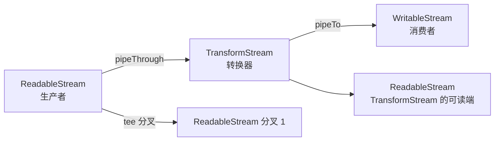

## 知识点地图

- **知识类别**：Web Streams——浏览器与 Node 共用的流式数据处理标准接口。
- **解决什么问题**：`response.json()` 要把整个响应体读进内存；大文件、直播流、AI 逐字输出这类场景需要"来一块处理一块"，还要让慢的消费者反过来抑制快的生产者（背压）。
- **什么时候用到**：下载进度条、流式 AI 响应（SSE）、大文件处理、NDJSON 分页流；以及一切"边收边处理"的管线。
- **来历说明**：本篇由[网络请求 API](/javascript/450-FetchApiWebStreams) 的第 2.6、8~10 节与附录 D 拆分而来，与 fetch 主线的分工是：450 讲"请求怎么发"，本篇讲"响应体怎么流着读"。

## 0. 一句话理解

> ReadableStream 是水龙头（数据源），WritableStream 是下水道（数据汇），TransformStream 是中间的滤芯，`pipeThrough/pipeTo` 把它们接成一条流水线。fetch 的 `response.body` 本身就是一个 ReadableStream——你已经天天在用它了。


## 1. Web Streams API 概述

### 1.1 三种流类型

| 流类型           | 含义                       | 典型场景                       |
| ---------------- | -------------------------- | ------------------------------ |
| ReadableStream   | 可读流,数据源             | Fetch 响应体、文件读取、传感器 |
| WritableStream   | 可写流,数据汇             | 文件写入、网络发送、日志       |
| TransformStream | 转换流,既可读又可写       | 压缩、解压、加密、解码         |

### 1.2 流的优势

1. **内存高效**:数据分块处理,无需全部载入内存
2. **背压**:消费者控制生产速率,避免内存爆炸
3. **管道**:类似 Unix 管道,可串联多个转换
4. **可取消**:随时中止,释放资源
5. **异步友好**:基于 Promise,与 async/await 协同

### 1.3 流与数组的对比

```javascript
// 数组:一次性加载,内存压力大
const allData = await response.json(); // 全部解析到内存

// 流:分块处理,内存稳定
const reader = response.body.getReader();
while (true) {
  const { done, value } = await reader.read();
  if (done) break;
  processChunk(value); // 每次处理一小块
}
```

### 1.4 流与异步迭代

```javascript
// ReadableStream 实现了 async iterable
const response = await fetch('/api/data');

for await (const chunk of response.body) {
  console.log(`收到 ${chunk.length} 字节`);
}
```

---

---

## 2. ReadableStream 深入

### 2.1 读取 Fetch 响应流

```javascript
const response = await fetch('/api/large-file');
const reader = response.body.getReader();
const decoder = new TextDecoder();

while (true) {
  const { done, value } = await reader.read();
  if (done) break;
  const text = decoder.decode(value, { stream: true });
  console.log(text);
}

// 释放锁,允许其他 reader 读取
reader.releaseLock();
```

### 2.2 自定义 ReadableStream

```javascript
// 创建一个生成自然数的 ReadableStream
function naturals() {
  let i = 1;
  return new ReadableStream({
    start(controller) {
      // 启动时执行,通常用于初始化
    },
    pull(controller) {
      // 消费者请求数据时调用
      if (i > 100) {
        controller.close();
        return;
      }
      controller.enqueue(i++);
    },
    cancel(reason) {
      // 消费者取消时执行清理
      console.log('流被取消:', reason);
    },
  });
}

const stream = naturals();
const reader = stream.getReader();

console.log(await reader.read()); // { done: false, value: 1 }
console.log(await reader.read()); // { done: false, value: 2 }
```

### 2.3 背压与 pull 模式

```javascript
// pull 只在消费者调用 read() 后被调用,天然实现背压
const stream = new ReadableStream({
  pull(controller) {
    console.log('pull called');
    controller.enqueue(Math.random());
  },
});

const reader = stream.getReader();
// 第一次 read 触发 pull
await reader.read(); // 控制台:pull called
// 第二次 read 再次触发 pull
await reader.read(); // 控制台:pull called
// 没有 read,pull 不会被调用,生产者不会堆积数据
```

### 2.4 队列策略(QueuingStrategy)

```javascript
// 高水位(highWaterMark):队列中允许的最大数据量
const stream = new ReadableStream(
  {
    pull(controller) {
      // 当队列低于高水位时,pull 被调用
      controller.enqueue(new Uint8Array(1024));
    },
  },
  new CountQueuingStrategy({ highWaterMark: 10 }) // 最多缓存 10 个块
);

// ByteLengthQueuingStrategy:按字节计数
const byteStream = new ReadableStream(
  {
    pull(controller) {
      controller.enqueue(new Uint8Array(1024));
    },
  },
  new ByteLengthQueuingStrategy({ highWaterMark: 1024 * 1024 }) // 最多 1MB
);
```

### 2.5 下载进度

```javascript
async function downloadWithProgress(url, onProgress) {
  const response = await fetch(url);
  const contentLength = parseInt(
    response.headers.get('Content-Length') || '0',
    10
  );
  const reader = response.body.getReader();

  let received = 0;
  const chunks = [];

  while (true) {
    const { done, value } = await reader.read();
    if (done) break;

    chunks.push(value);
    received += value.length;
    onProgress(received, contentLength);
  }

  return new Blob(chunks);
}

// 使用
const blob = await downloadWithProgress('/api/large-file', (received, total) => {
  const percent = total ? (received / total * 100).toFixed(2) : '?';
  console.log(`下载进度: ${received}/${total} (${percent}%)`);
});
```

### 2.6 Tee 流(分叉)

```javascript
const response = await fetch('/api/data');
const [stream1, stream2] = response.body.tee();

// 两个流可独立消费,内容相同
const reader1 = stream1.getReader();
const reader2 = stream2.getReader();

// stream1 用于实时显示
(async () => {
  for await (const chunk of stream1) {
    displayChunk(chunk);
  }
})();

// stream2 用于缓存
(async () => {
  const cache = [];
  for await (const chunk of stream2) {
    cache.push(chunk);
  }
  saveToCache(cache);
})();
```

### 2.7 管道与 pipeTo

```javascript
// 将 ReadableStream 通过管道传给 WritableStream
const response = await fetch('/api/data');
await response.body.pipeTo(new WritableStream({
  write(chunk) {
    console.log('写入:', chunk);
  },
}));

// pipeThrough 通过 TransformStream
const response = await fetch('/api/data');
const decodedStream = response.body
  .pipeThrough(new TextDecoderStream())
  .pipeThrough(new TransformStream({
    transform(chunk, controller) {
      // 处理文本块
      controller.enqueue(chunk.toUpperCase());
    },
  }));

for await (const chunk of decodedStream) {
  console.log(chunk);
}
```

### 2.8 错误处理

```javascript
const stream = new ReadableStream({
  pull(controller) {
    try {
      const data = fetchData();
      controller.enqueue(data);
    } catch (err) {
      controller.error(err); // 报告错误给消费者
    }
  },
});

const reader = stream.getReader();
try {
  while (true) {
    const { done, value } = await reader.read();
    if (done) break;
    console.log(value);
  }
} catch (err) {
  console.error('流错误:', err);
}
```

---

## 3. WritableStream 与 TransformStream

### 3.1 WritableStream 基础

```javascript
const writable = new WritableStream({
  start(controller) {
    // 初始化底层资源
  },
  write(chunk, controller) {
    // 写入一块数据
    console.log('写入:', chunk);
    // 返回 Promise 表示写入完成(实现背压)
    return new Promise((resolve) => setTimeout(resolve, 10));
  },
  close(controller) {
    // 关闭底层资源
    console.log('流已关闭');
  },
  abort(reason) {
    // 异常终止
    console.log('流被中止:', reason);
  },
});

const writer = writable.getWriter();
await writer.write('hello');
await writer.write('world');
await writer.close();
```

### 3.2 WritableStream 默认 writer

```javascript
const writable = new WritableStream({
  write(chunk) {
    console.log(chunk);
  },
});

// getWriter 锁定流,只能有一个 writer
const writer = writable.getWriter();
writer.write('a');
writer.write('b');
await writer.close();

// 释放后可再次获取
const writer2 = writable.getWriter();
```

### 3.3 TransformStream

```javascript
// 创建一个将字符串转大写的 TransformStream
const upperCaseStream = new TransformStream({
  transform(chunk, controller) {
    controller.enqueue(chunk.toUpperCase());
  },
});

// 使用
const response = await fetch('/api/text');
const transformed = response.body
  .pipeThrough(new TextDecoderStream())
  .pipeThrough(upperCaseStream);

for await (const chunk of transformed) {
  console.log(chunk);
}
```

### 3.4 实战:JSON 流式解析

```javascript
// 服务器返回 newline-delimited JSON(NDJSON)
// 每行一个 JSON 对象
class NDJSONParser extends TransformStream {
  constructor() {
    let buffer = '';
    super({
      transform(chunk, controller) {
        buffer += chunk;
        const lines = buffer.split('\n');
        buffer = lines.pop(); // 最后一段可能不完整,保留
        for (const line of lines) {
          if (line.trim()) {
            try {
              controller.enqueue(JSON.parse(line));
            } catch (e) {
              controller.error(e);
            }
          }
        }
      },
      flush(controller) {
        if (buffer.trim()) {
          try {
            controller.enqueue(JSON.parse(buffer));
          } catch (e) {
            controller.error(e);
          }
        }
      },
    });
  }
}

// 使用
const response = await fetch('/api/stream');
const jsonStream = response.body
  .pipeThrough(new TextDecoderStream())
  .pipeThrough(new NDJSONParser());

for await (const obj of jsonStream) {
  console.log('收到对象:', obj);
}
```

### 3.5 TextEncoderStream / TextDecoderStream

```javascript
// 字符串 → 字节
const encoderStream = new TextEncoderStream();

// 字节 → 字符串
const decoderStream = new TextDecoderStream();

// 链式处理
const response = await fetch('/api/text');
const textStream = response.body.pipeThrough(new TextDecoderStream());
```

### 3.6 CompressionStream / DecompressionStream

```javascript
// gzip 压缩(Chrome 80+)
const compressed = originalStream.pipeThrough(new CompressionStream('gzip'));

// gzip 解压
const decompressed = compressedStream.pipeThrough(new DecompressionStream('gzip'));
```

### 3.7 案例：基于 Fetch Streams 的流式 AI 响应处理

某聊天应用需要处理大模型服务的流式响应（SSE 格式），用 `response.body.getReader()` 逐块解析，配合 AbortController 支持用户随时停止生成：

```javascript
/**
 * 流式 SSE 响应处理
 * @param {string} url API 端点
 * @param {Object} body 请求体
 * @param {Function} onChunk 每个文本块的回调
 * @param {AbortSignal} signal 取消信号
 */
async function streamChatCompletion(url, body, onChunk, signal) {
  const response = await fetch(url, {
    method: 'POST',
    headers: {
      'Content-Type': 'application/json',
      Authorization: `Bearer ${apiKey}`,
    },
    body: JSON.stringify(body),
    signal,
  });

  if (!response.ok) {
    throw new Error(`HTTP ${response.status}`);
  }

  const reader = response.body.getReader();
  const decoder = new TextDecoder('utf-8');
  let buffer = '';

  while (true) {
    const { done, value } = await reader.read();
    if (done) break;

    // 将 Uint8Array 解码为字符串并追加到缓冲区
    buffer += decoder.decode(value, { stream: true });

    // SSE 协议：每个事件以双换行分隔
    const lines = buffer.split('\n\n');
    buffer = lines.pop() || '';

    for (const line of lines) {
      if (line.startsWith('data: ')) {
        const data = line.slice(6);
        if (data === '[DONE]') return;
        const json = JSON.parse(data);
        const content = json.choices?.[0]?.delta?.content;
        if (content) onChunk(content);
      }
    }
  }
}

// 使用：实时显示 AI 响应，点停止按钮时 controller.abort()
const controller = new AbortController();
await streamChatCompletion(
  'https://api.example.com/v1/chat/completions',
  {
    model: 'chat-xl',
    messages: [{ role: 'user', content: '解释闭包' }],
    stream: true,
  },
  (chunk) => {
    document.getElementById('output').textContent += chunk;
  },
  controller.signal
);
```

两个流式处理的关键细节都在缓冲区那段：`decoder.decode(value, { stream: true })` 让被 TCP 分块截断的多字节字符留到下一块补全；`lines.pop()` 把最后一段「可能不完整」的事件留在缓冲区，等下一块拼齐再解析——SSE 事件的边界（双换行）与网络分块的边界（任意字节）完全不对齐，缓冲区就是为这个不对齐而设的。

---

## 4. 背压的形式化定义（承接自网络请求篇第 2.6 节）

### 4.1 背压(Backpressure)的形式化

定义流的生产者-消费者模型:

- 生产者速率 $P(t)$:每秒产生的字节数
- 消费者速率 $C(t)$:每秒处理的字节数
- 缓冲区大小 $B$
- 当前缓冲区水位 $W(t)$

当 $W(t) > B_{\text{high}}$ 时,触发背压,生产者暂停:

$$
P(t+1) = \begin{cases}
0 & \text{if } W(t) > B_{\text{high}} \\
P_{\max} & \text{if } W(t) < B_{\text{low}}
\end{cases}
$$

Web Streams 通过 ReadableStream 的 pull 机制实现背压:消费者调用 reader.read() 才会拉取下一块,自然限制生产速率。

这段形式化与第 2.3 节的实践互为印证：`pull` 只在队列低于高水位时被调用，正是 $W(t)$ 与 $B_{\text{low}}/B_{\text{high}}$ 阈值机制的落地形态。

---

## 5. 动手实践

任务（先写，写完再展开参考实现）：

1. 给第 2.5 节的下载进度函数加"取消"支持：返回一个带 `abort()` 的控制器，取消后不再累积数据。（提示：复用 [fetch 与 AbortController](/javascript/440-FetchApiAndAbortController) 的 AbortController，流读取会以 AbortError reject。）
2. 写一个把字节数格式化成 "1.2 MB" 的 `fmt(bytes)`，接到进度回调里。（提示：1024 进制取整即可。）
3. 用 TransformStream 写一个"行分割器" `LineSplitter`：把任意文本流按换行切成一行一行的流。（提示：照抄第 3.4 节 NDJSONParser 的缓冲区骨架，把 JSON.parse 换成 controller.enqueue(line)。）

<details>
<summary>参考实现（先完成上面的任务再展开对照）</summary>

```javascript
// 1 + 2：可取消的下载进度
function downloadWithProgress2(url, onProgress) {
  const controller = new AbortController();
  const done = (async () => {
    const response = await fetch(url, { signal: controller.signal });
    const total = parseInt(response.headers.get("Content-Length") || "0", 10);
    const reader = response.body.getReader();
    let received = 0;
    const chunks = [];
    while (true) {
      const { done, value } = await reader.read();
      if (done) break;
      chunks.push(value);
      received += value.length;
      onProgress(received, total);
    }
    return new Blob(chunks);
  })();
  return { blob: done, abort: () => controller.abort() };
}
const dl = downloadWithProgress2("/big.zip",
  (r, t) => console.log(fmt(r), "/", fmt(t)));
// dl.abort();  // 取消：reader.read() 以 AbortError 拒绝

function fmt(bytes) {
  if (bytes < 1024) return `${bytes} B`;
  if (bytes < 1024 ** 2) return `${(bytes / 1024).toFixed(1)} KB`;
  return `${(bytes / 1024 ** 2).toFixed(1)} MB`;
}

// 3：行分割器
class LineSplitter extends TransformStream {
  constructor() {
    let buffer = "";
    super({
      transform(chunk, controller) {
        buffer += chunk;
        const lines = buffer.split("\n");
        buffer = lines.pop();          // 最后一段可能不完整，留在缓冲区
        for (const line of lines) controller.enqueue(line);
      },
      flush(controller) {
        if (buffer) controller.enqueue(buffer); // 收尾时把残余交出去
      },
    });
  }
}
```

第 1 题的关键点：取消发生在 fetch 与 read 两个层面，AbortController 一处配置即可同时覆盖；被 abort 后 `reader.read()` 的 Promise 以 AbortError 拒绝，循环自然中断。第 3 题与 NDJSONParser 的差别只在"对每一行做什么"，缓冲区骨架完全一致——这套骨架值得背下来。

</details>

---

## 附录 A:Stream 类型关系图



---

---

## 参考与致谢

- MDN Web Docs：Streams API、ReadableStream、WritableStream、TransformStream（CC-BY-SA 2.5），https://developer.mozilla.org/en-US/docs/Web/API/Streams_API
- WHATWG Streams Standard，https://streams.spec.whatwg.org
- 本篇正文（第 1~3 节与附录 A）整体承接自仓库 450-FetchApiWebStreams 拆分前的 Web Streams 章节，另新增知识点地图、动手实践与背压形式化一节。
