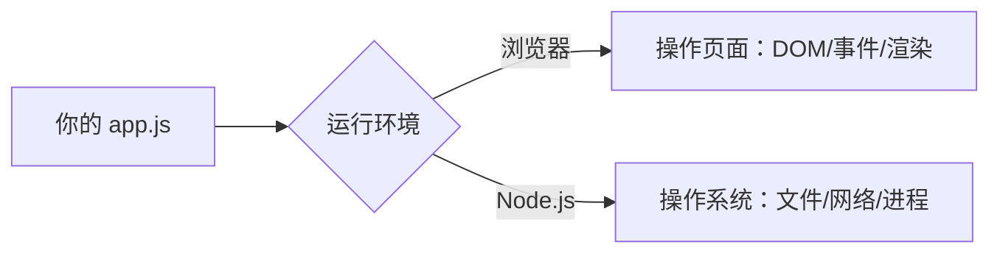

## 前置知识

- JavaScript 是什么、它在浏览器里的位置（[JavaScript 是什么](/javascript/010-WhatIsJavaScript)）。

## 先建立心智模型：Node.js 到底是什么

你写的 JavaScript 代码，浏览器拿到后由它内置的 **V8 引擎**逐行解释执行——所以浏览器能跑 JS。V8 本身只是个"翻译执行器"，它认识语言，但不认识世界：没有它，代码读不了文件、发不了网络请求、也无处展示界面。

**Node.js 做的事情可以概括为一句话：把 V8 引擎从浏览器里拆出来，给它接上操作系统的手脚。** 拆出来的引擎负责执行语言，Node 再补上浏览器不会给你的能力——读写文件、监听网络端口、执行子进程。于是同一门语言有了两副身体：



理解了这个模型，"为什么要装它"就有了两层答案：

1. **写后端与工具**：接上手脚的 JS 能写服务器（接收 HTTP 请求）、写命令行工具、写自动化脚本；
2. **跑前端的"基建"**：更隐蔽但更重要——现代前端的构建工具（Vite）、包管理器（npm）、类型检查器（tsc）本身就是 Node 程序。**不装 Node，连前端项目的开发服务器都启动不了。**这就是为什么它是 JS 学习路线的第一件装备。

## 安装到底装了什么

很多人把安装当成"点下一步"的黑盒，值得花两分钟打开它。安装 Node.js 实际做了三件事：

1. **放入可执行文件**：`node`（执行 JS 的引擎本体）和 `npm`（包管理器，[下一站](/javascript/540-NpmManager)详解）放到程序目录；
2. **写入 PATH**：把该目录登记进系统的 PATH 环境变量——这就是为什么任何位置敲 `node` 都能生效，也是"命令找不到"报错的唯一根源（原理见 [PATH 与环境变量](/start/030-DevEnvironmentSetup)）；
3. **建立全局模块目录**：为"全局安装的工具"预留存放地（这个设计后来争议很大，nvm 篇会回响）。

知道装了什么，"验证安装"就从背命令变成了查证：`node -v` 证明可执行文件在、`node -e "..."` 证明引擎能跑代码、装第三方包成功证明 npm 与网络链路通。

## 版本怎么选：看懂发布节奏再记结论

官网让你在 LTS 与 Current 之间选，死记"选 LTS"不如懂它的节奏。Node 每年 4 月发一个 Current 版（携最新特性），当年 10 月若它被标记为 LTS，则进入 30 个月只修不新增的维护期。版本号偶数（22、24）最终会成为 LTS，奇数（23、25）永远停留在 Current。

由此推出结论而不是背结论：**教程、框架、公司项目都以 LTS 为基准线**——你用 Current 遇到的坑，全网没人踩过，求助无门。新手与生产环境一律 LTS，没有第二种选择。

## 三大系统安装要点

```powershell
# Windows：官网 .msi 双击安装（零基础首选）；或 winget
winget install OpenJS.NodeJS.LTS
```

安装向导里唯一值得多看一眼的是"Add to PATH"勾选项（默认已勾，确认别取消）——漏了它就是"命令找不到"的标准剧本。

```bash
# macOS：官网 .pkg，或 Homebrew（brew 装的是目录化的版本，便于日后 nvm 接管）
brew install node@22
```

```bash
# Linux（Ubuntu/Debian）：系统源里的 Node 通常严重过时，用 NodeSource 官方源
curl -fsSL https://deb.nodesource.com/setup_lts.x | sudo -E bash -
sudo apt-get install -y nodejs
```

跨系统的一致建议：**第一台环境用官网安装包**。包管理器与脚本安装是为"重复部署"设计的效率工具，第一次学习用它，出错时多了一层不确定。

## 验证：三个命令各查一件事

装完**必须新开终端**（已开的窗口持有旧 PATH，感知不到新装——初学阶段半数"装了没用"都栽在这）。依次执行：

```bash
node -v      # 查证一：可执行文件在 PATH 里吗？输出 v22.x 即通
npm -v       # 查证二：随装的包管理器在吗？
node -e "console.log('引擎可用：' + process.version)"
             # 查证三：引擎真的能执行代码（不只是文件存在）
```

三关全过，你的机器从此能运行一切 JS 工具与服务器程序。想让闭环更实在，写个文件跑一下：

```bash
# 任意目录建 hello.js，内容一行：console.log('我的第一个 Node 程序')
node hello.js
```

## 决策：要不要一步到位用 nvm

官网直装有一个结构性局限：**全局唯一版本**。真实世界很快会遇到"老项目要 Node 18、新项目要 22"的夹击，届时反复卸装不可持续。解药是 [nvm 版本管理器](/javascript/530-NvmVersionManage)——它接管 Node 的安装与切换，可无限多版本共存。

但我的建议仍然是：**零基础先用官网直装跑通第一个项目，nvm 等"多版本"痛点真实出现再迁移**。理由是学习期的最优策略是减少概念数量——nvm 的版本、全局包隔离机制会引入一批新概念，而你此刻连 npm 都还没见过。迁移成本不高（卸载、装 nvm、重装所需版本，十分钟），不值得为它推迟写第一行代码。

## 常见困惑

**"'node' 不是内部或外部命令 / command not found"？**——对照安装原理自查：终端是安装前开的（旧 PATH，重开即愈）；或安装漏了 PATH 勾选（重装修复）。这条报错的本质永远是"PATH 里没有它"，理解原理比记解法重要。

**"npm 是什么？为什么要它？"**——npm 是 Node 自带的"代码超市客户端"：现代项目没有从零写的，都是组装几十上百个开源包。它是下一篇的主角：[npm 包管理](/javascript/540-NpmManager)。

**"听说要装 pnpm / yarn？"**——它们是 npm 的竞品（更快、省磁盘），但**入门期一律用 npm**：教程通用、零额外安装。等出现"依赖安装慢、磁盘爆炸"的真实痛点再迁移，半天就能切换。

## 检验清单

- 能画出"同一份 JS 在浏览器与 Node 里各干什么"的双身图，并说出 Node 补了哪些能力；
- 能说出安装的三件事（可执行文件、PATH、全局目录）——并据此解释"命令找不到"的根源；
- 能用发布节奏推出"选 LTS"的结论；
- 完成"验证三连"与第一个 `node hello.js`。

## 下一步

引擎就位，该认识 JS 世界的"超市"了：进入 [npm 包管理](/javascript/540-NpmManager)，理解 `node_modules`、`package.json` 这些目录里天天见面却未必看懂过的东西。
