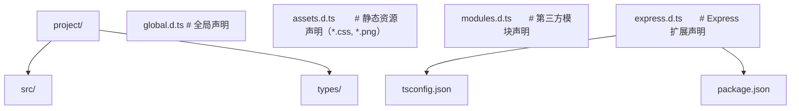

## 知识点地图

- **知识类别**：声明文件（declaration file / ambient declaration）——「只写类型、不写实现」的 `.d.ts` 世界，属于 TypeScript 类型层与运行时层的桥接域。
- **解决什么问题**：给没有类型的 npm 包、CDN 全局脚本、打包器注入的非 JS 资源（CSS/图片/SVG）、框架扩展（Express 的 Request）补上类型身份证；发布自己的库时让 TS 能自动找到声明。
- **什么时候用到**：装包后第一行 import 报「找不到模块或其类型声明」；要往 `window` 挂全局变量；要给 Express/Vue/Webpack 生态写扩展声明；要发布带类型的 npm 包。声明文件「怎么被找到」（模块解析侧）见[模块解析进阶与 ESM/CJS 互操作](/typescript/315-PackageExportsEsmInterop)。

## 前置知识

- [命名空间与模块](/typescript/290-NamespaceModule)：import 语句与模块系统的基本规则

## 学习目标

- 掌握「3. 声明文件基础」的核心机制、典型用法与常见陷阱
- 掌握「5. 全局声明与命名空间」的核心机制、典型用法与常见陷阱
- 掌握「6. 模块声明」的核心机制、典型用法与常见陷阱
- 掌握「7. 声明合并规则」的核心机制、典型用法与常见陷阱
- 掌握「8. 三斜线指令」的核心机制、典型用法与常见陷阱

## 0. 真实场景：一个没有类型的依赖

FANDEX 想接一个内部统计脚本 `@company/tracker`，`pnpm add` 装上后第一行 import 就红了：

```typescript
import { track } from '@company/tracker';
// 报错：找不到模块 @company/tracker 或其相应的类型声明
```

打开 `node_modules/@company/tracker` 一看：只有 `index.js`，没有 `.d.ts`，`package.json` 里也没有 `types` 字段。包本身能用（运行时没问题），是**类型世界不认识它**。补一份声明文件，就是给它发一张「类型世界的身份证」。这张身份证怎么写、放哪、怎么被找到，就是本篇内容。

## 1. 一句话理解

> `.d.ts` 是「只写类型、不写实现」的文件：TS 看到它就知道每个导出长什么样，但不会把它编译成 JS。`declare` 系列关键字的意思都是「这个东西在运行时存在，我只是描述它」。

## 2. 动手：三步补齐缺失的声明

### 2.1 建一个环境声明文件

在项目里建 `src/types/tracker.d.ts`（文件名随意，位置在 `tsconfig` 的 `include` 范围内即可）：

```typescript
// src/types/tracker.d.ts
declare module '@company/tracker' {
  export interface TrackOptions {
    event: string;
    props?: Record<string, string | number | boolean>;
    immediate?: boolean;
  }

  export function track(event: string, props?: Record<string, string | number>): void;
  export function trackBatch(events: TrackOptions[]): void;
  export function flush(): Promise<void>;
}
```

保存后回到业务代码——红线消失，`track('page_view', { page: '/docs' })` 有了完整补全。`declare module '包名' { ... }` 的意思是：**「这个包的类型长这样」**，里面写的内容与普通模块体一致（export 函数、接口、类型都行），只是没有实现。

### 2.2 校验声明与运行时是否一致

声明是**手写的承诺**，编译器不会去 `index.js` 里核对。写完立刻自测：

```typescript
// 临时脚本 scratch/check.ts
import { track, flush, trackBatch } from '@company/tracker';

track('page_view');                       // 若实际要求两个参数，运行时会炸
trackBatch([{ event: 'click' }]);
void flush();
// npx tsc --noEmit 看类型，npx tsx scratch/check.ts 看运行时
```

类型过不代表运行时对——`.d.ts` 没有任何运行时效力，这是声明文件的第一原则。

### 2.3 全局变量也要声明

如果这个包还会往 `window` 上挂东西（统计脚本常见），补一段全局声明：

```typescript
// src/types/tracker.d.ts 追加
declare global {
  interface Window {
    __trackerReady?: boolean;
  }
}

export {};   // 关键：让这个文件成为模块，declare global 才合法
```

`export {}` 这一行是新人最常漏的：**`declare global` 只能出现在模块文件里**。没有它，文件是「全局脚本」，`declare global` 直接报错。全局增强的完整规则（接口合并、为什么能合并）见[模块声明与全局类型增强](/typescript/340-ModuleDeclarationGlobalAugmentation)。

## 3. declare 家族速览

| 写法 | 场景 | 例子 |
| --- | --- | --- |
| `declare module 'x' { ... }` | 给无类型 npm 包 / CDN 模块补声明 | 本文 2.1 |
| `declare global { ... }` | 往全局空间合并类型（window、process.env） | 本文 2.3 |
| `declare const X: T` | 描述全局存在的变量（CDN 注入的脚本） | `declare const gtag: (...args: unknown[]) => void` |
| `declare function f(): T` | 描述全局存在的函数 | 老脚本的全局工具函数 |
| `declare namespace N { ... }` | 描述挂在全局对象下的分组（老库常见） | 读 `@types/node` 时到处都是 |

共同点：**只出现在 `.d.ts` 或 `declare` 上下文里，编译后全部消失**。它们不创建任何运行时东西，只告诉类型系统「运行时已经有了，长这样」。

---

## 4. 声明文件基础

### 4.1 什么是 .d.ts 文件

声明文件（declaration file）以 `.d.ts` 为扩展名，包含 TypeScript 类型声明但不包含可执行代码。它描述 JavaScript 代码的类型形状，让 TypeScript 能在不接触实现的情况下提供类型检查与智能提示。

典型使用场景：

1. **为纯 JavaScript 库提供类型**：例如 jQuery、lodash 早期版本。
2. **为编译产物提供类型**：TypeScript 项目编译后生成 `.js` + `.d.ts`，使用者只需 `.d.ts`。
3. **为运行时注入的全局变量提供类型**：例如 `window.__APP_CONFIG__`。
4. **为环境 API 提供类型**：例如 DOM、Node.js 内置模块。

### 4.2 声明文件的基本结构

```typescript
// utils.d.ts - 最简声明文件

// 声明常量
declare const VERSION: string;

// 声明函数
declare function add(a: number, b: number): number;

// 声明类
declare class Calculator {
  constructor(precision?: number);
  add(a: number, b: number): number;
  subtract(a: number, b: number): number;
}

// 声明枚举
declare enum Direction {
  Up = 'UP',
  Down = 'DOWN',
  Left = 'LEFT',
  Right = 'RIGHT',
}

// 声明命名空间
declare namespace Utils {
  function format(date: Date): string;
  const locale: string;
}

// 声明模块（用于无类型的 npm 包）
declare module 'untyped-lib' {
  export function doSomething(value: string): number;
  export const version: string;
}
```

### 4.3 声明文件的三种作用域

TypeScript 中的声明文件按作用域分为三类：

1. **全局声明**：直接在文件顶层声明，自动合并到全局作用域。
2. **模块声明**：包含 `import`/`export` 的文件被视为模块，声明只在该模块内有效。
3. **环境声明**：使用 `declare` 关键字声明已存在的全局变量或模块。

```typescript
// globals.d.ts - 全局声明
declare const __DEV__: boolean;
declare const __APP_VERSION__: string;

// 必须有 export {} 才能使用 declare global
export {};

declare global {
  interface Window {
    myApp: {
      version: string;
      init(): void;
    };
  }
}
```

### 4.4 生成声明文件

TypeScript 编译器可自动生成声明文件：

```jsonc
// tsconfig.json
{
  "compilerOptions": {
    "declaration": true,           // 生成 .d.ts
    "declarationMap": true,        // 生成 .d.ts.map（用于跳转源码）
    "emitDeclarationOnly": false,  // 仅生成声明（不生成 .js），常用于库的类型包
    "outDir": "./dist",
    "rootDir": "./src"
  }
}
```

生成的 `.d.ts` 文件结构示例：

```typescript
// 源文件 src/calculator.ts
export class Calculator {
  constructor(private precision: number) {}
  add(a: number, b: number): number {
    return a + b;
  }
}

// 自动生成的 dist/calculator.d.ts
export declare class Calculator {
  private precision;
  constructor(precision: number);
  add(a: number, b: number): number;
}
```

注意生成的声明文件会移除实现细节（函数体、默认值），仅保留类型签名。

---

## 5. 全局声明与命名空间

### 5.1 declare global

`declare global` 用于在模块文件中扩展全局作用域。这是现代 TypeScript 推荐的扩展全局类型的方式：

```typescript
// types/globals.d.ts
export {};  // 关键：必须有 export 才是模块

declare global {
  // 扩展 Window 接口
  interface Window {
    __APP_VERSION__: string;
    __DEV__: boolean;
    analytics?: {
      track(event: string, props?: Record<string, unknown>): void;
    };
  }

  // 扩展 Array 原型
  interface Array<T> {
    groupBy<K extends string>(keyFn: (item: T) => K): Record<K, T[]>;
  }

  // 扩展 String 原型
  interface String {
    toPascalCase(): string;
  }

  // 声明全局变量
  const __DEV__: boolean;
  const __APP_VERSION__: string;
}
```

注意：

1. **必须包含 `export {}`**：否则文件被视为脚本（script），`declare global` 会报错。
2. **接口合并**：`interface Window` 会与已有的 Window 接口合并，而非覆盖。
3. **类型与值同时声明**：`declare global` 中可以同时声明类型（interface）与值（const/function）。

declare global 与「全局增强」是一体两面：本文讲「在声明文件里怎么写」，合并为什么能成立、DOM/Node 生态里怎么用，见[模块声明与全局类型增强](/typescript/340-ModuleDeclarationGlobalAugmentation)。

### 5.2 declare namespace

`declare namespace` 用于声明全局命名空间，主要适用于：

1. **旧式全局库**：通过 `<script>` 标签引入的库（如 jQuery）。
2. **复杂的全局对象**：需要嵌套结构的全局变量。
3. **库的工具命名空间**：例如 `_.foo`、`$.ajax`。

```typescript
// jquery.d.ts（简化版）
declare namespace $ {
  function ajax(url: string, settings?: $.AjaxSettings): $.jqXHR;
  function get(url: string, data?: object): $.jqXHR;

  namespace $.AjaxSettings {
    type Method = 'GET' | 'POST' | 'PUT' | 'DELETE';
  }

  interface AjaxSettings {
    method?: $.AjaxSettings.Method;
    url: string;
    data?: object;
    success?: (data: any) => void;
    error?: (xhr: $.jqXHR, status: string) => void;
  }

  interface jqXHR {
    abort(): void;
    done(callback: (data: any) => void): jqXHR;
    fail(callback: (xhr: jqXHR, status: string) => void): jqXHR;
  }
}

// 使用
$.ajax('/api/users', { method: 'GET' });
```

现代 TypeScript 工程应尽量避免 `declare namespace`，改用 ES 模块。仅在与遗留代码兼容时使用。命名空间本身的语言机制见[命名空间与模块](/typescript/290-NamespaceModule)。

### 5.3 全局变量声明模式

```typescript
// 模式 1：纯全局变量
declare const __DEV__: boolean;

// 模式 2：全局对象
declare const process: {
  env: Record<string, string | undefined>;
  argv: string[];
  exit(code?: number): never;
};

// 模式 3：全局函数
declare function fetch(input: string | URL, init?: RequestInit): Promise<Response>;

// 模式 4：全局类
declare class CustomError extends Error {
  constructor(message: string, code?: number);
  readonly code?: number;
}
```

### 5.4 lib.d.ts 与 lib 选项

TypeScript 内置了一组声明文件，描述 JavaScript 标准库与 DOM API：

```jsonc
// tsconfig.json
{
  "compilerOptions": {
    "lib": [
      "ES2023",        // ES2023 标准库
      "DOM",           // DOM API
      "DOM.Iterable",  // DOM 迭代器
      "ScriptHost"     // Windows Script Host
    ]
  }
}
```

`lib` 选项决定 TypeScript 知道哪些全局类型。例如：

- 不包含 `"DOM"` 时，`document`、`window` 等不可用。
- 不包含 `"ES2022"` 时，`Array.at()`、`Object.hasOwn()` 等不可用。
- 仅包含 `"ESNext"` 时，所有最新特性可用。

lib 组装与 DOM/Web API 类型本身的细节（lib.dom.d.ts 的来源、DOM 泛型方法）另见[DOM 与 Web API 类型](/typescript/345-DomLibAndWebApiTypes)。

---

## 6. 模块声明

### 6.1 declare module

`declare module` 用于为 npm 包或相对路径模块提供类型声明。两种主要形式：

#### 形式 1：通配符模块声明

```typescript
// types/webpack-modules.d.ts
declare module '*.css' {
  const classes: { readonly [key: string]: string };
  export default classes;
}

declare module '*.png' {
  const src: string;
  export default src;
}

declare module '*.svg' {
  import React from 'react';
  export const ReactComponent: React.FC<React.SVGProps<SVGSVGElement>>;
  const src: string;
  export default src;
}

declare module '*.json' {
  const value: unknown;
  export default value;
}
```

适用于 Vite/Webpack 等打包器工程中导入非 JS 资源。

#### 形式 2：具名模块声明

```typescript
// types/untyped-lib.d.ts
declare module 'untyped-lib' {
  export interface Options {
    timeout?: number;
    retries?: number;
  }

  export function request(url: string, options?: Options): Promise<Response>;

  export class Client {
    constructor(baseURL: string);
    get<T>(url: string): Promise<T>;
    post<T>(url: string, body: unknown): Promise<T>;
  }

  export default Client;
}
```

为没有内置类型的 npm 包提供声明。注意：具名模块声明会**完全替换**包的实际类型（如果有的话）。

### 6.2 模块声明的查找顺序

TypeScript 查找模块类型的顺序：

1. **包内置类型**：`package.json` 的 `types`/`typings` 字段，或 `exports.types`。
2. **@types 包**：`node_modules/@types/<package>/index.d.ts`。
3. **typeRoots 配置**：`tsconfig.json` 中 `typeRoots` 指定的目录。
4. **三斜线指令引用**：通过 `/// <reference types="..." />` 引入。
5. **手写声明文件**：项目内的 `.d.ts` 文件。

这套顺序与 `moduleResolution` 策略如何配合（bundler/node16 对 exports 的解析差异），见[模块解析进阶与 ESM/CJS 互操作](/typescript/315-PackageExportsEsmInterop)第 3、5 节。

### 6.3 模块声明的陷阱

```typescript
// 错误：模块声明与实际包冲突
declare module 'lodash' {
  export function get(obj: object, path: string): any;
}

// 实际使用时，TypeScript 优先使用上面的声明
// 即使 @types/lodash 已安装，也会被覆盖
import { get } from 'lodash';
// get 的类型是声明的版本，而非 @types/lodash 的完整版本
```

修复：仅在包确实没有类型时使用 declare module，否则使用 @types。

---

## 7. 声明合并规则

声明合并（declaration merging）是 TypeScript 的核心特性，允许同名的多个声明合并为一个。理解合并规则对于扩展第三方类型至关重要。合并机制的教科书级完整展开（interface + interface、跨模块合并的合法性判定）见[模块声明与全局类型增强](/typescript/340-ModuleDeclarationGlobalAugmentation)，本节保留声明文件视角下的合并用法。

### 7.1 接口合并

```typescript
interface Window {
  customProp: string;
}

interface Window {
  anotherProp: number;
}

// 等价于
interface Window {
  customProp: string;
  anotherProp: number;
}
```

接口合并规则：

1. **非函数成员必须唯一**：同名属性必须是相同类型。
2. **函数成员重载**：后声明的接口出现在重载列表前面。
3. **后续接口必须有实现**：如果第一个接口定义了属性，后续接口不能改变其类型。

### 7.2 命名空间合并

```typescript
// 扩展命名空间
namespace MyLib {
  export const version = '1.0';
}

namespace MyLib {
  export function doSomething() { /* ... */ }
}

// 等价于
namespace MyLib {
  export const version = '1.0';
  export function doSomething() { /* ... */ }
}
```

### 7.3 命名空间与函数合并

```typescript
function MyLib(options: object): void;

namespace MyLib {
  export const version = '1.0';
  export function advanced(): void;
}

// 使用
MyLib({});           // 作为函数调用
MyLib.version;       // 作为命名空间访问属性
MyLib.advanced();    // 作为命名空间调用方法
```

这是 jQuery 等库的常见模式：`$()` 是函数，`$.ajax()` 是方法。

### 7.4 命名空间与类合并

```typescript
class Calculator {
  constructor(public precision: number) {}
}

namespace Calculator {
  export const defaultPrecision = 2;
  export function create(): Calculator {
    return new Calculator(defaultPrecision);
  }
}

// 使用
const calc = new Calculator(10);
const defaultCalc = Calculator.create();
console.log(Calculator.defaultPrecision);
```

### 7.5 模块扩展（declare module）

通过 `declare module` 可以扩展已存在模块的类型：

```typescript
// types/express.d.ts
declare module 'express' {
  // 扩展 Request 接口
  interface Request {
    user?: {
      id: string;
      role: 'admin' | 'user';
    };
    traceId?: string;
  }

  // 扩展 Response 接口
  interface Response {
    success(data: unknown): void;
    fail(error: string, code?: number): void;
  }
}
```

使用：

```typescript
import express, { Request, Response } from 'express';

const app = express();

app.get('/me', (req: Request, res: Response) => {
  // req.user 现在可用（通过声明合并）
  if (!req.user) {
    res.fail('Unauthorized', 401);
    return;
  }
  res.success({ id: req.user.id });
});
```

### 7.6 模块扩展的限制

```typescript
// 错误：不能扩展模块的顶层导出
declare module 'express' {
  // 这是允许的：扩展接口
  interface Request { user?: User; }

  // 这是允许的：新增命名空间
  namespace Express {
    interface User { id: string; }
  }

  // 错误：不能添加新的顶层导出
  // export function myHelper(): void;
}
```

模块扩展只能扩展已有的接口或命名空间，不能添加新的顶层导出。

### 7.7 全局扩展

```typescript
// types/global.d.ts
export {};  // 必须有 export 才是模块

declare global {
  // 扩展 Array
  interface Array<T> {
    last(): T | undefined;
    first(): T | undefined;
    chunk(size: number): T[][];
  }

  // 扩展 Promise
  interface Promise<T> {
    timeout(ms: number): Promise<T>;
  }
}
```

实现：

```typescript
// polyfills.ts
Array.prototype.last = function () { return this[this.length - 1]; };
Array.prototype.first = function () { return this[0]; };
Array.prototype.chunk = function (size: number) {
  const result: any[][] = [];
  for (let i = 0; i < this.length; i += size) {
    result.push(this.slice(i, i + size));
  }
  return result;
};
```

---

## 8. 三斜线指令

### 8.1 三斜线指令概述

三斜线指令（triple-slash directives）是 TypeScript 早期引入的指令，用于在声明文件中显式声明依赖。现代 TypeScript 推荐使用 import 语句，但三斜线指令仍在 lib.d.ts 与 @types 包中广泛使用。

### 8.2 三种三斜线指令

```typescript
/// <reference path="./utils.d.ts" />
/// <reference types="node" />
/// <reference lib="es2020" />
```

#### `/// <reference path="..." />`

显式声明对另一个声明文件的依赖。TypeScript 会按顺序加载被引用的文件：

```typescript
// types/main.d.ts
/// <reference path="./utils.d.ts" />
/// <reference path="./events.d.ts" />

declare function initialize(): void;
```

#### `/// <reference types="..." />`

声明对 @types 包的依赖。等同于在 tsconfig.json 的 `types` 中包含该包：

```typescript
// types/globals.d.ts
/// <reference types="node" />

declare function readFile(path: string): Buffer;  // Buffer 来自 @types/node
```

#### `/// <reference lib="..." />`

声明对 lib 内置包的依赖：

```typescript
// types/polyfill.d.ts
/// <reference lib="es2022.array" />

declare const arr: number[];
arr.at(-1);  // ES2022 的 Array.at 方法可用
```

### 8.3 现代替代方案

现代 TypeScript 推荐使用 import 语句替代三斜线指令：

```typescript
// 旧：三斜线指令
/// <reference path="./utils.d.ts" />
declare function useUtils(): void;

// 新：import 语句
import type { Utils } from './utils.js';
declare function useUtils(): Utils;
```

`import type` 是 TypeScript 3.8+ 引入的语法，仅在类型层面使用，不会生成运行时代码。

### 8.4 三斜线指令的使用场景

仍在使用三斜线指令的场景：

1. **lib.d.ts 内部**：TypeScript 内置声明文件大量使用。
2. **@types 包内部**：例如 @types/node 引用其他 @types。
3. **生成的声明文件**：`--declaration` 生成的 .d.ts 可能包含。
4. **显式 lib 依赖**：在不修改 tsconfig.json 的情况下引入特定 lib。

### 8.5 一个最高频的实际例子：vite/client

环境声明文件里最常见的三斜线指令是工具链类型引用：

```typescript
/// <reference types="vite/client" />
```

它给 `import.meta.env` 提供类型——FANDEX 这类 Astro/Vite 项目里 `src/env.d.ts` 顶部就有它。见到 `/// <reference types="..." />` 不必慌，读作「本文件还需要 xxx 包的类型」即可。这一句之外的世界里，三斜线指令已基本被 `import type` 取代（import type 与 verbatimModuleSyntax 的边界见[import type 与 verbatimModuleSyntax](/typescript/320-ImportTypeVerbatimModuleSyntax)）。

---

## 9. 发布带类型的包：types 字段与 @types 生态

### 9.1 types 字段三件套

反过来，如果你写了一个库要给别人用，得让 TS 能自动找到你的声明。三件套：

```jsonc
// package.json
{
  "name": "@company/tracker",
  "main": "./dist/index.js",
  "types": "./dist/index.d.ts",        // 指向声明入口
  "exports": {
    ".": {
      "types": "./dist/index.d.ts",    // exports 条件映射里也要有 types
      "default": "./dist/index.js"
    }
  }
}
```

`.d.ts` 从哪来？两种来源：

1. **手写**：适合 API 面小的库，直接维护 `.d.ts`；
2. **tsc 生成**：源码就是 TS 时，`tsc` 加 `declaration: true` 自动从源码产出 `.d.ts`，类型永远和实现同步——**绝大多数项目选这条**。

没有内置类型的社区包，先查 `@types/包名`（DefinitelyTyped 生态，如 `@types/react`）；都没有，才走本篇的手写声明。查找到声明文件的完整顺序见[模块解析进阶与 ESM/CJS 互操作](/typescript/315-PackageExportsEsmInterop)第 6.2 节；exports 字段里 `types` 条目为什么必须放在最前，见同篇第 5.2 节。

### 9.2 types 与 typeRoots 的配置影响

```jsonc
{
  "compilerOptions": {
    // 显式指定包含的 @types 包（默认包含所有）
    "types": ["node", "jest", "react"],

    // 自定义 typeRoots 路径
    "typeRoots": ["./node_modules/@types", "./types"]
  }
}
```

`types` 配置的影响：

- **不设置**：自动包含 `node_modules/@types` 下所有包。
- **设置为空数组**：不自动包含任何 @types 包。
- **设置为列表**：仅包含列表中的包。

### 9.3 自己编写与发布 @types 包

@types 包的目录结构（`index.d.ts` 入口 + `package.json` 的 types 字段）与提交到 DefinitelyTyped 的流程，见[模块解析进阶与 ESM/CJS 互操作](/typescript/315-PackageExportsEsmInterop)第 7 节——本节记住分工即可：**本文讲「声明怎么写」，@types 生态讲「声明怎么分发」**。

---

## 10. 常见陷阱与修复（声明域）

### 10.1 陷阱 1：找不到模块声明

```typescript
import { x } from 'untyped-lib';
// Error: Could not find a declaration file for module 'untyped-lib'.
```

修复方案：

```typescript
// 方案 1：安装 @types
npm install --save-dev @types/untyped-lib

// 方案 2：自己写声明文件
// types/untyped-lib.d.ts
declare module 'untyped-lib' {
  export function x(): void;
}

// 方案 3：使用 ts-ignore 绕过（不推荐）
// @ts-ignore
import { x } from 'untyped-lib';
```

### 10.2 陷阱 2：declare module 覆盖 @types

```typescript
// 错误：declare module 覆盖 @types/lodash
declare module 'lodash' {
  export function get(obj: object, path: string): any;
}

import _ from 'lodash';
// _.get 类型是上面的声明，而非 @types/lodash 的完整版本
```

修复：删除 declare module，使用 @types/lodash。

### 10.3 既有坑点回顾

除上述两条解析侧陷阱外，写作侧的五个坑（声明与运行时不一致、declare global 写在非模块文件、声明文件打进编译产物、对已有类型的包误用 declare module、tsconfig include 漏目录）见第 12 节「坑点与自检」。解析策略侧的陷阱（扩展名缺失、exports 顺序、paths 不落地等）见[模块解析进阶与 ESM/CJS 互操作](/typescript/315-PackageExportsEsmInterop)第 9 节。

---

## 11. 案例研究（声明域）

### 11.1 自定义类型声明的组织



```jsonc
// tsconfig.json
{
  "compilerOptions": {
    "typeRoots": ["./node_modules/@types", "./types"]
  },
  "include": ["src", "types"]
}
```

### 11.2 案例一：扩展 Express 类型

```typescript
// types/express.d.ts
declare module 'express' {
  interface Request {
    user?: {
      id: string;
      role: 'admin' | 'user';
    };
    traceId?: string;
  }

  interface Response {
    success<T>(data: T): void;
    fail(error: string, code?: number): void;
  }
}
```

```typescript
// src/middleware/auth.ts
import { Request, Response, NextFunction } from 'express';

export function authMiddleware(req: Request, res: Response, next: NextFunction) {
  // req.user 类型可用
  if (!req.user) {
    res.fail('Unauthorized', 401);  // res.fail 可用
    return;
  }
  next();
}
```

### 11.3 案例二：Webpack 静态资源声明

```typescript
// types/assets.d.ts
declare module '*.css' {
  const classes: { readonly [key: string]: string };
  export default classes;
}

declare module '*.module.css' {
  const classes: { readonly [key: string]: string };
  export default classes;
}

declare module '*.png' {
  const src: string;
  export default src;
}

declare module '*.jpg' {
  const src: string;
  export default src;
}

declare module '*.svg' {
  import * as React from 'react';
  export const ReactComponent: React.FunctionComponent<React.SVGProps<SVGSVGElement>>;
  const src: string;
  export default src;
}

declare module '*.svg?url' {
  const src: string;
  export default src;
}

declare module '*.woff' {
  const src: string;
  export default src;
}

declare module '*.woff2' {
  const src: string;
  export default src;
}
```

### 11.4 案例三：Vue SFC 声明

```typescript
// types/vue.d.ts
declare module '*.vue' {
  import type { DefineComponent } from 'vue';
  const component: DefineComponent<{}, {}, any>;
  export default component;
}
```

```typescript
// 使用
import MyComponent from './MyComponent.vue';
// MyComponent 类型为 DefineComponent
```

---

## 12. 坑点与自检

### 坑 1：声明与运行时不一致

`.d.ts` 写错没有任何编译报错，直到运行时炸。补声明后必须用真实调用自测一遍（2.2 步不是可选项）。

### 坑 2：declare global 写在了非模块文件里

没有 `export {}`（或任何 import/export）的 `.d.ts` 是全局脚本，`declare global` 报错。记住这对搭档。

### 坑 3：把声明文件写进了编译产物

`src/types/*.d.ts` 会被 tsc 当普通文件编译检查，这没问题；但发布时别把内部环境的 `.d.ts` 打进包——发布的 `types` 只指向你自己的 `dist/index.d.ts`。

### 坑 4：用 declare module 给已有类型的包「改类型」

`declare module 'x'` 对已有完整类型的包是**模块扩展**（合并而非覆盖），写法与补缺失声明相同但语义不同——扩展详见[模块声明与全局类型增强](/typescript/340-ModuleDeclarationGlobalAugmentation)；对「手写了旧声明又装了 @types」导致声明覆盖 @types 的情形见第 10.2 节。

### 坑 5：声明了但 tsconfig 没包含

新建的 `types/` 目录不在 `include` 里时声明不生效。报「找不到声明」先查 `tsconfig.json` 的 include/exclude。

### 自检清单

- [ ] 能为一个无类型 npm 包写出可用的 declare module 声明并自测
- [ ] 能解释 `.d.ts` 与 `.ts` 的本质区别（只有类型，不产出 JS）
- [ ] 知道 `declare global` 必须在模块文件里（`export {}`）
- [ ] 能说出 types 字段、@types、手写声明三条类型的来源优先级
- [ ] 能读懂三斜线指令的作用
- [ ] 能为 Express/静态资源/Vue SFC 写出扩展声明并说明用了哪条合并规则

## 13. 练习

### 基础练习

1. 给项目里真实存在的一个无类型依赖（找 `node_modules` 里没有 `types` 字段的包）补一份声明，含至少一个函数与一个接口，并用 `tsc --noEmit` 验证。
2. 给 `window` 挂一个 `__APP_VERSION__: string` 的全局声明，然后在任意组件里 `window.__APP_VERSION?.trim()`，确认类型生效。
3. 用 `tsc -p` 加 `declaration: true` 把一个两文件的 TS 小项目编译出 `dist/index.d.ts`，打开看编译器替你写了什么声明。

### 代码修复题

1. **[apply]** 以下 Express 扩展声明无法生效，请修复。

   ```typescript
   // types/express.d.ts
   declare module 'express' {
     export function myHelper(): void;
   }
   ```

   修复方案（先自己改，再对照）：

   ```typescript
   // 错误：模块扩展不能添加新的顶层导出，只能扩展现有接口
   declare module 'express' {
     interface Request {
       user?: { id: string; role: 'admin' | 'user' };
     }
   }
   ```

2. **[apply]** 以下声明文件在模块文件中扩展 Window 失败，请修复。

   ```typescript
   // types/globals.d.ts
   declare global {
     interface Window {
       myApp: { version: string };
     }
   }
   ```

   修复方案（先自己改，再对照）：

   ```typescript
   // 必须有 export {} 才是模块文件
   export {};

   declare global {
     interface Window {
       myApp: { version: string };
     }
   }
   ```

### 开放题

1. **[analyze]** 阅读以下错误信息，分析根本原因并给出三种可能的修复方案：

   ```
   Error: Could not find a declaration file for module 'my-lib'.
   'my-lib/index.js' implicitly has an 'any' type.
   ```

2. **[create]** 为一个使用 Vite + React + TypeScript 的项目设计完整的类型声明组织，包括：
   - 静态资源（CSS/图片/SVG）
   - 环境变量（import.meta.env）
   - 全局扩展（Window 接口）
   - 第三方库扩展（React 组件库）
   - 路由配置类型

## 14. 下一步

- [模块声明与全局类型增强](/typescript/340-ModuleDeclarationGlobalAugmentation)：声明合并的机制与模块扩展
- [模块解析进阶与 ESM/CJS 互操作](/typescript/315-PackageExportsEsmInterop)：声明文件是怎么被找到的
- [import type 与 verbatimModuleSyntax](/typescript/320-ImportTypeVerbatimModuleSyntax)：类型与值的导入边界
- [DOM 与 Web API 类型](/typescript/345-DomLibAndWebApiTypes)：内置 lib.dom.d.ts 里的世界
- [运行时 Schema 校验](/typescript/660-RuntimeSchemaValidation)：声明不可信时的运行时兜底

## 15. 参考与致谢

### 15.1 官方文档

- **TypeScript 官方手册：Declaration Files**（https://www.typescriptlang.org/docs/handbook/declaration-files/introduction.html，文档许可 CC-BY 4.0）：本文 declare 语法与三斜线指令章节的基准来源。
- **TypeScript 官方 tsconfig 参考：types / typeRoots**（https://www.typescriptlang.org/tsconfig/#types，文档许可 Apache-2.0）。

### 15.2 书籍与社区资源

- **《Learning TypeScript》**——Josh Goldberg，O'Reilly 2022。第 8 章涵盖声明文件编写。
- **DefinitelyTyped**（https://github.com/DefinitelyTyped/DefinitelyTyped）：最大的社区声明文件仓库，本文 declare namespace 例子的真实原型来源。
- **Matt Pocock's Total TypeScript**（https://www.totaltypescript.com）——声明文件实战课程。
- **arethetypeswrong**（https://github.com/arethetypeswrong/arethetypeswrong.github.io）：检查发布包类型声明正确性的工具。

---

## 附录：声明域速查

以下按声明的作用域从窄到宽分组：模块内、namespace、声明合并、全局、模块扩展与 ambient。每组只给最小语法骨架；完整语义、编译器行为与真实包案例回到正文对应章节查看。

## 模块声明

**基本写法：声明模块**
`declare module "<模块名>"`

```typescript
// 为 JS 模块补类型声明
declare module "my-lib" {
    export function greet(name: string): string
    export const version: string
}
```

---

**基本写法：通配符模块声明**
`declare module "*<后缀>"`

```typescript
// 处理非 JS 资源导入
declare module "*.css" {
    const content: string
    export default content
}
declare module "*.png" {
    const src: string
    export default src
}
```

---

**基本写法：声明全局变量**
`declare const <变量>: <类型>`

```typescript
// 声明全局变量类型
declare const VERSION: string
declare const __DEV__: boolean
```

---

**基本写法：声明全局函数**
`declare function <名称>(<参数>): <返回类型>`

```typescript
// 声明全局函数
declare function $(selector: string): HTMLElement
```

---

## namespace 命名空间

**基本写法：定义命名空间**
`namespace <名称> { }`

```typescript
// 命名空间组织相关类型
namespace App {
    export function init() {}
    export const version = "1.0"
}
App.init()
```

---

**基本写法：嵌套命名空间**
`namespace <外层>.<内层> { }`

```typescript
// 命名空间嵌套
namespace App.Config {
    export const port = 3000
}
App.Config.port
```

---

**基本写法：命名空间与模块结合**
`export namespace <名称> { }`

```typescript
// 模块中导出命名空间
export namespace Utils {
    export function format(s: string) { return s.trim() }
}
```

---

## 声明合并

**基本写法：同名接口合并**
`interface <名称> { }`

```typescript
// 同名接口自动合并
interface User { name: string }
interface User { age: number }
const u: User = { name: "T", age: 18 }
```

---

**基本写法：同名命名空间合并**
`namespace <名称> { }`

```typescript
// 命名空间自动合并
namespace App { export const a = 1 }
namespace App { export const b = 2 }
App.a; App.b
```

---

**基本写法：函数与接口合并**
`function <函数>(); interface <函数> { }`

```typescript
// 函数声明可与接口合并添加属性
function greet(name: string): string
namespace greet {
    export const version = "1.0"
}
greet.version
```

---

## 全局声明

**基本写法：global 声明**
`declare global { }`

```typescript
// 在模块中扩展全局
declare global {
    interface Window { myApp: any }
}
window.myApp = {}
```

---

**基本写法：扩展全局接口**
`declare global { interface <名称> { } }`

```typescript
// 扩展内置全局接口
declare global {
    interface Array<T> { last(): T | undefined }
}
Array.prototype.last = function () { return this[this.length - 1] }
```

---

## 模块扩展

**基本写法：扩展模块声明**
`declare module "<模块>" { interface <名称> { } }`

```typescript
// 扩展已存在模块的类型
declare module "express" {
    interface Request { user?: User }
}
```

---

**基本写法：扩展 Express 类型**
`declare module "express" { interface Request { } }`

```typescript
// 给 Express Request 添加属性
declare module "express-serve-static-core" {
    interface Request { userId: string }
}
```

---

## ambient 声明

**基本写法：声明文件**
`<文件>.d.ts`

```typescript
// 声明文件仅类型不产生代码
// types.d.ts
declare module "lib" {
    export function fn(): void
}
```

---

**基本写法：声明类型别名**
`declare type <名称> = <类型>`

```typescript
// 全局类型别名声明
declare type ID = string | number
```

---

**基本写法：声明枚举**
`declare enum <名称> { }`

```typescript
// 声明外部枚举
declare enum Color { Red, Green, Blue }
```

---

## 三斜线指令

**基本写法：引用类型声明**
`/// <reference types="<包>" />`

```typescript
// 引入 @types 包
/// <reference types="node" />
```

---

**基本写法：引用路径**
`/// <reference path="<文件>" />`

```typescript
// 引入指定声明文件
/// <reference path="./types.d.ts" />
```

---

**基本写法：引用库**
`/// <reference lib="<库>" />`

```typescript
// 引入内置 lib
/// <reference lib="es2017" />
```
