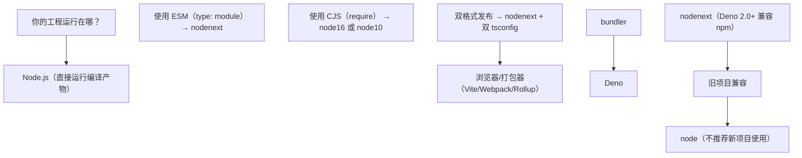
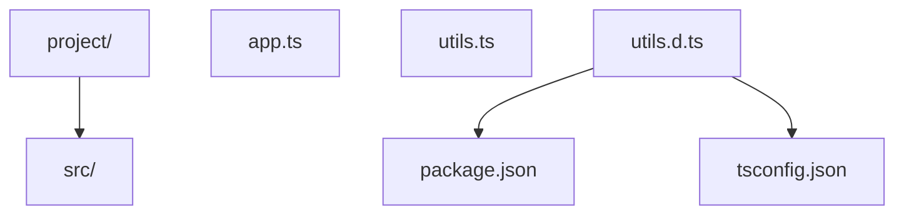
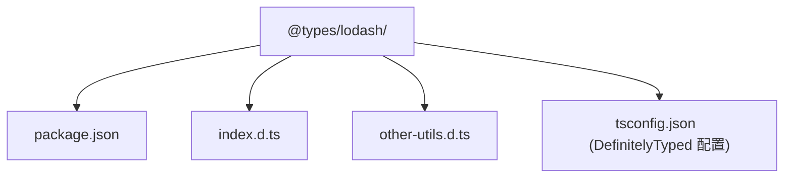
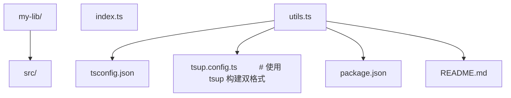
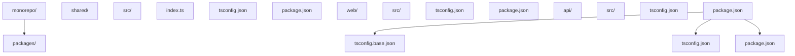
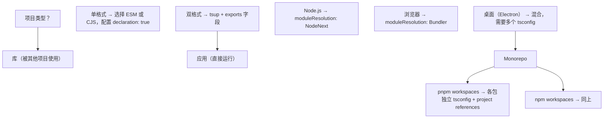

## 知识点地图

- **知识类别**：模块解析（module resolution）——TypeScript 把 `import` 语句里的字符串映射到磁盘文件与类型声明的机制，属于工程配置域。
- **解决什么问题**：`Cannot find module`、包的双格式入口选错、`paths` 别名运行时失效、ESM/CJS 互操作报错这类「不是类型写错、而是编译器没找对人」的问题。
- **什么时候用到**：新工程定 tsconfig 时选 `moduleResolution`；npm 包发布多入口/双格式时写 `exports` 字段；monorepo 跨包引用配置 `paths` 或 `references`；排查「本地能跑 CI 报错」「编译器找到了打包器没找到」类错位。声明文件本身怎么写见[声明文件编写](/typescript/300-DeclarationFileWriting)。

## 前置知识

- [命名空间与模块](/typescript/290-NamespaceModule)：import 语句与模块系统的基本规则
- [import type 与 verbatimModuleSyntax](/typescript/320-ImportTypeVerbatimModuleSyntax)：类型导入与值导入的边界

## 学习目标

- 掌握五种 `moduleResolution` 策略的差异与选择依据
- 会配置 `paths`/`baseUrl` 并理解其运行时落地的三条流派
- 会读写 `package.json` 的 `exports` 字段（types 位置、子路径、条件导出）
- 能处理 ESM 与 CJS 互操作的常见报错

> 阅读提示：正文以代码和白话为主，不出现类型论公式。进阶文档中若出现 `Γ ⊢ e : τ` 这类记号，第一遍可完全跳过（完整规则见 `typescript/020-HowToReadThisCourse`）。

## 1. 学习导论

### 1.1 为什么必须理解模块解析

TypeScript 工程实践中，"找不到模块"、"找不到声明文件"、"类型推断为 any"这三类错误占了所有类型相关错误的相当大比例。它们的根源通常不在类型本身，而在模块解析策略的配置与声明文件的组织方式上。

理解模块解析，意味着能够回答以下问题：

1. 当 TypeScript 看到 `import { x } from 'foo'` 时，它如何确定 `foo` 对应的文件路径？
2. 当 npm 包没有内置类型时，TypeScript 如何从 `@types/foo` 找到声明？
3. 当一个包同时发布 ESM 与 CJS 双格式时，TypeScript 如何选择正确的入口？
4. 当 monorepo 中有多个包相互引用时，如何配置 `paths` 与 `references` 才能既保证类型检查又保证构建正确？

### 1.2 Bloom 认知层次对照

| Bloom 层次 | 对应能力 | 本文对应章节 |
| ---------- | -------- | ------------ |
| remember   | 记住解析策略名称与扩展名纪律 | 第 3 节 |
| understand | 理解五种解析策略的差异 | 第 3 节 |
| apply      | 配置 tsconfig.json 与 exports | 第 4、5、10 节 |
| analyze    | 分析 ESM/CJS 互操作 | 第 6 节 |
| evaluate   | 评估包导出符合性 | 第 9 节 |
| create     | 设计 monorepo 模块策略 | 第 10 节 |

---

## 2. 历史动机与技术演进

### 2.1 JavaScript 模块系统演进

JavaScript 的模块系统经历了漫长的演进，每次演进都直接影响 TypeScript 的模块解析策略：

| 年份 | 规范 | 关键特性 | 影响 |
| ---- | ---- | -------- | ---- |
| 1995 | 无模块系统 | 全局变量 | 命名空间污染 |
| 2009 | CommonJS (CJS) | `require`/`module.exports`，同步加载 | Node.js 服务器端 |
| 2011 | AMD | `define`/`require`，异步加载 | 浏览器 RequireJS |
| 2013 | UMD | 兼容 CJS/AMD/global | 跨环境库 |
| 2015 | ES Modules (ESM) | `import`/`export`，静态分析 | 浏览器原生 |
| 2018 | Node.js ESM | `.mjs`/`type: module` | Node.js 双格式 |
| 2019 | Node.js 12+ | `exports` 字段 | 子路径导出 |
| 2020 | Node.js 14+ | Conditional exports | 条件导出 |
| 2023 | TypeScript 5.0 | `moduleResolution: bundler` | 现代打包器 |

### 2.2 TypeScript 模块解析演进

| TypeScript 版本 | 关键模块特性 |
| --------------- | ------------ |
| 1.0 (2014) | 仅支持 classic 与 node 解析策略 |
| 1.5 (2015) | 支持 ES6 模块语法 |
| 2.0 (2016) | 引入 `paths` 路径映射 |
| 3.0 (2018) | 引入 `--build` 与 project references |
| 3.8 (2020) | 支持 `import type` |
| 4.7 (2022) | 引入 `moduleResolution: node16/nodenext`（`exports` 字段解析随之落地） |
| 5.0 (2023) | 稳定 `moduleResolution: bundler` |
| 5.8 (2025) | `--module node18`、`--erasableSyntaxOnly` 与 `require(esm)` 渐进支持 |

### 2.3 关键设计者

- **Daniel Rosenwasser**：TypeScript 项目主管，主导 moduleResolution 策略演进。
- **Andrew Branch**：TypeScript 团队成员，模块解析与声明文件核心贡献者，撰写了大量官方模块解析文档。
- **Guy Bedford**：Node.js 模块系统核心贡献者，主导 `exports` 字段标准化。
- **Wesley Wiggs**：DefinitelyTyped 维护者，维护 @types 生态。

---

## 3. 模块解析策略

### 3.1 五种模块解析策略

TypeScript 提供五种 `moduleResolution` 选项：

| 策略 | 引入版本 | 适用场景 | 关键特性 |
| ---- | -------- | -------- | -------- |
| `classic` | 1.0 | 旧 ES 模块 | 简单相对路径解析，不查 node_modules |
| `node` (node10) | 1.0 | Node.js CJS | 模拟 Node.js 的 require 解析 |
| `node16` | 4.7 | Node.js ESM/CJS | 严格区分 ESM/CJS，要求扩展名 |
| `nodenext` | 4.7 | Node.js ESM/CJS | 等同于 node16，未来指向最新 |
| `bundler` | 5.0 | 打包器工程 | 模拟 Vite/Webpack 宽松解析 |

### 3.2 classic 解析策略

`classic` 是最简单的解析策略，仅查找相对路径与 ambient 声明：

```typescript
// /src/app.ts
import { foo } from './utils';
// classic 查找：
// 1. /src/utils.ts
// 2. /src/utils.d.ts

import { bar } from 'lodash';
// classic 查找：
// 1. /src/lodash.ts
// 2. /src/lodash.d.ts
// 3. /lodash.ts
// 4. /lodash.d.ts
```

`classic` 不查 node_modules，已不推荐使用。

### 3.3 node (node10) 解析策略

`node` 模拟 Node.js Classic 的 require 解析算法：

```typescript
// /src/app.ts
import { foo } from './utils';
// node 查找：
// 1. /src/utils.ts
// 2. /src/utils.tsx
// 3. /src/utils.d.ts
// 4. /src/utils/package.json (types 字段)
// 5. /src/utils/index.ts
// 6. /src/utils/index.d.ts

import { bar } from 'lodash';
// node 查找：
// 1. /src/node_modules/lodash/package.json (types 字段)
// 2. /src/node_modules/lodash/index.d.ts
// 3. /node_modules/lodash/...
// 4. /node_modules/@types/lodash/index.d.ts
```

`node` 是 TypeScript 4.6 及以前的默认策略，至今仍是最广泛使用的。

### 3.4 node16/nodenext 解析策略

`node16`（4.7+）与 `nodenext`（4.7+）严格对齐 Node.js 12+ 的 ESM/CJS 解析规则：

```typescript
// /src/app.ts (ESM, package.json: "type": "module")
import { foo } from './utils';
// node16 查找：
// 1. /src/utils.ts → 编译为 /src/utils.js
// 必须显式写 .js 扩展名！
// 错误：import { foo } from './utils';  ← 不允许
// 正确：import { foo } from './utils.js';
```

`node16`/`nodenext` 的核心规则：

1. **相对路径必须显式扩展名**：ESM 模式下 `./utils` 无效，必须 `./utils.js`。
2. **package.json type 字段决定模式**：`"type": "module"` 表示 ESM，否则 CJS。
3. **支持 conditional exports**：根据导入方式选择 import/require 入口。
4. **强制区分 .ts 与 .d.ts**：开发时导入 .ts，类型解析 .d.ts。

### 3.5 bundler 解析策略

`bundler`（5.0+）模拟 Vite/Webpack/Rollup 等打包器的宽松解析行为：

```typescript
// bundler 模式下，以下导入都合法
import { foo } from './utils';        // 不需要扩展名
import { bar } from './utils.js';     // 也可以写 .js
import { baz } from './utils.ts';     // 部分打包器允许写 .ts
import { qux } from 'lodash';         // node_modules 解析
```

`bundler` 的关键特性：

1. **不需要扩展名**：与 `node10` 类似。
2. **支持 conditional exports**：与 `node16` 类似。
3. **不强制 ESM/CJS 区分**：打包器会处理互操作。
4. **要求 module 设置**：必须配合 `"module": "esnext"` 或 `"preserve"`。

### 3.6 解析策略选择决策树



### 3.7 实战对比

考虑以下项目结构：



不同解析策略下 `import { x } from './utils'` 的行为：

| 策略 | 是否需要扩展名 | 优先加载 .ts 还是 .d.ts |
| ---- | -------------- | ----------------------- |
| classic | 否 | .ts |
| node (node10) | 否 | .ts |
| node16 (ESM) | 是（.js） | .ts |
| nodenext (ESM) | 是（.js） | .ts |
| bundler | 否 | .ts |

---

## 4. 路径映射与 baseUrl

### 4.1 baseUrl

`baseUrl` 设置模块解析的根目录。设置后，非相对路径导入会从 baseUrl 开始查找：

```jsonc
// tsconfig.json
{
  "compilerOptions": {
    "baseUrl": "./src"
  }
}
```

```typescript
// 等同于从 ./src/utils 导入
import { foo } from 'utils';
```

注意：`baseUrl` 主要用于历史兼容，现代项目推荐使用 `paths` 替代。

### 4.2 paths

`paths` 是更灵活的路径映射机制，支持别名与模式匹配：

```jsonc
{
  "compilerOptions": {
    "baseUrl": ".",
    "paths": {
      "@/*": ["src/*"],
      "@components/*": ["src/components/*"],
      "@utils": ["src/utils/index.ts"],
      "@lib/*": ["libs/*", "node_modules/*"]
    }
  }
}
```

```typescript
import { foo } from '@utils';             // src/utils/index.ts
import { Button } from '@components/Button';  // src/components/Button.ts
import { fetch } from '@lib/api';         // 先查 libs/api，再查 node_modules/api
```

### 4.3 paths 的运行时问题

`paths` 仅是 TypeScript 编译时的别名映射，运行时不会自动转换。需要在打包器或运行时配置中同步映射：

#### Vite 配置

```typescript
// vite.config.ts
import { defineConfig } from 'vite';
import path from 'path';

export default defineConfig({
  resolve: {
    alias: {
      '@': path.resolve(__dirname, './src'),
      '@components': path.resolve(__dirname, './src/components'),
    },
  },
});
```

#### Webpack 配置

```javascript
// webpack.config.js
const path = require('path');

module.exports = {
  resolve: {
    alias: {
      '@': path.resolve(__dirname, 'src'),
      '@components': path.resolve(__dirname, 'src/components'),
    },
  },
};
```

#### tsconfig-paths（Node.js 运行时）

```bash
npm install --save-dev tsconfig-paths
node -r tsconfig-paths/register dist/index.js
```

#### ts-node 配置

```jsonc
// tsconfig.json
{
  "ts-node": {
    "files": true,
    "transpileOnly": true
  },
  "compilerOptions": {
    "paths": { "@/*": ["src/*"] }
  }
}
```

### 4.4 paths 与 monorepo

monorepo 中常使用 paths 跨包引用：

```jsonc
// packages/web/tsconfig.json
{
  "compilerOptions": {
    "baseUrl": ".",
    "paths": {
      "@myorg/shared": ["../shared/src/index.ts"],
      "@myorg/shared/*": ["../shared/src/*"]
    }
  }
}
```

但更推荐使用 project references（`references` 字段），详见[Project References 与 Monorepo](/typescript/420-ProjectReferencesMonorepo)——该篇承接本节之后的 references 编译组织、增量构建与多 tsconfig 布局，本节只讲 paths 视角的跨包引用：

```jsonc
{
  "references": [
    { "path": "../shared" }
  ]
}
```

---

## 5. package.json 的 exports 字段

### 5.1 exports 字段概述

Node.js 12+ 引入 `exports` 字段，用于：

1. 限制包的可导入路径（封装包内部）。
2. 提供多入口（main、module、browser、types）。
3. 条件导出（ESM/CJS/不同环境）。

```jsonc
{
  "name": "my-lib",
  "version": "1.0.0",
  "main": "./dist/index.cjs",         // CJS 入口（旧 Node）
  "module": "./dist/index.mjs",        // ESM 入口（打包器）
  "types": "./dist/index.d.ts",        // 类型入口（旧 TypeScript）
  "exports": {
    ".": {
      "types": "./dist/index.d.ts",
      "import": "./dist/index.mjs",
      "require": "./dist/index.cjs",
      "default": "./dist/index.cjs"
    },
    "./utils": {
      "types": "./dist/utils.d.ts",
      "import": "./dist/utils.mjs",
      "require": "./dist/utils.cjs"
    },
    "./package.json": "./package.json"
  }
}
```

### 5.2 types 条目的位置

**关键规则**：在 conditional exports 中，`types` 必须放在最前面：

```jsonc
{
  "exports": {
    ".": {
      "types": "./dist/index.d.ts",  // 必须在最前
      "import": "./dist/index.mjs",
      "require": "./dist/index.cjs"
    }
  }
}
```

原因：TypeScript 解析 exports 时使用 **first-match** 策略。如果 `import` 在 `types` 之前，TypeScript 可能匹配到 `.mjs` 入口但找不到对应 `.d.ts`。

### 5.3 子路径导出

```jsonc
{
  "name": "my-lib",
  "exports": {
    ".": "./dist/index.js",
    "./utils": "./dist/utils.js",
    "./utils/*": "./dist/utils/*.js",
    "./internal/*": null  // 禁止访问内部模块
  }
}
```

```typescript
import { x } from 'my-lib';           // 解析到 ./dist/index.js
import { y } from 'my-lib/utils';     // 解析到 ./dist/utils.js
import { z } from 'my-lib/utils/foo'; // 解析到 ./dist/utils/foo.js
import { w } from 'my-lib/internal/secret';  // 错误：禁止访问
```

### 5.4 条件导出

Node.js 定义的标准条件：

| 条件 | 含义 |
| ---- | ---- |
| `import` | ESM 导入 |
| `require` | CJS require |
| `node` | Node.js 环境 |
| `deno` | Deno 环境 |
| `browser` | 浏览器环境 |
| `default` | 兜底条件 |

```jsonc
{
  "exports": {
    ".": {
      "node": {
        "import": "./dist/node.mjs",
        "require": "./dist/node.cjs"
      },
      "browser": {
        "import": "./dist/browser.mjs",
        "require": "./dist/browser.cjs"
      },
      "default": "./dist/index.js"
    }
  }
}
```

### 5.5 TypeScript 对 exports 的解析

TypeScript 4.7+ 完整支持 exports 字段解析。配合 `moduleResolution: node16/nodenext/bundler`，TypeScript 会：

1. 读取 `exports.types` 条目作为类型入口。
2. 根据 `import`/`require` 选择运行时入口。
3. 支持子路径导出与条件导出。

### 5.6 双格式发布的完整配置

```jsonc
{
  "name": "@myorg/lib",
  "version": "1.0.0",
  "type": "module",
  "main": "./dist/index.cjs",
  "module": "./dist/index.mjs",
  "types": "./dist/index.d.ts",
  "exports": {
    ".": {
      "types": "./dist/index.d.ts",
      "import": "./dist/index.mjs",
      "require": "./dist/index.cjs"
    },
    "./utils": {
      "types": "./dist/utils.d.ts",
      "import": "./dist/utils.mjs",
      "require": "./dist/utils.cjs"
    },
    "./package.json": "./package.json"
  },
  "files": [
    "dist",
    "src"
  ],
  "sideEffects": false,
  "engines": {
    "node": ">=14.0.0"
  }
}
```

---

## 6. ESM 与 CJS 互操作

### 6.1 互操作的核心问题

ESM 与 CJS 的根本差异：

| 特性 | ESM | CJS |
| ---- | --- | --- |
| 语法 | `import`/`export` | `require`/`module.exports` |
| 加载 | 异步、静态分析 | 同步、动态 |
| `this` 顶层 | `undefined` | `module.exports` |
| `__dirname` | 不可用 | 可用 |
| `require` | 不可用 | 可用 |
| `import.meta.url` | 可用 | 不可用 |
| 默认导出 | `export default` | `module.exports =` 或 `module.exports.default =` |

### 6.2 esModuleInterop

`esModuleInterop` 是 TypeScript 解决 ESM/CJS 互操作的核心选项。它允许 TypeScript 在导入 CJS 模块时模拟 ESM 的默认导入语义：

```typescript
// 不启用 esModuleInterop
import * as express from 'express';
const app = express();

// 启用 esModuleInterop
import express from 'express';
const app = express();
```

`esModuleInterop` 启用后，TypeScript 会生成额外的辅助函数：

```javascript
// 编译产物
var __importDefault = (this && this.__importDefault) || function (mod) {
    return (mod && mod.__esModule) ? mod : { "default": mod };
};
Object.defineProperty(exports, "__esModule", { value: true });
const express_1 = __importDefault(require("express"));
const app = (0, express_1.default)();
```

### 6.3 allowSyntheticDefaultImports

`allowSyntheticDefaultImports` 仅影响类型检查，不影响运行时编译：

- 不启用：导入 CJS 模块时 `import x from 'cjs-module'` 类型错误。
- 启用：类型检查通过，但运行时仍需 `esModuleInterop` 或打包器处理。

`esModuleInterop: true` 自动启用 `allowSyntheticDefaultImports: true`。

### 6.4 互操作场景与配置矩阵

| 项目格式 | 导入 CJS | 导入 ESM | 推荐 tsconfig |
| -------- | -------- | -------- | ------------- |
| CJS (`require`) | 直接 `require(x)` | 使用 dynamic `import()` | `module: commonjs, esModuleInterop: true` |
| ESM (`import`) | 需 `esModuleInterop` 或 default 导入 | 直接 `import x from 'y'` | `module: nodenext, esModuleInterop: true` |
| 打包器 | 直接 `import x from 'y'` | 直接 `import x from 'y'` | `module: esnext, moduleResolution: bundler` |

### 6.5 常见互操作错误

```typescript
// 错误 1：在 ESM 中直接 require
// ESM 文件不能使用 require
import { x } from 'cjs-lib';
const y = require('cjs-lib'); // SyntaxError in ESM

// 修复：使用 createRequire
import { createRequire } from 'module';
const require = createRequire(import.meta.url);
const y = require('cjs-lib');
```

```typescript
// 错误 2：CJS 中导入 ESM（Node.js 22+ 仍不支持同步 require ESM）
const esmMod = require('esm-lib'); // Error: require() of ES Module

// 修复：使用 dynamic import（async）
async function loadEsm() {
  const esmMod = await import('esm-lib');
  return esmMod;
}
```

### 6.6 __dirname 与 __filename 在 ESM 中的替代

```typescript
// ESM 中无 __dirname 和 __filename
import { fileURLToPath } from 'url';
import { dirname } from 'path';

const __filename = fileURLToPath(import.meta.url);
const __dirname = dirname(__filename);
```

### 6.7 import type 与 type-only imports（归并说明）

`import type` 的完整展开（内联 `type` 限定、`verbatimModuleSyntax` 强制显式标注、类型与值的编译边界）已由专篇承载，见[import type 与 verbatimModuleSyntax](/typescript/320-ImportTypeVerbatimModuleSyntax)。本节只保留与互操作直接相关的结论：`import type` 只在类型层生效、编译后消失，因此在 ESM/CJS 双格式包中用它导入类型不会把 CJS 包拖进运行时依赖。

---

## 7. DefinitelyTyped 与 @types

### 7.1 DefinitelyTyped 项目

DefinitelyTyped 是 GitHub 上最大的 TypeScript 声明文件仓库，由社区维护，提供数千个 npm 包的类型声明。所有 @types/* 包都从 DefinitelyTyped 仓库自动发布。

仓库地址：https://github.com/DefinitelyTyped/DefinitelyTyped

### 7.2 安装 @types

```bash
# 安装某个包的类型
npm install --save-dev @types/lodash

# 安装多个包的类型
npm install --save-dev @types/node @types/jest @types/react

# 查看是否有 @types 包
npm info @types/your-package
```

### 7.3 types 与 typeRoots

```jsonc
{
  "compilerOptions": {
    // 显式指定包含的 @types 包（默认包含所有）
    "types": ["node", "jest", "react"],

    // 自定义 typeRoots 路径
    "typeRoots": ["./node_modules/@types", "./types"]
  }
}
```

`types` 配置的影响：

- **不设置**：自动包含 `node_modules/@types` 下所有包。
- **设置为空数组**：不自动包含任何 @types 包。
- **设置为列表**：仅包含列表中的包。

```jsonc
// 仅包含 node 类型，其他 @types 不自动加载
{
  "compilerOptions": {
    "types": ["node"]
  }
}
```

### 7.4 @types 包的结构

一个典型的 @types 包结构：



```jsonc
// @types/lodash/package.json
{
  "name": "@types/lodash",
  "version": "4.14.0",
  "description": "TypeScript definitions for lodash",
  "main": "index.d.ts",
  "types": "index.d.ts"
}
```

### 7.5 自己编写 @types 包

如果 npm 包没有 @types，可以自己编写（声明语法详见[声明文件编写](/typescript/300-DeclarationFileWriting)）：

```typescript
// types/my-lib/index.d.ts
declare module 'my-lib' {
  export interface Options {
    timeout?: number;
  }

  export function doSomething(value: string, options?: Options): Promise<string>;
  export default function doSomethingDefault(): void;
}
```

```jsonc
// tsconfig.json
{
  "compilerOptions": {
    "typeRoots": ["./node_modules/@types", "./types"]
  }
}
```

### 7.6 发布 @types 包

如果觉得自己的类型声明对社区有用，可以提交到 DefinitelyTyped：

1. Fork DefinitelyTyped 仓库。
2. 在 `types/<package-name>/` 下创建声明文件。
3. 添加 `tsconfig.json` 与 `tslint.json`。
4. 提交 PR，等待审核与发布。

---

## 8. 对比分析

### 8.1 与 Python 类型系统的对比

Python 通过 `py.typed` 标记与 PEP 561 提供类型支持，机制类似 TypeScript：

```python
# Python 包内联类型
# my_package/__init__.py
def hello(name: str) -> str:
    return f"Hello, {name}"

# my_package/py.typed  # 空文件，标记支持类型
```

差异：

- TypeScript 声明与实现分离（.d.ts vs .ts）。
- Python 类型与实现同文件，通过 stub 文件（.pyi）支持分离。
- Python 的类型检查器（mypy/pyright）独立于运行时。

### 8.2 与 Rust 模块系统的对比

Rust 的模块系统更严格：

```rust
// Rust 模块声明
mod utils;
use crate::utils::helper;

// 必须在 lib.rs 或 main.rs 显式声明模块
// 不存在自动模块发现
```

差异：

- Rust 模块基于文件系统但需要显式声明。
- TypeScript 模块基于文件系统，自动发现。
- Rust 的 crate（包）系统更接近 monorepo。

### 8.3 与 Go 模块系统的对比

Go 的模块系统简化：

```go
// Go 模块导入
import (
    "fmt"
    "github.com/user/repo/pkg"
)

// 包名与导入路径的最后一段相同
// 不需要扩展名
// 没有 .d.ts 等类型声明文件（类型与实现同文件）
```

差异：

- Go 类型与实现同文件，不需要声明文件。
- Go 模块路径基于 URL（github.com/user/repo）。
- Go 没有 @types 等价物。

### 8.4 综合对比

| 特性 | TypeScript | Python | Rust | Go |
| ---- | ---------- | ------ | ---- | --- |
| 声明文件 | .d.ts | .pyi | 无 | 无 |
| 模块解析 | 多策略 | sys.path | Cargo + mod | URL + GOPATH |
| 类型与实现分离 | 支持 | 支持（stub） | 不支持 | 不支持 |
| 包生态 | npm + @types | PyPI | crates.io | pkg.go.dev |
| 类型检查器 | tsc | mypy/pyright | rustc | go vet |

---

## 9. 常见陷阱与修复（解析域）

### 9.1 陷阱 1：NodeNext 下未使用扩展名

```typescript
// 错误
import { foo } from './utils';

// 修复
import { foo } from './utils.js';
```

NodeNext 要求相对路径导入必须显式写 `.js` 扩展名（即使源文件是 `.ts`）。

### 9.2 陷阱 2：types 条目顺序错误

```jsonc
// 错误：types 在 import 后
{
  "exports": {
    ".": {
      "import": "./dist/index.mjs",
      "types": "./dist/index.d.ts"  // 不会被匹配
    }
  }
}
```

修复：

```jsonc
{
  "exports": {
    ".": {
      "types": "./dist/index.d.ts",  // 必须在最前
      "import": "./dist/index.mjs"
    }
  }
}
```

### 9.3 陷阱 3：路径映射未在运行时同步

```typescript
// tsconfig.json paths 配置 @/components → src/components
import { Button } from '@/components/Button';
// TypeScript 通过，但运行时找不到 @/components
```

修复：在打包器或运行时配置中同步别名映射（见 4.3 节）。

### 9.4 陷阱 4：循环导入的类型丢失

```typescript
// a.ts
import { B } from './b';
export interface A { b: B; }

// b.ts
import { A } from './a';
export interface B { a: A; }
```

修复：使用 `import type` 仅导入类型，避免运行时循环：

```typescript
// a.ts
import type { B } from './b';
export interface A { b: B; }

// b.ts
import type { A } from './a';
export interface B { a: A; }
```

### 9.5 陷阱 5：lib.d.ts 冲突

```typescript
// 错误：自定义类型与 lib.d.ts 冲突
interface Array<T> {
  // 与 ES2022 的 Array.at 冲突
  at(index: number): T | undefined;
}
```

修复：使用 lib 选项选择标准库版本，避免手动重复定义。

### 9.6 陷阱 6：跳过 lib 检查导致的错误

```jsonc
{
  "compilerOptions": {
    "skipLibCheck": true  // 跳过 .d.ts 检查
  }
}
```

`skipLibCheck` 会跳过所有 .d.ts 文件的类型检查，可能隐藏第三方库的类型错误。仅在大型项目性能优化时使用。

> 声明域的陷阱（找不到模块声明、declare module 覆盖 @types）见[声明文件编写](/typescript/300-DeclarationFileWriting)的陷阱章节。

---

## 10. 工程实践

### 10.1 现代项目 tsconfig.json 模板

#### 打包器工程（Vite/Webpack）

```jsonc
{
  "compilerOptions": {
    "target": "ES2022",
    "module": "ESNext",
    "moduleResolution": "bundler",
    "lib": ["ES2023", "DOM", "DOM.Iterable"],
    "jsx": "react-jsx",
    "strict": true,
    "esModuleInterop": true,
    "skipLibCheck": true,
    "forceConsistentCasingInFileNames": true,
    "resolveJsonModule": true,
    "isolatedModules": true,
    "verbatimModuleSyntax": true,
    "noEmit": true,
    "paths": {
      "@/*": ["src/*"]
    }
  },
  "include": ["src", "types"],
  "exclude": ["node_modules", "dist"]
}
```

#### Node.js ESM 工程

```jsonc
{
  "compilerOptions": {
    "target": "ES2022",
    "module": "NodeNext",
    "moduleResolution": "NodeNext",
    "lib": ["ES2023"],
    "strict": true,
    "esModuleInterop": true,
    "skipLibCheck": true,
    "forceConsistentCasingInFileNames": true,
    "resolveJsonModule": true,
    "declaration": true,
    "declarationMap": true,
    "sourceMap": true,
    "outDir": "./dist",
    "rootDir": "./src"
  },
  "include": ["src"],
  "exclude": ["node_modules", "dist"]
}
```

#### 库工程（双格式发布）

```jsonc
// tsconfig.json
{
  "compilerOptions": {
    "target": "ES2020",
    "module": "ESNext",
    "moduleResolution": "Bundler",
    "lib": ["ES2020"],
    "strict": true,
    "declaration": true,
    "declarationMap": true,
    "emitDeclarationOnly": true,
    "outDir": "./dist/types",
    "rootDir": "./src"
  },
  "include": ["src"],
  "exclude": ["node_modules", "dist", "**/*.test.ts"]
}
```

### 10.2 双格式发布工程结构



```typescript
// tsup.config.ts
import { defineConfig } from 'tsup';

export default defineConfig({
  entry: ['src/index.ts', 'src/utils.ts'],
  format: ['cjs', 'esm'],
  dts: true,                  // 生成 .d.ts
  splitting: false,
  sourcemap: true,
  clean: true,
  treeshake: true,
});
```

```jsonc
// package.json
{
  "name": "my-lib",
  "version": "1.0.0",
  "type": "module",
  "main": "./dist/index.cjs",
  "module": "./dist/index.mjs",
  "types": "./dist/index.d.ts",
  "exports": {
    ".": {
      "types": "./dist/index.d.ts",
      "import": "./dist/index.mjs",
      "require": "./dist/index.cjs"
    },
    "./utils": {
      "types": "./dist/utils.d.ts",
      "import": "./dist/utils.mjs",
      "require": "./dist/utils.cjs"
    }
  },
  "files": ["dist"],
  "sideEffects": false,
  "engines": {
    "node": ">=14"
  }
}
```

### 10.3 monorepo 模块解析（与 Project References 分工）



```jsonc
// tsconfig.base.json
{
  "compilerOptions": {
    "target": "ES2022",
    "module": "NodeNext",
    "moduleResolution": "NodeNext",
    "strict": true,
    "declaration": true,
    "declarationMap": true,
    "sourceMap": true
  }
}
```

```jsonc
// packages/shared/tsconfig.json
{
  "extends": "../../tsconfig.base.json",
  "compilerOptions": {
    "outDir": "./dist",
    "rootDir": "./src"
  },
  "include": ["src"]
}
```

```jsonc
// packages/web/tsconfig.json
{
  "extends": "../../tsconfig.base.json",
  "compilerOptions": {
    "outDir": "./dist",
    "rootDir": "./src",
    "paths": {
      "@myorg/shared": ["../shared/src"],
      "@myorg/shared/*": ["../shared/src/*"]
    }
  },
  "references": [
    { "path": "../shared" }
  ],
  "include": ["src"]
}
```

`references` 字段的增量编译、`tsc --build` 工作流与多项目布局的完整展开见[Project References 与 Monorepo](/typescript/420-ProjectReferencesMonorepo)，本节保留 paths 视角的对照，避免两篇重复展开同一配置。

### 10.4 project references 实战（速览）

```jsonc
// 顶层 tsconfig.json
{
  "files": [],
  "references": [
    { "path": "./packages/shared" },
    { "path": "./packages/web" },
    { "path": "./packages/api" }
  ]
}
```

使用 `tsc --build` 增量编译：

```bash
tsc --build                # 构建所有引用的项目
tsc --build --watch        # 增量监听
tsc --build --force        # 强制重新构建
tsc --build --clean        # 清理构建产物
```

深入版见[Project References 与 Monorepo](/typescript/420-ProjectReferencesMonorepo)。

### 10.5 类型检查脚本

```jsonc
// package.json
{
  "scripts": {
    "type-check": "tsc --noEmit",
    "type-check:watch": "tsc --noEmit --watch",
    "build:types": "tsc --emitDeclarationOnly",
    "build": "tsc && vite build"
  }
}
```

---

## 11. 案例研究（解析域）

### 11.1 案例一：Vite + React 项目

```jsonc
// vite.config.ts
import { defineConfig } from 'vite';
import react from '@vitejs/plugin-react';
import path from 'path';

export default defineConfig({
  plugins: [react()],
  resolve: {
    alias: {
      '@': path.resolve(__dirname, './src'),
    },
  },
});
```

```jsonc
// tsconfig.json
{
  "compilerOptions": {
    "target": "ES2022",
    "module": "ESNext",
    "moduleResolution": "bundler",
    "lib": ["ES2023", "DOM", "DOM.Iterable"],
    "jsx": "react-jsx",
    "strict": true,
    "noEmit": true,
    "paths": {
      "@/*": ["src/*"]
    }
  },
  "include": ["src"]
}
```

### 11.2 案例二：Node.js ESM 服务

```jsonc
// package.json
{
  "name": "my-api",
  "version": "1.0.0",
  "type": "module",
  "main": "dist/index.js",
  "scripts": {
    "dev": "tsx watch src/index.ts",
    "build": "tsc",
    "start": "node dist/index.js"
  }
}
```

```jsonc
// tsconfig.json
{
  "compilerOptions": {
    "target": "ES2022",
    "module": "NodeNext",
    "moduleResolution": "NodeNext",
    "lib": ["ES2023"],
    "strict": true,
    "declaration": true,
    "outDir": "./dist",
    "rootDir": "./src"
  },
  "include": ["src"]
}
```

```typescript
// src/index.ts
import express from 'express';
import { router } from './routes.js';  // 必须显式 .js

const app = express();
app.use(router);
app.listen(3000);
```

### 11.3 案例三：npm 库双格式发布

```typescript
// src/index.ts
export class MyClass {
  constructor(public value: number) {}

  double(): number {
    return this.value * 2;
  }
}

export function helper(x: string): string {
  return x.toUpperCase();
}
```

```jsonc
// package.json
{
  "name": "@myorg/lib",
  "version": "1.0.0",
  "type": "module",
  "main": "./dist/index.cjs",
  "module": "./dist/index.mjs",
  "types": "./dist/index.d.ts",
  "exports": {
    ".": {
      "types": "./dist/index.d.ts",
      "import": "./dist/index.mjs",
      "require": "./dist/index.cjs"
    }
  },
  "files": ["dist"],
  "scripts": {
    "build": "tsup",
    "prepublishOnly": "npm run build"
  },
  "devDependencies": {
    "tsup": "^8.0.0",
    "typescript": "^5.4.0"
  }
}
```

### 11.4 案例四：JSON 模块导入

```jsonc
// tsconfig.json
{
  "compilerOptions": {
    "resolveJsonModule": true,
    "esModuleInterop": true
  }
}
```

```typescript
// config.json
{
  "appName": "MyApp",
  "version": "1.0.0"
}

// app.ts
import config from './config.json';
console.log(config.appName);  // 类型推导为 string
```

### 11.5 案例五：动态导入

```typescript
// 动态导入返回 Promise<T>
const module = await import('./utils.js');
// module 类型为 typeof import('./utils.js')

// 配合代码分割
const routes = {
  home: () => import('./pages/Home.js'),
  about: () => import('./pages/About.js'),
  contact: () => import('./pages/Contact.js'),
};

type RouteLoader = () => Promise<typeof import('./pages/Home.js')>;
```

> 声明域案例（扩展 Express 类型、Webpack 静态资源声明、Vue SFC 声明、自定义类型声明组织）见[声明文件编写](/typescript/300-DeclarationFileWriting)的案例章节。

---

## 12. 练习

### 填空题知识点讲解

1. **[remember]** TypeScript 5.0+ 推荐的现代模块解析策略中，____适合打包器工程，____适合 Node.js ESM 工程。
   （提示：回忆第 3 节的策略表——一个模仿打包器，一个模仿 Node 原生 ESM。）

2. **[remember]** 在 NodeNext 解析策略下，相对路径导入必须显式包含____扩展名，且 .ts 源文件对应的运行时导入路径应写为____。
   （提示：源码写 `.ts`，导入路径写编译产物的名字。）

3. **[understand]** package.json 的 exports 字段中，____条件用于声明 TypeScript 类型入口，其值必须以____开头。
   （提示：条件名见 5.4 节的条件表；路径以 dist 产物目录约定开头。）

4. **[remember]** TypeScript 内置的声明文件位于 ____目录，可通过 ____ 选项配置包含哪些标准库。
   （提示：答案的完整展开见[声明文件编写](/typescript/300-DeclarationFileWriting)与 `typescript/lib` 目录；此处先记住「内置声明文件 + lib 选项」这对搭档。）

5. **[understand]** 条件导出的匹配使用____策略，因此 `types` 条目必须放在____。
   （提示：第 5.2 节讲过 first-match。）

### 代码修复题

1. **[apply]** 以下 NodeNext 工程代码报错 "Could not find a declaration file for module './utils'"。请修复导入语句。

   ```typescript
   // src/index.ts
   import { helper } from './utils';
   ```

   修复方案（先自己改，再对照）：

   ```typescript
   // NodeNext 要求相对路径导入显式写 .js 扩展名
   import { helper } from './utils.js';
   ```

2. **[apply]** 以下 package.json exports 配置导致 TypeScript 无法找到类型，请修复。

   ```json
   {
     "exports": {
       ".": {
         "import": "./dist/index.mjs",
         "require": "./dist/index.cjs",
         "types": "./dist/index.d.ts"
       }
     }
   }
   ```

   修复方案（先自己改，再对照）：

   ```json
   {
     "exports": {
       ".": {
         "types": "./dist/index.d.ts",
         "import": "./dist/index.mjs",
         "require": "./dist/index.cjs"
       }
     }
   }
   ```

### 开放题

1. **[evaluate]** 你正在为一个同时支持 ESM 与 CJS 双格式发布的 npm 包编写 package.json。请描述 exports 字段的完整结构，包括 main、module、import、require、types 条目，并说明为什么 types 条目必须放在最前面。

2. **[create]** 设计一个 monorepo 项目的模块解析策略，要求：
   - 使用 pnpm workspaces
   - 包含 shared、web、api 三个包
   - shared 包被 web 和 api 共享
   - web 使用 bundler 解析，api 使用 NodeNext 解析
   - 提供 tsconfig.base.json 与各包的 tsconfig.json
   - 描述构建与开发流程

3. **[evaluate]** 对比 moduleResolution: node、node16、nodenext、bundler 四种策略的优劣，并说明在什么场景下应该选择哪种。

---

## 13. 参考与致谢

### 13.1 官方文档

- **TypeScript 官方 tsconfig 参考：moduleResolution**（https://www.typescriptlang.org/tsconfig/#moduleResolution，文档许可 Apache-2.0）：本文五种解析策略、exports 解析规则的基准来源。
- **TypeScript 官方文档：Modules Reference**（https://www.typescriptlang.org/docs/handbook/modules/introduction.html，文档许可 CC-BY 4.0）：模块理论背景。
- **Node.js 官方文档：Packages（exports 字段）**（https://nodejs.org/api/packages.html，许可 CC-BY 4.0）：exports 条件导出的原始定义。

### 13.2 书籍

- **《Programming TypeScript》**——Boris Cherny，O'Reilly 2019。第 9 章对模块解析有详尽讲解。
- **《Effective TypeScript》**——Dan Vanderkam，O'Reilly 2019。第 7 章包含模块配置实践。
- **《Learning TypeScript》**——Josh Goldberg，O'Reilly 2022。第 8 章涵盖声明文件编写。
- **《TypeScript Cookbook》**——Stefan Baumgartner，O'Reilly 2023。
- **《Elevate Web Apps with TypeScript》**——Yvonne Zhang，Manning 2024。

### 13.3 论文

- Bierman, G., Abadi, M., and Torgersen, M. 2014. *Understanding TypeScript*. ECOOP 2014.
- Guarneri, S. and Gardner, P. 2021. *A formal semantics for ES modules*. ESOP 2021.
- Bradley, M. and Bonsangue, M. 2018. *A formal semantics for the JavaScript module system*. FESCA 2018.

### 13.4 开源项目

- **DefinitelyTyped**（https://github.com/DefinitelyTyped/DefinitelyTyped）：最大的社区声明文件仓库。
- **tsup**（https://github.com/egoist/tsup）：零配置 TypeScript 构建工具，支持双格式发布。
- **tshy**（https://github.com/isaacs/tshy）：Isaac Schlueter 的 TypeScript 双格式发布工具。
- **unbuild**（https://github.com/unjs/unbuild）：JavaScript/TypeScript 构建工具。
- **tsx**（https://github.com/privatenumber/tsx）：TypeScript 运行时执行器，支持 ESM/CJS。

### 13.5 视频课程

- **Microsoft Build: TypeScript Deep Dives**——Microsoft Build 大会的 TypeScript 模块解析讲座。
- **TypeScript Congress**——年度 TypeScript 大会，模块解析相关讲座。
- **Matt Pocock's Total TypeScript**（https://www.totaltypescript.com）——模块解析与声明文件实战课程。

### 13.6 工具

- **arethetypeswrong**（https://github.com/arethetypeswrong/arethetypeswrong.github.io）：检查 npm 包类型声明正确性的工具。
- **ts-types-check**：批量检查 TypeScript 类型声明质量的工具。
- **@arethetypeswrong/core**：可集成的类型检查库。

---

## 附录 A：模块解析策略对比表

| 特性 | classic | node (node10) | node16 | nodenext | bundler |
| ---- | ------- | ------------- | ------ | -------- | ------- |
| 引入版本 | 1.0 | 1.0 | 4.7 | 4.7 | 5.0 |
| 相对路径扩展名 | 可省 | 可省 | 必须显式 | 必须显式 | 可省 |
| node_modules 查找 | 否 | 是 | 是 | 是 | 是 |
| exports 字段 | 否 | 否 | 是 | 是 | 是 |
| ESM/CJS 区分 | 否 | 否 | 是 | 是 | 否 |
| conditional exports | 否 | 否 | 是 | 是 | 是 |
| 推荐 | 不推荐 | 旧项目 | Node.js | Node.js 现代项目 | 打包器 |

## 附录 B：常见 tsconfig.json 选项速查

| 选项 | 类型 | 作用 |
| ---- | ---- | ---- |
| `module` | enum | 模块系统：commonjs/esnext/nodenext |
| `moduleResolution` | enum | 解析策略 |
| `baseUrl` | string | 路径映射根 |
| `paths` | object | 路径别名映射 |
| `types` | array | 显式指定 @types 包 |
| `typeRoots` | array | @types 搜索路径 |
| `lib` | array | 内置标准库 |
| `esModuleInterop` | boolean | ESM/CJS 互操作辅助 |
| `allowSyntheticDefaultImports` | boolean | 允许合成默认导入 |
| `resolveJsonModule` | boolean | 允许导入 JSON |
| `isolatedModules` | boolean | 单文件编译模式 |
| `verbatimModuleSyntax` | boolean | 强制显式 type 导入 |
| `declaration` | boolean | 生成 .d.ts |
| `declarationMap` | boolean | 生成 .d.ts.map |
| `emitDeclarationOnly` | boolean | 仅生成声明 |
| `skipLibCheck` | boolean | 跳过 .d.ts 检查 |

## 附录 C：错误信息索引

| 错误码 | 错误信息 | 常见原因 |
| ------ | -------- | -------- |
| TS2307 | Cannot find module 'X' or its corresponding type declarations. | 模块未安装或声明文件缺失 |
| TS2688 | Cannot find type definition file for 'X'. | @types/X 未安装或 types 配置错误 |
| TS2459 | Module 'X' declares 'X' locally, but it is not exported. | 导入路径与实际导出不匹配 |
| TS5097 | An import path cannot end with a '.ts' extension. | 导入路径不能以 .ts 结尾（除 Bundler） |
| TS2835 | Relative import paths need explicit file extensions. | NodeNext 要求显式扩展名 |
| TS1511 | Module 'X' has no default export. | esModuleInterop 未启用 |
| TS2614 | Module 'X' can only be default-imported using esModuleInterop. | esModuleInterop 未启用 |

## 附录 D：决策流程图



---

## 模块基础（速查）

**基本写法：导出**
`export <声明>`

```typescript
// 导出变量函数类型等
export const name = "Tom"
export function greet() {}
export type User = { name: string }
```

---

**基本写法：默认导出**
`export default <声明>`

```typescript
// 每个模块只能有一个默认导出
export default class User {}
```

---

**基本写法：命名导入**
`import { <名称>, <名称> } from "<模块>"`

```typescript
// 按名导入多个
import { name, greet } from "./user"
```

---

**基本写法：默认导入**
`import <名称> from "<模块>"`

```typescript
// 导入默认导出
import User from "./User"
```

---

**基本写法：别名导入**
`import { <名称> as <别名> } from "<模块>"`

```typescript
// 重命名导入避免冲突
import { name as userName } from "./user"
```

---

**基本写法：命名空间导入**
`import * as <名称> from "<模块>"`

```typescript
// 整体导入为一个对象
import * as utils from "./utils"
utils.format()
```

---

## 类型与值导入（速查）

**基本写法：import type**
`import type { <类型> } from "<模块>"`

```typescript
// 仅导入类型编译时移除
import type { User } from "./types"
```

---

**基本写法：内联 type 限定**
`import { type <类型>, <值> } from "<模块>"`

```typescript
// 混合导入时标记类型
import { type User, getUser } from "./user"
```

---

**基本写法：export type**
`export type { <类型> }`

```typescript
// 仅导出类型
export type { User } from "./types"
```

---

## CommonJS 互操作（速查）

**基本写法：导入 CommonJS 模块**
`import <名称> = require("<模块>")`

```typescript
// CommonJS 模块导入
import fs = require("fs")
```

---

**基本写法：导出 CommonJS**
`export = <对象>`

```typescript
// CommonJS 风格导出
class User {}
export = User
```

---

**基本写法：esModuleInterop**
`import <名称> from "<CommonJS模块>"`

```typescript
// 开启 esModuleInterop 后默认导入
import fs from "fs"
```

---

## 动态导入（速查）

**基本写法：动态 import 类型**
`const <模块> = await import("<模块>")`

```typescript
// 动态导入类型为 Promise<typeof import>
const mod = await import("./user")
mod.greet()
```

---

**基本写法：动态导入类型**
`type <类型> = typeof import("<模块>")`

```typescript
// 推导模块类型
type UserModule = typeof import("./user")
```

---

## 实用模式（速查）

**基本写法：barrel 导出**
`export * from "<模块>"`

```typescript
// index.ts 汇总导出
export * from "./user"
export * from "./post"
export * from "./comment"
```

---

**基本写法：选择性 barrel**
`export { <名称>, <名称> } from "<模块>"`

```typescript
// 选择性重新导出
export { User, getUser } from "./user"
export type { UserProps } from "./user"
```

---

**基本写法：声明 JSON 模块**
`declare module "*.json"`

```typescript
// 允许 import JSON
declare module "*.json" {
    const value: any
    export default value
}
```

---

**基本写法：环境变量类型**
`interface ImportMetaEnv { }`

```typescript
// Vite 环境变量类型
interface ImportMetaEnv {
    readonly VITE_API: string
}
interface ImportMeta {
    readonly env: ImportMetaEnv
}
```

---

## 模块解析（速查）

**基本写法：bundler 解析策略（现代构建工具推荐）**
`"moduleResolution": "bundler"`

```typescript
// tsconfig 配置 bundler 解析
// 允许省略扩展名，支持 package.json exports
```

---

**基本写法：bundler 解析策略**
`"moduleResolution": "bundler"`

```typescript
// TS 5.0+ 适配打包工具的解析
// 支持 package.json exports 字段
```

---

**基本写法：paths 路径映射**
`"paths": { "<别名>": ["<路径>"] }`

```typescript
// tsconfig 配置路径别名
{
    "compilerOptions": {
        "baseUrl": ".",
        "paths": { "@/*": ["src/*"] }
    }
}
```

---

## 注意事项（速查）

**基本写法：模块与脚本区分**
`export <声明>` 或 `import <名称>`

```typescript
// 含 import export 的是模块
// 否则是脚本全局可见
```

---

**基本写法：isolatedModules**
`"isolatedModules": true`

```typescript
// 单文件转译模式约束
// 要求类型导入显式标注
export type { User }
```
