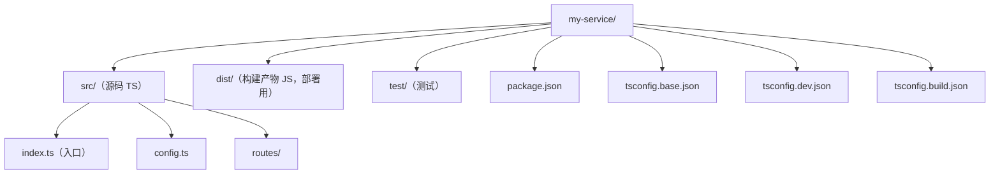

## 知识点地图

- **知识类别**：Node.js + TypeScript 工程化——目录结构、tsconfig 分层、开发/构建/启动脚本组成的工程骨架。
- **解决什么问题**：「Node 项目怎么组织 TS」「开发热重载与构建产物怎么分工」「ESM 的 tsconfig 到底怎么配」「esbuild 那么快为什么还要 tsc」。
- **什么时候用到**：新建 Node 服务/CLI 工程；把旧 CJS 工程迁到 ESM；给团队定工程模板；排查「本地跑得好好的，CI 类型检查炸了」。

> 阅读提示：正文以代码和白话为主，不出现类型论公式。进阶文档中若出现 `Γ ⊢ e : τ` 这类记号，第一遍可完全跳过（完整规则见 `typescript/020-HowToReadThisCourse`）。


## 概述

Node.js + TypeScript 工程化的目标是让开发、构建、部署三个阶段互不干扰：开发时用热重载快速验证，构建时用 `tsc` 产出干净的 JavaScript，部署时只携带 `dist` 与生产依赖。实现这一目标的最小骨架是"固定目录 + 双 tsconfig + 三个脚本命令"：基础配置统一编译选项，开发配置开启源码映射与 watch 模式，构建配置输出到 dist 并保留类型声明。本文给出可直接套用的工程模板，逐项解释目录、配置与脚本的取舍，并列出常见的坑位。

## 目录结构



## tsconfig：一个基础 + 两个场景

```jsonc
// tsconfig.base.json：共享编译选项
{
  "compilerOptions": {
    "target": "ES2022",
    "module": "NodeNext",
    "moduleResolution": "NodeNext",
    "strict": true,
    "outDir": "dist",
    "rootDir": "src",
    "sourceMap": true,
    "declaration": true,
    "skipLibCheck": true
  },
  "include": ["src"]
}
```

```jsonc
// tsconfig.dev.json：开发期只做类型检查，不产出文件
{
  "extends": "./tsconfig.base.json",
  "compilerOptions": {
    "noEmit": true
  }
}
```

```jsonc
// tsconfig.build.json：构建期产出 dist
{
  "extends": "./tsconfig.base.json"
}
```

三个文件的分工读一遍就懂：base 管「这份代码按什么规则编译」，dev 在其上加「只检查、别产出」，build 原样继承——构建配置简单到只剩一行 extends，正是模板想要的效果。

### Node ESM 的 tsconfig 逐项核对

`module: NodeNext` 一旦确定，有四个选项被连带锁定，漏一个就是运行时报错：

```jsonc
{
  "compilerOptions": {
    "module": "NodeNext",
    "moduleResolution": "NodeNext",  // 必须与 module 同步；写 NodeNext 会自动带出，但显式写出更醒目
    "verbatimModuleSyntax": true,    // 类型导入必须显式 import type——ESM 下 tsc 无法再靠「有没有被 import」猜
    "sourceMap": true,               // 配合 node --enable-source-maps
    "declaration": true              // 库工程必开；纯应用可关
  }
}
```

- `verbatimModuleSyntax` 在 CJS 时代是可选项（tsc 会帮你删掉没用的类型导入），在 NodeNext/ESM 下是准必需：ESM 的 `import` 语句会被 Node 原样执行，类型导入若不显式标注 `type`，可能引入真实运行时依赖。
- `package.json` 里 `"type": "module"` 与 tsconfig 的 `module` 是两套系统但必须一致：一个是 Node 的运行时判定，一个是 tsc 的编译目标。两者不一致时，编译产物会被 Node 以错误的模块格式加载。
- 相对导入必须写编译产物的扩展名（`import { x } from './config.js'`，源文件是 `config.ts`）——原理与排查见[模块解析进阶与 ESM/CJS 互操作](/typescript/315-PackageExportsEsmInterop)。

## 构建工具选型：tsc vs esbuild/swc 的真相

Node TS 工程最常见的架构误判是把「转译器」当「编译器」用。三者的本质差异：

| 工具 | 类型检查 | 产物质量 | 速度 | 适用位置 |
| --- | --- | --- | --- | --- |
| `tsc` | 全量检查 | 稳定规范（含 .d.ts） | 慢（万行级秒到十秒） | CI 门禁、库发布 |
| `esbuild`/`swc` | **零检查**（只转译、类型直接剥掉） | 快但默认不做声明文件 | 快一个数量级 | 开发热重载 |
| `tsx` | 零检查（esbuild 内核） | 直接运行 TS | 快 | dev 脚本 |

「esbuild 不做类型检查」意味着：把 `build: "esbuild src/index.ts --bundle"` 当唯一构建的工程，任何类型错误都能一路带进生产——`strict` 配置形同虚设，因为没人读它。这不是 esbuild 的缺陷，是分工：转译器负责快，检查器负责对。

工程上的正解是「双轨制」，本模板的三个脚本正是为此设计：

```json
{
  "scripts": {
    "dev": "tsx watch src/index.ts",          // 快轨：转译器，热重载，零检查
    "build": "tsc -p tsconfig.build.json",    // 慢轨：编译器，全量检查 + 产物
    "typecheck": "tsc -p tsconfig.dev.json",  // CI 门禁：只检查不产出
    "prepublishOnly": "pnpm typecheck && pnpm build"  // 发布前强制走慢轨
  }
}
```

选型决策树：**库里有没有给别人用的类型（.d.ts）？有 → tsc 主导构建。是纯应用且构建耗时已影响迭代 → esbuild 转译 + tsc 仅做 typecheck 门禁（fastify/nest 生态常见组合）。全流程 tsc 都够快 → 别引入第二个工具。** 盲目上 esbuild 只为省 3 秒构建、却要另养一套产物校验，得不偿失。

## 三个脚本命令

```json
{
  "scripts": {
    "dev": "tsx watch src/index.ts",
    "build": "tsc -p tsconfig.build.json",
    "start": "node dist/index.js",
    "typecheck": "tsc -p tsconfig.dev.json"
  }
}
```

```typescript
// src/index.ts：最小示例
import { createServer } from 'node:http';

const port = Number(process.env.PORT ?? 3000);

createServer((req, res) => {
  res.writeHead(200, { 'content-type': 'text/plain; charset=utf-8' });
  res.end('hello');
}).listen(port, () => {
  console.log(`listening on ${port}`);
});
```

开发用 `pnpm dev`（tsx 直接跑 TS），提交前 `pnpm typecheck`，
发布时 `pnpm build && pnpm start`。

## 源码映射：让断点与报错指回 .ts

`sourceMap: true` 让构建产物旁边多出 `.map` 文件，运行报错的堆栈因此能映射回 `.ts` 源码行号。Node 侧开启方式是运行参数 `node --enable-source-maps dist/index.js`（可把它并进 `start` 脚本），编辑器调试则自动读取。验证方法：在 `index.ts` 故意抛一个错，对比开关前后堆栈的行号——开着时指向 `.ts`，关着时指向 `dist` 里的 `.js`。

## 常见误区

| 误区 | 真相 |
| --- | --- |
| 生产环境直接跑 ts-node/tsx | 部署应使用构建后的 JS，避免运行时依赖 TS 编译 |
| module 随意设成 CommonJS | ESM 项目应使用 NodeNext，让 Node 正确解析 `.js` 导入 |
| 导入写 `./config` 不写扩展名 | NodeNext 下 ESM 要求显式 `.js`（TS 源文件里写 `./config.js`） |
| dist 里混入测试文件 | `rootDir: src` + include 只编译 src，测试放 test/ 不参与构建 |

## 小结

这套骨架的核心是"开发快、构建干净、类型严格"：
`tsx` 负责开发体验，`tsc` 负责产物质量，双 tsconfig 让两件事互不干扰。
继续深化可看 tsconfig 严格模式 与
编译与性能优化。

## 动手练习（先遮住参考实现）

预计 30 分钟，从空目录把本文骨架搭出来。搭的过程比模板本身值钱——每个里程碑都有可观察的输出，错了当场暴露。

**练习一（10 分钟）：骨架最小可运行**

建目录 `my-service/`，`pnpm init` 后安装三个依赖：`tsx`（开发）、`typescript` 与 `@types/node`（检查）。把本文的目录结构、三个 tsconfig 与 `index.ts` 逐个文件敲出来（别复制粘贴，敲的时候每个字段的用途会过一遍脑子）。验收：`pnpm dev` 启动后浏览器访问 `http://localhost:3000` 看到 `hello`，改一行 `index.ts` 保存，终端看到 tsx 自动重启。

**练习二（10 分钟）：让严格模式拦住你**

在 `index.ts` 里故意写三处类型错误：`process.env.PORT + 1`（env 的值是 `string | undefined`，不许直接算术）；`res.end(42)`（end 只收 string 或二进制）；从 `./nonexistent` 导入一个不存在的模块。逐个运行 `pnpm typecheck`，把三段报错的关键词抄进笔记——以后再见到同样的报错，你能秒级定位。

**练习三（10 分钟）：构建产物巡检**

跑 `pnpm build`，进入 `dist/` 回答三个问题：`.js` 文件里还有没有类型标注？`.d.ts` 里有什么？`.map` 文件是给谁用的？然后把 `package.json` 的 `start` 脚本改成带 `--enable-source-maps`，在 `index.ts` 里 `throw new Error('巡检')` 后 `pnpm build && pnpm start`，对比堆栈指向的是 `.ts` 还是 `.js`。验收标准：三个问题都能一句话答出。

### 参考答案（练习三，先别看）

`.js` 里没有类型——`tsc` 编译时剥掉，类型只活在源码与 `.d.ts` 里；`.d.ts` 是给「用这个包的人」的类型说明书（`declaration: true` 的产物），包内代码运行时读不到它；`.map` 是给调试器与 `--enable-source-maps` 的坐标翻译表，把 `dist/*.js` 的行列号映射回 `src/*.ts`。三份产物三种受众：运行时读 `.js`，调用方读 `.d.ts`，调试者读 `.map`。
