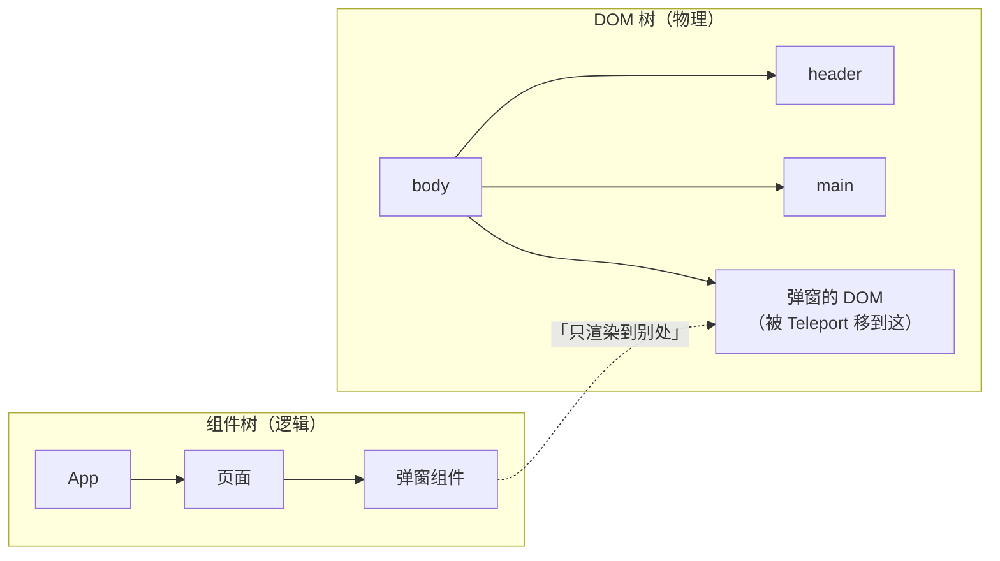

## 前置知识

- 已完成[组件系统](/vue3/110-ComponentSystem)：会写父子组件的 props 与事件通信，理解「组件树」这个概念；
- 用过 `v-if` 与 `defineAsyncComponent` 的基本形态即可，Suspense 相关的部分现场补。

## 学习目标

读完本文你将能够：

1. 用「双树」心智模型解释 Teleport 的一切行为：为什么传送后 props 与事件照常、为什么 DOM 事件不再冒泡到原位置的父级、为什么 scoped 样式仍然生效；
2. 正确处理 Teleport 目标不存在的时机问题（含 Vue 3.5 的 `defer`）；
3. 说清 defineAsyncComponent 与 Suspense 的分工：前者管「加载哪个组件」，后者管「渲染前等待」；
4. 判断一个 async setup 组件为什么「白屏或报警告」，并知道必须包一层 Suspense；
5. 组合出两个生产级组件：Teleport + Transition 的模态框、Suspense + 骨架屏的页面容器。

预计 40 到 55 分钟。

## 1. 你现在要解决什么问题

写了个全屏弹窗，样式没问题、逻辑没问题，唯独被页头压住：

```vue
<template>
  <header class="site-header">...</header>   <!-- z-index: 10 -->
  <main>
    <button @click="open = true">打开弹窗</button>
    <div v-if="open" class="modal">...</div>  <!-- z-index: 100，却被压住 -->
  </main>
</template>
```

`main` 上某个祖先设了 `overflow: hidden` 或 `transform`（比如轮播、吸顶动画），弹窗要么被裁剪，要么掉进那个祖先创建的层叠上下文里，z-index 再大也翻不了身。

第一直觉往往是「把 z-index 调大」，调不大；第二直觉是「把弹窗搬到 body 下」，但一搬，props 和事件通信全断了——弹窗在 body 里，逻辑却还在组件里。

Teleport 就是为这个死结准备的：**DOM 搬走，组件树上的位置不动**。理解这句话，是本文的一半；另一半是 Suspense——它管的不是「在哪渲染」，而是「什么时候才渲染」。

## 2. 心智模型：双树

Vue 应用运行时同时存在两张图：



- **组件树**决定数据流：props 从上往下传、事件从下往上抛、provide/inject 沿组件树查找、生命周期按组件树顺序执行；
- **DOM 树**决定物理位置与浏览器行为：样式层叠、DOM 事件冒泡、滚动、可访问性树的归属。

`<Teleport to="body">` 只做一件事：把子组件渲染出来的 **DOM** 挂到指定目标下，组件在组件树里的位置纹丝不动。于是三件事同时成立：

1. 弹窗的 DOM 在 body 直下，没有中间层叠上下文，z-index 说了算——问题一解决；
2. 父组件照常 `<Modal :title="t" @close="...">`，数据流毫无变化；
3. scoped 样式跟着元素的 `data-v-xxx` 属性走，搬到哪里都认得自家人。

后续所有的「坑」，都是这三条推论在具体场景的体现。

## 3. Teleport 实战

### 3.1 基本形态与目标

```vue
<template>
  <button @click="showModal = true">打开弹窗</button>

  <Teleport to="body">
    <div v-if="showModal" class="modal">
      <p>模态框内容</p>
      <button @click="showModal = false">关闭</button>
    </div>
  </Teleport>
</template>
```

`to` 接收 CSS 选择器字符串或真实元素引用：

```vue
<Teleport to="body">...</Teleport>
<Teleport to="#modals">...</Teleport>       <!-- 提前在 index.html 里放好容器 -->
<Teleport :to="containerEl">...</Teleport>  <!-- 运行时拿到的元素 -->
```

### 3.2 目标必须「先存在」——挂载时机的经典报错

Teleport 在**挂载时**解析目标。目标还没渲染出来，控制台会直接抛错：

```text
Failed to locate Teleport target with selector "#modals"
```

两种对策：

```vue
<!-- 对策一：把目标容器放在组件渲染之前就存在的位置（如 index.html） -->
<!-- 对策二：Vue 3.5+ 用 defer，把传送推迟到同轮渲染的其余部分解析完 -->
<Teleport to="#modals" defer>
  <Modal />
</Teleport>
```

`defer` 解决的是「目标和传送内容在同一个渲染批次里、目标声明在后」的情况——比如同一个模板里先写 Teleport 后写 `<div id="modals">`。它不是万能延迟，目标在别的异步分支里才出现时，仍要用 v-if 配合或调整结构。

### 3.3 disabled：传送开关

```vue
<Teleport to="body" :disabled="isMobile">
  <Modal />
</Teleport>
```

`disabled` 为真时内容**原地渲染**。典型用途是响应式布局：宽屏传送到 body 做居中弹窗，窄屏嵌在卡片里内联展示。切换时 Vue 会移动 DOM 而不是销毁重建，组件状态不丢。

### 3.4 多个 Teleport 与同目标顺序

多个 Teleport 可以指向同一目标，内容按**渲染顺序追加**。这引出 3.5 节的事件冒泡问题。

### 3.5 冒泡走真实 DOM 树

```vue
<div id="panel" @click="log('panel 被点到')">
  <Teleport to="body">
    <button @click="log('button 被点到')">点我</button>
  </Teleport>
</div>
```

点按钮时，`panel 被点到` **不会**打印——因为按钮的 DOM 已经在 body 下，浏览器的事件冒泡沿真实 DOM 树走到 body 为止，根本不经过 `#panel`。但组件自定义事件（`@close` 之类）走组件树，不受传送影响。

推论：**依赖「DOM 冒泡经过某祖先」的逻辑（点击外部关闭、事件委托）在 Teleport 后会失效**，把这类逻辑放进传送内容内部，或绑到 document 上并自行判断目标。

## 4. Suspense：渲染前的等待协调器

> 版本基线：截至 Vue 3.5，Suspense 仍是**实验性**特性，API 已趋稳但官方未承诺稳定，生产使用前查看当前版本文档的标注。

### 4.1 问题：async setup 组件的两难

组合式函数里可以 `await`：

```vue
<!-- Profile.vue -->
<script setup>
const user = await fetchUser(route.params.id);   // async setup
</script>

<template>{{ user.name }}</template>
```

组件自己「等数据」，模板就干净了。但这带来一个渲染问题：setup 是异步的，Vue 渲染这棵子树时**拿不到模板**，不知道该怎么渲染。没有协调机制，轻则白屏重则告警：

```text
Component inside <Transition> renders non-element root node...
<AsyncSetup> - an async setup() must be surrounded by <Suspense>...
```

Suspense 就是这个协调器：它告诉 Vue——这棵子树没就绪之前，先渲染 fallback。

### 4.2 基本用法

```vue
<template>
  <Suspense>
    <Profile />                     <!-- 内部有 async setup 的组件 -->
    <template #fallback>
      <UserSkeleton />
    </template>
  </Suspense>
</template>
```

规则与行为：

- default 插槽里**所有**异步依赖（async setup 组件、`asyncComponent()` 解析）就绪之前，渲染 fallback；
- 全部就绪后一次性切换到正式内容——切换是原子的，不会出现「半页真内容半页骨架」；
- 状态变化有事件可听：`@pending`（进入等待）、`@resolve`（就绪切换）、`@fallback`（退回骨架）。

```vue
<Suspense @pending="onPending" @resolve="onResolve" @fallback="onFallback">
  <Profile />
  <template #fallback><UserSkeleton /></template>
</Suspense>
```

### 4.3 与 defineAsyncComponent 的分工

两者经常被混为一谈，实际分工明确：

| 维度 | defineAsyncComponent | Suspense |
| --- | --- | --- |
| 管什么 | **加载哪个组件**：代码分包，用到才下载 | **渲染前等待**：等子树的异步依赖（含数据）完成 |
| 等待期显示 | `loadingComponent`（替换位置） | `#fallback`（占整个子树） |
| 独立使用 | 可以，不需要 Suspense | 需要子树里有 async setup 才有意义 |
| 典型场景 | 路由级代码分割、重组件懒加载 | 首屏页面级数据获取、骨架屏 |

组合使用时注意：异步组件的加载过程也会被 Suspense「看见」——default 插槽里的 defineAsyncComponent 组件在 chunk 下载期间同样算「未就绪」，Suspense 会等它。两者不是替代关系，各管一层。

### 4.4 错误处理与嵌套

async setup 抛出的错误可以用 `onErrorCaptured` 在祖先捕获，配合 Suspense 做出「失败态」：

```vue
<script setup>
import { ref, onErrorCaptured } from 'vue';
const error = ref(null);
onErrorCaptured((err) => { error.value = err; return false; });
</script>

<template>
  <ErrorBanner v-if="error" :error="error" @retry="reload" />
  <Suspense v-else>
    <Profile :key="reloadKey" />
    <template #fallback><UserSkeleton /></template>
  </Suspense>
</template>
```

嵌套 Suspense 时，每个边界**独立协调自己子树**的异步依赖——内层先展示自己的 fallback，就绪后自行替换，外层不必陪跑到底。页级骨架包裹独立 widget 的场景用它解耦等待时间（行为细节建议用 9 节的实验亲手验证一遍，实验性 API 的边界行为以实测为准）。

### 4.5 生产组合：页面骨架

```vue
<template>
  <Suspense>
    <template #default>
      <Header />
      <Suspense>
        <Dashboard />
        <template #fallback><WidgetSkeleton /></template>
      </Suspense>
      <Footer />
    </template>
    <template #fallback>
      <PageSkeleton />
    </template>
  </Suspense>
</template>
```

SSR 场景里 Suspense 的地位更核心：服务端渲染的异步数据等待就是靠 Suspense 边界组织的，详见[Vue 3 SSR](/vue3/350-Vue3SSR)。

## 5. 生产组合：Teleport + Transition 的模态框

```vue
<!-- AppModal.vue -->
<template>
  <Teleport to="body">
    <Transition name="modal">
      <div v-if="isOpen" class="modal-mask" @click.self="emit('close')">
        <div class="modal-card" role="dialog" aria-modal="true">
          <slot />
          <button class="modal-close" @click="emit('close')">关闭</button>
        </div>
      </div>
    </Transition>
  </Teleport>
</template>

<script setup>
defineProps({ isOpen: Boolean });
const emit = defineEmits(['close']);
</script>

<style>
.modal-enter-active, .modal-leave-active { transition: opacity 0.25s; }
.modal-enter-from, .modal-leave-to { opacity: 0; }
.modal-mask { position: fixed; inset: 0; background: rgb(0 0 0 / 0.4);
  display: grid; place-items: center; z-index: 1000; }
</style>
```

三个细节都是本文与下一篇的交汇点：Teleport 解决层叠上下文；`@click.self` 只响应遮罩自身点击（事件在 body 下冒泡，遮罩是弹窗 DOM 的根，逻辑安全）；Transition 的类名时序让淡入淡出生效，原理见[Transition 与动画](/vue3/130-TransitionAnimation)。

### 5.1 进阶：全局 Modal 管理器（响应式栈 + 单出口渲染）

弹窗一多，"每处各写一个 AppModal"会让层级与状态失控。集中式管理器用**一个响应式栈**存全部弹窗，模板里只留一个 Teleport 出口：

```ts
// modal-manager.ts
import { reactive } from 'vue'

interface ModalEntry {
  id: number
  component: object
  props: Record<string, unknown>
}

export const modalState = reactive<{ stack: ModalEntry[] }>({ stack: [] })
let nextId = 1

export function openModal(component: object, props: Record<string, unknown> = {}) {
  const id = nextId++
  modalState.stack.push({ id, component, props })   // 后打开的在栈顶 = 视觉上层
  return id
}

export function closeModal(id: number) {
  const idx = modalState.stack.findIndex((m) => m.id === id)
  if (idx !== -1) modalState.stack.splice(idx, 1)
}
```

```vue
<!-- ModalHost.vue：挂在 App 根部，全站唯一的弹窗渲染出口 -->
<template>
  <Teleport to="body">
    <AppModal v-for="m in modalState.stack" :key="m.id" v-bind="m.props">
      <component :is="m.component" @close="closeModal(m.id)" />
    </AppModal>
  </Teleport>
</template>
```

任何业务代码 `openModal(ConfirmDialog, { title: '确认删除' })` 即弹窗——集中管理换来三件事：层级天然有序（栈序）、调试有据（DevTools 里看 stack）、业务组件不再各自携带弹窗骨架。

### 5.2 响应式形态：桌面弹窗与移动端抽屉

`disabled` 支持响应式绑定，配合 `matchMedia` 可以让**同一个组件**在桌面端传送到 body 做居中弹窗、移动端留在原地渲染成底部抽屉：

```vue
<script setup>
import { ref, onMounted, onBeforeUnmount } from 'vue'

const isMobile = ref(false)
let mql
onMounted(() => {
  mql = window.matchMedia('(max-width: 768px)')
  isMobile.value = mql.matches
  mql.addEventListener('change', (e) => (isMobile.value = e.matches))   // addListener 已废弃
})
onBeforeUnmount(() => mql?.removeEventListener('change', () => {}))
</script>

<template>
  <Teleport to="body" :disabled="isMobile">
    <div :class="isMobile ? 'drawer' : 'modal'">...</div>
  </Teleport>
</template>
```

`disabled=true` 时组件留在原地（抽屉形态吃父容器布局），false 时传送到 body（弹窗形态吃 fixed 定位）——一个组件两种形态，不需要两套实现。

## Teleport 与 React Portal 对比

<!-- 来源：62c90663 版 cnt-content/full/009-vue3/140-TeleportPortalApp.md 小节「5.1 Teleport 与 React Portal 对比」 -->

| 维度 | Vue Teleport | React createPortal |
| --- | --- | --- |
| 声明方式 | 模板内置组件 | `ReactDOM.createPortal(children, node)` |
| 目标指定 | `to` 选择器或元素 | 直接传 DOM 元素 |
| 禁用切换 | `disabled` prop | 自行条件渲染 |
| 延迟挂载 | Vue 3.5 的 `defer` | 无内置等效 |
| 事件系统 | 原生 DOM 事件仍按 DOM 树冒泡 | 合成事件按 React 树冒泡 |

讲解：两者解决同一类问题，但 Vue 把 Teleport 内置进模板系统，声明式更强；React 的 Portal 是命令式函数调用。Vue 的 DOM 事件冒泡遵循真实 DOM 结构（Teleport 后事件从 body 向上冒泡），React 的合成事件则遵循组件树，这是迁移时最容易踩的差异。

## 6. 常见坑与调试实录

- **目标不存在报错**：目标元素晚于 Teleport 挂载。对策见 3.2：静态容器放 index.html，或 3.5+ 用 `defer`。
- **弹窗内容丢了父组件的样式**：scoped 样式跟随 `data-v` 属性，元素本身带着走，一般不丢；丢的常是「写在父组件里、用后代选择器命中弹窗内部」的规则——把样式写进弹窗组件自己，或用 `:deep()`。
- **点击弹窗「意外」触发页面元素**：DOM 冒泡走真实树，3.5 节讲过；别指望原位置的祖先拦截。
- **async setup 组件没包 Suspense**：控制台警告 + 渲染异常。记规则：**async setup 必须有 Suspense 祖先**；不想引入 Suspense 就改成 `ref + onMounted 里发请求` 的传统写法。
- **fallback 一闪而过**：数据太快返回时骨架闪一下很难看。给 fallback 加 200 毫秒延迟显示（CSS animation-delay 或状态机控制），而不是关闭骨架。
- **把 defineAsyncComponent 当 Suspense 用**：前者等不到 async setup 的数据——它只管组件代码的下载。两者分工见 4.3 的表。
- **Teleport 到动态目标**：`:to="el"` 的 el 必须在挂载时已有值，异步拿到后再传会触发重传送，注意时序。

## 7. 小练习

预测题（5 分钟，先写答案再运行验证）：下面结构里点击按钮后，控制台依次出现什么？

```vue
<template>
  <div id="wrap" @click="log('wrap')">
    <Teleport to="body">
      <button @click="log('btn')">点我</button>
    </Teleport>
  </div>
  <p @click="log('p')">我是 body 下的另一个元素</p>
</template>
```

提示：按钮传送后的 DOM 父节点是谁？DOM 冒泡会经过谁？答案：只打印 `btn`。按钮物理上挂在 body 直下，冒泡到 body 就结束，既不经过 `#wrap` 也不经过那个 `p`（p 与按钮是 body 下的兄弟，不是冒泡链上的节点）。

修改题（20 分钟）：给 5 节的 AppModal 增加三个行为：按 Escape 关闭；打开时锁定 body 滚动（`overflow: hidden`）；关闭后焦点归还给触发按钮。验收：键盘可全程操作，打开弹窗滚动条消失，关闭后按 Tab 能从触发按钮继续。

提示（思路方向）：在 AppModal 里 watch isOpen，挂/卸 document 级 keydown 监听；用 ref 记住触发元素，`onUnmounted` 里 `focus()`。展开（关键 API）：`document.addEventListener('keydown', handler)`、`document.body.style.overflow`。参考实现：

```vue
<script setup>
import { watch, onBeforeUnmount } from 'vue';

const props = defineProps({ isOpen: Boolean });
const emit = defineEmits(['close']);
let triggerEl = null;

function onKeydown(e) {
  if (e.key === 'Escape') emit('close');
}

watch(() => props.isOpen, (open) => {
  document.body.style.overflow = open ? 'hidden' : '';
  if (open) {
    triggerEl = document.activeElement;
    document.addEventListener('keydown', onKeydown);
  } else {
    document.removeEventListener('keydown', onKeydown);
    triggerEl?.focus?.();
  }
});

onBeforeUnmount(() => {
  document.removeEventListener('keydown', onKeydown);
  document.body.style.overflow = '';
});
</script>
```

修 Bug 题（15 分钟）：下面的页面首屏白屏，控制台有一行警告提到 async setup。指出问题并给出两种修法：

```vue
<!-- App.vue -->
<template>
  <Dashboard />        <!-- Dashboard 的 <script setup> 里有 await fetchUser() -->
</template>
```

提示：谁该为「等待」负责？答案：async setup 组件必须有 Suspense 祖先。修法一（页面级等待）：`<Suspense><Dashboard /><template #fallback><PageSkeleton /></template></Suspense>`；修法二（不用 Suspense）：把 await 移进 `onMounted`，数据放 ref，模板里用 `v-if="user"` 控制渲染。两种都合法，按「是否需要骨架屏」选。

挑战题（40 分钟，脱离示例）：实现 `usePortal(containerId)`：返回一个组件包装函数，把传入的组件渲染到 `#portal-root`；目标容器不存在时**自动创建**；返回的卸载方法负责移除自动创建的容器。验收：连续开关三次弹窗，页面上不残留空的 `#portal-root`。

提示（思路方向）：onMounted 时查容器、没有就 `document.createElement` 并 append；onBeforeUnmount 时若容器是自己创建的且没有其他传送内容，就 remove。展开（关键 API）：`document.querySelector`、`createElement`、Teleport 的 `:to` 接收元素引用。参考实现：

```javascript
import { h, onMounted, onBeforeUnmount, ref } from 'vue';

export function usePortal(Comp) {
  const target = ref(null);
  const owned = { value: false };

  onMounted(() => {
    let el = document.querySelector('#portal-root');
    if (!el) {
      el = document.createElement('div');
      el.id = 'portal-root';
      document.body.appendChild(el);
      owned.value = true;
    }
    target.value = el;
  });

  onBeforeUnmount(() => {
    if (owned.value && target.value) target.value.remove();
  });

  return () => (target.value ? h(Teleport, { to: target.value }, () => h(Comp)) : null);
}
```

## 8. 与之前和之后的知识的关系

- 往前：双树模型建立在[组件系统](/vue3/110-ComponentSystem)的组件树概念上；Suspense 等待的「异步组件」机制本身来自 defineAsyncComponent，展开见[异步组件与 Suspense](/vue3/150-AsyncComponentSuspense)；
- 往后：模态框的过渡类名时序在[Transition 与动画](/vue3/130-TransitionAnimation)展开；SSR 中 Suspense 的数据等待地位见[Vue 3 SSR](/vue3/350-Vue3SSR)；配合 KeepAlive 的缓存场景见[KeepAlive 缓存与生命周期](/vue3/160-KeepAliveCacheLifecycle)。

## 9. 官方文档

- Teleport 指南（含 defer 与 SSR）：https://cn.vuejs.org/guide/built-ins/teleport.html
- Suspense 指南（注意实验性标注）：https://cn.vuejs.org/guide/built-ins/suspense.html
- 异步组件：https://cn.vuejs.org/guide/components/async.html

## 自我检查

- 能画出 Teleport 前后的组件树与 DOM 树两张图，并据此解释事件冒泡、scoped 样式、props 通信三件事各自走哪棵树；
- 能说出 Teleport 目标不存在报错的原因与两种对策（静态容器 / defer）；
- 能用一句话说清 defineAsyncComponent 与 Suspense 的分工，并各举一个正确使用场景；
- 知道 Suspense 当前仍是实验性特性，以及 async setup 必须有 Suspense 祖先这条硬规则；
- 能独立写出一个 Teleport + Transition + Escape 关闭 + 焦点管理的生产级模态框。

## 本章总结

Teleport 与 Suspense 管两件不同的事。Teleport 只改 DOM 的物理位置，不改组件树：数据流照旧、scoped 样式跟着元素走、DOM 事件冒泡却沿真实树走——所有「意外」都来自忘记双树模型。目标容器要先于传送内容存在，Vue 3.5 的 defer 能解决同批渲染的时序问题。Suspense 协调「渲染前等待」：default 插槽里全部异步依赖就绪才切换，期间渲染 fallback，async setup 组件必须有它的祖先；它仍是实验性特性。defineAsyncComponent 管代码分包、Suspense 管数据等待，组合而不替代。生产组合记住两件套：Teleport + Transition 的模态框，Suspense + 骨架屏的页面容器。
