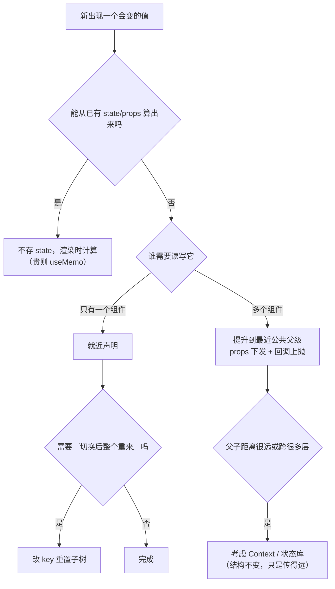

## 知识点地图

- **知识类别**：React 状态的结构与摆放（state structure and placement）——不是「怎么用 useState」，而是「状态声明在哪一层、存什么、不存什么」。
- **解决什么问题**：两个组件需要同步一份状态时不知道找谁要；购物车合计和条目对不上；切换 Tab 后表单残留旧数据。这些问题的根源都不是代码写错，而是**状态放错了地方或存了不该存的东西**。
- **什么时候用到**：写第二个组件开始就该想；规模变大、出现「两处状态要手动保持一致」时必须回头重构。本文对应 React 官方文档 Learn 章节的 Managing State 一节（State as a Snapshot / Lifting State Up / Choosing the State Structure / Preserving and Resetting State），骨架与心智模型取自该章（CC-BY 4.0），例子为本站阅读器/书架场景自写。

## 前置知识

- [状态与事件](/react/030-StateEvent)：`useState` 的基本用法
- [组件与 Props](/react/020-ComponentProps)：props 的单向数据流

## 1. 心智模型：状态是「最小真源」的分配问题

React 应用的状态管理可以浓缩成一句分配原则：

> **为每一份会变的数据找一个「最小覆盖它的组件」，把它声明在那里；其他所有地方通过 props 或派生计算得到它。**

四个具体判据（来自官方 Managing State 一章的浓缩）：

1. **能不存就不存**：能从已有 state/props 算出来的值，不要存 state（派生状态）。
2. **就近声明**：状态只被一个组件用，就放在那个组件里。
3. **提升到最近公共父级**：两个组件需要同一份状态，就把它提升到它们共同的父组件，通过 props 下发——这叫「状态提升」（lifting state up）。
4. **key 决定身份**：想在位置变化或切换时把某个子树「整个重来」，改它的 `key`，而不是手写一堆重置逻辑。

贯穿全文的例子来自同一个产品：FANDEX 网站阅读器。它有书架（书籍列表）、阅读页（正文与字体设置）、购物车（购买付费章节）。三个需求分别对应判据 3、判据 1、判据 4。

## 2. 判据三：状态提升（Lifting State Up）

### 2.1 问题：双输入联动的价格计算器

阅读器的购买页有「按章节购买」和「按整书购买」两种计价模式，右上角显示一个金额输入框。产品要求：用户在任一模式改了金额，另一个模式同步显示同一金额。

第一直觉是给两个模式各存一份：

```tsx
// 反例：两份状态，手动同步
function PriceCalculator() {
  const [chapterPrice, setChapterPrice] = useState(0);   // 按章模式的金额
  const [bookPrice, setBookPrice] = useState(0);         // 按整书模式的金额

  const onChapterChange = (v: string) => {
    setChapterPrice(Number(v));
    setBookPrice(Number(v));   // 手动保持一致——漏掉任何一处都会不同步
  };
  const onBookChange = (v: string) => {
    setBookPrice(Number(v));
    setChapterPrice(Number(v));
  };
  // ...
}
```

这段代码的病灶不是写法丑，而是**同一份「用户想要的金额」被存了两次**。两条 state 之间没有约束力，任何一条更新路径（比如以后加个「重置」按钮只重置了一个）都会制造不一致。

### 2.2 正解：提升到父组件

```tsx
function PriceCalculator() {
  const [price, setPrice] = useState(0); // 金额只有一份，声明在父组件

  return (
    <div>
      <ChapterMode price={price} onPriceChange={setPrice} />
      <BookMode price={price} onPriceChange={setPrice} />
    </div>
  );
}

function ChapterMode({ price, onPriceChange }: {
  price: number;
  onPriceChange: (v: number) => void;
}) {
  return (
    <label>
      按章价格
      <input value={price} onChange={(e) => onPriceChange(Number(e.target.value))} />
    </label>
  );
}
```

逐行拆解为什么这样写：

- `useState(0)` 只出现一次。`price` 的唯一真源在 `PriceCalculator`，两个子组件拿到的永远是同一个值——同步是结构保证的，不靠人肉维护。
- 子组件变成「受控组件」：显示来自 props `price`，修改通过回调 `onPriceChange` 上抛。它不再拥有数据，只负责展示与转发，这是 React 单向数据流的标准形状。
- 易错点：子组件里不能顺手再 `useState(price)` 做本地副本。React 更新父组件 state 后重新渲染子组件，props 变了但子组件自己那份 state 不会跟着变——副本会永远停在初始值附近，制造「明明改了输入框数字没变」的玄学 bug。

**何时选择提升**：两个及以上组件需要读写同一份数据时就提升，不要等它腐化。反过来，如果只有一个组件用，别急着提升——过早提升会让父组件被无关状态撑爆。

### 2.3 换个写法会怎样：用 Context 兜住提升

距离远时（比如金额要跨 5 层传 props），可以配合 [Context 与全局状态](/react/050-ContextGlobalState) 减少逐层透传。但注意顺序：**先提升，再考虑 Context**。Context 解决的是「传得远」，不解决「存哪份」——状态结构错了，用 Context 只是把错误结构广播给更多人。

## 3. 判据一：派生状态反例（购物车合计）

### 3.1 反例：把合计存进 state

购物车页要求显示合计金额。新手最常见的写法：

```tsx
// 反例：合计存 state，靠 effect 同步
function Cart() {
  const [items, setItems] = useState<Item[]>([
    { id: 'b1', title: 'React 状态思维', price: 3900, qty: 1 },
  ]);
  const [total, setTotal] = useState(0);

  useEffect(() => {
    setTotal(items.reduce((sum, it) => sum + it.price * it.qty, 0)); // 每次同步一遍
  }, [items]);

  const addQty = (id: string) => {
    setItems((prev) => prev.map((it) => (it.id === id ? { ...it, qty: it.qty + 1 } : it)));
  };
  // ...
}
```

这段代码能跑，但它埋着一个经典不同步窗口：`setItems` 之后、effect 执行之前的任何一次渲染里，`total` 还是旧值。更糟的是 `addQty` 之外任何忘记走这条同步路径的写法——比如以后有人直接 `setItems([])` 清空购物车但忘了 effect 依赖里的边界情况——合计就永远错了。

**根因：`total` 是 `items` 的派生值（derived value），它没有独立的「真相」，却被当成了独立的 state。**

### 3.2 正解：渲染期间直接算

```tsx
function Cart() {
  const [items, setItems] = useState<Item[]>([
    { id: 'b1', title: 'React 状态思维', price: 3900, qty: 1 },
  ]);

  // 渲染期间计算：不存 state，不加 effect，永远与 items 一致
  const total = items.reduce((sum, it) => sum + it.price * it.qty, 0);

  const addQty = (id: string) => {
    setItems((prev) => prev.map((it) => (it.id === id ? { ...it, qty: it.qty + 1 } : it)));
  };

  return (
    <div>
      <ul>
        {items.map((it) => (
          <li key={it.id}>
            {it.title} × {it.qty}
            <button onClick={() => addQty(it.id)}>+1</button>
          </li>
        ))}
      </ul>
      <p>合计：{total / 100} 元</p>
    </div>
  );
}
```

为什么渲染期间计算是安全的：

- React 每次渲染都是一次独立快照，`total` 在快照里由当次的 `items` 算出，不存在「过期」的可能。
- 官方 Managing State 章节明确给出这条判据：如果初始 state 和某次重渲染的输入一致，React 会跳过重渲染（`Object.is` 比较结果没变就不更新），所以「多算一次 reduce」通常不是性能问题。
- 真出现重计算昂贵（比如对几千本书做全文过滤）时，正确工具是 `useMemo` 缓存计算结果，而不是把结果存进 state——`useMemo` 缓存的是「算的过程」，state 存的是「一份独立的真相」，两者性质完全不同（对比见 [性能优化](/react/180-ReactPerformance)）。

易错点：不要把「派生状态」和「缓存优化」混为一谈。`useEffect + setState` 同步派生值是最常被官方点名的反模式——它在第一次渲染后多跑一轮、制造闪烁，还会因依赖数组漏项悄悄过期。

### 3.3 同一原则的另外两个场景

- **阅读进度百分比**：`progress = scrollTop / (scrollHeight - clientHeight)`。存 state 再用 scroll 监听器同步是双份真相；直接在事件回调里 `setScrollY` 存原始值，百分比渲染时算。
- **书架搜索过滤后的列表**：`filtered = books.filter(b => b.title.includes(keyword))`。存 `filteredBooks` 数组会让「添加书籍」和「改关键字」两条路径都要手动维护过滤结果；存 `keyword` 一个值，列表渲染时现算。

## 4. 判据四：用 key 重置子树（多步表单）

### 4.1 问题：Tab 切换时表单残留

阅读器的设置页有三个 Tab：字体、翻页、快捷键。前两个 Tab 各有一份独立表单。用户在「字体」Tab 改了字号没保存，切到「翻页」再切回来——期望看到什么？

两种产品语义都合理：

- **保留**：草稿还在，怕用户误点丢失。
- **重置**：切走即放弃，每次进入都是干净状态。

反模式是用一堆 effect 手动重置：

```tsx
// 反例：手动重置，字段越多越碎
function FontPanel() {
  const [fontSize, setFontSize] = useState(14);
  useEffect(() => { setFontSize(14); }, [onResetSignal]); // 靠外部信号重置
  // 每加一个字段都要多写一行重置……
}
```

### 4.2 正解：改 key，让 React 把子树当新组件

```tsx
function SettingsPage() {
  const [tab, setTab] = useState<'font' | 'paging'>('font');
  const [session, setSession] = useState(0); // 每次切换自增

  return (
    <div>
      <button onClick={() => { setTab('font'); setSession((s) => s + 1); }}>字体</button>
      <button onClick={() => { setTab('paging'); setSession((s) => s + 1); }}>翻页</button>

      {/* key 变化 = React 卸载旧子树、挂载全新组件，state 全部回到初始值 */}
      <FontPanel key={`font-${session}`} hidden={tab !== 'font'} />
      <PagingPanel key={`paging-${session}`} hidden={tab !== 'paging'} />
    </div>
  );
}
```

机制拆解：

- React 对组件树做的是**按位置 + key 匹配**的协调（reconciliation）：同一个位置、同一个 key，就复用已有实例（state 保留）；key 不同，就卸载旧的、挂载新的（state 清零，走一遍完整挂载）。
- 所以「重置」不需要写任何重置逻辑——**换 key 就等于换了身份**。官方文档把这总结为：key 不是「标识当前选中项」的元数据，而是「这个实例是谁」的身份声明。
- 易错点：条件渲染（`{tab === 'font' && <FontPanel />}`）在位置相同、类型相同时会**复用**实例。上例故意两个面板都常驻、用 `hidden` 控制显隐并配不同 key，就是为了明确「这两个面板是两个身份」。如果你的两个 Tab 是同一个组件类型（如 `<Form tab={tab} />`），位置和类型都一样，state 会被跨 Tab 复用——这正是残留 bug 的来源，也是 key 重置要解决的核心场景。

### 4.3 保留草稿的另一半答案

如果产品语义是「保留」呢？那就把草稿状态提升到父组件（回到判据三/判据二）：`SettingsPage` 存 `draft = { fontSize, pageMode }`，面板变成受控组件。**切换时保留 = 提升状态；切换时重置 = 变更 key。** 一对需求，两把钥匙。

## 5. 状态摆放决策流程

把四条判据串成一条流水线，遇到「这个值放哪」时按顺序过一遍：



## 6. 动手实践

### 练习 1：修复提升缺失

任务：阅读器同时显示「书架」和「当前阅读」两个面板，各自存了 `currentBookId`。点击书架的书，阅读面板不更新。用状态提升修复。

提示：先问「谁需要这份状态」，再决定它声明在哪个组件；两个面板都应该变成受控的。

参考实现（先自己写，再展开对照）：

<details>
<summary>参考实现</summary>

```tsx
type Book = { id: string; title: string };

function ReaderApp({ books }: { books: Book[] }) {
  const [currentBookId, setCurrentBookId] = useState<string | null>(null);
  const current = books.find((b) => b.id === currentBookId) ?? null;

  return (
    <div>
      {/* 唯一真源在父级；current 是派生值，不存 state */}
      <Bookshelf books={books} currentBookId={currentBookId} onSelect={setCurrentBookId} />
      <ReadingPane book={current} />
    </div>
  );
}
```

自检：`currentBookId` 的 `useState` 是否只出现一次？两个面板是否都不再持有自己的 `currentBookId`？
</details>

### 练习 2：消灭派生 state

任务：书架页有 `books`（全量）与 `keyword`（搜索词），现在的实现把 `filtered` 存进了 state 并用 effect 同步。重构成派生计算，并说明哪些同步代码可以整体删除。

提示：`filtered` 的「真相」是什么？渲染函数里直接算。

参考实现：

<details>
<summary>参考实现</summary>

```tsx
function Bookshelf({ books }: { books: Book[] }) {
  const [keyword, setKeyword] = useState('');
  // 删除：const [filtered, setFiltered] = useState(books);
  // 删除：useEffect(() => setFiltered(books.filter(...)), [books, keyword]);

  const filtered = books.filter((b) =>
    b.title.toLowerCase().includes(keyword.toLowerCase()),
  );
  // keyword 为空时 filtered === books 的全部内容，一致性由结构保证
  return (
    <div>
      <input value={keyword} onChange={(e) => setKeyword(e.target.value)} />
      <ul>{filtered.map((b) => <li key={b.id}>{b.title}</li>)}</ul>
    </div>
  );
}
```

自检：文件里是否只剩 `books` 和 `keyword` 两个 useState？把「添加一本书」的路径加进去，确认列表自动更新。
</details>

### 练习 3：key 重置

任务：阅读器顶部有「正文 / 评论」两个视图开关，共用同一个 `<CommentList />` 组件展示当前书的数据。要求：切换书箱时评论列表完全重置（滚动位置、展开状态都清空）。

提示：给组件的 key 里加入会变的东西——书 id。

参考实现：

<details>
<summary>参考实现</summary>

```tsx
function BookPage({ bookId }: { bookId: string }) {
  return (
    <div>
      {/* bookId 变化 = 换书 = 整个列表是新实例 */}
      <CommentList key={bookId} bookId={bookId} />
    </div>
  );
}
```

自检：如果不加 key，切书后 `useState` 里存的「展开的评论 id」会残留吗？为什么（提示：位置相同、类型相同 → React 复用实例）？
</details>

## 7. 小结

- 每份会变的数据只保留一个「最小真源」；能算出来的不存 state。
- 多个组件共用 → 提升到最近公共父级，受控 + 回调上抛；距离远再考虑 Context。
- `useEffect + setState` 同步派生值是最常见的不同步根源，直接在渲染期间计算。
- 「切换后重来」不写重置逻辑，改 key；「切换后保留」提升状态。

## 参考与致谢

- React 官方文档 Learn 章节 Managing State（State as a Snapshot / Lifting State Up / Choosing the State Structure / Preserving and Resetting State）：https://react.dev/learn/managing-state ，React documentation, CC-BY 4.0。本文的心智模型与四条判据浓缩自该章节，代码示例为本站阅读器/书架场景自写并改写。
