## 知识点地图

- **知识类别**：工程化 / 代码规范（Lint 与格式化、项目结构）。
- **解决什么问题**：多人协作的 React 项目里，风格争议（分号、引号、导入顺序）与结构混乱（组件、Hook、工具函数乱放）消耗真实工时。ESLint 抓逻辑层面的错误模式（Hooks 规则、未使用变量），Prettier 抹平格式争议，项目结构约定让「新文件该放哪」不再是每次都要讨论的问题。
- **什么时候用到**：项目初始化时一次性配好；新增团队成员或 CI 报错时回来查。

本文原为「测试与工程化」一篇，测试三节已拆为专篇：组件测试与 E2E 见 [React 测试](/react/220-ReactTest)，Storybook 见 [React 与 Storybook](/react/360-ReactStorybook)，CI/CD 流水线见 [React 与 CI/CD](/react/370-ReactCICD)。本篇专注 ESLint/Prettier 与项目结构。

## 学习目标

- 掌握「1. ESLint / Prettier」的核心机制、典型用法与常见陷阱
- 掌握「2. 项目结构最佳实践」的核心机制、典型用法与常见陷阱

## 1. ESLint / Prettier

### 1.1 安装配置

```bash
npm install -D eslint @eslint/js typescript-eslint eslint-plugin-react-hooks eslint-plugin-react-refresh prettier eslint-config-prettier
```

```js
// eslint.config.js — 扁平配置（ESLint 9+ 默认格式）
import js from '@eslint/js';
import tseslint from 'typescript-eslint';
import reactHooks from 'eslint-plugin-react-hooks';
import reactRefresh from 'eslint-plugin-react-refresh';

export default tseslint.config(
  { ignores: ['dist'] }, // 构建产物不检查——漏配会让 lint 慢一个数量级
  {
    extends: [js.configs.recommended, ...tseslint.configs.recommended],
    files: ['**/*.{ts,tsx}'],
    plugins: {
      'react-hooks': reactHooks,
      'react-refresh': reactRefresh,
    },
    rules: {
      ...reactHooks.configs.recommended.rules, // rules-of-hooks + exhaustive-deps 两件套
      'react-refresh/only-export-components': ['warn', { allowConstantExport: true }],
    },
  }
);
```

逐条解释这份配置的取舍：

- **`eslint-plugin-react-hooks` 是 React 项目最重要的一条规则来源**。`rules-of-hooks` 抓「条件调用 Hook」，`exhaustive-deps` 抓依赖遗漏——后者报警不是噪音，是 [Effect 生命周期](/react/044-EffectsLifecycleBestPractice) 里 stale closure 的第一道防线。把它关掉的项目等于关掉了 stale 数据的报警器。
- **`react-refresh/only-export-components`**：HMR 要求一个文件只导出组件；混出常量会热更新失效（整页刷新）。`allowConstantExport: true` 放行纯常量，这是 Vite 脚手架的默认取舍。
- **`eslint-config-prettier`** 关闭 ESLint 中与 Prettier 冲突的格式规则——格式检查只属于 Prettier，ESLint 只管代码质量。两边抢格式规则的配置是常见内耗。
- Prettier 配置 `.prettierrc`：

```json
{
  "semi": true,
  "singleQuote": true,
  "trailingComma": "all",
  "printWidth": 100,
  "tabWidth": 2
}
```

每项都是「选边」而非对错：团队既有风格优先。真正的关键是**写进配置文件并进 git**，让编辑器、开发者、CI 读到同一份。

### 1.2 与编辑器和 CI 的衔接

- 编辑器：装 ESLint + Prettier 扩展，开启「保存时格式化」与「保存时修复」；格式化引擎指定 Prettier，避免 VSCode 默认格式化器抢活。
- 命令行：`package.json` 里放 `"lint": "eslint src"` 与 `"format": "prettier --write ."`；CI 只跑 `lint --max-warnings 0`（把 warning 当 error，防止 exhaustive-deps 警告被无限堆积）。
- 提交前：husky + lint-staged 只对暂存文件执行，几十毫秒完成；全量 lint 留给 CI。编排细节见 [React 与 CI/CD](/react/370-ReactCICD)。

## 2. 项目结构最佳实践

### 2.1 功能模块化结构（推荐）

```mermaid
flowchart TD
    T0["src/"]
    T1["app/                    # 路由页面"]
    T2["layout.tsx"]
    T3["page.tsx"]
    T4["users/"]
    T5["page.tsx"]
    T6["[id]/"]
    T7["page.tsx"]
    T8["settings/"]
    T9["page.tsx"]
    T10["components/             # 共享组件"]
    T11["ui/                 # 基础 UI 组件"]
    T12["Button.tsx"]
    T13["Input.tsx"]
    T14["Modal.tsx"]
    T15["layout/             # 布局组件"]
    T16["Header.tsx"]
    T17["Sidebar.tsx"]
    T18["features/               # 功能模块"]
    T19["auth/"]
    T20["components/"]
    T21["hooks/"]
    T22["api.ts"]
    T23["types.ts"]
    T24["todos/"]
    T25["components/"]
    T26["hooks/"]
    T27["api.ts"]
    T28["types.ts"]
    T29["hooks/                  # 共享 Hook"]
    T30["useDebounce.ts"]
    T31["useLocalStorage.ts"]
    T32["lib/                    # 工具库"]
    T33["api.ts"]
    T34["utils.ts"]
    T35["stores/                 # 全局状态"]
    T36["useAuthStore.ts"]
    T37["types/                  # 全局类型"]
    T38["index.ts"]
    T39["test/                   # 测试工具"]
    T40["setup.ts"]
    T0 --> T1
    T9 --> T10
    T17 --> T18
    T28 --> T29
    T31 --> T32
    T34 --> T35
    T36 --> T37
    T38 --> T39
    T39 --> T40
```



结构背后的三条判定规则，比目录图更重要：

- **按功能切（features/），不按类型切**。「所有组件放一个文件夹」在十个页面后必然失控；功能内聚让删除一个业务模块 = 删一个文件夹。
- **两层晋升规则**：代码先写在 feature 内；当**第二个** feature 需要它时才晋升到共享层（components/hooks/lib）。提前共享是耦合的起点。
- **app/ 只做装配**：路由文件薄，业务在 features。这样路由重构（换文件约定）不牵动业务代码。

### 2.2 命名规范

| 类型       | 命名规范              | 示例                 |
| :--------- | :-------------------- | :------------------- |
| 组件文件   | PascalCase            | `UserProfile.tsx`    |
| Hook 文件  | camelCase 以 use 开头 | `useAuth.ts`         |
| 工具函数   | camelCase             | `formatDate.ts`      |
| 类型文件   | camelCase             | `types.ts`           |
| 测试文件   | 组件名.test.tsx       | `Button.test.tsx`    |
| Story 文件 | 组件名.stories.tsx    | `Button.stories.tsx` |
| 常量       | UPPER_SNAKE_CASE      | `API_BASE_URL`       |

命名规范的真正价值是**可预测**：看到 `useAuth.ts` 就知道导出的是 Hook，看到 `Button.stories.tsx` 就知道是 Storybook 故事——工具链（测试匹配 `*.test.tsx`、Storybook 匹配 `*.stories.tsx`）也依赖这些约定。

### 2.3 导入顺序

```tsx
// 1. React 核心库
import { useState, useEffect } from 'react';

// 2. 第三方库
import { useQuery } from '@tanstack/react-query';
import { motion } from 'framer-motion';

// 3. 内部模块 — 组件
import { Button } from '@/components/ui/Button';
import { Header } from '@/components/layout/Header';

// 4. 内部模块 — Hook
import { useAuth } from '@/hooks/useAuth';

// 5. 内部模块 — 工具
import { formatDate } from '@/lib/utils';

// 6. 类型
import type { User } from '@/types';

// 7. 样式
import './styles.css';
```

手动维护导入顺序是浪费——交给 `eslint-plugin-import` 或 `prettier-plugin-sort-imports` 自动化，规则本身写进配置即可。`import type` 显式区隔类型导入的价值在 `verbatimModuleSyntax` 打开后是硬要求（类型导入必须消歧，见 008-typescript 模块同名主题）。

## 3. 动手实践

练习任务：接手一个「按类型分层」的老项目（components/ 300 个文件平铺），设计迁移到 features/ 结构的分批方案。要求：

1. 写出第一批迁移哪两个 feature、依据什么选；
2. 说明迁移期间新旧结构如何共存（提示：路径别名 `@/` 让迁移对导入方渐进）；
3. 列出两个「不该晋升到共享层」的反例信号。

提示：从「改动频率最高」和「依赖最少」的 feature 切入；反例信号想想只有一个使用方的「通用」工具。

<details>
<summary>参考实现（先自己想，再展开对照）</summary>

1. 首批选择标准：最近 30 天 git log 改动最多（收益最大）且 import 依赖闭包最小（成本最低）的两个 feature，例如 auth 与 todos。
2. 共存方案：新文件放 `features/auth/`，旧文件暂留 `components/`；迁移以「整文件夹搬移 + 全局替换导入路径」为单位，靠 TypeScript 编译错误清点漏网导入，一次一个 feature 进主干，不做大爆炸式重排。
3. 不该晋升的反例：只有一个 feature 使用的「通用」工具函数（伪共享）；两个 feature 用法各不相同的同名组件（`Button` 一个要 loading 一个不要——先各自保留，等第三个出现再抽象）。

</details>

## 4. 常见陷阱速查

- **关闭 `exhaustive-deps` 求清净**：stale closure 事故的直接来源；用 `useEffectEvent` 或收敛依赖解决，而不是关规则。
- **Prettier 与 ESLint 规则打架**：没装 `eslint-config-prettier`，保存时两个工具来回改格式。装上并把格式规则从 ESLint 移除。
- **`react-refresh/only-export-components` 被全局关闭**：HMR 静默失效，开发体验劣化而不自知；按文件局部豁免优于全局关闭。
- **共享层变成垃圾抽屉**：`utils/` 里堆满「只有一个调用方」的函数。执行两层晋升规则。
- **深度相对导入 `../../../`**：配置 `@/` 路径别名（tsconfig paths + vite resolve.alias），迁移与重构成本骤降。

## 5. 小结

初学者要点：ESLint 管质量（Hooks 规则最重要）、Prettier 管格式、`eslint-config-prettier` 隔离两者；项目结构按 feature 切、两层晋升、app/ 只装配。进阶注意：CI 里 `--max-warnings 0`；导入顺序交给插件自动化；路径别名消灭深层相对导入。

## 6. 下一步

- [React 测试](/react/220-ReactTest)：规范守住的代码如何用行为测试兜底；
- [React 与 CI/CD](/react/370-ReactCICD)：把 lint 与结构约束变成流水线门禁；
- [React 与 Storybook](/react/360-ReactStorybook)：共享组件层的可视化验收。
