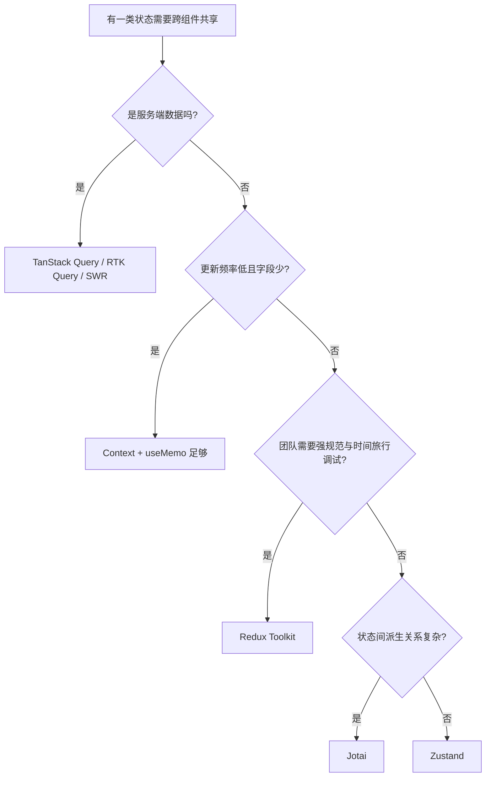

## 前置知识

建议先阅读以下内容再进入本文：

- [概述与环境配置](/react/010-OverviewEnvSetup)

## 1. 先分类，再选型：大部分"状态管理问题"是分类问题

讨论"用什么状态管理库"之前，先把应用里的状态分成三类，因为它们的最佳归宿完全不同：

| 类别 | 例子 | 推荐归宿 |
| :--- | :--- | :--- |
| 组件本地状态 | 输入框草稿、弹窗开关、hover | `useState` / `useReducer`，留在组件内 |
| 跨组件的客户端状态 | 主题、当前语言、登录用户、购物车 | Context 或第三方 store（本文主题） |
| 服务端数据缓存 | 商品列表、用户资料、订单 | TanStack Query / RTK Query / SWR 等"缓存层" |

类比：客户端状态像"书房里的文件"（只有你的应用读它），服务端数据像"图书馆的书"（你只是借阅，真正的所有者在远端，随时可能被别人改掉）。把图书馆的书复印一份塞进自家抽屉再手工同步，正是大量项目状态管理失控的起点。2025 年以来的社区共识（也是 Redux 官方文档"Prior Guide"与 react.dev 数据获取指南的立场）是：**服务端数据默认不放进全局 store，交给专门的缓存库**。本文聚焦第二类。

## 2. React 内置方案的天花板：Context 为什么不能当全局 store

React 内置的跨组件方案是"状态提升 + Context"。Context 的本质是**依赖注入**，不是订阅系统：

- Provider 的 `value` 变化时，**所有**消费该 Context 的组件无条件重渲染——没有 selector，无法"只订阅其中一部分"。
- `value` 是引用比较的：父组件每次渲染若写成 `value={{ user, setUser }}`，对象引用每次都变，子树全部重渲染。

所以官方文档对 Context 的定位始终是"低频全局值"（主题、语言、当前用户），而非高频业务数据容器。适合用 Context 的场景示意：

```tsx
import { createContext, useContext, useMemo, useState } from 'react';

// 主题属于低频全局值，Context 是合理选择
const ThemeContext = createContext<'light' | 'dark'>('light');

function App() {
  const [theme, setTheme] = useState<'light' | 'dark'>('light');
  // 关键：用 useMemo 固定 value 引用，避免每次渲染都通知所有消费者
  const value = useMemo(() => theme, [theme]);
  return (
    <ThemeContext.Provider value={value}>
      <Page />
      <button onClick={() => setTheme((t) => (t === 'light' ? 'dark' : 'light'))}>
        切换主题
      </button>
    </ThemeContext.Provider>
  );
}

function Page() {
  const theme = useContext(ThemeContext); // 只在 theme 变化时重渲染
  return <main className={theme}>当前主题：{theme}</main>;
}
```

一旦状态更新频率高（输入、列表滚动、轮询数据）或消费组件多（几十个组件只用其中一个字段），Context 就会变成性能瓶颈——这是第三方 store 存在的根本原因。

## 3. 第三方 store 的共同原理：外置 store + useSyncExternalStore

Zustand、Jotai、Redux 看似风格迥异，底层都遵循同一个模型：**状态放在 React 之外的普通对象里，组件通过订阅 + selector 精确获取所需切片**。React 18 起官方为这个模型提供了标准接口 `useSyncExternalStore`。手写一个极简版就能看清原理：

```tsx
import { useSyncExternalStore } from 'react';

// React 之外的普通对象：真正的"单一数据源"
let count = 0;
const listeners = new Set<() => void>();

export const counterStore = {
  getState: () => count,
  increment: () => {
    count += 1;                 // 修改外部状态
    listeners.forEach((fn) => fn()); // 通知所有订阅者
  },
  subscribe: (fn: () => void) => {
    listeners.add(fn);
    return () => listeners.delete(fn); // 返回取消订阅函数
  },
};

// 组件通过 selector 订阅，只在所选切片变化时重渲染
function Counter() {
  const value = useSyncExternalStore(
    counterStore.subscribe,     // 订阅
    counterStore.getState,      // 快照读取
  );
  return <button onClick={counterStore.increment}>点击了 {value} 次</button>;
}
```

渲染行为：点击按钮时只有 `<Counter />` 重渲染，它的父组件与兄弟组件完全不受影响——这是 Context 做不到的。理解了这一层，三个库的差异就只剩"API 风格与配套生态"。

## 4. 四个主流方案速写

### 4.1 Zustand：无 Provider 的模块级单例（当前默认首选）

Zustand 的核心主张：store 就是模块里的一个普通变量，用 `create` 定义，任何组件直接调用 `useStore(selector)`，**不需要 Provider**。截至 v5（2024 年底发布，基于 `useSyncExternalStore` 重写）：

```tsx
import { create } from 'zustand';
import { persist } from 'zustand/middleware';
import { useShallow } from 'zustand/react/shallow';

interface CartState {
  items: { id: string; name: string; qty: number }[];
  addItem: (item: { id: string; name: string }) => void;
  removeItem: (id: string) => void;
  total: () => number;
}

// 模块级单例：定义即全局可用，配合 persist 自动写入 localStorage
export const useCart = create<CartState>()(
  persist(
    (set, get) => ({
      items: [],
      addItem: (item) =>
        set((s) => {
          const found = s.items.find((i) => i.id === item.id);
          // 已存在则数量 +1，否则追加，全程不可变更新
          return found
            ? { items: s.items.map((i) => (i.id === item.id ? { ...i, qty: i.qty + 1 } : i)) }
            : { items: [...s.items, { ...item, qty: 1 }] };
        }),
      removeItem: (id) => set((s) => ({ items: s.items.filter((i) => i.id !== id) })),
      total: () => get().items.reduce((sum, i) => sum + i.qty, 0),
    }),
    { name: 'cart' }, // localStorage 键名
  ),
);

// 列表组件：只订阅 items 数组
function CartList() {
  const items = useCart((s) => s.items);
  return (
    <ul>
      {items.map((i) => (
        <li key={i.id}>{i.name} x{i.qty}</li>
      ))}
    </ul>
  );
}

// 计数徽章：只订阅派生数量；返回新对象时必须用 useShallow 做浅比较
function CartBadge() {
  const { count, kinds } = useCart(
    useShallow((s) => ({ count: s.items.reduce((n, i) => n + i.qty, 0), kinds: s.items.length })),
  );
  return <span>共 {count} 件（{kinds} 种）</span>;
}
```

预期渲染行为：`addItem` 后仅订阅了 `items` 或该派生对象的组件重渲染；页面其他部分（哪怕也调用了 `useCart` 但 selector 结果未变）保持不动。适合场景：绝大多数中大型应用的客户端全局状态，样板代码最少、学习成本最低。

### 4.2 Jotai：自下而上的原子模型

Jotai 把状态拆成一个个 atom（原子），atom 之间可以派生组合，组件订阅单个 atom。它解决的是"粒度"问题——不需要手工设计 store 切片，最小单元天然是字段：

```tsx
import { atom, useAtomValue, useSetAtom } from 'jotai';

// 基础原子
const itemsAtom = atom<{ id: string; name: string; qty: number }[]>([]);

// 派生原子：依赖变化自动重算，且只在结果变化时通知订阅者
const totalCountAtom = atom((get) =>
  get(itemsAtom).reduce((n, i) => n + i.qty, 0),
);

function TotalBadge() {
  const total = useAtomValue(totalCountAtom); // 只订阅"总数"这一个派生值
  return <span>共 {total} 件</span>;
}

function AddButton() {
  const setItems = useSetAtom(itemsAtom); // 只写不读，避免无关订阅
  return (
    <button
      onClick={() =>
        setItems((prev) => [...prev, { id: crypto.randomUUID(), name: '钢笔', qty: 1 }])
      }
    >
      加入钢笔
    </button>
  );
}
```

Jotai 与 React Suspense/异步配合好（异步 atom 天然挂起），适合状态之间派生关系复杂、希望"按字段自动精确更新"的应用。默认可不写 Provider（使用模块级默认容器），但在测试与 SSR 场景建议显式包 `<Provider>` 获得独立实例。

### 4.3 Redux Toolkit：集中式与强规范

Redux 的价值从来不是"能管状态"（它反而是四者中样板最多的），而是**强约束带来的可预测性**：单一 store、纯函数 reducer、action 可追溯、中间件与 DevTools 生态成熟。现代 Redux 已不需要手写 action type 与 switch 样板，官方工具链 Redux Toolkit（RTK，2.x）是唯一推荐写法：

```tsx
import { configureStore, createSlice } from '@reduxjs/toolkit';
import { Provider, useDispatch, useSelector } from 'react-redux';

// createSlice 自动生成 action creator 与 action type
const cartSlice = createSlice({
  name: 'cart',
  initialState: { items: [] as { id: string; qty: number }[] },
  reducers: {
    // 内置 immer：可以直接"修改"，底层生成不可变更新
    added(state, action) {
      state.items.push({ id: action.payload, qty: 1 });
    },
    removed(state, action) {
      state.items = state.items.filter((i) => i.id !== action.payload);
    },
  },
});

export const store = configureStore({ reducer: { cart: cartSlice.reducer } });
export const { added, removed } = cartSlice.actions;

function CartBadge() {
  const count = useSelector((s: RootState) =>
    s.cart.items.reduce((n, i) => n + i.qty, 0),
  ); // useSelector 自带引用比较，等值则跳过渲染
  const dispatch = useDispatch();
  return <button onClick={() => dispatch(added('pen'))}>加一件（当前 {count}）</button>;
}

// 必须用 Provider 包裹根组件——与 Zustand 的核心差异之一
export function App() {
  return (
    <Provider store={store}>
      <CartBadge />
    </Provider>
  );
}
```

适合场景：大型团队需要统一状态规范、重度依赖时间旅行调试、或已用 RTK Query 统一服务端数据层。

### 4.4 Context 方案何时仍然够用

只有主题、语言、当前登录用户这类**低频、全局、读多写少**的值时，Context + `useMemo`（或直接用 `useSyncExternalStore` 自建）完全够用，不必引入依赖。判断标准：一年改几次的值用 Context，一秒改几次的值用 store。

## 5. 横向对比与选型决策

| 维度 | Context + useReducer | Zustand v5 | Jotai v2 | Redux Toolkit 2.x |
| :--- | :--- | :--- | :--- | :--- |
| 心智模型 | 依赖注入，自上而下 | 单例 store + selector | 原子化，自下而上 | 集中式事件流 |
| 需要 Provider | 是 | 否 | 可选 | 是 |
| 粒度更新 | 无（全量通知消费者） | selector 级 | atom 级 | selector 级 |
| 异步/派生 | 手写 | 手写（中间件） | 一等支持 | createAsyncThunk / RTK Query |
| 持久化 | 手写 | persist 中间件 | atomWithStorage | redux-persist |
| DevTools | 无 | 中间件支持 | 中间件支持 | 最强（时间旅行） |
| 样板量 | 中 | 极少 | 少 | 多 |
| 典型规模 | 小型/局部 | 中大型默认选择 | 中型、派生复杂 | 大型团队强规范 |

选型决策（从上往下第一条命中即停）：



与 React Compiler 的关系值得澄清：Compiler 能自动补上组件内部的 memo，但**跨组件的订阅粒度**由状态方案决定，Context 的全量通知问题不会因 Compiler 消失。这也是 Compiler 时代"store + selector"依然必要的原因。

## 6. 常见陷阱

- **Context value 引用陷阱**：`value={{ user, setUser }}` 每次渲染都产生新对象，等于每次都广播。用 `useMemo` 或拆分成多个 Context。
- **Zustand selector 返回新引用**：`(s) => ({ a: s.a, b: s.b })` 每次返回新对象，浅比较失败导致"看似没变却重渲染"。v5 起必须显式 `useShallow`（从 `zustand/react/shallow` 导入），或拆成多个 selector。
- **Zustand v4 迁移 v5**：默认导出 `create` 已移除，只能用具名导入；快照与 selector 行为按 `useSyncExternalStore` 语义收紧。
- **在全局 store 里存服务端数据**：会失去缓存库的请求去重、失效重取、乐观更新能力，最终手写出一张逐渐腐烂的同步逻辑网。
- **Redux 旧教程误导**：`createStore` 自 RTK 出现起已弃用，手写 switch + action type 的样板不需要再学；直接从 `createSlice` 入门。
- **Jotai 忘记 Provider 的隐性成本**：无 Provider 时所有组件共享模块级默认容器，测试间与多根应用间会互相污染，测试/SSR 请显式包 Provider。
- **把 Context 当事件总线**：Context 只传播"当前值"，不传播"变化事件"；需要事件语义时应使用 store 订阅回调或专门的信号机制。

## 7. 小结

初学者要点：

- 先把状态分成"本地 / 客户端共享 / 服务端缓存"三类，服务端数据交给缓存库，不要塞进全局 store。
- Context 是依赖注入不是订阅系统，只适合低频全局值；高频共享状态用带 selector 的 store。
- 新项目没有特殊约束时，Zustand 是 2025-2026 社区的默认答案；派生关系复杂考虑 Jotai；大团队要强规范选 Redux Toolkit。

进阶注意：

- 三个库的底层都是"外置 store + `useSyncExternalStore` + selector"，理解这一层后选型只是 API 风格之争。
- selector 返回新对象必须配浅比较（`useShallow`），否则精确订阅形同虚设。
- 库版本要点以官方 README 为准：Zustand v5 移除默认导出、`useShallow` 换位置；RTK 2.x 只推荐 `createSlice` + `configureStore` 写法。

## 速查

**Context 创建与消费**

`const <Ctx> = createContext(<默认值>);` / `const <值> = useContext(<Ctx>);`

```tsx
const ThemeContext = createContext('light');
<ThemeContext.Provider value="dark"><App /></ThemeContext.Provider>
// 消费
const theme = useContext(ThemeContext);
```

**useReducer 复杂状态**

`const [<状态>, <dispatch>] = useReducer(<reducer>, <初始值>);`

```tsx
type Action = { type: 'inc' } | { type: 'dec' };
function reducer(state: { count: number }, action: Action) {
  switch (action.type) {
    case 'inc': return { count: state.count + 1 };
    case 'dec': return { count: state.count - 1 };
  }
}
const [state, dispatch] = useReducer(reducer, { count: 0 });
dispatch({ type: 'inc' });
```

**Zustand 创建 Store（v5 具名导入）**

`const use<Store> = create<<T>>()((<set>, <get>) => ({ ... }));`

```tsx
import { create } from 'zustand';
import { useShallow } from 'zustand/react/shallow';

const useBearStore = create<BearStore>()((set) => ({
  bears: 0,
  addBear: () => set((s) => ({ bears: s.bears + 1 })),
}));
// 订阅单个字段
const bears = useBearStore((s) => s.bears);
// 订阅多个字段：必须 useShallow
const { bears, addBear } = useBearStore(useShallow((s) => ({ bears: s.bears, addBear: s.addBear })));
```

**Jotai 原子与派生**

`const <atom> = atom(<初始值>);` / 派生：`atom((get) => <计算>)`

```tsx
import { atom, useAtom } from 'jotai';
const countAtom = atom(0);
const doubleAtom = atom((get) => get(countAtom) * 2);
function Counter() {
  const [count, setCount] = useAtom(countAtom);
  return <button onClick={() => setCount((c) => c + 1)}>{count}</button>;
}
```

**Redux Toolkit 切片与 store**

`createSlice({ name, initialState, reducers })` + `configureStore({ reducer })`

```tsx
const counter = createSlice({
  name: 'counter', initialState: { value: 0 },
  reducers: { inc: (s) => { s.value += 1; } },
});
const store = configureStore({ reducer: { counter: counter.reducer } });
// 组件内：const value = useSelector(s => s.counter.value); dispatch(counter.inc());
```

**React 19 表单状态（与全局状态互补）**

`const [<状态>, <action>, <isPending>] = useActionState(<fn>, <初始>);`

```tsx
const [state, action, isPending] = useActionState(async (prev, fd) => save(fd), null);
<form action={action}>...</form>
```

**React 19 乐观更新**

`const [<乐观值>, <add>] = useOptimistic(<实际值>, <reducer>);`

```tsx
const [optimisticCount, addOptimistic] = useOptimistic(count, (s, next: number) => next);
```
