## 知识点地图

- **知识类别**：服务端 / Next.js 路由与渲染结构（App Router 文件约定）。
- **解决什么问题**：App Router 用「文件夹即路由、特殊文件即约定」取代手动配置路由。本篇回答：一个路由段由哪些文件组成、layout 与 page 怎么嵌套共享、加载态与错误态怎么声明、并行路由与拦截路由这类高级结构怎么用。
- **什么时候用到**：新建任何 Next.js（13.4+，本文以 Next.js 15/16 为准）页面时；排查「布局意外重挂载」「加载态不出现」「错误页不生效」时。

## 与相邻篇章的分工

- 全栈能力（Server Actions、中间件、Route Handlers、数据库、认证、部署）见 [Next.js 全栈开发](/react/100-NextJSFullStack)——本篇只讲「路由与渲染的结构面」；
- Server/Client Components 的边界判据与 RSC 原理见 [Server 与 Client 组件](/react/400-ServerClientComponents)；
- 文末速查段中的 Server Actions 代码保留作为路由文件内调用形态的速记，系统性内容以 100 篇为准。

## 1. 文件夹约定

### 1.1 路由结构

```mermaid
flowchart TD
    T0["app/"]
    T1["layout.tsx              # 根布局（必须）"]
    T2["page.tsx                # 首页 (/)"]
    T3["loading.tsx             # 加载状态"]
    T4["error.tsx               # 错误处理"]
    T5["not-found.tsx           # 404"]
    T6["global-error.tsx        # 全局错误"]
    T7["default.tsx             # Parallel Fallback"]
    T8["template.tsx            # 重新挂载的布局"]
    T9["route.ts                # API 路由"]
    T10["(marketing)/            # 路由组（不影响 URL）"]
    T11["layout.tsx"]
    T12["about/page.tsx      # /about"]
    T13["contact/page.tsx    # /contact"]
    T14["dashboard/"]
    T15["layout.tsx"]
    T16["page.tsx            # /dashboard"]
    T17["settings/page.tsx   # /dashboard/settings"]
    T18["blog/"]
    T19["page.tsx            # /blog"]
    T20["[slug]/page.tsx     # /blog/:slug（动态路由）"]
    T21["api/"]
    T22["users/route.ts      # /api/users"]
    T23["auth/[...nextauth]/route.ts  # Catch-all 路由"]
    T0 --> T1
    T0 --> T2
    T0 --> T3
    T0 --> T4
    T0 --> T5
    T0 --> T6
    T0 --> T7
    T0 --> T8
    T0 --> T9
    T0 --> T10
    T13 --> T14
    T17 --> T18
    T20 --> T21
    T21 --> T22
    T21 --> T23
```



读图要点：目录层级 = URL 层级；`(marketing)` 圆括号目录只组织文件不影响 URL；`[slug]` 方括号是动态段；`route.ts` 挂在 `api/` 下是惯例而非强制。

### 1.2 特殊文件

| 文件            | 用途           |
| --------------- | -------------- |
| `layout.tsx`    | 共享布局       |
| `page.tsx`      | 路由页面       |
| `loading.tsx`   | 加载状态       |
| `error.tsx`     | 错误处理       |
| `not-found.tsx` | 404            |
| `template.tsx`  | 重新挂载的布局 |
| `default.tsx`   | 并行路由默认   |

## 2. 布局与模板

```tsx
// app/layout.tsx — 根布局（跨路由持久化，不会重新挂载）
import type { Metadata } from 'next';

export const metadata: Metadata = {
  title: 'FANDEX App',
  description: 'React 全栈应用',
};

export default function RootLayout({ children }: { children: React.ReactNode }) {
  return (
    <html lang="zh-CN">
      <body>
        <nav>全局导航</nav>
        <main>{children}</main>
      </body>
    </html>
  );
}
```

```tsx
// app/blog/layout.tsx — 段级布局，只包裹本段路由
export default function BlogLayout({ children }) {
  return (
    <div className="blog-layout">
      <Sidebar />
      {children}
    </div>
  );
}

// app/template.tsx — 路由切换时重新挂载（layout 则持久化）
export default function Template({ children }: { children: React.ReactNode }) {
  return <div className="animate-in">{children}</div>;
}
```

layout 与 template 的差异是面试与实战的高频点：**layout 在同层路由间导航时保持挂载状态**（其中的 state、滚动位置、已建立的订阅都保留），**template 每次导航都重新挂载**。需要「进入该区块就重放的入场动画」用 template；需要「导航栏不闪烁」用 layout。误把模板当布局会让全局状态莫名其妙地被清空。

### 2.1 并行路由与拦截路由

并行路由用 `@slot` 目录把一个布局拆成多个独立插槽，各插槽可独立加载、独立出错：

```tsx
// app/layout.tsx — 并行路由：children 之外再接收 @team、@analytics 两个插槽
export default function Layout({
  children,
  team,
  analytics,
}: {
  children: React.ReactNode;
  team: React.ReactNode;
  analytics: React.ReactNode;
}) {
  return (
    <div>
      {children}
      <div className="grid grid-cols-2">
        <div>{team}</div>
        <div>{analytics}</div>
      </div>
    </div>
  );
}
```

拦截路由用 `(.)`（拦截同级）、`(..)`（拦截上级）等约定，把「站内导航到某路由」改写为另一种呈现——最典型的产品形态是「从列表页点开详情显示模态框，直接输入 URL 则显示完整页面」：

```tsx
// app/@modal/(.)login/page.tsx — 拦截路由
// 当从其他页面导航到 /login 时，显示为模态框
export default function LoginModal() {
  return (
    <dialog open>
      <LoginForm />
    </dialog>
  );
}

// app/login/page.tsx — 直接访问 /login 时显示完整页面
export default function LoginPage() {
  return <LoginForm />;
}
```

两个约定组合出的体验（Instagram 式模态详情）靠手写路由很难对齐：分享链接与站内导航呈现不同视图，但 URL 相同、可收藏。代价是调试心智负担——插槽未匹配时需要 `default.tsx` 兜底，否则刷新后插槽内容丢失。

## 3. 加载态

```tsx
// app/blog/loading.tsx
export default function Loading() {
  return <Skeleton />;
}
```

Next.js 自动用 Suspense 包裹页面，显示 loading.tsx。

## 4. 错误态

```tsx
// app/error.tsx
'use client';

export default function Error({ error, reset }) {
  return (
    <div>
      <h2>出错了</h2>
      <button onClick={reset}>重试</button>
    </div>
  );
}
```

## 5. 数据获取

```tsx
// Server Component 中直接 async
async function Page() {
  const data = await fetch('https://api.example.com/data');
  return <div>{data.title}</div>;
}
```
## 文件约定 (File Conventions)

**layout.tsx 布局**
`app/<segment>/layout.tsx`
```tsx
export default function Layout({ children }: { children: React.ReactNode }) {
  return <section>{children}</section>;
}
```

**page.tsx 页面**
`app/<segment>/page.tsx`
```tsx
export default function Page() {
  return <h1>Home</h1>;
}
```

**loading.tsx 加载态**
`app/<segment>/loading.tsx`
```tsx
export default function Loading() {
  return <Spinner />;
}
```

**error.tsx 错误边界**
`app/<segment>/error.tsx`
```tsx
'use client';

export default function Error({
  error,
  reset,
}: {
  error: Error & { digest?: string };
  reset: () => void;
}) {
  return (
    <div>
      <p>{error.message}</p>
      <button onClick={reset}>重试</button>
    </div>
  );
}
```

**not-found.tsx 404 页面**
`app/<segment>/not-found.tsx`
```tsx
export default function NotFound() {
  return <h1>页面不存在</h1>;
}
```

**template.tsx 模板**
`app/<segment>/template.tsx`
```tsx
export default function Template({ children }: { children: React.ReactNode }) {
  return <div>{children}</div>;
}
```

**default.tsx 默认插槽**
`app/<segment>/default.tsx`
```tsx
export default function Default() {
  return <p>默认内容</p>;
}
```

**route.ts API 路由**
`app/api/<name>/route.ts`
```tsx
export async function GET(request: Request) {
  return Response.json({ ok: true });
}

export async function POST(request: Request) {
  const body = await request.json();
  return Response.json(body, { status: 201 });
}
```

**middleware.ts 中间件**
`middleware.ts`
```tsx
import { NextResponse } from 'next/server';
import type { NextRequest } from 'next/server';

export function middleware(request: NextRequest) {
  return NextResponse.next();
}

export const config = {
  matcher: ['/dashboard/:path*'],
};
```

---

## 动态路由文件

**动态路由 [param]**
`app/users/[id]/page.tsx`
```tsx
export default async function Page({
  params,
}: {
  params: Promise<{ id: string }>;
}) {
  const { id } = await params;
  return <h1>User {id}</h1>;
}
```

**catch-all [...slug]**
`app/docs/[...slug]/page.tsx`
```tsx
export default async function Page({
  params,
}: {
  params: Promise<{ slug: string[] }>;
}) {
  const { slug } = await params;
  return <p>{slug.join('/')}</p>;
}
```

**catch-all 可选 [[...slug]]**
`app/docs/[[...slug]]/page.tsx`
```tsx
export default async function Page({
  params,
}: {
  params: Promise<{ slug?: string[] }>;
}) {
  const { slug } = await params;
  return <p>{slug?.join('/') ?? 'home'}</p>;
}
```

---

## async params / searchParams

**page props 类型**
```tsx
type PageProps = {
  params: Promise<{ [key: string]: string }>;
  searchParams: Promise<{ [key: string]: string | string[] | undefined }>;
};

export default async function Page({ params, searchParams }: PageProps) {
  const { id } = await params;
  const { q } = await searchParams;
  return <div>{id} - {q}</div>;
}
```

---

## cookies / headers

**cookies 服务端**
`import { cookies } from 'next/headers';`
```tsx
import { cookies } from 'next/headers';

export default async function Page() {
  const cookieStore = await cookies();
  const token = cookieStore.get('token')?.value;
  return <p>{token}</p>;
}
```

**cookies 设置**
```tsx
const cookieStore = await cookies();
cookieStore.set('theme', 'dark', {
  httpOnly: true,
  secure: true,
  maxAge: 60 * 60 * 24 * 7,
  path: '/',
});
```

**headers 服务端**
`import { headers } from 'next/headers';`
```tsx
import { headers } from 'next/headers';

export default async function Page() {
  const headerList = await headers();
  const userAgent = headerList.get('user-agent');
  return <p>{userAgent}</p>;
}
```

---

## Server Actions

**'use server'**
```tsx
// app/actions.ts
'use server';

export async function createItem(formData: FormData) {
  const title = formData.get('title') as string;
  await db.items.create({ data: { title } });
}

// 调用
'use client';
import { createItem } from '@/app/actions';

function Form() {
  return (
    <form action={createItem}>
      <input name="title" />
      <button type="submit">创建</button>
    </form>
  );
}
```

**inline server action**
```tsx
export default function Page() {
  async function submit(formData: FormData) {
    'use server';
    await db.items.create({ data: { title: formData.get('title') as string } });
  }
  return <form action={submit}><input name="title" /><button>OK</button></form>;
}
```

---

## Layout / Page 元数据

**metadata 静态**
`export const metadata: Metadata = {...}`
```tsx
import type { Metadata } from 'next';

export const metadata: Metadata = {
  title: '用户中心',
  description: '用户信息管理',
  openGraph: { images: ['/og.png'] },
};
```

**generateMetadata 动态**
`export async function generateMetadata({ params }): Promise<Metadata>`
```tsx
export async function generateMetadata({
  params,
}: {
  params: Promise<{ id: string }>;
}): Promise<Metadata> {
  const { id } = await params;
  const user = await getUser(id);
  return { title: user.name };
}
```

---

## navigation API

**useRouter**
`import { useRouter } from 'next/navigation';`
```tsx
'use client';
import { useRouter } from 'next/navigation';

export default function Page() {
  const router = useRouter();
  return (
    <button onClick={() => router.push('/login')}>登录</button>
    <button onClick={() => router.back()}>返回</button>
    <button onClick={() => router.refresh()}>刷新</button>
  );
}
```

**usePathname / useSearchParams**
```tsx
'use client';
import { usePathname, useSearchParams } from 'next/navigation';

function Breadcrumb() {
  const pathname = usePathname();
  const searchParams = useSearchParams();
  const q = searchParams.get('q');
  return <span>{pathname}{q ? `?q=${q}` : ''}</span>;
}
```

---

## Link 与 Image

**Link**
`<Link href=<path> [prefetch]>...</Link>`
```tsx
import Link from 'next/link';

<Link href="/dashboard">控制台</Link>
<Link href={{ pathname: '/users', query: { id: '1' } }}>用户</Link>
<Link href="/about" prefetch={false}>关于</Link>
```

**Image 优化图片**
`<Image src=<src> alt=<alt> [width] [height] [fill] />`
```tsx
import Image from 'next/image';

<Image src="/logo.png" alt="Logo" width={120} height={40} />
<Image src={user.avatar} alt={user.name} fill sizes="(max-width: 768px) 100vw" />
```

---

## generateStaticParams

**静态参数生成**
`export async function generateStaticParams()`
```tsx
export async function generateStaticParams() {
  const users = await db.users.findMany();
  return users.map(u => ({ id: u.id }));
}

export default async function Page({
  params,
}: {
  params: Promise<{ id: string }>;
}) {
  const { id } = await params;
  return <h1>{id}</h1>;
}
```

---

## Suspense 与流式渲染

**Suspense 边界**
```tsx
import { Suspense } from 'react';

export default function Page() {
  return (
    <Suspense fallback={<Spinner />}>
      <AsyncComponent />
    </Suspense>
  );
}
```

**loading.tsx 等价**
```tsx
// app/dashboard/loading.tsx
export default function Loading() {
  return <div>加载中...</div>;
}
```
