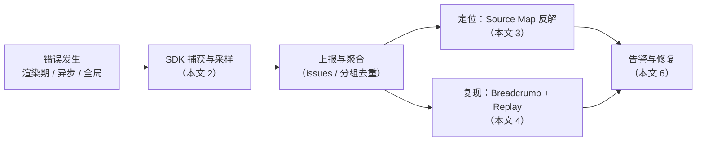

## 知识点地图

- **知识类别**：前端错误监控（error monitoring）与可观测性——以 Sentry 为主线的生产监控体系，覆盖上报、定位、复现、告警四个环节。
- **解决什么问题**：用户报告「页面白屏了」但你本地无法重现；错误堆栈是压缩后的 `chunk-abc.js:1:2345`；错误率涨了但不知道是哪个版本引入；捕获到的错误缺上下文（用户点了什么、请求了什么）。错误边界的渲染降级机制本身见[错误边界](/react/190-ReactErrorBoundary)，本文默认你已会写边界，聚焦**边界之外的监控链路**。
- **什么时候用到**：应用上线之前必须配好；团队超过一人、发版频率超过一周一次时，Release 追踪与告警从可选变成必需。

## 前置知识

- [错误边界](/react/190-ReactErrorBoundary)：`componentDidCatch` 与边界捕获范围——Sentry 的 React 集成建立在其上
- [React 服务端渲染](/react/260-ReactSSR)：Next.js 集成节需要 App Router 的 error.tsx 约定

## 1. 监控链路全景

错误监控是一条流水线，每个环节对应一个工程问题：



一句话分工：错误边界负责「用户少受罪」（降级 UI），监控平台负责「开发者少背锅」（知道哪坏了、为什么、谁受影响）。两者用同一个接缝连接：`componentDidCatch` 或 React 19 的 `onCaughtError` 里调上报 API。

## 2. Sentry SDK 初始化与采样成本

### 2.1 完整初始化（可直接作为项目模板）

```typescript
import * as Sentry from '@sentry/react';
import { BrowserTracing } from '@sentry/browser';

const SENTRY_DSN = import.meta.env.VITE_SENTRY_DSN;
const APP_VERSION = import.meta.env.VITE_APP_VERSION;
const ENVIRONMENT = import.meta.env.MODE;

export function initSentry(): void {
  if (!SENTRY_DSN) {
    console.warn('[Sentry] DSN not configured, skipping initialization');
    return; // 本地开发或未配置环境直接跳过，不报错中断
  }

  Sentry.init({
    dsn: SENTRY_DSN,
    release: `fandex-web@${APP_VERSION}`,
    environment: ENVIRONMENT,
    tracesSampleRate: ENVIRONMENT === 'production' ? 0.1 : 1.0,
    replaysSessionSampleRate: ENVIRONMENT === 'production' ? 0.01 : 0.1,
    replaysOnErrorSampleRate: 1.0,
    integrations: [
      new BrowserTracing(),
      Sentry.replayIntegration({
        maskAllText: true,      // 录屏时遮蔽文本：防止用户输入进平台
        blockAllMedia: false,
      }),
      Sentry.offlineIntegration(), // 离线缓存，恢复网络后补报
    ],
    ignoreErrors: [
      'ResizeObserver loop limit exceeded', // 浏览器噪声，无业务意义
      'Network request failed',
      'Failed to fetch',
    ],
    denyUrls: [
      /chrome-extension:\/\//,  // 用户装的浏览器插件抛的错不是你的锅
      /extensions\//,
    ],
    beforeSend(event) {
      if (event.user?.email?.endsWith('@test.com')) {
        return null; // 测试账号的错误直接丢弃
      }
      return event;
    },
  });

  Sentry.setTag('app.version', APP_VERSION);
  Sentry.setTag('runtime.environment', ENVIRONMENT);
}
```

逐段讲解：

- `beforeSend` 返回 `null` 表示「这个事件不上报」，返回修改后的 event 表示「上报但先加工」。它是过滤的业务级最后一道闸，配合 `ignoreErrors`（按消息文本）与 `denyUrls`（按来源 URL）构成三层过滤。
- `maskAllText: true` 是合规底线：Session Replay 会录制页面内容，不遮蔽文本等于把用户输入（可能含手机号、地址）上传到第三方平台。
- 易错点：`ignoreErrors` 里塞太多「看着烦」的错误会把真问题一起静音。先把噪声归类（插件、广告拦截器），而不是无脑加白名单。

### 2.2 采样的代价模型

Sentry 按事件量计费：免费版 5K events/月，Team 版 50K events/月。一次上报的体积为 $S$（含 stack trace、breadcrumb、replay 片段），采样率 $r$，每日错误数 $N$：

$$
\text{Daily Cost} = N \times r \times S \times \text{price per KB}
$$

所以采样率是成本旋钮，而**不同信号该有不同的采样率**：

```typescript
Sentry.init({
  dsn: '...',
  // 反模式：所有信号一律 100%
  // tracesSampleRate: 1.0,
  // replaysSessionSampleRate: 1.0,

  // 正确：分层采样
  tracesSampleRate: (samplingContext) => {
    if (samplingContext.transactionContext.name.includes('checkout')) {
      return 1.0;           // 结账路径 100%：业务关键，多贵都要
    }
    if (samplingContext.parentSampled) {
      return 1.0;           // 父事务已采样则跟随
    }
    return 0.01;            // 普通路径 1%
  },
  replaysSessionSampleRate: 0.01, // 普通会话录屏 1%
  replaysOnErrorSampleRate: 1.0,  // 出错会话 100%：错误现场必录
});
```

为什么错误会话录屏 100%：replay 是复现的最后一环，成本高但只对错误会话开启，事件量被错误数而不是用户数限制。

## 3. 让错误可定位：Source Map 与 Release

### 3.1 Source Map 反解

生产构建压缩后，堆栈长这样：`a.b is not a function at chunk-abc.js:1:2345`。Source Map 把压缩位置映射回源码：

$$
\text{SourceMap} : \text{minified position} \rightarrow \text{source position}
$$

两种策略的取舍：

| 策略 | 安全性 | 复杂度 | 推荐 |
| :--- | :--- | :--- | :--- |
| 上传到 Sentry | 高（仅平台可访问） | 中 | 强烈推荐 |
| Hidden Source Map（不发布 `.map`，仅上传） | 高 | 中 | 推荐 |
| 本地 `//# sourceMappingURL=` 指向公开文件 | 低（源码结构暴露） | 低 | 不推荐 |
| 不生成 Source Map | 高 | 低（无法定位） | 不推荐 |

CI 上传的标准动作（构建后上传、上传后删除本地 map）：

```yaml
# .github/workflows/deploy.yml
- name: Build & Upload Source Maps
  run: |
    npm run build
    npx sentry-cli sourcemaps upload --release=fandex-web@${{ github.sha }} dist/
    rm -rf dist/**/*.map
```

易错点：Source Map 必须与**当次发布的产物**对应。构建两次再上传第二次的 map，第一次发布期间收集的错误全部反解失败——所以 `release` 标识要贯穿「构建、上传、init」三处，用同一个版本号。

### 3.2 Release 与版本追踪

```typescript
Sentry.init({
  dsn: '...',
  release: `fandex-web@${APP_VERSION}`, // 错误与代码版本绑定
});
```

$$
\text{Error} \leftrightarrow \text{Release} \leftrightarrow \text{Commit}
$$

配好 release 后 Sentry 能回答三个监控的核心问题：这是新版本引入的错误还是历史遗留（"New in release"）；这个错误在哪个版本被修掉（"Resolved in release"）；修完又复发了没有（"Regressed in release"）。CI 里进一步关联 commit：

```typescript
await cli.releases.setCommits(release, {
  repo: 'fandex/web',
  commit: process.env.GIT_SHA!,
  previousCommit: process.env.PREVIOUS_GIT_SHA,
});
```

只设 release 不关联 commit，Sentry 只能给你版本号；关联后能直接给你「嫌疑 PR 列表」。两行配置，排查效率差一个量级。

## 4. 让错误可复现：Breadcrumb 与上下文

Breadcrumb 是错误发生前的关键事件序列：用户行为（点击、导航）、网络请求（fetch/XHR）、控制台日志。SDK 自动收集大部分，关键动作建议手动补：

```typescript
Sentry.addBreadcrumb({
  category: 'ui',
  message: 'Clicked checkout button',
  level: 'info',
});
```

自报 breadcrumb 的时机是「埋点」：自动化收集知道「用户点了一个按钮」，手动埋点知道「用户点的是『提交订单』且购物车金额 199」——排查业务 bug 靠的是后者。上报时按时间倒序保留最近 100 条，所以埋点宁缺毋滥，噪声多了真正相关的会被冲掉。

### 4.1 全局兜底：边界管不到的错误

错误边界只救渲染期错误；事件处理器、异步回调、资源加载失败走全局通道：

```typescript
// globalErrorHandler.ts
import * as Sentry from '@sentry/react';

export function setupGlobalErrorHandlers(): void {
  // 1. 未处理的同步错误
  window.addEventListener('error', (event) => {
    if (event.message === 'Script error.') {
      Sentry.captureMessage('Cross-origin script error', 'error');
      return; // 跨域脚本拿不到细节，单独标记
    }
    Sentry.captureException(event.error, {
      contexts: {
        default: { filename: event.filename, lineno: event.lineno, colno: event.colno },
      },
    });
  });

  // 2. 未处理的 Promise rejection
  window.addEventListener('unhandledrejection', (event) => {
    const error = event.reason instanceof Error
      ? event.reason
      : new Error(`Unhandled rejection: ${JSON.stringify(event.reason)}`);
    Sentry.captureException(error, { tags: { type: 'unhandledrejection' } });
  });

  // 3. 资源加载失败（img/script/link）——用捕获阶段才能收到
  window.addEventListener('error', (event) => {
    const target = event.target as HTMLElement;
    if (target && ['IMG', 'SCRIPT', 'LINK'].includes(target.tagName)) {
      Sentry.captureMessage(
        `Resource load failed: ${(target as HTMLImageElement).src ?? (target as HTMLLinkElement).href}`,
        'warning',
      );
    }
  }, true);
}
```

注意资源加载错误用的是 `addEventListener('error', ..., true)` 捕获阶段——资源错误的 `event.target` 是元素本身而非 window，冒泡阶段注册收不到。

### 4.2 异步错误统一入口：useErrorHandler 模式

事件处理器和 Effect 里的错误不会自动进任何监控，需要一个统一模式：

```tsx
import { useCallback, useState } from 'react';
import * as Sentry from '@sentry/react';

export function useErrorHandler() {
  const [error, setError] = useState<Error | null>(null);

  const handleError = useCallback((err: unknown, context?: Record<string, unknown>) => {
    const normalizedError = err instanceof Error ? err : new Error(String(err));
    Sentry.captureException(normalizedError, { extra: context }); // 先上报
    setError(normalizedError);                                     // 再进渲染路径
  }, []);

  const resetError = useCallback(() => setError(null), []);
  return { error, isError: error !== null, resetError, handleError };
}

// 使用：上传失败既被记录，又能触发上层边界降级
function AsyncButton({ onClick }: { onClick: () => Promise<void> }) {
  const { handleError, isError } = useErrorHandler();

  if (isError) {
    throw new Error('异步操作失败，交由上层边界降级'); // 转入渲染期，交给上层 Error Boundary
  }
  return (
    <button
      onClick={async () => {
        try {
          await onClick();
        } catch (e) {
          handleError(e, { action: 'async-button' });
        }
      }}
    >
      提交
    </button>
  );
}
```

顺序是「先 capture 再 setState」：如果反过来且 setState 后的渲染再次抛错，上报就丢了。

## 5. React Router 与 Next.js 集成

### 5.1 React Router：Sentry.ErrorBoundary 作为路由边界

```tsx
import * as Sentry from '@sentry/react';
import { createBrowserRouter, RouterProvider } from 'react-router';

const SentryErrorBoundary = Sentry.ErrorBoundary;

const router = createBrowserRouter([
  {
    path: '/dashboard',
    element: (
      <SentryErrorBoundary fallback={<ErrorFallback />} showDialog>
        <Dashboard />
      </SentryErrorBoundary>
    ),
  },
]);

export default function App() {
  return <RouterProvider router={router} />;
}
```

`Sentry.ErrorBoundary` 是手写边界的监控增强版：自动上报 + 可选 `showDialog`（崩溃时弹出用户反馈表单，反馈与错误事件 ID 关联）。它与自写边界可以嵌套共存：机制层用自写的（见[错误边界](/react/190-ReactErrorBoundary)），监控层用它。

### 5.2 Next.js App Router：error.tsx 里上报

```tsx
// app/error.tsx
'use client';

import { useEffect } from 'react';
import * as Sentry from '@sentry/react';

export default function Error({ error, reset }: {
  error: Error & { digest?: string };
  reset: () => void;
}) {
  useEffect(() => {
    Sentry.captureException(error); // App Router 的路由错误不走组件边界，在这里上报
  }, [error]);

  return (
    <div>
      <h2>出错了</h2>
      <p>{error.message}</p>
      {error.digest && <p>Error ID: {error.digest}</p>}
      <button onClick={reset}>重试</button>
    </div>
  );
}
```

构建配置交给 `@sentry/nextjs` 的包装函数（自动上传 Source Map、注入 server/client 标注）：

```typescript
// next.config.ts
import { withSentryConfig } from '@sentry/nextjs';

export default withSentryConfig(
  {
    reactStrictMode: true,
  },
  {
    org: 'fandex',
    project: 'web',
    silent: !process.env.CI,
    reactComponentAnnotation: { enabled: true },
    widenClientFileUpload: true,
    disableLogger: true,
  },
);
```

Vite 侧的构建配置要点（Source Map 用 hidden 模式：生成但不暴露给客户端，仅供上传）：

```typescript
// vite.config.ts
export default defineConfig(({ mode }) => ({
  build: {
    sourcemap: mode === 'production' ? 'hidden' : true,
    rollupOptions: {
      output: {
        manualChunks: {
          'react-vendor': ['react', 'react-dom'],
          'sentry': ['@sentry/react'],
        },
      },
    },
  },
}));
```

## 6. 告警与运维

### 6.1 告警规则

```yaml
# sentry-alerts.yml
rules:
  - name: 高错误率告警
    conditions:
      - event.level == "error"
      - event.frequency > 10/min
    actions:
      - notify: { channel: slack, target: '#frontend-alerts' }
      - notify: { channel: pagerduty, service_key: '${PAGERDUTY_SERVICE_KEY}' }
    cooldown: 30min

  - name: 新错误告警
    conditions:
      - event.is_new == true
      - event.level in ["error", "fatal"]
    actions:
      - notify: { channel: slack, target: '#frontend-errors' }
    cooldown: 5min

  - name: Release 回归
    conditions:
      - event.is_regression == true
      - event.release == "latest"
    actions:
      - notify: { channel: slack, target: '#release-alerts' }
```

三条规则对应三种响应节奏：高错误率是「着火」（即时响应）、新错误是「有人烧了新东西」（当天看）、回归是「修过的东西坏了」（发版负责人看）。`cooldown` 防止同一条规则把频道刷爆。

### 6.2 验证工具

```bash
# 验证 Source Map 上传
npx sentry-cli sourcemaps list --release=fandex-web@1.2.3

# 验证事件接收
npx sentry-cli issues list --query=is:unresolved
```

上线前自检清单：造一个测试错误（如 `Sentry.captureException(new Error('smoke-test'))`），确认平台收到、堆栈反解成功、release 与 commit 显示正确——三个环节任何一个断了，平时都发现不了，出事时才发现监控是坏的。

## 7. 方案对比与清单

| 维度 | Sentry | Rollbar | Bugsnag | LogRocket | DataDog RUM |
| :--- | :--- | :--- | :--- | :--- | :--- |
| 错误监控 | 优秀 | 优秀 | 优秀 | 优秀 | 良好 |
| 性能追踪 | 优秀 | 良好 | 良好 | 优秀 | 优秀 |
| Session Replay | 优秀 | 无 | 无 | 优秀（核心） | 优秀 |
| Release 追踪 | 优秀 | 优秀 | 优秀 | 优秀 | 良好 |
| 开源可自托管 | 是 | 否 | 否 | 否 | 否 |
| React 官方 SDK | 是 | 第三方 | 是 | 是 | 是 |

选型主线：全自托管要求 → Sentry；已经深度使用 DataDog 的团队 → RUM 减少平台数；重会话回放的体验团队 → LogRocket。功能重叠度高，采样与告警纪律比选哪个平台更影响效果。

**上线路径清单**（按优先级）：

1. `Sentry.init` + release + environment 三件套
2. 分层采样率（错误 100%、性能按流量、replay 出错会话 100%）
3. CI 上传 Source Map 并关联 commit
4. `window.onerror` + `unhandledrejection` 全局兜底
5. 路由/关键区块接入 `Sentry.ErrorBoundary`
6. 告警规则接入 IM，明确响应人
7. 用户反馈组件（错误事件关联反馈表单）

## 8. 动手实践

### 练习 1：给项目接上最小可用监控

任务：为 FANDEX 阅读器 Web 端接入 Sentry 最小配置，要求：生产环境才初始化；开发环境完全静默；验证事件能到达平台。

提示：DSN 从环境变量来；`initSentry` 只在入口调用一次；用 `captureException` 造一个测试事件。

参考实现（先自己写，再展开对照）：

<details>
<summary>参考实现</summary>

```typescript
// main.tsx
import * as Sentry from '@sentry/react';

if (import.meta.env.MODE === 'production' && import.meta.env.VITE_SENTRY_DSN) {
  Sentry.init({
    dsn: import.meta.env.VITE_SENTRY_DSN,
    release: `fandex-web@${import.meta.env.VITE_APP_VERSION}`,
    environment: import.meta.env.MODE,
    tracesSampleRate: 0.1,
  });
}

Sentry.captureException(new Error('smoke-test')); // 上线自检用，验证后删除
```

自检：开发环境控制台不应出现任何 Sentry 网络请求；测试事件到达后堆栈是否可读（本地未压缩所以可读，生产需 Source Map——见第 3 节）。
</details>

### 练习 2：设计采样率方案

任务：阅读器日活 5 万，日均错误事件 8 万（大部分来自一个浏览器插件的噪声），月预算 5 万 events。给出采样与过滤方案并估算月事件量。

提示：先过滤噪声（`ignoreErrors` / `denyUrls`），再对剩余流量分层采样。

参考实现：

<details>
<summary>参考实现</summary>

```typescript
Sentry.init({
  ignoreErrors: ['ResizeObserver loop limit exceeded'], // 实测占比约 90% 的噪声
  denyUrls: [/chrome-extension:\/\//],
  tracesSampleRate: 0.01, // 性能事件 1%
});
```

估算：噪声过滤后约 0.8 万/天；错误事件不采样（保留全部真实错误），性能与 replay 采样后每天约 200 条。月量约 25 万条——超出 5 万预算，进一步方案：错误按「首次出现 100% + 重复聚合 10%」上报（beforeSend 里用 fingerprint 查重），或升级套餐。结论要诚实：错误事件不该为省钱静音，成本问题应通过降噪与套餐解决。

自检：你的方案里有没有「可能丢真实错误」的环节？有的话说明理由并给兜底。
</details>

### 练习 3：把业务动作变成 breadcrumb

任务：阅读器的「购买章节」失败率上升但原因不明。为购买流程设计三处手动 breadcrumb，让错误事件能重建「用户走到了哪一步」。

提示：覆盖「进入流程、发起支付、收到结果」三个状态转移点；数据字段给排查需要的最小集。

参考实现：

<details>
<summary>参考实现</summary>

```typescript
Sentry.addBreadcrumb({
  category: 'purchase',
  message: 'enter-checkout',
  level: 'info',
  data: { bookId, chapterCount, priceYuan },
});

Sentry.addBreadcrumb({
  category: 'purchase',
  message: 'request-pay',
  level: 'info',
  data: { payChannel, orderId }, // 不放手机号/卡号等敏感字段
});

Sentry.addBreadcrumb({
  category: 'purchase',
  message: 'pay-result',
  level: 'info',
  data: { status, code },
});
```

自检：错误事件的时间线上能否回答「用户卡在哪一步、用了哪个渠道、错误码是什么」？data 里是否混入了敏感字段（合规检查）？
</details>

## 9. 小结

- 监控链路四环节：捕获采样 → 定位（Source Map + Release）→ 复现（Breadcrumb + Replay）→ 告警修复。
- 采样率是成本旋钮：错误不采样、性能按流量、replay 只录错误会话；`ignoreErrors`/`denyUrls`/`beforeSend` 三层降噪。
- release 必须贯穿构建、上传、init 三处并关联 commit，否则反解与归因全断。
- 错误边界管渲染期，`window.onerror`/`unhandledrejection` 管全局，异步错误用 useErrorHandler 模式「先上报再进渲染」。

<!-- 恢复自 cnt-content/full/010-react/440-ErrorBoundarySentry.md（实施前 HEAD 62c90663 版本）；拆分时该小节未随迁，2026-10-07 内容保全复核恢复 -->

## 调试工具

### React DevTools

React DevTools 显示组件树中错误边界的位置，便于调试：

- 错误边界组件会显示 `警告 ErrorBoundary` 标识
- 当错误发生时，DevTools 高亮出错的组件

### Sentry Dashboard

- **Issues**：错误聚合列表，按出现次数排序
- **Releases**：版本追踪，显示每个 release 的新增/解决/回归错误
- **Performance**：性能追踪，按 transaction 排序
- **Replays**：会话录屏，可回放用户操作
- **Discover**：自定义查询，构建 SLI/SLO

### Source Map 调试

```bash
# 验证 Source Map 上传
npx sentry-cli sourcemaps list --release=fandex-web@1.2.3

# 验证错误反解
npx sentry-cli issues list --query=is:unresolved
```

<!-- 恢复自 cnt-content/full/010-react/440-ErrorBoundarySentry.md（实施前 HEAD 62c90663 版本）；拆分时该小节未随迁，2026-10-07 内容保全复核恢复 -->

## SLO 与告警


```typescript
// SLO 定义
const SLO = {
  // 错误率 SLO：99.9% 请求无错误
  errorRate: 0.001,
  // INP SLO：P95 < 200ms
  inpP95: 200,
  // LCP SLO：P95 < 2.5s
  lcpP95: 2500,
};

// 监控仪表盘
function SLODashboard() {
  const errorRate = useSentryMetric('error_rate', '1h');
  const inp = useSentryMetric('inp_p95', '1h');
  const lcp = useSentryMetric('lcp_p95', '1h');

  return (
    <div>
      <MetricCard
        name="Error Rate"
        value={errorRate}
        target={`< ${SLO.errorRate * 100}%`}
        status={errorRate <= SLO.errorRate ? 'healthy' : 'breach'}
      />
      <MetricCard
        name="INP P95"
        value={`${inp}ms`}
        target={`< ${SLO.inpP95}ms`}
        status={inp <= SLO.inpP95 ? 'healthy' : 'breach'}
      />
    </div>
  );
}
```

---


## 参考与致谢

- Sentry 官方文档（React 集成）：https://docs.sentry.io/platforms/javascript/guides/react/ ，Sentry SDKs, MIT License（SDK 与文档随仓库开源）。
- 原 440-ErrorBoundarySentry 篇的 Sentry 专属内容（SDK 初始化、Source Map/Release、Breadcrumb、Trace、useErrorHandler、Next.js/Vite 集成、告警规则、方案对比表）已全部搬入本篇并教学化改写；错误边界机制部分已并入 [错误边界](/react/190-ReactErrorBoundary)（分层边界反模式等片段），重复段落移除。
- 以下 4 条为原 440 篇参考文献（10.2 官方文档与工程博客）的剩余条目，原文引用，未逐条复核时效：
  - React Team. 2024. Error Boundaries. React Documentation: https://react.dev/reference/react/Component#catching-rendering-errors-with-an-error-boundary
  - Vercel. 2024. Next.js Error Handling: https://nextjs.org/docs/app/building-your-application/routing/error-handling
  - Abramov, D. 2017. React v16: Error Boundaries. React Blog: https://react.dev/blog/2017/07/26/error-handling-in-react-16
  - Sentry. 2024. Source Maps Upload: https://docs.sentry.io/platforms/javascript/sourcemaps/

## 错误处理的历史背景

<!-- 来源: cnt-content/full/010-react/440-ErrorBoundarySentry.md 的 "1.1 错误处理的历史背景" 小节 -->

JavaScript 的错误处理长期是前端的痛点：

1. **2015 之前**：`window.onerror` 是唯一捕获全局错误的入口，但跨域脚本错误只能拿到 `"Script error."`，无堆栈信息。
2. **2015（ES6）**：Promise 引入，但未捕获的 Promise rejection 静默失败。`window.onerror` 不能捕获 Promise 错误。
3. **2017（React 16）**：React 引入 Error Boundaries，将组件树错误隔离在边界内。但事件处理器错误、异步错误、SSR 错误仍需开发者自行处理。
4. **2018**：浏览器原生支持 `window.addEventListener('unhandledrejection', ...)`，Promise 错误终于有统一入口。
5. **2022（React 18）**：并发模式下，错误传播路径更复杂，部分场景下 Error Boundary 行为变化（如 Suspense 边界交互）。
6. **2024+（React 19）**：Server Components 错误处理统一到 `error.js` 与 `global-error.js`，SSR 错误与 CSR 错误处理趋于一致。

## Sentry 的演进

<!-- 来源: cnt-content/full/010-react/440-ErrorBoundarySentry.md 的 "1.2 Sentry 的演进" 小节 -->

Sentry 是 Open Source 错误监控的标杆，其演进：

| 阶段 | 时间 | 特性 |
|------|------|------|
| 萌芽 | 2008（Django 内部工具） | 仅 Python 后端错误 |
| 多语言 | 2012 | 支持 JS、Ruby、Node.js 等 |
| Performance | 2019 | 引入 Tracing |
| React Native | 2016 | 移动端错误监控 |
| Session Replay | 2023 | DOM 录屏回放 |
| Profiling | 2024 | 性能 Profile 上报 |

## 案例研究

<!-- 来源: cnt-content/full/010-react/440-ErrorBoundarySentry.md 的 "8. 案例研究" 小节 -->

### 8.1 Facebook（Meta）：React 16 Error Boundary 发布

2017 年 React 16 发布时，Meta 内部将错误边界用于 News Feed 模块：

- 错误隔离范围：单个 Feed 卡片
- 错误率下降 40%（错误不再导致整页崩溃）
- 错误上报到内部 Hydra 系统（Sentry 的内部版）

数据来源：Meta Engineering Blog "React v16: Error Boundaries"（2017）。

### 8.2 Airbnb：Sentry 全链路集成

Airbnb 在 2018 年全面迁移到 Sentry 后：

- 错误发现到修复的中位时间从 6 天降至 4 小时
- Source Map 自动上传使错误可定位率从 30% 升至 95%
- Release 关联让"回归错误"识别时间从 1 天降至 5 分钟
- Session Replay 帮助复现 70% 的难以描述的 UI Bug

### 8.3 Netflix：分层错误边界策略

Netflix 在播放器页面采用 5 层错误边界：

1. Root：整页 fallback
2. Player：播放器 fallback
3. Sidebar：侧边栏 fallback
4. Controls：控件 fallback
5. Subtitle：字幕 fallback

效果：
- 单一组件错误不影响整体播放
- 字幕解析错误时静默降级（无字幕）而非崩溃
- 错误上报带层级 tag，便于优先级排序

### 8.4 Shopify：Sentry + Performance 联合监控

Shopify 将 Sentry 错误监控与 Performance 追踪结合：

- 错误与性能数据共用同一 transaction
- 当 INP > 500ms 时自动标记为 "performance error"
- 当 LCP > 4s 时截图并上报
- 通过 Sentry Discover 构建自定义 SLO 仪表盘

### 8.5 Vercel：Next.js App Router 错误处理

Vercel 在 Next.js 13+ 中引入 `error.js` 与 `global-error.js`：

- Route 级错误自动隔离，不影响其他 route
- Server Components 错误自动流式传输到客户端
- 与 Sentry 集成时自动上报，无需手动 try-catch

## 附录 A：错误处理 Checklist

<!-- 来源: cnt-content/full/010-react/440-ErrorBoundarySentry.md 的 "附录 A：错误处理 Checklist" 小节 -->

| # | 检查项 | 通过 |
|---|--------|------|
| 1 | 应用根级 Error Boundary | [ ] |
| 2 | 关键页面/组件级 Error Boundary | [ ] |
| 3 | 事件处理器 try-catch | [ ] |
| 4 | 异步代码 try-catch 或 useAsyncError | [ ] |
| 5 | `window.onerror` + `unhandledrejection` 兜底 | [ ] |
| 6 | Sentry 初始化与 Release 配置 | [ ] |
| 7 | Source Map CI 上传 | [ ] |
| 8 | 采样率合理设置 | [ ] |
| 9 | 告警集成 Slack/PagerDuty | [ ] |
| 10 | SLO 与仪表盘 | [ ] |
| 11 | 用户反馈组件 | [ ] |
| 12 | 错误回归 E2E 测试 | [ ] |

## 附录 B：Sentry 集成速查

<!-- 来源: cnt-content/full/010-react/440-ErrorBoundarySentry.md 的 "附录 B：Sentry 集成速查" 小节 -->

| 集成 | 用途 | 配置 |
|------|------|------|
| `BrowserTracing` | 性能追踪 | `tracesSampleRate` |
| `replayIntegration` | 会话录屏 | `replaysSessionSampleRate` |
| `offlineIntegration` | 离线缓存 | 默认开启 |
| `captureConsoleIntegration` | 捕获 console | 可选 |
| `httpClientIntegration` | 捕获 fetch 错误 | 默认开启 |
| `contextLinesIntegration` | 添加上下文行 | 默认开启 |

## 附录 C：术语表

<!-- 来源: cnt-content/full/010-react/440-ErrorBoundarySentry.md 的 "附录 C：术语表" 小节 -->

| 术语 | 英文 | 定义 |
|------|------|------|
| 错误边界 | Error Boundary | React 类组件，捕获子树渲染错误 |
| Source Map | Source Map | 将压缩代码映射回源码的文件 |
| Breadcrumb | Breadcrumb | 错误发生前的事件序列 |
| Release | Release | 代码版本标识 |
| Session Replay | Session Replay | DOM 录屏回放 |
| Tearing | Tearing | 并发渲染中的快照不一致 |
| Digest | Digest | 服务器生成的错误 ID |
| SLO | Service Level Objective | 服务等级目标 |
