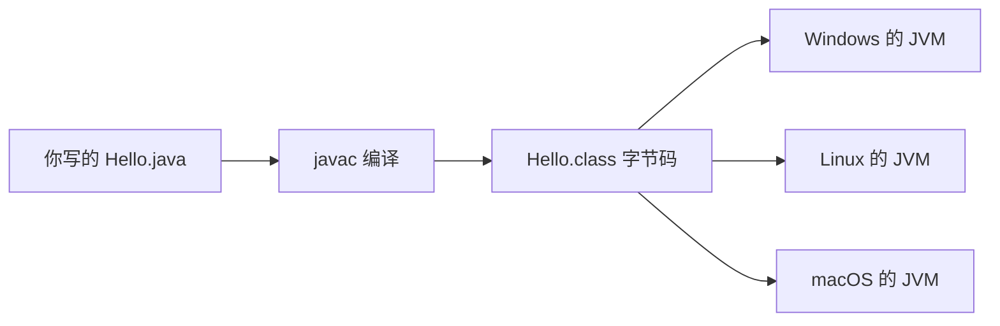

## 前置知识

- 读过 [全库学习路线总览](/start/080-LearningRouteOverview)：知道 Java 线在整个学习地图里的位置；
- 读过 [程序设计基础](/cs-fundamentals/020-ProgrammingBasics)：知道「程序 = 指令 + 数据」，见过「编译型 / 解释型」的说法。

没读过也可以，本文会带上需要的部分：上面两个链接各花 10 分钟即可补齐。

## 学习目标

读完本文你将能够：

1. 用一句话向别人解释「一次编写，到处运行」靠什么实现，并画出从源码到运行的流程图；
2. 说出字节码、JVM、编译三者的分工，并与 JS 的「引擎 + 宿主」模型对照；
3. 列出 Java 的三大主战场，并解释为什么企业 Java 招聘几乎总带着 Spring；
4. 说出 LTS 是什么、当前 LTS 序列有哪些，并为自己的学习机选好版本；
5. 识别「类名与文件名必须一致」这条 Java 特有规则，并读懂对应的编译报错。

预计 30 到 45 分钟，含 3 个动手实验与 4 道练习。

## 1. 问题引入：一次编写，到处运行

「一次编写，到处运行」——二十多年前这句口号改变了企业软件。

想象 2005 年你在一家银行写交易系统：柜员窗口是 Windows，机房服务器是 Linux，总部还有一批 Unix 主机。同一套业务逻辑要跑在三种完全不同的机器上，而在 Java 之前，多数语言要把代码针对每种机器分别编译、分别调试，改一个 bug 要改三处。

Java 的答案是：**不把代码直接翻译成某一种机器的指令，而是翻译成一种中间格式，再让每种机器各配一个「执行员」**。中间格式叫字节码（bytecode），执行员叫 JVM（Java Virtual Machine，Java 虚拟机）。



同一份字节码，任何装了 JVM 的机器都能跑——「一次编写」产出的是字节码，「到处运行」靠的是各平台自己的 JVM。JVM 还附带垃圾回收（GC）：不再使用的内存自动回收，你不需要像 C 语言那样手动释放。

## 2. 与你已经学过的模型对照

如果你读过 [JavaScript 概述与运行环境](/javascript/020-JavaScriptOverviewRuntimeEnv)，会记得那个模型：**运行环境 = 语言引擎 + 宿主 API**，JS 交出去的是源码，由各环境的引擎现场执行。

Java 的模型只在前半段不同：

| | JavaScript | Java |
| --- | --- | --- |
| 交付物 | 源码（.js） | 编译产物（.class 字节码） |
| 执行者 | 各环境引擎（V8 等）+ 宿主 API | 各平台 JVM |
| 编译步骤 | 无（引擎现场处理） | 有（javac，装 JDK 时自带） |

一句话：**JS 是「现场翻译」，Java 是「先翻译成标准中间码，再由各平台执行员去执行」**。多一步编译，换来的是交付物与机器、与源码的双重解耦——这正是它拿下企业市场的原因之一。

## 3. 先试试看：让第一段 Java 跑起来

Java 的所有代码都必须写在**类**（class）里——先把它理解成「代码的房子」，下一篇细讲。这段代码就是 Java 世界的「Hello, World!」：

```java
public class Hello {
    public static void main(String[] args) {
        System.out.println("Hello, Java!");
    }
}
```

现在环境还没装（下一篇装），你可以直接用 dev.java 的官方在线环境：打开 https://dev.java/playground/ ，贴入上面的代码，点运行。

预期输出：

```text
Hello, Java!
```

本地运行则是两步（装好 JDK 之后）：

```bash
javac Hello.java   # 编译：生成 Hello.class 字节码
java Hello         # 运行：JVM 执行字节码
```

```text
Hello, Java!
```

这两步正是上面流程图的两段箭头。代码里的每个词现在都不必懂——main、public、static 会在 [快速上手](/java/030-QuickStart) 逐词拆解。

## 4. Java 的主战场

Java 不是万金油，它的统治区非常清晰：

| 战场 | 代表 | Java 在其中的角色 |
| --- | --- | --- |
| 企业后端 | 银行核心系统、电商、政务平台 | 绝对主流，二十余年存量无可替代 |
| Android | 手机 App | 原生开发的传统语言（官方现推 Kotlin，但两者同在 JVM 上，技能互通） |
| 大数据 | Hadoop、Kafka、Spark、Flink | 这些系统本身就长在 JVM 上 |

「为什么偏偏是企业后端」的答案在第 1、2 节已经埋好：银行要的是二十年不换平台的确定性，字节码 + JVM + 向后兼容恰好提供这个。

## 5. 生态的现实感：企业 Java 就是 Spring

学 Java 之前必须知道的一个事实：**企业里的 Java 项目，十有八九是 Spring 框架项目**。Spring 不是语言，是构建在 Java 之上的应用框架——数据库访问、网页接口、安全认证，这些企业系统的标配能力 Spring 都替你管了。招聘网站上的「Java 工程师」岗位，默认就是「Java + Spring」。

本模块会在 [Spring 基础](/java/820-SpringIoCContainerBeansAndDI) 正式进入 Spring。在那之前要做的是把 Java 语言本身学扎实——Spring 再强，写的每一行还是 Java。

## 6. 版本策略：只认 LTS

Java 现在每半年发一个新版本，但只有标着 **LTS**（Long-Term Support，长期支持）的版本才会被长期维护，也是企业实际部署的目标。LTS 序列：**8、11、17、21、25**——25 于 2025 年 9 月发布，是写作本文时的最新 LTS。

你现在只需要三条：

1. 学习机装较新的 LTS 即可（21 或 25，下一篇带装）；
2. 语法学习以 17+ 为基线；网上教程若基于更老的 Java 8，看得出差异就行；
3. 具体哪个版本是当前 LTS、下个 LTS 何时发布，以官网 https://jdk.java.net/ 为准，不要背。

## 7. 修改实验

实验一：在 playground 把 `println` 里的文本改成你自己的名字，先预测输出，再运行验证。

实验二：在 main 方法里再加一行 `System.out.println("今天开始学 Java");`（注意分号），先预测输出顺序，再运行。

实验三：体验强类型。故意加一行错误代码 `int x = "abc";`（int 表示整数，把文字赋给整数），运行并观察——这次连输出都出不来：

```text
Playground.java:4: error: incompatible types: String cannot be converted to int
    int x = "abc";
            ^
1 error
```

这就是 Java 的性格：**类型不对这种错误，在编译期就被拦下，根本轮不到运行**。脚本语言「跑起来才炸」的问题，Java 把一大半挡在了编译阶段——上手繁琐一点，换工程上的确定性。

## 8. 常见错误与调试实录

错误一：类名与文件名不一致。你把 `public class Demo` 保存在 Hello.java 里，编译：

```text
Hello.java:1: error: class Demo is public, should be declared in a file named Demo.java
public class Demo
       ^
1 error
```

读报错三步：冒号前是文件名加行号（Hello.java 第 1 行）；`error:` 后是原因（Demo 这个 public 类应该放在 Demo.java 里）；`^` 指向出错位置。**类名与文件名必须一致**是 Java 的硬规则，因为 JVM 按类名找代码。

错误二：运行时写成 `java Hello.class`（带了后缀）：

```text
Error: Could not find or load main class Hello.class
Caused by: java.lang.ClassNotFoundException: Hello.class
```

`java` 后面跟的是**类名**，`javac` 后面跟的才是**文件名**。把 Hello.class 当成文件名传给 java，JVM 就去找一个名字叫「Hello.class」的类，当然找不到。

错误三：Java 与 JavaScript 的关系。答案是几乎没有——1995 年 Netscape 为了蹭热度把 LiveScript 改名 JavaScript，纯属历史营销。你学过的 JS 知识里，只有通用编程概念（变量、循环、函数）能平移，其余请归零。

## 9. 实际项目中的使用场景

- 面试 Java 后端岗：职位描述几乎必写 Java 8+ 与 Spring，本文的 JVM 模型是后续所有面试题（内存、并发、GC）的地基；
- 接手 Android 老项目：大量存量代码是 Java 写的，会读 Java 是维护前提；
- 大数据岗位：调优 Kafka、Spark 之前，得先看得懂 JVM 在干什么。

## 10. 小练习

预测题（5 分钟）：把 Hello.java 保存成 hello.java（小写 h）再执行 `javac hello.java`，预测会发生什么，写下来再验证。（提示：回看第 8 节错误一。）

修改题（10 分钟）：在 playground 写一个输出三行自我介绍的程序（姓名 / 正在学的语言 / 一个小目标），运行并核对输出逐行一致。

修 Bug 题（10 分钟）：下面的代码编译报错，按读报错三步定位并修复：

```java
public class Hello {
    public static void main(String[] args) {
        System.out.println("学习 Java 第 1 天")
    }
}
```

真实报错：

```text
Hello.java:3: error: ';' expected
        System.out.println("学习 Java 第 1 天")
                                              ^
1 error
```

挑战题（20 分钟）：不看示例，在 playground 写一个输出游戏排行榜前三名的程序（三行，每行以名次开头，名字自定）。验收清单：编译零报错；输出恰好三行；每行以 1. 2. 3. 开头。提示（思路方向）：三条 println，每条打印一个字符串；展开（关键写法）：字符串直接写在英文双引号里。

## 11. 与之前和之后的知识的关系

- 往前：[程序设计基础](/cs-fundamentals/020-ProgrammingBasics) 里「编译型 / 解释型」的抽象概念，在本文落成了具体的字节码 + JVM 图景；
- 往后：下一篇 [Java 概述与开发环境](/java/020-JavaOverviewDevEnv) 把流程图里的 javac 与 JVM 真正装进你的电脑；再下一篇 [快速上手](/java/030-QuickStart) 跑通第一个程序；然后进入 [程序结构与基本语法](/java/040-ProgramStructureBasicSyntax) 的语法主线；
- 更远：[Spring 基础](/java/820-SpringIoCContainerBeansAndDI) 是你学 Java 的最终去处之一；[Kotlin 是什么](/kotlin/010-WhatIsKotlin) 与 Java 同在 JVM 上，学完 Java 基础后交叉阅读收益极大。

## 12. 官方文档

- Java 官方学习站（本文在线 playground 所在）：https://dev.java/
- JDK 下载与版本日程（LTS 信息以此为准）：https://jdk.java.net/

## 13. 自我检查

- 能不看资料画出「.java → javac → .class → 各平台 JVM」流程图并解释每一步；
- 能说出 Java 与 JS 在「交付物与执行者」上的两点差异；
- 能列出三大主战场，并解释 Spring 与 Java 的关系；
- 能说出当前 LTS 序列并知道去哪里核实最新事实；
- 看到 `class Demo is public, should be declared in a file named Demo.java` 能立刻说出修法。

## 本章总结

一次编写、到处运行的原理是：javac 把源码编译成字节码，各平台的 JVM 负责执行字节码——交付物从源码变成标准中间格式，这是 Java 拿下企业后端、Android 与大数据三大战场的地基。企业 Java 约等于 Java + Spring；版本只认 LTS（8/11/17/21/25），事实以 jdk.java.net 为准；类名必须等于文件名，这条规则会伴随你的每一行 Java。

## 下一步

进入 [Java 概述与开发环境](/java/020-JavaOverviewDevEnv)：把口号变成你机器上真实跑起来的工具。
