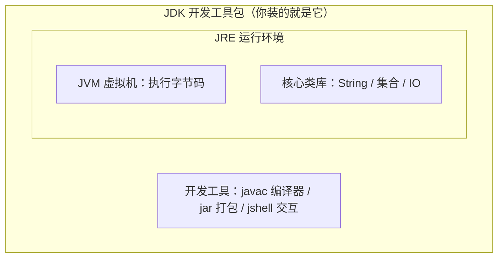

## 前置知识

- 已完成 [Java 是什么](/java/010-WhatIsJava)：知道字节码与 JVM，见过 javac 与 java 两步流程。

上一篇还没读完也能跟：本文只用到一件事——Java 程序要先编译成字节码、再由 JVM 执行。

## 学习目标

读完本文你将能够：

1. 解释为什么 Python 装一个解释器就够、而 Java 必须装 JDK，并说出 JDK、JRE、JVM 三者的包含关系；
2. 在 Windows、macOS 或 Linux 上用一行命令装好 JDK 21 或更新的 LTS；
3. 用 javac -version 与 java -version 双命令验证安装，并说清为什么必须验两条；
4. 装好 IntelliJ IDEA Community 或 VS Code 的 Java 环境；
5. 读懂「'javac' 不是内部或外部命令 / command not found」，并按三步修复。

预计 30 到 45 分钟。

## 1. 问题引入：翻译官不够，还要带运行时

你可能在 [Python 概述与环境搭建](/python/020-PythonOverviewEnvSetup) 里装过 Python：下载、安装、验证一条 `python --version`，完事。因为 Python 是解释型语言——你交付给别人的最终产物就是源码，对方机器上的解释器现场翻译执行。装一个「翻译官」就够了。

Java 是编译型语言，账要算两笔：

1. 你的代码要先被 **javac 编译器**翻译成字节码才能运行——翻译官得装；
2. 运行字节码需要 **JVM 运行时**——执行员也得装。

好在这两样打包在一起，名字叫 **JDK**（Java Development Kit，Java 开发工具包）。Java 开发者的装机口诀只有一句：**写代码，装 JDK，一步到位**。

对照 JS 那边的 Node：Node 同样是「引擎 + 宿主」，但 JS 没有编译步骤，交付物是源码——这正是 Java 多装一个编译器的原因。

## 2. 核心概念：JDK、JRE、JVM 三者关系



从里往外记：

- **JVM**：执行字节码的引擎，上一篇的主角；
- **JRE**（Java Runtime Environment）= JVM + 核心类库：只需要**运行**别人写好的 Java 程序时的最小环境；
- **JDK** = JRE + 开发工具（javac、jar、jshell 等）：只有**写**代码的人才需要。

两个现实注脚：

1. 从 Java 11 起，主流发行版不再单独发布 JRE——这个词更多出现在老文档和面试题里，装机时直接装 JDK 即可；
2. 下一节的验证正建立在这层结构上：**java 命令是 JRE 层的能力，javac 命令是 JDK 层的能力**。双命令验证天然能区分「装的是运行时还是全套开发工具」。

## 3. 动手环节：安装 JDK 21 或更新的 LTS

选版本只看一条规则：**装较新的 LTS**。上一篇说过 LTS 序列是 8 / 11 / 17 / 21 / 25，写作本文时最新 LTS 是 25（2025 年 9 月发布）；你装 21 或 25 都能完整跟完本模块，具体以 https://jdk.java.net/ 为准。

OpenJDK 生态有多个等价发行版（Temurin、Oracle JDK、Microsoft OpenJDK 等），入门任选，本文以 Temurin 为例。三个平台各一行命令：

```bash
# Windows（PowerShell）
winget install EclipseAdoptium.Temurin.21.JDK

# macOS（Homebrew）
brew install --cask temurin@21

# Linux（Ubuntu / Debian）
sudo apt install openjdk-21-jdk
```

不喜欢命令行，就去 https://adoptium.net/ 下载图形安装包，一路下一步。

**装完先关掉所有已打开的终端窗口**——原因见第 7 节，这是新手翻车第一名。

## 4. 验证安装：两条命令，一个都不能少

新开一个终端：

```bash
javac -version
java -version
```

预期输出（版本号以你实际安装为准，重点是两条都有输出且主版本一致）：

```text
javac 21.0.8
openjdk version "21.0.8" 2025-07-15 LTS
OpenJDK Runtime Environment Temurin-21.0.8+9 (build 21.0.8+9)
OpenJDK 64-Bit Server VM Temurin-21.0.8+9 (build 21.0.8+9, mixed mode, sharing)
```

为什么要验两条？回忆第 2 节：`java -version` 有输出只能证明运行时（JRE 层）在位；**`javac -version` 有输出才证明你装的是 JDK**。只验 java 的话，一台只装了运行时的机器也能蒙混过关，到下一篇敲 javac 时才炸。

顺带认识一个词：**JAVA_HOME**——一个指向 JDK 安装目录的环境变量，Maven、Gradle、IDEA 等工具靠它找到 JDK。Windows 安装器通常会自动配置；环境变量的原理与手动配置方法在 [环境变量与 PATH](/shell/100-EnvVarPath) 有完整讲解，现在知道有这个东西就行。

## 5. IDE 选择：IntelliJ IDEA Community 为主

写 Java 有一个几乎无争议的默认答案：

- **IntelliJ IDEA Community（社区版）**：JetBrains 出品，Java 世界的工业标准，免费的 Community 版覆盖本模块全部内容。下载：https://www.jetbrains.com/idea/download/ ；
- **VS Code 备选**：装「Extension Pack for Java」扩展包即可获得编译运行与代码补全，适合已有 VS Code 使用习惯、想轻装上阵的人。

IDEA 首次配置：安装 → 启动 → New Project → 左侧选 Java → JDK 下拉框选中刚装的版本 → Create。下一篇的 Hello World 就从建好的项目里写。

本模块所有示例都能用「编辑器 + 终端」裸跑，IDE 只是效率工具。先会用命令行再用 IDE，排查问题时才知道 IDE 帮你做了什么。

## 6. 修改实验

实验一：分别运行 `java -version` 与 `javac -version`，抄下两条输出，圈出主版本号，确认两者一致（都是 21，或都是 25）。不一致的情况怎么处理，第 7 节有答案。

实验二：分别裸运行不带参数的 `java` 与 `javac`。预测会发生什么再运行——它们不会报错退出，而是打印各自的用法说明；在 javac 的说明里能找到你验证时用过的 -version 选项。

实验三：装完 JDK 后**不重开**终端（用安装之前就开着的那个窗口）敲 `javac -version`，再新开一个窗口敲同样的命令。对比两次结果，你就亲手复现了本文最重要的一条调试经验。

## 7. 常见错误与调试实录

错误一：命令找不到。Windows 上报：

```text
'javac' 不是内部或外部命令，也不是可运行的程序或批处理文件。
```

macOS / Linux 上报：

```text
zsh: command not found: javac
```

读报错三步：

1. 报错含义：系统把 PATH 环境变量里列的目录挨个找了一遍，没有找到叫 javac 的程序；
2. 确认现状：运行 `where javac`（Windows）或 `which javac`（macOS / Linux），没有任何输出说明 PATH 里确实没有它；
3. 依次修复：重开终端（PATH 的改动对已打开的窗口不生效，这是新手最大盲区）→ 确认安装真的成功（安装器最后一步是否报错）→ 手动把 JDK 的 bin 目录加入 PATH（完整方法见 [环境变量与 PATH](/shell/100-EnvVarPath)）。

错误二：版本不一致。`java -version` 显示 1.8，`javac -version` 显示 21——机器上装了多个 JDK，PATH 里排在前面的赢。用 `where java`（Windows）或 `which -a java`（macOS / Linux）列出所有命中及其顺序，调整 PATH 顺序或卸载多余的旧版本。

错误三（macOS 特供）：在终端敲 `java`，弹出「是否要安装 Java？」的系统对话框。这不是你装的 JDK 在工作，而是 macOS 自带的占位程序——说明 PATH 命中的是 /usr/bin/java 占位符而非你安装的 JDK。回到第 4 节双命令重验，并检查 JAVA_HOME 是否指向正确的安装目录。

## 8. 实际项目中的使用场景

- 入职第一周的环境三件套：JDK + IDE + 拉代码跑通，本文完成了前两件；
- CI 服务器只装 JDK、不装 IDE（后续 DevOps 模块会见到 GitHub Actions 的 setup-java 步骤）；
- 团队选型：新项目定较新的 LTS（21 或 25）；接手存量项目先问「这个仓库是 Java 几」——大量老系统还停在 Java 8，语法以 17+ 为基线学习、读旧代码时注意版本差异即可。

## 9. 小练习

预测题（5 分钟）：一台机器只安装了运行环境（有 java 命令、没有 javac 命令）。在这台机器上分别运行 `java -version` 与 `javac -version`，预测各会发生什么。写完答案，用你自己的机器验证——装了 JDK 的机器两条都成功，就是对照组。

修改题（10 分钟）：把第 4 节的验证命令在你的机器上完整跑一遍，把输出抄进笔记，并标注三个信息：版本号、发行版名（Temurin / Oracle / 其他）、与 javac 的主版本号是否一致。

修 Bug 题（10 分钟）：同学的实录：「我明明装好了 JDK，终端却说 'javac' 不是内部或外部命令」。给出至少两个可能原因、每个原因对应一条验证命令，并指出其中最常见的一个。（提示：想想安装完成后，你有没有做某件小事。）

挑战题（15 分钟）：打开 https://jdk.java.net/ ，查明当前最新的 LTS 版本号，用两句话写下：你的学习机会装哪个版本、理由是什么。验收：引用了官网看到的事实，且理由用到了「LTS」概念。

## 10. 与之前和之后的知识的关系

- 往前：[Java 是什么](/java/010-WhatIsJava) 里的 javac 与 JVM，从流程图里的两个方块变成了你 PATH 里真实存在的两条命令；与 [Python 概述与环境搭建](/python/020-PythonOverviewEnvSetup) 对照，装的东西从单个解释器变成了「编译器 + 运行时」全家桶；
- 往后：下一篇 [快速上手](/java/030-QuickStart) 用今天装好的工具跑通第一个程序；[环境变量与 PATH](/shell/100-EnvVarPath) 是本文第 7 节排错的原理课；等你开始建真实项目，[Java 构建工具](/java/740-JavaBuildTool)（Maven / Gradle）会接管本文的手动编译流程。

## 11. 官方文档

- 官方入门教程（含安装步骤）：https://dev.java/learn/getting-started/
- JDK 版本与下载（LTS 信息以此为准）：https://jdk.java.net/
- Temurin 发行版：https://adoptium.net/
- IntelliJ IDEA 下载：https://www.jetbrains.com/idea/download/

## 12. 自我检查

- 能画出 JDK 包含 JRE、JRE 包含 JVM 的三层关系，并说出每一层多出来的东西；
- 能解释为什么验证必须跑 javac 与 java 两条命令；
- 能一行命令装好本平台的 JDK，并说出 JAVA_HOME 是干什么用的；
- 看到「'javac' 不是内部或外部命令」，能不假思索说出第一个动作：重开终端。

## 本章总结

Python 装翻译官，Java 装「编译器 + 运行时」：JDK 包含 JRE（JVM + 类库）与开发工具，写代码无脑装 JDK。验证认双命令——javac 与 java 都出版本号且一致才算装好；报「不是内部或外部命令 / command not found」先重开终端再查 PATH；IDE 默认 IntelliJ IDEA Community，VS Code 加扩展包是合格备选。

## 下一步

进入 [快速上手](/java/030-QuickStart)：工具已就位，写下你的人生第一个类。
