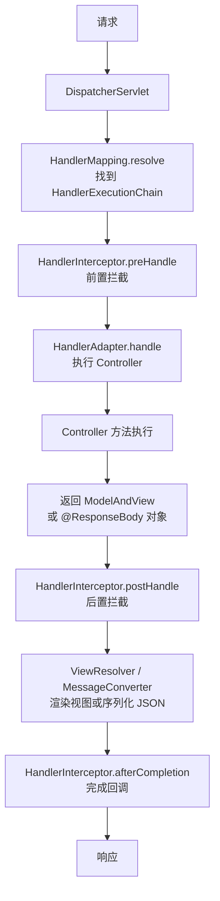

## 0. 前置必读与阅读警告（先读这一节）

> **警告：这是全模块最不建议跳级阅读的文档之一。** 如果还没有完成 Java SE 核心，@Autowired、BeanPostProcessor、动态代理与事务传播行为（REQUIRES_NEW）对你就是天书。请按顺序先读完：
>
> 1. 013 面向对象编程（多态与接口回调）；
> 2. 014 抽象类与接口、015 内部类（匿名内部类与代理的基础）；
> 3. 018 集合框架、029 注解与枚举、031 泛型详解（@Component/@Autowired 与 Repository 的语法前提）；
> 4. 067 原生 JDBC（先会底层数据访问）、071 设计模式（工厂模式对应 IoC，代理模式对应 AOP）。
>
> 推荐顺序：067 JDBC → 068-070 构建工具 → 071 设计模式 → 本篇。跳级阅读者请做好反复回查的准备。

## 1. 历史动机与背景

### 1.1 EJB 时代的痛点

2000 年代初，Java 企业级开发由 EJB（Enterprise JavaBeans）主导。EJB 2.x 的核心问题包括：

- **过度复杂**：一个实体 Bean 需要编写 4 个类与 2 个部署描述符。
- **强耦合容器**：业务代码必须继承 EJB 抽象类、实现容器接口，难以脱离容器测试。
- **部署繁琐**：需要打包 EAR、配置 ejb-jar.xml、启动重量级应用服务器（WebLogic、WebSphere）。
- **性能开销大**：远程调用、对象序列化、容器拦截器层层叠加。

Rod Johnson 在 2002 年出版的 *Expert One-on-One J2EE Design and Development* 一书中批判了 EJB 的复杂性，并提出了基于普通 Java 对象（POJO）的轻量级方案。这一思想催生了 Spring 框架。

### 1.2 Spring 的诞生

2003 年 6 月，Spring 框架 0.9 版本在 SourceForge 上发布。其核心理念是：

1. **POJO 编程模型**：业务代码不依赖框架 API，保持可测试性。
2. **IoC 容器**：组件依赖由容器注入，而非组件自己创建。
3. **AOP**：将横切关注点（日志、事务、安全）与业务逻辑分离。
4. **声明式编程**：通过配置或注解描述"做什么"，由框架实现"怎么做"。

### 1.3 Spring 的演进

| 版本 | 发布年份 | 核心特性 |
|------|----------|----------|
| Spring 1.0 | 2004 | IoC 容器、AOP、XML 配置 |
| Spring 2.0 | 2006 | 自定义 XML 命名空间、@AspectJ 支持 |
| Spring 2.5 | 2007 | 注解驱动（@Autowired、@Component） |
| Spring 3.0 | 2009 | Java 配置（@Configuration）、REST 支持 |
| Spring 4.0 | 2013 | Java 8 支持、WebSocket、泛型注入 |
| Spring 5.0 | 2017 | 响应式编程（WebFlux）、JDK 9+ |
| Spring 6.0 | 2022 | JDK 17+ 基线、Jakarta EE 9+ 迁移 |
| Spring Boot 3.0 | 2022 | 原生镜像支持、Jakarta EE 迁移 |

### 1.4 Spring Boot 的革命

2014 年发布的 Spring Boot 解决了 Spring 的"配置地狱"问题：

- **约定优于配置**：默认值合理，无需显式声明。
- **Starter 依赖**：`spring-boot-starter-web` 一行依赖引入完整 Web 栈。
- **内嵌容器**：Tomcat/Jetty/Undertow 内嵌于 JAR，`java -jar` 直接启动。
- **Actuator**：内置生产级监控端点。
- **自动配置**：基于 classpath 内容自动装配 Bean。

Spring Boot 让 Spring 应用的启动时间从分钟级降至秒级，部署从 WAR 改为可执行 JAR，推动了微服务与云原生的普及。

## 2. 形式化定义

### 2.1 IoC 容器的形式化模型

IoC 容器可形式化为三元组：

$$
IoC = \langle B, D, M \rangle
$$

其中：

- $B$：Bean 定义集合，$B = \{ b_i \mid b_i = \langle name, class, scope, props, deps \rangle \}$
- $D$：依赖关系图，$D \subseteq B \times B$，若 $(b_i, b_j) \in D$ 表示 $b_i$ 依赖 $b_j$
- $M$：Bean 工厂方法，$M : B \to Instance$

容器启动时构建 $D$（有向图），通过拓扑排序确定创建顺序，对每个 $b \in B$ 调用 $M(b)$ 生成实例并注入依赖。

### 2.2 依赖注入的形式化

依赖注入是 IoC 的具体实现机制，形式化为：

$$
inject(b_i, b_j) : \quad b_i.dep_j \leftarrow M(b_j)
$$

注入方式有三种：

1. **构造器注入**：$b_i = new(\text{class}, deps)$，依赖通过构造函数传入。
2. **Setter 注入**：$b_i.setDep_j(M(b_j))$，依赖通过 setter 方法注入。
3. **字段注入**：$b_i.dep_j = M(b_j)$，依赖通过反射直接赋值字段。

### 2.3 Bean 生命周期形式化

Bean 生命周期可形式化为状态机：

$$
Lifecycle : \quad s_0 \xrightarrow{instantiate} s_1 \xrightarrow{populate} s_2 \xrightarrow{aware} s_3 \xrightarrow{postBefore} s_4 \xrightarrow{init} s_5 \xrightarrow{postAfter} s_6 \xrightarrow{use} s_7 \xrightarrow{destroy} s_8
$$

各状态语义：

- $s_0$：未创建
- $s_1$：实例化完成（构造器已调用）
- $s_2$：属性填充完成（依赖已注入）
- $s_3$：Aware 接口回调完成
- $s_4$：BeanPostProcessor#postProcessBeforeInitialization 完成
- $s_5$：初始化方法（afterPropertiesSet / @PostConstruct）完成
- $s_6$：BeanPostProcessor#postProcessAfterInitialization 完成（AOP 代理在此生成）
- $s_7$：Bean 就绪，可被使用
- $s_8$：销毁完成

### 2.4 AOP 的形式化定义

AOP（Aspect-Oriented Programming）可形式化为：

$$
AOP = \langle J, P, A, W \rangle
$$

- $J$：JoinPoint 集合，程序执行中的可切入点（方法调用、字段访问、异常抛出等）
- $P$：Pointcut，$P \subseteq J$，匹配特定 JoinPoint 的谓词
- $A$：Advice，在匹配的 JoinPoint 处执行的动作（Before、After、Around）
- $W$：Weaving，将 Aspect 织入目标对象的过程

Spring AOP 仅支持方法级 JoinPoint，使用动态代理（JDK Proxy 或 CGLIB）在运行时织入。

### 2.5 事务传播行为形式化

事务传播行为定义了事务方法的嵌套语义：

$$
Propagation = \{ REQUIRED, REQUIRES\_NEW, NESTED, SUPPORTS, NOT\_SUPPORTED, NEVER, MANDATORY \}
$$

设外层事务为 $T_{outer}$，内层方法的事务为 $T_{inner}$：

- **REQUIRED**：$T_{inner} = T_{outer}$（若存在），否则新建。
- **REQUIRES_NEW**：$T_{inner}$ 始终新建，$T_{outer}$ 挂起。
- **NESTED**：$T_{inner}$ 在 $T_{outer}$ 中创建保存点，可独立回滚但不独立提交。
- **SUPPORTS**：$T_{inner} = T_{outer}$（若存在），否则无事务运行。
- **NOT_SUPPORTED**：$T_{inner}$ 无事务，$T_{outer}$ 挂起。
- **NEVER**：若 $T_{outer}$ 存在则抛异常。
- **MANDATORY**：若 $T_{outer}$ 不存在则抛异常。

## 3. 理论推导

### 3.1 IoC 容器的依赖图构建

#### 3.1.1 BeanDefinition 的注册

Spring 启动时扫描 classpath，对每个标注 `@Component` 的类创建 `BeanDefinition` 对象：

```java
// BeanDefinition 的核心字段（简化版）
public class GenericBeanDefinition implements BeanDefinition {
    private String beanClassName;        // Bean 类全名
    private String scope = SCOPE_SINGLETON; // 作用域
    private boolean lazyInit = false;    // 是否懒加载
    private ConstructorArgumentValues constructorArgumentValues; // 构造参数
    private MutablePropertyValues propertyValues; // 属性值
    private String[] dependsOn;          // 显式依赖
    // ... 其他字段
}
```

`BeanDefinition` 注册到 `DefaultListableBeanFactory.beanDefinitionMap`（ConcurrentHashMap）。

#### 3.1.2 依赖图的拓扑排序

`DefaultListableBeanFactory.preInstantiateSingletons()` 按依赖顺序创建 Bean：

1. 遍历所有非懒加载的 Bean 名称。
2. 对每个 Bean 调用 `getBean(name)`，触发创建。
3. `getBean` 调用 `doGetBean`，先递归创建依赖（`getBean(dep)`）。
4. 依赖创建完成后再创建当前 Bean。

若依赖图中存在环，则触发循环依赖处理（见 4.2）。

#### 3.1.3 创建过程的核心代码

```java
// DefaultListableBeanFactory.doGetBean 简化逻辑
protected <T> T doGetBean(String name, Class<T> requiredType) {
    // 1. 检查单例缓存
    Object bean = getSingleton(name, false);
    if (bean != null) {
        return (T) bean;
    }

    // 2. 递归创建依赖
    String[] dependsOn = mbd.getDependsOn();
    if (dependsOn != null) {
        for (String dep : dependsOn) {
            // 先创建依赖 Bean
            getBean(dep);
            // 注册依赖关系（用于循环依赖检测）
            registerDependentBean(dep, beanName);
        }
    }

    // 3. 创建 Bean 实例
    if (mbd.isSingleton()) {
        bean = createSingleton(beanName, mbd, args);
    } else if (mbd.isPrototype()) {
        bean = createPrototype(beanName, mbd, args);
    }

    return (T) bean;
}
```

### 3.2 循环依赖与三级缓存

#### 3.2.1 问题场景

```java
@Service
public class A {
    @Autowired private B b;  // A 依赖 B
}

@Service
public class B {
    @Autowired private A a;  // B 依赖 A
}
```

创建 A 时需要 B，创建 B 时又需要 A，形成死循环。

#### 3.2.2 三级缓存结构

Spring 使用三级缓存解决单例 Bean 的循环依赖：

```java
public class DefaultSingletonBeanRegistry {
    // 一级缓存：完整的单例 Bean（已初始化完成）
    private final Map<String, Object> singletonObjects = new ConcurrentHashMap<>(256);

    // 二级缓存：早期暴露的 Bean（已实例化，未完成属性填充）
    private final Map<String, Object> earlySingletonObjects = new HashMap<>(16);

    // 三级缓存：Bean 工厂（用于生成早期引用，支持 AOP）
    private final Map<String, ObjectFactory<?>> singletonFactories = new HashMap<>(16);
}
```

#### 3.2.3 解决流程

1. 创建 A，实例化后（属性未填充）将 A 的工厂放入三级缓存。
2. A 开始填充属性 B，触发 `getBean(B)`。
3. 创建 B，实例化后放入三级缓存。
4. B 填充属性 A，调用 `getSingleton(A)`：
   - 一级缓存查不到，进入二级缓存。
   - 二级缓存查不到，进入三级缓存。
   - 三级缓存找到 A 的工厂，调用工厂方法获取 A 的早期引用（可能是代理），放入二级缓存，从三级缓存移除。
5. B 拿到 A 的早期引用，完成属性填充，初始化完成，放入一级缓存。
6. A 继续填充属性 B，从一级缓存获取 B（已就绪），完成填充与初始化，放入一级缓存。

#### 3.2.4 三级缓存的作用

- **一级缓存**：存放完整 Bean，避免重复创建。
- **二级缓存**：存放早期 Bean，避免循环依赖中重复创建。
- **三级缓存**：存放 ObjectFactory，延迟 AOP 代理的生成时机。

为什么需要三级而非二级？当 Bean 需要 AOP 代理时，ObjectFactory 在被调用时才生成代理对象。若只有二级缓存，AOP 代理必须提前生成，违反"代理在初始化后生成"的设计原则。三级缓存使代理生成时机保持灵活。

#### 3.2.5 循环依赖的局限

Spring 的三级缓存方案**仅支持单例 Bean 的 setter 注入循环依赖**，以下情况无法解决：

- **构造器注入循环依赖**：构造器注入在实例化阶段就需要依赖，无法提前暴露早期引用。
- **prototype 作用域循环依赖**：prototype 每次创建新实例，无缓存。
- **@Async 标注的 Bean 循环依赖**：`@Async` 的代理在初始化后生成，与三级缓存机制冲突。

### 3.3 Bean 生命周期详解

#### 3.3.1 完整生命周期

```java
// Bean 生命周期的完整流程（伪代码）
public Object createBean(String beanName, RootBeanDefinition mbd) {
    // 阶段 1：实例化前的前置处理（InstantiationAwareBeanPostProcessor）
    Object wrappedBean = resolveBeforeInstantiation(beanName, mbd);
    if (wrappedBean != null) {
        return wrappedBean;  // 短路，跳过后续流程
    }

    // 阶段 2：实例化（调用构造器）
    BeanWrapper instance = createBeanInstance(beanName, mbd, args);

    // 阶段 3：属性填充前处理（InstantiationAwareBeanPostProcessor#postProcessAfterInstantiation）
    // 阶段 4：属性值解析与填充（@Autowired、@Value 在此注入）
    populateBean(beanName, mbd, instance);

    // 阶段 5：初始化
    wrappedBean = initializeBean(beanName, instance, mbd);
    return wrappedBean;
}

private Object initializeBean(String beanName, Object bean, RootBeanDefinition mbd) {
    // 阶段 5.1：Aware 接口回调
    invokeAwareMethods(beanName, bean);
    //  - BeanNameAware.setBeanName
    //  - BeanClassLoaderAware.setBeanClassLoader
    //  - BeanFactoryAware.setBeanFactory
    //  - ApplicationContextAware.setApplicationContext（通过 ApplicationContextAwareProcessor）

    // 阶段 5.2：BeanPostProcessor#postProcessBeforeInitialization
    //  - @PostConstruct 在此触发（CommonAnnotationBeanPostProcessor）
    //  - @Autowired 在此触发（部分场景）
    wrappedBean = applyBeanPostProcessorsBeforeInitialization(bean, beanName);

    // 阶段 5.3：初始化方法
    invokeInitMethods(beanName, wrappedBean, mbd);
    //  - InitializingBean.afterPropertiesSet()
    //  - 自定义 init-method

    // 阶段 5.4：BeanPostProcessor#postProcessAfterInitialization
    //  - AOP 代理在此生成（AbstractAutoProxyCreator）
    wrappedBean = applyBeanPostProcessorsAfterInitialization(wrappedBean, beanName);

    return wrappedBean;
}
```

#### 3.3.2 销毁流程

容器关闭时，对每个单例 Bean 执行销毁：

1. `@PreDestroy` 注解方法（由 `InitDestroyAnnotationBeanPostProcessor` 处理）
2. `DisposableBean.destroy()` 接口方法
3. 自定义 `destroy-method`

### 3.4 AOP 实现原理

#### 3.4.1 动态代理的选择

Spring AOP 支持两种代理方式：

- **JDK 动态代理**：基于接口，目标类必须实现至少一个接口。`Proxy.newProxyInstance` 生成代理类。
- **CGLIB 代理**：基于继承，生成目标类的子类。无法代理 final 类与 final 方法。

Spring 默认策略：

- 目标类实现接口 → 使用 JDK 代理
- 目标类无接口 → 使用 CGLIB
- 显式 `proxyTargetClass=true` → 强制 CGLIB（Spring Boot 2.x 起默认）

#### 3.4.2 JDK 动态代理示例

```java
// JDK 动态代理核心代码
public class JdkProxyFactory implements InvocationHandler {
    private final Object target;

    public JdkProxyFactory(Object target) {
        this.target = target;
    }

    public Object getProxy() {
        return Proxy.newProxyInstance(
            target.getClass().getClassLoader(),
            target.getClass().getInterfaces(),
            this
        );
    }

    @Override
    public Object invoke(Object proxy, Method method, Object[] args) throws Throwable {
        // 前置通知
        System.out.println("[Before] 调用方法: " + method.getName());
        try {
            Object result = method.invoke(target, args);  // 执行目标方法
            // 返回通知
            System.out.println("[AfterReturning] 返回值: " + result);
            return result;
        } catch (Throwable e) {
            // 异常通知
            System.out.println("[AfterThrowing] 异常: " + e.getMessage());
            throw e;
        } finally {
            // 后置通知
            System.out.println("[After] 方法执行结束");
        }
    }
}
```

#### 3.4.3 CGLIB 代理示例

```java
// CGLIB 代理核心代码
public class CglibProxyFactory implements MethodInterceptor {
    public Object getProxy(Class<?> clazz) {
        Enhancer enhancer = new Enhancer();
        enhancer.setSuperclass(clazz);
        enhancer.setCallback(this);
        return enhancer.create();
    }

    @Override
    public Object intercept(Object obj, Method method, Object[] args,
                             MethodProxy proxy) throws Throwable {
        System.out.println("[CGLIB Before] " + method.getName());
        Object result = proxy.invokeSuper(obj, args);  // 调用父类（原方法）
        System.out.println("[CGLIB After] " + method.getName());
        return result;
    }
}
```

#### 3.4.4 Spring AOP 的织入时机

Spring AOP 在 `BeanPostProcessor#postProcessAfterInitialization` 阶段织入代理：

```java
// AbstractAutoProxyCreator 简化逻辑
public abstract class AbstractAutoProxyCreator extends ProxyProcessorSupport {
    @Override
    public Object postProcessAfterInitialization(Object bean, String beanName) {
        if (this.advisedBeans.containsKey(cacheKey)) {
            return wrapIfNecessary(bean, beanName, cacheKey);
        }
        return bean;
    }

    protected Object wrapIfNecessary(Object bean, String beanName, String cacheKey) {
        // 1. 查找匹配的 Advisor
        Object[] specificInterceptors = getAdvicesAndAdvisorsForBean(bean.getClass(), beanName, bean);
        if (specificInterceptors != DO_NOT_PROXY) {
            // 2. 创建代理
            Object proxy = createProxy(bean.getClass(), beanName, specificInterceptors, new SingletonTargetSource(bean));
            this.proxyTypes.put(cacheKey, proxy.getClass());
            return proxy;
        }
        return bean;
    }
}
```

#### 3.4.5 Advice 执行时序

```java
// @Around 通知的执行模型
@Around("execution(* com.example.service.*.*(..))")
public Object aroundAdvice(ProceedingJoinPoint pjp) throws Throwable {
    // @Before 逻辑（在 proceed 前）
    System.out.println("Around - before");
    try {
        Object result = pjp.proceed();  // 执行目标方法
        // @AfterReturning 逻辑（在 proceed 后，正常返回时）
        System.out.println("Around - after returning");
        return result;
    } catch (Throwable e) {
        // @AfterThrowing 逻辑（异常时）
        System.out.println("Around - after throwing");
        throw e;
    } finally {
        // @After 逻辑（无论是否异常）
        System.out.println("Around - after");
    }
}
```

多个 Aspect 的执行顺序由 `@Order` 决定，数值小的先执行（外层）。

### 3.5 Spring 事务原理

#### 3.5.1 声明式事务的实现

`@Transactional` 基于 AOP 代理实现。Spring 创建事务代理的核心是 `TransactionInterceptor`：

```java
// TransactionInterceptor 简化逻辑
public class TransactionInterceptor extends TransactionAspectSupport {
    @Override
    public Object invoke(MethodInvocation invocation) throws Throwable {
        // 1. 获取事务属性（@Transactional 配置）
        TransactionAttribute txAttr = getTransactionAttribute(invocation.getMethod(), targetClass);

        // 2. 获取事务管理器
        PlatformTransactionManager tm = determineTransactionManager(txAttr);

        // 3. 创建事务（根据传播行为决定是否新建）
        TransactionInfo txInfo = createTransactionIfNecessary(tm, txAttr, methodIdentification);

        Object retVal;
        try {
            // 4. 执行目标方法
            retVal = invocation.proceed();
        } catch (Throwable ex) {
            // 5. 异常处理：根据 rollbackFor 判断是否回滚
            completeTransactionAfterThrowing(txInfo, ex);
            throw ex;
        } finally {
            cleanupTransactionInfo(txInfo);
        }

        // 6. 提交事务
        commitTransactionAfterReturning(txInfo);
        return retVal;
    }
}
```

#### 3.5.2 事务传播行为的实现

```java
// AbstractPlatformTransactionManager.getTransaction 简化逻辑
public TransactionStatus getTransaction(TransactionDefinition definition) {
    Object transaction = doGetTransaction();  // 获取当前线程的事务（基于 ThreadLocal）

    if (isExistingTransaction(transaction)) {
        // 已存在事务，根据传播行为处理
        return handleExistingTransaction(definition, transaction);
    }

    // 无现有事务
    switch (definition.getPropagationBehavior()) {
        case PROPAGATION_MANDATORY:
            throw new IllegalTransactionStateException("Transaction required");
        case PROPAGATION_REQUIRED:
        case PROPAGATION_REQUIRES_NEW:
        case PROPAGATION_NESTED:
            // 新建事务
            return startTransaction(definition, transaction, false);
        default:
            // SUPPORTS、NOT_SUPPORTED、NEVER：无事务运行
            return prepareTransactionStatus(definition, null, false, false, false);
    }
}
```

#### 3.5.3 事务失效的根因

事务失效的根本原因都是"未通过代理对象调用"：

1. **自调用**：`this.method()` 而非 `proxy.method()`，`this` 是目标对象而非代理。
2. **非 public 方法**：Spring AOP 默认仅代理 public 方法。
3. **final / static 方法**：无法被 CGLIB 覆盖或 JDK 代理。
4. **异常被吞**：try-catch 吞掉异常，事务管理器收不到异常信号。
5. **异常类型不匹配**：默认仅回滚 `RuntimeException` 与 `Error`，checked 异常需 `rollbackFor` 指定。
6. **多线程**：事务基于 ThreadLocal，子线程无法继承事务上下文。

### 3.6 Spring MVC 请求处理流程

#### 3.6.1 核心组件

- `DispatcherServlet`：前端控制器，所有请求入口。
- `HandlerMapping`：映射请求到 Handler（Controller 方法）。
- `HandlerAdapter`：适配不同类型的 Handler。
- `ViewResolver`：解析视图名到 View（前后端分离时由 MessageConverter 替代）。
- `HandlerInterceptor`：拦截器，在 Handler 执行前后插入逻辑。

#### 3.6.2 请求处理流程



#### 3.6.3 关键源码

```java
// DispatcherServlet.doDispatch 简化逻辑
protected void doDispatch(HttpServletRequest request, HttpServletResponse response) {
    HandlerExecutionChain mappedHandler = null;
    try {
        // 1. 查找 Handler
        mappedHandler = getHandler(request);
        if (mappedHandler == null) {
            noHandlerFound(request, response);
            return;
        }

        // 2. 查找 HandlerAdapter
        HandlerAdapter ha = getHandlerAdapter(mappedHandler.getHandler());

        // 3. 前置拦截
        if (!mappedHandler.applyPreHandle(request, response)) {
            return;
        }

        // 4. 执行 Handler
        ModelAndView mv = ha.handle(request, response, mappedHandler.getHandler());

        // 5. 后置拦截
        mappedHandler.applyPostHandle(request, response, mv);

        // 6. 渲染视图
        processDispatchResult(request, response, mappedHandler, mv, null);
    } catch (Exception ex) {
        // 7. 异常处理
        processDispatchResult(request, response, mappedHandler, null, ex);
    } finally {
        // 8. 完成回调
        if (mappedHandler != null) {
            mappedHandler.triggerAfterCompletion(request, response, null);
        }
    }
}
```

### 3.7 Spring Boot 自动配置

#### 3.7.1 @SpringBootApplication 的组成

```java
@SpringBootConfiguration  // 等同于 @Configuration，标记主配置类
@EnableAutoConfiguration  // 开启自动配置
@ComponentScan            // 扫描当前包及子包
public @interface SpringBootApplication {
    // ...
}
```

#### 3.7.2 @EnableAutoConfiguration 的原理

`@EnableAutoConfiguration` 通过 `@Import(AutoConfigurationImportSelector.class)` 加载自动配置类：

```java
public class AutoConfigurationImportSelector implements DeferredImportSelector {
    @Override
    public String[] selectImports(AnnotationMetadata annotationMetadata) {
        // 读取 META-INF/spring/org.springframework.boot.autoconfigure.AutoConfiguration.imports
        // （Spring Boot 2.7+ 文件名）或
        // META-INF/spring.factories（旧版）
        List<String> configurations = getCandidateConfigurations(annotationMetadata, attributes);
        // 去重、过滤
        return configurations.toArray(new String[0]);
    }
}
```

每个自动配置类通过 `@Conditional` 系列注解决定是否生效：

- `@ConditionalOnClass`：classpath 存在指定类时生效
- `@ConditionalOnMissingBean`：容器中不存在指定 Bean 时生效
- `@ConditionalOnProperty`：配置属性满足条件时生效
- `@ConditionalOnWebApplication`：Web 应用时生效

#### 3.7.3 自动配置示例

```java
// DataSourceAutoConfiguration 简化版
@Configuration(proxyBeanMethods = false)
@ConditionalOnClass({ DataSource.class, EmbeddedDatabaseType.class })
@ConditionalOnMissingBean(type = "io.r2dbc.spi.ConnectionFactory")
@EnableConfigurationProperties(DataSourceProperties.class)
@Import({ DataSourcePoolMetadataProvidersConfiguration.class, DataSourceInitializationConfiguration.class })
public class DataSourceAutoConfiguration {

    @Configuration(proxyBeanMethods = false)
    @ConditionalOnMissingBean({ DataSource.class, XADataSource.class })
    @Import({ DataSourceConfiguration.Hikari.class, DataSourceConfiguration.Tomcat.class })
    protected static class PooledDataSourceConfiguration {
    }
}
```

逻辑：当 classpath 存在 `DataSource` 类、容器中无 `DataSource` Bean 时，根据 classpath 中的连接池（HikariCP 优先）自动配置数据源。

## 4. 代码示例

### 4.1 IoC 容器基础：XML 配置与注解配置对比

```java
import org.springframework.context.annotation.AnnotationConfigApplicationContext;
import org.springframework.context.support.ClassPathXmlApplicationContext;

/**
 * IoC 容器基础示例
 * 演示 XML 配置与注解配置两种方式
 */
public class IocContainerDemo {

    public static void main(String[] args) {
        // 方式一：XML 配置
        ClassPathXmlApplicationContext xmlContext =
            new ClassPathXmlApplicationContext("applicationContext.xml");
        UserService userService1 = xmlContext.getBean(UserService.class);
        userService1.saveUser("张三");
        xmlContext.close();

        // 方式二：注解配置（推荐）
        AnnotationConfigApplicationContext annotationContext =
            new AnnotationConfigApplicationContext(AppConfig.class);
        UserService userService2 = annotationContext.getBean(UserService.class);
        userService2.saveUser("李四");
        annotationContext.close();
    }
}

/**
 * Java 配置类
 * 替代传统的 XML 配置文件
 */
@Configuration
@ComponentScan("com.example")
public class AppConfig {

    /**
     * 声明一个 Bean，等价于 <bean id="dateFormatter" class="java.text.SimpleDateFormat"/>
     */
    @Bean
    public SimpleDateFormat dateFormatter() {
        return new SimpleDateFormat("yyyy-MM-dd HH:mm:ss");
    }
}

/**
 * 用户服务类
 * 使用 @Service 标记为 Service 层组件
 */
@Service
public class UserService {
    private final UserRepository userRepository;
    private final SimpleDateFormat dateFormatter;

    /**
     * 构造器注入（推荐方式）
     * 优点：不可变、非空、易测试
     */
    @Autowired
    public UserService(UserRepository userRepository, SimpleDateFormat dateFormatter) {
        this.userRepository = userRepository;
        this.dateFormatter = dateFormatter;
    }

    public void saveUser(String name) {
        String timestamp = dateFormatter.format(new Date());
        System.out.printf("[%s] 保存用户: %s%n", timestamp, name);
        userRepository.insert(name);
    }
}

@Repository
public class UserRepository {
    public void insert(String name) {
        System.out.println("数据库插入: " + name);
    }
}
```

### 4.2 三种依赖注入方式对比

```java
import org.springframework.beans.factory.annotation.Autowired;
import org.springframework.beans.factory.annotation.Qualifier;
import javax.annotation.Resource;
import javax.inject.Inject;

/**
 * 三种依赖注入方式对比
 * 演示构造器注入、Setter 注入、字段注入
 */
@Service
public class InjectionDemo {

    // ========== 字段注入（不推荐）==========
    // 优点：简洁
    // 缺点：无法 final、隐藏依赖、难以测试、循环依赖检测失效
    @Autowired
    @Qualifier("primaryDataSource")
    private DataSource fieldDataSource;

    // ========== Setter 注入（可选依赖时使用）==========
    private DataSource setterDataSource;

    @Autowired(required = false)
    public void setSetterDataSource(DataSource setterDataSource) {
        this.setterDataSource = setterDataSource;
    }

    // ========== 构造器注入（推荐）==========
    private final DataSource constructorDataSource;
    private final UserRepository userRepository;

    /**
     * 构造器注入
     * Spring 4.3+ 单构造器可省略 @Autowired
     */
    public InjectionDemo(DataSource constructorDataSource, UserRepository userRepository) {
        this.constructorDataSource = constructorDataSource;
        this.userRepository = userRepository;
    }
}

/**
 * @Resource（JSR-250）与 @Autowired（Spring）对比
 */
@Service
public class ResourceVsAutowiredDemo {

    // @Autowired 默认按类型注入，配合 @Qualifier 按名称
    @Autowired
    @Qualifier("mysqlDataSource")
    private DataSource dataSource1;

    // @Resource 默认按名称注入，找不到再按类型
    @Resource(name = "mysqlDataSource")
    private DataSource dataSource2;

    // @Inject（JSR-330）与 @Autowired 类似，按类型注入
    @Inject
    private DataSource dataSource3;
}
```

### 4.3 Bean 生命周期监听

```java
import org.springframework.beans.BeansException;
import org.springframework.beans.factory.BeanFactoryAware;
import org.springframework.beans.factory.BeanNameAware;
import org.springframework.beans.factory.InitializingBean;
import org.springframework.beans.factory.config.BeanPostProcessor;
import org.springframework.context.ApplicationContextAware;
import org.springframework.beans.factory.BeanFactory;

import javax.annotation.PostConstruct;
import javax.annotation.PreDestroy;

/**
 * Bean 生命周期演示
 * 实现各种 Aware 接口与初始化回调，观察执行顺序
 */
public class LifecycleBean implements BeanNameAware, BeanFactoryAware,
        ApplicationContextAware, InitializingBean {

    private String beanName;
    private String state;

    public LifecycleBean() {
        System.out.println("1. 构造器调用 - 实例化");
        this.state = "created";
    }

    /**
     * Setter 方法用于属性注入
     */
    public void setState(String state) {
        System.out.println("2. 属性填充 - setState");
        this.state = state;
    }

    @Override
    public void setBeanName(String name) {
        System.out.println("3. BeanNameAware.setBeanName: " + name);
        this.beanName = name;
    }

    @Override
    public void setBeanFactory(BeanFactory beanFactory) throws BeansException {
        System.out.println("4. BeanFactoryAware.setBeanFactory");
    }

    @Override
    public void setApplicationContext(ApplicationContext ctx) throws BeansException {
        System.out.println("5. ApplicationContextAware.setApplicationContext");
    }

    @PostConstruct
    public void postConstruct() {
        System.out.println("6. @PostConstruct - 初始化前");
    }

    @Override
    public void afterPropertiesSet() throws Exception {
        System.out.println("7. InitializingBean.afterPropertiesSet - 初始化");
    }

    public void customInitMethod() {
        System.out.println("8. customInitMethod - 自定义初始化方法");
    }

    @PreDestroy
    public void preDestroy() {
        System.out.println("9. @PreDestroy - 销毁前");
    }

    public void customDestroyMethod() {
        System.out.println("10. customDestroyMethod - 自定义销毁方法");
    }
}

/**
 * BeanPostProcessor 实现
 * 可在所有 Bean 的初始化前后插入逻辑
 */
@Component
public class LifecycleBeanPostProcessor implements BeanPostProcessor {

    @Override
    public Object postProcessBeforeInitialization(Object bean, String beanName) throws BeansException {
        if (bean instanceof LifecycleBean) {
            System.out.println("BPP Before - " + beanName);
        }
        return bean;
    }

    @Override
    public Object postProcessAfterInitialization(Object bean, String beanName) throws BeansException {
        if (bean instanceof LifecycleBean) {
            System.out.println("BPP After - " + beanName + "（AOP 代理在此生成）");
        }
        return bean;
    }
}
```

### 4.4 AOP 切面实现

```java
import org.aspectj.lang.ProceedingJoinPoint;
import org.aspectj.lang.annotation.*;
import org.aspectj.lang.JoinPoint;
import org.springframework.stereotype.Component;

/**
 * 日志切面
 * 记录 Service 层方法的调用与执行时间
 */
@Aspect
@Component
public class LoggingAspect {

    /**
     * 切点定义：匹配 com.example.service 包下所有类的所有方法
     */
    @Pointcut("execution(* com.example.service..*.*(..))")
    public void serviceLayerPointcut() {}

    /**
     * 前置通知：方法执行前
     */
    @Before("serviceLayerPointcut()")
    public void beforeAdvice(JoinPoint joinPoint) {
        String methodName = joinPoint.getSignature().getName();
        Object[] args = joinPoint.getArgs();
        System.out.printf("[Before] 方法: %s, 参数: %s%n", methodName, java.util.Arrays.toString(args));
    }

    /**
     * 后置通知：方法正常返回后
     */
    @AfterReturning(pointcut = "serviceLayerPointcut()", returning = "result")
    public void afterReturningAdvice(JoinPoint joinPoint, Object result) {
        String methodName = joinPoint.getSignature().getName();
        System.out.printf("[AfterReturning] 方法: %s, 返回值: %s%n", methodName, result);
    }

    /**
     * 异常通知：方法抛出异常后
     */
    @AfterThrowing(pointcut = "serviceLayerPointcut()", throwing = "ex")
    public void afterThrowingAdvice(JoinPoint joinPoint, Exception ex) {
        String methodName = joinPoint.getSignature().getName();
        System.err.printf("[AfterThrowing] 方法: %s, 异常: %s%n", methodName, ex.getMessage());
    }

    /**
     * 最终通知：方法执行后（无论是否异常）
     */
    @After("serviceLayerPointcut()")
    public void afterAdvice(JoinPoint joinPoint) {
        String methodName = joinPoint.getSignature().getName();
        System.out.printf("[After] 方法: %s 执行结束%n", methodName);
    }

    /**
     * 环绕通知：完全包裹方法执行，功能最强
     * 可控制是否执行目标方法、修改参数、修改返回值
     */
    @Around("serviceLayerPointcut()")
    public Object aroundAdvice(ProceedingJoinPoint pjp) throws Throwable {
        String methodName = pjp.getSignature().getName();
        long start = System.currentTimeMillis();
        try {
            System.out.printf("[Around-Before] %s 开始%n", methodName);
            Object result = pjp.proceed();  // 执行目标方法
            long elapsed = System.currentTimeMillis() - start;
            System.out.printf("[Around-After] %s 完成, 耗时 %dms%n", methodName, elapsed);
            return result;
        } catch (Throwable e) {
            long elapsed = System.currentTimeMillis() - start;
            System.err.printf("[Around-Throw] %s 异常, 耗时 %dms: %s%n", methodName, elapsed, e.getMessage());
            throw e;
        }
    }
}

/**
 * 性能监控切面
 * 使用 @Order 控制多个切面的执行顺序
 */
@Aspect
@Component
@Order(1)  // 数值小的先执行（外层）
public class PerformanceAspect {

    @Around("@annotation(Monitored)")
    public Object monitor(ProceedingJoinPoint pjp) throws Throwable {
        long start = System.nanoTime();
        try {
            return pjp.proceed();
        } finally {
            long elapsed = (System.nanoTime() - start) / 1_000_000;
            if (elapsed > 100) {
                System.err.printf("慢方法: %s 耗时 %dms%n", pjp.getSignature().getName(), elapsed);
            }
        }
    }
}

/**
 * 自定义注解：标记需要监控的方法
 */
@Target(ElementType.METHOD)
@Retention(RetentionPolicy.RUNTIME)
public @interface Monitored {}
```

### 4.5 声明式事务

```java
import org.springframework.stereotype.Service;
import org.springframework.transaction.annotation.Transactional;
import org.springframework.transaction.annotation.Propagation;
import org.springframework.transaction.annotation.Isolation;

/**
 * 转账服务
 * 演示声明式事务的使用与传播行为
 */
@Service
public class TransferService {

    private final AccountRepository accountRepository;
    private final LogService logService;

    public TransferService(AccountRepository accountRepository, LogService logService) {
        this.accountRepository = accountRepository;
        this.logService = logService;
    }

    /**
     * 转账主方法
     * @Transactional 参数说明：
     *   - propagation: 事务传播行为
     *   - isolation: 事务隔离级别
     *   - timeout: 事务超时时间（秒）
     *   - readOnly: 是否只读事务（优化提示）
     *   - rollbackFor: 触发回滚的异常类型
     *   - noRollbackFor: 不触发回滚的异常类型
     */
    @Transactional(
        propagation = Propagation.REQUIRED,
        isolation = Isolation.READ_COMMITTED,
        timeout = 30,
        rollbackFor = { BusinessException.class, RuntimeException.class }
    )
    public void transfer(Long fromId, Long toId, BigDecimal amount) {
        Account from = accountRepository.findById(fromId)
            .orElseThrow(() -> new BusinessException("付款账户不存在"));
        Account to = accountRepository.findById(toId)
            .orElseThrow(() -> new BusinessException("收款账户不存在"));

        if (from.getBalance().compareTo(amount) < 0) {
            throw new BusinessException("余额不足");
        }

        from.setBalance(from.getBalance().subtract(amount));
        to.setBalance(to.getBalance().add(amount));

        accountRepository.save(from);
        accountRepository.save(to);

        // 调用日志服务（REQUIRES_NEW 独立事务）
        logService.recordTransferLog(fromId, toId, amount);
    }
}

/**
 * 日志服务
 * 使用 REQUIRES_NEW 独立事务，即使主事务回滚，日志仍保存
 */
@Service
public class LogService {

    private final LogRepository logRepository;

    public LogService(LogRepository logRepository) {
        this.logRepository = logRepository;
    }

    @Transactional(propagation = Propagation.REQUIRES_NEW)
    public void recordTransferLog(Long fromId, Long toId, BigDecimal amount) {
        TransferLog log = new TransferLog();
        log.setFromId(fromId);
        log.setToId(toId);
        log.setAmount(amount);
        log.setTimestamp(LocalDateTime.now());
        logRepository.save(log);
    }
}

/**
 * 自定义业务异常
 * 继承 RuntimeException，默认触发事务回滚
 */
public class BusinessException extends RuntimeException {
    public BusinessException(String message) {
        super(message);
    }
}
```

### 4.6 Spring MVC RESTful 接口

```java
import org.springframework.http.ResponseEntity;
import org.springframework.web.bind.annotation.*;
import org.springframework.validation.annotation.Validated;
import javax.validation.Valid;
import javax.validation.constraints.Min;
import java.util.List;

/**
 * 用户管理 RESTful 接口
 * 演示标准 CRUD、参数校验、异常处理、响应封装
 */
@RestController
@RequestMapping("/api/v1/users")
@Validated
public class UserController {

    private final UserService userService;

    public UserController(UserService userService) {
        this.userService = userService;
    }

    /**
     * 创建用户
     * POST /api/v1/users
     */
    @PostMapping
    public ResponseEntity<UserDTO> createUser(@Valid @RequestBody CreateUserRequest request) {
        UserDTO user = userService.createUser(request);
        return ResponseEntity.ok(user);
    }

    /**
     * 查询用户
     * GET /api/v1/users/{id}
     */
    @GetMapping("/{id}")
    public ResponseEntity<UserDTO> getUser(
            @PathVariable @Min(1) Long id) {
        UserDTO user = userService.getUserById(id);
        return ResponseEntity.ok(user);
    }

    /**
     * 查询用户列表（分页）
     * GET /api/v1/users?page=1&size=20
     */
    @GetMapping
    public ResponseEntity<Page<UserDTO>> listUsers(
            @RequestParam(defaultValue = "1") int page,
            @RequestParam(defaultValue = "20") int size) {
        Page<UserDTO> users = userService.listUsers(page, size);
        return ResponseEntity.ok(users);
    }

    /**
     * 更新用户
     * PUT /api/v1/users/{id}
     */
    @PutMapping("/{id}")
    public ResponseEntity<UserDTO> updateUser(
            @PathVariable Long id,
            @Valid @RequestBody UpdateUserRequest request) {
        UserDTO user = userService.updateUser(id, request);
        return ResponseEntity.ok(user);
    }

    /**
     * 删除用户
     * DELETE /api/v1/users/{id}
     */
    @DeleteMapping("/{id}")
    public ResponseEntity<Void> deleteUser(@PathVariable Long id) {
        userService.deleteUser(id);
        return ResponseEntity.noContent().build();
    }
}

/**
 * 全局异常处理器
 * 统一处理 Controller 抛出的异常，返回标准错误格式
 */
@RestControllerAdvice
public class GlobalExceptionHandler {

    @ExceptionHandler(BusinessException.class)
    public ResponseEntity<ErrorResponse> handleBusiness(BusinessException ex) {
        ErrorResponse error = new ErrorResponse("BIZ_ERROR", ex.getMessage());
        return ResponseEntity.badRequest().body(error);
    }

    @ExceptionHandler(MethodArgumentNotValidException.class)
    public ResponseEntity<ErrorResponse> handleValidation(MethodArgumentNotValidException ex) {
        String message = ex.getBindingResult().getFieldErrors().stream()
            .map(e -> e.getField() + ": " + e.getDefaultMessage())
            .collect(Collectors.joining("; "));
        ErrorResponse error = new ErrorResponse("VALIDATION_ERROR", message);
        return ResponseEntity.badRequest().body(error);
    }

    @ExceptionHandler(Exception.class)
    public ResponseEntity<ErrorResponse> handleGeneric(Exception ex) {
        ErrorResponse error = new ErrorResponse("INTERNAL_ERROR", "服务器内部错误");
        return ResponseEntity.status(500).body(error);
    }
}

/**
 * 标准错误响应
 */
@Data
@AllArgsConstructor
public class ErrorResponse {
    private String code;
    private String message;
}
```

### 4.7 自定义 Spring Boot Starter

```java
import org.springframework.boot.autoconfigure.condition.ConditionalOnClass;
import org.springframework.boot.autoconfigure.condition.ConditionalOnMissingBean;
import org.springframework.boot.autoconfigure.condition.ConditionalOnProperty;
import org.springframework.boot.context.properties.EnableConfigurationProperties;
import org.springframework.context.annotation.Bean;
import org.springframework.context.annotation.Configuration;

/**
 * 自定义 Starter 的自动配置类
 * 示例：一个短信服务 Starter
 */
@Configuration
@ConditionalOnClass(SmsService.class)
@EnableConfigurationProperties(SmsProperties.class)
@ConditionalOnProperty(prefix = "sms", name = "enabled", havingValue = "true", matchIfMissing = true)
public class SmsAutoConfiguration {

    /**
     * 注册 SmsService Bean
     * 当容器中不存在该 Bean 时才创建
     */
    @Bean
    @ConditionalOnMissingBean
    public SmsService smsService(SmsProperties properties) {
        SmsService service = new SmsService();
        service.setAccessKeyId(properties.getAccessKeyId());
        service.setAccessKeySecret(properties.getAccessKeySecret());
        service.setSignName(properties.getSignName());
        service.setEndpoint(properties.getEndpoint());
        return service;
    }
}

/**
 * 配置属性类
 * 绑定 application.yml 中 sms.* 的配置
 */
@ConfigurationProperties(prefix = "sms")
public class SmsProperties {
    private boolean enabled = true;
    private String accessKeyId;
    private String accessKeySecret;
    private String signName;
    private String endpoint = "https://sms.aliyuncs.com";

    // getter / setter 省略
}

/**
 * 短信服务
 */
public class SmsService {
    private String accessKeyId;
    private String accessKeySecret;
    private String signName;
    private String endpoint;

    public void send(String phone, String templateCode, String params) {
        System.out.printf("发送短信到 %s: 模板=%s, 参数=%s%n", phone, templateCode, params);
        // 实际调用阿里云/腾讯云短信 API
    }

    // getter / setter 省略
}
```

在 `src/main/resources/META-INF/spring/org.springframework.boot.autoconfigure.AutoConfiguration.imports` 中注册：

```
com.example.sms.SmsAutoConfiguration
```

### 4.8 自定义 BeanPostProcessor 实现日志埋点

```java
import org.springframework.beans.BeansException;
import org.springframework.beans.factory.config.BeanPostProcessor;
import org.springframework.stereotype.Component;
import java.lang.reflect.Proxy;
import java.util.Arrays;

/**
 * 自定义 BeanPostProcessor
 * 为所有 Service 层 Bean 自动添加方法调用日志
 */
@Component
public class ServiceLoggingBeanPostProcessor implements BeanPostProcessor {

    @Override
    public Object postProcessAfterInitialization(Object bean, String beanName) throws BeansException {
        // 仅对 @Service 注解的 Bean 生效
        if (bean.getClass().isAnnotationPresent(Service.class)
                || bean.getClass().getName().contains("Service")) {
            return createLoggingProxy(bean);
        }
        return bean;
    }

    /**
     * 创建日志代理
     */
    @SuppressWarnings("unchecked")
    private <T> T createLoggingProxy(T target) {
        Class<?>[] interfaces = target.getClass().getInterfaces();
        if (interfaces.length == 0) {
            // 无接口，返回原对象（实际项目可用 CGLIB）
            return target;
        }

        return (T) Proxy.newProxyInstance(
            target.getClass().getClassLoader(),
            interfaces,
            (proxy, method, args) -> {
                long start = System.currentTimeMillis();
                String methodName = target.getClass().getSimpleName() + "." + method.getName();
                try {
                    System.out.printf("[Service-Call] %s args=%s%n", methodName, Arrays.toString(args));
                    Object result = method.invoke(target, args);
                    long elapsed = System.currentTimeMillis() - start;
                    System.out.printf("[Service-Done] %s %dms%n", methodName, elapsed);
                    return result;
                } catch (Exception e) {
                    long elapsed = System.currentTimeMillis() - start;
                    System.err.printf("[Service-Error] %s %dms %s%n", methodName, elapsed, e.getMessage());
                    throw e;
                }
            }
        );
    }
}
```

## 5. 对比分析

### 5.1 IoC 容器实现对比

| 特性 | BeanFactory | ApplicationContext |
|------|-------------|---------------------|
| 加载时机 | 懒加载（getBean 时创建） | 预加载（启动时创建所有非懒加载 Bean） |
| 国际化 | 不支持 | 支持（MessageSource） |
| 事件机制 | 不支持 | 支持（ApplicationEvent） |
| 资源访问 | 不支持 | 支持（ResourceLoader） |
| AOP 集成 | 需手动配置 | 自动集成 |
| 注解支持 | 需手动添加 BeanPostProcessor | 自动开启 |
| 性能 | 启动快 | 启动稍慢 |
| 适用场景 | 资源受限环境 | 企业级应用（默认选择） |

### 5.2 依赖注入方式对比

| 注入方式 | 可变性 | 非空保证 | 循环依赖 | 测试性 | 推荐度 |
|----------|--------|----------|----------|--------|--------|
| 构造器注入 | final（不可变） | 编译期保证 | 不支持（启动失败） | 优 | 推荐 |
| Setter 注入 | 可变 | 运行时可能空 | 支持 | 良 | 可选依赖时使用 |
| 字段注入 | 可变 | 运行时可能空 | 支持 | 差 | 不推荐 |

### 5.3 AOP 实现对比

| 特性 | Spring AOP | AspectJ |
|------|-----------|---------|
| 织入时机 | 运行时（动态代理） | 编译时 / 类加载时 |
| JoinPoint | 仅方法 | 方法、字段、构造器、静态初始化 |
| 性能 | 略有代理开销 | 无运行时开销 |
| 配置 | 简单 | 需 ajc 编译器或 LTW |
| 适用场景 | 企业应用（事务、日志） | 性能敏感、细粒度切面 |

### 5.4 代理方式对比

| 特性 | JDK 动态代理 | CGLIB 代理 |
|------|-------------|-----------|
| 原理 | 接口 + Proxy | 继承 + 字节码生成 |
| 目标要求 | 必须实现接口 | 任意类（final 除外） |
| 性能 | 创建快、调用稍慢 | 创建慢、调用稍快 |
| Spring 默认 | 接口存在时使用 | 无接口或强制时使用 |
| Spring Boot 2.x | 默认 CGLIB | 默认 CGLIB |

### 5.5 事务管理方式对比

| 特性 | 编程式事务 | 声明式事务 |
|------|-----------|-----------|
| 实现 | TransactionTemplate / PlatformTransactionManager | @Transactional 注解 |
| 灵活性 | 高（可精确控制范围） | 低（方法或类级别） |
| 侵入性 | 有（业务代码含事务 API） | 无（业务代码无感知） |
| 可读性 | 差 | 优 |
| 适用场景 | 细粒度控制、复杂事务边界 | 常规业务（90% 场景） |

### 5.6 Spring Web 框架对比

| 框架 | 编程模型 | 并发模型 | 适用场景 |
|------|---------|---------|---------|
| Spring MVC | Servlet（阻塞） | 一请求一线程 | 传统 CRUD 应用 |
| WebFlux | Reactive（非阻塞） | 少量线程 + EventLoop | 高并发 I/O 密集 |
| Spring GraphQL | GraphQL | 依赖底层 | 灵活查询、聚合多源 |

## 6. 常见陷阱与反模式

### 6.1 反模式：字段注入导致测试困难

**问题**：

```java
@Service
public class UserService {
    @Autowired
    private UserRepository userRepository;  // 字段注入

    public User getUser(Long id) {
        return userRepository.findById(id);
    }
}
```

**危害**：

- `userRepository` 无法声明为 `final`，可变性隐患。
- 单元测试时无法直接赋值，必须依赖反射或 Spring 容器。
- 隐藏了类的真实依赖，看类签名无法知道依赖。

**正确做法**：

```java
@Service
public class UserService {
    private final UserRepository userRepository;

    public UserService(UserRepository userRepository) {
        this.userRepository = userRepository;
    }
}
```

**生产事故案例**：某团队使用字段注入，单元测试覆盖率达 80% 但生产频繁出 bug。原因是测试用 `@MockBean` 替换依赖，掩盖了真实依赖关系；重构时漏改一个依赖，测试全过但生产 NPE。改为构造器注入后，编译期即可发现缺失依赖。

### 6.2 反模式：自调用导致事务失效

**问题**：

```java
@Service
public class OrderService {

    public void batchCreateOrders(List<OrderDTO> orders) {
        for (OrderDTO dto : orders) {
            this.createOrder(dto);  // 自调用，事务失效
        }
    }

    @Transactional
    public void createOrder(OrderDTO dto) {
        // 事务逻辑
    }
}
```

**原因**：`this.createOrder()` 中的 `this` 是目标对象（原始类实例），而非代理对象。事务由代理对象拦截方法调用触发，`this` 调用绕过代理，事务不生效。

**修复方案**：

```java
// 方案一：注入自身代理
@Service
public class OrderService {
    @Autowired
    private OrderService self;  // Spring 注入的是代理对象

    public void batchCreateOrders(List<OrderDTO> orders) {
        for (OrderDTO dto : orders) {
            self.createOrder(dto);  // 通过代理调用
        }
    }
}

// 方案二：拆分到两个类
@Service
public class OrderBatchService {
    @Autowired
    private OrderService orderService;

    public void batchCreate(List<OrderDTO> orders) {
        for (OrderDTO dto : orders) {
            orderService.createOrder(dto);
        }
    }
}
```

### 6.3 反模式：循环依赖

**问题**：

```java
@Service
public class A {
    private final B b;
    public A(B b) { this.b = b; }  // 构造器注入
}

@Service
public class B {
    private final A a;
    public B(A a) { this.a = a; }  // 构造器注入
}
```

**现象**：启动失败，`BeanCurrentlyInCreationException`。

**原因**：构造器注入的循环依赖无法通过三级缓存解决，因为实例化阶段就需要依赖。

**修复方案**：

1. **重构消除循环**：重新设计职责划分，将公共依赖抽取到第三个类。
2. **改用 Setter 注入**（不推荐，治标不治本）：
   ```java
   @Service
   public class A {
       private B b;
       @Autowired
       public void setB(B b) { this.b = b; }
   }
   ```
3. **使用 @Lazy**：
   ```java
   @Service
   public class A {
       private final B b;
       public A(@Lazy B b) { this.b = b; }  // 注入代理，延迟初始化
   }
   ```

### 6.4 反模式：@Transactional 标注在 private 方法

**问题**：

```java
@Service
public class UserService {
    @Transactional
    private void createUser(User user) {  // private 方法，事务失效
        userRepository.save(user);
    }
}
```

**原因**：Spring AOP 基于动态代理，JDK 代理仅能代理接口方法（public），CGLIB 通过生成子类覆盖方法（无法覆盖 private / final）。

**修复**：将方法改为 `public`，或抽取到单独的 Service 类。

### 6.5 反模式：异常被吞导致事务不回滚

**问题**：

```java
@Service
public class TransferService {
    @Transactional
    public void transfer(Long from, Long to, BigDecimal amount) {
        try {
            accountRepository.deduct(from, amount);
            accountRepository.add(to, amount);
        } catch (Exception e) {
            log.error("转账失败", e);
            // 异常被吞，事务管理器收不到异常，不回滚
        }
    }
}
```

**修复**：

```java
@Transactional
public void transfer(Long from, Long to, BigDecimal amount) {
    try {
        accountRepository.deduct(from, amount);
        accountRepository.add(to, amount);
    } catch (Exception e) {
        log.error("转账失败", e);
        throw new BusinessException("转账失败", e);  // 重新抛出，触发回滚
    }
}
```

### 6.6 反模式：checked 异常不回滚

**问题**：

```java
@Transactional
public void importUsers(File file) throws IOException {
    // IOException 是 checked 异常，默认不触发回滚
    try (BufferedReader reader = new BufferedReader(new FileReader(file))) {
        // ... 解析并保存
        throw new IOException("文件读取中断");  // 不回滚！
    }
}
```

**原因**：Spring 默认仅对 `RuntimeException` 与 `Error` 回滚，checked 异常需显式指定 `rollbackFor`。

**修复**：

```java
@Transactional(rollbackFor = IOException.class)
public void importUsers(File file) throws IOException {
    // ...
}
```

### 6.7 反模式：AOP 切面过于宽泛导致性能下降

**问题**：

```java
@Aspect
@Component
public class LoggingAspect {
    // 所有方法都切入，包括简单的 getter/setter
    @Around("execution(* com.example..*.*(..))")
    public Object log(ProceedingJoinPoint pjp) throws Throwable {
        // ... 日志逻辑
    }
}
```

**危害**：每次方法调用都增加额外开销（代理对象创建、反射、日志 I/O），简单 getter 的性能损失可达 10 倍。

**修复**：精确指定切点范围。

```java
@Around("execution(* com.example.service..*(..)) && " +
        "!execution(* com.example.service..*.get*(..)) && " +
        "!execution(* com.example.service..*.set*(..))")
public Object log(ProceedingJoinPoint pjp) throws Throwable {
    // ...
}
```

### 6.8 反模式：Bean 作用域误用

**问题**：

```java
@Component
public class UserController {
    private User currentUser;  // 有状态字段

    public void handle(HttpServletRequest request) {
        this.currentUser = parseUser(request);  // 修改状态
        process();
    }

    private void process() {
        System.out.println(currentUser.getName());
    }
}
```

**原因**：`@Component` 默认 `singleton`，所有请求共享同一实例。并发请求时 `currentUser` 会被覆盖，产生数据错乱。

**修复**：

- 无状态 Bean（无字段或字段只读）使用 `singleton`。
- 有状态 Bean 使用 `prototype` 或改为方法内局部变量。

```java
@Component
@Scope(ConfigurableBeanFactory.SCOPE_PROTOTYPE)
public class UserController {
    private User currentUser;
    // ...
}
```

## 7. 工程实践

### 7.1 生产级 Spring Boot 配置

```yaml
# application.yml 推荐配置
spring:
  application:
    name: order-service
  profiles:
    active: ${SPRING_PROFILES_ACTIVE:dev}  # 通过环境变量切换

  # 数据源
  datasource:
    url: jdbc:mysql://${DB_HOST:localhost}:3306/order_db?useUnicode=true&characterEncoding=utf8&serverTimezone=Asia/Shanghai
    username: ${DB_USER:root}
    password: ${DB_PASSWORD:}
    driver-class-name: com.mysql.cj.jdbc.Driver
    hikari:
      maximum-pool-size: 20
      minimum-idle: 5
      connection-timeout: 30000
      idle-timeout: 600000
      max-lifetime: 1800000

  # JPA
  jpa:
    hibernate:
      ddl-auto: validate  # 生产环境禁用 update
    properties:
      hibernate:
        dialect: org.hibernate.dialect.MySQL8Dialect
        jdbc:
          batch_size: 50
        order_inserts: true
        order_updates: true

# 日志
logging:
  level:
    root: INFO
    com.example: DEBUG
  pattern:
    console: "%d{yyyy-MM-dd HH:mm:ss.SSS} [%thread] %-5level %logger{50} - %msg%n"
  file:
    name: logs/${spring.application.name}.log
    max-size: 100MB
    max-history: 30

# Actuator 监控
management:
  endpoints:
    web:
      exposure:
        include: health,info,metrics,prometheus
  endpoint:
    health:
      show-details: when-authorized
  metrics:
    tags:
      application: ${spring.application.name}

# 优雅停机
server:
  shutdown: graceful
spring.lifecycle:
  timeout-per-shutdown-phase: 30s
```

### 7.2 性能优化实践

1. **Bean 懒加载**：非启动必需的 Bean 标注 `@Lazy`，加快启动速度。
2. **排除自动配置**：在 `@SpringBootApplication(exclude = {...})` 排除未使用的自动配置。
3. **连接池调优**：根据业务负载调整 HikariCP 参数，监控 `hikaricp.connections.active`。
4. **JPA 批处理**：`spring.jpa.properties.hibernate.jdbc.batch_size=50` + `rewriteBatchedStatements=true`。
5. **异步处理**：耗时操作用 `@Async` + 线程池异步执行。
6. **缓存**：热点数据用 `@Cacheable` 配合 Redis 缓存。

```java
/**
 * 异步任务配置
 */
@Configuration
@EnableAsync
public class AsyncConfig {

    @Bean(name = "taskExecutor")
    public Executor taskExecutor() {
        ThreadPoolTaskExecutor executor = new ThreadPoolTaskExecutor();
        executor.setCorePoolSize(10);
        executor.setMaxPoolSize(50);
        executor.setQueueCapacity(200);
        executor.setKeepAliveSeconds(60);
        executor.setThreadNamePrefix("async-");
        executor.setRejectedExecutionHandler(new ThreadPoolExecutor.CallerRunsPolicy());
        executor.initialize();
        return executor;
    }
}

/**
 * 缓存配置
 */
@Configuration
@EnableCaching
public class CacheConfig {

    @Bean
    public RedisCacheManager cacheManager(RedisConnectionFactory factory) {
        RedisCacheConfiguration config = RedisCacheConfiguration.defaultCacheConfig()
            .entryTtl(Duration.ofMinutes(30))
            .serializeKeysWith(RedisSerializationContext.SerializationPair.fromSerializer(new StringRedisSerializer()))
            .serializeValuesWith(RedisSerializationContext.SerializationPair.fromSerializer(new GenericJackson2JsonRedisSerializer()));

        return RedisCacheManager.builder(factory)
            .cacheDefaults(config)
            .transactionAware()
            .build();
    }
}
```

### 7.3 监控与可观测性

```java
/**
 * 自定义 Micrometer 指标
 */
@Component
public class OrderMetrics {
    private final Counter orderCreatedCounter;
    private final Timer orderProcessingTimer;
    private final Gauge orderPendingGauge;

    public OrderMetrics(MeterRegistry registry, OrderRepository orderRepository) {
        this.orderCreatedCounter = Counter.builder("orders.created")
            .description("创建的订单总数")
            .tag("type", "all")
            .register(registry);

        this.orderProcessingTimer = Timer.builder("orders.processing.time")
            .description("订单处理耗时")
            .register(registry);

        this.orderPendingGauge = Gauge.builder("orders.pending",
            () -> orderRepository.countByStatus("PENDING"))
            .description("待处理订单数")
            .register(registry);
    }

    public void recordOrderCreated() {
        orderCreatedCounter.increment();
    }

    public Timer.Sample startTimer() {
        return Timer.start();
    }

    public void stopTimer(Timer.Sample sample) {
        sample.stop(orderProcessingTimer);
    }
}
```

### 7.4 优雅停机

```java
/**
 * 优雅停机钩子
 * 在容器关闭前完成进行中的请求
 */
@Component
public class GracefulShutdownHook implements ApplicationListener<ContextClosedEvent> {

    @Override
    public void onApplicationEvent(ContextClosedEvent event) {
        System.out.println("应用关闭中，等待进行中请求完成...");
        // Spring Boot 的 server.shutdown=graceful 已处理请求层
        // 这里处理业务层的清理：关闭线程池、刷新缓冲区等
    }
}
```

## 8. 案例研究

### 8.1 案例：Bean 内存泄漏导致 OOM

**场景**：某电商系统上线 3 个月后频繁 OOM，重启后恢复正常。

**排查过程**：

1. 通过 `jmap -histo:live <pid>` 发现 `ConcurrentHashMap$Node` 实例数达 800 万。
2. 通过 `jmap -dump:format=b,file=heap.hprof <pid>` 导出堆 dump。
3. MAT 分析发现 `DefaultListableBeanFactory.singletonObjects` 持有大量 Bean。
4. 进一步发现某个 `@Component("userCache")` 的 Bean 是 `prototype` 作用域，但被其他 singleton Bean 持有引用，导致每次请求创建的 userCache 实例无法回收。

**根因**：

```java
@Component
@Scope("prototype")  // 每次注入创建新实例
public class UserCache {
    private Map<Long, User> cache = new HashMap<>();  // 缓存持续增长
}

@Service
public class UserService {
    @Autowired
    private UserCache userCache;  // 注入一次后持有，prototype 失效

    public User getUser(Long id) {
        return userCache.cache.computeIfAbsent(id, this::loadFromDb);
    }
}
```

**修复**：

1. 使用 `ObjectFactory` 或 `Provider` 注入 prototype Bean。
2. 或改用 `singleton` + 手动管理缓存生命周期。

```java
@Service
public class UserService {
    @Autowired
    private ObjectFactory<UserCache> userCacheProvider;  // 每次获取新实例

    public User getUser(Long id) {
        UserCache cache = userCacheProvider.getObject();
        return cache.get(id);
    }
}
```

### 8.2 案例：事务传播导致死锁

**场景**：某银行转账系统高峰期出现死锁，数据库报 `Deadlock found when trying to get lock; try restarting transaction`。

**根因**：

```java
@Service
public class TransferService {
    @Transactional
    public void transfer(Long from, Long to, BigDecimal amount) {
        // 反向转账也使用相同顺序：from -> to
        accountRepository.lock(from);  // 加行锁
        accountRepository.lock(to);
        // ... 转账逻辑
    }
}
```

两个并发请求：A 转 B，B 转 A。请求 1 锁定 A 后等待 B，请求 2 锁定 B 后等待 A，形成死锁。

**修复**：统一加锁顺序（按账户 ID 升序）。

```java
@Transactional
public void transfer(Long from, Long to, BigDecimal amount) {
    // 保证加锁顺序一致
    Long first = Math.min(from, to);
    Long second = Math.max(from, to);
    accountRepository.lock(first);
    accountRepository.lock(second);

    if (from < to) {
        // from 是 first，已加锁
        deduct(from, amount);
        add(to, amount);
    } else {
        // to 是 first，已加锁
        add(to, amount);
        deduct(from, amount);
    }
}
```

### 8.3 案例：AOP 代理导致类型转换异常

**场景**：某项目将 `@Service` 标注的类强制转换为具体类型时报 `ClassCastException`。

```java
@Service
public class UserServiceImpl implements UserService {
    // ...
}

// 某处代码
UserServiceImpl impl = (UserServiceImpl) context.getBean(UserService.class);
// ClassCastException: com.sun.proxy.$Proxy123 cannot be cast to UserServiceImpl
```

**根因**：`UserServiceImpl` 实现了 `UserService` 接口，Spring 默认使用 JDK 代理，生成的代理类是 `UserService` 的实现，而非 `UserServiceImpl` 的子类，无法转换为 `UserServiceImpl`。

**修复**：

- 方案一：面向接口编程，使用 `UserService` 而非 `UserServiceImpl`。
- 方案二：强制使用 CGLIB 代理 `@EnableAspectJAutoProxy(proxyTargetClass = true)`。

### 8.4 案例：Spring Boot 启动慢优化

**场景**：某微服务启动耗时 90 秒，影响弹性伸缩。

**优化过程**：

1. **开启启动日志**：`debug=true` 或 `logging.level.org.springframework=DEBUG`。
2. **分析瓶颈**：发现 `BeanPostProcessor` 数量达 200+，每个 Bean 都经过全部处理器。
3. **懒加载**：非必需 Bean 标注 `@Lazy`，启动时间降至 50 秒。
4. **排除自动配置**：`@SpringBootApplication(exclude = {LiquibaseAutoConfiguration.class, ...})`，降至 40 秒。
5. **GraalVM Native Image**：使用 Spring Boot 3 + Native Image，启动时间降至 0.1 秒（牺牲 JIT 优化）。

最终配置：

```java
@SpringBootApplication(exclude = {
    LiquibaseAutoConfiguration.class,
    FlywayAutoConfiguration.class,
    WebSocketServletAutoConfiguration.class
})
@EnableLazyInitialization  // Spring Boot 2.2+ 全局懒加载
public class Application {
    public static void main(String[] args) {
        SpringApplication.run(Application.class, args);
    }
}
```

### 9.1 基础题

**题目 1**：Spring IoC 容器的核心作用是什么？`BeanFactory` 与 `ApplicationContext` 有何区别？

**参考答案要点**：

- IoC 容器负责对象的创建、依赖注入、生命周期管理。
- `BeanFactory` 是基础容器，懒加载；`ApplicationContext` 扩展容器，预加载、支持事件、国际化、AOP。
- 生产环境推荐 `ApplicationContext`。

**题目 2**：解释 Bean 的五种作用域。

**参考答案要点**：

- singleton：单例（默认），全容器共享一个实例。
- prototype：原型，每次获取创建新实例。
- request：每个 HTTP 请求一个实例（Web 上下文）。
- session：每个 HTTP Session 一个实例。
- application：每个 ServletContext 一个实例。

**题目 3**：`@Autowired` 与 `@Resource` 的区别？

**参考答案要点**：

- `@Autowired`：Spring 注解，默认按类型注入，配合 `@Qualifier` 按名称。
- `@Resource`：JSR-250 标准注解，默认按名称注入，找不到再按类型。
- `@Autowired` 可用于构造器、方法、字段；`@Resource` 仅字段与 setter。

### 9.2 进阶题

**题目 4**：详细解释 Spring 如何解决单例 Bean 的循环依赖，为什么需要三级缓存而非二级？

**参考答案要点**：

- 三级缓存：`singletonObjects`（完整 Bean）、`earlySingletonObjects`（早期 Bean）、`singletonFactories`（ObjectFactory）。
- 解决流程：A 创建中暴露工厂到三级缓存，B 创建时从三级缓存获取 A 的早期引用，B 完成后 A 继续填充。
- 三级缓存的作用：延迟 AOP 代理的生成时机。ObjectFactory 被调用时才生成代理，使代理生成时机保持灵活。
- 若只有二级缓存，AOP 代理必须提前生成，违反"代理在初始化后生成"的设计。

**题目 5**：Spring AOP 与 AspectJ 的区别？各自适用什么场景？

**参考答案要点**：

- Spring AOP：运行时织入，基于动态代理，仅支持方法级 JoinPoint，性能略有开销，配置简单。
- AspectJ：编译时 / 类加载时织入，支持方法、字段、构造器 JoinPoint，无运行时开销，需 ajc 编译器。
- Spring AOP 适用于企业应用的横切关注点（事务、日志、安全）。
- AspectJ 适用于性能敏感、细粒度切面的场景。

**题目 6**：`@Transactional` 事务失效的 5 种常见场景及修复方案。

**参考答案要点**：

1. 自调用：通过代理对象调用（注入自身或拆分类）。
2. 非 public 方法：改为 public。
3. final / static 方法：改为实例方法并去掉 final。
4. 异常被吞：重新抛出异常。
5. checked 异常：`@Transactional(rollbackFor = Exception.class)`。
6. 多线程：使用编程式事务或事务同步器传播上下文。

### 9.3 挑战题

**题目 7**：设计一个支持多数据源动态切换的 Spring Boot Starter，要求：

- 通过注解 `@DS("slave")` 标注使用的数据源。
- 支持读写分离（默认 master，查询方法自动用 slave）。
- 切换在方法级生效，不跨线程。

**参考答案要点**：

1. 基于 `AbstractRoutingDataSource` 实现动态数据源。
2. 用 ThreadLocal 保存当前数据源 key。
3. 用 AOP 切面拦截 `@DS` 注解，设置 ThreadLocal。
4. 在 `determineCurrentLookupKey` 中读取 ThreadLocal。
5. finally 块清理 ThreadLocal，避免内存泄漏与线程池污染。
6. 读写分离可结合 `@Transactional(readOnly = true)` 自动路由到 slave。

**题目 8**：实现一个自定义的 `BeanPostProcessor`，为所有标注 `@Monitored` 的方法自动添加性能监控，要求：

- 方法执行超过 100ms 时打印告警日志。
- 支持配置告警阈值。
- 不影响原方法的异常传播与返回值。

**参考答案要点**：

1. 在 `postProcessAfterInitialization` 中判断 Bean 是否有 `@Monitored` 方法。
2. 创建代理对象（CGLIB 或 JDK 代理）。
3. 在 `Interceptor` 中记录开始时间，执行 `proceed()`，计算耗时。
4. 超过阈值时记录日志，无论是否异常都要打印耗时。
5. 异常正常抛出，返回值正常返回。
6. 通过 `@ConfigurationProperties` 注入阈值配置。

**题目 9**：分析 Spring Boot 自动配置的加载机制，说明如何排查"自动配置未生效"的问题。

**参考答案要点**：

1. 加载机制：`@EnableAutoConfiguration` → `AutoConfigurationImportSelector` → 读取 `META-INF/spring/org.springframework.boot.autoconfigure.AutoConfiguration.imports`。
2. 每个 AutoConfiguration 类通过 `@Conditional` 决定是否生效。
3. 排查步骤：
   - 启动时加 `--debug` 查看 `Conditions Evaluation Report`。
   - 检查 `@ConditionalOnClass` 是否满足（依赖是否引入）。
   - 检查 `@ConditionalOnProperty` 是否满足（配置项是否存在且值正确）。
   - 检查 `@ConditionalOnMissingBean` 是否被用户自定义 Bean 覆盖。
   - 检查自动配置类是否在 imports 文件中注册。

### 11.1 官方文档

- Spring Framework Reference: https://docs.spring.io/spring-framework/reference/
- Spring Boot Reference: https://docs.spring.io/spring-boot/docs/current/reference/
- Spring Guides: https://spring.io/guides
- Spring Initializr: https://start.spring.io/

### 11.2 经典教材

- Craig Walls, *Spring in Action, Sixth Edition*（Spring 实战，最权威入门）
- Iuliana Cosmina 等, *Pro Spring 6*（Spring 深度剖析）
- Craig MacKenzie 等, *Spring Boot in Action*（Spring Boot 实战）
- Grzegorz Piwowarek, *Spring Boot: Up and Running*（Spring Boot 快速上手）

### 11.3 源码与进阶

- Spring Framework 源码: https://github.com/spring-projects/spring-framework
- Spring Boot 源码: https://github.com/spring-projects/spring-boot
- *Spring 源码深度解析*（郝佳，国内最详细的源码剖析）
- *Spring 技术内幕*（计文柯，深入 Spring 设计思想）

### 11.4 前沿论文与文章

- JEP 444: Virtual Threads（与 Spring 6 协同的轻量并发）
- Spring Framework 6.0 Release Notes（Jakarta EE 9 迁移、AOT 编译）
- Spring Boot 3.0 Release Notes（Native Image、Observability）
- GraalVM Native Image 与 Spring Boot 的集成实践

### 11.5 相关主题

- *Java 与数据库连接*：Spring 事务管理与 JPA 集成
- *Java 理论知识点*：JVM 对 Spring AOP 代理的影响
- *Java 网络编程*：Spring WebClient 与响应式编程
- *SpringBoot 进阶*：Spring Boot 高级特性与生产实践
- *SpringBoot 安全*：Spring Security 集成与认证授权
## 组件注册

**基本写法：@Component 通用组件**
`@Component [("<bean名称>")]`
```java
// 注册为 Spring Bean
@Component
public class UserService { }
```

---

**基本写法：@Service 业务层**
`@Service [("<bean名称>")]`
```java
// 标记业务逻辑层组件
@Service
public class UserService { }
```

---

**基本写法：@Repository 持久层**
`@Repository [("<bean名称>")]`
```java
// 标记数据访问层组件
@Repository
public class UserRepository { }
```

---

**基本写法：@Controller 控制层**
`@Controller [("<bean名称>")]`
```java
// 标记 MVC 控制器
@Controller
public class HomeController { }
```

---

**基本写法：@RestController REST 控制器**
`@RestController`
```java
// 等同于 @Controller + @ResponseBody
@RestController
public class ApiController { }
```

---

**基本写法：@Configuration 配置类**
`@Configuration`
```java
// 声明配置类
@Configuration
public class AppConfig { }
```

---

**基本写法：@Bean 声明 Bean**
`@Bean [("<名称>")]`
```java
// 在配置类中声明 Bean
@Bean
public DataSource dataSource() {
    return new HikariDataSource();
}
```

---

## 依赖注入

**基本写法：@Autowired 按类型注入**
`@Autowired`
```java
// 按类型自动注入
@Autowired
private UserRepository userRepository;
```

---

**基本写法：@Autowired 构造方法注入**
`@Autowired` （构造方法上方）
```java
// 推荐的构造方法注入
@Autowired
public UserService(UserRepository userRepository) {
    this.userRepository = userRepository;
}
```

---

**基本写法：@Qualifier 按名称注入**
`@Qualifier("<bean名称>")`
```java
// 指定注入的 Bean 名称
@Autowired
@Qualifier("primaryDataSource")
private DataSource dataSource;
```

---

**基本写法：@Resource 按名称注入**
`@Resource(name = "<bean名称>")`
```java
// JSR-250 标准注解
@Resource(name = "userRepository")
private UserRepository userRepository;
```

---

**基本写法：@Value 注入配置值**
`@Value("${<属性键>}")`
```java
// 注入配置文件中的值
@Value("${app.name}")
private String appName;
```

---

## 作用域

**基本写法：@Scope 单例**
`@Scope("singleton")`
```java
// 单例作用域（默认）
@Scope("singleton")
@Component
public class SingletonService { }
```

---

**基本写法：@Scope 原型**
`@Scope("prototype")`
```java
// 每次注入都创建新实例
@Scope("prototype")
@Component
public class PrototypeService { }
```

---

## AOP 切面

**基本写法：@Aspect 声明切面**
`@Aspect`
```java
// 声明切面类
@Aspect
@Component
public class LogAspect { }
```

---

**基本写法：@Pointcut 切入点**
`@Pointcut("<切入点表达式>")`
```java
// 定义切入点
@Pointcut("execution(* com.example.service.*.*(..))")
public void serviceMethods() { }
```

---

**基本写法：@Before 前置通知**
`@Before("<切入点>")`
```java
// 方法执行前执行
@Before("serviceMethods()")
public void beforeLog(JoinPoint jp) {
    System.out.println("Before: " + jp.getSignature());
}
```

---

**基本写法：@After 后置通知**
`@After("<切入点>")`
```java
// 方法执行后执行（无论是否异常）
@After("serviceMethods()")
public void afterLog() { }
```

---

**基本写法：@AfterReturning 返回通知**
`@AfterReturning(pointcut = "<切入点>", returning = "<结果变量>")`
```java
// 方法成功返回后执行
@AfterReturning(pointcut = "serviceMethods()", returning = "result")
public void afterReturning(Object result) { }
```

---

**基本写法：@AfterThrowing 异常通知**
`@AfterThrowing(pointcut = "<切入点>", throwing = "<异常变量>")`
```java
// 方法抛出异常后执行
@AfterThrowing(pointcut = "serviceMethods()", throwing = "ex")
public void afterThrowing(Exception ex) { }
```

---

**基本写法：@Around 环绕通知**
`@Around("<切入点>")`
```java
// 环绕通知（最强大）
@Around("serviceMethods()")
public Object around(ProceedingJoinPoint pjp) throws Throwable {
    long start = System.currentTimeMillis();
    Object result = pjp.proceed();
    System.out.println("Cost: " + (System.currentTimeMillis() - start));
    return result;
}
```

---

## 生命周期

**基本写法：@PostConstruct 初始化**
`@PostConstruct`
```java
// Bean 初始化完成后执行
@PostConstruct
public void init() {
    System.out.println("Initialized");
}
```

---

**基本写法：@PreDestroy 销毁前**
`@PreDestroy`
```java
// Bean 销毁前执行
@PreDestroy
public void cleanup() {
    System.out.println("Cleanup");
}
```

---

## 条件装配

**基本写法：@Conditional 条件注册**
`@Conditional(<条件类>.class)`
```java
// 满足条件才注册 Bean
@Bean
@Conditional(OnLinuxCondition.class)
public DataSource linuxDataSource() { }
```

---

**基本写法：@Profile 环境配置**
`@Profile("<环境>")`
```java
// 仅在指定环境生效
@Bean
@Profile("dev")
public DataSource devDataSource() { }
```

---

**基本写法：@ConditionalOnProperty 属性条件**
`@ConditionalOnProperty(name = "<属性>", havingValue = "<值>")`
```java
// 配置属性满足条件时注册
@Bean
@ConditionalOnProperty(name = "cache.enabled", havingValue = "true")
public CacheService cacheService() { }
```
