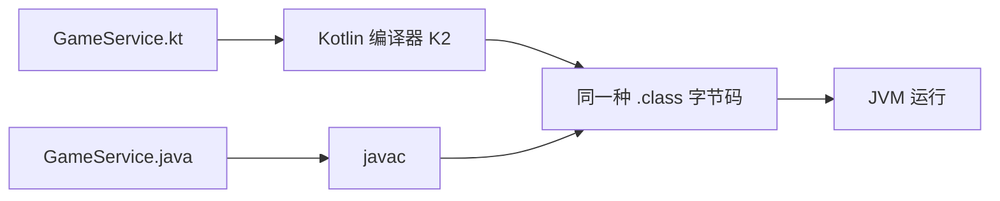

## 前置知识

- 已读 [Java 是什么](/java/010-WhatIsJava)：知道 Java 程序先编译成字节码、再由 JVM 运行，知道「类」是 Java 组织代码的基本单位。
- 走 [移动端路线](/roadmap/070-MobileRoute) 的读者：Kotlin 就是 Android 官方首选语言，本模块是你 Android 之路的第一站。

还没读过 Java 模块也可以继续——本文用到的 Java 概念只有「字节码」和「类」两个，出现时会当场一句话讲清。

## 学习目标

读完本文你将能够：

1. 说出 Kotlin 与 Java 的核心关系：编译成同一种 JVM 字节码，同一个项目里两种语言可以共存并互相调用；
2. 用 Kotlin Playground 跑通第一个程序，先预测输出再核对；
3. 指出空安全内建于类型系统的含义：`String` 与 `String?` 是两种类型，编译器只放行前者直接调用；
4. 说出 Kotlin 的四个编译目标，以及它们各自服务的场景；
5. 用「生态复用」与「渐进迁移」两个标准，判断一门新语言值不值得学。

预计 30 到 45 分钟，含 1 组动手实验与 4 道练习。

## 1. 问题引入：一家写 Java 写到受够的公司

设想你供职于 JetBrains——就是做 IntelliJ IDEA 那家公司。你的产品是几百万行 Java 代码，每天你都要：

1. 给一个只有三个字段的数据类手写 getter、setter、equals、hashCode、toString，五六十行代码没有一个字符承载业务；
2. 生产环境的崩溃报告里，NullPointerException 常年霸榜——Java 的任何引用都可能为 null，而编译器不管这件事；
3. 看着 Scala 这类新语言眼馋，但团队评估后的结论是：太复杂，隐式转换满天飞的代码没人接得住。

自己写一门新语言？听起来疯狂。2010 年 JetBrains 真的这么干了，并且给这门语言定了一条铁律：**必须 100% 复用 Java 生态**。不能让任何一家公司在「用 Kotlin」和「保住十年 Java 存量代码」之间二选一。

这条铁律就是 Kotlin 的全部设计起点，也是你判断它和其他新语言的关键坐标。

## 2. 第一个实验：同一件事，两种写法

不用装任何东西，打开浏览器访问 [Kotlin Playground](https://play.kotlinlang.org)，把左边代码清空，输入：

```kotlin
fun main() {
    val player = "小狐"
    val score = 5050
    println("玩家 $player 本局得分 $score")
    println("1 到 100 求和用时：${System.currentTimeMillis() % 1000} ms 之内")
}
```

先预测输出，再点运行。预期输出（时间数字每次不同，重要的是能打印出来）：

```text
玩家 小狐 本局得分 5050
1 到 100 求和用时：xxx ms 之内
```

两个细节值得停下：`fun main()` 三行就是一个完整程序——没有类、没有 `String[] args`，对照 [Java 快速上手](/java/030-QuickStart) 里那五行三层「房子」；第二行里 `System.currentTimeMillis()` 是**纯 Java API**，你在 Kotlin 里直接调用了它，一行 import 都没写。这不是巧合，是第 3 节那个设计决定的直接结果。

## 3. 核心概念

### 3.1 互操作是杀手锏：同一个项目，两种语言

Kotlin 与 Java 编译成同一种 JVM 字节码（JVM 只认识字节码，不关心它是谁编译的）：



由此推出三个工程事实：

- **共存**：同一个项目、同一个模块里，`.kt` 与 `.java` 文件并排存在，互相调用像调用本国代码一样自然；
- **渐进迁移**：存量 Java 项目不需要重写，常见形态是「新文件用 Kotlin 写，老文件按需迁移」；
- **生态全收**：Java 世界几十年积累的类库（数据库驱动、网络框架、JSON 工具），Kotlin 全部直接 import 使用——第 2 节调用 `System.currentTimeMillis()` 就是证明。

企业为什么要冒风险换语言？因为下一节这些痛点值得付一次迁移成本。

### 3.2 定位：Android 首选与服务端官方支持

两个官方背书事实，决定了你学 Kotlin 的回报率：

- **Android 官方首选**：Google 于 2017 年宣布官方支持，2019 年进一步定为 Kotlin-first——新 API 与 Jetpack 文档均以 Kotlin 为第一优先级。今天开一个 Android 新项目，默认语言就是 Kotlin；
- **服务端双官方支持**：Spring Framework 自 5.0 起把 Kotlin 列为一等公民，官方文档提供 Kotlin 示例；Ktor 则是 JetBrains 出品、为 Kotlin 而生的轻量服务端框架。存量 Spring 项目也可以逐文件引入 Kotlin（互操作在 [Kotlin 与 Java 互操作](/kotlin/430-KotlinJavaInterop) 展开实践）。

### 3.3 空安全：把「会不会为 null」写进类型

Java 的崩溃榜冠军 NPE，根源是「任何引用都可能为 null」这件事编译器不知道。Kotlin 的对策是在类型层面直接区分：

```kotlin
fun main() {
    val name: String = "小狐"      // String：保证永远不为 null
    val nickname: String? = null   // String?：明确声明「可能为 null」

    println("名字长度 ${name.length}")
    println("昵称长度 ${nickname?.length}")   // 加 ? 才被放行
}
```

预期输出：

```text
名字长度 2
昵称长度 null
```

规则一句话：`String` 类型的值直接 `.length` 没问题；`String?` 类型的值必须先处理「它是 null 怎么办」（`?.` 安全调用是其中一种写法），否则编译器直接拒绝。**这一整套是类型系统内建的，不是某个库或注解的约定**——第 4 节你会亲眼看到编译器拦下一个违反它的写法，完整机制在 [空安全详解](/kotlin/130-NullSafetyDetailed) 讲透，今天混个眼熟。

### 3.4 一门语言，多个编译目标

Kotlin 编译器（今天默认的 K2 编译器）能产出多种目标代码，共享同一套语言：

| 目标 | 产物 | 服务场景 |
| --- | --- | --- |
| JVM | .class 字节码 | 服务端、Android、桌面 |
| JS | JavaScript 代码 | 浏览器前端 |
| Native | 原生二进制 | iOS、命令行工具 |

零基础阶段只需记住主线是 JVM（本模块前半全部在 JVM 上），其余目标属于 [Kotlin 跨平台](/kotlin/460-KotlinMultiplatform) 的进阶话题。

### 3.5 版本事实：2.x 时代与 K2 编译器

截至 2026 年 9 月的两条可靠事实：

- Kotlin 2.0（2024 年 5 月发布）让新一代 **K2 编译器转正为默认**——编译速度最高提升约 2 倍，报错更准；当前稳定版在 2.4.x 一线，最新版本号以 https://kotlinlang.org/docs/releases.html 为准；
- 语言语法自 1.0 起高度稳定，2.x 的重点是编译器与多平台，不是语法翻新——**网上 1.x 的 Kotlin 教程绝大部分依然有效**，这大幅降低了「教程过时」的焦虑。

## 4. 修改实验

实验都在 Playground 里做，每个先预测再运行。

实验一：把第 2 节代码里的 `val` 全部改成 `var`，输出有变化吗？（没有。`val` 与 `var` 的区别是下一篇之后的主角，这里只需确认程序照常运行。）

实验二：把 `score` 的值改成你玩过的某款游戏的实际分数，再给输出加一行「目标分数」。改完必须先在脑内写出完整预期输出，运行核对。

实验三（关键）：把 `val name: String = "小狐"` 改成 `val name: String = null`，点运行。编译器拒绝你：

```text
error: null can not be a value of a non-null type String
```

这就是 3.3 节「内建于类型系统」的实证：不是运行时才崩，而是**编译阶段就拦下**。把类型改成 `String?` 后再运行，程序恢复通过。

## 5. 常见错误与调试实录

错误实录：val 重新赋值。在 Playground 输入：

```kotlin
fun main() {
    val score = 100
    score = 90
    println(score)
}
```

报错（真实文本）：

```text
error: val cannot be reassigned
```

读报错三步：第一看 `error:` 前的文件与行号定位现场；第二读原因 `val cannot be reassigned`——val 声明的变量不能再次赋值；第三决定修法：值确实要变，就把 `val` 改 `var`；值不该变，就删掉第二行。这个报错你会反复遇到，它其实是编译器在替你执行「不可变优先」的纪律（[基本语法](/kotlin/030-KotlinBasicSyntax) 正式讲）。

Playground 的报错显示在编辑器下方信息栏，IDEA 措辞略有差异但核心文本一致。

## 6. 实际项目中的使用场景

- **存量 Java 项目**：在一个多模块 Maven/Gradle 工程里新增 `.kt` 文件，与 Java 代码互相调用，一次只迁一个模块——这是大多数公司用上 Kotlin 的真实路径；
- **Android 新项目**：Android Studio 新建项目默认 Kotlin，官方课程与文档全部以 Kotlin 为主；
- **Gradle 构建脚本**：主流项目用 `build.gradle.kts` 写构建，学语言顺手读懂构建配置。

## 7. 小练习

预测题（5 分钟）：先写预期输出再运行验证。

```kotlin
fun main() {
    val game = "方块坠落"
    val version = 2
    println("$game v$version")
    println("长度: ${game.length}")
}
```

修改题（10 分钟）：把第 2 节程序改造成输出三行游戏排行榜，第一名固定为「星际矿工」，第二、三名自定。验收：输出三行、每行含名次与游戏名、一次运行通过。

修 Bug 题（5 分钟）：下面的代码编译报错，报错原文如下。先按读报错三步定位，再决定「改 val 还是删赋值」，说明你的选择理由。

```kotlin
fun main() {
    val hp = 100
    hp = hp - 30
    println(hp)
}
```

```text
error: val cannot be reassigned
```

挑战题（15 分钟）：只凭本文知识（fun main、字符串模板、`${}`），在 Playground 写一个程序输出你的自我介绍三行：姓名、当前会的一门语言、学 Kotlin 的目标。验收：三行输出全部来自变量（不允许在字符串里直接写死内容），`${}` 至少出现一次表达式。提示：变量用 `val` 声明；展开：模板里 `${变量名}` 插值，`${变量名.length}` 之类的表达式也合法。

## 8. 与之前和之后的知识的关系

- 往前：[Java 是什么](/java/010-WhatIsJava) 里「字节码 + JVM」的模型，本文用它解释了互操作为什么可能；[移动端路线](/roadmap/070-MobileRoute) 的第一格就是本模块；
- 往后：本模块按 **A-B-C-040** 顺序推进——[Kotlin 概述与环境搭建](/kotlin/020-KotlinOverviewEnvSetup) 给你三种可动手的环境，[基本语法](/kotlin/030-KotlinBasicSyntax) 讲 fun main 与 val/var，[函数与 Lambda](/kotlin/040-KotlinFunctionAndLambda) 把代码组织成函数；
- 更远：空安全的完整体系在 [空安全详解](/kotlin/130-NullSafetyDetailed)，互操作实践在 [Kotlin 与 Java 互操作](/kotlin/430-KotlinJavaInterop)。

## 9. 官方文档

- 官方文档总入口：https://kotlinlang.org/docs/home.html
- 版本发布记录（版本事实的权威来源）：https://kotlinlang.org/docs/releases.html
- Kotlin Playground（本文动手环境）：https://play.kotlinlang.org

## 10. 自我检查

- 能用自己的话向同事解释「Kotlin 与 Java 互操作」在工程上意味着什么，并举出共存与迁移两种场景；
- 能说出 `String` 与 `String?` 的区别，以及为什么空安全是「类型系统内建」而非注解约定；
- 能列出 Kotlin 的至少三个编译目标，并说出本模块主线在哪个目标上；
- 被问「为什么选 Kotlin 而不是别的 JVM 新语言」时，能用「生态复用 + 渐进迁移」组织回答。

## 本章总结

Kotlin 源于 JetBrains 对 Java 啰嗦与 NPE 泛滥的不满，铁律是 100% 复用 Java 生态：与 Java 编译成同一种字节码，同一项目两种语言共存，Java 类库直接调用。它靠 Android 官方首选与 Spring/Ktor 服务端支持立足，空安全内建于类型系统（String 与 String? 分家，编译期拦截），K2 编译器自 2.0 起默认，语法长期稳定。你在 Playground 跑通了第一个程序，并亲手制造了第一个编译错误。

## 下一步

进入 [Kotlin 概述与环境搭建](/kotlin/020-KotlinOverviewEnvSetup)：把 Playground 的临时体验升级为三种正式玩法——IDEA、命令行 kotlinc、以及什么时候该用哪种。
