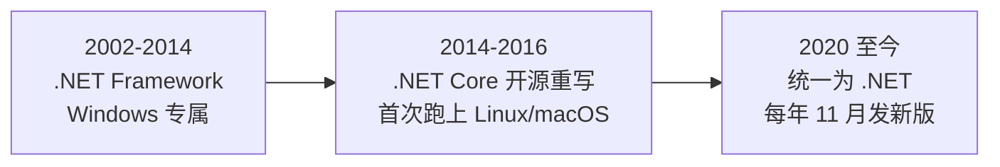

## 前置知识

- 已看过 [编程学习路线总览](/start/080-LearningRouteOverview)：知道自己为什么站在 C# 这一站。还没看过也不影响，本文自足。
- 正在走 [Java 后端路线](/roadmap/030-BackendJavaRoute) 的同学有专属福利：C# 与 Java 同源，学过 Java 或正在学 Java，都能近乎无缝地迁移到 C#——本模块与 java 模块互相链接、概念一一对应，两边对照着学效率翻倍。

本文不要求任何编程基础，也不会出现需要逐词理解的代码。

## 学习目标

读完本文你将能够：

1. 用一句话说出 C# 的定位，并列出它的三大主战场与各自的代表技术；
2. 讲清「Windows 专属 → 跨平台开源」这场逆转发生了什么，以及它对你学 C# 的三个直接影响；
3. 说出 .NET 与 C# 两条版本线的发布节奏，知道初学者该装哪个版本、为什么；
4. 拿到一段简单的 Java 打印代码，能大致写出对应的 C# 写法；
5. 在官方文档里找到 C# 入门的权威入口与版本支持信息。

预计 30 到 45 分钟，含 2 个在线动手实验与 3 道练习。

## 1. 问题引入：一句过时的常识

假设你在网上搜「C# 适合学吗」，翻到的高赞回答很可能还写着：「C# 是微软的语言，只能在 Windows 上跑。」如果你信了这句话，今天会同时错过两件事：给全球过半手游写游戏逻辑的 Unity 脚本语言，以及一个在 Linux 服务器上能与企业级 Java 分庭抗礼的开源运行时。

这句「常识」曾经是对的。但微软后来做了一场罕见的大逆转：**把一门 Windows 专属的闭源语言，改造成了跨平台的开源语言**。主流语言里做到这一点的屈指可数。这场逆转怎么发生的、为什么直接决定你今天怎么学 C#，往下看。

## 2. 核心概念一：大逆转——从 .NET Framework 到统一的 .NET

整段历史压缩成三个时间点，只留对学习者有用的部分：



- **逆转之前**：老 .NET Framework 与 Windows 深度绑定，C# 背上「Windows 专属」的名声；
- **2014 到 2016**：微软宣布开源并重写运行时，2016 年 .NET Core 1.0 发布——同一个 C#，第一次官方支持 Linux 与 macOS。源码至今在 GitHub 的 dotnet/runtime 仓库公开开发；
- **2020 年**：微软把 Framework 与 Core 两条产品线合并成统一的「.NET」，版本号直接跳到 .NET 5。从此只有「.NET」一个名字，每年 11 月发一个大版本。

这场逆转对你的三个直接影响：

1. **一套环境走天下**：Windows、macOS、Linux 装的是同一个 SDK，教程和代码全部通用；
2. **部署不再绑死**：ASP.NET Core 服务跑在 Linux 容器里是常规操作，Docker 官方镜像、GitHub Actions 都有良好支持；
3. **学的是真主流**：微软官方与开源社区双驱动，C# 长期稳居主流编程语言排行前列。

## 3. 核心概念二：主战场——C# 靠什么吃饭

设想你的目标是做一款小游戏，再给它配一个后端排行榜服务。C# 恰好两条线都能打满：

| 主战场 | 代表技术 | 现状 |
| --- | --- | --- |
| 游戏开发 | Unity 引擎脚本语言 | 全球过半的手游由 Unity 制作，C# 是唯一官方脚本语言 |
| 企业后端 | ASP.NET Core | 与 Java Spring 定位相当，跑在 Linux 服务器与容器里 |
| 桌面与跨平台客户端 | WPF、WinForms、MAUI | Windows 桌面主力；MAUI 一套代码出 Android/iOS/Windows/macOS |

关键事实：三个战场共享同一套语言地基，差异全在框架层。所以入门阶段只管学语言本体，方向以后再选。游戏方向见 [Unity 游戏开发](/csharp/380-CSharpUnityGameDev)，后端方向见 [Web API](/csharp/300-CSharpAPI)。

## 4. 核心概念三：与 Java 同源对照

一句定位先立住：**学过 Java 或正在学 Java，都能无缝迁移到 C#；本仓库的 java 模块与本模块互为对照教材。**

两者师出同门不是比喻：C# 首席设计师 Anders Hejlsberg 主导设计时，Java 已成名多年；两门语言都编译成中间码、由虚拟机执行、自带垃圾回收，连关键字都大量重合。日常最常撞上的差异只有几处：

| 维度 | C# | Java |
| --- | --- | --- |
| 运行方式 | 编译为 IL，.NET Runtime（JIT/AOT）执行 | 编译为字节码，JVM 执行 |
| 类型系统 | 静态强类型 | 静态强类型 |
| 程序入口 | 顶级语句一行即可，或 Main 方法 | 必须是类里的 main 方法 |
| 打印一行 | `Console.WriteLine("Hi");` | `System.out.println("Hi");` |
| 字符串嵌变量 | `$"第 {i} 名"` | `"第 " + i + " 名"` |
| 包管理 | NuGet | Maven / Gradle |
| 企业后端框架 | ASP.NET Core | Spring Boot |

学过 Java 的同学，把 [Java 快速上手](/java/030-QuickStart) 的 HelloWorld 与本文第 5 节并排看一遍，迁移的感觉立刻就有了；`System.out.println` 与 `Console.WriteLine` 的相似度是两个生态同源的最直白证据。

## 5. 第一口味道：一行代码的 C#

概念说完，先尝一口味道。装好环境之后（下一篇的事），C# 的入口程序 `Program.cs` 全文可以只有一行：

```csharp
Console.WriteLine("你好，C#");
```

预期输出：

```text
你好，C#
```

加个循环，让它问候三次：

```csharp
for (var i = 1; i <= 3; i++)
{
    Console.WriteLine($"第 {i} 次问候");
}
```

预期输出：

```text
第 1 次问候
第 2 次问候
第 3 次问候
```

这段代码现在不需要逐词理解，只需要感受两件事：`$` 后面的字符串里，`{i}` 会被替换成变量的值（叫字符串插值，第三篇正式讲）；对照上一节的表格，Java 要用加号拼半天的事，C# 一个花括号解决。

## 6. 核心概念四：版本现状——两条线，一个选择

C# 的版本号与 .NET 的版本号是两条线，**每年 11 月同步发布一个大版本**，偶数为 LTS（长期支持，约三年），奇数为 STS（标准期支持，18 个月）：

| .NET 版本 | 随附 C# | 发布 | 支持类型 |
| --- | --- | --- | --- |
| .NET 8 | C# 12 | 2023.11 | LTS |
| .NET 9 | C# 13 | 2024.11 | STS |
| .NET 10 | C# 14 | 2025.11 | LTS，支持到 2028.11 |

初学者的选择很简单：**装最新的 LTS，也就是 .NET 10 / C# 14**。企业新项目同理。本模块示例默认基于 .NET 10 / C# 14，绝大多数语法在 .NET 8 上同样可用。C# 14 的两个代表特性（扩展成员、field 关键字）属于进阶内容，到 [C# 14 新特性](/csharp/220-CSharp14NewFeatures) 再见。

版本事实会随时间变化，发布节奏以官方下载页为准（写作时于 2026-09 核实）：https://dotnet.microsoft.com/zh-cn/download/dotnet

## 7. 常见困惑与边界

**「C、C++、C# 是一家吗？」**——名字像，是三门独立语言。C# 语法借鉴了 C++ 与 Java，但与 C/C++ 没有源码层面的兼容关系。井号取自音乐记号「升半音」，寓意比 C++ 更进一步。

**「Unity 里的 C# 和这里学的一样吗？」**——语言层面完全一致；差异在运行时（Unity 用 Mono/IL2CPP，API 是 .NET 的子集）。语法基础全部通用，先在本模块打好地基，再去 [Unity 游戏开发](/csharp/380-CSharpUnityGameDev) 搬进引擎。

**「C# 只能在 Windows 上用吗？」**——本文开头已经回答：不能这么说了，而且这是全篇最重要的一句话。

## 8. 动手环节：在线跑通第一段代码

机器上还没装环境？不用等，浏览器里就能跑。

实验一：打开 https://dotnetfiddle.net （在线运行 C# 的常用站点），把第 5 节的循环示例贴进去运行，核对输出是否一致。

实验二：把 `i <= 3` 改成 `i <= 5`。先在纸上写出预期五行输出，再运行核对。**先预测、再运行**，这个习惯将贯穿整个模块。

## 9. 实际场景中的使用

- **选方向**：三大主战场决定你后续走哪条框架线——游戏线学 Unity，后端线学 ASP.NET Core，桌面线学 WPF/MAUI；
- **技术选型**：第 4 节的对照表就是团队选型速查表，「C# 还是 Java」的争论可以用它对齐语言；
- **面试与简历**：「C# 与 Java 的异同」是后端面试常见题，本文表格可直接当提纲；
- **查证习惯**：版本、支持期这类会过期的信息，永远以官方页面为准，这是工程师的基本功。

## 10. 小练习

预测题（5 分钟）：下面代码输出什么？先写答案，再用 dotnetfiddle 验证。

```csharp
var game = "方块坠落";
var level = 7;
Console.WriteLine($"你在 {game} 的第 {level} 关");
```

（验证：运行后与手写答案逐字符核对，花括号外的一个空格都算数。）

修改题（5 分钟）：把第 5 节的循环改成从 5 数到 1（提示：for 的三段各改一处）。先写出预期五行输出，再运行核对。

挑战题（15 分钟）：打开 https://dotnet.microsoft.com/zh-cn/download/dotnet 查证三件事：当前最新 LTS 是哪个版本；按发布节奏，下一个版本属于 LTS 还是 STS、计划何时发布；企业项目为什么不急着追最新版。验收：能说出 .NET 11 计划 2026.11 发布、属于 STS（18 个月支持期）、所以生产环境等下一个 LTS 更稳。

## 11. 与之前和之后的知识的关系

- 往前：[编程学习路线总览](/start/080-LearningRouteOverview) 的路线图上，这是语言起点站之一；[Java 后端路线](/roadmap/030-BackendJavaRoute) 的后端地图上，C# 与 Java 是并排的两条同源路线，随时可以互相切换；
- 往后：下一篇装环境（020），再下一篇写第一段像样的程序（030），然后进入 [面向对象](/csharp/040-CSharpOOP)；
- 更远：方向三选一之后，游戏线去 [Unity 游戏开发](/csharp/380-CSharpUnityGameDev)，后端线去 [Web API](/csharp/300-CSharpAPI)，平台机制深挖去 [.NET 平台](/csharp/250-CSharpDotNet)。

## 12. 官方文档

- C# 官方导览（Tour of C#，含浏览器内交互示例）：https://learn.microsoft.com/dotnet/csharp/tour-of-csharp/
- .NET 下载与版本支持信息：https://dotnet.microsoft.com/zh-cn/download/dotnet
- C# 语言参考：https://learn.microsoft.com/dotnet/csharp/language-reference/

## 13. 自我检查

- 能不看本文说出 C# 的三大主战场与各自的代表技术；
- 能用三句话讲清大逆转：Core 开源跨平台 → 统一为 .NET 5+ → 每年 11 月发版；
- 能说出为什么初学者装 LTS 而不是刚出的最新版；
- 给一段 Java 的打印代码，能写出对应的 C# 写法；
- 知道版本支持期这类信息该去哪个官方页面核实。

## 本章总结

C# 是 .NET 平台的主力语言，微软用十年把它从 Windows 专属改造成了跨平台开源——.NET Core 重写、2020 年统一为 .NET、每年 11 月发新版。它的三大主战场是 Unity 游戏、ASP.NET Core 企业后端与 WPF/MAUI 桌面客户端，语言地基完全相同。它与 Java 师出同门：同为静态强类型、同为虚拟机路线，学过一门就能快速迁移另一门。初学者装最新的 LTS（.NET 10 / C# 14）即可。

## 下一步

进入 [C# 概述与环境搭建](/csharp/020-CSharpOverviewEnvSetup)：五分钟装好 .NET SDK，两条命令让你的机器跑起第一个 C# 程序。
