## 前置知识

- [Go 标准库与工具链](/go/110-GoStandardLibraryToolchain)：建议先完成前一篇的学习

## 学习目标

- 掌握「1. net/http 标准库」的选型定位（深读见 470/480）
- 掌握「2. Gin 框架」的核心机制、典型用法与常见陷阱
- 掌握「3. Echo 框架」的核心机制、典型用法与常见陷阱
- RESTful API 契约设计见 485-GoRestApiDesign，gRPC 见 520-GoGRPC
- 数据库访问见 340-GoDatabase 与 345-GoOrmAndQueryBuilders


## 1. net/http 标准库（起点速写）

一切框架的底层都是 `net/http`：`ServeMux` 路由、Handler 接口、
`http.HandlerFunc` 适配器。Go 1.22 起 `ServeMux` 支持「方法 + 路径」
模式（`mux.HandleFunc("GET /users/{id}", h)` 与 `r.PathValue("id")`），
小服务已经不需要第三方路由库。

本模块的对应深读：协议语义与 Handler 体系见
[470-GoHTTP](/go/470-GoHTTP)；中间件（洋葱模型、Chain 组合、Recovery、CORS）
见 [480-GoMiddleware](/go/480-GoMiddleware)——本节原速写代码与两篇重复，
已按单主题原则迁出。

## 2. Gin 框架

### 2.1 基础用法

```go
import "github.com/gin-gonic/gin"

func main() {
    r := gin.Default() // 包含 Logger 和 Recovery 中间件

    // 路由
    r.GET("/ping", func(c *gin.Context) {
        c.JSON(200, gin.H{"message": "pong"})
    })

    // 路径参数
    r.GET("/users/:id", func(c *gin.Context) {
        id := c.Param("id")
        c.JSON(200, gin.H{"id": id})
    })

    // 查询参数
    r.GET("/search", func(c *gin.Context) {
        q := c.Query("q")
        page := c.DefaultQuery("page", "1")
        c.JSON(200, gin.H{"query": q, "page": page})
    })

    // 请求体绑定
    r.POST("/users", func(c *gin.Context) {
        var user User
        if err := c.ShouldBindJSON(&user); err != nil {
            c.JSON(400, gin.H{"error": err.Error()})
            return
        }
        c.JSON(201, user)
    })

    r.Run(":8080")
}
```

### 2.2 路由分组

```go
func main() {
    r := gin.Default()

    // API 版本分组
    v1 := r.Group("/api/v1")
    {
        v1.GET("/users", listUsers)
        v1.POST("/users", createUser)
        v1.GET("/users/:id", getUser)
    }

    v2 := r.Group("/api/v2")
    {
        v2.GET("/users", listUsersV2)
    }

    // 中间件分组
    auth := r.Group("/admin", AuthMiddleware())
    {
        auth.GET("/dashboard", dashboard)
        auth.GET("/settings", settings)
    }

    r.Run()
}
```

### 2.3 Gin 中间件

```go
// 自定义中间件
func AuthMiddleware() gin.HandlerFunc {
    return func(c *gin.Context) {
        token := c.GetHeader("Authorization")
        if token == "" {
            c.AbortWithStatusJSON(401, gin.H{"error": "unauthorized"})
            return
        }
        // 验证 token...
        userID, err := validateToken(token)
        if err != nil {
            c.AbortWithStatusJSON(401, gin.H{"error": "invalid token"})
            return
        }
        c.Set("userID", userID)
        c.Next()
    }
}

// 使用
r.Use(AuthMiddleware())
```

## 3. Echo 框架

```go
import "github.com/labstack/echo/v4"

func main() {
    e := echo.New()

    // 中间件
    e.Use(middleware.Logger())
    e.Use(middleware.Recover())
    e.Use(middleware.CORS())

    // 路由
    e.GET("/", func(c echo.Context) error {
        return c.String(http.StatusOK, "Hello, World!")
    })

    e.GET("/users/:id", func(c echo.Context) error {
        id := c.Param("id")
        return c.JSON(200, map[string]string{"id": id})
    })

    // 请求绑定
    e.POST("/users", func(c echo.Context) error {
        u := new(User)
        if err := c.Bind(u); err != nil {
            return echo.NewHTTPError(400, err.Error())
        }
        if err := c.Validate(u); err != nil {
            return echo.NewHTTPError(400, err.Error())
        }
        return c.JSON(201, u)
    })

    e.Logger.Fatal(e.Start(":8080"))
}
```

## 4. RESTful API 设计

路由约定、统一响应结构、业务错误码分段、请求验证、版本化与幂等键
已扩写为设计专篇 [485-GoRestApiDesign](/go/485-GoRestApiDesign)——
那是一篇讲「接口契约怎么定」的篇，本篇讲「服务怎么搭」。

## 5. gRPC（速写）

gRPC 的 Protobuf 定义、服务端实现与客户端调用以专篇为准：
[520-GoGRPC](/go/520-GoGRPC)。本篇只保留选型结论：内部服务间通信
需要强类型契约、多路复用与流式时选 gRPC；对外开放 API 仍是 REST。

## 6. 数据库访问（速写）

`database/sql` 的连接池、事务与防注入见 [340-GoDatabase](/go/340-GoDatabase)；
GORM 链式 API、sqlc 与 ent 的选型对比见
[345-GoOrmAndQueryBuilders](/go/345-GoOrmAndQueryBuilders)。本篇只保留
分层架构语境下的结论：repository 层依赖接口而非具体 ORM
（见第 7 节的分层代码）。

## 7. 项目结构

### 7.1 标准项目布局

```mermaid
flowchart TD
    T0["myapp/"]
    T1["cmd/"]
    T2["server/"]
    T3["main.go          # 入口"]
    T4["internal/"]
    T5["handler/             # HTTP 处理器"]
    T6["user.go"]
    T7["service/             # 业务逻辑"]
    T8["user.go"]
    T9["repository/          # 数据访问"]
    T10["user.go"]
    T11["model/               # 数据模型"]
    T12["user.go"]
    T13["middleware/           # 中间件"]
    T14["auth.go"]
    T15["pkg/                     # 可复用公共库"]
    T16["response/"]
    T17["validator/"]
    T18["api/                     # API 定义"]
    T19["proto/"]
    T20["configs/                 # 配置文件"]
    T21["config.yaml"]
    T22["migrations/              # 数据库迁移"]
    T23["scripts/                 # 脚本"]
    T24["go.mod"]
    T25["go.sum"]
    T26["Makefile"]
    T27["Dockerfile"]
    T0 --> T1
    T3 --> T4
    T14 --> T15
    T17 --> T18
    T19 --> T20
    T21 --> T22
    T21 --> T23
    T21 --> T24
    T21 --> T25
    T21 --> T26
    T21 --> T27
```



### 7.2 分层架构

```go
// handler 层 — 处理 HTTP 请求/响应
type UserHandler struct {
    svc *UserService
}

func (h *UserHandler) Get(c *gin.Context) {
    id := c.Param("id")
    user, err := h.svc.Get(c.Request.Context(), id)
    if err != nil {
        Error(c, 500, err.Error())
        return
    }
    Success(c, user)
}

// service 层 — 业务逻辑
type UserService struct {
    repo UserRepository
}

func (s *UserService) Get(ctx context.Context, id string) (*User, error) {
    return s.repo.FindByID(ctx, id)
}

// repository 层 — 数据访问
type UserRepository interface {
    FindByID(ctx context.Context, id string) (*User, error)
    Create(ctx context.Context, user *User) error
}

// 依赖注入
func main() {
    db, _ := gorm.Open(mysql.Open(dsn))
    repo := NewGormUserRepository(db)
    svc := NewUserService(repo)
    handler := NewUserHandler(svc)

    r := gin.Default()
    r.GET("/users/:id", handler.Get)
    r.Run()
}
```

## 8. 配置管理（微服务语境速写）

微服务配置的完整方法论（默认值 -> 配置文件 -> 环境变量盖一切的优先级、
结构体 unmarshal、启动期校验、多环境差异管理）见
[390-GoConfigManagement](/go/390-GoConfigManagement)。本节只留微服务特有
的两条：配置里禁止放密钥明文（用 secret 管理或环境变量注入）；
Kubernetes 场景用 ConfigMap/Secret 挂载配合环境变量覆盖
（见 610-GoKubernetes）。


## 9. 部署与容器化（骨架）

多阶段构建 Dockerfile（builder 阶段 `CGO_ENABLED=0 go build -ldflags="-s -w"`
出静态二进制、运行阶段基于 alpine/scratch）与镜像优化细节见
[600-GoDocker](/go/600-GoDocker)；Kubernetes 的 Deployment、Service、
探针与滚动发布见 [610-GoKubernetes](/go/610-GoKubernetes)。本节保留微服务
语境下的三个必查项。

### 9.4 健康检查

```go
r := gin.Default()

r.GET("/healthz", func(c *gin.Context) {
    // 检查数据库连接
    if err := db.Ping(); err != nil {
        c.JSON(503, gin.H{"status": "unhealthy", "db": "down"})
        return
    }
    c.JSON(200, gin.H{"status": "healthy"})
})

r.GET("/readyz", func(c *gin.Context) {
    c.JSON(200, gin.H{"ready": true})
})
```
