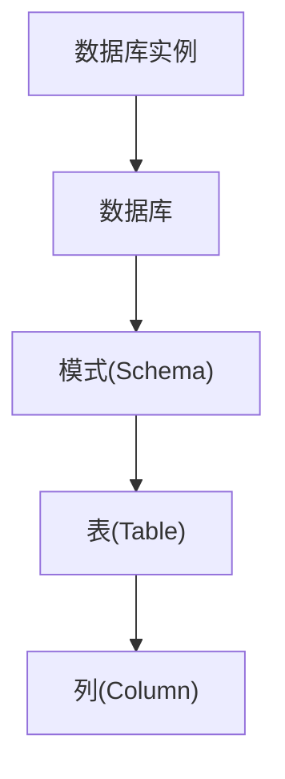

## 1. DCL 概述

数据控制语言（Data Control Language，DCL）用于管理数据库访问权限，核心语句为 GRANT 和 REVOKE。

### 1.1 权限管理模型

```
用户(User) ──授予──→ 角色(Role) ──拥有──→ 权限(Privilege) ──作用于──→ 对象(Object)
```

### 1.2 权限分类

| 类别     | 权限                            | 作用对象         |
| -------- | ------------------------------- | ---------------- |
| 对象权限 | SELECT, INSERT, UPDATE, DELETE  | 表、视图         |
| 对象权限 | EXECUTE                         | 函数、存储过程   |
| 对象权限 | USAGE                           | 序列、类型、模式 |
| 系统权限 | CREATE, ALTER, DROP             | 数据库对象       |
| 系统权限 | CREATE USER, CREATE ROLE        | 安全对象         |
| 管理权限 | SUPERUSER, CREATEDB, CREATEROLE | 数据库实例       |

## 2. GRANT 授予权限

### 2.1 授予对象权限

```sql
-- 授予表权限
GRANT SELECT ON employees TO user_read;
GRANT SELECT, INSERT, UPDATE ON employees TO user_write;
GRANT ALL PRIVILEGES ON employees TO admin_user;

-- 授予列级权限
GRANT SELECT (name, dept_id) ON employees TO user_limited;
GRANT UPDATE (salary) ON employees TO hr_manager;

-- 授予视图权限
GRANT SELECT ON employee_view TO reporting_user;

-- 授予函数执行权限
GRANT EXECUTE ON FUNCTION calculate_bonus(INTEGER) TO hr_user;
```

### 2.2 授予模式权限

```sql
-- 授予模式使用权限
GRANT USAGE ON SCHEMA hr TO user_read;

-- 授予模式下创建对象的权限
GRANT CREATE ON SCHEMA hr TO developer;
```

### 2.3 授予系统权限

```sql
-- PostgreSQL
GRANT CREATEDB TO user_admin;
GRANT CREATEROLE TO user_admin;

-- 授予所有表的权限（PostgreSQL）
GRANT SELECT ON ALL TABLES IN SCHEMA public TO readonly_role;

-- 授予未来创建对象的默认权限
ALTER DEFAULT PRIVILEGES IN SCHEMA public
    GRANT SELECT ON TABLES TO readonly_role;
```

### 2.4 WITH GRANT OPTION

```sql
-- 允许被授权者将权限授予他人
GRANT SELECT ON employees TO manager WITH GRANT OPTION;

-- manager 可以进一步授权
-- manager 执行：
GRANT SELECT ON employees TO staff;
```

### 2.5 授予角色

```sql
-- 创建角色
CREATE ROLE readonly;
CREATE ROLE readwrite;
CREATE ROLE admin;

-- 为角色授权
GRANT SELECT ON ALL TABLES IN SCHEMA public TO readonly;
GRANT SELECT, INSERT, UPDATE, DELETE ON ALL TABLES IN SCHEMA public TO readwrite;
GRANT ALL PRIVILEGES ON ALL TABLES IN SCHEMA public TO admin;

-- 将角色授予用户
GRANT readonly TO user_read;
GRANT readwrite TO user_write;
GRANT admin TO user_admin;

-- 角色继承
GRANT readonly TO readwrite;  -- readwrite 继承 readonly 的权限
```

## 3. REVOKE 撤销权限

### 3.1 撤销对象权限

```sql
-- 撤销特定权限
REVOKE SELECT ON employees FROM user_read;

-- 撤销所有权限
REVOKE ALL PRIVILEGES ON employees FROM user_write;

-- 撤销列级权限
REVOKE UPDATE (salary) ON employees FROM hr_manager;
```

### 3.2 CASCADE 与 RESTRICT

```sql
-- CASCADE：级联撤销（同时撤销被该用户授予他人的权限）
REVOKE SELECT ON employees FROM manager CASCADE;

-- RESTRICT：如果有依赖权限则报错（默认行为）
REVOKE SELECT ON employees FROM manager RESTRICT;
```

### 3.3 撤销角色

```sql
REVOKE readonly FROM user_read;
REVOKE admin FROM user_admin;
```

## 4. 权限层级

### 4.1 权限继承链



```sql
-- 上层权限不自动继承到下层
-- 需要显式授予每层权限
GRANT USAGE ON DATABASE mydb TO user1;
GRANT USAGE ON SCHEMA public TO user1;
GRANT SELECT ON TABLE employees TO user1;
```

### 4.2 权限检查顺序

```
1. 检查用户是否为超级用户（超级用户跳过所有检查）
2. 检查用户是否直接拥有权限
3. 检查用户所属角色是否拥有权限
4. 检查 PUBLIC 角色是否拥有权限
5. 以上都不满足则拒绝
```

## 5. 查看权限

### 5.1 信息模式查询

```sql
-- 查看表的权限
SELECT grantee, privilege_type
FROM information_schema.table_privileges
WHERE table_name = 'employees';

-- 查看列级权限
SELECT grantee, column_name, privilege_type
FROM information_schema.column_privileges
WHERE table_name = 'employees';
```

### 5.2 PostgreSQL 专用查询

```sql
-- 查看角色成员
SELECT r.rolname, m.rolname AS member_of
FROM pg_roles r
JOIN pg_auth_members am ON r.oid = am.roleid
JOIN pg_roles m ON am.member = m.oid;

-- 查看表权限
SELECT relname, acl
FROM pg_class
WHERE relname = 'employees';
```

## 6. 安全最佳实践

### 6.1 最小权限原则

```sql
-- 只授予必要的权限
-- 不推荐
GRANT ALL PRIVILEGES ON DATABASE mydb TO app_user;

-- 推荐
GRANT USAGE ON SCHEMA app TO app_user;
GRANT SELECT, INSERT, UPDATE ON ALL TABLES IN SCHEMA app TO app_user;
```

### 6.2 使用角色管理

```sql
-- 创建角色体系
CREATE ROLE app_readonly;
CREATE ROLE app_readwrite;
CREATE ROLE app_admin;

-- 授予角色权限
GRANT SELECT ON ALL TABLES IN SCHEMA app TO app_readonly;
GRANT SELECT, INSERT, UPDATE, DELETE ON ALL TABLES IN SCHEMA app TO app_readwrite;
GRANT ALL PRIVILEGES ON SCHEMA app TO app_admin;

-- 将角色分配给用户
GRANT app_readonly TO reporting_service;
GRANT app_readwrite TO application_service;
GRANT app_admin TO dba_user;
```

### 6.3 避免使用 PUBLIC 权限

```sql
-- 撤销 PUBLIC 的默认权限
REVOKE ALL ON SCHEMA public FROM PUBLIC;

-- 显式授予需要的权限
GRANT USAGE ON SCHEMA public TO authenticated_role;
```
## 用户管理

**基本写法：创建用户**
`CREATE USER '<用户名>'@'<主机>' IDENTIFIED BY '<密码>';`
```sql
-- 创建用户（MySQL 语法）
CREATE USER 'appuser'@'localhost' IDENTIFIED BY 'SecurePass123!';
-- 允许从任意主机连接
CREATE USER 'appuser'@'%' IDENTIFIED BY 'SecurePass123!';
```

---

**基本写法：修改密码**
`ALTER USER '<用户名>'@'<主机>' IDENTIFIED BY '<新密码>';`
```sql
-- 修改用户密码
ALTER USER 'appuser'@'localhost' IDENTIFIED BY 'NewPass456!';
```

---

**基本写法：删除用户**
`DROP USER '<用户名>'@'<主机>';`
```sql
-- 删除用户
DROP USER 'appuser'@'localhost';
```

---

**基本写法：查看用户列表**
`SELECT user, host FROM mysql.user;`
```sql
-- 查看所有用户
SELECT user, host FROM mysql.user;
```

---

## 权限授予

**基本写法：授予权限**
`GRANT <权限> ON <数据库>.<表> TO '<用户名>'@'<主机>';`
```sql
-- 授予查询权限
GRANT SELECT ON mydb.* TO 'appuser'@'localhost';
-- 授予全部权限
GRANT ALL PRIVILEGES ON mydb.* TO 'appuser'@'localhost';
-- 授予特定表权限
GRANT SELECT, INSERT, UPDATE ON mydb.users TO 'appuser'@'localhost';
```

---

**基本写法：授予权限并可传递**
`GRANT <权限> ON <数据库>.<表> TO '<用户>'@'<主机>' WITH GRANT OPTION;`
```sql
-- 允许该用户将权限授予他人
GRANT SELECT ON mydb.* TO 'appuser'@'localhost' WITH GRANT OPTION;
```

---

**基本写法：常见权限列表**
`GRANT SELECT, INSERT, UPDATE, DELETE ON <表> TO '<用户>';`
```sql
-- 常用权限
-- SELECT  查询
-- INSERT  插入
-- UPDATE  更新
-- DELETE  删除
-- CREATE  创建表/数据库
-- DROP    删除表/数据库
-- ALTER   修改表结构
-- INDEX   创建/删除索引
-- ALL PRIVILEGES  所有权限
```

---

**基本写法：授予数据库级别权限**
`GRANT <权限> ON <数据库>.* TO '<用户>';`
```sql
-- 授予整个数据库的权限
GRANT ALL PRIVILEGES ON mydb.* TO 'appuser'@'localhost';
```

---

**基本写法：授予全局权限**
`GRANT <权限> ON *.* TO '<用户>';`
```sql
-- 授予所有数据库的权限
GRANT SELECT ON *.* TO 'readonly'@'localhost';
```

---

## 权限撤销

**基本写法：撤销权限**
`REVOKE <权限> ON <数据库>.<表> FROM '<用户名>'@'<主机>';`
```sql
-- 撤销查询权限
REVOKE SELECT ON mydb.* FROM 'appuser'@'localhost';
-- 撤销全部权限
REVOKE ALL PRIVILEGES ON mydb.* FROM 'appuser'@'localhost';
```

---

**基本写法：撤销 GRANT OPTION**
`REVOKE GRANT OPTION ON <数据库>.<表> FROM '<用户>';`
```sql
-- 撤销授权能力
REVOKE GRANT OPTION ON mydb.* FROM 'appuser'@'localhost';
```

---

## 查看权限

**基本写法：查看当前用户权限**
`SHOW GRANTS;`
```sql
-- 查看当前登录用户的权限
SHOW GRANTS;
```

---

**基本写法：查看指定用户权限**
`SHOW GRANTS FOR '<用户名>'@'<主机>';`
```sql
-- 查看指定用户的权限
SHOW GRANTS FOR 'appuser'@'localhost';
```

---

## 角色管理

**基本写法：创建角色**
`CREATE ROLE '<角色名>';`
```sql
-- 创建角色
CREATE ROLE 'read_only';
CREATE ROLE 'read_write';
```

---

**基本写法：给角色授权**
`GRANT <权限> ON <表> TO '<角色名>';`
```sql
-- 给角色授予权限
GRANT SELECT ON mydb.* TO 'read_only';
GRANT SELECT, INSERT, UPDATE, DELETE ON mydb.* TO 'read_write';
```

---

**基本写法：给用户授予角色**
`GRANT '<角色名>' TO '<用户名>'@'<主机>';`
```sql
-- 将角色分配给用户
GRANT 'read_only' TO 'appuser'@'localhost';
GRANT 'read_write' TO 'admin'@'localhost';
```

---

**基本写法：撤销角色**
`REVOKE '<角色名>' FROM '<用户名>'@'<主机>';`
```sql
-- 撤销用户的角色
REVOKE 'read_only' FROM 'appuser'@'localhost';
```

---

**基本写法：设置默认角色**
`SET DEFAULT ROLE '<角色名>' TO '<用户名>'@'<主机>';`
```sql
-- 用户登录后自动激活的角色
SET DEFAULT ROLE 'read_only' TO 'appuser'@'localhost';
SET DEFAULT ROLE ALL TO 'appuser'@'localhost';
```

---

**基本写法：删除角色**
`DROP ROLE '<角色名>';`
```sql
-- 删除角色
DROP ROLE 'read_only';
```

---

## 刷新权限

**基本写法：刷新权限表**
`FLUSH PRIVILEGES;`
```sql
-- 直接修改 mysql.user 表后需刷新
FLUSH PRIVILEGES;
```

---

## PostgreSQL 用户管理

**基本写法：创建用户**
`CREATE USER <用户名> WITH PASSWORD '<密码>';`
```sql
-- PostgreSQL 创建用户
CREATE USER appuser WITH PASSWORD 'SecurePass123!';
-- 创建超级用户
CREATE USER admin WITH PASSWORD 'pass' SUPERUSER;
```

---

**基本写法：PostgreSQL 授权**
`GRANT <权限> ON <表> TO <用户名>;`
```sql
-- PostgreSQL 授权语法
GRANT SELECT, INSERT ON users TO appuser;
GRANT ALL PRIVILEGES ON DATABASE mydb TO appuser;
-- 授予序列权限
GRANT USAGE, SELECT ON SEQUENCE users_id_seq TO appuser;
```

---

**基本写法：PostgreSQL 撤权**
`REVOKE <权限> ON <表> FROM <用户名>;`
```sql
-- PostgreSQL 撤销权限
REVOKE INSERT ON users FROM appuser;
```
