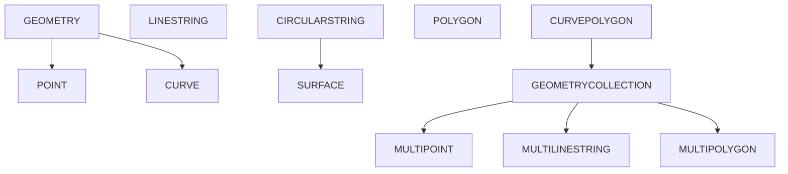

## 前置知识

建议先阅读以下内容再进入本文：

- [概述与标准](/sql/020-OverviewStandard)

## 1. 数据类型概述

SQL 数据类型定义了列、参数和表达式可以存储的数据种类及其操作。合理选择数据类型直接影响存储效率、查询性能和数据完整性。

### 1.1 数据类型分类

| 类别       | 典型类型                             | 用途           |
| ---------- | ------------------------------------ | -------------- |
| 数值类型   | INTEGER, DECIMAL, FLOAT, DOUBLE      | 数值计算与存储 |
| 字符串类型 | CHAR, VARCHAR, TEXT, CLOB            | 文本数据       |
| 日期时间   | DATE, TIME, TIMESTAMP, INTERVAL      | 时间相关数据   |
| 布尔类型   | BOOLEAN                              | 逻辑真/假      |
| JSON 类型  | JSON, JSONB                          | 半结构化数据   |
| 空间类型   | GEOMETRY, POINT, LINESTRING, POLYGON | 地理空间数据   |
| 二进制类型 | BLOB, BINARY, VARBINARY              | 二进制大对象   |

### 1.2 类型选择原则

- **最小化原则**：选择能满足需求的最小数据类型，减少存储和 I/O 开销
- **精确性原则**：货币等精确数值使用 `DECIMAL`，避免浮点精度丢失
- **兼容性原则**：考虑跨数据库的 SQL 标准兼容性

## 2. 数值类型

### 2.1 精确数值类型

| 类型          | 字节 | 范围                    | 说明         |
| ------------- | ---- | ----------------------- | ------------ |
| SMALLINT      | 2    | $-32768 \sim 32767$     | 小整数       |
| INTEGER / INT | 4    | $-2^{31} \sim 2^{31}-1$ | 标准整数     |
| BIGINT        | 8    | $-2^{63} \sim 2^{63}-1$ | 大整数       |
| DECIMAL(p, s) | 变长 | 取决于精度              | 精确小数     |
| NUMERIC(p, s) | 变长 | 同 DECIMAL              | SQL 标准别名 |

**DECIMAL 精度说明**：

- `p`（precision）：总位数，不含小数点，范围 1~38（标准）或更大（实现相关）
- `s`（scale）：小数位数，$0 \le s \le p$

```sql
-- 货币存储：精确到分
CREATE TABLE products (
    price DECIMAL(10, 2)  -- 最大 99999999.99
);

-- 科学测量：精确到微米
CREATE TABLE measurements (
    length DECIMAL(12, 6)  -- 最大 999999.999999
);
```

### 2.2 近似数值类型

| 类型             | 字节 | 精度      | 范围                                            |
| ---------------- | ---- | --------- | ----------------------------------------------- |
| REAL / FLOAT     | 4    | 6 位有效  | $-3.4 \times 10^{38} \sim 3.4 \times 10^{38}$   |
| DOUBLE PRECISION | 8    | 15 位有效 | $-1.7 \times 10^{308} \sim 1.7 \times 10^{308}$ |

> **注意**：浮点类型遵循 IEEE 754 标准，存在精度丢失问题。比较浮点数时需使用容差：

```sql
-- 错误：浮点等值比较
SELECT * FROM sensors WHERE reading = 0.1;

-- 正确：使用容差范围
SELECT * FROM sensors WHERE ABS(reading - 0.1) < 1e-9;
```

### 2.3 自增类型

```sql
-- SQL 标准自增
CREATE TABLE users (
    id INTEGER GENERATED ALWAYS AS IDENTITY PRIMARY KEY,
    name VARCHAR(100)
);

-- 兼容写法（MySQL AUTO_INCREMENT, PostgreSQL SERIAL）
CREATE TABLE orders (
    id BIGINT AUTO_INCREMENT PRIMARY KEY  -- MySQL
);
```

## 3. 字符串类型

### 3.1 定长与变长字符串

| 类型        | 最大长度 | 说明                    |
| ----------- | -------- | ----------------------- |
| CHAR(n)     | n 字符   | 定长，不足补空格        |
| VARCHAR(n)  | n 字符   | 变长，按实际存储        |
| TEXT / CLOB | 无限制   | 大文本，SQL 标准为 CLOB |

**CHAR vs VARCHAR 选择**：

- 长度恒定的数据（如国家代码 `CHAR(2)`、MD5 `CHAR(32)`）使用 `CHAR`
- 长度变化的数据使用 `VARCHAR`，避免尾部空格浪费

```sql
CREATE TABLE customers (
    country_code CHAR(2),        -- 固定2位国家代码
    name VARCHAR(100),           -- 变长姓名
    bio TEXT                     -- 不限长度简介
);
```

### 3.2 国家字符集类型

| 类型        | 说明                 |
| ----------- | -------------------- |
| NCHAR(n)    | 国家字符集定长字符串 |
| NVARCHAR(n) | 国家字符集变长字符串 |
| NCLOB       | 国家字符集大文本     |

```sql
-- 存储多语言文本
CREATE TABLE i18n_messages (
    msg_key VARCHAR(50),
    content_zh NVARCHAR(500),   -- 中文
    content_ja NVARCHAR(500)    -- 日文
);
```

### 3.3 字符集与排序规则

```sql
-- 指定字符集和排序规则
CREATE TABLE articles (
    title VARCHAR(200) CHARACTER SET utf8mb4 COLLATE utf8mb4_unicode_ci,
    content TEXT CHARACTER SET utf8mb4
);

-- 排序规则影响比较和排序
-- utf8mb4_general_ci: 不区分大小写，速度快
-- utf8mb4_unicode_ci: 不区分大小写，Unicode 正确排序
-- utf8mb4_bin: 区分大小写，二进制比较
```

## 4. 日期时间类型

### 4.1 标准日期时间类型

| 类型                     | 格式                      | 精度 | 范围                       |
| ------------------------ | ------------------------- | ---- | -------------------------- |
| DATE                     | YYYY-MM-DD                | 天   | 0001-01-01 ~ 9999-12-31    |
| TIME                     | HH:MM:SS[.ffffff]         | 微秒 | 00:00:00 ~ 23:59:59.999999 |
| TIMESTAMP                | YYYY-MM-DD HH:MM:SS[.fff] | 微秒 | 0001 ~ 9999 年             |
| TIME WITH TIME ZONE      | 含时区偏移                | 微秒 | —                          |
| TIMESTAMP WITH TIME ZONE | 含时区偏移                | 微秒 | —                          |

```sql
CREATE TABLE events (
    event_date DATE,
    event_time TIME(3),                    -- 精确到毫秒
    created_at TIMESTAMP WITH TIME ZONE    -- 含时区
);

-- 插入日期时间值
INSERT INTO events VALUES (
    DATE '2026-06-14',
    TIME '14:30:00.123',
    TIMESTAMP WITH TIME ZONE '2026-06-14 14:30:00+08:00'
);
```

### 4.2 INTERVAL 类型

`INTERVAL` 表示时间跨度，用于日期时间运算：

```sql
-- 年-月间隔
INTERVAL '3-2' YEAR TO MONTH     -- 3年2个月

-- 日-时间隔
INTERVAL '5 12:30:00' DAY TO SECOND  -- 5天12小时30分

-- 日期运算
SELECT
    DATE '2026-06-14' + INTERVAL '30' DAY AS thirty_days_later,
    TIMESTAMP '2026-06-14 10:00:00' - INTERVAL '2' HOUR AS two_hours_ago;
```

### 4.3 时区处理最佳实践

```sql
-- 推荐：存储 UTC 时间，查询时转换时区
CREATE TABLE logs (
    created_at TIMESTAMP WITH TIME ZONE DEFAULT CURRENT_TIMESTAMP
);

-- 查询时转换为本地时区
SELECT created_at AT TIME ZONE 'Asia/Shanghai' AS local_time
FROM logs;
```

## 5. JSON 类型

### 5.1 JSON 与 JSONB

| 特性     | JSON             | JSONB             |
| -------- | ---------------- | ----------------- |
| 存储     | 文本原样存储     | 二进制解析后存储  |
| 写入速度 | 快（无需解析）   | 慢（需解析转换）  |
| 查询速度 | 慢（每次需解析） | 快（已解析）      |
| 索引支持 | 有限             | 完整 GIN 索引支持 |
| 空格保留 | 保留             | 不保留            |
| 键顺序   | 保留             | 不保证            |

```sql
-- PostgreSQL JSONB
CREATE TABLE api_logs (
    id BIGSERIAL PRIMARY KEY,
    payload JSONB,
    created_at TIMESTAMP DEFAULT NOW()
);

-- 插入 JSON 数据
INSERT INTO api_logs (payload) VALUES (
    '{"user_id": 42, "action": "login", "meta": {"ip": "192.168.1.1"}}'
);

-- JSON 查询操作符
SELECT payload->>'user_id' AS user_id,          -- 文本提取
       payload->'meta'->>'ip' AS ip,            -- 嵌套提取
       jsonb_pretty(payload) AS formatted       -- 格式化输出
FROM api_logs
WHERE payload @> '{"action": "login"}'::jsonb;  -- 包含查询
```

### 5.2 JSON 路径查询（SQL:2016 标准）

```sql
-- SQL/JSON 路径表达式
SELECT *
FROM api_logs
WHERE payload ? '$.meta.ip ? (@ == "192.168.1.1")';

-- JSON_TABLE：将 JSON 转为关系表
SELECT jt.user_id, jt.action
FROM api_logs,
     JSON_TABLE(payload, '$' COLUMNS (
         user_id INTEGER PATH '$.user_id',
         action  VARCHAR(50) PATH '$.action'
     )) AS jt;
```

## 6. 空间数据类型

### 6.1 OGC 简单要素模型

SQL/MM 标准定义了空间数据类型层次：



### 6.2 空间类型使用

```sql
-- PostgreSQL + PostGIS
CREATE TABLE locations (
    id SERIAL PRIMARY KEY,
    name VARCHAR(100),
    geom GEOMETRY(Point, 4326)    -- SRID 4326 = WGS84
);

-- 插入空间数据
INSERT INTO locations (name, geom) VALUES (
    '天安门',
    ST_SetSRID(ST_MakePoint(116.3975, 39.9087), 4326)
);

-- 空间查询：3公里范围内的地点
SELECT name,
       ST_Distance(geom::geography,
                   ST_SetSRID(ST_MakePoint(116.4, 39.9), 4326)::geography
       ) AS distance_meters
FROM locations
WHERE ST_DWithin(
    geom::geography,
    ST_SetSRID(ST_MakePoint(116.4, 39.9), 4326)::geography,
    3000  -- 3公里
);
```

### 6.3 空间索引

```sql
-- 创建 GIST 空间索引
CREATE INDEX idx_locations_geom ON locations USING GIST (geom);

-- 空间操作符（使用索引）
SELECT * FROM locations
WHERE geom && ST_MakeEnvelope(116.3, 39.8, 116.5, 40.0, 4326);
```

## 7. 类型转换

### 7.1 显式转换

```sql
-- CAST 函数（SQL 标准）
SELECT CAST('123' AS INTEGER);
SELECT CAST(price AS VARCHAR(20));

-- 类型转换简写（PostgreSQL）
SELECT '123'::INTEGER;
SELECT created_at::DATE;

-- 格式化转换
SELECT TO_CHAR(created_at, 'YYYY-MM-DD HH24:MI:SS') AS formatted;
SELECT TO_NUMBER('1,234.56', '9G999D99');
```

### 7.2 隐式转换规则

数据库在以下场景自动进行类型转换：

1. **赋值转换**：插入值与列类型不匹配时
2. **比较转换**：不同类型比较时，通常向"更宽"类型转换
3. **运算转换**：如 `INTEGER + DECIMAL → DECIMAL`

```sql
-- 隐式转换示例
SELECT * FROM users WHERE id = '42';     -- '42' → 42
SELECT '2026-06-14'::DATE + 1;           -- DATE + INTEGER → DATE
```

> **最佳实践**：避免依赖隐式转换，显式使用 `CAST` 提高代码可读性和可移植性。
## 整数类型

**单行写法：定义 TINYINT 列**
`<列名> TINYINT`
```sql
-- 定义 TINYINT 类型列（1 字节，-128 到 127）
CREATE TABLE products (id INT, stock TINYINT);
```

**单行写法：定义 SMALLINT 列**
`<列名> SMALLINT`
```sql
-- 定义 SMALLINT 类型列（2 字节，-32768 到 32767）
CREATE TABLE products (id INT, quantity SMALLINT);
```

**单行写法：定义 INT 列**
`<列名> INT`
```sql
-- 定义 INT 类型列（4 字节，-2147483648 到 2147483647）
CREATE TABLE users (id INT, age INT);
```

**单行写法：定义 BIGINT 列**
`<列名> BIGINT`
```sql
-- 定义 BIGINT 类型列（8 字节，大范围整数）
CREATE TABLE orders (id BIGINT, user_id BIGINT);
```

**单行写法：定义无符号整数**
`<列名> INT UNSIGNED`
```sql
-- 定义无符号 INT 列（MySQL，0 到 4294967295）
CREATE TABLE products (id INT UNSIGNED, price INT UNSIGNED);
```

---

## 定点数与浮点数

**单行写法：定义 DECIMAL 列**
`<列名> DECIMAL(<精度>, <标度>)`
```sql
-- 定义 DECIMAL 类型列（精确小数，推荐用于金额）
CREATE TABLE products (id INT, price DECIMAL(10, 2));
```

**单行写法：定义 NUMERIC 列**
`<列名> NUMERIC(<精度>, <标度>)`
```sql
-- 定义 NUMERIC 类型列（等价于 DECIMAL）
CREATE TABLE accounts (id INT, balance NUMERIC(15, 2));
```

**单行写法：定义 FLOAT 列**
`<列名> FLOAT`
```sql
-- 定义 FLOAT 类型列（单精度浮点数，4 字节）
CREATE TABLE sensors (id INT, temperature FLOAT);
```

**单行写法：定义 DOUBLE 列**
`<列名> DOUBLE`
```sql
-- 定义 DOUBLE 类型列（双精度浮点数，8 字节）
CREATE TABLE measurements (id INT, value DOUBLE);
```

**单行写法：定义 REAL 列**
`<列名> REAL`
```sql
-- 定义 REAL 类型列（单精度浮点数）
CREATE TABLE sensors (id INT, temperature REAL);
```

---

## 字符串类型

**单行写法：定义 CHAR 列**
`<列名> CHAR(<长度>)`
```sql
-- 定义 CHAR 类型列（固定长度字符串）
CREATE TABLE users (id INT, gender CHAR(1));
```

**单行写法：定义 VARCHAR 列**
`<列名> VARCHAR(<最大长度>)`
```sql
-- 定义 VARCHAR 类型列（可变长度字符串）
CREATE TABLE users (id INT, name VARCHAR(100));
```

**单行写法：定义 TEXT 列**
`<列名> TEXT`
```sql
-- 定义 TEXT 类型列（大文本数据）
CREATE TABLE articles (id INT, content TEXT);
```

**单行写法：定义 PostgreSQL TEXT 列**
`<列名> TEXT`
```sql
-- PostgreSQL 中 TEXT 无长度限制
CREATE TABLE articles (id INT, content TEXT);
```

---

## 日期时间类型

**单行写法：定义 DATE 列**
`<列名> DATE`
```sql
-- 定义 DATE 类型列（仅日期，YYYY-MM-DD）
CREATE TABLE users (id INT, birth_date DATE);
```

**单行写法：定义 TIME 列**
`<列名> TIME`
```sql
-- 定义 TIME 类型列（仅时间，HH:MM:SS）
CREATE TABLE events (id INT, start_time TIME);
```

**单行写法：定义 DATETIME 列**
`<列名> DATETIME`
```sql
-- 定义 DATETIME 类型列（日期时间，MySQL）
CREATE TABLE orders (id INT, created_at DATETIME);
```

**单行写法：定义 TIMESTAMP 列**
`<列名> TIMESTAMP`
```sql
-- 定义 TIMESTAMP 类型列（时间戳）
CREATE TABLE logs (id INT, log_time TIMESTAMP);
```

**单行写法：定义带时区的 TIMESTAMP 列**
`<列名> TIMESTAMP WITH TIME ZONE`
```sql
-- 定义带时区的 TIMESTAMP 列（PostgreSQL）
CREATE TABLE events (id INT, event_time TIMESTAMP WITH TIME ZONE);
```

---

## 布尔类型

**单行写法：定义 BOOLEAN 列**
`<列名> BOOLEAN`
```sql
-- 定义 BOOLEAN 类型列（PostgreSQL）
CREATE TABLE users (id INT, is_active BOOLEAN);
```

**单行写法：MySQL 用 TINYINT 模拟 BOOLEAN**
`<列名> TINYINT(1)`
```sql
-- MySQL 用 TINYINT(1) 模拟布尔类型
CREATE TABLE users (id INT, is_active TINYINT(1));
```

---

## 二进制类型

**单行写法：定义 BLOB 列**
`<列名> BLOB`
```sql
-- 定义 BLOB 类型列（二进制大对象）
CREATE TABLE files (id INT, file_data BLOB);
```

**单行写法：定义 BYTEA 列**
`<列名> BYTEA`
```sql
-- 定义 BYTEA 类型列（PostgreSQL 二进制数据）
CREATE TABLE files (id INT, file_data BYTEA);
```

**单行写法：定义 VARBINARY 列**
`<列名> VARBINARY(<最大长度>)`
```sql
-- 定义 VARBINARY 类型列（可变长度二进制）
CREATE TABLE images (id INT, thumbnail VARBINARY(1024));
```

---

## JSON 类型

**单行写法：定义 JSON 列**
`<列名> JSON`
```sql
-- 定义 JSON 类型列（MySQL 5.7+/PostgreSQL）
CREATE TABLE users (id INT, preferences JSON);
```

**单行写法：定义 JSONB 列**
`<列名> JSONB`
```sql
-- 定义 JSONB 类型列（PostgreSQL，二进制 JSON，支持索引）
CREATE TABLE users (id INT, preferences JSONB);
```

---

## 枚举类型

**换行写法：PostgreSQL 创建枚举类型**
`CREATE TYPE <类型名> AS ENUM (<值 1>, <值 2>, ...)`
```sql
-- 创建订单状态枚举类型
CREATE TYPE order_status AS ENUM ('pending', 'processing', 'shipped', 'delivered');
```

**单行写法：使用枚举类型**
`<列名> <枚举类型名>`
```sql
-- 使用枚举类型定义列
CREATE TABLE orders (id INT, status order_status);
```

**单行写法：MySQL ENUM 类型**
`<列名> ENUM(<值 1>, <值 2>, ...)`
```sql
-- MySQL 直接在列定义中使用 ENUM
CREATE TABLE orders (id INT, status ENUM('pending', 'processing', 'shipped', 'delivered'));
```

---

## 数组类型

**单行写法：PostgreSQL 数组类型**
`<列名> <类型>[]`
```sql
-- 定义整数数组列
CREATE TABLE teams (id INT, member_ids INT[]);
```

**单行写法：定义字符串数组列**
`<列名> VARCHAR[]`
```sql
-- 定义字符串数组列
CREATE TABLE articles (id INT, tags VARCHAR[]);
```

---

## UUID 类型

**单行写法：定义 UUID 列**
`<列名> UUID`
```sql
-- 定义 UUID 类型列（PostgreSQL）
CREATE TABLE users (id UUID PRIMARY KEY, name VARCHAR(100));
```

**单行写法：定义默认 UUID 列**
`<列名> UUID DEFAULT gen_random_uuid()`
```sql
-- 定义默认生成 UUID 的列
CREATE TABLE users (id UUID DEFAULT gen_random_uuid() PRIMARY KEY, name VARCHAR(100));
```

---

## 自增类型

**单行写法：MySQL AUTO_INCREMENT**
`<列名> INT AUTO_INCREMENT PRIMARY KEY`
```sql
-- MySQL 自增主键
CREATE TABLE users (id INT AUTO_INCREMENT PRIMARY KEY, name VARCHAR(100));
```

**单行写法：PostgreSQL SERIAL**
`<列名> SERIAL PRIMARY KEY`
```sql
-- PostgreSQL 自增主键
CREATE TABLE users (id SERIAL PRIMARY KEY, name VARCHAR(100));
```

**单行写法：PostgreSQL BIGSERIAL**
`<列名> BIGSERIAL PRIMARY KEY`
```sql
-- PostgreSQL 大范围自增主键
CREATE TABLE orders (id BIGSERIAL PRIMARY KEY, user_id BIGINT);
```

**单行写法：SQL Server IDENTITY**
`<列名> INT IDENTITY(1, 1) PRIMARY KEY`
```sql
-- SQL Server 自增主键
CREATE TABLE users (id INT IDENTITY(1, 1) PRIMARY KEY, name VARCHAR(100));
```

---

## 货币类型

**单行写法：定义 MONEY 列**
`<列名> MONEY`
```sql
-- 定义 MONEY 类型列（PostgreSQL）
CREATE TABLE products (id INT, price MONEY);
```

**单行写法：推荐用 DECIMAL 存储金额**
`<列名> DECIMAL(<精度>, 2)`
```sql
-- 推荐使用 DECIMAL 存储金额
CREATE TABLE products (id INT, price DECIMAL(10, 2));
```
