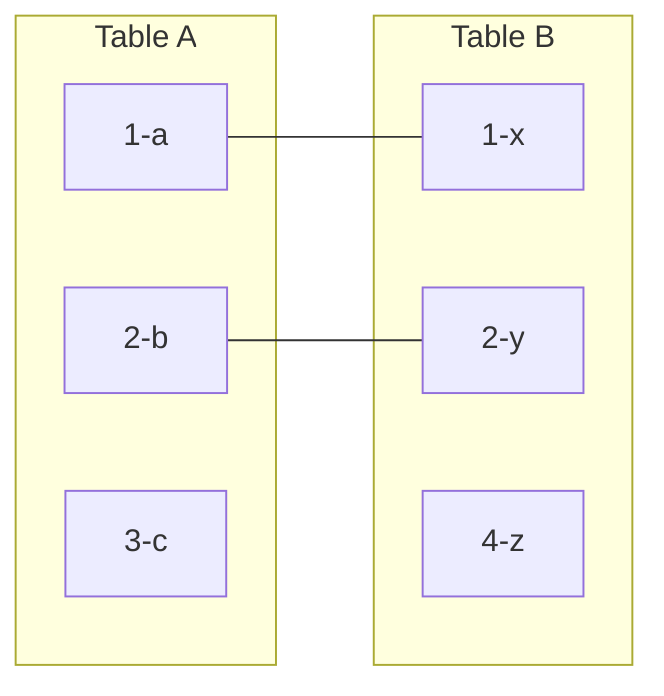

## 1. 场景：数据拆在多张表里，问题却要一次回答

关系数据库把数据拆进不同的表（第 10 篇讲过为什么），但业务问题从来不按表来问。这周内容组提了三个：

1. "每档节目配了几期？把数字挂在节目名后面。"——需要 `shows` 与 `episodes` **按关系拼起来**。
2. "有几个刚开的节目还没上架任何单集？列出来催一下。"——需要**找出拼不上的行**。
3. "做个分类 x 日期的统计骨架，没数据的日子也要占位。"——需要**两表全排列**。

三个问题对应三种 JOIN：内连接、外连接的反向用法、交叉连接。这篇就用回声FM的三张表把 JOIN 一次做全。

先建立全景图——两表各三行、只有部分键能对上时，五种 JOIN 各自留下什么：



- INNER JOIN：1-a-x, 2-b-y（交集）
- LEFT JOIN：1-a-x, 2-b-y, 3-c-NULL（A 全部 + 匹配的 B）
- RIGHT JOIN：1-a-x, 2-b-y, NULL-4-z（B 全部 + 匹配的 A）
- FULL JOIN：1-a-x, 2-b-y, 3-c-NULL, NULL-4-z（并集）
- CROSS JOIN：3 x 3 = 9 行（笛卡尔积）

记住这张图，后面每一节都在放大其中一种 JOIN 的细节。

### 1.1 练习场数据

沿用[数据查询基础](/sql/040-DataQueryBasics)的三张表。为了演示"拼不上"，本文给 `shows` 补一档还没有单集的新节目：

```sql
INSERT INTO shows VALUES (6, '科技早报', '科技', '阿澜', FALSE);
```

此时 `shows` 6 行、`episodes` 6 行，其中第 106 期时长为 NULL，第 105/106 期没有任何评分（若你已按[聚合函数](/sql/060-AggregateFunction)建了 `ratings` 表）。

## 2. INNER JOIN：只留拼得上的行

```sql
SELECT s.title AS show_title, e.title AS episode_title, e.play_count
FROM shows s
JOIN episodes e ON e.show_id = s.id;
```

`JOIN` 是 `INNER JOIN` 的简写。逐行理解：从 `shows` 拿一行，去 `episodes` 里找所有 `show_id` 等于这行 `id` 的行，一对多就输出多行。结果 6 行——单集都在，节目"科技早报"因为没有单集，**一行都不出现**。

三个立即可用的要点：

- **表别名**：`shows s` 给表起短名，多表查询里必须用别名前缀区分同名列。别名一定义，原表名在本次查询里就"退役"了。
- **ON 后面是匹配条件**，绝大多数时候是"外键 = 主键"的等值条件。条件写错不报错，只是拼出错误结果——JOIN 类 bug 的隐蔽性全在于此。
- **非等值连接**也是合法 JOIN：ON 里可以放 `BETWEEN`、`<` 等任意条件。比如给每期打时长档位：

```sql
SELECT e.title, g.grade
FROM episodes e
JOIN (
  VALUES (0, 60, '短篇'), (60, 100, '标准'), (100, 9999, '长篇')
) AS g(lo, hi, grade) ON e.duration_min >= g.lo AND e.duration_min < g.hi;
```

用一张"档位表"代替一长串 CASE WHEN，档位规则变了只改数据不改 SQL。PostgreSQL 原生支持 `VALUES ... AS 别名(列名)`；MySQL 8.0.19+ 也能在 FROM 里用表值构造器，但别名写法是 `(VALUES ROW(0,60,'短篇'), ...) AS g(lo, hi, grade)`。

### 2.1 三表连接：链式拼装

```sql
SELECT s.title, e.title, r.stars
FROM shows s
JOIN episodes e ON e.show_id = s.id
JOIN ratings  r ON r.episode_id = e.id
WHERE s.category = '科技';
```

规则：每一层 JOIN 都有自己的 ON，别混；驱动顺序（先拼谁）由优化器决定，你的书写顺序只是逻辑声明。

## 3. LEFT JOIN：左表一行不能少

问题 1 的完整版是"**每档**节目配了几期"——包括零期的。INNER JOIN 会把零期的节目挤掉，LEFT JOIN 不会：

```sql
SELECT s.title, COUNT(e.id) AS episode_cnt
FROM shows s
LEFT JOIN episodes e ON e.show_id = s.id
GROUP BY s.id, s.title
ORDER BY episode_cnt;
```

```
title       | episode_cnt
------------|------------
科技早报    | 0
城市漫步指南 | 1
深夜书桌    | 1
增长手记    | 1
代码与咖啡  | 2
芯片江湖    | 1
```

LEFT JOIN 的语义：**左表全部行都保留，右表拼不上时用一行全 NULL 的"占位行"补位**。两个细节决定这类查询的对错：

- 计数用 `COUNT(e.id)` 而不是 `COUNT(*)`：占位行也是一行，`COUNT(*)` 会把零期节目数成 1（回忆[聚合函数](/sql/060-AggregateFunction)的 NULL 规则——`COUNT(列)` 跳过 NULL）。
- `GROUP BY s.id, s.title`：按主键分组保证组不重，SELECT 的 title 依赖函数依赖于 id，两种主流数据库都接受。

### 3.1 反连接：专门找"拼不上"的行

问题 2"哪些节目还没有单集"，把 LEFT JOIN 的占位行挑出来就是答案：

```sql
SELECT s.title
FROM shows s
LEFT JOIN episodes e ON e.show_id = s.id
WHERE e.id IS NULL;
-- 结果：科技早报
```

"左表有、右表没有"是这个模式的固定形状：`LEFT JOIN ... WHERE 右表.键 IS NULL`。它和 `NOT EXISTS` 语义等价、通常性能也相当，工程上的选型讨论见[半连接与反半连接](/sql/180-SemiAntiJoin)。

### 3.2 第一大坑：右表条件写进 WHERE，LEFT JOIN 白写了

内容组追问："每档节目的**已完结**单集有几期？"（假设 `duration_min` 非空代表已完结）。直觉写法是错的：

```sql
-- 错误：零期节目又消失了
SELECT s.title, COUNT(e.id) AS done_cnt
FROM shows s
LEFT JOIN episodes e ON e.show_id = s.id
WHERE e.duration_min IS NOT NULL
GROUP BY s.id, s.title;

-- 正确：右表的条件放进 ON
SELECT s.title, COUNT(e.id) AS done_cnt
FROM shows s
LEFT JOIN episodes e ON e.show_id = s.id AND e.duration_min IS NOT NULL
GROUP BY s.id, s.title;
```

原理在执行顺序：WHERE 在 JOIN **之后**跑。占位行的 `duration_min` 是 NULL，`NULL IS NOT NULL` 为假，占位行被 WHERE 整行删掉——LEFT JOIN 退化回 INNER JOIN。而写在 ON 里的条件只决定"右表哪些行有资格来拼"，拼不上照样补占位行。

自检口诀：**外连接时，左表条件放哪都行，右表条件只能放 ON**。（INNER JOIN 里 ON 和 WHERE 逻辑等价，随手感放；正因为如此，从 INNER 改成 LEFT 时这个坑才高频爆发。）

## 4. RIGHT JOIN 与 FULL JOIN

### 4.1 RIGHT JOIN：换个方向的 LEFT JOIN

```sql
SELECT s.title, e.title
FROM shows s
RIGHT JOIN episodes e ON e.show_id = s.id;
```

保留右表（episodes）全部行。它与 `FROM episodes LEFT JOIN shows ...` 完全等价，只是表的书写顺序不同。团队协作里建议**统一用 LEFT JOIN**（从主表出发从左往右读更自然），RIGHT JOIN 见到能读懂即可。

### 4.2 FULL JOIN：两边都不能少，MySQL 没有

对账场景："节目清单和单集清单，哪边有孤儿？"——没有单集的节目（左孤儿）和理论上不该存在、却挂着无效 show_id 的单集（右孤儿），一次找全：

```sql
SELECT s.title AS show_title, e.title AS episode_title
FROM shows s
FULL JOIN episodes e ON e.show_id = s.id
WHERE s.id IS NULL OR e.id IS NULL;
```

FULL JOIN = LEFT JOIN 的结果 + 右表多出来的行。PostgreSQL、SQL Server、Oracle、SQLite 3.39+ 都支持；**MySQL 至今没有 FULL JOIN**，用两个方向的外连接拼：

```sql
-- 写法一：UNION 自动去重，简单直接
SELECT s.title, e.title
FROM shows s LEFT JOIN episodes e ON e.show_id = s.id
UNION
SELECT s.title, e.title
FROM shows s RIGHT JOIN episodes e ON e.show_id = s.id;

-- 写法二：UNION ALL 不去重，但只补右孤儿，更快
SELECT s.title, e.title
FROM shows s LEFT JOIN episodes e ON e.show_id = s.id
UNION ALL
SELECT s.title, e.title
FROM shows s RIGHT JOIN episodes e ON e.show_id = s.id
WHERE s.id IS NULL;
```

写法一靠 UNION 的去重抵消"两边都匹配"的重复行；写法二第二段只保留左连接漏掉的行，不产生重复，大表上更快。两段 SELECT 的列必须一一对应，这是[集合操作](/sql/210-SetOperation)的规矩。

## 5. CROSS JOIN：全排列，骨架与事故

问题 3 要"分类 x 日期"的完整矩阵，哪怕某天某分类没有数据也要占位——这正是笛卡尔积的用武之地：

```sql
-- PostgreSQL：现造一个 9 月的日期序列
SELECT s.category, d.dt
FROM (SELECT DISTINCT category FROM shows) s
CROSS JOIN generate_series('2026-09-01'::date, '2026-09-07'::date, '1 day') AS d(dt)
ORDER BY s.category, d.dt;
```

3 个分类 x 7 天 = 21 行，之后 LEFT JOIN 事实表补零，报表就不缺行了。CROSS JOIN 没有_ON，行数恒为两表行数的乘积——这也意味着它是事故高发区：

```sql
-- 事故写法：老式逗号连接，漏写 WHERE 条件就是全排列
SELECT s.title, e.title FROM shows s, episodes e;   -- 7 x 6 = 42 行垃圾结果
```

历史上 SQL 用逗号连接 + WHERE 写 JOIN，现代代码请一律显式 `JOIN ... ON`：语法上不写 ON 的 INNER JOIN 很多数据库直接报错，事故在编译期就被拦住。

## 6. 拼完之后：行数为什么不对

JOIN 类查询最常被追问"行数怎么变多了/变少了"。三套解释，对号入座：

### 6.1 变少：INNER JOIN 挤掉了拼不上的行

正常语义。需要保留就用 LEFT/FULL JOIN。

### 6.2 变多：一对多连接的行数膨胀

```sql
-- 想给每个单集旁边挂上"所属分类"，再统计每个分类的播放量
SELECT s.category, SUM(e.play_count) AS total
FROM shows s
JOIN episodes e ON e.show_id = s.id
GROUP BY s.category;
-- 正确：一个单集只属于一个节目，无膨胀

-- 但如果反过来：从单集表统计"每集被多少节目引用"，一对多方向变了
-- shows 与 episodes 是 1:N，从 N 侧往 1 侧 JOIN 安全；
-- 从 1 侧往 N 侧 JOIN 再聚合，粒度就翻了倍
```

判断标准：**JOIN 之后聚合，先想清楚"一行代表什么"**。若左右两边是多对多（比如听众 x 单集的收听记录连上会员订单），聚合前必须先把某一侧去重或预聚合：

```sql
-- 先把收听明细按单集聚合，再 JOIN，杜绝膨胀
WITH plays_per_ep AS (
  SELECT episode_id, COUNT(*) AS play_cnt FROM listen_events GROUP BY episode_id
)
SELECT e.title, p.play_cnt
FROM episodes e JOIN plays_per_ep p ON p.episode_id = e.id;
```

### 6.3 变多：无意的 CROSS JOIN

逗号连接漏条件、ON 条件列错（拿两个不相干的列做等值），都会产出笛卡尔积。结果行数异常时第一反应：`SELECT COUNT(*)` 对比连接前后行数。

## 7. 数据库怎么执行 JOIN（够用版）

优化器手里有三种算法，按代价自动选：

| 算法           | 一句话原理                       | 适合场景           |
| -------------- | -------------------------------- | ------------------ |
| Nested Loop    | 外表一行行，去内表里找匹配       | 外表小、内表连接列有索引 |
| Hash Join      | 小表建哈希表，大表逐行探测       | 大表等值连接、无索引 |
| Merge Join     | 两边按连接键排序后归并           | 已排序或需排序输出 |

方言事实更新一下旧印象：**MySQL 8.0.18 起有了 Hash Join**，8.0.20 移除了旧的 Block Nested-Loop——"MySQL 只会嵌套循环"的说法已过时；PostgreSQL 三种算法一直都有，靠代价模型自动挑。你需要做的是给连接列建索引（`episodes(show_id)`、`ratings(episode_id)` 这类外键列），让 Nested Loop 走得快，剩下交给优化器。

多表连接（超过 5-7 张）时执行计划的搜索空间指数增长，人也读不懂。工程做法：先用 CTE 把"两表关系"算成中间结果，再和第三张表拼——复杂连接拆步骤的写法见[CTE](/sql/230-CTE)。

## 8. 坑点清单与自检

1. **外连接的右表条件进了 WHERE**：LEFT JOIN 静默退化为 INNER JOIN。口诀：右表条件只能放 ON。
2. **零匹配组被数成 1**：LEFT JOIN 后计数用 `COUNT(右表.列)`，别用 `COUNT(*)`。
3. **聚合结果翻倍**：一对多连接后再 SUM/AVG，先问"一行代表什么"，必要时预聚合再连。
4. **逗号连接漏条件**：显式 JOIN ... ON，让事故在语法期暴露。
5. **MySQL 写了 FULL JOIN**：直接语法错误。用第 4.2 节两种模拟写法。
6. **ON 条件列错**：不报错只出鬼结果。写 JOIN 前先确认两表的关联列语义（外键 vs 主键）。
7. **NATURAL JOIN / USING 的隐式行为**：按全部同名列自动匹配，表结构一变结果就变，团队代码里禁用，原理见[自然连接与 USING](/sql/160-NaturalJoinUsing)。
8. **ON 条件里包函数**：`ON LOWER(u.email) = LOWER(o.email)` 让两边的索引都失效，大表上一次全表对全表的扫描。正确姿势是保持条件裸列等值；大小写问题用表达式索引或统一入库口径解决。
9. **JOIN 表数量失控**：单条查询 5-7 张表以上，执行计划搜索空间指数增长、人也读不懂——先拆 CTE 分步，再拼装（见[CTE](/sql/230-CTE)）。

## 9. 练习

基于回声FM的表（含本文补的第 6 档节目）：

1. 列出每个分类的节目数，分类下没有节目也要出现 0（本数据里每类都有，想想为什么结果是 3/2/1——提示：DISTINCT category 只有三行）。
2. 找出没有任何评分的单集（LEFT JOIN 反连接），再对比 `NOT EXISTS` 写法。
3. 每个主播名下"已上架单集"（时长非空）的期数，零期的主播也要出现。
4. 用 CROSS JOIN 生成"主播 x 星期一至星期日"的 7 行 x 主播数 的排班骨架。
5. （对账题）构造一条会行数膨胀的错误聚合，然后用"先聚合再 JOIN"修复它，前后各跑一次 COUNT 验证。
6. （思考题）`LEFT JOIN b ON a.id = b.a_id WHERE b.col = 1` 与 `LEFT JOIN b ON a.id = b.a_id AND b.col = 1` 结果何时相同？何时不同？

## 下一步

- [半连接与反半连接](/sql/180-SemiAntiJoin)：EXISTS / NOT EXISTS 与反连接的选型细节。
- [自连接](/sql/170-SelfJoin)：同一张表自己拼自己：层级、配对、去重。
- [自然连接与 USING](/sql/160-NaturalJoinUsing)：同名列连接的简写与陷阱。
- [CTE 公用表表达式](/sql/230-CTE)：把多表大查询拆成可读的流水线。
