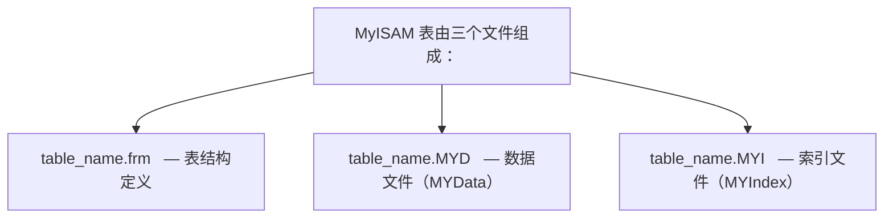

## 1. MyISAM 概述

MyISAM 是 MySQL 最早的默认存储引擎（5.5 之前），以简单高效著称，但不支持事务和行级锁。

### 1.1 核心特性

| 特性     | 说明                         |
| -------- | ---------------------------- |
| 事务支持 | 不支持                       |
| 锁粒度   | 表级锁                       |
| 外键     | 不支持                       |
| 崩溃恢复 | 需要手动修复（REPAIR TABLE） |
| 全文索引 | 支持                         |
| 空间索引 | 支持                         |
| 压缩表   | 支持（myisampack）           |
| MVCC     | 不支持                       |

### 1.2 存储文件



## 2. 表级锁机制

### 2.1 锁类型

| 锁类型 | 说明                 |
| ------ | -------------------- |
| 读锁   | 共享锁，多个读可并发 |
| 写锁   | 排他锁，独占表       |

### 2.2 锁兼容性

|      | 读锁 | 写锁 |
| ---- | ---- | ---- |
| 读锁 |      |      |
| 写锁 |      |      |

```sql
-- 手动加锁
LOCK TABLES employees READ;     -- 读锁
LOCK TABLES employees WRITE;    -- 写锁
UNLOCK TABLES;                  -- 释放所有锁

-- MyISAM 写操作自动加写锁
INSERT INTO myisam_table VALUES (1, 'test');
-- 整个表被锁定，其他连接无法读写
```

### 2.3 并发插入

```sql
-- MyISAM 支持并发插入（CONCURRENT INSERT）
-- 条件：表没有空洞（未删除过行）或使用动态行格式

-- 设置并发插入
ALTER TABLE myisam_table CONCURRENT_INSERT = 1;  -- 默认
-- = 0：禁止并发插入
-- = 1：无空洞时允许
-- = 2：始终允许（在表末尾插入）
```

## 3. 行格式

### 3.1 静态行格式（FIXED）

```sql
-- 所有列使用定长类型时使用静态行格式
CREATE TABLE fixed_table (
    id    INT NOT NULL,
    name  CHAR(50) NOT NULL,
    age   SMALLINT NOT NULL
) ENGINE = MyISAM ROW_FORMAT = FIXED;

-- 特点：
-- - 每行长度固定，查找速度快
-- - 可直接计算行位置
-- - 空间利用率低
```

### 3.2 动态行格式（DYNAMIC）

```sql
-- 包含变长列时使用动态行格式
CREATE TABLE dynamic_table (
    id    INT NOT NULL,
    name  VARCHAR(200),
    bio   TEXT
) ENGINE = MyISAM ROW_FORMAT = DYNAMIC;

-- 特点：
-- - 行长度可变，空间利用率高
-- - 更新可能导致行碎片
-- - 需要定期 OPTIMIZE TABLE
```

### 3.3 压缩行格式（COMPRESSED）

```bash
# 使用 myisampack 压缩只读表
myisampack table_name

# 压缩后表只读，空间节省 40%-70%
```

## 4. 全文索引

```sql
-- MyISAM 原生支持全文索引
CREATE FULLTEXT INDEX idx_content ON articles(title, content);

SELECT * FROM articles
WHERE MATCH(title, content) AGAINST('MySQL 索引');

-- 布尔模式
SELECT * FROM articles
WHERE MATCH(title, content) AGAINST('+MySQL +索引 -优化' IN BOOLEAN MODE);
```

## 5. 崩溃恢复

```sql
-- 检查表
CHECK TABLE myisam_table;

-- 修复表
REPAIR TABLE myisam_table;
REPAIR TABLE myisam_table EXTENDED;  -- 更彻底的修复

-- 优化表（消除碎片）
OPTIMIZE TABLE myisam_table;
```

## 6. MyISAM vs InnoDB

| 特性      | MyISAM           | InnoDB         |
| --------- | ---------------- | -------------- |
| 事务      | 不支持           | 支持           |
| 锁粒度    | 表级锁           | 行级锁         |
| 外键      | 不支持           | 支持           |
| 崩溃恢复  | 手动修复         | 自动恢复       |
| MVCC      | 不支持           | 支持           |
| 全文索引  | 支持             | 5.6+ 支持      |
| COUNT(\*) | 极快（存储行数） | 需要扫描       |
| 适用场景  | 读密集、不需事务 | 通用、事务场景 |

## 7. 适用场景

```sql
-- 适合 MyISAM 的场景：
-- 1. 只读或读多写少的表
-- 2. 不需要事务的日志表
-- 3. 需要全文索引（MySQL 5.5 之前）
-- 4. COUNT(*) 频繁且不需要精确的统计

-- 不适合 MyISAM 的场景：
-- 1. 需要事务的 OLTP 系统
-- 2. 高并发写入
-- 3. 需要外键约束
-- 4. 对数据安全要求高
```
## 引擎查看

**基本写法：查看服务器支持的引擎**
`SHOW ENGINES;`

```sql
-- 查看所有存储引擎及默认引擎
SHOW ENGINES;
```

**基本写法：查看当前默认引擎**
`SHOW VARIABLES LIKE 'default_storage_engine';`

```sql
-- 查看默认存储引擎（MySQL 8.0+ 默认 InnoDB）
SHOW VARIABLES LIKE 'default_storage_engine';
```

**基本写法：查看表使用的引擎**
`SHOW TABLE STATUS FROM <数据库名> [LIKE '<表名>'];`

```sql
-- 查看 mydb 库所有表的引擎
SHOW TABLE STATUS FROM mydb;
-- 查看指定表引擎
SHOW TABLE STATUS FROM mydb LIKE 'users';
```

---

## 引擎指定与修改

**基本写法：建表时指定引擎**
`CREATE TABLE <表名> (...) ENGINE = <引擎名>;`

```sql
-- 创建 InnoDB 表（默认）
CREATE TABLE orders (
  id BIGINT PRIMARY KEY,
  amount DECIMAL(10,2)
) ENGINE = InnoDB;

-- 创建 MyISAM 表（只读分析场景）
CREATE TABLE logs (
  id BIGINT PRIMARY KEY,
  msg TEXT
) ENGINE = MyISAM;
```

**基本写法：修改表引擎**
`ALTER TABLE <表名> ENGINE = <新引擎>;`

```sql
-- 将 MyISAM 表转为 InnoDB（支持事务）
ALTER TABLE logs ENGINE = InnoDB;
```

---

## InnoDB 配置

**基本写法：查看 InnoDB 状态**
`SHOW ENGINE INNODB STATUS;`

```sql
-- 查看 InnoDB 内部状态（锁、死锁、缓冲池等）
SHOW ENGINE INNODB STATUS\G
```

**基本写法：查看 InnoDB 缓冲池状态**
`SELECT * FROM information_schema.INNODB_BUFFER_POOL_STATS;`

```sql
-- 查看缓冲池命中率与页信息
SELECT
  pool_id, pool_size, free_buffers, database_pages,
  hit_rate FROM information_schema.INNODB_BUFFER_POOL_STATS;
```

**基本写法：查看 InnoDB 数据字典**
`SELECT * FROM information_schema.INNODB_TABLES WHERE name LIKE '<库>/<表>';`

```sql
-- 查看 InnoDB 内部表元数据
SELECT * FROM information_schema.INNODB_TABLES WHERE name LIKE 'mydb/users';
```

---

## 引擎特性对比命令

**基本写法：查看表行格式与特性**
`SHOW TABLE STATUS FROM <库> LIKE '<表>'\G`

```sql
-- 查看 orders 表的行格式、数据长度、索引长度等
SHOW TABLE STATUS FROM mydb LIKE 'orders'\G
```

**基本写法：查看 InnoDB 页大小**
`SHOW VARIABLES LIKE 'innodb_page_size';`

```sql
-- 查看 InnoDB 页大小（默认 16K）
SHOW VARIABLES LIKE 'innodb_page_size';
```

---

## MyISAM 与 MEMORY 操作

**基本写法：MyISAM 表检查**
`CHECK TABLE <表名> [QUICK|FAST|MEDIUM|EXTENDED];`

```sql
-- 检查 MyISAM 表完整性
CHECK TABLE logs MEDIUM;
```

**基本写法：MyISAM 表修复**
`REPAIR TABLE <表名> [QUICK|EXTENDED];`

```sql
-- 修复损坏的 MyISAM 表
REPAIR TABLE logs EXTENDED;
```

**基本写法：优化表（回收空间）**
`OPTIMIZE TABLE <表名> [, <表2> ...];`

```sql
-- 优化表回收碎片空间（8.4 需 OPTIMIZE_LOCAL_TABLE 权限才可免 binlog）
OPTIMIZE TABLE users, orders;
```

**基本写法：MEMORY 引擎建表**
`CREATE TABLE <表名> (...) ENGINE = MEMORY [MAX_ROWS = <行数>];`

```sql
-- 创建内存表（数据不持久化，重启丢失）
CREATE TABLE session_cache (
  sid VARCHAR(64) PRIMARY KEY,
  data TEXT
) ENGINE = MEMORY MAX_ROWS = 10000;
```
