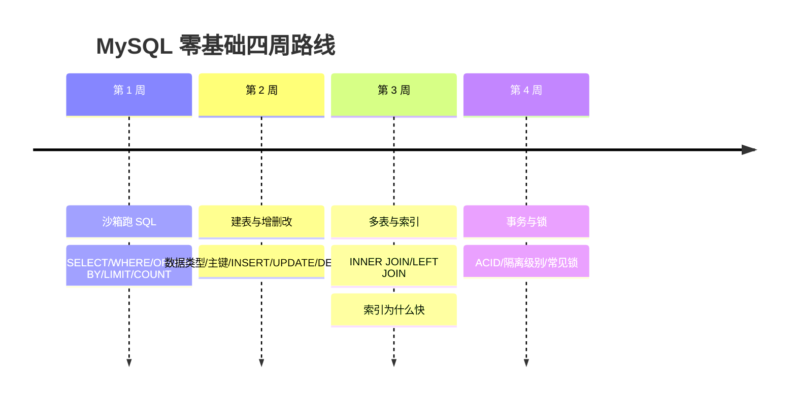

## 全景：这个模块怎么学

MySQL 模块 90 多篇文档大致按"入门 SQL → 建表设计 → 索引 → 查询优化 → 事务锁 → 日志备份 → 复制高可用 → 架构扩展 → 安全运维"排列，**文件编号即顺序**。但零基础学习者不应该通读——正确姿势是先走完下面的四周主线（覆盖入门 20%），剩下的 80% 按需查阅（文末地图）。

## 第一周：先跑起来（约 3 到 4 小时）

目标：**让 SQL 从"听说"变成"手感"**。

1. [SQL 沙箱练习](/mysql/040-SQLPlayground)：在线环境跑通 10 个练习，不需要装任何东西；
2. [数据库设计与 MySQL 概述](/mysql/050-MySQLOverviewDatabaseDesign) 开头的"第一句 SQL"；
3. [DQL 数据查询](/mysql/120-DQL) 前半：SELECT、WHERE、ORDER BY、LIMIT、COUNT 五个动作；
4. 想要本地环境再看 [环境搭建](/mysql/060-MySQLEnvSetup)（第一周可跳过）。

**验收**：不看教程，独立写出"查询年龄大于 18 的用户，按年龄倒序取前 5 条"。

## 第二周：会建表、会增删改（约 4 到 6 小时）

目标：从"用别人的表"到"设计自己的表"。

1. [数据类型与约束](/mysql/070-MySQLDataTypeConstraint)：第一遍只学 INT/VARCHAR/DATE 三种类型与主键/非空/默认值三种约束；
2. [DDL 数据定义](/mysql/080-DDL)：CREATE TABLE 与 ALTER TABLE；
3. [DML 数据操作](/mysql/100-DML)：INSERT/UPDATE/DELETE，**血泪重点：UPDATE 与 DELETE 必须带 WHERE，执行前先用 SELECT 验证条件**。

**验收**：从零创建一张 `students` 表（含主键与默认值），完成一次完整的增删改查，并解释"为什么删除前要先 SELECT"。

## 第三周：多表查询与索引（约 4 到 6 小时）

目标：理解"关系"数据库的关系二字。

1. [多表 JOIN 详解](/mysql/140-MultiTableJoinDetailed)：第一遍只学 INNER JOIN 与 LEFT JOIN 的语义差异；
2. [聚簇索引与二级索引](/mysql/220-ClusteredIndexSecondaryIndex)：索引是什么、B+ 树为什么快、回表是什么；
3. 遇到语法问题随时查 [速查手册](/mysql/890-MySQLQuickLookup)。

**验收**：能口头解释 INNER JOIN 与 LEFT JOIN 的区别（各举一个数据例子），并能回答"为什么加索引能快、代价是什么"。

## 第四周：事务与锁（约 3 到 4 小时）

目标：建立"并发之下数据为什么不会乱"的第一层理解。

1. [事务与隔离级别](/mysql/420-TransactionIsolationImplementation)：ACID 四特性、四种隔离级别分别挡住什么异常；
2. [锁分类](/mysql/450-LockClassification)：全局锁/表锁/行锁的粒度谱系；
3. [事务与锁机制](/mysql/460-TransactionLockMechanism)：两者如何配合。

**验收**：能说出脏读、不可重复读、幻读的定义，并指出 MySQL 默认的 REPEATABLE READ 解决了哪些。

## 入门之后：全模块主题地图

四周主线之后，按你的方向选路深入。每个主题列出该主题的全部文档编号（配合本模块文件列表按图索骥）：

| 主题方向 | 文档编号 | 适合谁、什么时候学 |
| --- | --- | --- |
| SQL 进阶（函数/子查询/聚合） | 130、150、160、360 至 390 | 写复杂报表、后端开发日常 |
| 索引深入 | 210 至 300、310 至 330、400 | 后端面试与调优必修 |
| 查询优化与执行计划 | 320 至 340、350、360 至 400 | 性能问题排查期 |
| 事务、锁与 MVCC | 410、420 至 480 | 后端进阶与面试核心 |
| 日志体系与备份恢复 | 490 至 550、560 至 580 | 运维向、DBA 向 |
| 复制与高可用 | 590 至 650 | 架构向 |
| 分区与分库分表 | 660 至 680 | 数据量上来之后 |
| 权限与安全 | 690 至 700、710 至 760 | 上线前必修安全基线 |
| 存储过程/触发器/定时任务 | 770 至 790 | 按需，慎用于业务逻辑 |
| JSON 与新特性（8.0+/9.x） | 800 至 810、820、830、840 | 现代 MySQL 特性补全 |
| 配置运维与调优 | 850、860 | 自建服务器时 |
| 实战综合 | 870、880、890 至 920 | 项目设计与日常速查 |

学习顺序建议（配合 [数据库路线](/roadmap/100-DatabaseRoute)）：入门四周 → SQL 进阶 → 索引深入 → 事务锁 → 其余按岗位需要。

## 常见困惑

**"四周学完能找工作吗？"**——四周是"会用"（能写业务 SQL、理解基本原理），离面试标准还差索引原理、事务 MVCC、优化实战三座山，对应地图里的三个主题，通常再需一到两个月。

**"要不要先学 SQL 通用语法再学 MySQL？"**——推荐本模块的路径：以 MySQL 为载体直接上手，方言差异（如与 PostgreSQL 的差异）在有体感之后对比着学效率最高。纯语法层面另有 [SQL 模块](/sql/010-WhatIsDatabase) 可交叉参考。

**"文档之间的编号为什么有大空洞？"**——历史裁剪留下的编号空洞，属正常现象，不影响顺序。

## 检验清单

- 知道本模块"文件编号即学习顺序"与四周主线的安排；
- 已把四周的验收标准抄进自己的学习计划；
- 能在主题地图里指出"索引深入"与"事务锁"两个主题的位置——它们是后续最重要的两块。

## 下一步

按第一周计划开始：进入 [SQL 沙箱练习](/mysql/040-SQLPlayground)，十分钟内跑出你的第一条查询。
