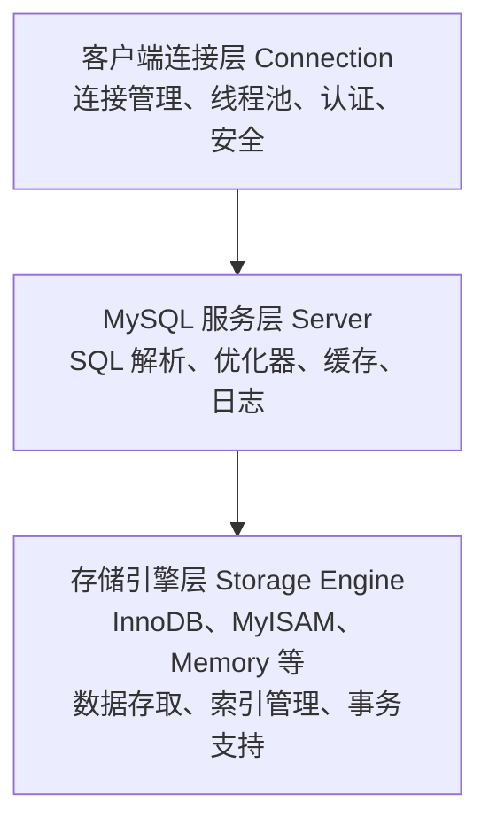

## 学习目标

本文是「MySQL」模块的第 5 篇，难度定位为入门。重点内容：MySQL 发展历程、体系结构与数据库设计范式。

主要章节：

- 0. 五分钟写出第一句 SQL（先读这里）
- 1. 数据库概述 (Overview)
- 2. 数据库设计基础
- 3. 总结

## 0. 五分钟写出第一句 SQL（先读这里）

> 阅读指南：本节是必读第一课。后面的“标准演进”“方言对比”“选型决策”等内容属于【进阶查阅】，零基础可以先跳过，需要时再回来看。

先理解一句话：**SQL 就是跟数据库说话的语言**，MySQL 是听懂这句话的数据库软件之一。

打开 `000-SQL-Playground` 的沙箱（或本地 `mysql -u root -p`），建一张最简单的表并查询：

```sql
CREATE TABLE users (
  id INT PRIMARY KEY,
  name VARCHAR(50),
  age INT
);

INSERT INTO users (id, name, age) VALUES (1, 'Alice', 20), (2, 'Bob', 18);

SELECT name, age FROM users WHERE age > 18 ORDER BY age DESC LIMIT 5;
```

**讲解：**

- `CREATE TABLE` 建表，`INT`/`VARCHAR(50)` 是列的类型（整数/最长 50 字符的文本）；
- `PRIMARY KEY` 是主键：每行的“身份证号”，不能重复；
- `INSERT` 插入数据，括号里是列名，`VALUES` 后是每行的值；
- `SELECT` 查询：`WHERE` 过滤行、`ORDER BY` 排序、`LIMIT` 限制条数；
- 上面这条查询的意思是：查名字和年龄，只要年龄大于 18 的，按年龄从大到小排，最多返回 5 行。

**看到结果就过关**：如果你能跑通上面三句 SQL 并看到两行数据，第一课完成。看不懂的术语查 `030-Glossary`，练习不够去 `040-SQLPlayground` 刷 10 道题。


> 本节为增量补充，帮助你选择 MySQL 版本。

- MySQL 版本线（2026 年）：**9.7 LTS**（2026-04 首发的最新长期支持系列）与 **8.4 LTS**（2024-04 首发）为企业推荐的两大 LTS；**8.0 系列**已进入收尾期，仅剩安全补丁维护，新项目不要再选；两个 LTS 之间的 Innovation 版本（如 9.5、9.6）快速迭代、支持期极短，仅适合尝鲜验证。
- 生产环境优先选 LTS：存量 8.0 系统应规划升级到 8.4 LTS，已具备条件的项目可直接评估 9.7 LTS。
- 配套工具：MySQL Shell、MySQL Workbench、官方 Connector 驱动，以及容器部署（`mysql:8.4` 或 `mysql:9.7` 镜像）。

## 1. 数据库概述 (Overview)

MySQL 是全球最受欢迎的**开源关系型数据库管理系统 (RDBMS)**，由 Oracle 公司维护和开发。它是 Web 应用开发中最常用的数据库之一，广泛应用于各种规模的应用系统。

### 1.1 数据库基础概念详解

#### 1.1.1 什么是数据库

数据库是按照数据结构来组织、存储和管理数据的仓库，它能够长期存储大量的数据，并且支持高效的查询和修改。数据库的发展经历了几个重要阶段：

- **层次数据库**：采用树形结构组织数据，如 IBM 的 IMS 系统
- **网状数据库**：采用网状结构组织数据，如 CODASYL 系统
- **关系型数据库**：采用二维表格形式组织数据，如 MySQL、Oracle、SQL Server
- **NoSQL 数据库**：非关系型数据库，如 MongoDB、Redis、Cassandra

#### 1.1.2 关系型数据库核心概念

| 概念                                | 描述                                               | 示例                                     |
| :---------------------------------- | :------------------------------------------------- | :--------------------------------------- |
| **关系型 (RDBMS)**                  | 数据存储在表中，表之间通过外键关联，遵循 ACID 特性 | MySQL、PostgreSQL、Oracle                |
| **SQL (Structured Query Language)** | 结构化查询语言，用于管理数据                       | `SELECT * FROM users`                    |
| **表 (Table)**                      | 数据的基本存储单元，由行和列组成                   | `users` 表、`orders` 表                  |
| **字段 (Column)**                   | 表中的列，定义数据类型                             | `id`、`name`、`email`                    |
| **记录 (Row)**                      | 表中的行，包含一条完整的数据                       | `(1, '张三', 'zhangsan@example.com')`    |
| **主键 (Primary Key)**              | 唯一标识表中记录的字段                             | `id INT PRIMARY KEY`                     |
| **外键 (Foreign Key)**              | 关联其他表主键的字段                               | `user_id INT REFERENCES users(id)`       |
| **索引 (Index)**                    | 加速数据查询的数据结构                             | `CREATE INDEX idx_email ON users(email)` |
| **事务 (Transaction)**              | 一组原子性的操作，要么全部成功，要么全部失败       | `START TRANSACTION; ... COMMIT;`         |

### 1.2 MySQL 架构详解

#### 1.2.1 MySQL 整体架构

MySQL 采用分层架构设计，主要分为三层：



#### 1.2.2 客户端连接层详解

客户端连接层负责处理客户端连接请求，主要功能包括：

- **连接管理**：管理客户端与服务器之间的连接，支持 TCP/IP、Socket、命名管道等多种连接方式
- **线程池**：为每个连接分配一个线程，或使用线程池复用线程，提高并发处理能力
- **用户认证**：验证用户名、密码和主机地址的合法性
- **安全控制**：基于 IP 地址的访问控制，SSL/TLS 加密连接
  **连接方式**：

```sql
 mysql -h 127.0.0.1 -P 3306 -u root -p
 mysql -u root -p --socket=/tmp/mysql.sock
 mysql -u root -p --pipe
```

#### 1.2.3 MySQL 服务层详解

服务层是 MySQL 的核心，包含以下主要组件：

- **SQL 接口**：接收和解析 SQL 语句
- **解析器**：将 SQL 语句解析成解析树
- **优化器**：生成最优的执行计划
- **缓存**：缓存查询结果（MySQL 8.0 已移除）
- **日志管理**：管理 binlog、slow log、error log 等
  **SQL 执行流程**：

```
 SQL 语句 → SQL 接口 → 解析器 → 优化器 → 执行器 → 存储引擎
```

### 1.3 核心特点 (Key Features)

- **高性能**: 优化的查询引擎 (InnoDB)，支持事务和行级锁，并发处理能力强
- **高可用**: 支持主从复制、集群部署、读写分离，提供多种高可用方案
- **安全性**: 完善的权限控制系统，支持 SSL 加密，细粒度的访问控制
- **可扩展性**: 支持分区表、分库分表、读写分离，可根据业务需求扩展
- **社区活跃**: 丰富的文档和第三方支持，活跃的开发者社区
- **跨平台**: 支持 Windows、Linux、macOS 等多种操作系统
- **开源免费**: Community Edition 完全免费，降低使用成本
- **丰富的存储引擎**: 支持 InnoDB、MyISAM、Memory、Archive 等多种存储引擎
- **强大的复制功能**: 支持异步复制、半同步复制、组复制，满足不同场景需求
- **存储过程和触发器**: 支持复杂的业务逻辑实现
- **全文索引**: 支持全文搜索功能

### 1.4 MySQL 版本选择

| 版本类型               | 特点                                                    | 适用场景                     |
| :--------------------- | :------------------------------------------------------ | :--------------------------- |
| **Community Edition**  | 免费开源版本，功能完整                                  | 大多数应用场景，包括生产环境 |
| **Enterprise Edition** | 商业版本，提供更多高级功能和技术支持                    | 企业级应用，需要官方技术支持 |
| **Cluster CGE**        | 集群版本，提供高可用性和横向扩展能力                    | 高可用要求的关键业务系统     |
| **MySQL 9.7 (LTS)**    | 最新长期支持系列（2026-04 起），含 9.x 全部新特性        | 新项目、以及计划从 8.4 升级的应用 |
| **MySQL 8.4 (LTS)**    | 长期支持版本，稳定可靠，持续维护中                      | 生产环境首选                     |
| **MySQL 8.0**          | 上一代主力版本，已进入安全补丁收尾期，新特性冻结        | 存量系统，应规划升级到 8.4/9.7   |
| **MySQL 5.7**          | 已于 2023-10 停止官方支持（EOL），不再有安全补丁        | 仅存量旧系统，尽快迁移           |

### 1.5 MySQL 8.0 新特性

MySQL 8.0 带来了众多新特性和改进：

- **窗口函数 (Window Functions)**：支持 ROW_NUMBER、RANK、DENSE_RANK 等分析函数
- **公用表表达式 (CTE)**：支持 WITH 子句，简化复杂查询
- **JSON 增强**：新增 JSON_TABLE、JSON_ARRAYAGG、JSON_OBJECTAGG 等函数
- **角色管理**：支持创建和应用角色，简化权限管理
- **窗口函数的增强**：支持 LAG、LEAD、FIRST_VALUE、LAST_VALUE 等
- **不可见索引**：支持创建不可见索引，用于测试索引效果
- **降序索引**：支持创建降序索引，优化特定查询
- **直方图统计**：支持创建直方图统计信息，优化查询计划
- **原子 DDL**：支持原子数据定义语句

### 1.6 MySQL 应用场景

| 应用场景       | 说明                       | 推荐配置                        |
| :------------- | :------------------------- | :------------------------------ |
| **Web 应用**   | 博客、电商、内容管理系统等 | InnoDB 存储引擎，适当配置连接池 |
| **企业应用**   | ERP、CRM、OA 等企业系统    | InnoDB + 主从复制，保证高可用   |
| **数据仓库**   | 数据分析、报表系统         | MySQL 集群或使用列式存储        |
| **嵌入式系统** | 小型应用、移动应用后端     | Memory 存储引擎，减少资源占用   |
| **游戏后端**   | 游戏数据存储、用户管理     | InnoDB + Redis 缓存，提高并发   |

## 2. 数据库设计基础

### 2.1 设计原则详解

#### 2.1.1 数据库范式

**第一范式 (1NF) - 原子性**

- 要求每个字段都是不可分割的原子值
- 示例：地址字段应拆分为省、市、区、详细地址
  **第二范式 (2NF) - 完全依赖**
- 满足1NF
- 非主键字段必须完全依赖于主键，不能只依赖于主键的一部分
- 示例：订单明细表中，(order_id, product_id) 为主键，price 完全依赖于这两个字段
  **第三范式 (3NF) - 消除传递依赖**
- 满足2NF
- 非主键字段不能传递依赖于主键
- 示例：员工表有部门信息，部门表有部门主管，员工不应该通过部门间接获得主管信息
  **BC范式 (BCNF)**
- 满足3NF
- 任何表中不能存在对键的某一部分的函数依赖
- 示例：学生选修课程，教师授课，每门课程有固定教师，学生选课时确定教师

#### 2.1.2 反规范化

在某些场景下，为了提高查询性能，可以适当增加数据冗余：

- **冗余字段**：在订单表中冗余用户名称，避免连接查询
- **预计算字段**：在订单表中存储商品数量总和，避免 COUNT 查询
- **中间表**：为复杂查询创建汇总表

### 2.2 常用数据类型详解

#### 2.2.1 整数类型

| 类型      | 存储空间 | 有符号范围       | 无符号范围 | 适用场景     |
| :-------- | :------- | :--------------- | :--------- | :----------- |
| TINYINT   | 1字节    | -128~127         | 0~255      | 状态码、年龄 |
| SMALLINT  | 2字节    | -32768~32767     | 0~65535    | 数量、计数器 |
| MEDIUMINT | 3字节    | -8388608~8388607 | 0~16777215 | 中等数值     |
| INT       | 4字节    | -21亿~21亿       | 0~42亿     | ID、主键     |
| BIGINT    | 8字节    | 很大             | 0~很大     | 大数值、金额 |

#### 2.2.2 字符串类型

| 类型       | 最大长度  | 特点                      | 适用场景                 |
| :--------- | :-------- | :------------------------ | :----------------------- |
| CHAR(n)    | 255字符   | 定长，末尾补空格          | 固定长度（性别、状态码） |
| VARCHAR(n) | 65535字节 | 变长，需要1-2字节存储长度 | 姓名、地址、标题         |
| TINYTEXT   | 255字节   | -                         | 短文本                   |
| TEXT       | 65535字节 | 不能有默认值              | 文章内容、评论           |
| MEDIUMTEXT | 16MB      | -                         | 长文章                   |
| LONGTEXT   | 4GB       | -                         | 超大文本                 |

#### 2.2.3 日期时间类型

| 类型      | 格式                | 范围                 | 存储空间 | 特点                 |
| :-------- | :------------------ | :------------------- | :------- | :------------------- |
| DATE      | YYYY-MM-DD          | 1000-9999            | 3字节    | 仅日期               |
| TIME      | HH:MM:SS            | -838:59:59~838:59:59 | 3字节    | 仅时间               |
| DATETIME  | YYYY-MM-DD HH:MM:SS | 1000-9999            | 8字节    | 日期时间，存储实际值 |
| TIMESTAMP | YYYY-MM-DD HH:MM:SS | 1970-2038            | 4字节    | 自动更新，时区敏感   |
| YEAR      | YYYY                | 1901-2155            | 1字节    | 年份                 |

#### 2.2.4 浮点数和定点数

| 类型         | 存储空间 | 特点                 | 适用场景   |
| :----------- | :------- | :------------------- | :--------- |
| FLOAT        | 4字节    | 单精度，可能丢失精度 | 科学计算   |
| DOUBLE       | 8字节    | 双精度，可能丢失精度 | 科学计算   |
| DECIMAL(M,D) | 可变     | 精确存储，推荐使用   | 金额、价格 |

**金额计算示例**：

```sql
 CREATE TABLE accounts (
  id INT PRIMARY KEY,
  balance DECIMAL(10,2) NOT NULL DEFAULT 0.00
 )
```

### 2.3 数据库设计示例

#### 2.3.1 电商系统完整设计

```sql
 CREATE TABLE categories (
  id INT PRIMARY KEY AUTO_INCREMENT,
  parent_id INT DEFAULT NULL COMMENT '父分类ID',
  name VARCHAR(50) NOT NULL COMMENT '分类名称',
  sort INT DEFAULT 0 COMMENT '排序',
  created_at TIMESTAMP DEFAULT CURRENT_TIMESTAMP,
  FOREIGN KEY (parent_id) REFERENCES categories(id) ON DELETE SET NULL,
  INDEX idx_parent_id (parent_id)
 )
 CREATE TABLE products (
  id INT PRIMARY KEY AUTO_INCREMENT,
  category_id INT NOT NULL COMMENT '分类ID',
  name VARCHAR(100) NOT NULL COMMENT '商品名称',
  subtitle VARCHAR(200) COMMENT '副标题',
  price DECIMAL(10,2) NOT NULL COMMENT '售价',
  cost DECIMAL(10,2) COMMENT '成本',
  stock INT NOT NULL DEFAULT 0 COMMENT '库存',
  sales INT NOT NULL DEFAULT 0 COMMENT '销量',
  description TEXT COMMENT '商品描述',
  image VARCHAR(255) COMMENT '主图',
  status TINYINT DEFAULT 1 COMMENT '状态：1-上架 0-下架',
  created_at TIMESTAMP DEFAULT CURRENT_TIMESTAMP,
  updated_at TIMESTAMP DEFAULT CURRENT_TIMESTAMP ON UPDATE CURRENT_TIMESTAMP,
  FOREIGN KEY (category_id) REFERENCES categories(id),
  INDEX idx_category_id (category_id),
  INDEX idx_status (status),
  INDEX idx_sales (sales)
 )
 CREATE TABLE product_skus (
  id INT PRIMARY KEY AUTO_INCREMENT,
  product_id INT NOT NULL COMMENT '商品ID',
  name VARCHAR(100) NOT NULL COMMENT 'SKU名称（如：颜色-红色）',
  price DECIMAL(10,2) NOT NULL COMMENT 'SKU价格',
  stock INT NOT NULL DEFAULT 0 COMMENT 'SKU库存',
  created_at TIMESTAMP DEFAULT CURRENT_TIMESTAMP,
  FOREIGN KEY (product_id) REFERENCES products(id) ON DELETE CASCADE,
  INDEX idx_product_id (product_id)
 )
 CREATE TABLE users (
  id INT PRIMARY KEY AUTO_INCREMENT,
  username VARCHAR(50) NOT NULL UNIQUE COMMENT '用户名',
  password VARCHAR(255) NOT NULL COMMENT '密码（加密）',
  email VARCHAR(100) UNIQUE COMMENT '邮箱',
  phone VARCHAR(20) UNIQUE COMMENT '手机号',
  avatar VARCHAR(255) COMMENT '头像',
  gender TINYINT COMMENT '性别：0-未知 1-男 2-女',
  birthday DATE COMMENT '生日',
  level INT DEFAULT 0 COMMENT '会员等级',
  points INT DEFAULT 0 COMMENT '积分',
  balance DECIMAL(10,2) DEFAULT 0.00 COMMENT '余额',
  status TINYINT DEFAULT 1 COMMENT '状态：1-正常 0-禁用',
  last_login_at DATETIME COMMENT '最后登录时间',
  created_at TIMESTAMP DEFAULT CURRENT_TIMESTAMP,
  updated_at TIMESTAMP DEFAULT CURRENT_TIMESTAMP ON UPDATE CURRENT_TIMESTAMP,
  INDEX idx_username (username),
  INDEX idx_phone (phone),
  INDEX idx_email (email)
 )
 CREATE TABLE addresses (
  id INT PRIMARY KEY AUTO_INCREMENT,
  user_id INT NOT NULL COMMENT '用户ID',
  consignee VARCHAR(50) NOT NULL COMMENT '收货人',
  phone VARCHAR(20) NOT NULL COMMENT '联系电话',
  province VARCHAR(50) NOT NULL COMMENT '省份',
  city VARCHAR(50) NOT NULL COMMENT '城市',
  district VARCHAR(50) NOT NULL COMMENT '区县',
  detail_address VARCHAR(255) NOT NULL COMMENT '详细地址',
  is_default TINYINT DEFAULT 0 COMMENT '是否默认：1-默认 0-非默认',
  created_at TIMESTAMP DEFAULT CURRENT_TIMESTAMP,
  FOREIGN KEY (user_id) REFERENCES users(id) ON DELETE CASCADE,
  INDEX idx_user_id (user_id),
  INDEX idx_is_default (is_default)
 )
```

## 3. 总结

### 3.1 关键要点回顾

- **选择合适的版本**: MySQL 8.0/8.4 是当前主流，推荐使用 LTS 版本
- **合理的数据库设计**: 遵循范式化原则，根据业务场景适当反规范化
- **性能优化**: 从服务器配置、索引设计、SQL 语句等多个方面综合优化
- **安全管理**: 加强访问控制，定期更换密码，使用最小权限原则
- **监控与维护**: 建立完善的监控体系，定期进行维护任务

### 3.2 学习建议

1. **夯实基础**：熟练掌握 SQL 语法，包括 DDL、DML、DQL
2. **深入原理**：理解 MySQL 架构、存储引擎、索引原理
3. **注重实践**：多练习实际项目中的数据库设计和管理
4. **性能调优**：学习使用 EXPLAIN 分析执行计划，优化慢查询
5. **高可用架构**：了解主从复制、读写分离、分库分表等方案
