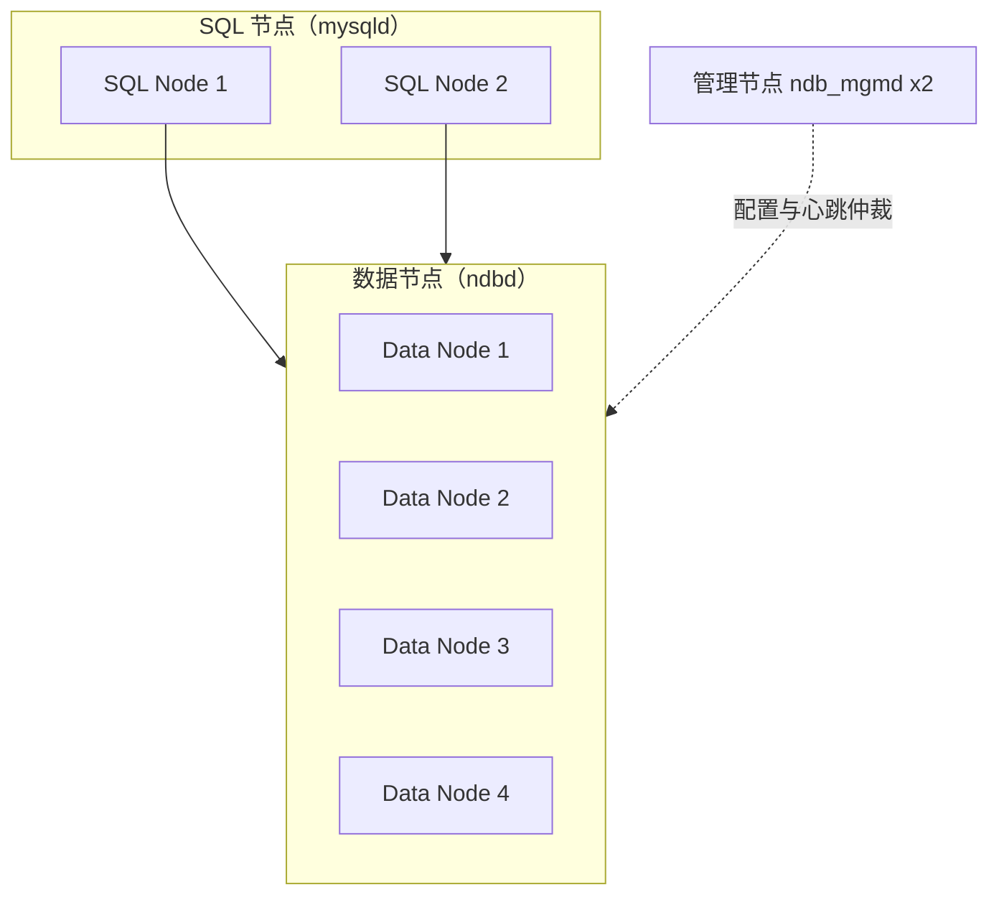

## 前置知识

- InnoDB Cluster 的组复制模型（[InnoDB Cluster](/mysql/630-InnoDBCluster)）——作为对照系，理解"共享 nothing 分片"与"多数派复制"是两种不同的分布式哲学。

## 问题引入：复制解决可用性，解决不了容量与写入扩展

主从复制与 InnoDB Cluster 都是"每台机器存全量数据"的架构——数据量与写入 QPS 超过单机上限时，它们无解（那是[分库分表中间件](/mysql/680-ShardingMiddleware)的领域）。**NDB Cluster** 走的是另一条路：数据自动分片到多台机器、每片多副本同步复制，把分布式做进了存储引擎层。宣称的可用性目标高达 99.999%——代价是复杂度与一系列使用约束。

先泼冷水定位：NDB Cluster 在国内互联网业务中属小众选择（电信计费、实时风控等强实时 OLTP 场景偶有使用），学习它主要价值在于**理解"分布式数据库"的三类节点分工与同步复制的代价模型**——这套概念在新一代分布式数据库（TiDB 等）里原样复现。

## 架构：三类节点各司其职



| 节点 | 进程 | 职责 | 数量底线 |
| --- | --- | --- | --- |
| SQL 节点 | mysqld | 接收 SQL、解析优化、访问数据节点——不含数据 | 按应用连接量横向加 |
| 数据节点 | ndbd/ndbmtd | 存数据、执行分布式事务与查询片段——真正的存储引擎 | ≥4（容忍 1 台故障） |
| 管理节点 | ndb_mgmd | 集群配置、启动引导、脑裂仲裁 | ≥2（不是性能瓶颈，是裁判） |

与"每台 mysqld 都是完整数据库"的主从架构的本质差异：**SQL 节点没有数据**。任何 SQL 节点都能看到完整数据集（数据在数据节点层分片存放），SQL 节点挂一台，应用换连另一台即可，无切换动作——这是"存算分离"思想的早期实践。

## 数据分布与同步复制

```sql
-- 建 NDB 表：自动按主键哈希分片到所有数据节点组
CREATE TABLE orders (
  order_id BIGINT PRIMARY KEY,
  user_id BIGINT,
  amount DECIMAL(10,2)
) ENGINE = NDB;

-- 显式控制分区数
CREATE TABLE hot_counters (
  k INT PRIMARY KEY,
  v BIGINT
) ENGINE = NDB PARTITION BY KEY(k) PARTITIONS 4;
```

副本模型由 `NoOfReplicas` 决定（通常为 2）：数据节点两两组成**节点组（Node Group）**，每条数据在组内一主一备**同步复制**——主副本确认落盘（内存）后事务才提交。这带来 NDB 的两个标志性行为：

1. **故障切换零丢失、秒级完成**：数据节点故障，同组副本自动接管，无 binlog 追平过程（本来就是同步的）；
2. **提交延迟受最慢副本拖累**：一次提交要在多个节点间往返确认，跨节点事务（数据分属不同节点组）的延迟更高——写入吞吐与网络质量强耦合，跨机房部署 NDB 是明确反模式（同步复制等不起那个 RTT）。

## 配置骨架（理解用，生产请走官方向导）

```ini
# config.ini
[ndbd default]
NoOfReplicas = 2            # 每份数据的副本数；2 意味着容忍同组 1 节点故障
DataMemory = 16G            # 数据内存（NDB 主存内存、可配磁盘列溢出）
IndexMemory = 2G            # 索引内存

[ndb_mgmd] NodeId = 1
HostName = mgm1
[ndb_mgmd] NodeId = 2
HostName = mgm2

[ndbd] NodeId = 3
HostName = data1
[ndbd] NodeId = 4
HostName = data2

[mysqld] NodeId = 5
HostName = sql1
[mysqld] NodeId = 6
HostName = sql2
```

工程细节三则：数据节点数量最好为 `NoOfReplicas` 的整数倍（保证节点组整齐）；SQL 节点访问 NDB 表时 `ENGINE=NDB` 是表级属性，与 InnoDB 表可共存一库（跨引擎事务不支持）；管理节点双活部署，其仲裁配置（`ArbitrationRank`）决定网络分区时谁活谁死——脑裂处理与一切分布式系统一样是生命线。

## 选型：NDB vs InnoDB Cluster vs 分库分表

| 维度 | NDB Cluster | InnoDB Cluster | 分库分表中间件 |
| --- | --- | --- | --- |
| 数据分布 | 引擎层自动分片 | 全量复制（不分片） | 应用层/代理层分片 |
| 复制方式 | 同步（内存级） | 多数派同步 | 异步/半同步 |
| 扩容 | 在线加数据节点 | 加只读副本 | 重分片（昂贵） |
| 事务跨节点 | 支持但延迟高 | 单主内原生 | 跨片困难（XA/最终一致） |
| 复杂度 | 高（新组件、新运维体系） | 中 | 中 |
| 适合 | 超低延迟实时 OLTP、电信级可用性 | 一般业务高可用 | 通用互联网业务扩展 |

一句话决策：**绝大多数业务，InnoDB Cluster 或分库分表是更顺路的选择；NDB 留给"同步复制延迟必须亚毫秒、可用性必须五个九、且有专职团队"的特殊场景**。新一代场景如果真需要分片分布式，也建议把 TiDB 类产品纳入对比——生态与 SQL 兼容性演进更快。

## 常见困惑

**"NDB 数据在内存里，断电不就没了？"**——不。NDB 的数据主存是内存，但检查点（本地检查点 LCP + 全局检查点 GCP）会把数据周期性落盘，redo 机制保障崩溃恢复。它与 [Memory 引擎](/mysql/190-MemoryStorageEngine) 的"重启即空"有本质区别——名字里的"内存"指主要工作区，不是"不持久"。

**"为什么 SQL 节点不存数据还有意义？"**——解耦了"计算"与"存储"的扩展节奏：连接数/查询复杂度涨，加 SQL 节点；数据量/写入量涨，加数据节点。主从架构里两者被迫绑在同一个复制拓扑上。

**"跨节点事务为什么慢？"**——一次提交要完成多个节点组上的两阶段协议（prepare → commit 跨网络往返）。单节点组内的事务（好的分片键设计能让多数事务落单片）延迟可控；跨组事务的延迟与失败率都数倍于单组。这再次印证分片键设计的黄金律——**让事务落在最小范围**。

## 检验清单

- 能画出三类节点架构图并说出"SQL 节点无数据"的存算分离意义；
- 能解释 `NoOfReplicas=2` 的副本分组模型与同步复制的延迟代价；
- 记住管理节点是仲裁者、数据节点数应为副本数的整数倍；
- 能在 NDB / InnoDB Cluster / 分库分表之间给出业务选型与理由；
- 知道 NDB 与 Memory 引擎在持久性上的本质区别。

## 下一步

回到更通用的复制体系收尾：[主从复制](/mysql/590-Replication) 与 [GTID](/mysql/600-GTID) 是几乎所有业务的高可用基石，NDB 只是你工具箱里那件"特殊场合才出鞘"的重型装备。
