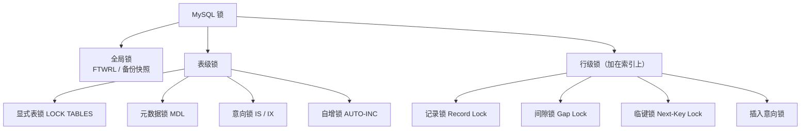

## 前置知识

- 事务与隔离级别（[事务与隔离级别](/mysql/420-TransactionIsolationImplementation)）——行级锁的行为随隔离级别变化，不先立此存照必然混乱；
- 索引结构（[联合索引](/mysql/230-CompositeIndexLeftmostPrefixPrinciple)）——InnoDB 的行锁是**加在索引上**的，不懂索引就没法理解锁。

## 全景图：三层锁结构



学习心法：**每一层锁都对应一个它要解决的冲突**。全局锁管"整库一致性"，表级锁管"结构与数据的互斥、行锁的快速登记"，行级锁管"并发事务改同一片数据"。按"它防什么"来记，比按名字背快十倍。

## 第一层：全局锁——整库一致性点

```sql
FLUSH TABLES WITH READ LOCK;   -- 全库只读（除了超权限线程）
UNLOCK TABLES;
```

用途只有一个场景：物理冷备或需要全库一致点且库不支持事务时。**InnoDB 时代的正解是不用它**——`mysqldump --single-transaction` 借 MVCC 快照拿到一致性视图，业务零感知（[逻辑备份](/mysql/560-LogicalBackup)）。FTWRL 在主库上执行等于全站停写，事故级的误操作，见一次记一辈子。

## 第二层：表级锁——三员大将

### MDL（元数据锁）：最著名的阻塞链事故制造者

MDL 是系统自动加的，规则一句话：**DML 加 MDL 读锁（彼此兼容），DDL 加 MDL 写锁（与一切互斥）**。危险在于排队规则：

```text
事务 A：BEGIN; SELECT ...;            -- 拿到 MDL 读锁，迟迟不提交
ALTER  B：ADD COLUMN ...               -- 请求 MDL 写锁 → 排队等 A
SELECT C：业务查询                      -- 请求 MDL 读锁 → 排队等 B！
   ↓
后续所有查询全部堆积 —— 数据库"假死"
```

注意最后一步：**MDL 写锁一旦排队，后来的一切读也被堵住**（避免写锁饿死）。一个忘了提交的长事务就能锁死整张表。防线两条：DDL 前查 `information_schema.innodb_trx` 确认没有长事务；DDL 语句带等待超时（`ALTER TABLE ... , ALGORITHM=INSTANT` 优先 + `lock_wait_timeout` 调小），宁可 DDL 失败重试，不可堵塞业务。

### 意向锁（IS/IX）：行锁的"挂号本"

事务要对某行加行锁前，先在表上挂个"意向"——作用只有一个：让后来的**表级锁**请求不用逐行检查就能知道"表里有人在行级操作"。兼容矩阵背一句口诀即可：**意向锁之间永远兼容；意向锁与表级 S/X 按常规互斥**。日常无感知，死锁分析时它是背景板。

### 显式表锁与自增锁

`LOCK TABLES ... READ/WRITE` 是 MyISAM 时代的遗产，InnoDB 业务不用；自增锁（AUTO-INC）管主键自增分配，8.0 默认 `innodb_autoinc_lock_mode=2`（交错模式，批量插入不再持有语句级自增锁），配合 binlog ROW 格式安全且并发好——老资料里"自增锁拖慢批量插入"的说法是 mode 0/1 时代的。

## 第三层：行级锁——加在索引上的锁

先立最颠覆的认知：**InnoDB 行锁锁的是索引项，不是"那行数据"**。推导出的铁律：WHERE 条件没走索引时，行锁退化为锁住全表所有记录（近似表锁）。

三种行锁算法（REPEATABLE READ 默认语境）：

| 锁 | 锁什么 | 防什么 |
| --- | --- | --- |
| 记录锁 Record Lock | 单条索引记录 | 并发改/删同一行 |
| 间隙锁 Gap Lock | 两条记录之间的开区间 | 幻读：往间隙里**插入** |
| 临键锁 Next-Key | 记录锁 + 前面的间隙（左开右闭） | RR 下可重复读 + 防幻读的默认算法 |

```sql
-- 记录锁：等值命中唯一索引
SELECT * FROM accounts WHERE id = 5 FOR UPDATE;

-- 临键锁：范围条件把扫描过的间隙全部锁住
SELECT * FROM accounts WHERE id BETWEEN 5 AND 10 FOR UPDATE;
-- 锁住 (4,5],(5,6]...,(9,10]，其他事务无法插入 id=6..10 的新行
```

第四个角色**插入意向锁**：INSERT 前对目标间隙的"排队登记"，多个事务往同一间隙的不同位置插入可以并行，但与间隙锁互斥——"一个事务持有间隙锁，其他事务的 INSERT 全部等待"就是这对矛盾的表现，也是生产高并发写入抖动的常见根源。

## 动手环节：亲历 MDL 阻塞链与间隙锁

```sql
-- 实验 A：MDL 阻塞链（三个会话）
-- 会话1：BEGIN; SELECT * FROM mdl_demo LIMIT 1;   -- 持 MDL 读，不提交
-- 会话2：ALTER TABLE mdl_demo ADD COLUMN extra INT;   -- 等待
-- 会话3：SELECT * FROM mdl_demo LIMIT 1;              -- 也被堵住！
-- 排查：SHOW PROCESSLIST;  看 Waiting for table metadata lock
-- 收尾：会话1 ROLLBACK 释放，队列瞬间疏通

-- 实验 B：间隙锁阻止插入（两个会话）
-- 会话1：
BEGIN;
SELECT * FROM lock_demo WHERE id BETWEEN 5 AND 10 FOR UPDATE;

-- 会话2：
INSERT INTO lock_demo (id, note) VALUES (7, 'x');
-- 卡住！等待间隙锁释放
-- 会话1：ROLLBACK → 会话2 立即插入成功
```

实验 B 是"间隙锁防幻读"的具象化：id=7 在你两次查询之间从"不存在"变"存在"正是幻读，InnoDB 用锁住间隙的方式封死了这条路（详见[间隙锁与幻读](/mysql/470-GapLockNextKeyLockSolutionPhantomRead)）。

## 常见困惑

**"READ COMMITTED 和 REPEATABLE READ 的锁差异？"**——最大差异就在间隙锁：RC 下几乎不用间隙/临键锁（只用记录锁），防不了幻读但并发好；RR 全套临键锁防幻读，代价是锁范围大、死锁概率升。业务允许时用 RC + ROW binlog 是不少大厂的选择——一致性档位与并发性能的权衡，要明选不要默认。

**"死锁了怎么办？"**——`SHOW ENGINE INNODB STATUS` 的 LATEST DETECTED DEADLOCK 段是案发现场；InnoDB 默认开启死锁检测并自动回滚代价小的一方，业务层捕获重试即可。系统性分析见[死锁检测与处理](/mysql/480-DeadlockDetectionHandling)。

**"SELECT 不加 FOR UPDATE 也加锁吗？"**——普通一致性读不加任何锁（MVCC 快照，见 [MVCC 原理](/mysql/430-MVCCPrinciple)）；`FOR UPDATE/FOR SHARE` 才是显式加锁读。把"SELECT 会锁表"当成默认假设是老 MyISAM 时代留下的错觉。

## 检验清单

- 能默画三层锁全景图，并说出每种锁"防什么冲突"；
- 能复述 MDL 阻塞链事故的全过程与两条防线；
- 理解"行锁加在索引上"及其对无索引条件退化为全表锁的推论；
- 能区分记录/间隙/临键/插入意向四种行锁的锁定对象与互斥关系；
- 完成实验 A（MDL 阻塞链）与实验 B（间隙锁堵插入）。

## 下一步

锁的静态分类之后是动态协作：[事务与锁机制](/mysql/460-TransactionLockMechanism) 把锁放进事务生命周期里讲，[MVCC 原理](/mysql/430-MVCCPrinciple) 则揭示"大部分读为什么根本不用锁"。
