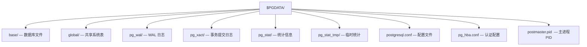

## 1. 进程模型

PostgreSQL 采用多进程架构，每个客户端连接对应一个后端进程。

### 1.1 核心进程

| 进程                | 作用                           |
| ------------------- | ------------------------------ |
| postmaster          | 主进程，监听连接，fork后端进程 |
| backend             | 处理客户端查询                 |
| autovacuum launcher | 自动清理调度                   |
| autovacuum worker   | 执行自动清理                   |
| WAL writer          | 定期刷写 WAL 缓冲区            |
| background writer   | 定期刷写脏页到磁盘             |
| checkpointer        | 执行检查点                     |
| stats collector     | 收集统计信息                   |
| logical replicator  | 逻辑复制                       |

### 1.2 连接流程

```
客户端 → postmaster (监听5432) → fork backend进程 → 处理查询
```

## 2. 共享内存

### 2.1 主要共享内存区域

| 区域           | 参数           | 默认值   | 说明         |
| -------------- | -------------- | -------- | ------------ |
| Shared Buffers | shared_buffers | 128MB    | 数据页缓存   |
| WAL Buffer     | wal_buffers    | -1(自动) | WAL 缓冲区   |
| Commit Log     | —              | —        | 事务状态缓存 |
| Lock Table     | —              | —        | 锁信息       |

```sql
-- 设置共享缓冲区
ALTER SYSTEM SET shared_buffers = '4GB';
-- 建议设为物理内存的 25%
```

## 3. 本地内存

| 区域                 | 参数                 | 默认值 | 说明                |
| -------------------- | -------------------- | ------ | ------------------- |
| Work Mem             | work_mem             | 4MB    | 排序/哈希操作内存   |
| Maintenance Work Mem | maintenance_work_mem | 64MB   | VACUUM/CREATE INDEX |
| Temp Buffers         | temp_buffers         | 8MB    | 临时表缓冲区        |

```sql
ALTER SYSTEM SET work_mem = '64MB';
ALTER SYSTEM SET maintenance_work_mem = '512MB';
```

## 4. 数据目录结构


