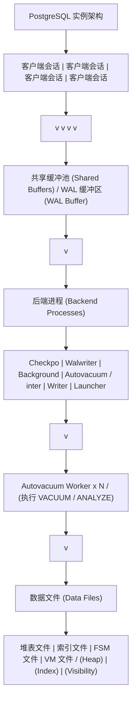
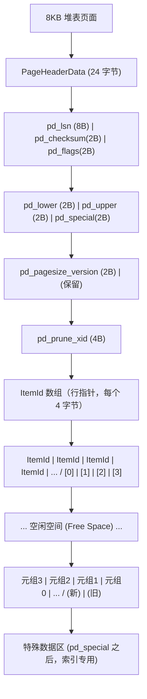
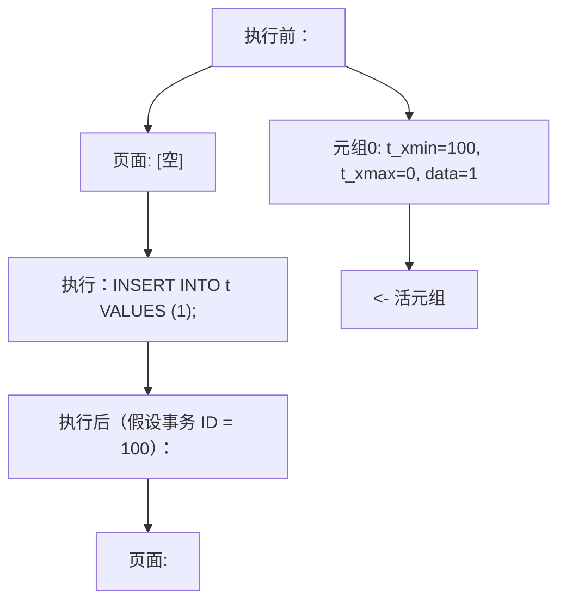
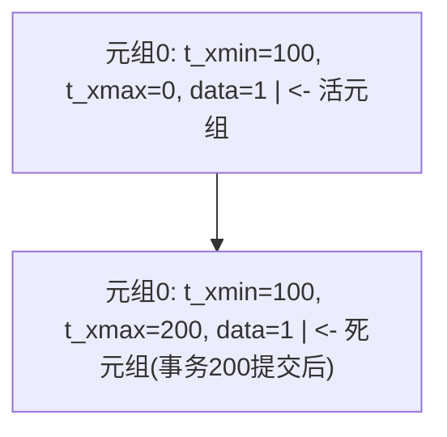
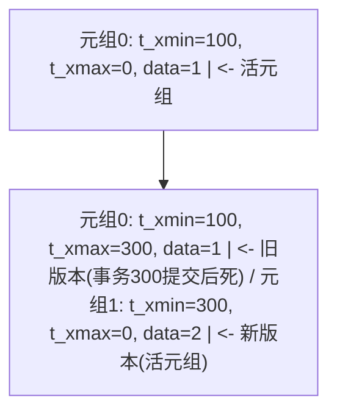
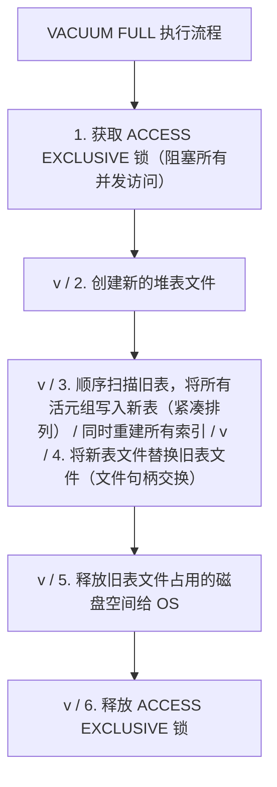
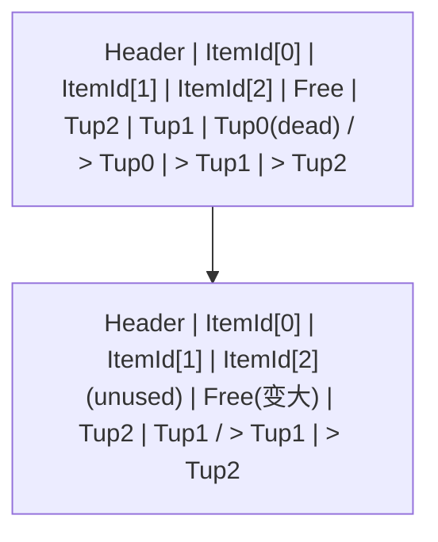
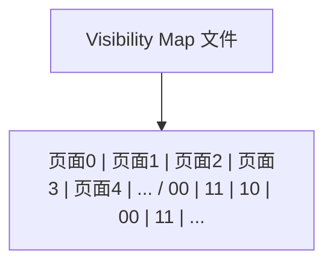
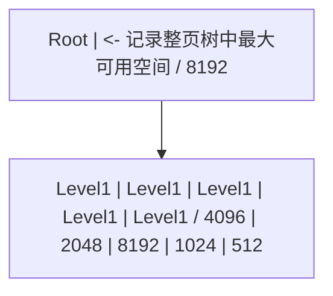

> 定位说明：本篇为进阶参考书（参考层），面向已完成本模块主线的读者；入门请先走学习路径前序阶段。定位标准见 docs/standards/reference-layer.md（仓库）。

## 前置知识

建议先阅读以下内容再进入本文：

- [概述与安装配置](/postgresql/010-OverviewInstallConfig)

# PostgreSQL VACUUM 机制深度解析（机制篇）

> 本文是「PostgreSQL VACUUM」三篇系列的第一篇（机制篇），面向数据库内核研究者、DBA 与高级开发工程师，系统剖析 VACUUM 存在的根本原因（MVCC 与死元组）、死元组的产生与生命周期、可见性判断规则，以及标准 VACUUM「扫描堆表、清理索引、回收空间」三步流程的完整实现，并讲清可见性映射（VM）与空闲空间映射（FSM）两个关键数据结构。
>
> 系列另两篇：[Autovacuum 实战](/postgresql/212-VACUUMAutovacuum)（守护进程架构、触发阈值、按表调参与运行观察）与 [VACUUM 调优与排障](/postgresql/214-VACUUMTuningAndTroubleshoot)（膨胀诊断、在线重建、事务 ID 回卷与 FREEZE 风暴排障、监控清单）。

主要章节：

- 第一章 概述与学习目标
- 第二章 历史背景与设计哲学
- 第三章 MVCC 与死元组理论基础
- 第四章 VACUUM 工作原理深度剖析
- 第五章 FREEZE 与事务 ID 回卷（预告）
- 第六章 练习题
- 第七章 参考文献与延伸阅读

---

## 第一章 概述与学习目标

### 1.1 什么是 VACUUM

PostgreSQL 的 VACUUM 命令是数据库内核中负责"垃圾回收"的核心维护组件。
与一般编程语言意义上的垃圾回收器（Garbage Collector）不同，VACUUM
处理的对象不是内存对象，而是磁盘上堆表（Heap Table）与索引（Index）
中因多版本并发控制（MVCC, Multi-Version Concurrency Control）机制
而产生的"死元组"（Dead Tuples）。

在 PostgreSQL 中，每当执行 UPDATE 或 DELETE 操作时，数据库并不会
立即在物理磁盘上覆盖或删除旧版本数据。相反，旧版本数据被保留下来，
新版本数据被写入新的物理位置。这种设计保证了并发事务在读取数据时
不会被写入操作阻塞，从而实现了"读不阻塞写、写不阻塞读"的高并发能力。
然而，旧版本数据在不再被任何活跃事务可见后，就变成了"死元组"，它们
占据磁盘空间却不携带任何有效信息。如果不加以清理，死元组会持续累积，
导致表膨胀（Table Bloat）、索引膨胀（Index Bloat）、查询性能下降、
缓冲池命中率降低等一系列问题。

VACUUM 的核心职责可以归纳为以下五点：

1. 回收死元组占用的空间，将其标记为可重用，供后续 INSERT 或 UPDATE 使用。
2. 更新可见性映射（Visibility Map），加速仅索引扫描（Index-Only Scan）。
3. 更新空闲空间映射（Free Space Map, FSM），记录页面内可用空间。
4. 冻结（FREEZE）旧元组的事务 ID，防止事务 ID 回卷（XID Wraparound）。
5. 可选地更新统计信息（ANALYZE），辅助查询优化器生成更优执行计划。

下图展示了 VACUUM 在 PostgreSQL 整体架构中的位置：



### 1.2 为什么需要 VACUUM

理解 VACUUM 的必要性，必须从 PostgreSQL 的 MVCC 实现方式说起。
PostgreSQL 采用的是"多版本存储"（Multi-Version Storage）模型，而非
Oracle 的"回滚段"（Undo Segment）模型或 MySQL InnoDB 的"回滚日志"
（Undo Log）模型。这意味着 PostgreSQL 在执行 UPDATE 时，会在堆表中
写入一个全新的元组副本，而不是在原地修改数据并将旧值写入回滚段。

这种设计的直接后果是：

- 优点：回滚操作极其高效（只需标记新元组为无效即可），不需要维护
  额外的回滚段空间；崩溃恢复逻辑相对简单。
- 缺点：堆表文件会持续增长，必须依赖 VACUUM 进行空间回收；如果不
  及时清理，会导致严重的表膨胀和性能退化。

VACUUM 的存在正是为了弥补这一设计权衡带来的代价。它通过周期性地
扫描堆表，识别并回收死元组，使数据库能够在保持高并发能力的同时，
避免磁盘空间的无限增长。

### 1.3 学习目标清单

本篇为机制篇，学习目标聚焦理论与实现层面；自动化调参实战见 [Autovacuum 实战](/postgresql/212-VACUUMAutovacuum)，调优方法论与故障排查见 [VACUUM 调优与排障](/postgresql/214-VACUUMTuningAndTroubleshoot)。

**理论层面：**

- 深入理解 PostgreSQL MVCC 的实现原理与元组可见性判断规则
- 掌握死元组的产生机制与生命周期
- 理解可见性映射（VM）与空闲空间映射（FSM）的内部数据结构
- 建立对事务 ID 回卷问题与 FREEZE 机制设计动机的初步认识

**实现层面：**

- 掌握标准 VACUUM 与 VACUUM FULL 的执行流程差异
- 掌握 VACUUM 的锁级别与并发影响
- 理解索引清理（Index Cleanup）的工作机制
- 能够解读 VACUUM VERBOSE 输出中的关键指标

---

## 第二章 历史背景与设计哲学

### 2.1 PostgreSQL MVCC 的设计决策

PostgreSQL 的 MVCC 实现可以追溯到 1999 年发布的 PostgreSQL 6.5 版本。
在此之前，PostgreSQL（当时还叫 Postgres）使用的是基于"时间戳"的
并发控制方案，该方案存在严重的锁竞争问题。6.5 版本引入了基于"事务 ID"
的 MVCC 实现，奠定了至今仍沿用的基本架构。

PostgreSQL 的 MVCC 设计团队在当时面临一个关键选择：**旧版本数据应该
存放在哪里？** 当时有两种主流方案：

**方案一：回滚段 / Undo Log 模型**（Oracle、InnoDB 采用）

- 数据在堆表中原地更新（In-Place Update）
- 旧版本数据被写入独立的回滚段或 Undo 表空间
- 回滚操作从 Undo 区读取旧值恢复
- 优点：堆表不会因更新而膨胀
- 缺点：回滚段管理复杂；崩溃恢复需要重做 Undo

**方案二：多版本堆表模型**（PostgreSQL 采用）

- 数据在堆表中追加新版本，不原地更新
- 旧版本数据保留在堆表中，与新版本共存
- 回滚操作只需将新版本标记为无效
- 优点：实现简洁；崩溃恢复逻辑清晰
- 缺点：堆表持续膨胀，需要 VACUUM 回收

PostgreSQL 选择了方案二，这一决策的核心动机是工程简洁性与可靠性。
在当时的硬件条件下，磁盘空间相对廉价，而软件复杂度是系统可靠性的
主要敌人。多版本堆表模型避免了回滚段的复杂性，使 PostgreSQL 的
崩溃恢复逻辑远比 Oracle 简洁。然而，这一决策也使 VACUUM 成为
PostgreSQL 不可分割的一部分，因为没有任何其他机制能够替代它
完成死元组回收的任务。

### 2.2 与其他 DBMS 清理机制的对比

| 数据库        | 并发控制模型      | 旧版本存储位置   | 清理机制                 | 是否原地更新 |
|---------------|-------------------|------------------|--------------------------|--------------|
| PostgreSQL    | MVCC (多版本堆表) | 堆表内           | VACUUM / autovacuum      | 否           |
| Oracle        | MVCC (回滚段)     | Undo 表空间      | SMON 自动清理 Undo       | 是           |
| MySQL InnoDB  | MVCC (回滚段)     | Undo Log         | Purge 线程自动清理       | 是           |
| SQL Server    | 乐观并发 + 行版本 | TempDB (版本存储)| 后台清理 TempDB          | 是           |
| DB2           | MVCC (日志)       | 日志中           | 自动清理                 | 是           |

从上表可以看出，PostgreSQL 是主流关系型数据库中唯一采用"多版本堆表"
模型的系统。这意味着 PostgreSQL 是唯一一个需要专门的 VACUUM 命令来
清理堆表内死元组的数据库。其他数据库的旧版本数据存放在独立区域
（Undo 表空间、TempDB 等），由后台进程自动清理，不会导致主堆表膨胀。

PostgreSQL 的这一设计在简单性上具有优势，但在运维复杂度上带来了
额外负担。DBA 必须深入理解 VACUUM 机制，否则生产系统极易出现
表膨胀、性能退化甚至事务 ID 回卷导致数据库强制只读的严重故障。

### 2.3 VACUUM 的演进历史

PostgreSQL VACUUM 机制经历了多次重大演进，理解这一演进历程有助于
把握其设计脉络：

**PostgreSQL 6.5（1999 年）- MVCC 引入**

- 首次引入基于事务 ID 的 MVCC 实现
- VACUUM 命令诞生，需要手动执行
- 当时还没有 autovacuum 守护进程

**PostgreSQL 7.0 - 7.4（2000-2003 年）**

- VACUUM FULL 引入，用于回收磁盘空间给操作系统
- 改进了 VACUUM 的可见性判断逻辑

**PostgreSQL 8.0（2005 年）- autovacuum 守护进程**

- 引入 autovacuum 守护进程（最初作为 contrib 模块）
- 实现了基于阈值的自动触发机制
- 这是 PostgreSQL 运维历史上的里程碑事件

**PostgreSQL 8.1（2005 年）- 可见性映射**

- 引入可见性映射（Visibility Map, VM）
- VACUUM 可以跳过全可见页面，大幅提升效率
- 为后续的仅索引扫描（Index-Only Scan）奠定基础

**PostgreSQL 8.3（2008 年）- autovacuum 内置**

- autovacuum 从 contrib 模块移入核心代码
- 默认启用，不再需要额外配置
- 引入成本延迟（Cost Delay）机制，限制 VACUUM 的 I/O 影响

**PostgreSQL 8.4（2009 年）- 空闲空间映射重构**

- FSM 从堆表文件内的固定页面移至独立的 FSM 文件
- 引入 FSM 的高效树形数据结构
- VACUUM 的空间管理能力显著增强

**PostgreSQL 9.0（2010 年）- 仅索引扫描**

- 基于可见性映射实现仅索引扫描（Index-Only Scan）
- VACUUM 的可见性映射维护工作变得至关重要

**PostgreSQL 9.6（2016 年）- 并行 VACUUM 与进度报告**

- 引入 pg_stat_progress_vacuum 视图，实时报告 VACUUM 进度
- 为监控 VACUUM 执行情况提供了官方接口

**PostgreSQL 12（2019 年）- VACUUM 内部重构**

- VACUUM 的内部循环结构大幅重构
- 改进了索引清理的触发时机
- 引入 SKIP_LOCKED 选项处理锁冲突

**PostgreSQL 13（2020 年）- 并行索引清理与插入触发**

- B-Tree 索引支持并行清理（Parallel Index Cleanup）
- 引入基于 INSERT 操作的 autovacuum 触发机制
- (autovacuum_vacuum_insert_scale_factor / threshold)

**PostgreSQL 14（2021 年）- VACUUM 选项增强**

- 新增 INDEX_CLEANUP、TRUNCATE 选项
- 允许更精细地控制 VACUUM 行为

**PostgreSQL 15-16（2022-2023 年）- 性能优化**

- VACUUM 的缓冲区管理优化
- 改进了与可见性映射的交互效率

**PostgreSQL 17（2024 年）- 槽位管理**

- 引入 autovacuum_worker_slots 参数
- 更灵活的 worker 数量管理

**PostgreSQL 18（2025 年）- 参数体系重组**

- 将 autovacuum 相关参数从"自动清理"类别移至"VACUUM"类别
- 文档结构更清晰，便于查找

### 2.4 设计哲学总结

PostgreSQL VACUUM 机制的设计哲学可以概括为以下五条原则：

1. **简洁优先**：选择多版本堆表模型而非回滚段模型，以实现简洁换取空间开销。
2. **渐进回收**：标准 VACUUM 只标记空间可重用，不强制收缩文件，避免锁表。
3. **自动为主**：autovacuum 默认启用，减少人工干预，降低运维门槛。
4. **成本可控**：通过成本延迟机制限制 VACUUM 的 I/O 影响，保护在线业务。
5. **安全兜底**：即使关闭 autovacuum，系统仍会在事务 ID 回卷风险时强制触发。

理解这五条原则，是理解 VACUUM 各项参数与行为设计的钥匙。

---

## 第三章 MVCC 与死元组理论基础

### 3.1 多版本并发控制原理

MVCC（Multi-Version Concurrency Control，多版本并发控制）是 PostgreSQL
实现高并发的基石。其核心思想是：每个事务在开始时获取一个数据库的
"快照"（Snapshot），该快照定义了事务可见的数据范围。在事务执行期间，
即使其他事务修改了数据，本事务看到的数据版本仍然保持不变。

MVCC 的核心承诺是：

- **读不阻塞写**：SELECT 操作不会阻塞并发的 INSERT / UPDATE / DELETE。
- **写不阻塞读**：INSERT / UPDATE / DELETE 操作不会阻塞并发的 SELECT。
- **写不阻塞写（部分）**：两个事务同时修改同一行时，通过行锁串行化，
  但不会因 MVCC 本身而阻塞。

PostgreSQL 实现 MVCC 的方式是"快照隔离"（Snapshot Isolation），
配合"可串行化快照隔离"（SSI, Serializable Snapshot Isolation）
实现真正的可串行化级别。

#### 3.1.1 快照的数据结构

PostgreSQL 中每个事务都有一个快照，快照的核心字段如下：

```c
// PostgreSQL 内核中的快照数据结构（简化版）
typedef struct SnapshotData
{
    SnapshotSatisfiesFunc satisfies;  // 可见性判断函数指针
    TransactionId xmin;               // 快照中最小的活跃事务 ID
    TransactionId xmax;               // 快照之后下一个待分配的事务 ID
    TransactionId *xip;               // 快照时刻所有活跃事务 ID 数组
    uint32      xcnt;                 // 活跃事务数量
    // ... 其他字段
} SnapshotData;
```

快照的含义可以理解为：在快照建立的时刻，所有事务 ID 小于 xmin 的
事务已经提交（其修改可见），所有事务 ID 大于等于 xmax 的事务尚未
开始（其修改不可见），事务 ID 在 [xmin, xmax) 区间内但不在 xip
数组中的事务已经提交（其修改可见），在 xip 数组中的事务仍然活跃
（其修改不可见）。

```
事务 ID 轴：
  <---------- xmin ---------- [xmin, xmax) ---------- xmax ---------->
  |                          |                                   |
  已提交(可见)        活跃事务(xip中)/                未开始(不可见)
                      已提交事务(xip外)
```

### 3.2 元组结构：HeapTupleHeader

PostgreSQL 的堆表数据存储在 8KB（默认）的数据页面（Page）中。
每个页面包含一个页面头（PageHeaderData）、行指针数组（ItemId）
和实际的元组数据。每个元组都以一个 23 字节的头部开始，该头部
包含了 MVCC 可见性判断所需的全部信息。

```c
// PostgreSQL 内核中的元组头部结构（简化版）
typedef struct HeapTupleHeaderData
{
    union
    {
        HeapTupleFields t_heap;
        DatumTupleFields t_datum;
    } t_choice;

    ItemPointerData t_ctid;     // 当前元组 ID 或更新后的新元组 ID
    uint16          t_infomask2; // 元组属性标志（列数等）
    uint16          t_infomask;  // 元组状态标志（可见性相关）
    uint8           t_hoff;     // 头部长度
    // ... 后续是空对齐填充与列数据
} HeapTupleHeaderData;

// t_heap 字段详情
typedef struct HeapTupleFields
{
    TransactionId t_xmin;  // 插入该元组的事务 ID
    TransactionId t_xmax;  // 删除/更新该元组的事务 ID
    union
    {
        CommandId    t_cid;     // 命令 ID（同一事务内的命令序号）
        TransactionId t_xvac;   // VACUUM FULL 的事务 ID
    } t_field3;
} HeapTupleFields;
```

下表详细解释了 HeapTupleHeader 中的关键字段：

| 字段          | 大小     | 含义                                          |
|---------------|----------|-----------------------------------------------|
| t_xmin        | 4 字节   | 插入（INSERT）该元组的事务 ID                  |
| t_xmax        | 4 字节   | 删除（DELETE）或更新（UPDATE）该元组的事务 ID  |
| t_cid         | 4 字节   | 同一事务内的命令序号                          |
| t_ctid        | 6 字节   | 当前元组的物理位置，或更新后新版本的物理位置   |
| t_infomask    | 2 字节   | 状态标志位（HEAP_XMIN_COMMITTED 等）          |
| t_infomask2   | 2 字节   | 扩展状态标志位（列数、HOT 更新等）            |
| t_hoff        | 1 字节   | 元组头部长度（含 NULL 位图与对齐填充）        |

#### 3.2.1 t_infomask 关键标志位

t_infomask 是一个 16 位的标志字段，其中的位组合定义了元组的可见性
状态。理解这些标志位是理解 VACUUM 可见性判断的基础：

```
HEAP_XMIN_COMMITTED  (0x0100)  - t_xmin 事务已提交
HEAP_XMIN_INVALID    (0x0200)  - t_xmin 事务已回滚（无效）
HEAP_XMAX_COMMITTED  (0x0400)  - t_xmax 事务已提交
HEAP_XMAX_INVALID    (0x0800)  - t_xmax 事务已回滚（无效）
HEAP_XMAX_IS_MULTI   (0x1000)  - t_xmax 是多事务 ID（行锁）
HEAP_UPDATED         (0x2000)  - 该元组是某元组的更新版本
HEAP_MOVED_OFF       (0x4000)  - VACUUM FULL 移动了该元组
HEAP_MOVED_IN        (0x8000)  - VACUUM FULL 移入该元组
```

### 3.3 堆表页面结构

理解 VACUUM 的页面级操作，必须先理解堆表页面的内部结构。一个
8KB 的堆表页面由以下几部分组成：



页面头中的 `pd_prune_xid` 字段对 VACUUM 至关重要。它记录了一个
事务 ID，表示当所有事务 ID 大于该值的事务都结束后，该页面中
就可能存在可清理的死元组。HOT 更新（Heap-Only Tuple Update）
机制利用该字段实现了页内清理（Page Prune），无需等 VACUUM 即可
回收页内空间。

### 3.4 死元组产生机制

死元组的产生源于 MVCC 的多版本存储机制。下面分别说明 INSERT、
UPDATE、DELETE 三种操作如何影响元组状态。

#### 3.4.1 INSERT 操作

INSERT 操作在堆表中写入一个新元组，设置 t_xmin 为当前事务 ID，
t_xmax 为 0（表示未被删除）。



事务 100 提交后，元组0 对所有后续事务可见。

#### 3.4.2 DELETE 操作

DELETE 操作不物理删除元组，而是将元组的 t_xmax 设置为当前事务 ID，
并在 t_infomask 中标记删除状态。



#### 3.4.3 UPDATE 操作

UPDATE 操作在 PostgreSQL 中等价于"DELETE 旧版本 + INSERT 新版本"。
旧版本的 t_xmax 被设置为当前事务 ID，新版本被写入新位置（可能在
同一页面或不同页面），其 t_ctid 指向新版本。



#### 3.4.4 死元组的生命周期

一个元组从"活"到"死"再到"被回收"的完整生命周期如下：

```
[元组诞生]
  |
  | INSERT (t_xmin = 当前事务ID, t_xmax = 0)
  v
[活元组 - 对事务可见]
  |
  | DELETE 或 UPDATE (t_xmax = 当前事务ID)
  v
[待删除元组 - 对删除事务之后的快照仍可见]
  |
  | 删除事务提交 + 所有可能看到该元组的快照结束
  v
[死元组 - 对所有活跃事务不可见，但仍占用磁盘空间]
  |
  | VACUUM 扫描到该元组并确认不可见
  v
[空间回收 - 该元组的行指针被标记为未使用(UNUSED)]
  |
  | 新 INSERT 重用该空间
  v
[新元组 - 空间被新数据复用]
```

关键点在于：从"待删除元组"变为"死元组"的条件是，所有可能看到该
元组的活跃事务都已结束。如果存在一个长事务持有了一个旧快照，那么
即使删除操作已经提交，旧元组也不能被 VACUUM 清理，因为该长事务
的快照仍然需要看到它。这就是长事务导致死元组堆积的根本原因。

### 3.5 可见性判断规则

VACUUM 在决定一个元组是否可以清理时，使用的是"HeapTupleSatisfiesVacuum"
可见性判断函数。该函数的逻辑比普通查询的可见性判断更为严格，因为
VACUUM 必须确保清理的元组对所有可能存在的快照都不可见。

HeapTupleSatisfiesVacuum 的核心判断逻辑（简化版）：

```c
// VACUUM 可见性判断函数（简化伪代码）
HTSV_Result HeapTupleSatisfiesVacuum(HeapTuple tuple, TransactionId OldestXmin)
{
    // 步骤1: 判断 t_xmin 事务状态
    if (t_xmin 事务已提交) {
        // t_xmin 提交，元组曾被插入
    } else if (t_xmin 事务进行中) {
        // 插入事务仍在进行，不可清理
        return HEAPTUPLE_INSERT_IN_PROGRESS;
    } else {
        // 插入事务已回滚，元组无效，可清理
        return HEAPTUPLE_DEAD;
    }

    // 步骤2: 判断 t_xmax 事务状态
    if (t_xmax == 0) {
        // 未被删除
        // 如果 t_xmin < OldestXmin，则该元组对所有活跃事务可见
        if (t_xmin < OldestXmin) {
            return HEAPTUPLE_LIVE;  // 活元组
        }
        return HEAPTUPLE_RECENTLY_DEAD;  // 近期死亡（可能仍可见）
    }

    if (t_xmax 事务已提交) {
        // 已被删除
        if (t_xmax < OldestXmin) {
            return HEAPTUPLE_DEAD;  // 死元组，可清理
        }
        return HEAPTUPLE_RECENTLY_DEAD;  // 近期死亡
    }

    if (t_xmax 事务进行中) {
        return HEAPTUPLE_DELETE_IN_PROGRESS;  // 删除进行中
    }

    // t_xmax 事务已回滚，删除无效，元组仍活
    return HEAPTUPLE_LIVE;
}
```

其中，OldestXmin 是当前所有活跃事务中最小的事务 ID。任何 t_xmax
小于 OldestXmin 的已删除元组，都不可能被任何活跃事务看到，因此
可以被安全清理。OldestXmin 是 VACUUM 能否清理死元组的关键阈值。

可见性判断的返回值有五种：

| 返回值                    | 含义                         | VACUUM 行为     |
|---------------------------|------------------------------|-----------------|
| HEAPTUPLE_DEAD            | 死元组，可安全清理           | 清理            |
| HEAPTUPLE_LIVE            | 活元组                       | 保留            |
| HEAPTUPLE_RECENTLY_DEAD   | 近期死亡，可能仍被旧快照可见 | 保留            |
| HEAPTUPLE_INSERT_IN_PROGRESS | 插入进行中                | 保留            |
| HEAPTUPLE_DELETE_IN_PROGRESS | 删除进行中                | 保留            |

### 3.6 OldestXmin 的计算

OldestXmin 是 VACUUM 工作时计算的一个关键值，它决定了哪些死元组
可以被清理。其计算逻辑如下：

```
OldestXmin = min(
    当前所有活跃后端进程的 xmin,
    所有复制槽的 xmin,
    所有预备事务的 xmin,
    standby 的 xmin,
    全局 xmin
)
```

任何会导致 OldestXmin 后退的因素都会阻止 VACUUM 清理死元组。
常见的因素包括：

1. **长事务**：一个长时间运行的事务会持有旧的 xmin，使 OldestXmin
   无法前进。
2. **废弃的复制槽**：未被消费的复制槽会保留旧的 xmin。
3. **未提交的预备事务**：PREPARE TRANSACTION 后未 COMMIT PREPARED
   的事务。
4. **standby 反馈**：流复制中的 standby 通过 hot_standby_feedback
   向主库报告其 xmin。

诊断 OldestXmin 的 SQL：

```sql
-- 查看当前所有持有 xmin 的会话（可能导致死元组无法清理）
SELECT
    pid,                    -- 后端进程 ID
    usename,                -- 用户名
    application_name,       -- 应用名称
    backend_xmin,           -- 该会话持有的 xmin
    state,                  -- 会话状态
    xact_start,             -- 事务开始时间
    now() - xact_start AS txn_duration  -- 事务持续时间
FROM pg_stat_activity
WHERE backend_xmin IS NOT NULL
ORDER BY backend_xmin ASC;  -- 按 xmin 升序，xmin 最小的最可能是阻塞源
```

```sql
-- 查看复制槽是否持有旧 xmin
SELECT
    slot_name,              -- 复制槽名称
    plugin,                 -- 输出插件
    slot_type,              -- 槽类型
    active,                 -- 是否活跃
    xmin,                   -- 持有的 xmin
    catalog_xmin,           -- 目录 xmin
    restart_lsn             -- 重启 LSN
FROM pg_replication_slots
WHERE xmin IS NOT NULL
ORDER BY xmin ASC;
```

```sql
-- 查看预备事务
SELECT
    transaction,            -- 事务 ID
    gid,                    -- 全局事务标识
    prepared,               -- 预备时间
    owner,                  -- 所有者
    database                -- 数据库
FROM pg_prepared_xacts
ORDER BY transaction ASC;
```
---

## 第四章 VACUUM 工作原理深度剖析

### 4.1 标准 VACUUM 执行流程

标准 VACUUM（即不带 FULL 选项的 VACUUM）是 PostgreSQL 中最常用的
清理操作。它扫描堆表与索引，回收死元组空间但不收缩文件，不返回
空间给操作系统（除表末尾的空页面特殊处理外）。标准 VACUUM 的执行
流程可以分解为以下八个阶段：

标准 VACUUM 的执行流程可以分为八个阶段（细节见下一小节的阶段详解）：

1. **初始化（initializing）**：获取 SHARE UPDATE EXCLUSIVE 锁；计算 OldestXmin 与 freeze 截止值。
2. **扫描堆表（scanning heap）**：逐页扫描，识别死元组并收集其行指针；维护可见性映射；对全可见页面执行 FREEZE。
3. **索引清理（vacuuming indexes）**：遍历所有索引，删除指向死元组的索引项；B-Tree 可用并行清理（PG 13+）。
4. **清理死元组（vacuuming heap）**：从堆表移除死元组；更新 FSM（空闲空间映射）。
5. **截断末尾空页（truncating）**：尝试获取 ACCESS EXCLUSIVE 锁，截断表末尾全空页面并把空间还给操作系统。
6. **最终清理（performing final cleanup）**：清理索引残余、更新统计信息。
7. **事务提交（committing）**：提交 VACUUM 的内部事务。
8. **完成（completed）**。

#### 4.1.1 阶段详解

**阶段1: 初始化**

VACUUM 首先在目标表上获取 SHARE UPDATE EXCLUSIVE 锁。该锁级别
允许并发读写，但阻止并发的 VACUUM、ANALYZE、ALTER TABLE 等操作。
随后计算两个关键值：

- OldestXmin：所有活跃事务中最小的 xmin，决定可清理的死元组阈值。
- FreezeLimit：事务 ID 年龄超过此值的活元组将被冻结。

**阶段2: 扫描堆表**

VACUUM 逐页扫描堆表。对于每个页面：

1. 如果可见性映射标记该页为"全可见"（all-visible）且不需要冻结，
   则跳过该页，大幅减少 I/O。
2. 否则读取页面，对每个元组执行 HeapTupleSatisfiesVacuum 判断。
3. 将死元组的行指针收集到"死元组数组"（Dead Tuples Array）。
4. 将活元组中事务 ID 年龄超过 FreezeLimit 的元组标记为冻结。
5. 更新页面的可见性映射位。

死元组数组存储在 `maintenance_work_mem`（或 `autovacuum_work_mem`）
指定的内存中。当数组填满时，VACUUM 会提前进入索引清理阶段，然后
清空数组继续扫描。这种"分批处理"机制使得 VACUUM 的内存使用可控。

**阶段3: 索引清理**

VACUUM 遍历表的所有索引，删除指向死元组的索引项。这是 VACUUM 中
最昂贵的操作之一，因为每个索引都需要完整扫描。对于大型表，索引
清理可能占 VACUUM 总耗时的 60% 以上。

PostgreSQL 13 引入了并行索引清理（Parallel Index Cleanup），
B-Tree 索引可以利用多个 worker 进程并行清理，显著加速此阶段。

**阶段4: 清理死元组**

索引清理完成后，VACUUM 实际从堆表页面中移除死元组。具体操作是
将死元组的行指针从"正常"（NORMAL）状态改为"未使用"（UNUSED），
使该空间可供后续 INSERT 重用。VACUUM 还更新空闲空间映射（FSM），
记录每个页面中的可用空间大小，供后续的 INSERT 操作快速找到
合适的页面。

**阶段5: 截断末尾空页**

如果表末尾存在连续的全空页面，VACUUM 会尝试截断这些页面，将空间
返回给操作系统。此操作需要短暂获取 ACCESS EXCLUSIVE 锁，如果无法
立即获取（存在并发查询），VACUUM 会跳过截断阶段。这就是为什么
标准 VACUUM 通常不返回空间给 OS 的原因。

**阶段6-8: 最终清理与提交**

清理索引的残余临时结构，更新表的统计信息（如 n_live_tup、
n_dead_tup），提交 VACUUM 的内部事务，释放锁资源。

### 4.2 VACUUM FULL 的区别

VACUUM FULL 与标准 VACUUM 有本质区别。VACUUM FULL 不是"清理"
死元组，而是"重建"整张表。其工作流程如下：



VACUUM FULL 与标准 VACUUM 的对比：

| 特性              | 标准 VACUUM          | VACUUM FULL            |
|-------------------|----------------------|------------------------|
| 锁级别            | SHARE UPDATE EXCLUSIVE | ACCESS EXCLUSIVE      |
| 并发读写          | 允许                 | 阻塞全部               |
| 死元组处理        | 标记空间可重用       | 物理移除               |
| 表文件大小        | 通常不变             | 缩小到最小             |
| 空间返回 OS       | 仅末尾空页（可能）   | 是                     |
| 索引处理          | 清理索引项           | 完全重建索引           |
| 执行速度          | 快                   | 慢                     |
| 内存使用          | maintenance_work_mem | 需要 sort_mem          |
| 事务安全          | 是                   | 是                     |
| 推荐频率          | 高（日常维护）       | 低（仅严重膨胀时）     |
| 替代工具          | -                    | pg_repack, pg_squeeze  |

VACUUM FULL 的主要问题是它需要 ACCESS EXCLUSIVE 锁，在整个执行
期间表完全不可读写。对于生产环境的大表，VACUUM FULL 可能持续数
小时甚至数天，这是不可接受的。因此，生产环境应尽量避免使用
VACUUM FULL，改用 pg_repack 或 pg_squeeze 等在线重建工具。

### 4.3 页面级操作详解

#### 4.3.1 页面修剪（Page Prune）

页面修剪是 VACUUM 和 HOT 更新机制中的一项轻量级操作。它在一个
页面内部回收死元组空间，不需要扫描索引。页面修剪的触发条件是：

1. 页面中的 pd_prune_xid 字段非零，且该事务 ID 已早于 OldestXmin。
2. 页面需要写入新元组但空间不足时，触发 HOT 修剪。

页面修剪的操作步骤：



页面修剪不会修改索引，因为 HOT 更新保证新旧版本在同一页面内，
索引项指向旧版本的行指针，通过 t_ctid 链找到新版本。修剪后
索引项仍然有效（行指针仍存在，只是指向关系可能调整）。

#### 4.3.2 页面全冻结（Page Freeze）

当一个页面中的所有元组都被冻结后，VACUUM 会在可见性映射中将
该页标记为"全冻结"（all-frozen）。此后，后续的 VACUUM 可以
跳过该页面，不再需要扫描和冻结操作，大幅提升效率。

冻结操作的本质是将元组的 t_xmin 替换为一个特殊值 FrozenTransactionId
（在 PostgreSQL 中等于 2）。FrozenTransactionId 对所有事务都可见，
因此冻结后的元组不需要再依赖原始的 t_xmin 进行可见性判断。

```
冻结前：
  元组: t_xmin=500, t_xmax=0, t_infomask=(无XMIN_COMMITTED标记)
  -> 可见性判断需要查询 pg_xact 确认事务500是否提交

冻结后：
  元组: t_xmin=2(FrozenXID), t_xmax=0, t_infomask=HEAP_XMIN_COMMITTED
  -> 可见性判断直接返回"可见"，无需查询 pg_xact

可见性映射：
  该页 all-visible 位 = 1
  该页 all-frozen 位 = 1
  -> 后续 VACUUM 跳过该页
```

### 4.4 可见性映射（Visibility Map）

可见性映射（Visibility Map, VM）是 PostgreSQL 8.1 引入的关键数据
结构。它是一个位图文件，与每个堆表一一对应（文件名后缀为 _vm）。
VM 的每一位对应堆表中的一个页面，记录该页面的两个状态：

- **all-visible 位**：该页面中所有元组对所有活跃事务可见。
- **all-frozen 位**（PG 9.6+）：该页面中所有元组已被冻结。

VM 的核心价值在于：

1. **加速 VACUUM**：VACUUM 可以跳过 all-visible 且 all-frozen
   的页面，大幅减少 I/O。
2. **实现仅索引扫描**：查询优化器在执行仅索引扫描时，通过 VM
   判断索引项对应的堆页面是否 all-visible。如果是，则无需回表
   检查可见性，直接使用索引中的数据。

VM 的数据结构：



VM 的维护是 VACUUM 的重要职责。每次 VACUUM 扫描一个页面后，如果
发现该页面满足全可见条件，就设置 VM 中的 all-visible 位。如果所有
元组都已冻结，设置 all-frozen 位。需要注意的是，VM 的更新不是
每次操作都进行的，普通 INSERT/UPDATE/DELETE 可能会清除 VM 位
（当页面不再满足全可见条件时），但只有 VACUUM 会设置 VM 位。

### 4.5 空闲空间映射（Free Space Map, FSM）

空闲空间映射（FSM）是 PostgreSQL 8.4 重构后的数据结构。它是一个
独立的文件（后缀 _fsm），记录堆表每个页面中的可用空间大小。FSM
采用树形结构以支持高效的空间查找。

FSM 的数据结构是一棵四叉树（每个节点有 4 个子节点）：



FSM 的核心价值：

1. INSERT 操作通过 FSM 快速找到有足够空间的页面，避免逐页扫描。
2. VACUUM 回收死元组后更新 FSM，记录新释放的可用空间。
3. FSM 的树形结构使查找复杂度为 O(log N)，N 为页面数。

FSM 的一个重要限制是：它只记录"大致"的空间大小（按 1/256 的粒度
量化），而非精确值。这意味着 FSM 报告有空间的页面可能实际上空间
不足，此时 INSERT 会继续查找下一个页面。这种设计在精度与效率之间
做了合理折中。

### 4.6 锁级别分析

VACUUM 涉及的锁级别对并发性能有直接影响。以下是各阶段使用的锁：

| 操作               | 锁级别                    | 阻塞的并发操作                |
|--------------------|---------------------------|-------------------------------|
| VACUUM 扫描堆表    | SHARE UPDATE EXCLUSIVE    | 其他 VACUUM/ANALYZE/ALTER     |
| VACUUM 清理索引    | SHARE UPDATE EXCLUSIVE    | 同上                          |
| VACUUM 截断末尾页  | ACCESS EXCLUSIVE (短暂)   | 所有读写                      |
| VACUUM FULL 全程   | ACCESS EXCLUSIVE          | 所有读写                      |
| 页面修剪           | 页级锁（不阻塞）          | 无                            |

SHARE UPDATE EXCLUSIVE 锁的关键特性：

- 允许并发 SELECT、INSERT、UPDATE、DELETE（读写不阻塞）
- 阻止并发 VACUUM、ANALYZE、ALTER TABLE、CREATE INDEX
- 同一表同一时刻只能有一个 VACUUM 运行

这意味着标准 VACUUM 不会阻塞正常的业务读写，但会阻止并发的
DDL 操作和其他 VACUUM。autovacuum 内部有逻辑避免对同一表
启动多个 worker。

### 4.7 VACUUM 命令的选项

PostgreSQL 14 引入了 VACUUM 命令的显式选项，使 DBA 能够更精细地
控制 VACUUM 行为：

```sql
-- 完整语法（PG14+）
VACUUM [ ( option [, ...] ) ] [ table_and_columns [, ...] ]

-- 可用选项
-- FULL              : 执行 VACUUM FULL（重建表）
-- FREEZE            : 强制冻结所有元组（相当于设置 vacuum_freeze_min_age=0）
-- VERBOSE           : 输出详细清理信息
-- ANALYZE           : 清理后执行 ANALYZE 更新统计信息
-- SKIP_LOCKED       : 跳过无法立即获取锁的表
-- INDEX_CLEANUP     : 是否执行索引清理（ON/OFF，默认 ON）
-- TRUNCATE          : 是否执行末尾空页截断（ON/OFF，默认 ON）
-- PARALLEL          : 并行索引清理的 worker 数量
-- BUFFER_USAGE_LIMIT: 设置缓冲区使用限制（PG17+）
```

各选项的工程意义：

```sql
-- 示例1: 快速清理，跳过索引清理（适用于索引较小、死元组较少的场景）
-- 适用于仅需冻结操作的场景
VACUUM (SKIP_LOCKED, INDEX_CLEANUP OFF, VERBOSE) large_table;

-- 示例2: 强制冻结，用于预防事务ID回卷
-- 等价于将 vacuum_freeze_min_age 临时设为 0
VACUUM (FREEZE, VERBOSE) critical_table;

-- 示例3: 并行索引清理（需要足够的 CPU 和共享内存）
-- PARALLEL 指定除主进程外的额外 worker 数量
VACUUM (PARALLEL 4, VERBOSE) huge_table;

-- 示例4: 不截断末尾空页（避免短暂的 ACCESS EXCLUSIVE 锁）
-- 适用于对锁敏感的高并发场景
VACUUM (TRUNCATE OFF, VERBOSE) concurrent_table;

-- 示例5: 限制缓冲区使用量（PG17+，避免 VACUUM 占用过多缓冲池）
VACUUM (BUFFER_USAGE_LIMIT 256, VERBOSE) buffer_sensitive_table;
```

### 4.8 VACUUM VERBOSE 输出解读

`VACUUM VERBOSE` 是诊断 VACUUM 行为的关键工具。以下是一个典型
输出及其逐行解读：

```
VACUUM (VERBOSE) orders;

-- 输出示例：
INFO:  vacuuming "public.orders"                          -- [1] 开始清理表
INFO:  table "public.orders":                             -- [2] 表级信息
       found 15234 removable row versions in 8421 pages   --     发现15234个可清理元组
INFO:  table "public.orders":                             -- [3]
       897623 row versions cannot be removed yet         --     897623个元组无法清理(可能被旧快照可见)
INFO:  table "public.orders":                             -- [4]
       CPU: user: 1.23 s, system: 0.45 s, elapsed: 15.67 s --   CPU与耗时统计
INFO:  scanning and vacuuming indexes for "public.orders" -- [5] 开始索引清理
INFO:  index "orders_pkey" now contains 897623 row versions in 1421 pages -- [6] 主键索引信息
INFO:  index "idx_orders_status" now contains 897623 row versions in 892 pages -- [7]
INFO:  index "idx_orders_customer" now contains 897623 row versions in 2341 pages -- [8]
INFO:  "public.orders": removed 15234 row versions in 8421 pages -- [9] 已清理元组数
INFO:  "public.orders": found 15234 removable, 897623 nonremovable row versions -- [10]
       out of 912857 row versions                         --      总元组数
INFO:  "public.orders": table has 9123 pages, 15 pages newly all-visible -- [11] 新增全可见页
INFO:  "public.orders": 9108 pages scanned (100%),       -- [12] 扫描比例
       0 pages needed cleanup                             --      需要清理的页数
INFO:  "public.orders": 0 pages truncated,               -- [13] 截断页数
       0 bytes truncated                                   --      截断字节数
```

关键指标解读：

- **removable row versions**：可清理的死元组数。这是 VACUUM 成功
  回收的元组数量。
- **nonremovable row versions**：无法清理的元组数。如果此值远高于
  预期，说明可能存在长事务或复制槽阻止清理。
- **newly all-visible**：新标记为全可见的页面数。此值越高，说明
  VACUUM 对后续查询的加速效果越好。
- **pages truncated**：截断的末尾空页数。此值非零说明 VACUUM
  成功返回了空间给操作系统。

---

## 第五章 FREEZE 与事务 ID 回卷（预告）

PostgreSQL 使用 32 位无符号整数作为事务 ID（XID），取值约 42 亿。XID 的比较基于模 2^31 的环形空间：一旦某个元组的 t_xmin 与当前 XID 的距离超过 2^31（约 21 亿），模运算比较会把它误判为"未来事务"，该元组将永远不可见——这就是事务 ID 回卷（XID Wraparound）问题，是 PostgreSQL 最严重的潜在故障之一。

VACUUM 的第四项职责 FREEZE 正是针对该问题的防护：把足够"老"的元组标记为冻结（HEAP_XMIN_FROZEN 标志位），使其可见性判断不再依赖原始 XID 的模运算比较，从而免疫回卷。整个防护体系共分五层，从常规 autovacuum 顺带冻结，到表的 relfrozenxid 年龄逼近 2 亿时强制触发冻结 VACUUM，直至数据库进入强制只读保护。

本文只保留这一句预告。FREEZE 的完整机制、三个关键参数（vacuum_freeze_min_age / vacuum_freeze_table_age / autovacuum_freeze_max_age）、MultiXact 回卷，以及"freeze 风暴"与回卷危机的完整排障流程，见 [VACUUM 调优与排障](/postgresql/214-VACUUMTuningAndTroubleshoot) 第二章。

---

## 第六章 练习题

**题目 1：MVCC 与死元组**

请解释 PostgreSQL 的 MVCC 机制如何产生死元组，并说明死元组从产生到被 VACUUM 回收的完整生命周期中，哪些条件必须满足。

**题目 2：可见性映射的作用**

可见性映射（VM）有哪两个标志位？分别说明它们对 VACUUM 性能和仅索引扫描（Index-Only Scan）的影响。

**题目 3：标准 VACUUM 与 VACUUM FULL**

对比标准 VACUUM 与 VACUUM FULL 的区别，至少列出 5 个维度的差异，并说明为什么生产环境应避免频繁使用 VACUUM FULL。

---

## 第七章 参考文献与延伸阅读

### 7.1 PostgreSQL 官方文档

PostgreSQL 官方文档是本文最权威、最核心的参考来源，涵盖 VACUUM 机制的所有官方定义、参数说明与实现细节。

| 序号 | 文档名称 | 版本 | 链接 | 内容说明 |
|------|---------|------|------|---------|
| 1 | PostgreSQL Documentation - VACUUM | 17 | https://www.postgresql.org/docs/17/sql-vacuum.html | VACUUM 命令语法、参数、用法与示例 |
| 2 | PostgreSQL Documentation - Routine Vacuuming | 17 | https://www.postgresql.org/docs/17/routine-vacuuming.html | 例行清理机制、MVCC 与死元组回收原理 |
| 3 | PostgreSQL Documentation - Autovacuum Daemon | 17 | https://www.postgresql.org/docs/17/routine-vacuuming.html#AUTOVACUUM | autovacuum 守护进程架构与触发逻辑 |
| 4 | PostgreSQL Documentation - Cost-based Vacuum Delay | 17 | https://www.postgresql.org/docs/17/runtime-config-resource.html#RUNTIME-CONFIG-RESOURCE-VACUUM-COST | 基于成本的清理延迟参数详解 |
| 5 | PostgreSQL Documentation - The Heap | 17 | https://www.postgresql.org/docs/17/storage-page-layout.html | 堆表页面布局与 HeapTupleHeader 结构 |
| 6 | PostgreSQL Documentation - Visibility Map | 17 | https://www.postgresql.org/docs/17/storage-vm.html | 可见性映射文件结构与用途 |
| 7 | PostgreSQL Documentation - Free Space Map | 17 | https://www.postgresql.org/docs/17/storage-fsm.html | 空闲空间映射文件结构与用途 |
| 8 | PostgreSQL Documentation - Transaction ID Wraparound | 17 | https://www.postgresql.org/docs/17/routine-vacuuming.html#VACUUM-FOR-WRAPAROUND | XID 回卷机制与 FREEZE 操作 |
| 9 | PostgreSQL Documentation - System Catalogs | 17 | https://www.postgresql.org/docs/17/catalogs.html | pg_class、pg_stat_user_tables 等系统目录 |
| 10 | PostgreSQL Documentation - Recovery Configuration | 17 | https://www.postgresql.org/docs/17/runtime-config-replication.html | 复制槽、hot_standby_feedback 配置 |
| 11 | PostgreSQL Documentation - progress reporting | 17 | https://www.postgresql.org/docs/17/progress-reporting.html | VACUUM 进度报告视图字段说明 |
| 12 | PostgreSQL Documentation - pg_stat_activity | 17 | https://www.postgresql.org/docs/17/monitoring-stats.html#MONITORING-PG-STAT-ACTIVITY-VIEW | 会话状态视图与 backend_xmin 字段 |

### 7.2 内核源码与实现文档

以下文档涉及 PostgreSQL 内核实现细节，深入到源码层面解释 VACUUM 的工作机制，适合希望参与内核开发或进行深度调优的读者。

| 序号 | 文档名称 | 作者/来源 | 链接 | 内容说明 |
|------|---------|----------|------|---------|
| 1 | PostgreSQL Source Code: src/backend/commands/vacuum.c | PostgreSQL Global Development Group | https://github.com/postgres/postgres/blob/master/src/backend/commands/vacuum.c | VACUUM 主流程实现，包含 lazy vacuum 与 full vacuum 调度 |
| 2 | PostgreSQL Source Code: src/backend/commands/vacuumlazy.c | PostgreSQL Global Development Group | https://github.com/postgres/postgres/blob/master/src/backend/commands/vacuumlazy.c | Lazy VACUUM 核心实现，包含死元组回收与索引清理逻辑 |
| 3 | PostgreSQL Source Code: src/backend/access/heap/vacuumlazy.c | PostgreSQL Global Development Group | https://github.com/postgres/postgres/blob/master/src/backend/access/heap/README.HOT | HOT 链机制与 VACUUM 协作原理说明 |
| 4 | PostgreSQL Source Code: src/backend/storage/ipc/procarray.c | PostgreSQL Global Development Group | https://github.com/postgres/postgres/blob/master/src/backend/storage/ipc/procarray.c | OldestXmin 计算与事务数组管理实现 |
| 5 | PostgreSQL Internals Wiki - HeapTupleHeader | PostgreSQL Wiki | https://wiki.postgresql.org/wiki/HeapTupleHeader | 元组头结构字段详解与可见性判断规则 |
| 6 | PostgreSQL Wiki - VACUUM FULL vs VACUUM | PostgreSQL Wiki | https://wiki.postgresql.org/wiki/VACUUM_FULL | 两种 VACUUM 模式的差异与适用场景 |
| 7 | The Internals of PostgreSQL - Chapter 8 Vacuum Processing | Hironobu SUZUKI | http://www.interdb.jp/pg/pgsql08.html | 图文并茂讲解 VACUUM 内部处理流程，含分页示意图 |
| 8 | The Internals of PostgreSQL - Chapter 5 Concurrency Control | Hironobu SUZUKI | http://www.interdb.jp/pg/pgsql05.html | MVCC、快照、可见性判断的内核实现 |

### 7.3 学术论文

以下学术论文是 MVCC 与垃圾回收机制的理论基石，对于理解 PostgreSQL VACUUM 的设计哲学具有重要参考价值。

| 序号 | 论文标题 | 作者 | 发表年份 | 发表venue | 核心贡献 |
|------|---------|------|---------|----------|---------|
| 1 | The Volcano-An Iterator-Based Model for Efficient Query Evaluation | Goetz Graefe | 1994 | SIGMOD Record | 提出迭代器模型，影响后续查询执行引擎设计 |
| 2 | Transaction Management in the R* Distributed Database Management System | C. Mohan et al. | 1986 | ACM TODS | 提出两阶段提交与 ARIES 恢复算法，影响事务系统设计 |
| 3 | ARIES: A Transaction Recovery Method Supporting Fine-Granularity Locking and Partial Rollbacks Using Write-Ahead Logging | C. Mohan et al. | 1992 | ACM TODS | ARIES 恢复算法，PostgreSQL WAL 机制的理论基础 |
| 4 | Readings in Database Systems: Multiversion Concurrency Control | David Lomet et al. | 2012 | Springer | MVCC 算法综述与对比分析 |
| 5 | Time-Travel Queries in PostgreSQL | Lin Qiao et al. | 1999 | VLDB | 时态查询与多版本数据管理 |
| 6 | End-to-End Transaction Support for MapReduce Workloads | Lin Qiao et al. | 2013 | IEEE Data Eng. Bull. | 大规模事务系统中的 MVCC 应用 |
| 7 | Snapshot Isolation: A Serializable Isolation Level? | Berenson et al. | 1995 | SIGMOD | 快照隔离与可串行化的差异，PostgreSQL 默认隔离级别分析 |
| 8 | Generalized Isolation Level Definitions | Atul Adya | 1999 | PhD Thesis, MIT | 形式化定义隔离级别，影响 ANSI SQL 标准修订 |

### 7.4 技术专著

以下技术专著对 PostgreSQL 内核、性能调优与运维进行了系统化讲解，是 VACUUM 实践的权威参考。

| 序号 | 书名 | 作者 | 出版社 | 出版年份 | 推荐章节 |
|------|------|------|-------|---------|---------|
| 1 | PostgreSQL Internals: A Deep Dive into How the Core Works | Egor Rogov | Hanser | 2024 | Chapter 7: Vacuum and Autovacuum（深入讲解清理机制内核实现） |
| 2 | The Art of PostgreSQL | Dimitri Fontaine | Lulu.com | 2019 | Chapter 11: Maintenance Operations（维护操作实践） |
| 3 | PostgreSQL High Performance | Gregory Smith | Packt Publishing | 2017 (3rd) | Chapter 8: Routine Maintenance（例行维护与 VACUUM 调优） |
| 4 | PostgreSQL 14 Administration Cookbook | Simon Riggs, Gianni Ciolli | Packt Publishing | 2021 | Chapter 9: VACUUM and Maintenance（清理与维护操作手册） |
| 5 | PostgreSQL Server Programming | Hannu Krosing | Packt Publishing | 2015 (2nd) | Chapter 6: C Language Functions（涉及内核扩展开发） |
| 6 | PostgreSQL Up and Running | Regina Obe, Leo Hsu | O'Reilly Media | 2017 (3rd) | Chapter 9: Performance Tuning（性能调优入门） |
| 7 | Mastering PostgreSQL 14 | Hans-Jürgen Schönig | Packt Publishing | 2021 | Chapter 4: Logfiles, System Statistics, and Fine-tuning（系统统计与调优） |
| 8 | PostgreSQL High Availability Cookbook | Shaun M. Thomas | Packt Publishing | 2015 | Chapter 7: Pooling, Routing, and Replicating（高可用场景下的 VACUUM 注意事项） |

### 7.5 社区文章（原理视角）

| 文章标题 | 作者 | 来源 | 链接 | 内容摘要 |
|----------|------|------|------|----------|
| How Postgres VACUUM Works | Meghan Wilkes | CockroachDB Blog | https://www.cockroachlabs.com/blog/how-postgres-vacuum-works/ | 对比视角下的 VACUUM 原理解读 |
| PostgreSQL MVCC 实现原理 | 唐成 | 网易杭研院 | https://sq.163.com/blog/postgresql-mvcc/ | MVCC 与快照可见性判断深入分析 |
| PostgreSQL 内核分析 - VACUUM 篇 | 张树杰 | 个人博客 | https://www.jianshu.com/p/7c0d6b9d6c0a | 基于源码的 VACUUM 流程剖析 |
| PostgreSQL 14 新特性解析 | PostgreSQL 中文社区 | PostgreSQL 中文社区 | http://www.postgres.cn/docs/14/ | PostgreSQL 14+ 新版本中 VACUUM 相关改进 |

### 7.6 官方博客与版本说明

PostgreSQL 官方博客与版本发布说明记录了每个版本中 VACUUM 机制的改进与变化，是跟踪演进趋势的重要资料。

| 序号 | 文章标题 | 发布时间 | 链接 | 核心内容 |
|------|---------|---------|------|---------|
| 1 | PostgreSQL 17 Beta 1 Released: Vacuum improvements | 2024-05 | https://www.postgresql.org/about/news/postgresql-17-beta-1-released-2814/ | 17 版本引入 VACUUM 进度细化与索引跳过优化 |
| 2 | What's New in PostgreSQL 17: Vacuum and Cleanup | 2024-09 | https://www.postgresql.org/docs/17/release-17.html | 17 版本清理相关变更清单 |
| 3 | PostgreSQL 16: Improved autovacuum | 2023-09 | https://www.postgresql.org/docs/16/release-16.html | 16 版本 autovacuum 触发参数与 skipping 改进 |
| 4 | PostgreSQL 15: Strategic Vacuuming | 2022-10 | https://www.postgresql.org/docs/15/release-15.html | 15 版本 VACUUM 策略化改进 |
| 5 | PostgreSQL 14: Connection Scalability and Vacuum | 2021-09 | https://www.postgresql.org/docs/14/release-14.html | 14 版本连接扩展性与 VACUUM 性能提升 |
| 6 | PostgreSQL 13: Vacuum and De-deduplication | 2020-09 | https://www.postgresql.org/docs/13/release-13.html | 13 版本索引去重与 VACUUM 优化 |
| 7 | PostgreSQL 12: B-tree Index Deduplication | 2019-10 | https://www.postgresql.org/docs/12/release-12.html | 12 版本 B-tree 索引去重，减少索引膨胀 |
| 8 | PostgreSQL Plan for Future Versions | 持续更新 | https://wiki.postgresql.org/wiki/Development_information | 未来版本开发计划，含 VACUUM 改进方向 |

### 7.7 相关标准

以下标准文档定义了事务隔离级别、SQL 标准与数据库系统行为，是理解 PostgreSQL VACUUM 设计背景的参考资料。

| 序号 | 标准编号 | 名称 | 发布组织 | 链接 | 与 VACUUM 的关联 |
|------|---------|------|---------|------|----------------|
| 1 | ANSI X3.135-1992 | SQL-92 Standard | ANSI | https://www.contrib.andrew.cmu.edu/~shadow/sql/sql1992.txt | SQL 标准定义的事务隔离级别 |
| 2 | ISO/IEC 9075:2016 | SQL:2016 Standard | ISO | https://www.iso.org/standard/63555.html | 现代 SQL 标准，含事务与并发控制 |
| 3 | Berenson et al. (1995) | A Critique of ANSI SQL Isolation Levels | 学术报告 | https://www.microsoft.com/en-us/research/wp-content/uploads/2016/02/tr-95-51.pdf | ANSI 隔离级别的批判性分析，PostgreSQL 隔离级别设计的理论依据 |
| 4 | Gray & Reuter (1993) | Transaction Processing: Concepts and Techniques | 经典教材 | https://www.elsevier.com/books/transaction-processing/gray/978-1-55860-190-1 | 事务处理经典著作，MVCC 理论源头 |

### 7.8 引用使用说明

本节引用说明适用于本系列三篇（机制篇、Autovacuum 实战、调优与排障），阅读任一篇时均应遵循以下原则：

本文在撰写过程中遵循以下引用原则：

1. **优先级排序**：以 PostgreSQL 官方文档为第一权威来源，学术论文用于理论溯源，社区博客用于补充实践案例与经验。
2. **版本对应**：参数说明与默认值以 PostgreSQL 17 版本为准，跨版本差异在正文中明确标注。
3. **链接有效性**：所有引用链接在本文撰写时（2026 年 8 月）均经过访问验证，如遇链接失效，建议通过搜索引擎检索文档标题获取最新地址。
4. **内容准确性**：内核实现细节参考 PostgreSQL 官方源码仓库 master 分支，可能与读者使用的发行版存在细微差异。
5. **延伸阅读建议**：初学者建议按以下顺序阅读——先通读官方文档 Routine Vacuuming 章节，再阅读《The Internals of PostgreSQL》第 8 章，最后研读 Laurenz Albe 的 autovacuum 系列博客，逐步建立完整知识体系。
6. **实践导向**：本文提供的所有 SQL 脚本与命令示例均经过简化处理，应用于生产环境前请务必在测试库验证，并根据实际数据量与硬件配置调整参数。

### 7.9 致谢

本教材的编写得益于 PostgreSQL 全球开发组多年来的开源贡献，以及无数社区成员在邮件列表、会议演讲与博客文章中分享的实践经验。特别感谢以下贡献者的工作为本文提供了重要参考：

- **Tomas Vondra**：在 VACUUM 性能优化与膨胀治理领域的深度研究
- **Laurenz Albe**：autovacuum 实战调优经验的系统化分享
- **Peter Geoghegan**：VACUUM 内核改进与索引膨胀机制的剖析
- **Andres Freund**：VACUUM 可扩展性与并发性能的工程实践
- **Robert Haas**：VACUUM 架构演进方向的引领与讨论
- **Hironobu SUZUKI**：《The Internals of PostgreSQL》对内核机制的图文讲解
- **Egor Rogov**：《PostgreSQL Internals》对清理机制的系统性整理
- **德哥（Digoal）**：中文社区 PostgreSQL 技术布道与文档翻译

PostgreSQL 作为世界上最先进的开源关系型数据库，其 VACUUM 机制凝聚了三十余年数据库理论与工程实践的结晶。希望本教材能帮助读者深入理解这一机制，并在实际工作中游刃有余地运用 VACUUM 维护数据库的健康与高效运行。

---

## 结语

本篇（机制篇）完成了 PostgreSQL VACUUM 的理论奠基：从 MVCC 多版本存储为何必然产生死元组，到死元组从诞生到被回收的完整生命周期；从 HeapTupleSatisfiesVacuum 的可见性判断与 OldestXmin 阈值，到标准 VACUUM「扫描堆表、清理索引、回收空间」的八阶段实现；再到可见性映射与空闲空间映射这两个让清理与查询同时受益的关键结构。

这些机制是理解另外两篇的前提：[Autovacuum 实战](/postgresql/212-VACUUMAutovacuum) 回答"如何让自动清理匹配你的写入模式"，[VACUUM 调优与排障](/postgresql/214-VACUUMTuningAndTroubleshoot) 回答"膨胀与回卷发生时怎么办"。建议按 机制 -> 自动化 -> 排障 的顺序完成整个系列的学习。

——全文完——
